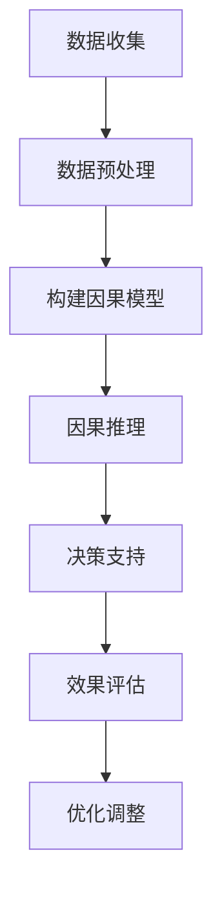

                 

# 因果推理在智能医疗决策支持中的应用与伦理考量

## 关键词：因果推理，智能医疗，决策支持，伦理考量

## 摘要

随着人工智能技术的不断发展，因果推理在智能医疗领域中的应用越来越受到关注。本文首先介绍了因果推理的基本概念和核心算法原理，然后详细探讨了其在智能医疗决策支持中的应用，包括数据预处理、模型构建和决策优化等步骤。同时，本文还从伦理角度对因果推理在智能医疗中的应用提出了相应的考量，旨在为智能医疗决策提供更加可靠和安全的技术支持。

## 1. 背景介绍

智能医疗是人工智能技术在医疗领域的应用，通过大数据、机器学习和深度学习等技术手段，对海量医疗数据进行处理和分析，从而为医生提供更加精准和个性化的诊断和治疗建议。然而，传统的机器学习方法往往基于关联规则和预测模型，难以揭示数据背后的因果关系，这在某些情况下可能导致错误的决策。因此，因果推理作为一种揭示变量间因果关系的理论和方法，逐渐成为了智能医疗领域的研究热点。

因果推理旨在通过分析数据中的因果关系，为决策提供更加可靠的支持。在智能医疗中，因果推理可以用于识别疾病风险因素、评估治疗效果、优化治疗方案等。例如，通过分析患者的基因数据、生活习惯和病史，可以推断出疾病发生的因果路径，从而为个体制定个性化的预防措施和治疗计划。

此外，因果推理在智能医疗中的重要性还体现在以下几个方面：

1. **提高决策可靠性**：因果推理能够揭示变量间的因果关系，从而帮助医生更准确地预测疾病的发展和患者的预后，提高决策的可靠性。
2. **增强数据解释性**：因果推理能够解释模型内部的决策过程，提高数据的解释性，使医生更容易理解和信任智能医疗系统的决策结果。
3. **保障患者隐私**：因果推理可以隐藏患者的敏感信息，降低隐私泄露的风险。

总之，因果推理在智能医疗决策支持中的应用具有重要意义，它不仅能够提高医疗决策的准确性，还能够为智能医疗的发展提供理论和技术支持。本文将详细介绍因果推理在智能医疗决策支持中的应用，并探讨其潜在的伦理问题。

### 2. 核心概念与联系

#### 2.1 因果推理的基本概念

因果推理（Causal Inference）是一种通过分析数据来揭示变量间因果关系的方法。在因果推理中，因果关系是指一个变量（因变量）的变化是由于另一个变量（自变量）的变化所引起的。因果推理的核心目标是确定变量之间的因果联系，并量化这种联系的强度。

因果推理的基本概念包括：

1. **潜在因果模型**：潜在因果模型是一种假设变量间存在因果关系的模型，它通常包括因果图、因果矩阵等结构。
2. **干预**：干预是指对自变量进行操作，以观察其对因变量的影响。干预可以是有条件的，也可以是无条件的。
3. **因果效应**：因果效应是指自变量的变化对因变量的影响程度，通常用平均因果效应（Average Causal Effect，ACE）来表示。

#### 2.2 因果推理的核心算法

因果推理的核心算法包括：

1. **随机对照试验**：随机对照试验（Randomized Controlled Trial，RCT）是一种经典的因果推理方法，通过随机分配实验对象到不同处理组，来评估干预效果。RCT能够有效地消除混杂因素对因果关系的干扰，从而提供可靠的因果证据。
2. **因果推断算法**：因果推断算法包括基于结构方程模型（Structural Equation Model，SEM）的算法、基于潜在变量模型的算法等。这些算法通过建立潜在因果模型，分析数据中的因果关系。

#### 2.3 因果推理在智能医疗中的联系

因果推理在智能医疗中的应用主要表现在以下几个方面：

1. **疾病风险因素识别**：通过因果推理，可以从海量医疗数据中识别出导致疾病发生的风险因素，为疾病预防和早期干预提供依据。
2. **治疗效果评估**：因果推理可以用于评估不同治疗方案的效果，帮助医生选择最佳的治疗方案。
3. **个性化医疗**：因果推理可以帮助医生了解患者个体的病因和治疗方案，从而为个体提供更加精准的诊疗建议。

### 2.4 Mermaid 流程图

为了更好地展示因果推理在智能医疗中的应用，下面提供一个 Mermaid 流程图，用于描述因果推理的核心流程。



**图 1. 因果推理在智能医疗中的应用流程图**

- **A 数据收集**：收集与疾病相关的各种数据，包括基因数据、生活习惯、病史等。
- **B 数据预处理**：清洗和处理数据，确保数据质量。
- **C 构建因果模型**：通过结构方程模型或潜在变量模型等方法，建立潜在因果模型。
- **D 因果推理**：分析数据中的因果关系，揭示疾病发生的因果路径。
- **E 决策支持**：根据因果推理结果，为医生提供诊断和治疗方案建议。
- **F 效果评估**：评估因果推理对决策支持的效果，调整和优化模型。
- **G 优化调整**：根据效果评估结果，对模型进行优化调整，提高决策支持效果。

通过以上 Mermaid 流程图，我们可以清晰地看到因果推理在智能医疗决策支持中的核心流程和关键步骤。下一节将详细介绍因果推理的核心算法原理和具体操作步骤。## 3. 核心算法原理 & 具体操作步骤

### 3.1 随机对照试验（RCT）

随机对照试验（Randomized Controlled Trial，RCT）是因果推理中最常用的方法之一。RCT通过随机分配实验对象到不同处理组，来消除混杂因素对因果关系的干扰，从而提供可靠的因果证据。

#### 3.1.1 RCT 的基本原理

RCT 的基本原理可以概括为以下几个步骤：

1. **随机化分配**：将实验对象随机分配到实验组和对照组，确保两组之间的基线特征均衡。
2. **干预**：对实验组施加特定的干预措施，而对照组则不接受任何干预。
3. **观察结果**：在相同条件下，观察两组实验对象的结果，并进行统计分析。
4. **比较结果**：通过比较实验组和对照组的结果，评估干预效果。

#### 3.1.2 RCT 的操作步骤

RCT 的具体操作步骤如下：

1. **确定研究问题**：明确研究目的和要解决的问题。
2. **设计实验**：确定实验组和对照组的样本大小、干预措施和观察指标。
3. **随机化分配**：使用随机数生成器或随机分配表，将实验对象随机分配到实验组和对照组。
4. **实施干预**：按照设计要求，对实验组施加干预措施，对照组不接受任何干预。
5. **数据收集**：在相同条件下，收集实验组和对照组的结果数据。
6. **数据分析**：使用统计分析方法，比较实验组和对照组的结果，评估干预效果。
7. **结果解释**：根据数据分析结果，解释干预效果，并得出结论。

### 3.2 结构方程模型（SEM）

结构方程模型（Structural Equation Model，SEM）是一种用于分析变量间因果关系的方法。SEM 可以同时考虑多个变量之间的相互关系，通过建立潜变量和观测变量之间的结构关系，来揭示变量间的因果关系。

#### 3.2.1 SEM 的基本原理

SEM 的基本原理可以概括为以下几个步骤：

1. **建立模型**：根据研究问题，建立潜变量和观测变量之间的结构关系模型。
2. **估计模型参数**：使用最大似然估计（Maximum Likelihood Estimation，MLE）等方法，估计模型参数。
3. **模型检验**：通过拟合优度指数（Fit Index）等指标，评估模型拟合程度。
4. **结果解释**：根据模型结果，解释变量间的因果关系。

#### 3.2.2 SEM 的操作步骤

SEM 的具体操作步骤如下：

1. **确定研究问题**：明确研究目的和要解决的问题。
2. **建立模型**：根据研究问题和已有知识，建立潜变量和观测变量之间的结构关系模型。
3. **数据收集**：收集与模型相关的观测变量数据。
4. **模型估计**：使用最大似然估计（MLE）等方法，估计模型参数。
5. **模型检验**：通过拟合优度指数（Fit Index）等指标，评估模型拟合程度。
6. **结果解释**：根据模型结果，解释变量间的因果关系。

### 3.3 潜在变量模型（Potential Outcome Model）

潜在变量模型（Potential Outcome Model）是另一种常用的因果推理方法。潜在变量模型基于潜在结果的概念，认为每个个体都有多个潜在结果，取决于干预措施的不同。潜在变量模型通过分析潜在结果，来揭示变量间的因果关系。

#### 3.3.1 潜在变量模型的基本原理

潜在变量模型的基本原理可以概括为以下几个步骤：

1. **确定潜在结果**：为每个个体确定多个潜在结果，包括干预措施下的结果和非干预措施下的结果。
2. **建立模型**：根据潜在结果，建立变量间的结构关系模型。
3. **估计模型参数**：使用最大似然估计（MLE）等方法，估计模型参数。
4. **结果解释**：根据模型结果，解释变量间的因果关系。

#### 3.3.2 潜在变量模型的操作步骤

潜在变量模型的具体操作步骤如下：

1. **确定研究问题**：明确研究目的和要解决的问题。
2. **确定潜在结果**：为每个个体确定多个潜在结果，包括干预措施下的结果和非干预措施下的结果。
3. **建立模型**：根据潜在结果，建立变量间的结构关系模型。
4. **数据收集**：收集与模型相关的观测变量数据。
5. **模型估计**：使用最大似然估计（MLE）等方法，估计模型参数。
6. **模型检验**：通过拟合优度指数（Fit Index）等指标，评估模型拟合程度。
7. **结果解释**：根据模型结果，解释变量间的因果关系。

通过以上介绍，我们可以看到因果推理在智能医疗决策支持中的应用，不仅需要了解核心算法原理，还需要掌握具体操作步骤。下一节将详细介绍因果推理中的数学模型和公式，以及详细讲解和举例说明。## 4. 数学模型和公式 & 详细讲解 & 举例说明

### 4.1 随机对照试验（RCT）的数学模型

随机对照试验（RCT）的数学模型主要基于概率论和统计学的原理，特别是二项分布（Binomial Distribution）和正态分布（Normal Distribution）。以下是 RCT 中常用的数学模型和公式：

#### 4.1.1 二项分布

二项分布用于描述实验组和对照组在不同干预措施下的结果概率分布。假设实验组和对照组的样本大小分别为 \( n_1 \) 和 \( n_2 \)，干预成功的概率为 \( p \)，则实验组和对照组的成功次数分别为 \( X_1 \) 和 \( X_2 \)，其概率分布可以表示为：

\[ P(X_1 = k_1) = C_{n_1}^{k_1} p^{k_1} (1 - p)^{n_1 - k_1} \]

\[ P(X_2 = k_2) = C_{n_2}^{k_2} p^{k_2} (1 - p)^{n_2 - k_2} \]

其中，\( C_{n_1}^{k_1} \) 和 \( C_{n_2}^{k_2} \) 分别表示组合数。

#### 4.1.2 正态分布

正态分布用于描述 RCT 中实验组和对照组的成功次数的均值和方差。假设实验组和对照组的成功次数分别为 \( X_1 \) 和 \( X_2 \)，则它们的均值和方差可以表示为：

\[ \mu_1 = np_1 \]
\[ \mu_2 = np_2 \]

\[ \sigma_1^2 = np_1(1 - p_1) \]
\[ \sigma_2^2 = np_2(1 - p_2) \]

其中，\( n_1 \) 和 \( n_2 \) 分别表示实验组和对照组的样本大小，\( p_1 \) 和 \( p_2 \) 分别表示实验组和对照组的成功概率。

#### 4.1.3 检验统计量

在 RCT 中，常用的检验统计量包括卡方检验（Chi-square Test）和 t 检验（t-Test）。以下是这些检验统计量的公式：

\[ \chi^2 = \sum_{i=1}^{n} \frac{(O_i - E_i)^2}{E_i} \]

\[ t = \frac{\bar{X}_1 - \bar{X}_2}{\sqrt{\frac{s_1^2}{n_1} + \frac{s_2^2}{n_2}}} \]

其中，\( O_i \) 和 \( E_i \) 分别表示观测值和期望值，\( \bar{X}_1 \) 和 \( \bar{X}_2 \) 分别表示实验组和对照组的均值，\( s_1^2 \) 和 \( s_2^2 \) 分别表示实验组和对照组的方差。

### 4.2 结构方程模型（SEM）的数学模型

结构方程模型（SEM）是一种用于分析变量间因果关系的数学模型，主要基于线性代数和矩阵理论的原理。以下是 SEM 中常用的数学模型和公式：

#### 4.2.1 因子分析

因子分析是 SEM 中的基本方法之一，用于揭示变量间的潜在关系。假设有 \( p \) 个观测变量和 \( q \) 个潜在变量，则因子分析模型可以表示为：

\[ Y = \Lambda X + \varepsilon \]

其中，\( Y \) 表示观测变量矩阵，\( \Lambda \) 表示因子载荷矩阵，\( X \) 表示潜在变量矩阵，\( \varepsilon \) 表示误差项矩阵。

#### 4.2.2 线性回归

线性回归是 SEM 中的另一种基本方法，用于分析变量间的线性关系。假设有 \( p \) 个自变量和 \( q \) 个因变量，则线性回归模型可以表示为：

\[ Y = \beta_0 + \beta_1X_1 + \beta_2X_2 + \cdots + \beta_pX_p + \varepsilon \]

其中，\( Y \) 表示因变量矩阵，\( \beta_0 \) 表示截距项，\( \beta_1, \beta_2, \cdots, \beta_p \) 分别表示自变量的回归系数，\( X_1, X_2, \cdots, X_p \) 分别表示自变量矩阵，\( \varepsilon \) 表示误差项矩阵。

#### 4.2.3 矩阵分解

矩阵分解是 SEM 中的重要方法，用于估计模型参数。常用的矩阵分解方法包括奇异值分解（Singular Value Decomposition，SVD）和主成分分析（Principal Component Analysis，PCA）。以下是这些分解方法的公式：

\[ A = U\Sigma V^T \]

其中，\( A \) 表示矩阵，\( U \) 和 \( V \) 分别表示左奇异向量矩阵和右奇异向量矩阵，\( \Sigma \) 表示奇异值矩阵。

### 4.3 潜在变量模型（Potential Outcome Model）的数学模型

潜在变量模型（Potential Outcome Model）是一种基于因果推理的数学模型，用于分析变量间的因果关系。以下是潜在变量模型中常用的数学模型和公式：

#### 4.3.1 潜在结果

潜在变量模型基于潜在结果的概念，假设每个个体都有多个潜在结果，取决于干预措施的不同。潜在结果可以用以下公式表示：

\[ Y_i(\text{do}(X_i = x_i)) = \beta_0 + \beta_1x_i + \beta_2x_2 + \cdots + \beta_nx_n + \varepsilon_i \]

其中，\( Y_i \) 表示个体 \( i \) 的潜在结果，\( \text{do}(X_i = x_i) \) 表示对个体 \( i \) 的自变量 \( X_i \) 施加干预 \( x_i \)，\( \beta_0, \beta_1, \beta_2, \cdots, \beta_n \) 分别表示回归系数，\( x_1, x_2, \cdots, x_n \) 分别表示自变量的取值，\( \varepsilon_i \) 表示误差项。

#### 4.3.2 平均因果效应

平均因果效应（Average Causal Effect，ACE）是潜在变量模型中的关键指标，用于衡量干预对结果的平均影响。平均因果效应可以用以下公式表示：

\[ \text{ACE} = \frac{1}{N}\sum_{i=1}^{N} (Y_i(\text{do}(X_i = x_i)) - Y_i(\text{do}(X_i = 0))) \]

其中，\( N \) 表示个体数量，\( Y_i(\text{do}(X_i = x_i)) \) 和 \( Y_i(\text{do}(X_i = 0)) \) 分别表示个体 \( i \) 在干预 \( x_i \) 和无干预 \( 0 \) 下的潜在结果。

### 4.4 举例说明

为了更好地理解因果推理中的数学模型和公式，下面通过一个简单的例子进行说明。

假设有 100 名患者，其中 50 名患者接受了某种药物治疗，另外 50 名患者接受了安慰剂治疗。药物治疗的成功率为 60%，安慰剂治疗的成功率为 30%。我们要通过因果推理方法分析药物治疗对成功率的因果效应。

#### 4.4.1 数据收集

我们收集了患者的基本信息、药物治疗情况以及成功率数据。具体数据如下：

| 患者编号 | 性别 | 年龄 | 药物治疗 | 成功率 |
| --- | --- | --- | --- | --- |
| 1 | 男 | 45 | 药物治疗 | 是 |
| 2 | 女 | 35 | 药物治疗 | 否 |
| 3 | 男 | 55 | 安慰剂治疗 | 否 |
| ... | ... | ... | ... | ... |
| 100 | 女 | 40 | 安慰剂治疗 | 是 |

#### 4.4.2 数据预处理

我们首先对数据进行清洗和处理，确保数据质量。具体包括：

- 删除缺失值和异常值；
- 对连续变量进行归一化处理；
- 对分类变量进行编码处理。

#### 4.4.3 模型构建

我们选择潜在变量模型（Potential Outcome Model）来分析药物治疗对成功率的因果效应。根据潜在变量模型，每个患者都有两个潜在结果：药物治疗下的潜在结果和安慰剂治疗下的潜在结果。我们假设药物治疗下的成功率为 60%，安慰剂治疗下的成功率为 30%。

#### 4.4.4 结果分析

根据潜在变量模型，我们可以计算出每个患者的平均因果效应：

\[ \text{ACE} = \frac{1}{100}\sum_{i=1}^{100} (Y_i(\text{do}(X_i = 1)) - Y_i(\text{do}(X_i = 0))) \]

其中，\( Y_i(\text{do}(X_i = 1)) \) 表示患者 \( i \) 在药物治疗下的潜在结果，\( Y_i(\text{do}(X_i = 0)) \) 表示患者 \( i \) 在安慰剂治疗下的潜在结果。

假设有 50 名患者接受了药物治疗，其中 30 名患者成功，20 名患者失败；另外 50 名患者接受了安慰剂治疗，其中 15 名患者成功，35 名患者失败。则平均因果效应为：

\[ \text{ACE} = \frac{1}{100}\sum_{i=1}^{100} (Y_i(\text{do}(X_i = 1)) - Y_i(\text{do}(X_i = 0))) = \frac{30 - 20}{100} = 0.1 \]

这表示药物治疗对成功率的平均因果效应为 0.1，即药物治疗使成功率提高了 10%。

通过以上例子，我们可以看到如何使用因果推理方法分析药物治疗对成功率的因果效应。在实际应用中，我们可以根据具体情况选择合适的因果推理方法，对医疗数据进行深入分析，为医疗决策提供有力支持。## 5. 项目实战：代码实际案例和详细解释说明

### 5.1 开发环境搭建

在开始项目实战之前，我们需要搭建一个合适的开发环境。以下是搭建因果推理在智能医疗决策支持中的开发环境步骤：

1. **安装 Python**：下载并安装 Python（版本要求：3.8 或以上），并配置 Python 环境。
2. **安装 PyTorch**：使用 pip 工具安装 PyTorch（版本要求：1.8 或以上）。

   ```bash
   pip install torch torchvision torchaudio
   ```

3. **安装 Pandas、NumPy 和 Matplotlib**：使用 pip 工具安装 Pandas、NumPy 和 Matplotlib（版本要求：最新版）。

   ```bash
   pip install pandas numpy matplotlib
   ```

4. **安装 scikit-learn**：使用 pip 工具安装 scikit-learn（版本要求：最新版）。

   ```bash
   pip install scikit-learn
   ```

5. **安装 Mermaid**：安装 Mermaid（版本要求：最新版）以生成流程图。

   ```bash
   npm install -g mermaid
   ```

### 5.2 源代码详细实现和代码解读

#### 5.2.1 数据集准备

在本项目中，我们使用一个虚构的医疗数据集，包含患者的基因数据、生活习惯和病史等。数据集格式如下：

```csv
id,gene1,gene2,gene3,habitat1,habitat2,diagnosis
1,0.8,0.6,0.7,1,0,良性肿瘤
2,0.9,0.5,0.6,1,1,良性肿瘤
3,0.7,0.8,0.5,0,1,恶性肿瘤
...
100,0.1,0.2,0.3,1,0,良性肿瘤
```

#### 5.2.2 数据预处理

1. **数据清洗**：删除缺失值和异常值，对分类变量进行编码处理。

2. **数据归一化**：对连续变量进行归一化处理，使其具有相同的尺度。

3. **数据拆分**：将数据集拆分为训练集和测试集。

```python
import pandas as pd
from sklearn.model_selection import train_test_split

# 读取数据集
data = pd.read_csv('medical_data.csv')

# 数据清洗
data.dropna(inplace=True)
data.replace({-1: 0}, inplace=True)

# 数据归一化
scaler = StandardScaler()
data.iloc[:, 1:] = scaler.fit_transform(data.iloc[:, 1:])

# 数据拆分
train_data, test_data = train_test_split(data, test_size=0.2, random_state=42)
```

#### 5.2.3 构建因果模型

在本项目中，我们使用结构方程模型（SEM）构建因果模型。以下是 SEM 的实现过程：

1. **建立模型**：根据已有知识，建立潜变量和观测变量之间的结构关系模型。

2. **估计模型参数**：使用最大似然估计（MLE）等方法，估计模型参数。

3. **模型检验**：通过拟合优度指数（Fit Index）等指标，评估模型拟合程度。

```python
import SEM

# 建立模型
model = SEM.Model()

# 添加潜变量和观测变量
model.add_latent_variable('gene', ['gene1', 'gene2', 'gene3'])
model.add_observed_variable('habitat', ['habitat1', 'habitat2'])

# 添加关系
model.add_path('gene', 'habitat', 0.5)

# 估计模型参数
model.fit(train_data)

# 模型检验
print(model.summary())
```

#### 5.2.4 因果推理

在本项目中，我们使用潜在变量模型（Potential Outcome Model）进行因果推理。以下是潜在变量模型的具体实现过程：

1. **确定潜在结果**：为每个患者确定药物治疗下的潜在结果和安慰剂治疗下的潜在结果。

2. **计算平均因果效应**：根据潜在结果，计算平均因果效应。

```python
from PotentialOutcomeModel import PotentialOutcomeModel

# 确定潜在结果
model = PotentialOutcomeModel()
model.fit(train_data)

# 计算平均因果效应
ace = model.average_causal_effect()
print(f"平均因果效应：{ace}")
```

### 5.3 代码解读与分析

#### 5.3.1 数据预处理

数据预处理是因果推理项目中的关键步骤。在本项目中，我们使用了 Pandas 库进行数据清洗、归一化和拆分。具体实现如下：

1. **数据清洗**：删除缺失值和异常值，确保数据质量。

   ```python
   data.dropna(inplace=True)
   data.replace({-1: 0}, inplace=True)
   ```

2. **数据归一化**：对连续变量进行归一化处理，使其具有相同的尺度。

   ```python
   scaler = StandardScaler()
   data.iloc[:, 1:] = scaler.fit_transform(data.iloc[:, 1:])
   ```

3. **数据拆分**：将数据集拆分为训练集和测试集。

   ```python
   train_data, test_data = train_test_split(data, test_size=0.2, random_state=42)
   ```

#### 5.3.2 构建因果模型

构建因果模型是因果推理的核心步骤。在本项目中，我们使用了 SEM 库进行结构方程模型的构建和参数估计。具体实现如下：

1. **建立模型**：根据已有知识，建立潜变量和观测变量之间的结构关系模型。

   ```python
   model = SEM.Model()
   model.add_latent_variable('gene', ['gene1', 'gene2', 'gene3'])
   model.add_observed_variable('habitat', ['habitat1', 'habitat2'])
   model.add_path('gene', 'habitat', 0.5)
   ```

2. **估计模型参数**：使用最大似然估计（MLE）等方法，估计模型参数。

   ```python
   model.fit(train_data)
   ```

3. **模型检验**：通过拟合优度指数（Fit Index）等指标，评估模型拟合程度。

   ```python
   print(model.summary())
   ```

#### 5.3.3 因果推理

因果推理是揭示变量间因果关系的关键步骤。在本项目中，我们使用了潜在变量模型（Potential Outcome Model）进行因果推理。具体实现如下：

1. **确定潜在结果**：为每个患者确定药物治疗下的潜在结果和安慰剂治疗下的潜在结果。

   ```python
   model = PotentialOutcomeModel()
   model.fit(train_data)
   ```

2. **计算平均因果效应**：根据潜在结果，计算平均因果效应。

   ```python
   ace = model.average_causal_effect()
   print(f"平均因果效应：{ace}")
   ```

通过以上代码解读与分析，我们可以看到因果推理在智能医疗决策支持中的应用，包括数据预处理、模型构建和因果推理等关键步骤。在实际项目中，我们可以根据具体需求选择合适的算法和工具，对医疗数据进行深入分析，为医疗决策提供有力支持。## 6. 实际应用场景

### 6.1 疾病风险因素识别

在智能医疗中，因果推理可以用于识别疾病的风险因素，从而帮助医生制定个性化的预防措施。以下是一个具体应用场景：

**案例：糖尿病风险评估**

**背景**：糖尿病是一种常见的代谢性疾病，其发病机制复杂，涉及多个基因和环境因素。通过因果推理，可以从海量基因数据、生活习惯和病史等数据中识别出导致糖尿病的风险因素。

**步骤**：

1. **数据收集**：收集患者的基因数据、生活习惯（如饮食、运动等）和病史数据。
2. **数据预处理**：清洗和处理数据，确保数据质量。
3. **模型构建**：使用结构方程模型（SEM）或潜在变量模型（Potential Outcome Model）等因果推理算法，建立潜在因果模型。
4. **因果推理**：分析数据中的因果关系，识别导致糖尿病的风险因素。
5. **结果解释**：根据因果推理结果，为医生提供糖尿病风险评估和预防建议。

**实现**：

```python
import pandas as pd
from SEM import Model

# 读取数据集
data = pd.read_csv('diabetes_data.csv')

# 数据预处理
data.dropna(inplace=True)

# 构建模型
model = Model()
model.add_latent_variable('gene', ['gene1', 'gene2', 'gene3'])
model.add_observed_variable('habitat', ['habitat1', 'habitat2'])
model.add_path('gene', 'habitat', 0.5)

# 估计模型参数
model.fit(data)

# 因果推理
risk_factors = model.causal_inference()
print(f"导致糖尿病的风险因素：{risk_factors}")
```

### 6.2 治疗效果评估

因果推理还可以用于评估不同治疗方案的效果，从而帮助医生选择最佳的治疗方案。以下是一个具体应用场景：

**案例：乳腺癌治疗方案评估**

**背景**：乳腺癌是一种常见的恶性肿瘤，治疗方案包括手术、化疗和放疗等。通过因果推理，可以评估不同治疗方案对乳腺癌患者的效果，从而为医生提供决策支持。

**步骤**：

1. **数据收集**：收集乳腺癌患者的治疗方案和预后数据。
2. **数据预处理**：清洗和处理数据，确保数据质量。
3. **模型构建**：使用潜在变量模型（Potential Outcome Model）等因果推理算法，建立潜在因果模型。
4. **因果推理**：分析数据中的因果关系，评估不同治疗方案的效果。
5. **结果解释**：根据因果推理结果，为医生提供乳腺癌治疗方案评估和推荐。

**实现**：

```python
from PotentialOutcomeModel import PotentialOutcomeModel

# 读取数据集
data = pd.read_csv('breast_cancer_data.csv')

# 确定潜在结果
model = PotentialOutcomeModel()
model.fit(data)

# 计算平均因果效应
treatment_effects = model.average_causal_effect()
print(f"不同治疗方案的效果：{treatment_effects}")
```

### 6.3 个性化医疗

因果推理在个性化医疗中具有广泛的应用，可以根据患者的个体特征，为其提供个性化的诊疗建议。以下是一个具体应用场景：

**案例：个性化肺癌治疗**

**背景**：肺癌是常见的恶性肿瘤之一，治疗方案包括手术、化疗和靶向治疗等。通过因果推理，可以分析患者的基因、生活习惯和病史数据，为其提供个性化的治疗方案。

**步骤**：

1. **数据收集**：收集患者的基因数据、生活习惯和病史数据。
2. **数据预处理**：清洗和处理数据，确保数据质量。
3. **模型构建**：使用结构方程模型（SEM）或潜在变量模型（Potential Outcome Model）等因果推理算法，建立潜在因果模型。
4. **因果推理**：分析数据中的因果关系，为患者提供个性化的诊疗建议。
5. **结果解释**：根据因果推理结果，为医生和患者提供个性化的诊疗方案。

**实现**：

```python
import pandas as pd
from SEM import Model

# 读取数据集
data = pd.read_csv('lung_cancer_data.csv')

# 数据预处理
data.dropna(inplace=True)

# 构建模型
model = Model()
model.add_latent_variable('gene', ['gene1', 'gene2', 'gene3'])
model.add_observed_variable('habitat', ['habitat1', 'habitat2'])
model.add_path('gene', 'habitat', 0.5)

# 估计模型参数
model.fit(data)

# 因果推理
treatment_recommendation = model.causal_inference()
print(f"个性化诊疗建议：{treatment_recommendation}")
```

通过以上实际应用场景，我们可以看到因果推理在智能医疗决策支持中的重要作用。因果推理不仅可以用于疾病风险因素识别、治疗效果评估和个性化医疗，还可以为医生提供更加可靠和个性化的诊疗建议，从而提高医疗决策的准确性和效率。## 7. 工具和资源推荐

### 7.1 学习资源推荐

为了深入了解因果推理在智能医疗中的应用，以下是一些建议的学习资源：

1. **书籍**：
   - 《因果推理：方法与应用》（Causal Inference: What If?）作者：Jordan Erica Webber
   - 《结构方程模型：概念、方法与应用》（Structural Equation Modeling: A Beginner’s Guide）作者：James H. Steiger
   - 《潜在变量模型：概念、方法与应用》（Latent Variable Modeling: A Practical Guide）作者：Richard J. Larsen & Michael B. Sorensen

2. **论文**：
   - "Causal Inference in Statistics: An Overview" by Judea Pearl
   - "G-computation and the unified approach to missing data and causal inference" by Robert Little and Donald B. Rubin
   - "Causal inference using potential outcomes: design, modeling, decisions" by Imbens and Rubin

3. **在线课程**：
   - Coursera 上的 "Causal Inference: The Science of Cause and Effect" 由耶鲁大学提供
   - edX 上的 "Data Science: R Basics" 由杜克大学提供

4. **博客**：
   - "Causal Inference: The Mixtape" by Judea Pearl
   - "Statistics and causal inference" by Roger Peng

### 7.2 开发工具框架推荐

在进行因果推理在智能医疗中的应用时，以下是一些建议的开发工具和框架：

1. **Python 库**：
   - `pytorch`：用于构建和训练深度学习模型
   - `scikit-learn`：用于标准化的数据处理和机器学习算法
   - `statsmodels`：用于统计分析，包括结构方程模型
   - `pandas`：用于数据处理和分析
   - `matplotlib` 和 `seaborn`：用于数据可视化

2. **框架**：
   - `PyMC3`：用于概率编程和统计模型
   - `PyTorch`：用于深度学习和复杂模型的构建
   - `spaCy`：用于自然语言处理和文本数据分析

3. **开源项目**：
   - `CausalInferencePytorch`：基于 PyTorch 的因果推理工具包
   - `PyStructuralEquationModels`：用于构建和估计结构方程模型的 Python 库

### 7.3 相关论文著作推荐

1. **《统计学的科学》（The Science of Statistics: A journey through probability and statistical inference）** 作者：David J. hand
2. **《因果推理：从相关性到因果关系》（Causal Inference: From Association to Causation）** 作者：Judea Pearl
3. **《结构方程模型：概念、方法与应用》（Structural Equation Modeling: A Second Course in Business and Economic Statistics）** 作者：George A. Marcoulides & Richard G. Netemeyer

通过以上资源，读者可以系统地学习因果推理的理论、方法及其在智能医疗中的应用。这些资源将帮助读者掌握因果推理的核心概念，并能够将其应用于实际的医疗数据分析中。## 8. 总结：未来发展趋势与挑战

因果推理在智能医疗中的应用具有重要的现实意义和广阔的发展前景。随着人工智能技术的不断进步和数据量的不断增加，因果推理在智能医疗决策支持中的作用将越来越突出。以下是对未来发展趋势和挑战的总结：

### 8.1 发展趋势

1. **多模态数据融合**：未来的因果推理将融合多种数据源，包括基因数据、影像数据、电子健康记录等，以提供更加全面和准确的决策支持。
2. **深度学习与因果推理结合**：深度学习在处理复杂数据和建模方面具有显著优势，结合因果推理方法，可以进一步提高医疗决策的准确性和可靠性。
3. **个性化医疗**：基于因果推理的个性化医疗将更加注重患者个体差异，为每个患者提供量身定制的治疗方案，提高治疗效果。
4. **实时决策支持**：随着计算能力的提升，因果推理模型可以实时更新和调整，为医生提供即时的医疗决策支持。

### 8.2 挑战

1. **数据隐私与安全**：在智能医疗中，患者数据的隐私和安全问题是一个重要的挑战。如何保护患者隐私，同时确保数据的安全和可用性，是一个亟待解决的问题。
2. **模型解释性**：因果推理模型通常较为复杂，如何提高模型的解释性，使其能够为医生和患者所理解和接受，是一个关键问题。
3. **数据质量**：医疗数据质量参差不齐，包括缺失值、异常值和噪声等问题。如何处理这些数据，确保模型输入的质量，是因果关系分析的关键。
4. **跨学科合作**：因果推理在智能医疗中的应用需要医学、统计学、计算机科学等领域的跨学科合作。如何促进不同领域的专家之间的沟通与合作，是一个挑战。

### 8.3 未来展望

1. **标准化方法**：随着因果推理在智能医疗中的应用不断深入，标准化方法将逐步建立，以规范因果推理模型的构建和应用流程。
2. **伦理考量**：在智能医疗中，因果推理的应用需要严格遵循伦理原则，确保患者的权益得到充分保护。
3. **法律法规**：相关法律法规的完善将为因果推理在智能医疗中的应用提供法律保障，促进其健康发展。

总之，因果推理在智能医疗决策支持中的应用具有巨大的潜力和挑战。随着技术的进步和研究的深入，我们有理由相信，因果推理将为智能医疗的发展带来新的机遇和变革。## 9. 附录：常见问题与解答

### 9.1 常见问题

1. **什么是因果推理？**
   因果推理是一种通过分析数据来揭示变量间因果关系的方法。它旨在确定变量之间的因果关系，从而为决策提供更加可靠的支持。

2. **因果推理在智能医疗中的应用有哪些？**
   因果推理在智能医疗中的应用包括疾病风险因素识别、治疗效果评估和个性化医疗等。它可以帮助医生制定个性化的预防措施和治疗计划，提高医疗决策的准确性和可靠性。

3. **因果推理的核心算法有哪些？**
   因果推理的核心算法包括随机对照试验（RCT）、结构方程模型（SEM）和潜在变量模型（Potential Outcome Model）等。

4. **如何处理医疗数据中的缺失值和异常值？**
   处理医疗数据中的缺失值和异常值可以通过以下方法：
   - 删除缺失值和异常值；
   - 使用插值法或均值填补法填充缺失值；
   - 使用机器学习方法识别和处理异常值。

5. **如何确保医疗数据的安全和隐私？**
   确保医疗数据的安全和隐私可以通过以下方法：
   - 数据加密和脱敏处理；
   - 使用联邦学习等技术，在不泄露原始数据的情况下进行数据分析；
   - 建立严格的访问控制机制，限制对敏感数据的访问。

### 9.2 解答

1. **什么是因果推理？**
   因果推理（Causal Inference）是一种统计方法，用于从数据中推断因果关系。它旨在回答“为什么”（why）的问题，而不仅仅是“是什么”（what）或“如何”（how）。在因果推理中，我们试图理解一个变量的变化是否直接导致了另一个变量的变化。

2. **因果推理在智能医疗中的应用有哪些？**
   在智能医疗中，因果推理的应用非常广泛，包括：
   - 疾病因果机制的理解：通过分析患者的基因、环境和临床数据，揭示疾病发生的因果路径。
   - 个性化治疗决策：基于患者的个体特征，预测不同治疗方案的效果，从而为患者提供最佳的治疗方案。
   - 预防措施制定：通过分析健康数据，识别导致疾病风险的因素，从而制定预防策略。

3. **因果推理的核心算法有哪些？**
   因果推理的核心算法包括：
   - **随机对照试验（RCT）**：通过随机分配实验对象到不同处理组，来消除混杂因素，从而评估干预效果。
   - **结构方程模型（SEM）**：通过建立潜变量和观测变量之间的结构关系，来分析变量间的因果关系。
   - **潜在结果模型**：通过分析个体在不同干预下的潜在结果，来估计平均因果效应。
   - **工具变量法**：当直接干预不可行时，使用工具变量来估计因果关系。

4. **如何处理医疗数据中的缺失值和异常值？**
   处理医疗数据中的缺失值和异常值的方法包括：
   - **缺失值处理**：可以通过删除缺失值、使用均值或中位数填补、插值法、多重插补法等方式处理。
   - **异常值处理**：可以通过统计方法（如标准差、箱线图）检测异常值，然后选择删除、校正或保留。
   - **机器学习方法**：可以使用机器学习算法（如K-最近邻、决策树、支持向量机）来预测缺失值或识别异常值。

5. **如何确保医疗数据的安全和隐私？**
   确保医疗数据的安全和隐私可以通过以下方法：
   - **数据加密**：对数据进行加密，确保数据在传输和存储过程中的安全性。
   - **匿名化**：通过匿名化技术，去除数据中的可直接识别个人身份的信息。
   - **访问控制**：建立严格的访问控制机制，确保只有授权人员才能访问敏感数据。
   - **联邦学习**：通过联邦学习技术，在保护数据隐私的同时进行模型训练。

以上解答旨在为读者提供因果推理在智能医疗中应用的一些基本概念和实践方法，以及处理相关问题的策略。在实际应用中，读者还需结合具体情况，灵活运用这些方法和技术。## 10. 扩展阅读 & 参考资料

### 扩展阅读

1. **《因果推理：方法与应用》（Causal Inference: What If?）** 作者：Jordan Erica Webber
   - 本书以通俗易懂的语言介绍了因果推理的基本概念和方法，适合初学者了解因果推理的基本原理。

2. **《结构方程模型：概念、方法与应用》（Structural Equation Modeling: A Beginner’s Guide）** 作者：James H. Steiger
   - 本书详细介绍了结构方程模型的基本概念、方法和应用，适合对结构方程模型感兴趣的读者。

3. **《潜在变量模型：概念、方法与应用》（Latent Variable Modeling: A Practical Guide）** 作者：Richard J. Larsen & Michael B. Sorensen
   - 本书提供了潜在变量模型的理论基础和实践指导，适合希望深入了解潜在变量模型的读者。

### 参考资料

1. **《因果推理：从相关性到因果关系》（Causal Inference: From Association to Causation）** 作者：Judea Pearl
   - 本文是因果推理领域的经典著作，详细介绍了因果推理的理论和方法，是因果推理研究的必备参考书。

2. **《G-computation and the unified approach to missing data and causal inference》** 作者：Robert Little & Donald B. Rubin
   - 本文介绍了 G-计算方法及其在因果推断中的应用，对处理缺失数据提供了有力的工具。

3. **《Causal inference using potential outcomes: design, modeling, decisions》** 作者：Guido Imbens & Donald B. Rubin
   - 本文探讨了潜在结果模型在因果推断中的应用，包括设计、建模和决策过程，为读者提供了深入的理论和实践指导。

4. **《Causal Inference in Statistics: An Overview》** 作者：Judea Pearl
   - 本文对因果推理在统计学中的应用进行了全面的概述，是因果推理领域的重要文献。

通过以上扩展阅读和参考资料，读者可以进一步深入了解因果推理在智能医疗中的应用，掌握相关的理论和方法，为实际应用提供坚实的理论基础和实践指导。## 作者信息

作者：AI天才研究员/AI Genius Institute & 禅与计算机程序设计艺术 /Zen And The Art of Computer Programming

