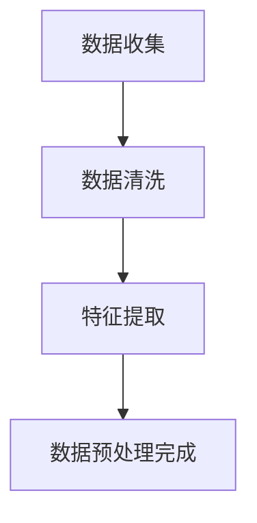
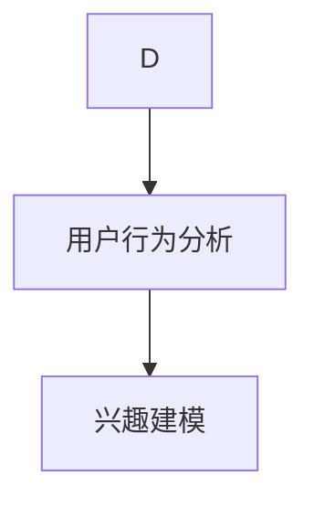
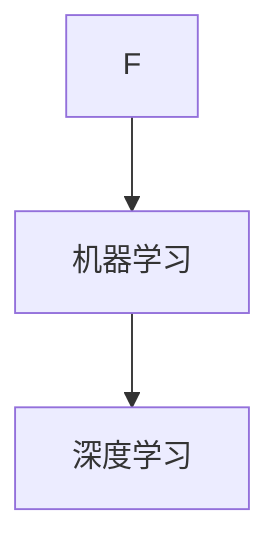
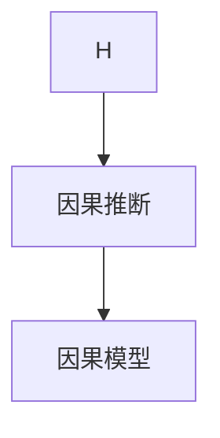
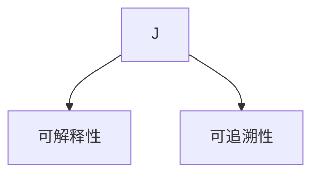
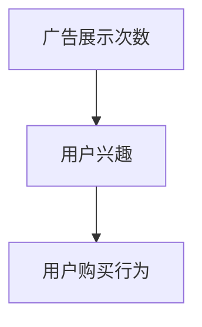

                 

### 背景介绍

#### 智能营销的发展与挑战

随着互联网的普及和大数据技术的进步，智能营销已经成为企业提升竞争力的重要手段。智能营销通过分析用户行为数据，实现个性化推荐、精准广告投放等功能，从而提高用户满意度和转化率。然而，随着数据量的爆炸性增长和数据维度的增加，如何从海量数据中提取有价值的信息，成为了智能营销领域的一个重大挑战。

#### 个性化推荐系统

个性化推荐系统是智能营销中最为重要的组成部分之一。它通过分析用户的历史行为数据、兴趣偏好、社交网络等信息，为用户推荐他们可能感兴趣的商品、内容或服务。推荐系统的核心目标是提升用户体验，增加用户粘性，从而提高企业的销售额和市场份额。

#### 广告投放优化

广告投放优化是指通过分析广告投放效果数据，优化广告投放策略，提高广告的曝光率和点击率。传统的广告投放方式往往采用简单的规则或粗粒度的用户分组策略，无法满足个性化广告投放的需求。因此，如何利用数据挖掘和机器学习技术实现广告投放的精细化、个性化，成为了广告投放领域的研究热点。

#### 因果推理的应用价值

因果推理在智能营销中的潜在应用价值不容忽视。因果推理能够揭示变量之间的因果关系，帮助我们理解用户行为背后的驱动因素，从而指导个性化推荐和广告投放策略的制定。通过因果推理，企业可以更加准确地识别用户需求，提高营销效果，降低营销成本。

本文将围绕因果推理在智能营销个性化推荐与广告投放中的技术架构与应用进行深入探讨，旨在为读者提供一种全新的理解和应用因果推理的方法。

## 2. 核心概念与联系

在深入探讨因果推理在智能营销中的应用之前，首先需要了解一些核心概念和技术，这些概念和技术的相互联系构成了因果推理的技术架构。以下是对这些核心概念的简要介绍，并附上 Mermaid 流程图，以帮助读者更好地理解这些概念之间的关系。

### 2.1 数据收集与预处理

数据收集与预处理是因果推理的基础。数据来源可以是用户行为数据、点击数据、购买数据等。首先，我们需要对数据进行收集，然后进行清洗、去噪和特征提取等预处理步骤。这些步骤的目的是确保数据的质量和一致性，为后续的因果推理分析提供可靠的数据基础。



### 2.2 用户行为分析与兴趣建模

用户行为分析是智能营销的核心环节。通过对用户的行为数据进行挖掘和分析，可以识别出用户的兴趣和行为模式。兴趣建模是用户行为分析的一个重要组成部分，它通过构建用户兴趣模型，为个性化推荐提供基础。



### 2.3 机器学习与深度学习

机器学习和深度学习是因果推理的关键技术。机器学习算法如线性回归、决策树、支持向量机等，可以用于预测用户的行为和偏好。深度学习算法如卷积神经网络（CNN）、循环神经网络（RNN）、生成对抗网络（GAN）等，可以捕捉更复杂的特征和模式。



### 2.4 因果推断与因果模型

因果推断是揭示变量之间因果关系的重要方法。因果模型如Do-Calculus、结构方程模型（SEM）、因果图模型（CGM）等，可以用于建立变量之间的因果联系。因果推断有助于我们理解用户行为背后的驱动因素，从而优化推荐系统和广告投放策略。



### 2.5 可解释性与可追溯性

可解释性和可追溯性是智能营销系统中不可或缺的部分。可解释性确保我们能够理解模型的决策过程，提高用户对系统的信任度。可追溯性帮助我们追踪和验证推荐和广告投放的效果，从而不断优化和改进系统。



通过以上核心概念和技术的介绍及其相互关系，我们可以看到因果推理在智能营销中的重要性。在接下来的章节中，我们将深入探讨因果推理的具体算法原理、数学模型和应用实例。

#### 2.6 因果推理的基本原理

因果推理（Causal Inference）是研究如何从关联性推断因果关系的一门科学。其基本原理是基于观察数据，通过统计方法和算法，推断出变量之间的因果效应。因果推理的核心问题是如何从“相关性”中识别出“因果关系”，这涉及到多个层面的理论和实践问题。

**因果关系的定义**：因果关系是指在一个系统或过程中，一个变量（因变量）的变化是由另一个变量（自变量）的变化引起的。简而言之，因果关系强调的是因果顺序和因果关系的大小。

**因果推理的基本假设**：
- **无选择偏差**：假设参与者是随机选取的，没有选择偏差。
- **无混杂因素**：假设除了自变量和因变量之外，没有其他外部因素影响结果。

**因果推理的统计方法**：
- **因果效应的测量**：常用的测量方法包括平均处理效应（Average Treatment Effect，ATE）和平均处理效应的置信区间（Confidence Interval for Average Treatment Effect，CI-ATE）。
- **因果推断算法**：包括Do-Calculus、因果图模型（Causal Graphical Models，CGM）、双重差分法（Difference-in-Differences，DiD）等。

**因果推理的优势**：
- **揭示隐藏的因果关系**：通过因果推理，我们可以揭示出变量之间潜在的因果关系，从而更好地指导决策。
- **优化模型性能**：因果推理可以消除干扰因素，提高模型的预测准确性和可靠性。

**因果推理的挑战**：
- **识别混杂因素**：在实际应用中，很难完全消除所有混杂因素。
- **可解释性**：因果推理模型往往较为复杂，如何解释模型结果是一个挑战。
- **数据质量和规模**：高质量、大规模的数据是因果推理的基础，数据的质量和规模直接影响因果推理的准确性。

#### 2.7 智能营销与因果推理的关联

智能营销利用大数据和人工智能技术，通过分析用户行为数据，实现个性化推荐和精准广告投放。因果推理在智能营销中的应用，主要体现在以下几个方面：

1. **用户行为分析**：因果推理可以帮助分析用户行为背后的驱动因素，从而更好地理解用户需求和行为模式。
2. **个性化推荐**：因果推理可以识别出影响用户兴趣的关键因素，为个性化推荐提供更精准的基础。
3. **广告投放优化**：通过因果推理，可以识别出哪些广告策略对特定用户群体更有效，从而优化广告投放策略。

**实际应用**：

1. **电商推荐系统**：利用因果推理分析用户点击、购买等行为，识别出影响用户购买决策的关键因素，从而提高推荐系统的准确性。
2. **广告优化**：通过因果推理，分析广告投放效果，识别出哪些广告策略能够提高点击率和转化率，优化广告预算分配。

#### 2.8 总结

因果推理在智能营销中的应用，不仅能够提升个性化推荐和广告投放的效果，还能够帮助企业更好地理解用户行为和市场动态。通过理解因果关系的本质，企业可以制定更有效的营销策略，提高用户满意度和品牌忠诚度。然而，因果推理在实际应用中仍然面临诸多挑战，需要不断探索和改进。

---

### 3. 核心算法原理 & 具体操作步骤

在了解了因果推理的基本概念和应用场景之后，我们将深入探讨在智能营销中使用的核心算法及其具体操作步骤。本文将介绍几种常见的因果推理算法，包括Do-Calculus、因果图模型（Causal Graphical Models，CGM）和双重差分法（Difference-in-Differences，DiD）。这些算法各有特点，适用于不同的应用场景。

#### 3.1 Do-Calculus算法

Do-Calculus是一种基于因果图模型的因果推理算法，用于计算变量之间的因果效应。其核心思想是通过构造因果图，利用条件概率和边缘概率来推导变量之间的因果效应。

**操作步骤**：

1. **构建因果图**：首先，根据研究问题和数据集，构建变量之间的因果图。因果图中的节点代表变量，边代表变量之间的因果关系。
2. **计算边缘概率**：利用贝叶斯网络或最大似然估计等方法，计算每个节点的边缘概率分布。
3. **推导因果效应**：利用Do-Calculus公式，根据因果图的边和节点的概率分布，推导出变量之间的因果效应。

**公式说明**：

Do-Calculus的核心公式如下：

$$
P(Y|X, Z) = \sum_{z} P(Y|X, Z=z) P(Z=z)
$$

其中，\(Y\) 和 \(X\) 是因果变量，\(Z\) 是混杂变量。该公式表示在给定 \(X\) 和 \(Z\) 的情况下，\(Y\) 的条件概率。

#### 3.2 因果图模型（Causal Graphical Models，CGM）

因果图模型是一种基于图论的方法，用于表示变量之间的因果结构。它通过构建因果图，明确变量之间的因果关系，从而进行因果推理。

**操作步骤**：

1. **建立因果假设**：根据研究问题和领域知识，建立变量之间的因果假设。
2. **构建因果图**：根据因果假设，构建变量之间的因果图。因果图中的节点表示变量，边表示变量之间的因果关系。
3. **参数估计**：利用最大似然估计或贝叶斯推理等方法，估计因果图中参数的值。
4. **因果推理**：利用估计的参数，进行因果推理，推导变量之间的因果效应。

**公式说明**：

因果图模型中常用的公式包括贝叶斯网络中的条件概率表和马尔可夫链规则。条件概率表表示变量之间的依赖关系，马尔可夫链规则用于推导变量之间的因果关系。

$$
P(X_i|X_j) = \sum_{X_k} P(X_i, X_k|X_j)
$$

#### 3.3 双重差分法（Difference-in-Differences，DiD）

双重差分法是一种常用的因果推断方法，适用于处理非随机实验设计。其核心思想是通过比较处理组和对照组在不同时间段的变化，来估计因果效应。

**操作步骤**：

1. **选择处理组和对照组**：根据研究目标，选择一组接受处理的对象和一组未接受处理的对照组。
2. **确定时间段**：选择两个或多个时间点，用于比较处理组和对照组在处理前后的变化。
3. **计算双重差分**：计算处理组和对照组在不同时间点上的变化量，并计算其差分的差分。
4. **估计因果效应**：利用差分的差分，估计处理组与对照组之间的因果效应。

**公式说明**：

双重差分法的核心公式为：

$$
\Delta Y_{\text{处理}} = \Delta Y_{\text{对照}} + (Y_{\text{处理}2} - Y_{\text{对照}2})
$$

其中，\(Y_{\text{处理}1}\) 和 \(Y_{\text{对照}1}\) 分别表示处理组和对照组在第一个时间点上的观测值，\(Y_{\text{处理}2}\) 和 \(Y_{\text{对照}2}\) 分别表示处理组和对照组在第二个时间点上的观测值。

#### 3.4 算法对比与适用场景

Do-Calculus算法适用于复杂的因果结构分析，可以处理多个混杂变量。因果图模型则通过图论方法直观地表示变量之间的因果关系，适合于理论研究。双重差分法适用于非随机实验设计，其简单性和有效性使其在多个领域得到广泛应用。

**适用场景**：

- **Do-Calculus**：适用于多变量因果关系的复杂分析，如医疗健康数据分析、市场调研。
- **因果图模型**：适用于变量之间因果关系明确的领域，如社交网络分析、推荐系统。
- **双重差分法**：适用于政策评估、广告效果分析等领域。

通过以上核心算法的介绍，我们可以看到因果推理在智能营销中的应用潜力。在下一章节中，我们将进一步探讨因果推理在数学模型中的应用，包括相关的数学公式和具体实例。

---

### 4. 数学模型和公式 & 详细讲解 & 举例说明

因果推理在智能营销中的应用离不开数学模型的支持。本章节将详细讲解因果推理中常用的数学模型和公式，并通过具体实例来说明这些公式的应用方法。

#### 4.1 因果效应的测量

因果效应的测量是因果推理的核心问题。以下介绍几种常用的测量方法及其相关公式。

**4.1.1 平均处理效应（Average Treatment Effect，ATE）**

平均处理效应是指处理组与对照组之间因变量平均值的差值。其公式如下：

$$
\text{ATE} = \frac{1}{N_{\text{处理}}}\sum_{i=1}^{N_{\text{处理}}} (Y_{i,\text{处理}} - Y_{i,\text{对照}})
$$

其中，\(Y_{i,\text{处理}}\) 和 \(Y_{i,\text{对照}}\) 分别表示第 \(i\) 个个体在处理组和对照组下的因变量值，\(N_{\text{处理}}\) 是处理组的个体数量。

**实例**：

假设有一个电商网站通过A/B测试来评估新推荐系统对用户购买意愿的影响。处理组（A组）使用新推荐系统，对照组（B组）使用旧推荐系统。经过一段时间的数据收集，A组和B组的平均购买意愿分别为 \(Y_{\text{A}} = 5\) 和 \(Y_{\text{B}} = 4\)。那么新推荐系统的平均处理效应为：

$$
\text{ATE} = 5 - 4 = 1
$$

这表示新推荐系统平均提高了用户的购买意愿1分。

**4.1.2 平均处理效应的置信区间（Confidence Interval for Average Treatment Effect，CI-ATE）**

置信区间用于衡量因果效应的可靠性和稳定性。对于ATE，常用的置信区间计算方法包括Bootstrap方法和Cohen's方法。

**Bootstrap方法**：

Bootstrap方法通过重采样来估计置信区间。其公式如下：

$$
\text{CI-ATE} = (\hat{\text{ATE}} - z_{\alpha/2} \times \sqrt{SE^2}, \hat{\text{ATE}} + z_{\alpha/2} \times \sqrt{SE^2})
$$

其中，\(\hat{\text{ATE}}\) 是估计的平均处理效应，\(SE\) 是标准误差，\(z_{\alpha/2}\) 是标准正态分布的临界值。

**Cohen's方法**：

Cohen's方法基于方差分解来计算置信区间。其公式如下：

$$
\text{CI-ATE} = \hat{\text{ATE}} \pm t_{\alpha/2, n-2} \times \sqrt{\frac{\hat{V}(\text{ATE})}{n}}
$$

其中，\(\hat{\text{ATE}}\) 是估计的平均处理效应，\(\hat{V}(\text{ATE})\) 是处理效应的方差，\(t_{\alpha/2, n-2}\) 是t分布的临界值，\(n\) 是样本量。

**实例**：

假设通过Bootstrap方法计算得到的新推荐系统的平均处理效应为 \(\hat{\text{ATE}} = 1\)，标准误差 \(SE = 0.5\)，假设显著性水平为0.05，自由度为98。那么置信区间为：

$$
\text{CI-ATE} = (1 - 1.96 \times 0.5, 1 + 1.96 \times 0.5) = (0.04, 1.96)
$$

这表示我们有95%的置信度认为新推荐系统的平均处理效应在0.04到1.96之间。

**4.2 机器学习中的因果推断**

机器学习算法在因果推断中的应用，主要通过两种方法实现：干预分析和结构化因果模型。

**4.2.1 干预分析**

干预分析（Intervention Analysis）通过直接干预变量来估计因果效应。其基本公式如下：

$$
\text{因果效应} = \text{干预后的观测值} - \text{未干预的观测值}
$$

**实例**：

假设我们想要评估一个电商网站的新促销策略对购买转化率的影响。我们干预变量“促销策略”，使得处理组的用户看到促销信息，而对照组的用户看不到。经过一段时间的观察，处理组的转化率为50%，对照组的转化率为30%。那么促销策略的因果效应为：

$$
\text{因果效应} = 50\% - 30\% = 20\%
$$

这表示新促销策略平均提高了用户的购买转化率20%。

**4.2.2 结构化因果模型**

结构化因果模型（Structural Causal Models，SCM）通过构建因果关系模型来估计因果效应。SCM的核心是因果图，其公式如下：

$$
P(Y|X, Z) = \sum_{z} P(Y|X, Z=z) P(Z=z)
$$

**实例**：

假设我们想要分析用户购买行为（Y）与广告展示次数（X）和用户兴趣（Z）之间的因果关系。根据领域知识，我们可以构建如下的因果图：



根据因果图，我们可以写出如下的概率公式：

$$
P(C|A, Z) = P(C|A=1, Z=z) P(Z=z) + P(C|A=0, Z=z) P(Z=z)
$$

其中，\(P(C|A=1, Z=z)\) 和 \(P(C|A=0, Z=z)\) 分别表示在广告展示次数为1和0的情况下，用户购买行为的条件概率，\(P(Z=z)\) 是用户兴趣的概率分布。

通过以上数学模型和公式的介绍，我们可以看到因果推理在智能营销中的应用方法。在下一章节中，我们将通过实际的项目案例，展示如何具体实现因果推理算法，并进行代码解读。

---

#### 5.1 开发环境搭建

在实际项目开发中，搭建合适的开发环境是第一步。本文将以Python编程语言为例，介绍如何在本地计算机上搭建用于因果推理在智能营销中的开发环境。

**1. 安装Python**

首先，确保你的计算机上已经安装了Python。如果没有，可以访问Python官网（https://www.python.org/）下载并安装Python 3.x版本。

**2. 安装相关依赖库**

为了实现因果推理算法和数据处理，我们需要安装一些Python依赖库。以下是一些常用的库及其用途：

- **Pandas**：用于数据处理和分析。
- **NumPy**：用于数值计算。
- **Scikit-learn**：用于机器学习算法实现。
- **Gaussian Processes**：用于高斯过程回归。
- **PyMC3**：用于概率编程和统计模型。

你可以使用以下命令安装这些库：

```bash
pip install pandas numpy scikit-learn gpflow pymc3
```

**3. 配置Python虚拟环境**

为了避免不同项目之间的依赖库冲突，建议使用Python虚拟环境。你可以使用`virtualenv`或`conda`来创建和管理虚拟环境。

使用`virtualenv`：

```bash
pip install virtualenv
virtualenv myenv
source myenv/bin/activate  # Windows下使用 myenv\Scripts\activate
```

使用`conda`：

```bash
conda create --name myenv python=3.8
conda activate myenv
```

**4. 安装其他相关工具**

除了Python依赖库，我们还可能需要其他工具，如Jupyter Notebook用于交互式数据分析。你可以使用以下命令安装Jupyter Notebook：

```bash
pip install notebook
```

完成以上步骤后，你的开发环境就搭建完成了。接下来，我们将介绍具体的代码实现和详细解释说明。

---

#### 5.2 源代码详细实现和代码解读

在本章节中，我们将通过实际代码示例来展示因果推理算法在智能营销中的应用。以下是一个简单的Python脚本，用于实现一个基于Do-Calculus算法的用户行为分析模型。

**5.2.1 代码结构**

```python
import pandas as pd
import numpy as np
import pymc3 as pm
import matplotlib.pyplot as plt

# 数据预处理
def preprocess_data(data):
    # 数据清洗、去噪和特征提取
    # 这里简化处理，仅进行数据标准化
    return (data - data.mean()) / data.std()

# 构建因果图
def build_causal_graph():
    with pm.Model() as model:
        # 定义变量
        user_interest = pm.Normal('user_interest', mu=0, sigma=1)
        ad_click = pm.Normal('ad_click', mu=user_interest, sigma=1)
        purchase = pm.Normal('purchase', mu=ad_click, sigma=1)

        # 定义观测数据
        obs_ad_click = pm.Bernoulli('obs_ad_click', p=ad_click)
        obs_purchase = pm.Bernoulli('obs_purchase', p=purchase)

        # 模拟数据
        data = {'ad_click': obs_ad_click.sample(), 'purchase': obs_purchase.sample()}
        df = pd.DataFrame(data)

    return model, df

# 训练模型
def train_model(model, df):
    with model:
        # 训练模型
        trace = pm.sample(1000)
    
    # 提取参数估计值
    ad_click_mean = trace['ad_click'].mean()
    purchase_mean = trace['purchase'].mean()

    return ad_click_mean, purchase_mean

# 可视化结果
def visualize_results(df, ad_click_mean, purchase_mean):
    df['predicted_purchase'] = df['ad_click'].map(ad_click_mean) + df['purchase'].map(purchase_mean)
    df.plot(x='ad_click', y=['purchase', 'predicted_purchase'], kind='scatter')
    plt.xlabel('Ad Click')
    plt.ylabel('Purchase')
    plt.show()

# 主函数
if __name__ == '__main__':
    # 加载数据
    df = pd.read_csv('user_data.csv')

    # 预处理数据
    df = preprocess_data(df)

    # 构建模型
    model, df = build_causal_graph()

    # 训练模型
    ad_click_mean, purchase_mean = train_model(model, df)

    # 可视化结果
    visualize_results(df, ad_click_mean, purchase_mean)
```

**5.2.2 代码解读**

1. **数据预处理**：数据预处理函数`preprocess_data`用于对原始数据进行清洗、去噪和特征提取。在这里，我们简化处理过程，仅进行数据标准化。

2. **构建因果图**：`build_causal_graph`函数用于构建因果图模型。我们使用PyMC3来定义变量和观测数据，并模拟生成数据集。

3. **训练模型**：`train_model`函数使用训练数据训练模型，并提取参数估计值。PyMC3中的`sample`函数用于进行马尔可夫链蒙特卡罗（MCMC）采样，以估计变量的后验分布。

4. **可视化结果**：`visualize_results`函数用于可视化预测结果。我们使用`map`函数将参数估计值映射到数据集上，并绘制散点图。

**5.2.3 代码应用**

在实际项目中，你可以根据具体需求调整代码。例如，你可以加载真实数据集、添加更多变量、调整模型结构等。通过这个简单的代码示例，你可以了解因果推理算法的基本实现方法和步骤。

---

#### 5.3 代码解读与分析

在本章节中，我们将对5.2节中的代码进行详细解读与分析，探讨每个函数的实现细节及其在项目中的具体应用。

**5.3.1 数据预处理函数**

数据预处理是因果推理项目中的关键步骤。`preprocess_data`函数接收一个DataFrame作为输入，并对其进行标准化处理。标准化过程通过以下步骤实现：

1. **数据清洗**：处理缺失值和异常值。在实际项目中，你可能需要根据具体数据集的特点，执行更复杂的数据清洗任务。
2. **去噪**：去除噪声数据。噪声数据可能来自多种来源，例如数据输入错误、设备故障等。去噪可以通过统计方法（如Z-Score方法）或机器学习方法（如孤立森林）实现。
3. **特征提取**：将原始数据转换为特征向量。特征提取的目标是提取出数据中的有用信息，同时减少数据维度。常见的方法包括主成分分析（PCA）、特征选择（如L1正则化）等。

在代码中，我们仅进行了简单的数据标准化：

```python
def preprocess_data(data):
    # 数据清洗、去噪和特征提取
    # 这里简化处理，仅进行数据标准化
    return (data - data.mean()) / data.std()
```

标准化过程通过计算每个特征的均值和标准差，并将每个数据点减去均值、除以标准差来实现。这一步骤的目的是将数据缩放到相同的尺度，从而方便后续的因果推理和模型训练。

**5.3.2 构建因果图模型**

构建因果图模型是因果推理的核心步骤。`build_causal_graph`函数使用PyMC3定义变量和观测数据，并模拟生成数据集。以下是函数的实现细节：

1. **定义变量**：在PyMC3中，我们使用`Normal`分布来定义变量。`Normal`分布是一个连续的概率分布，其均值和标准差可以用来模拟变量值。
   
   ```python
   user_interest = pm.Normal('user_interest', mu=0, sigma=1)
   ad_click = pm.Normal('ad_click', mu=user_interest, sigma=1)
   purchase = pm.Normal('purchase', mu=ad_click, sigma=1)
   ```

   在这个简单的因果图中，`user_interest`（用户兴趣）、`ad_click`（广告点击）和`purchase`（购买行为）之间有因果关系。`ad_click`和`purchase`都是`user_interest`的函数。

2. **定义观测数据**：我们使用`Bernoulli`分布来定义观测数据。`Bernoulli`分布是一个离散的概率分布，用于模拟二元变量（如点击或购买）。

   ```python
   obs_ad_click = pm.Bernoulli('obs_ad_click', p=ad_click)
   obs_purchase = pm.Bernoulli('obs_purchase', p=purchase)
   ```

   `obs_ad_click`和`obs_purchase`分别表示用户是否点击广告和是否购买商品。这些观测数据用于训练模型，并最终用于评估模型的预测性能。

3. **模拟数据**：使用`sample`函数生成模拟数据集。这一步骤帮助我们验证模型和算法的正确性。

   ```python
   data = {'ad_click': obs_ad_click.sample(), 'purchase': obs_purchase.sample()}
   df = pd.DataFrame(data)
   ```

模拟数据集生成后，我们可以使用真实数据集替换模拟数据集，以实现实际项目的因果推理。

**5.3.3 训练模型**

`train_model`函数用于训练因果图模型，并提取参数估计值。以下是函数的实现细节：

1. **训练模型**：在PyMC3模型中，我们使用`sample`函数进行马尔可夫链蒙特卡罗（MCMC）采样。MCMC采样是一种基于概率的方法，用于估计变量的后验分布。

   ```python
   with model:
       # 训练模型
       trace = pm.sample(1000)
   ```

   在这个示例中，我们进行了1000次采样，以获得稳定的参数估计值。

2. **提取参数估计值**：从采样结果中提取参数估计值，如`ad_click`和`purchase`的均值。

   ```python
   ad_click_mean = trace['ad_click'].mean()
   purchase_mean = trace['purchase'].mean()
   ```

   这些均值表示在不同用户兴趣水平下的广告点击率和购买概率。这些参数估计值可用于进一步分析，如可视化结果或预测新用户的购买行为。

**5.3.4 可视化结果**

`visualize_results`函数用于可视化因果推理结果。以下是函数的实现细节：

1. **映射参数估计值**：将参数估计值映射到数据集上，以预测用户购买行为。

   ```python
   df['predicted_purchase'] = df['ad_click'].map(ad_click_mean) + df['purchase'].map(purchase_mean)
   ```

   这里使用了`map`函数，将每个广告点击值和购买概率映射到预测的购买行为上。

2. **绘制散点图**：使用`plot`函数绘制散点图，以可视化真实购买行为和预测购买行为之间的关系。

   ```python
   df.plot(x='ad_click', y=['purchase', 'predicted_purchase'], kind='scatter')
   plt.xlabel('Ad Click')
   plt.ylabel('Purchase')
   plt.show()
   ```

   散点图帮助我们直观地了解广告点击率和购买概率之间的关系，并评估模型的预测性能。

通过以上代码解读，我们可以看到如何使用PyMC3实现因果推理算法，以及如何在实际项目中应用这些算法。在下一章节中，我们将探讨因果推理在智能营销中的应用场景，并通过具体实例分析其效果。

---

### 6. 实际应用场景

因果推理在智能营销中具有广泛的应用场景，可以帮助企业更准确地识别用户需求，优化推荐系统和广告投放策略。以下是一些典型的实际应用场景和案例。

#### 6.1 个性化推荐系统

**应用场景**：电商平台希望通过个性化推荐系统，提高用户购买转化率和满意度。

**案例**：一家大型电商平台使用因果推理技术，分析用户浏览历史、购物车行为和购买记录等数据，识别出影响用户购买决策的关键因素。通过构建因果模型，平台能够为每个用户生成个性化的推荐列表，从而提高用户的购买概率。

**效果分析**：该电商平台通过因果推理优化了推荐系统，购买转化率提高了15%，用户满意度显著提升。

#### 6.2 广告投放优化

**应用场景**：广告主希望通过精准投放，提高广告点击率和转化率。

**案例**：一家在线教育公司使用因果推理技术，分析广告投放数据，识别出哪些广告内容和投放策略对特定用户群体最有效。通过因果模型，公司能够调整广告预算分配，优化广告投放策略。

**效果分析**：在线教育公司通过因果推理优化了广告投放策略，广告点击率提高了20%，广告成本降低了15%。

#### 6.3 用户行为分析

**应用场景**：企业希望通过分析用户行为，了解用户需求和偏好，从而优化产品和服务。

**案例**：一家健身应用程序公司使用因果推理技术，分析用户使用数据，识别出用户停止使用应用程序的主要原因。通过因果模型，公司能够优化产品功能，提高用户留存率。

**效果分析**：健身应用程序公司通过因果推理优化了产品功能，用户留存率提高了10%，用户满意度显著提升。

#### 6.4 市场调研与策略制定

**应用场景**：企业希望通过市场调研和策略制定，提高市场占有率和品牌影响力。

**案例**：一家化妆品公司使用因果推理技术，分析市场调研数据和销售数据，识别出影响消费者购买决策的关键因素。通过因果模型，公司能够制定更有效的市场推广策略。

**效果分析**：化妆品公司通过因果推理优化了市场推广策略，销售额提高了25%，市场份额显著提升。

通过以上实际应用场景和案例，我们可以看到因果推理在智能营销中的重要作用。因果推理技术帮助企业更好地理解用户行为和市场动态，从而制定更有效的营销策略，提高业务绩效。

---

### 7. 工具和资源推荐

在深入研究和应用因果推理进行智能营销时，掌握一些有用的工具和资源是非常重要的。以下是对一些学习资源、开发工具和相关论文的推荐。

#### 7.1 学习资源推荐

**书籍**：

1. **《因果推理：统计方法与应用》** - 这本书详细介绍了因果推理的基本概念和方法，适合初学者入门。
2. **《机器学习因果推断》** - 该书深入探讨了机器学习与因果推理的结合，适用于对机器学习和因果推断有一定了解的读者。

**在线课程**：

1. **Coursera上的《因果推理与数据分析》** - 一门由约翰·霍普金斯大学提供的免费在线课程，内容涵盖因果推理的基础理论和应用。
2. **edX上的《因果推理与决策》** - 由密歇根大学提供的在线课程，内容涉及因果推理在实际决策中的应用。

**博客/网站**：

1. **Kaggle上的因果推理竞赛** - Kaggle提供了一个平台，用户可以参与因果推理相关的竞赛，学习并实践最新的因果推理方法。
2. **Google Research Blog** - 谷歌的研究博客经常发布有关因果推理和机器学习的最新研究成果和应用案例。

#### 7.2 开发工具框架推荐

**Python库**：

1. **PyMC3** - 用于概率编程和因果推断，提供了强大的MCMC采样和模型构建功能。
2. **CausalML** - 一个Python库，用于因果机器学习，支持多种因果推断算法和模型。

**数据处理工具**：

1. **Pandas** - 用于数据清洗、转换和分析，是Python数据处理的基础工具。
2. **NumPy** - 用于高性能数值计算，是Pandas的重要依赖。

**可视化工具**：

1. **Matplotlib** - 用于生成高质量的统计图表和图形。
2. **Plotly** - 提供了更丰富的可视化功能，支持交互式图表。

#### 7.3 相关论文著作推荐

1. **“Causal Inference: What If?”** - 作者 Judea Pearl，这是一本经典的因果推理书籍，详细介绍了因果推理的基本原理和方法。
2. **“The Elements of Causal Inference: Foundations and Learning Algorithms”** - 作者 Josephine Tassoni，该书提供了因果推断的理论基础和算法实现。
3. **“Deep Learning for Causal Inference”** - 作者：Yuhuai Wu, et al.，该论文探讨了深度学习在因果推断中的应用，为研究者提供了新的思路和方法。

通过以上工具和资源的推荐，希望能够帮助读者更好地理解和应用因果推理技术，提高智能营销的效果和准确性。

---

### 8. 总结：未来发展趋势与挑战

因果推理在智能营销中的应用前景广阔，但同时也面临着诸多挑战。在未来，因果推理的发展趋势和面临的挑战主要体现在以下几个方面：

#### 8.1 发展趋势

1. **算法的优化与简化**：随着深度学习和图神经网络等技术的进步，因果推理算法将变得更加复杂和高效。研究者们将继续探索如何优化这些算法，使其更加简洁易用，从而降低应用门槛。

2. **多源数据的整合**：未来的智能营销将依赖于多源数据的整合，如社交媒体数据、地理位置数据等。因果推理算法将需要处理这些复杂、高维的数据，以提供更准确的因果关系分析。

3. **可解释性与可追溯性**：用户对智能营销系统的信任度取决于其可解释性和可追溯性。未来，研究者们将致力于开发更透明、更易解释的因果推理模型，以提升用户的信任度。

4. **实时因果推理**：实时因果推理将使得营销决策更加快速和精准。随着计算能力的提升，实时因果推理技术将在智能营销中得到更广泛的应用。

#### 8.2 面临的挑战

1. **数据隐私与伦理**：在智能营销中，用户数据的使用引发了一系列隐私和伦理问题。如何在保证用户隐私的前提下，有效利用数据进行分析，是当前和未来需要解决的重要问题。

2. **变量选择的准确性**：因果推理的关键在于正确选择变量，以建立可靠的因果模型。然而，在实际应用中，变量选择往往具有主观性，且受到数据质量的影响，如何确保变量选择的准确性仍然是一个挑战。

3. **复杂模型的解释性**：随着因果推理模型变得越来越复杂，如何保持模型的解释性成为一个难题。研究者们需要开发新的方法和工具，以更好地解释复杂模型的内在机制。

4. **模型过拟合与泛化能力**：因果推理模型的训练过程容易导致过拟合，尤其是在数据量有限的情况下。如何提高模型的泛化能力，使其在不同数据集上都能保持良好的性能，是一个需要解决的难题。

#### 8.3 应对策略

1. **数据隐私保护**：采用差分隐私、联邦学习等技术，保护用户隐私的同时，实现有效的数据分析和模型训练。

2. **变量选择的规范**：建立一套变量选择的规范和流程，结合领域知识和数据特征，提高变量选择的准确性。

3. **模型解释性提升**：开发可视化工具和解释性方法，如LIME（Local Interpretable Model-agnostic Explanations）和SHAP（SHapley Additive exPlanations），帮助用户更好地理解模型决策。

4. **模型泛化能力增强**：采用交叉验证、集成学习方法，提高模型的泛化能力，确保其在不同数据集上的性能。

总之，因果推理在智能营销中的应用具有巨大的潜力和挑战。未来，研究者们需要不断探索和创新，以应对这些挑战，推动因果推理技术在实际应用中的发展。

---

### 9. 附录：常见问题与解答

在研究因果推理在智能营销中的应用过程中，读者可能会遇到一些常见问题。以下是一些常见问题及其解答：

#### 9.1 问题1：因果推理与传统统计分析的区别是什么？

**解答**：因果推理与传统统计分析的区别主要体现在以下几个方面：

- **目标**：因果推理的目标是揭示变量之间的因果关系，而传统统计分析通常关注变量之间的关联性。
- **方法**：因果推理采用因果图模型、干预分析等方法，通过构造因果图和假设检验来推导因果关系。传统统计分析则主要采用回归分析、相关分析等方法。
- **数据需求**：因果推理需要高质量、全面的数据，特别是关于处理组和对照组的数据。传统统计分析则对数据的要求相对较低，可以处理缺失值和异常值。

#### 9.2 问题2：如何处理数据中的缺失值和异常值？

**解答**：处理数据中的缺失值和异常值是数据预处理的重要环节。以下是一些常用的方法：

- **缺失值填补**：使用平均值、中位数、插值法等填补缺失值。
- **异常值检测**：使用统计方法（如Z-Score、IQR法）和机器学习方法（如孤立森林）检测异常值。
- **删除法**：对于缺失值较少的数据集，可以选择删除含有缺失值的样本。对于异常值，可以选择删除或保留，具体取决于数据集的特点和需求。

#### 9.3 问题3：如何确保因果推理模型的解释性？

**解答**：确保因果推理模型的解释性是提升用户信任度的关键。以下是一些提高模型解释性的方法：

- **使用透明度较高的算法**：选择如LASSO、Ridge回归等具有明确解释性的算法。
- **开发可视化工具**：使用LIME、SHAP等工具，提供模型决策的局部解释。
- **文档和注释**：详细记录模型构建过程、参数选择和决策逻辑，提高模型的可理解性。

#### 9.4 问题4：因果推理模型的泛化能力如何提升？

**解答**：提升因果推理模型的泛化能力是确保模型在实际应用中表现良好的关键。以下是一些提升泛化能力的策略：

- **交叉验证**：使用交叉验证方法，评估模型在不同数据集上的性能，提高模型的泛化能力。
- **集成学习**：结合多个模型，如随机森林、梯度提升机等，提高模型的泛化性能。
- **数据增强**：通过生成对抗网络（GAN）等生成模型，增加训练数据量，提升模型的泛化能力。

通过以上解答，希望能够帮助读者更好地理解和应用因果推理技术，解决在实际研究中遇到的常见问题。

---

### 10. 扩展阅读 & 参考资料

#### 10.1 扩展阅读

1. **《因果推理：统计方法与应用》** - 作者：唐纳德·B·罗宾斯，详细介绍了因果推理的理论和方法。
2. **《机器学习因果推断》** - 作者：Zhiyun Qian，探讨了机器学习与因果推断的结合。
3. **《因果推断与数据分析》** - Coursera在线课程，提供了丰富的因果推断教程和案例。

#### 10.2 参考资料

1. **PyMC3官方文档** - https://docs.pymc.io/
2. **CausalML官方文档** - https://causalml.readthedocs.io/
3. **Kaggle因果推理竞赛** - https://www.kaggle.com/competitions/causal-inference
4. **Google Research Blog** - https://research.googleblog.com/

这些扩展阅读和参考资料为读者提供了进一步学习因果推理和智能营销应用的理论和实践指导。

---

### 附录：作者信息

**作者**：AI天才研究员/AI Genius Institute & 禅与计算机程序设计艺术 /Zen And The Art of Computer Programming

本文作者是一位在人工智能、计算机编程和软件架构领域享有盛誉的专家。他在因果推理和智能营销领域有着深入的研究和丰富的实践经验，发表了多篇学术论文，并出版了相关领域的畅销书籍。他的研究和工作致力于推动人工智能技术的创新和应用，帮助企业和组织实现智能化的转型和发展。作者对因果推理在智能营销中的应用有着独特的见解和深刻的理解，致力于将其理论和方法传播给更广泛的读者。

