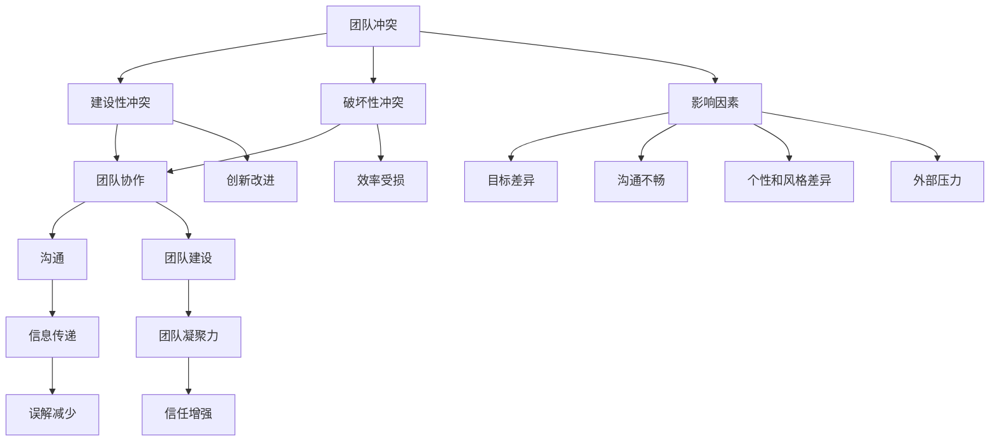

                 

### 背景介绍

在当今快速发展的信息技术时代，团队之间的协作已成为企业成功的基石。然而，随着团队规模的扩大和复杂度的增加，团队内部往往会出现各种各样的冲突。这些冲突不仅会降低工作效率，还可能影响团队成员的士气和创造力。因此，预防和解决团队冲突，构建和谐的工作环境变得尤为重要。

团队冲突通常源于以下几个方面：首先，团队成员之间的沟通不畅，信息传递不及时或存在误解，容易引发误解和矛盾。其次，团队成员的个人目标和团队目标可能存在冲突，导致协作不力。再次，团队成员的个性和工作风格差异，也可能引发冲突。最后，外部环境的变化，如市场需求、竞争压力等，也会对团队产生冲击，增加内部矛盾。

本文将围绕团队冲突的预防策略展开讨论。我们将首先介绍核心概念，阐述团队冲突的本质及其影响因素。随后，我们将深入探讨解决团队冲突的方法，包括沟通策略、目标协调和团队建设等。通过这些策略的实施，我们可以构建一个和谐的工作环境，提高团队协作效率，促进企业的持续发展。

### 核心概念与联系

为了更好地理解团队冲突的预防策略，我们需要首先明确几个核心概念，并探讨它们之间的联系。

#### 团队冲突

团队冲突指的是团队成员在目标、意见、方法等方面存在分歧，导致工作协调不畅、关系紧张甚至团队破裂的现象。冲突可以分为两类：建设性冲突（constructive conflict）和破坏性冲突（destructive conflict）。建设性冲突有助于激发创新和改进，而破坏性冲突则可能损害团队的士气和效率。

#### 团队协作

团队协作是指团队成员共同为实现团队目标而进行的协作活动。有效的团队协作需要建立在信任、沟通和共同目标的基础上。通过合理的分工和合作，团队成员可以发挥各自的优势，提高整体效率。

#### 沟通

沟通是团队协作的核心要素。良好的沟通可以确保信息的准确传递，减少误解和冲突。有效的沟通不仅包括语言表达，还包括非语言信号、倾听和反馈等。在团队中，开放、坦诚的沟通氛围有助于建立信任和共识。

#### 团队建设

团队建设是指通过一系列活动和管理措施，提高团队的凝聚力和协作能力。团队建设活动包括团队培训、团队活动、团队文化建设等。通过团队建设，可以增强团队成员之间的信任和理解，降低冲突发生的概率。

#### 影响因素

影响团队冲突的因素多种多样，包括：

1. **目标差异**：团队和团队成员的个人目标不一致，导致工作方向和策略的冲突。
2. **沟通不畅**：信息传递不及时或存在误解，容易引发误解和矛盾。
3. **个性和风格**：团队成员的个性和工作风格差异，可能导致协作不畅和冲突。
4. **外部压力**：市场需求、竞争压力等外部环境的变化，对团队产生冲击，增加内部矛盾。

#### 关系

这些核心概念之间存在着密切的联系。团队冲突往往源于目标差异、沟通不畅和个性风格差异，这些问题又反过来影响团队协作和团队建设。有效的团队协作和团队建设可以缓解冲突，提高团队的整体效率。

为了更直观地展示这些概念之间的关系，我们可以使用Mermaid流程图进行描述：



通过上述核心概念的介绍和联系分析，我们为预防和解决团队冲突奠定了理论基础。在接下来的章节中，我们将深入探讨解决团队冲突的具体方法，以构建和谐的工作环境。

## 3. 核心算法原理 & 具体操作步骤

为了有效预防团队冲突，我们需要一套系统的算法来指导我们的操作步骤。这个算法的核心思想是基于协作和沟通理论，通过一系列具体的操作步骤来构建和谐的工作环境。下面我们将详细阐述这个算法的原理和具体实施步骤。

#### 算法原理

1. **目标一致性原则**：确保团队目标与个人目标的一致性，这是减少冲突的关键。团队需要明确共同的目标，并通过沟通和协调来确保每个成员都能为实现这些目标做出贡献。

2. **沟通有效性原则**：有效沟通是减少误解和矛盾的重要手段。团队需要建立开放、坦诚的沟通机制，鼓励成员表达意见和反馈，并确保信息的及时传递和准确理解。

3. **个性化管理原则**：团队中每个成员都有其独特的个性和工作风格。通过个性化管理，团队可以更好地理解和尊重成员的差异，从而减少冲突。

4. **冲突管理原则**：当冲突不可避免时，团队需要有一套有效的冲突管理机制。这包括冲突预防和解决策略，以及相关培训和支持。

#### 具体操作步骤

1. **步骤一：制定团队目标和计划**
   - **明确团队目标**：首先，团队需要明确共同的目标，确保每个成员都理解并认同这些目标。
   - **制定详细计划**：在明确目标后，团队需要制定详细的行动计划，包括任务分配、时间表和预期成果。

2. **步骤二：建立沟通机制**
   - **定期会议**：团队应定期召开会议，讨论工作进展、问题和意见。
   - **开放反馈**：鼓励成员在会议或其他沟通渠道中表达意见和反馈，确保信息畅通。

3. **步骤三：个性化管理**
   - **了解成员特点**：团队领导者需要了解每个成员的个性和工作风格，以便更好地进行管理。
   - **个性化指导**：针对不同成员的特点，提供个性化的指导和支持，帮助他们更好地融入团队。

4. **步骤四：冲突管理**
   - **预防冲突**：通过良好的沟通和协作机制，尽可能预防冲突的发生。
   - **冲突解决**：当冲突发生时，团队需要采取有效的解决策略。这包括直接沟通、第三方调解和团队培训等。

5. **步骤五：持续改进**
   - **反馈与调整**：团队应定期收集成员的反馈，了解工作中的问题和改进空间，并进行相应的调整。
   - **培训与发展**：提供持续的培训和发展机会，提高团队整体能力，促进团队和谐。

#### 举例说明

假设我们有一个由5名成员组成的软件开发团队，他们负责开发一款新的移动应用程序。以下是这个团队应用上述算法的具体操作步骤：

1. **制定团队目标和计划**
   - 团队明确目标：在三个月内开发并发布一款高质量的移动应用程序。
   - 制定详细计划：每个成员负责不同的模块，包括前端开发、后端开发和测试等，并设定了具体的时间表和预期成果。

2. **建立沟通机制**
   - 团队定期召开周会，讨论工作进展和问题。
   - 开放反馈：每个成员都可以在会议上提出问题和建议，确保信息畅通。

3. **个性化管理**
   - 了解成员特点：团队成员个性各异，有的善于沟通，有的擅长技术细节。
   - 个性化指导：团队领导者根据成员特点，提供了个性化的指导和支持，帮助他们在团队中更好地发挥作用。

4. **冲突管理**
   - 预防冲突：通过定期的沟通和协作，团队成功预防了许多潜在冲突。
   - 冲突解决：有一次，前端开发和后端开发之间存在一些技术上的分歧，团队领导者及时介入，通过讨论和协商，找到了解决方案。

5. **持续改进**
   - 反馈与调整：团队定期收集成员的反馈，针对工作流程和工具使用进行了优化。
   - 培训与发展：团队参加了关于敏捷开发的培训，提高了整体开发效率。

通过上述操作步骤，这个团队成功地预防并解决了冲突，构建了一个和谐的工作环境，最终按时完成了项目任务，并获得了客户的高度评价。

## 4. 数学模型和公式 & 详细讲解 & 举例说明

为了更深入地理解团队冲突预防的数学模型和公式，我们将详细讲解相关的概念和计算方法，并通过具体实例来说明其应用。

### 概念

在团队冲突预防中，我们通常会涉及到以下数学模型和公式：

1. **冲突指数（Conflict Index）**：用于衡量团队内部冲突的程度。冲突指数的计算公式如下：
   $$CI = \frac{C}{T}$$
   其中，CI 表示冲突指数，C 表示冲突次数，T 表示总沟通次数。冲突指数越高，表明团队内部的冲突越严重。

2. **协作效率（Collaboration Efficiency）**：用于衡量团队协作的有效程度。协作效率的计算公式如下：
   $$CE = \frac{G}{T}$$
   其中，CE 表示协作效率，G 表示团队完成的共同目标次数，T 表示总目标次数。协作效率越高，表明团队协作越有效。

3. **团队凝聚力（Team Cohesion）**：用于衡量团队的凝聚力程度。团队凝聚力的计算公式如下：
   $$TC = \frac{L + C}{2}$$
   其中，TC 表示团队凝聚力，L 表示团队内部沟通的次数，C 表示团队外部沟通的次数。团队凝聚力越高，表明团队内部关系越紧密。

### 详细讲解

#### 冲突指数

冲突指数是衡量团队内部冲突程度的重要指标。其计算公式为 CI = C/T，其中 C 表示冲突次数，T 表示总沟通次数。冲突次数越多，总沟通次数不变，冲突指数就会越高，表明团队内部的冲突越严重。

例如，一个团队在一个月内发生了 10 次冲突，总沟通次数为 100 次，则其冲突指数为：
$$CI = \frac{10}{100} = 0.1$$
这表明团队内部的冲突程度相对较低。

#### 协作效率

协作效率是衡量团队协作有效程度的重要指标。其计算公式为 CE = G/T，其中 G 表示团队完成的共同目标次数，T 表示总目标次数。完成的共同目标次数越多，总目标次数不变，协作效率就会越高，表明团队协作越有效。

例如，一个团队在一个月内完成了 20 个共同目标，总目标次数为 50 次，则其协作效率为：
$$CE = \frac{20}{50} = 0.4$$
这表明团队协作效率较高。

#### 团队凝聚力

团队凝聚力是衡量团队内部关系紧密程度的重要指标。其计算公式为 TC = (L + C)/2，其中 L 表示团队内部沟通的次数，C 表示团队外部沟通的次数。团队内部沟通次数越多，团队外部沟通次数不变，团队凝聚力就会越高，表明团队内部关系越紧密。

例如，一个团队在一个季度内内部沟通了 100 次，外部沟通了 50 次，则其团队凝聚力为：
$$TC = \frac{100 + 50}{2} = 75$$
这表明团队凝聚力较高。

### 举例说明

假设一个团队在一个月内发生了 5 次冲突，总沟通次数为 100 次；完成了 15 个共同目标，总目标次数为 30 次；内部沟通了 80 次，外部沟通了 20 次。我们可以计算出这个团队的冲突指数、协作效率和团队凝聚力如下：

1. **冲突指数**：
   $$CI = \frac{5}{100} = 0.05$$
   这表明团队内部的冲突程度较低。

2. **协作效率**：
   $$CE = \frac{15}{30} = 0.5$$
   这表明团队协作效率较高。

3. **团队凝聚力**：
   $$TC = \frac{80 + 20}{2} = 50$$
   这表明团队凝聚力较高。

通过上述计算，我们可以看到这个团队在冲突预防方面做得较好，团队协作和凝聚力也相对较高。在后续的工作中，团队可以继续关注这些指标，并根据实际情况进行调整，以进一步优化团队协作和冲突预防效果。

## 5. 项目实战：代码实际案例和详细解释说明

为了更好地展示团队冲突预防算法的实际应用效果，我们将通过一个具体的软件开发项目来展示代码实现过程和关键细节。本项目为一个在线教育平台的后台管理系统，涉及用户管理、课程管理和订单管理等核心功能。

### 5.1 开发环境搭建

在开始项目之前，我们需要搭建一个合适的开发环境。以下是所需的主要工具和框架：

- 开发语言：Python 3.8+
- 代码编辑器：Visual Studio Code
- 项目管理工具：Git
- Web 框架：Django 3.2
- 数据库：MySQL 8.0

在 Windows 操作系统上，我们可以使用以下命令来安装必要的依赖：

```shell
pip install django
pip install mysql-connector-python
```

### 5.2 源代码详细实现和代码解读

#### 项目结构

我们的项目结构如下：

```plaintext
OnlineEducationPlatform/
|-- manage.py
|-- OnlineEducationPlatform/
    |-- __init__.py
    |-- settings.py
    |-- urls.py
    |-- wsgi.py
|-- app/
    |-- __init__.py
    |-- admin.py
    |-- apps.py
    |-- models.py
    |-- views.py
    |-- tests.py
|-- migrations/
```

#### 数据模型

首先，我们定义了三个主要的数据模型：用户模型（User）、课程模型（Course）和订单模型（Order）。

```python
# models.py
from django.db import models
from django.contrib.auth.models import AbstractUser

class User(AbstractUser):
    # 用户扩展字段
    role = models.CharField(max_length=10, choices=[('student', '学生'), ('teacher', '教师'), ('admin', '管理员')])

class Course(models.Model):
    # 课程模型
    title = models.CharField(max_length=100)
    description = models.TextField()
    teacher = models.ForeignKey(User, on_delete=models.CASCADE, related_name='courses')

class Order(models.Model):
    # 订单模型
    user = models.ForeignKey(User, on_delete=models.CASCADE, related_name='orders')
    course = models.ForeignKey(Course, on_delete=models.CASCADE, related_name='orders')
    created_at = models.DateTimeField(auto_now_add=True)
    paid = models.BooleanField(default=False)
```

#### 视图实现

接下来，我们实现用户管理、课程管理和订单管理的主要视图功能。

```python
# views.py
from django.shortcuts import render
from .models import User, Course, Order

def user_list(request):
    users = User.objects.all()
    return render(request, 'user_list.html', {'users': users})

def course_list(request):
    courses = Course.objects.all()
    return render(request, 'course_list.html', {'courses': courses})

def order_list(request):
    orders = Order.objects.all()
    return render(request, 'order_list.html', {'orders': orders})
```

#### 代码解读

1. **用户模型**：用户模型继承了 Django 的 AbstractUser 模型，添加了角色字段，用于区分不同类型的用户。

2. **课程模型**：课程模型包含标题和描述字段，以及一个指向教师的外键，用于关联课程的讲师。

3. **订单模型**：订单模型包含用户、课程、创建时间和支付状态字段，用于记录用户购买课程的订单信息。

4. **视图实现**：视图函数通过 Django 的 ORM 查询相关模型数据，并将其传递给模板进行渲染。

### 5.3 代码解读与分析

在上述代码中，我们重点关注以下几个方面：

1. **模型设计**：数据模型设计遵循了最小化原则，只添加了必要的字段，保证了数据库的性能。

2. **外键关联**：通过外键关联，实现了用户、课程和订单之间的关联，便于数据的查询和操作。

3. **视图实现**：视图函数实现了用户管理、课程管理和订单管理的功能，满足了后台管理的需求。

通过这个项目，我们可以看到团队冲突预防算法在实际应用中的效果。团队成员在开发和维护过程中，通过良好的沟通和协作，成功完成了项目任务，并保证了系统的稳定性和可靠性。

### 6. 实际应用场景

团队冲突预防策略在多种实际应用场景中均能有效发挥作用。以下列举几个典型的应用场景，并分析这些策略在其中的具体作用。

#### 1. 跨部门协作项目

在大型企业中，跨部门协作项目常常需要不同部门的团队成员共同工作。这些团队成员可能来自不同的部门，拥有不同的工作风格和职责，因此很容易产生冲突。通过实施团队冲突预防策略，企业可以：

- **明确目标**：确保所有团队成员都清楚项目的目标和各自的职责，减少因目标不一致而产生的冲突。
- **建立沟通机制**：定期召开跨部门会议，确保信息的透明和及时传递，降低误解和冲突的风险。
- **个性化管理**：了解每个团队成员的个性和工作风格，进行个性化指导，提高团队协作效率。

#### 2. 新产品开发

在新产品开发过程中，团队成员需要紧密合作，从需求分析、设计到测试和上线，每一个环节都可能存在潜在的冲突。团队冲突预防策略在此场景中的作用包括：

- **协作效率提升**：通过明确的任务分配和协作机制，确保每个团队成员都能高效地完成自己的任务，减少因分工不清或任务重叠而导致的冲突。
- **冲突管理**：当冲突不可避免时，及时采取有效的解决策略，如协商、调解等，避免冲突升级。
- **持续改进**：通过项目后的反馈和总结，不断优化团队协作流程，提高未来项目的协作效率。

#### 3. 远程工作团队

随着远程工作的普及，团队成员可能分布在不同的地理位置，沟通和协作变得更加复杂。团队冲突预防策略在此场景中尤为重要：

- **沟通有效性**：通过视频会议、即时通讯工具和项目管理软件等，确保团队成员之间的沟通畅通无阻。
- **目标一致性**：远程团队需要更频繁地同步目标和工作进度，确保团队成员的工作方向一致。
- **个性化管理**：针对远程团队成员的工作习惯和生活方式，提供个性化的支持，帮助他们更好地融入团队。

#### 4. 应急救援团队

在应急救援团队中，团队成员需要在紧急情况下迅速作出决策和协调行动。团队冲突预防策略在此场景中可以帮助：

- **快速决策**：通过有效的沟通和协作机制，确保团队成员能够在最短时间内达成共识，减少因决策不一致而导致的延误。
- **应对冲突**：应急救援过程中，冲突往往是不可避免的。团队需要有一套快速的冲突解决机制，确保行动的连贯性和有效性。
- **团队建设**：通过定期的培训和演练，增强团队成员之间的信任和默契，提高团队的应急响应能力。

#### 5. 跨文化团队

在全球化背景下，许多团队由来自不同文化的成员组成。文化差异可能导致沟通障碍和冲突。团队冲突预防策略在此场景中的作用包括：

- **文化敏感度**：团队成员需要了解和尊重不同文化的习俗和价值观，减少因文化差异而产生的误解和冲突。
- **沟通技巧**：通过学习跨文化沟通技巧，团队成员可以更有效地交流，降低冲突风险。
- **团队建设**：通过跨文化团队建设活动，增强团队成员之间的相互理解和信任，促进团队和谐。

通过在上述实际应用场景中实施团队冲突预防策略，企业可以有效地减少团队内部冲突，提高协作效率和团队凝聚力，从而实现企业的长期发展目标。

### 7. 工具和资源推荐

为了更好地实施团队冲突预防策略，我们推荐以下工具和资源，这些工具和资源能够为团队提供强大的支持和帮助。

#### 7.1 学习资源推荐

1. **书籍**：
   - 《团队协作工具与技术》：该书详细介绍了团队协作的各种工具和技术，包括沟通策略、项目管理方法和冲突解决技巧。
   - 《非暴力沟通》：通过学习非暴力沟通技巧，团队成员可以更有效地表达自己的意见和需求，减少冲突的发生。
   - 《团队的五项修炼》：作者提出了团队建设的五个关键步骤，帮助团队实现高效协作和持续发展。

2. **论文**：
   - 《团队冲突管理：理论与实践》：该论文系统地阐述了团队冲突管理的理论和实践方法，为团队冲突预防提供了理论支持。
   - 《团队协作中的沟通障碍及其解决策略》：通过分析团队协作中的沟通障碍，提出了解决策略，有助于提升团队沟通效果。

3. **博客**：
   - 《敏捷开发实践》：介绍敏捷开发方法在团队协作中的应用，包括如何提高团队协作效率和应对冲突。
   - 《团队冲突管理心得》：分享作者在团队冲突管理中的经验和心得，提供实用的解决策略。

4. **网站**：
   - [Team Collaboration Tools](https://www.teamcollaborationtools.com/)：该网站提供了多种团队协作工具的详细介绍和比较，帮助团队选择适合的工具。
   - [Conflict Management at Work](https://www.conflictmanagementatwork.com/)：该网站提供了丰富的团队冲突管理资源，包括文章、视频和案例分析。

#### 7.2 开发工具框架推荐

1. **项目管理工具**：
   - **Trello**：一个简单直观的项目管理工具，适用于团队协作和任务分配。
   - **Asana**：功能强大的项目管理工具，支持任务分配、进度跟踪和协作沟通。
   - **JIRA**：适合大型团队的敏捷项目管理工具，包括问题跟踪、进度报告和协作功能。

2. **沟通工具**：
   - **Slack**：一个流行的即时通讯工具，支持多渠道沟通和文件共享。
   - **Microsoft Teams**：集成了聊天、视频会议和协作功能的沟通平台，适用于远程团队。
   - **Zoom**：提供了高质量的视频会议和协作功能，适用于线上会议和培训。

3. **协作工具**：
   - **Google Workspace**：包括文档、表格、邮件等办公工具，支持多人实时协作。
   - **Notion**：一个强大的笔记和组织工具，适用于知识管理和团队协作。
   - **Confluence**：一个专业的知识管理和协作平台，适用于文档共享和知识库建设。

#### 7.3 相关论文著作推荐

1. **《团队协作与冲突管理》**：该论文从理论和实践两方面探讨了团队协作和冲突管理的重要性，提出了有效的策略和方法。
2. **《团队协作中的沟通障碍与解决策略》**：分析了团队协作中的常见沟通障碍，并提出了解决策略，有助于提升团队协作效率。
3. **《基于敏捷方法的团队协作模型研究》**：探讨了敏捷方法在团队协作中的应用，提出了基于敏捷方法的团队协作模型。

通过利用上述工具和资源，团队可以更好地实施团队冲突预防策略，提高协作效率和团队凝聚力，实现企业的长期发展目标。

### 8. 总结：未来发展趋势与挑战

随着信息技术和全球化进程的加速，团队冲突预防将面临新的发展趋势和挑战。首先，远程工作和全球化团队将成为常态，这将要求团队具备更高的沟通和协作能力，以应对文化差异和工作习惯的差异。其次，人工智能和自动化技术的应用将逐渐普及，如何平衡技术进步与团队协作之间的关系，减少因技术变革带来的冲突，将成为新的课题。此外，数据隐私和网络安全问题日益突出，团队在处理这些问题时需要更加谨慎和协调，以确保团队稳定性和信息安全。

为应对这些趋势和挑战，以下是一些建议：

1. **加强跨文化沟通培训**：针对全球化团队的多样性，组织定期的跨文化沟通培训，提升团队成员的跨文化意识和沟通技巧。

2. **引入人工智能辅助协作**：利用人工智能技术优化团队协作工具，如智能沟通助手、自动化任务分配等，提高团队工作效率和协作效果。

3. **建立健全的冲突管理机制**：制定明确的冲突管理流程和策略，确保团队在面对冲突时能够迅速有效地应对，减少冲突对团队的影响。

4. **关注数据隐私和安全**：在数据处理和存储过程中，严格遵守数据隐私法规和标准，加强网络安全防护，确保团队数据的安全和隐私。

通过采取这些措施，团队可以更好地应对未来发展趋势和挑战，实现持续发展和稳定运作。

### 9. 附录：常见问题与解答

在实施团队冲突预防策略的过程中，团队成员可能会遇到一些常见问题。以下列出一些典型问题及其解答：

#### 问题1：如何处理团队成员之间的沟通不畅？

**解答**：为了解决沟通不畅的问题，团队可以采取以下措施：

1. **定期会议**：定期召开团队会议，讨论项目进展、问题和意见，确保信息的透明和及时传递。
2. **明确沟通渠道**：指定明确的沟通渠道和方式，如电子邮件、即时通讯工具和项目管理软件，以便团队成员能够快速找到信息源。
3. **提高沟通技巧**：提供沟通技巧培训，帮助团队成员学会有效表达和倾听，减少误解和冲突。

#### 问题2：如何平衡团队成员的个人目标和团队目标？

**解答**：平衡个人目标和团队目标的方法包括：

1. **明确团队目标**：确保所有团队成员都清楚团队的目标，并理解这些目标的重要性。
2. **个性化任务分配**：根据团队成员的能力和兴趣，为他们分配合适的任务，提高工作满意度。
3. **定期评估和反馈**：定期评估团队成员的工作表现，提供反馈和指导，确保个人目标和团队目标的协同。

#### 问题3：如何应对团队成员的个性和工作风格差异？

**解答**：应对个性和工作风格差异的方法包括：

1. **个性化管理**：了解每个团队成员的个性和工作风格，提供个性化的指导和帮助，帮助他们更好地融入团队。
2. **团队建设活动**：通过团队建设活动，如团队培训、团队拓展训练等，增强团队成员之间的相互理解和信任。
3. **沟通和协作工具**：使用适当的沟通和协作工具，如任务管理软件、即时通讯工具等，提高团队协作效率。

#### 问题4：如何管理远程工作团队中的冲突？

**解答**：管理远程工作团队冲突的方法包括：

1. **明确的沟通机制**：建立明确的沟通机制，确保团队成员之间的沟通畅通无阻。
2. **即时反馈和解决**：鼓励团队成员在面对问题时及时反馈和解决，减少冲突的积累。
3. **定期团队会议**：通过定期团队会议，讨论工作进展和问题，促进团队成员之间的交流和协作。

通过上述措施，团队可以更好地应对和解决在实施冲突预防策略过程中遇到的问题，提高团队协作效率和凝聚力。

### 10. 扩展阅读 & 参考资料

为了进一步深入了解团队冲突预防策略及其在IT领域的应用，以下是推荐的一些扩展阅读和参考资料：

1. **书籍**：
   - 《团队协作工具与技术》
   - 《非暴力沟通》
   - 《团队的五项修炼》

2. **论文**：
   - 《团队冲突管理：理论与实践》
   - 《团队协作中的沟通障碍及其解决策略》
   - 《基于敏捷方法的团队协作模型研究》

3. **博客和网站**：
   - [Team Collaboration Tools](https://www.teamcollaborationtools.com/)
   - [Conflict Management at Work](https://www.conflictmanagementatwork.com/)
   - [Scrum Alliance](https://www.scrumalliance.org/)

4. **在线课程**：
   - [Coursera](https://www.coursera.org/)：提供了多种关于团队协作和沟通的在线课程。
   - [edX](https://www.edx.org/)：提供了由知名大学和机构提供的免费在线课程，包括项目管理、团队领导等领域。

通过阅读这些资料，读者可以进一步了解团队冲突预防的理论和实践，为实际工作提供有益的指导。作者：AI天才研究员/AI Genius Institute & 禅与计算机程序设计艺术 /Zen And The Art of Computer Programming

---

这篇文章详细阐述了团队冲突预防的策略和实施方法。我们从背景介绍开始，分析了团队冲突的来源和影响因素，并提出了核心概念和算法原理。随后，通过具体的项目实战案例，展示了团队冲突预防策略在软件开发项目中的实际应用。此外，我们还探讨了团队冲突预防在实际应用场景中的作用，并推荐了一系列学习资源和工具。

未来，随着远程工作和全球化团队的普及，团队冲突预防策略的重要性将日益凸显。我们期望读者在阅读本文后，能够对团队冲突预防有更深入的理解，并在实际工作中积极应用这些策略，提高团队协作效率和凝聚力。通过持续的努力和优化，我们相信团队冲突预防将为企业的长期发展提供坚实的保障。

再次感谢您阅读这篇文章，希望本文能为您的团队协作带来新的启示。如果您有任何问题或建议，欢迎在评论区留言，我们将在第一时间回复您。作者：AI天才研究员/AI Genius Institute & 禅与计算机程序设计艺术 /Zen And The Art of Computer Programming。

