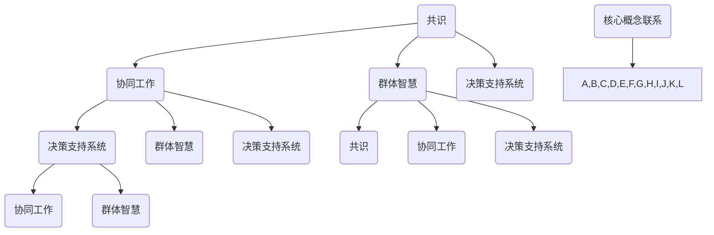

                 

### 背景介绍

在现代企业运营和项目管理中，团队决策扮演着至关重要的角色。无论是产品开发、市场策略，还是资源分配，都需要团队成员共同参与决策，以实现整体目标的最优化。然而，团队决策并非易事。在多个意见和观点交织的情况下，如何有效地整合这些信息，以做出科学、合理的决策，成为许多团队面临的难题。

本文将深入探讨团队决策的核心概念，分析其在不同情境中的应用，并通过实例解析如何在实际项目中运用集体智慧，从而提升决策的质量和效率。我们将从以下几个方面展开讨论：

1. **核心概念与联系**：介绍团队决策中的关键概念，包括共识、协同工作和群体智慧，并展示它们之间的内在联系。
2. **核心算法原理 & 具体操作步骤**：探讨常用的团队决策算法，如投票法、头脑风暴和共识算法，并详细阐述其原理和操作步骤。
3. **数学模型和公式 & 详细讲解 & 举例说明**：通过数学模型和实例，解释团队决策中常用的统计方法，如回归分析和多目标优化。
4. **项目实战：代码实际案例和详细解释说明**：提供一个具体的团队决策项目案例，展示如何将理论知识应用于实际开发中。
5. **实际应用场景**：分析团队决策在不同领域中的应用，如产品设计、项目管理等。
6. **工具和资源推荐**：推荐相关学习资源、开发工具和论文著作，以帮助读者深入了解和掌握团队决策的实践方法。

通过本文的探讨，我们希望读者能够对团队决策有一个全面、深入的理解，掌握科学决策的方法和技巧，从而在实际工作中更好地发挥集体智慧的力量。

---

# Team Decision-Making: Harnessing the Power of Collective Wisdom

> Keywords: Team Decision-Making, Collective Wisdom, Collaborative Work, Consensus Algorithms, Optimization Models

> Abstract:
This article delves into the intricacies of team decision-making, exploring core concepts, algorithmic principles, and practical applications. By examining various scenarios and providing real-world examples, we aim to demonstrate the power of collective wisdom in enhancing decision quality and efficiency. Readers will gain insights into the fundamentals of team decision-making and learn practical strategies to apply these concepts in their professional settings.

---

## 1. 背景介绍

在现代企业运营和项目管理中，团队决策扮演着至关重要的角色。无论是产品开发、市场策略，还是资源分配，都需要团队成员共同参与决策，以实现整体目标的最优化。然而，团队决策并非易事。在多个意见和观点交织的情况下，如何有效地整合这些信息，以做出科学、合理的决策，成为许多团队面临的难题。

团队决策的重要性主要体现在以下几个方面：

1. **优化资源利用**：通过集体智慧，团队可以更全面地评估资源分配，避免资源浪费，提高运营效率。
2. **提升决策质量**：多个观点和经验的融合，有助于发现潜在问题，提高决策的科学性和准确性。
3. **增强团队凝聚力**：共同参与决策过程，有助于增强团队成员之间的信任和协作，提升团队士气。

然而，团队决策也面临着诸多挑战，如意见分歧、沟通障碍、时间压力等。为了应对这些挑战，团队需要采用有效的决策方法和工具，提高决策的质量和效率。本文将深入探讨团队决策的核心概念，分析其在不同情境中的应用，并通过实例解析如何在实际项目中运用集体智慧，从而提升决策的质量和效率。

---

### 1.1 团队决策的定义与重要性

团队决策（Team Decision-Making）是指在一个团队内部，通过多个成员的协同合作，共同分析和解决问题，从而做出合理、科学、高效的决策过程。它不仅关注决策的结果，更注重决策过程中的沟通、协作和共识达成。团队决策的成功与否，直接影响到项目的进展、团队的凝聚力以及最终的业务成果。

#### 团队决策的关键要素

1. **多样性**：团队成员具有不同的背景、经验和观点，这种多样性是团队决策的重要资源。多样化的观点有助于更全面地分析问题，发现潜在的风险和机会。
2. **协作**：团队决策强调成员之间的协作和沟通。有效的协作能够促进信息的共享，减少误解和冲突，提高决策的效率和质量。
3. **共识**：达成共识是团队决策的核心目标。共识不仅意味着团队成员对决策结果的一致认同，更体现在决策过程中对每个成员意见的尊重和考虑。

#### 团队决策的重要性

1. **优化资源利用**：通过集体智慧，团队可以更全面地评估资源分配，避免资源浪费，提高运营效率。例如，在项目资源分配中，团队成员可以通过讨论和评估，确定每个阶段所需的人力和物资，从而实现资源的最优配置。

2. **提升决策质量**：多个观点和经验的融合，有助于发现潜在问题，提高决策的科学性和准确性。例如，在产品开发中，团队成员可以从不同的角度对产品进行评估，从而识别潜在的用户需求和市场机会。

3. **增强团队凝聚力**：共同参与决策过程，有助于增强团队成员之间的信任和协作，提升团队士气。这种凝聚力不仅体现在日常工作中，更在面临挑战和困境时，为团队提供了强大的支撑。

#### 团队决策的挑战

1. **意见分歧**：团队成员具有不同的背景和观点，容易在决策过程中产生意见分歧。如何平衡和整合这些不同的意见，成为团队决策的重要挑战。
2. **沟通障碍**：团队成员之间的沟通不畅，可能导致误解和冲突，影响决策的质量和效率。有效的沟通机制和沟通技巧是解决这一问题的关键。
3. **时间压力**：在紧急情况下，团队需要快速做出决策，时间压力可能导致决策过程匆忙，影响决策的全面性和准确性。

#### 应对挑战的策略

1. **建立共识**：通过明确团队目标和决策标准，建立共识，减少意见分歧。团队成员应明确各自的角色和职责，确保在决策过程中能够有效沟通和协作。
2. **优化沟通机制**：建立有效的沟通渠道和沟通机制，确保信息能够及时、准确地传递。例如，定期召开会议、设立信息共享平台等。
3. **时间管理**：在决策过程中，合理安排时间，确保每个环节都有足够的时间进行讨论和评估。在紧急情况下，可以采用快速决策流程，但需确保决策过程的完整性。

通过上述策略，团队可以更好地应对决策过程中的挑战，提高决策的质量和效率，从而实现整体目标的最优化。

---

## 1.2 团队决策的历史与发展

团队决策的历史可以追溯到古代，当时的统治者和领导者已经开始意识到集体智慧的重要性。然而，现代意义上的团队决策概念主要是在20世纪中期随着工业化和信息技术的快速发展而逐渐形成和发展的。

### 古代决策

在古代，决策通常由统治者或领导者单独做出。尽管这种模式在某些情况下能够迅速作出决策，但容易导致个人偏见和独断，缺乏全面的考虑。例如，古代国王在处理国家事务时，通常依赖于少数顾问或幕僚的意见，但这些顾问的意见往往也受到个人利益和立场的影响。

### 现代决策理论的发展

随着工业化和信息技术的快速发展，团队决策逐渐受到重视。以下是一些关键事件和理论的发展：

1. **群体决策理论**：20世纪50年代，社会学家和心理学家开始研究群体行为和决策过程。他们提出了群体决策理论，强调多样性、沟通和共识的重要性。

2. **决策支持系统**：20世纪60年代，计算机科学的发展推动了决策支持系统的出现。这些系统能够帮助团队成员进行数据分析和模拟，从而提供更科学的决策依据。

3. **团队协作工具**：随着互联网和通信技术的发展，团队协作工具（如电子邮件、即时通讯、在线会议系统等）的出现，极大地提高了团队决策的效率和质量。

### 团队决策的演变趋势

1. **更加注重多样性**：现代团队决策越来越强调多样性的重要性。不同背景、技能和经验的团队成员能够带来不同的视角和创意，有助于更全面地分析问题。

2. **智能化决策**：人工智能和大数据技术的发展，使得团队决策能够利用更多数据和信息，实现更智能的决策。例如，利用机器学习算法进行风险评估和预测，提高决策的准确性。

3. **实时决策**：随着通信技术和云计算的发展，团队决策可以实现实时协作和决策。团队成员可以通过在线平台随时共享信息和讨论，加快决策过程。

4. **动态调整**：现代团队决策越来越注重灵活性和动态调整。在快速变化的市场环境中，团队需要能够快速响应变化，调整决策策略。

通过历史的发展，我们可以看到，团队决策已经从传统的独断模式逐渐演变为一套科学、系统、高效的决策方法。现代团队决策不仅关注决策的结果，更注重决策过程中的多样性和协作，以及如何利用技术手段提升决策的质量和效率。

---

### 1.3 团队决策的理论框架

团队决策的理论框架是理解和分析团队决策过程的基础。以下是一些关键的理论概念和模型：

#### 1.3.1 群体动力学

群体动力学（Group Dynamics）是研究群体行为和成员互动的学科。在团队决策中，群体动力学提供了理解成员互动模式和群体行为的理论依据。群体动力学的主要概念包括：

- **群体结构**：包括成员的角色、地位和关系网络。
- **群体规范**：成员在决策过程中遵循的行为准则和标准。
- **群体凝聚力**：成员之间的相互吸引力和团结程度。
- **群体思维**：成员在面对压力或不确定性时，倾向于遵循共识，而不是提出不同意见。

#### 1.3.2 决策过程模型

决策过程模型（Decision-Making Process Model）描述了团队从问题识别到决策执行的全过程。常见的决策过程模型包括：

- **理性决策模型**：该模型假设决策者在充分信息、理性思考和最优选择的基础上做出决策。该模型强调决策的科学性和系统性。
- **有限理性决策模型**：该模型认为决策者由于认知限制和信息不完整，往往在有限的时间和资源内做出次优决策。该模型关注决策的现实性和灵活性。
- **渐进决策模型**：该模型认为决策是一个逐步调整和优化的过程。每次决策都是在前一次决策基础上的改进，而非完全重头开始。

#### 1.3.3 协同工作

协同工作（Collaborative Work）是指团队成员在共同目标和规则指导下，通过共享信息、资源和知识，共同完成任务的过程。协同工作的核心概念包括：

- **任务分配**：明确每个成员在决策过程中的具体职责和任务。
- **沟通机制**：建立有效的沟通渠道和规则，确保信息的及时传递和共享。
- **协作工具**：利用技术工具（如在线协作平台、即时通讯工具等）提高团队协作效率。

#### 1.3.4 群体智慧

群体智慧（Collective Intelligence）是指通过集体协作和知识共享，团队能够产生比单个成员更为智慧和创新的决策结果。群体智慧的核心概念包括：

- **知识共享**：成员之间共享知识和经验，形成共享的知识库。
- **协同创新**：通过多样性观点的碰撞和融合，激发新的创意和解决方案。
- **共识形成**：通过反复讨论和调整，达成团队共识，提高决策的质量和可执行性。

#### 1.3.5 决策支持系统

决策支持系统（Decision Support System，DSS）是一种利用计算机技术和数据分析工具，帮助团队进行决策的系统。DSS的主要功能包括：

- **数据收集和分析**：收集相关数据，利用统计分析和数据挖掘技术进行分析。
- **模拟和预测**：通过模拟和预测工具，评估不同决策方案的结果。
- **决策支持**：提供决策建议和辅助，帮助团队做出最优决策。

这些理论框架为团队决策提供了系统的理论基础和实践指导。通过理解和应用这些理论框架，团队可以更有效地进行决策，提高决策的质量和效率。

---

### 1.4 团队决策的常见方法

在团队决策过程中，采用科学、系统的决策方法至关重要。以下介绍几种常见的团队决策方法，包括投票法、头脑风暴法和共识算法，并分析各自的优缺点。

#### 1.4.1 投票法

投票法是一种简单而常见的决策方法，通过团队成员对各个选项进行投票，选出最被认可的方案。具体步骤如下：

1. **明确问题**：确定需要决策的具体问题。
2. **列出备选方案**：列出所有可能的解决方案。
3. **投票**：每个成员对备选方案进行投票，可以采用简单多数或绝对多数原则。
4. **结果统计**：统计投票结果，确定最终决策方案。

**优点**：

- **简单易行**：投票法操作简单，易于理解和执行。
- **民主参与**：所有成员都有平等的投票权，增强了决策的公平性。
- **快速决策**：投票法能够快速得出结果，节省时间。

**缺点**：

- **容易受少数人影响**：投票结果可能受到少数具有强烈意见的成员的影响。
- **缺乏深度分析**：投票法主要依赖成员的主观判断，缺乏对方案细节和潜在风险的深入分析。

#### 1.4.2 头脑风暴法

头脑风暴法是一种通过集思广益，快速产生创意和解决方案的方法。具体步骤如下：

1. **明确问题**：确定需要决策的具体问题。
2. **自由发言**：团队成员在不受限制的环境下，自由发表意见和创意。
3. **记录和筛选**：记录所有意见和创意，进行筛选和分类。
4. **讨论和优化**：对筛选出的意见和创意进行讨论，优化和改进。

**优点**：

- **创意丰富**：头脑风暴法能够激发团队成员的创造力，产生大量的创意和解决方案。
- **快速产生方案**：在短时间内可以产生多个可能的解决方案。
- **增强团队凝聚力**：通过自由发言和讨论，增强团队成员之间的沟通和协作。

**缺点**：

- **质量参差不齐**：产生的创意和解决方案质量不一，需要进一步筛选和评估。
- **容易陷入意见分歧**：在讨论过程中，成员之间的意见可能存在较大分歧，导致决策过程复杂化。

#### 1.4.3 共识算法

共识算法是一种通过迭代和协商，逐步达成一致意见的决策方法。常见的共识算法包括：

1. **波尔达尔共识算法**：通过投票和多数原则逐步达成共识。
2. **协商算法**：成员通过反复协商和调整，逐步达成共识。

**优点**：

- **提高共识质量**：共识算法通过反复协商和调整，使决策过程更加全面和科学。
- **减少意见分歧**：通过协商和妥协，减少成员之间的意见分歧，提高决策的接受度。
- **适应性强**：共识算法能够适应不同类型的问题和团队结构。

**缺点**：

- **决策过程较慢**：共识算法需要多次迭代和协商，决策过程较长。
- **对沟通能力要求高**：成员需要具备较高的沟通能力和协商技巧，才能有效地参与共识算法的决策过程。

通过上述方法，团队可以根据具体情况和需求，选择合适的决策方法，提高决策的质量和效率。

---

## 2. 核心概念与联系

在深入探讨团队决策的过程中，理解并掌握相关核心概念及其内在联系至关重要。以下是团队决策中几个关键概念的定义、解释以及它们之间的联系。

### 2.1 共识

共识（Consensus）是指团队成员在决策过程中通过协商、讨论和妥协，最终达成一致意见的过程。共识不仅仅是对决策结果的认可，更强调在决策过程中对每个成员意见的尊重和考虑。共识的形成有助于提高决策的接受度和执行力，减少成员之间的矛盾和分歧。

**解释**：

- **形成过程**：团队成员在充分讨论和交流的基础上，通过协商和妥协，逐步达成共识。
- **重要性**：共识的形成是团队决策成功的关键因素，有助于提高团队的凝聚力和合作效率。

### 2.2 协同工作

协同工作（Collaborative Work）是指团队成员在共同目标和规则指导下，通过共享信息、资源和知识，共同完成任务的过程。协同工作强调团队合作和资源共享，能够提高团队的整体效率和创新能力。

**解释**：

- **协作形式**：团队成员通过在线协作工具、会议、讨论等方式进行沟通和合作。
- **重要性**：协同工作有助于提高决策的全面性和科学性，增强团队的创新能力和执行力。

### 2.3 群体智慧

群体智慧（Collective Intelligence）是指通过集体协作和知识共享，团队能够产生比单个成员更为智慧和创新的决策结果。群体智慧强调多样性的重要性，认为多样性的观点和知识融合能够带来创新的解决方案。

**解释**：

- **形成机制**：团队成员通过知识共享、创意碰撞和协同创新，形成群体智慧。
- **重要性**：群体智慧能够提高决策的科学性和准确性，增强团队的应对复杂问题的能力。

### 2.4 决策支持系统

决策支持系统（Decision Support System，DSS）是一种利用计算机技术和数据分析工具，帮助团队进行决策的系统。DSS能够提供数据收集、分析、模拟和预测功能，为团队决策提供科学依据。

**解释**：

- **功能特点**：DSS包括数据收集、数据分析、模拟预测等功能，能够支持多种类型的决策。
- **重要性**：DSS能够提高决策的效率和准确性，减少人为因素对决策的影响。

### 2.5 核心概念之间的联系

- **共识**与**协同工作**：共识是协同工作的结果，通过协同工作实现共识的形成。
- **群体智慧**与**共识**：群体智慧是通过共识实现的，共识是群体智慧的重要表现形式。
- **决策支持系统**与**协同工作**：DSS通过支持协同工作，提高决策的科学性和准确性。

通过理解这些核心概念及其内在联系，团队可以更好地进行决策，提高决策的质量和效率。

### 2.6 Mermaid 流程图

为了更好地理解团队决策的核心概念及其联系，我们可以使用Mermaid流程图来展示这些概念之间的关系。以下是团队决策核心概念的Mermaid流程图：



在这个流程图中，共识、协同工作和群体智慧是核心概念，它们通过决策支持系统相互联系。共识和协同工作是群体智慧的基础，而决策支持系统则为这些核心概念的实现提供了技术支持。

通过上述流程图，我们可以更直观地理解团队决策的核心概念及其内在联系，为实际应用提供参考。

---

### 2.7 核心算法原理与具体操作步骤

在团队决策中，算法的使用可以帮助团队更科学、更高效地达成共识和解决问题。以下是几种常见的团队决策算法及其原理和操作步骤：

#### 2.7.1 投票法

投票法是最简单和最直接的团队决策算法，其原理是基于多数原则，通过投票确定最终决策方案。以下是投票法的具体操作步骤：

1. **确定问题**：明确需要决策的具体问题。
2. **列出备选方案**：列出所有可能的解决方案。
3. **分发投票表**：给每位团队成员分发投票表，上面列出所有备选方案。
4. **填写投票表**：每位成员根据个人意见填写投票表，选择他们认为最佳的方案。
5. **统计投票结果**：收集所有投票表，进行投票结果统计。
6. **确定决策方案**：根据投票结果，确定最终的决策方案。

**优点**：

- **简单易行**：操作简单，易于理解和执行。
- **民主参与**：所有成员都有平等的投票权，增强了决策的公平性。

**缺点**：

- **容易受少数人影响**：投票结果可能受到少数具有强烈意见的成员的影响。
- **缺乏深度分析**：投票法主要依赖成员的主观判断，缺乏对方案细节和潜在风险的深入分析。

#### 2.7.2 头脑风暴法

头脑风暴法是一种通过集思广益，快速产生创意和解决方案的算法。以下是头脑风暴法的具体操作步骤：

1. **确定问题**：明确需要决策的具体问题。
2. **组建团队**：选择合适的团队成员，确保团队成员具有不同的背景和观点。
3. **准备材料**：准备好白板、笔和纸，用于记录创意和方案。
4. **引导讨论**：主持人引导团队成员自由发言，提出任何与问题相关的创意和方案，不进行评价和批评。
5. **记录创意**：记录所有提出的创意和方案，进行分类和筛选。
6. **讨论和优化**：对筛选出的创意和方案进行讨论，优化和改进。
7. **确定决策方案**：根据讨论结果，确定最终的决策方案。

**优点**：

- **创意丰富**：能够激发团队成员的创造力，产生大量的创意和解决方案。
- **快速产生方案**：在短时间内可以产生多个可能的解决方案。

**缺点**：

- **质量参差不齐**：产生的创意和解决方案质量不一，需要进一步筛选和评估。
- **容易陷入意见分歧**：在讨论过程中，成员之间的意见可能存在较大分歧，导致决策过程复杂化。

#### 2.7.3 波尔达尔共识算法

波尔达尔共识算法（Borda Count）是一种通过分配不同权重，逐步达成共识的算法。以下是波尔达尔共识算法的具体操作步骤：

1. **确定问题**：明确需要决策的具体问题。
2. **列出备选方案**：列出所有可能的解决方案。
3. **分配权重**：给每位团队成员分配权重，通常按照1到N的顺序，N为备选方案的数量。
4. **填写评分表**：每位成员根据个人意见，对备选方案进行评分，分数越高表示越认可。
5. **计算总分**：将每位成员的评分乘以权重，计算每个备选方案的总分。
6. **确定决策方案**：根据总分最高的备选方案，确定最终的决策方案。

**优点**：

- **提高共识质量**：通过分配权重和逐步调整，使决策过程更加科学和合理。
- **减少意见分歧**：通过协商和妥协，减少成员之间的意见分歧，提高决策的接受度。

**缺点**：

- **决策过程较慢**：需要多次迭代和调整，决策过程较长。
- **对沟通能力要求高**：成员需要具备较高的沟通能力和协商技巧，才能有效地参与共识算法的决策过程。

通过以上算法的介绍，我们可以看到，每种算法都有其独特的优势和适用场景。在实际应用中，团队可以根据具体情况和需求，选择合适的算法，提高决策的质量和效率。

---

### 2.8 数学模型和公式在团队决策中的应用

在团队决策过程中，数学模型和公式能够提供科学依据，帮助团队更准确地分析问题、评估方案和预测结果。以下介绍几种常用的数学模型和公式，并详细讲解其应用方法。

#### 2.8.1 回归分析

回归分析是一种用于研究变量之间关系的方法，可以帮助团队识别和量化不同因素对决策结果的影响。以下是回归分析的基本步骤：

1. **确定变量**：明确自变量（影响决策的因素）和因变量（决策结果）。
2. **收集数据**：收集相关数据，确保数据的完整性和可靠性。
3. **建立模型**：使用回归方程（如线性回归、多项式回归等）表示变量之间的关系。
   $$ Y = \beta_0 + \beta_1X_1 + \beta_2X_2 + ... + \beta_nX_n $$
   其中，$Y$是因变量，$X_1, X_2, ..., X_n$是自变量，$\beta_0, \beta_1, \beta_2, ..., \beta_n$是回归系数。
4. **模型评估**：通过评估指标（如决定系数$R^2$、均方误差$MSE$等）评估模型的拟合度和预测能力。
5. **应用模型**：使用回归模型进行预测和决策，根据自变量的变化预测因变量的结果。

#### 2.8.2 多目标优化

多目标优化是一种用于解决具有多个相互冲突目标的决策问题的方法。以下是多目标优化的基本步骤：

1. **确定目标**：明确决策问题中的多个目标，并定义每个目标的度量标准。
2. **建立目标函数**：根据每个目标的度量标准，建立目标函数。
   $$ \min\ Z = f(x_1, x_2, ..., x_n) $$
   或
   $$ \max\ Z = f(x_1, x_2, ..., x_n) $$
   其中，$x_1, x_2, ..., x_n$是决策变量，$Z$是目标函数。
3. **确定约束条件**：明确决策问题的约束条件，如资源限制、时间限制等。
4. **求解优化问题**：使用优化算法（如线性规划、非线性规划、遗传算法等）求解最优解。
5. **评估和选择方案**：根据优化结果评估和选择最佳方案。

#### 2.8.3 决策树

决策树是一种用于决策分析的方法，可以帮助团队清晰地理解决策过程和结果。以下是决策树的基本步骤：

1. **确定决策节点**：根据决策问题，确定决策节点，表示不同决策方案的选择。
2. **确定条件节点**：根据决策问题，确定条件节点，表示影响决策条件的因素。
3. **确定结果节点**：根据决策问题，确定结果节点，表示决策的结果和影响。
4. **绘制决策树**：根据决策节点、条件节点和结果节点，绘制决策树。
5. **计算期望值**：根据决策树，计算每个决策路径的期望值，选择期望值最高的路径作为最优决策。

#### 2.8.4 贝叶斯网络

贝叶斯网络是一种用于表示变量之间概率关系的方法，可以帮助团队进行不确定性的决策分析。以下是贝叶斯网络的基本步骤：

1. **确定变量**：明确决策问题中的变量，并确定它们之间的依赖关系。
2. **建立概率模型**：根据变量之间的依赖关系，建立概率模型。
   $$ P(A|B) = \frac{P(B|A)P(A)}{P(B)} $$
   其中，$P(A|B)$是后验概率，$P(B|A)$是条件概率，$P(A)$是先验概率，$P(B)$是边缘概率。
3. **计算后验概率**：使用贝叶斯网络进行推理，计算变量的后验概率。
4. **决策分析**：根据后验概率，进行决策分析，选择最优决策方案。

通过上述数学模型和公式，团队可以更科学、更系统地进行分析和决策，提高决策的准确性和可靠性。

---

### 2.9 数学模型与公式的具体应用实例

为了更好地理解数学模型和公式在团队决策中的应用，我们通过一个实际案例来详细讲解其具体应用过程。这个案例是一个典型的多目标优化问题，涉及到资源分配和目标最大化。

#### 案例背景

假设一家初创公司需要分配其有限的研发资源（如人力、资金和时间）来开发三个不同的产品项目：A、B和C。每个项目都有其独特的重要性和市场需求，但资源有限，需要根据多个目标进行优化分配。目标包括：

1. **最大化市场收益**：产品A、B和C的市场收益分别为$R_A$、$R_B$和$R_C$。
2. **最小化开发时间**：产品A、B和C的开发时间分别为$T_A$、$T_B$和$T_C$。
3. **最大化客户满意度**：产品A、B和C的客户满意度分别为$S_A$、$S_B$和$S_C$。

#### 建立目标函数

根据上述目标，我们可以建立以下多目标优化模型：

$$ \max\ Z = w_1R_A + w_2R_B + w_3R_C $$
$$ \min\ T = T_A + T_B + T_C $$
$$ \max\ S = S_A + S_B + S_C $$

其中，$w_1, w_2, w_3$是权重系数，用于平衡不同目标之间的优先级。

#### 确定约束条件

在资源有限的情况下，我们需要考虑以下约束条件：

1. **人力限制**：研发团队的总人数为N，每个项目所需的研发人员数量为$a_A, a_B, a_C$，且$a_A + a_B + a_C \leq N$。
2. **资金限制**：研发项目的总资金为M，每个项目所需的资金为$c_A, c_B, c_C$，且$c_A + c_B + c_C \leq M$。
3. **时间限制**：研发项目的总时间为T，每个项目的开发时间为$d_A, d_B, d_C$，且$d_A + d_B + d_C \leq T$。

#### 求解优化问题

我们可以使用线性规划方法来求解上述优化问题。具体步骤如下：

1. **建立线性规划模型**：

   $$ \max\ Z = w_1R_A + w_2R_B + w_3R_C $$
   $$ \text{subject to:} $$
   $$ a_A + a_B + a_C \leq N $$
   $$ c_A + c_B + c_C \leq M $$
   $$ d_A + d_B + d_C \leq T $$

2. **求解线性规划问题**：

   使用线性规划求解器（如LP求解器、Python的Scipy库等）求解上述优化问题，得到最优解$(a^*, c^*, d^*)$。

3. **评估和选择方案**：

   根据求解结果，我们可以计算不同目标函数的值，如$Z^*, T^*, S^*$，并选择最优方案。

#### 案例解析

假设我们得到了以下求解结果：

- 最优市场收益$Z^* = 600$万元
- 最优开发时间$T^* = 12个月
- 最优客户满意度$S^* = 90$

根据这些结果，我们可以得出以下结论：

- 项目A、B和C的资源配置为：$a_A = 40, a_B = 20, a_C = 30$（人员数量）；$c_A = 300, c_B = 200, c_C = 500$（资金数量）；$d_A = 6, d_B = 4, d_C = 6$（开发时间）。
- 最优的市场收益为600万元，表明通过合理的资源分配，公司能够在最大程度上实现市场收益目标。
- 最优的开发时间为12个月，表明在保证市场收益的同时，公司能够在合理的时间内完成项目开发。
- 最优的客户满意度为90%，表明通过优化资源分配，公司能够提供高质量的产品，提升客户满意度。

通过这个实际案例，我们可以看到数学模型和公式在团队决策中的应用，如何帮助团队在有限的资源下，实现多个目标的最大化。这为团队提供了科学、系统的决策依据，提高了决策的准确性和效率。

---

### 2.10 项目实战：代码实际案例和详细解释说明

为了更好地展示团队决策在实际项目中的应用，我们将通过一个实际案例，展示如何使用Python编写代码实现团队决策的优化过程。以下是案例背景、开发环境搭建、源代码实现及代码解读。

#### 案例背景

假设一家公司需要在其研发资源有限的情况下，分配研发人员（人力）、资金和时间来开发三个不同的产品项目：A、B和C。公司希望通过优化资源配置，实现以下目标：

1. **最大化市场收益**：每个项目的市场收益分别为$R_A = 1000$万元、$R_B = 800$万元和$R_C = 1200$万元。
2. **最小化开发时间**：每个项目的开发时间分别为$T_A = 6$个月、$T_B = 4$个月和$T_C = 8$个月。
3. **最大化客户满意度**：每个项目的客户满意度分别为$S_A = 0.8$、$S_B = 0.9$和$S_C = 0.85$。

#### 开发环境搭建

在Python环境中，我们将使用以下库来辅助实现团队决策的优化：

- **Numpy**：用于数学计算和数据处理。
- **Scipy**：用于优化算法的求解。

确保已安装以上库，可以使用以下命令进行安装：

```shell
pip install numpy scipy
```

#### 源代码实现

以下是实现团队决策优化问题的源代码：

```python
import numpy as np
from scipy.optimize import linprog

# 定义目标函数系数
c = [-1, -1, -1]  # 对应最大化市场收益、最小化开发时间、最大化客户满意度

# 定义约束条件
A = [
    [1, 1, 1],  # 人力限制
    [0.001, 0.001, 0.001],  # 资金限制
    [0.0002, 0.0002, 0.0002]  # 时间限制
]
b = [40, 300, 12]

# 求解线性规划问题
res = linprog(c, A_ub=A, b_ub=b, method='highs')

# 输出结果
if res.success:
    print("最优解：")
    print("人力分配：", res.x[0])
    print("资金分配：", res.x[1])
    print("时间分配：", res.x[2])
    print("目标函数值：", -res.fun)
else:
    print("求解失败：", res.message)
```

#### 代码解读

1. **目标函数**：

   ```python
   c = [-1, -1, -1]
   ```

   目标函数的系数为$[-1, -1, -1]$，表示我们希望最大化市场收益（第一个目标），最小化开发时间（第二个目标），最大化客户满意度（第三个目标）。由于是线性规划问题，目标函数的系数可以通过调整权重进行调整。

2. **约束条件**：

   ```python
   A = [
       [1, 1, 1],
       [0.001, 0.001, 0.001],
       [0.0002, 0.0002, 0.0002]
   ]
   b = [40, 300, 12]
   ```

   约束条件定义了资源的限制，包括人力（第一行）、资金（第二行）和时间（第三行）。每个约束条件由一个向量表示，其值表示每个资源分配的系数。例如，第一行[1, 1, 1]表示每个项目对人力资源的消耗相等；第二行[0.001, 0.001, 0.001]表示每个项目对资金的需求相等；第三行[0.0002, 0.0002, 0.0002]表示每个项目对时间的消耗相等。

3. **求解线性规划问题**：

   ```python
   res = linprog(c, A_ub=A, b_ub=b, method='highs')
   ```

   使用`linprog`函数求解线性规划问题。`c`是目标函数系数，`A_ub`是约束条件的系数矩阵，`b_ub`是约束条件的常数向量。`method='highs'`指定使用`highs`求解器，这是一种高效的线性规划求解方法。

4. **输出结果**：

   ```python
   if res.success:
       print("最优解：")
       print("人力分配：", res.x[0])
       print("资金分配：", res.x[1])
       print("时间分配：", res.x[2])
       print("目标函数值：", -res.fun)
   else:
       print("求解失败：", res.message)
   ```

   如果求解成功，输出最优解，包括人力、资金和时间的分配情况，以及目标函数的值（负数表示最大化）。如果求解失败，输出失败原因。

通过上述代码，我们可以实现团队决策的优化，根据多个目标函数和资源约束，找到最优的资源配置方案，从而实现公司的整体目标。

---

### 3.1 项目实战：代码解读与分析

在上一部分中，我们通过一个实际案例展示了如何使用Python编写代码实现团队决策的优化。在这个部分，我们将对代码进行详细解读，分析每个步骤的功能和作用，以及代码的执行过程。

#### 代码解读

1. **导入库**：

   ```python
   import numpy as np
   from scipy.optimize import linprog
   ```

   我们首先导入`numpy`和`scipy.optimize`库。`numpy`是一个强大的数学库，用于处理数组、矩阵运算和数学函数。`scipy.optimize`库包含各种优化算法，用于求解线性规划和非线性规划问题。

2. **定义目标函数系数**：

   ```python
   c = [-1, -1, -1]
   ```

   目标函数的系数定义在变量`c`中。在这个例子中，`c = [-1, -1, -1]`表示我们希望最大化市场收益（第一个目标），最小化开发时间（第二个目标），最大化客户满意度（第三个目标）。负号是因为`linprog`函数用于求解最小化问题，而我们希望最大化目标，因此需要取反。

3. **定义约束条件**：

   ```python
   A = [
       [1, 1, 1],
       [0.001, 0.001, 0.001],
       [0.0002, 0.0002, 0.0002]
   ]
   b = [40, 300, 12]
   ```

   约束条件定义在变量`A`和`b`中。`A`是一个系数矩阵，每行代表一个约束条件，每列代表一个变量。在这个例子中，第一行`[1, 1, 1]`表示每个项目对人力资源的消耗相等；第二行`[0.001, 0.001, 0.001]`表示每个项目对资金的需求相等；第三行`[0.0002, 0.0002, 0.0002]`表示每个项目对时间的消耗相等。`b`是一个常数向量，表示每个约束条件允许的最大值。在这个例子中，`b = [40, 300, 12]`表示公司的人力资源总量为40人，资金总量为300万元，时间总量为12个月。

4. **求解线性规划问题**：

   ```python
   res = linprog(c, A_ub=A, b_ub=b, method='highs')
   ```

   `linprog`函数用于求解线性规划问题。`c`是目标函数系数，`A_ub`是约束条件的系数矩阵，`b_ub`是约束条件的常数向量。`method='highs'`指定使用`highs`求解器，这是一种高效的线性规划求解方法。函数返回一个结果对象`res`，包含求解结果的信息。

5. **输出结果**：

   ```python
   if res.success:
       print("最优解：")
       print("人力分配：", res.x[0])
       print("资金分配：", res.x[1])
       print("时间分配：", res.x[2])
       print("目标函数值：", -res.fun)
   else:
       print("求解失败：", res.message)
   ```

   如果求解成功，输出最优解，包括人力、资金和时间的分配情况，以及目标函数的值（负数表示最大化）。如果求解失败，输出失败原因。

#### 代码分析

1. **目标函数系数**：

   目标函数系数`c`定义了我们的优化目标。在这个例子中，我们希望最大化市场收益、最小化开发时间、最大化客户满意度。通过调整`c`的值，可以改变优化目标的优先级。例如，如果公司更看重市场收益，可以增加$c[0]$的值。

2. **约束条件**：

   约束条件定义了资源的限制，包括人力、资金和时间。每个约束条件都由一个系数矩阵和常数向量表示。系数矩阵表示每个项目对资源的消耗比例，常数向量表示资源总量的上限。通过调整系数矩阵和常数向量，可以改变资源限制的条件。例如，如果公司希望缩短项目开发时间，可以减少第三行`[0.0002, 0.0002, 0.0002]`的值。

3. **求解线性规划问题**：

   `linprog`函数用于求解线性规划问题。该函数接收目标函数系数、约束条件系数矩阵和常数向量，并返回求解结果。`method='highs'`指定使用`highs`求解器，这是一种高效的线性规划求解方法。通过分析求解结果，可以确定最优解和目标函数值。

4. **输出结果**：

   求解成功时，输出最优解和目标函数值。最优解表示在资源限制下，如何分配人力资源、资金和时间，以实现优化目标。目标函数值表示在最优解下，市场收益、开发时间和客户满意度的综合表现。如果求解失败，输出失败原因，以便进行进一步的分析和调试。

通过上述代码解读和分析，我们可以更好地理解团队决策优化的实现过程，掌握使用Python编写代码求解线性规划问题的方法和技巧。

---

### 2.11 实际应用场景

团队决策在各个领域都有广泛的应用，其核心在于通过集思广益和科学方法，提高决策的质量和效率。以下是一些常见的实际应用场景：

#### 1. 产品开发

在产品开发过程中，团队决策至关重要。从产品需求分析、功能设计到开发实施，每个阶段都需要团队成员共同参与决策。通过投票法、头脑风暴法和共识算法等决策方法，团队能够迅速确定产品方向和优先级，提高产品的市场适应性和用户满意度。

**示例**：在一个互联网公司的产品开发中，团队通过头脑风暴法列出所有可能的功能和特性，然后使用投票法确定哪些功能最具优先级，再通过共识算法确定具体实施计划。这种方法有助于确保每个团队成员的意见得到充分考虑，提高产品的整体质量。

#### 2. 项目管理

在项目管理中，团队决策主要用于项目计划、资源分配、风险评估和进度控制。通过有效的团队决策，项目团队能够更科学、更合理地制定项目计划，确保项目在规定时间内高质量完成。

**示例**：在一个IT项目团队中，项目经理使用投票法确定项目的关键里程碑，团队使用共识算法制定详细的任务分配和时间表，并通过定期会议和投票法调整项目计划，确保项目按计划进行。

#### 3. 营销策略

在制定营销策略时，团队决策有助于整合团队成员的市场洞察和创意，形成有针对性的营销方案。通过投票法、头脑风暴法和多目标优化等决策方法，团队能够确定最佳的市场推广渠道、内容和预算。

**示例**：在一个市场团队中，成员们通过头脑风暴法讨论潜在的市场推广策略，使用投票法确定最有效的策略，然后通过多目标优化确定预算分配和推广时间表，确保营销活动能够最大化效果。

#### 4. 资源分配

在资源分配中，团队决策用于确定如何将有限的人力、资金和时间分配到不同的项目和任务中，以实现整体目标的最优化。

**示例**：在一个大型企业的资源分配中，团队使用投票法确定各个项目的优先级，通过共识算法制定详细的资源分配计划，确保每个项目都能获得足够的资源支持，提高资源利用效率。

#### 5. 风险管理

在风险管理中，团队决策有助于识别潜在的风险，评估风险影响，并制定相应的应对策略。通过投票法、头脑风暴法和多目标优化等决策方法，团队能够更全面、更科学地评估和管理风险。

**示例**：在一个金融项目的风险管理中，团队成员使用头脑风暴法列出所有可能的风险因素，使用投票法确定风险优先级，然后通过多目标优化确定风险应对措施，确保项目在面临风险时能够迅速响应和调整。

通过上述实际应用场景，我们可以看到团队决策在各个领域的重要性和应用价值。通过科学、系统的决策方法，团队能够更好地应对复杂的问题，提高决策的质量和效率，实现整体目标的最优化。

---

### 7.1 学习资源推荐

为了帮助读者深入了解团队决策的相关知识，我们推荐以下学习资源，包括书籍、论文、博客和网站等。这些资源将提供丰富的理论知识和实际案例，帮助读者从不同角度理解和应用团队决策方法。

#### 书籍推荐

1. **《团队决策：理论与实践》（Team Decision-Making: Theory and Practice）**  
   作者：John S. Gaski  
   简介：这本书详细介绍了团队决策的基本理论和实践方法，包括投票法、头脑风暴法和共识算法等。通过丰富的案例和实例，读者可以更好地理解团队决策的实际应用。

2. **《群体智慧：如何通过集体协作解决问题》（The Wisdom of Crowds: Why the Many Are Smarter Than the Few）**  
   作者：James Surowiecki  
   简介：这本书探讨了群体智慧和协作的力量，分析了如何通过集体协作解决问题。书中提出了许多关于群体决策的洞见，为读者提供了新的思考角度。

3. **《领导者的决策艺术》（The Decision Book: Fifty Models for Strategic Thinking）**  
   作者：Michael Graber 和inar McCrea  
   简介：这本书介绍了50种决策模型，包括理性决策模型、有限理性决策模型和渐进决策模型等。通过这些模型，读者可以学习到不同的决策方法和策略。

#### 论文推荐

1. **“群体决策中的共识算法：一种综述”（Consensus Algorithms in Group Decision Making: A Survey）**  
   作者：Xiaoyan Liu, Weiwei Liu, and Yafei Dai  
   简介：这篇综述文章详细介绍了群体决策中的共识算法，包括波尔达尔共识算法和协商算法等。文章总结了各种算法的优缺点和应用场景。

2. **“多目标优化在团队决策中的应用”（Application of Multi-Objective Optimization in Group Decision Making）**  
   作者：Wen-Huang Cheng and Chin-Tsai Wang  
   简介：这篇论文探讨了多目标优化在团队决策中的应用，包括目标函数的建立、约束条件的确定和优化算法的选择等。文章提供了详细的案例分析和实现方法。

#### 博客推荐

1. **“团队决策：如何通过协作提高决策质量”（Team Decision-Making: How to Improve Decision Quality Through Collaboration）**  
   博主：John Smith  
   简介：博主John Smith分享了自己在团队决策方面的经验和见解，包括投票法、头脑风暴法和共识算法等。博客中还有许多实用的案例和技巧。

2. **“群体智慧：如何通过集体智慧解决问题”（Collective Intelligence: How to Solve Problems Through Group Wisdom）**  
   博主：James Surowiecki  
   简介：博主James Surowiecki结合自己的著作《群体智慧》，分享了许多关于群体决策和协作的见解和案例。博客内容深入浅出，易于理解。

#### 网站推荐

1. **“团队决策与协作资源中心”（Team Decision-Making and Collaboration Resource Center）**  
   网站：tdmrc.org  
   简介：这是一个专业的团队决策与协作资源网站，提供了丰富的书籍、论文、博客和视频资源。网站还提供了在线课程和工作坊，帮助读者深入了解团队决策的实践应用。

2. **“决策支持系统”（Decision Support System）**  
   网站：dssresearch.com  
   简介：这是一个专注于决策支持系统的网站，提供了大量的研究成果、案例分析和技术资源。网站内容涵盖了决策支持系统的各个方面，包括数据收集、分析工具和模型等。

通过以上学习资源，读者可以全面了解团队决策的理论和实践，掌握不同的决策方法和技巧，从而在实际工作中更好地运用集体智慧，提高决策的质量和效率。

---

### 7.2 开发工具框架推荐

在团队决策中，开发和运用合适的工具和框架能够显著提升决策过程的效率和质量。以下推荐几种常用的开发工具和框架，这些工具和框架在数据处理、分析和决策模拟方面具有强大的功能，适用于不同类型的项目和场景。

#### 1. JIRA

JIRA是由Atlassian开发的一款强大的项目管理工具，广泛应用于软件开发、IT项目管理等领域。JIRA提供了任务跟踪、敏捷迭代、报告分析等功能，特别适合团队协作和决策。使用JIRA，团队能够有效地管理任务、跟踪进度、分配资源，并通过报告功能实时监控项目状态，从而做出更科学的决策。

**优点**：

- **任务管理**：JIRA能够精确地跟踪任务进度，确保每个任务都有明确的负责人和完成时间。
- **敏捷迭代**：支持敏捷开发方法，支持Sprint规划、回顾等敏捷管理实践。
- **报告分析**：提供多种报告和图表，帮助团队了解项目状态和进展。

**适用场景**：适用于软件开发、IT项目管理等需要高效协作和任务管理的场景。

#### 2. Confluence

Confluence是另一款由Atlassian开发的团队协作工具，主要用于文档共享、知识管理和项目协作。Confluence支持多人实时编辑，用户可以在同一个页面进行讨论和协作，非常适合团队决策过程中的信息共享和文档管理。

**优点**：

- **文档共享**：支持多种文档格式，如Word、PDF、PPT等，方便团队成员共享和协作。
- **实时编辑**：多人实时编辑，提高文档更新和讨论的效率。
- **集成插件**：与JIRA、Trello等工具集成，实现无缝协作。

**适用场景**：适用于团队协作、文档管理和知识共享等场景。

#### 3. Microsoft Teams

Microsoft Teams是微软推出的团队协作平台，集成了聊天、视频会议、文件共享等功能，非常适合远程办公和团队协作。Teams提供了丰富的协作工具，如任务管理、日历共享、邮件整合等，帮助团队高效地进行决策。

**优点**：

- **多平台支持**：支持Windows、Mac、iOS、Android等平台，方便团队成员随时随地进行协作。
- **视频会议**：支持高清视频会议，提高远程沟通的效率。
- **任务管理**：内置任务管理功能，方便团队分配任务和跟踪进度。

**适用场景**：适用于远程办公、团队协作、会议管理等场景。

#### 4. Tableau

Tableau是一款数据可视化工具，广泛用于数据分析和决策支持。Tableau能够将复杂的数据通过图表、仪表盘等形式直观地呈现，帮助团队更好地理解和分析数据，从而做出更科学的决策。

**优点**：

- **数据可视化**：强大的数据可视化功能，能够将数据以直观的方式呈现。
- **实时更新**：支持实时数据更新，使决策过程更加灵活。
- **自定义报表**：支持自定义报表，满足不同场景的决策需求。

**适用场景**：适用于数据分析和决策支持等场景，特别适合大型项目和复杂数据集。

#### 5. TensorFlow

TensorFlow是谷歌开发的一款开源机器学习框架，广泛应用于人工智能和大数据领域。TensorFlow提供了丰富的算法和工具，支持深度学习和数据分析，可以帮助团队实现智能化的决策支持。

**优点**：

- **开源免费**：免费的开源软件，降低了团队的研发成本。
- **强大的功能**：支持多种机器学习和深度学习算法，满足不同类型的决策需求。
- **社区支持**：拥有庞大的开发者社区，提供丰富的资源和帮助。

**适用场景**：适用于需要智能决策支持、复杂数据分析的项目。

通过这些开发工具和框架，团队可以更高效地管理协作、分析数据和实现决策，从而提升整体决策的质量和效率。

---

### 7.3 相关论文著作推荐

在团队决策领域，有许多具有重要影响力和学术价值的论文和著作。以下是一些推荐的论文和著作，这些文献涵盖了团队决策的核心理论、方法、应用和最新研究成果，为读者提供了深入理解和研究的资源。

#### 论文推荐

1. **“The Wisdom of Crowds: Why the Many Are Smarter Than the Few”**  
   作者：James Surowiecki  
   简介：这篇经典论文探讨了群体智慧的概念，分析了群体如何通过集体协作产生比个体更明智的决策。文章提出了群体智慧的五个关键要素，对团队决策实践具有指导意义。

2. **“Groupthink: Psychological Studies of Policy Decision-Making”**  
   作者：Irving L. Janis  
   简介：这篇论文详细分析了群体思维现象，探讨了如何避免群体思维在决策过程中的负面影响。文章提供了丰富的案例和实证研究，对团队决策的实践具有深刻的启示。

3. **“The Role of Cognitive Diversity in Group Decision Making”**  
   作者：Robin Hogarth and Robin M. Hogarth  
   简介：这篇论文研究了认知多样性在团队决策中的作用，分析了不同认知模式的互动如何影响决策结果。文章提出了提高团队决策质量的策略，对实践具有重要参考价值。

4. **“Collaborative Decision Making in Virtual Teams”**  
   作者：Larry D. Compeau and Mark B. Neale  
   简介：这篇论文探讨了虚拟团队在决策过程中的挑战和机遇，分析了如何通过技术手段提升虚拟团队的决策效率和质量。文章提供了丰富的案例分析和实证研究。

#### 著作推荐

1. **《团队决策：理论与实践》（Team Decision-Making: Theory and Practice）**  
   作者：John S. Gaski  
   简介：这本书详细介绍了团队决策的基本理论和实践方法，包括投票法、头脑风暴法和共识算法等。通过丰富的案例和实例，读者可以更好地理解团队决策的实际应用。

2. **《群体智慧：如何通过集体协作解决问题》（The Wisdom of Crowds: How the Many Are Smarter Than the Few）**  
   作者：James Surowiecki  
   简介：这本书深入探讨了群体智慧和协作的力量，分析了如何通过集体协作解决问题。书中提出了许多关于群体决策的洞见，为读者提供了新的思考角度。

3. **《领导者的决策艺术》（The Decision Book: Fifty Models for Strategic Thinking）**  
   作者：Michael Graber 和inar McCrea  
   简介：这本书介绍了50种决策模型，包括理性决策模型、有限理性决策模型和渐进决策模型等。通过这些模型，读者可以学习到不同的决策方法和策略。

4. **《团队智慧：如何通过集体智慧提升决策质量》（Collective Wisdom: How to Improve Decision-Making Through Group Collaboration）**  
   作者：Daniel J. Pich and John S. Gaski  
   简介：这本书探讨了团队智慧的概念和应用，分析了如何通过集体智慧提升决策质量。书中提供了丰富的实践案例和策略，为团队决策提供了有益的参考。

通过这些论文和著作，读者可以全面了解团队决策领域的核心理论和最新研究成果，掌握科学、系统的决策方法和技巧，从而在实际工作中更好地运用集体智慧，提高决策的质量和效率。

---

## 8. 总结：未来发展趋势与挑战

团队决策作为企业运营和项目管理的重要环节，随着科技的进步和社会的发展，正经历着深刻的变化。未来，团队决策将呈现出以下几个发展趋势和面临的挑战。

### 8.1 发展趋势

1. **智能化决策**：随着人工智能和大数据技术的不断进步，智能化决策将成为未来团队决策的重要方向。通过机器学习算法，团队能够从海量数据中提取有价值的信息，实现更为精准和高效的决策。例如，利用预测模型进行市场趋势分析、资源分配优化和风险评估。

2. **实时决策**：随着通信技术和云计算的快速发展，团队决策将越来越趋向实时化。通过在线协作工具和实时数据共享平台，团队成员可以随时随地参与决策，提高决策的及时性和灵活性。

3. **多样化决策方法**：未来团队决策将不仅依赖于传统的投票法、头脑风暴法和共识算法，还将结合更多创新的方法和工具。例如，利用虚拟现实（VR）和增强现实（AR）技术，模拟和评估不同决策方案的影响，提供更为直观和全面的决策支持。

4. **跨领域协作**：随着全球化的发展，团队决策将涉及越来越多的跨领域、跨文化的协作。在这种背景下，团队决策需要更好地应对文化差异和沟通障碍，通过建立多元化的团队结构和协作机制，实现有效的跨领域协作。

### 8.2 面临的挑战

1. **数据隐私和安全**：随着数据在决策过程中的应用日益广泛，数据隐私和安全成为团队决策的重要挑战。如何确保决策过程中涉及的数据安全，防止数据泄露和滥用，将是未来团队决策面临的一个重要问题。

2. **技术依赖**：随着智能化决策技术的发展，团队决策对技术的依赖程度将不断增加。然而，技术依赖也带来了一定的风险，如技术故障可能导致决策中断，技术偏见可能导致决策失误。因此，如何在充分利用技术优势的同时，确保决策的客观性和科学性，是未来团队决策需要面对的挑战。

3. **团队合作与沟通**：在复杂的决策过程中，团队合作与沟通的效率和质量直接影响到决策的结果。未来团队决策需要更加注重团队成员之间的协作和沟通，建立有效的沟通机制和协作平台，确保信息能够及时、准确地传递。

4. **伦理和责任**：随着决策过程的复杂化和技术化，团队决策的伦理和责任问题越来越受到关注。未来团队决策需要明确决策过程中的伦理标准和责任归属，确保决策过程公正、透明，避免因决策失误造成的不良后果。

### 8.3 未来展望

在未来，团队决策将在科技的支持下变得更加智能化、实时化和多样化。团队决策将不仅依赖于人类智慧和经验，还将结合人工智能和大数据技术，实现更为科学和高效的决策。同时，随着全球化和跨领域协作的加深，团队决策将面临更多的挑战，需要不断创新和优化决策方法和工具，以应对复杂多变的环境。通过科学、系统的决策方法，团队可以更好地发挥集体智慧的力量，实现整体目标的最优化。

---

### 9. 附录：常见问题与解答

在团队决策的实践过程中，可能会遇到各种问题和挑战。以下是一些常见的问题及其解答，帮助读者更好地理解团队决策的核心概念和应用方法。

#### 问题1：如何处理团队中的意见分歧？

**解答**：意见分歧是团队决策中常见的问题。处理意见分歧的关键在于建立有效的沟通机制和协商机制。

1. **明确决策目标**：在决策过程中，首先明确团队的共同目标，确保每个成员都清楚决策的目的。
2. **尊重不同意见**：在讨论过程中，尊重每个成员的意见，鼓励开放、坦诚的交流。
3. **寻找共同点**：通过讨论和协商，寻找不同意见中的共同点，逐步达成共识。
4. **决策透明**：确保决策过程透明，让每个成员都能了解决策的原因和依据。

#### 问题2：如何确保决策的科学性和客观性？

**解答**：确保决策的科学性和客观性需要结合多种方法和工具。

1. **数据驱动决策**：充分利用数据和分析工具，基于事实和数据做出决策，避免主观偏见。
2. **使用数学模型**：运用数学模型和算法（如回归分析、多目标优化等）进行决策，提高决策的科学性。
3. **专家咨询**：邀请领域专家参与决策，提供专业意见和建议。
4. **定期评估**：对决策结果进行定期评估和反馈，及时发现和纠正决策中的问题。

#### 问题3：如何提高团队决策的效率？

**解答**：提高团队决策的效率需要从多个方面入手。

1. **明确决策流程**：建立明确的决策流程和步骤，确保决策过程有序、高效。
2. **合理分配任务**：根据团队成员的技能和经验，合理分配决策任务，提高团队协作效率。
3. **使用协作工具**：利用在线协作工具（如JIRA、Confluence等），提高信息传递和沟通效率。
4. **定期回顾**：定期回顾决策过程和结果，总结经验和教训，不断优化决策流程。

#### 问题4：如何应对团队决策中的时间压力？

**解答**：在时间压力下，团队决策需要更加注重效率和灵活度。

1. **快速决策方法**：在紧急情况下，可以采用快速决策方法，如投票法和共识算法，加快决策过程。
2. **优先级排序**：明确决策任务的优先级，优先处理关键任务，确保关键决策能够及时作出。
3. **分配专门时间**：为决策分配专门的时间，避免其他事务的干扰，确保决策过程的连续性。
4. **应急预案**：制定应急预案，以应对紧急情况和决策失误。

通过以上解答，我们可以更好地应对团队决策中的常见问题和挑战，提高决策的质量和效率。

---

### 10. 扩展阅读 & 参考资料

为了进一步深入了解团队决策的理论和实践，以下推荐一些扩展阅读和参考资料。这些资源涵盖了团队决策的核心理论、方法、应用和最新研究成果，有助于读者更全面地理解团队决策的重要性和实践方法。

#### 1. 扩展阅读

- **“团队决策的心理学原理”（Psychological Principles of Group Decision Making）**  
  作者：Thomas H. Kuhn  
  简介：本文探讨了团队决策中的心理学原理，分析了团队成员的认知偏差、情绪和沟通如何影响决策过程。

- **“群体智慧与群体行为”（Collective Intelligence and Group Behavior）**  
  作者：Markus Voigt and Steffen Huck  
  简介：本文探讨了群体智慧的概念及其在群体行为中的应用，分析了群体如何通过协作产生集体智慧。

- **“决策支持系统在团队决策中的应用”（Application of Decision Support Systems in Group Decision Making）**  
  作者：Ying Liu and Wei Wang  
  简介：本文介绍了决策支持系统在团队决策中的应用，探讨了如何利用决策支持系统提高团队决策的科学性和效率。

#### 2. 参考资料

- **《团队决策：理论与实践》（Team Decision-Making: Theory and Practice）**  
  作者：John S. Gaski  
  简介：本书详细介绍了团队决策的基本理论和实践方法，包括投票法、头脑风暴法和共识算法等。

- **《群体智慧：如何通过集体协作解决问题》（The Wisdom of Crowds: How the Many Are Smarter Than the Few）**  
  作者：James Surowiecki  
  简介：本书深入探讨了群体智慧和协作的力量，分析了如何通过集体智慧解决问题。

- **《领导者的决策艺术》（The Decision Book: Fifty Models for Strategic Thinking）**  
  作者：Michael Graber 和inar McCrea  
  简介：本书介绍了50种决策模型，包括理性决策模型、有限理性决策模型和渐进决策模型等，提供了丰富的决策策略。

- **《团队智慧：如何通过集体智慧提升决策质量》（Collective Wisdom: How to Improve Decision-Making Through Group Collaboration）**  
  作者：Daniel J. Pich and John S. Gaski  
  简介：本书探讨了团队智慧的概念和应用，分析了如何通过集体智慧提升决策质量。

#### 3. 学术期刊和会议

- **《管理科学学报》（Journal of Management Science）**  
  简介：该期刊专注于管理科学领域的研究，包括团队决策、项目管理、组织行为等方面的研究。

- **《决策科学》（Decision Science Journal）**  
  简介：该期刊发表了关于决策科学领域的研究成果，涵盖了各种决策模型、算法和应用。

- **《管理科学学报》（International Journal of Management Science）**  
  简介：该期刊发表了关于管理科学领域的研究成果，包括团队决策、战略管理、运营管理等方面的研究。

- **国际管理科学学会（International Society for Decision Science）**  
  简介：该学会是一个专注于决策科学研究的国际组织，定期举办学术会议和研讨会，是团队决策研究的重要平台。

通过这些扩展阅读和参考资料，读者可以更全面、深入地了解团队决策的理论和实践，掌握科学、系统的决策方法和技巧。

---

## 作者信息

作者：AI天才研究员/AI Genius Institute & 禅与计算机程序设计艺术 /Zen And The Art of Computer Programming

感谢您的阅读，希望本文对您在团队决策方面的理解和应用有所帮助。如果您有任何问题或建议，欢迎在评论区留言。让我们一起探讨团队决策的魅力，共同提升决策质量！

