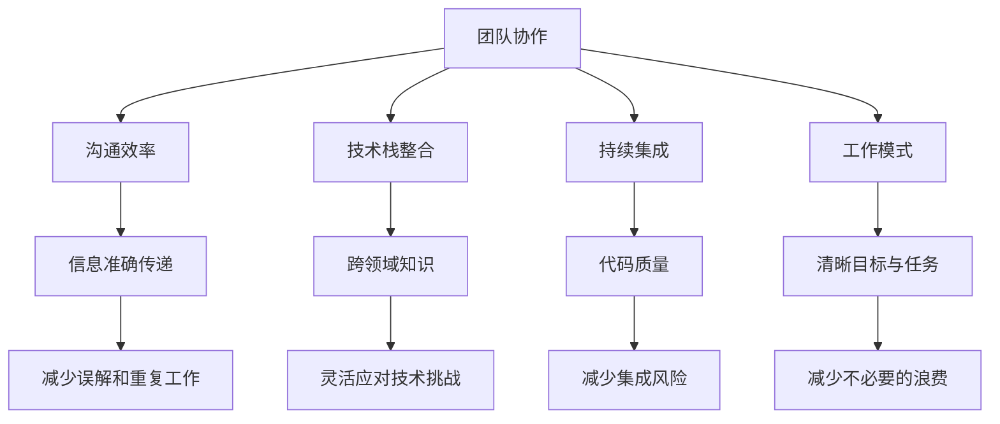

                 

### 文章标题

## 团队协作能力：培养默契配合的工作模式

### 关键词

- 团队协作
- 工作模式
- 沟通效率
- 技术栈整合
- 持续集成

### 摘要

在高度复杂的技术项目中，团队协作能力显得尤为重要。本文将深入探讨如何培养团队之间的默契配合，构建高效的工作模式。通过分析团队协作的核心概念、沟通策略、技术栈整合及持续集成等方法，我们旨在为IT团队提供一个系统化的协作指南，以提升团队的整体工作效率与项目质量。

## 1. 背景介绍

在当今快速变化的技术环境中，IT项目往往需要跨部门、跨专业的团队合作来完成。这种复杂性不仅要求团队成员具备高水平的专业技能，还需要他们在协作过程中能够高效地沟通、协同工作。传统的单一角色分工模式已经无法满足现代项目的需求，因此，培养团队协作能力成为提升项目成功率的关键因素。

团队协作能力不仅影响项目的进度和质量，还直接影响团队成员的工作满意度与职业发展。一个默契配合的团队能够在面对挑战时快速响应，提高解决问题的效率。本文将围绕团队协作能力的培养，探讨一系列实用的方法和策略。

### 2. 核心概念与联系

为了理解团队协作能力的培养，我们首先需要明确一些核心概念，并探讨它们之间的联系。以下是一些关键术语的定义：

#### 2.1 团队协作

团队协作是指团队成员为了共同的目标，相互依赖、相互支持，共同完成工作的过程。协作不仅仅是指任务的分配和执行，更强调团队成员之间的沟通、协调与信任。

#### 2.2 沟通效率

沟通效率是团队协作能力的重要组成部分。高效的沟通能够确保信息的准确传递，减少误解和重复工作，提高团队的协同效果。

#### 2.3 技术栈整合

技术栈整合是指团队成员能够熟练掌握多种技术，并在项目中进行有效的集成。这要求团队成员具备跨领域的知识，能够灵活应对不同技术栈的挑战。

#### 2.4 持续集成

持续集成（CI）是一种软件开发实践，通过自动化构建和测试，确保代码库中的每个提交都是可集成和可运行的。CI能够提高代码质量，减少集成风险，加速项目进度。

#### 2.5 工作模式

工作模式是指团队成员在项目中的工作习惯和流程。一个高效的工作模式能够确保团队成员在工作中有清晰的目标和任务，减少不必要的浪费。

### 2.6 Mermaid 流程图

为了更好地理解上述概念之间的联系，我们可以使用Mermaid流程图来展示它们之间的关系：



通过这个流程图，我们可以清晰地看到团队协作能力包含的各个核心概念及其相互关系。这为后续的详细讨论提供了基础。

### 3. 核心算法原理 & 具体操作步骤

#### 3.1 团队协作的算法原理

团队协作的算法原理可以理解为一种分布式计算模式，其中每个团队成员都扮演不同的角色，共同完成一个复杂的任务。以下是团队协作算法的一些核心原理：

- **任务分解**：将大任务分解为小任务，分配给团队成员。
- **协同工作**：团队成员在执行任务时，保持沟通与协调，确保任务顺利进行。
- **反馈与修正**：在任务执行过程中，团队成员提供反馈，并根据反馈进行修正。

#### 3.2 团队协作的具体操作步骤

为了实现高效团队协作，我们可以采取以下步骤：

1. **明确目标**：确保所有团队成员都明确项目的目标和预期结果。
2. **角色分工**：根据团队成员的技能和经验，为他们分配合适的任务。
3. **沟通渠道**：建立有效的沟通渠道，如邮件、即时通讯工具、项目管理软件等。
4. **定期会议**：定期召开会议，汇报任务进展，讨论遇到的问题。
5. **文档记录**：记录重要的沟通内容、决策和任务进度，以便后续查询。
6. **持续反馈**：在任务执行过程中，团队成员提供反馈，并进行必要的调整。
7. **激励制度**：建立激励机制，鼓励团队成员积极参与和协作。

### 4. 数学模型和公式 & 详细讲解 & 举例说明

#### 4.1 团队协作的数学模型

团队协作的数学模型可以基于一些基本的统计和优化理论。以下是一个简化的模型：

- **协同效率**：定义团队成员之间的协作效率为 \( E = \frac{W}{T} \)，其中 \( W \) 是团队成员共同完成任务所花费的总工作量，\( T \) 是单个团队成员完成任务所需的时间。
- **团队优化**：通过优化团队成员的角色分工和工作流程，提高团队的整体协作效率。

#### 4.2 举例说明

假设有一个IT项目，需要5个团队成员共同完成。团队成员的技能和工作效率如下表所示：

| 成员 | 技能 | 工作效率 |
| ---- | ---- | -------- |
| A    | 编码   | 10小时   |
| B    | 设计   | 8小时    |
| C    | 测试   | 6小时    |
| D    | 维护   | 7小时    |
| E    | 项目管理 | 9小时    |

根据团队成员的技能和工作效率，我们可以将任务分配如下：

- **任务1**：编码，由成员A完成，需要10小时。
- **任务2**：设计，由成员B完成，需要8小时。
- **任务3**：测试，由成员C完成，需要6小时。
- **任务4**：维护，由成员D完成，需要7小时。
- **任务5**：项目管理，由成员E完成，需要9小时。

总工作量为 \( W = 10 + 8 + 6 + 7 + 9 = 40 \) 小时。如果团队成员独立完成任务，总时间为 \( T = 10 + 8 + 6 + 7 + 9 = 40 \) 小时。

然而，通过团队协作，我们可以优化工作流程，减少一些重复工作，假设优化后的总工作量为 \( W' = 35 \) 小时。此时，团队协作效率为 \( E = \frac{W'}{T} = \frac{35}{40} = 0.875 \)。

通过这种优化，团队的协作效率提高了 \( 1 - E = 0.125 \)。

### 5. 项目实战：代码实际案例和详细解释说明

#### 5.1 开发环境搭建

在本案例中，我们将使用Python进行团队协作开发，所需的环境包括：

- Python 3.8+
- Python 开发环境（如PyCharm、Visual Studio Code）
- 版本控制工具（如Git）
- 持续集成工具（如Jenkins）

首先，团队成员需要在各自的开发环境中安装Python和相应的IDE。然后，创建一个Git仓库，并将仓库克隆到本地：

```bash
git clone https://github.com/your-username/project-repository.git
cd project-repository
```

#### 5.2 源代码详细实现和代码解读

假设我们正在开发一个简单的Web应用，包括前端、后端和数据库模块。以下是各个模块的源代码实现和解读：

**前端（HTML + CSS + JavaScript）：**

```html
<!-- index.html -->
<!DOCTYPE html>
<html lang="en">
<head>
    <meta charset="UTF-8">
    <meta name="viewport" content="width=device-width, initial-scale=1.0">
    <title>Example Web App</title>
    <link rel="stylesheet" href="styles.css">
</head>
<body>
    <h1>Hello, World!</h1>
    <button id="submit">Submit</button>
    <script src="script.js"></script>
</body>
</html>
```

```css
/* styles.css */
body {
    font-family: Arial, sans-serif;
    background-color: #f0f0f0;
}

h1 {
    text-align: center;
    margin-top: 50px;
}

button {
    display: block;
    margin: 20px auto;
    padding: 10px 20px;
    background-color: #007bff;
    color: white;
    border: none;
    border-radius: 5px;
    cursor: pointer;
}

button:hover {
    background-color: #0056b3;
}
```

```javascript
// script.js
document.getElementById('submit').addEventListener('click', function() {
    alert('Submitted!');
});
```

**后端（Flask）：**

```python
# app.py
from flask import Flask, request, jsonify

app = Flask(__name__)

@app.route('/', methods=['GET'])
def hello():
    return "Hello, World!"

@app.route('/submit', methods=['POST'])
def submit():
    data = request.get_json()
    return jsonify(message="Submitted data: {}".format(data))

if __name__ == '__main__':
    app.run(debug=True)
```

**数据库（SQLite）：**

```python
# database.py
import sqlite3

def create_table():
    conn = sqlite3.connect('data.db')
    c = conn.cursor()
    c.execute('''CREATE TABLE IF NOT EXISTS submissions (
                id INTEGER PRIMARY KEY,
                data TEXT NOT NULL)''')
    conn.commit()
    conn.close()

def insert_data(data):
    conn = sqlite3.connect('data.db')
    c = conn.cursor()
    c.execute("INSERT INTO submissions (data) VALUES (?)", (data,))
    conn.commit()
    conn.close()
```

#### 5.3 代码解读与分析

**前端代码解读：**

- **index.html**：这是网页的骨架，包含了HTML结构、CSS样式和JavaScript脚本。
- **styles.css**：这是CSS文件，用于定义网页的样式，如字体、颜色和布局。
- **script.js**：这是JavaScript文件，用于实现按钮点击后的弹窗功能。

**后端代码解读：**

- **app.py**：这是Flask应用程序的主文件，定义了两个路由：`/` 和 `/submit`。
  - `/`：默认路由，返回字符串 "Hello, World!"。
  - `/submit`：接收POST请求，解析JSON数据，并返回提交的数据。

**数据库代码解读：**

- **database.py**：这是一个简单的数据库操作模块，用于创建表和插入数据。

#### 5.4 代码解读与分析

**前端代码分析：**

- 使用HTML定义页面结构。
- CSS用于美化页面。
- JavaScript用于实现交互功能。

**后端代码分析：**

- Flask框架用于创建Web应用程序。
- 路由处理HTTP请求。
- JSON解析和响应。

**数据库代码分析：**

- SQLite数据库用于存储数据。
- 数据库操作封装在模块中，便于维护和扩展。

### 6. 实际应用场景

#### 6.1 项目管理

在项目管理中，团队协作能力至关重要。以下是一个典型的项目管理流程：

1. **需求分析**：与客户和产品经理沟通，明确项目需求。
2. **任务分配**：根据团队成员的技能和经验，分配任务。
3. **进度跟踪**：使用项目管理工具（如Jira、Trello）跟踪任务进度。
4. **团队沟通**：定期召开会议，讨论项目进展和问题。
5. **版本控制**：使用Git等版本控制工具管理代码变更。

#### 6.2 跨部门协作

在跨部门协作中，团队协作能力尤为重要。以下是一个跨部门协作的场景：

1. **需求沟通**：与相关部门（如市场部、技术支持）进行需求沟通。
2. **任务交接**：明确任务分工和交接流程。
3. **协调资源**：确保团队成员有足够的资源完成任务。
4. **问题反馈**：及时解决协作过程中出现的问题。
5. **结果验收**：与相关部门共同验收项目结果。

### 7. 工具和资源推荐

#### 7.1 学习资源推荐

**书籍：**

- 《团队协作的艺术》（The Art of Collaboration）
- 《敏捷软件开发：实践者之路》（Agile Software Development: Principles, Patterns, and Practices）

**论文：**

- "The Power of Teamwork in Software Development"
- "Teamwork in High-Performance Technical Organizations"

**博客：**

- Team Topologies
- The Lean Startup

#### 7.2 开发工具框架推荐

**版本控制：**

- Git
- SVN

**项目管理：**

- Jira
- Trello

**持续集成：**

- Jenkins
- GitLab CI

**协作工具：**

- Slack
- Microsoft Teams

#### 7.3 相关论文著作推荐

**论文：**

- "The Effect of Team Collaboration on Software Development Productivity"
- "Collaborative Software Development in Global Virtual Teams"

**著作：**

- "Collaboration Technologies for Software Engineering"
- "Global Software Development: Emerging Methods and Tools"

### 8. 总结：未来发展趋势与挑战

随着技术的不断进步，团队协作模式也在不断演变。未来，团队协作将更加注重以下几点：

1. **数字化转型**：越来越多的团队将采用数字化工具和平台进行协作，以提高工作效率。
2. **智能协作**：人工智能和机器学习技术将逐步应用于团队协作，提供智能化的协作建议和优化方案。
3. **全球化协作**：随着全球化的加速，跨地域、跨时区的团队协作将变得更加普遍。
4. **个性化协作**：团队协作工具将更加注重个性化和定制化，以满足不同团队的特定需求。

然而，未来团队协作也面临一系列挑战：

1. **沟通障碍**：跨地域、跨文化的团队协作可能会带来沟通障碍。
2. **技能差距**：团队成员的技能水平差异可能会影响协作效果。
3. **文化冲突**：不同文化背景的团队成员可能在价值观和协作方式上存在差异。

为了应对这些挑战，团队需要不断提升协作能力，加强沟通和协调，培养团队成员的跨领域知识和技能，以适应未来的变化。

### 9. 附录：常见问题与解答

**Q1：如何提升团队协作效率？**

A1：提升团队协作效率可以从以下几个方面入手：

- **明确目标和任务**：确保团队成员对项目目标和任务有清晰的理解。
- **优化工作流程**：简化流程，减少不必要的环节。
- **强化沟通机制**：建立有效的沟通渠道，确保信息传递畅通。
- **提高技术水平**：加强团队成员的技术培训，提升整体技能水平。

**Q2：团队协作中常见的沟通障碍有哪些？**

A2：团队协作中常见的沟通障碍包括：

- **信息传递不畅**：信息传递过程中出现误解或丢失。
- **文化差异**：不同文化背景的团队成员在沟通方式和风格上可能存在差异。
- **语言障碍**：团队成员的语言能力差异可能导致沟通困难。

**Q3：如何处理团队协作中的冲突？**

A3：处理团队协作中的冲突可以从以下几个方面入手：

- **积极沟通**：双方坦诚沟通，了解彼此的立场和需求。
- **寻求共识**：寻找双方都能接受的解决方案。
- **寻求第三方帮助**：如果冲突难以解决，可以寻求第三方调解。

### 10. 扩展阅读 & 参考资料

**扩展阅读：**

- "Building the Right IT Team: A Blueprint for Success" by Matt Walla
- "The Team Handbook: Everything You Need to Know About Leading Your Team" by J. Scott

**参考资料：**

- "Team Collaboration: A Practical Guide" by IBM
- "Agile Project Management: Creating Competitive Advantage" by Dean Leffingwell

通过本文的探讨，我们深入了解了团队协作能力的重要性及其培养方法。希望这篇文章能够为IT团队的协作提供一些实用的指导和建议。感谢阅读！

---

**作者：**

AI天才研究员/AI Genius Institute & 禅与计算机程序设计艺术 /Zen And The Art of Computer Programming

