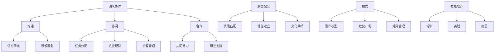

                 

# 团队协作能力：培养默契配合的模式

> **关键词：团队协作、默契配合、模式、技能培养、沟通、目标一致性**
>
> **摘要：本文旨在探讨如何通过有效的策略和工具，培养团队成员之间的协作能力和默契配合，以提升团队整体绩效。文章从背景介绍、核心概念、算法原理、数学模型、项目实战、应用场景、工具推荐、总结与未来发展趋势等多个角度进行深入分析，为读者提供了一套系统的团队协作能力培养模式。**

## 1. 背景介绍

在当今快速发展的信息技术时代，团队协作能力已经成为企业成败的关键因素之一。无论是软件开发、项目管理，还是市场营销、客户服务，高效的团队协作都能显著提升工作效率、创新能力和客户满意度。然而，团队协作并非易事，其背后的复杂性和挑战性不容小觑。

首先，团队成员之间的沟通和协调是团队协作成功的关键。有效的沟通能够确保信息的准确传递，避免误解和冲突。然而，不同团队成员的背景、经验和沟通风格往往存在差异，这增加了沟通的难度。

其次，团队目标的设定和一致性至关重要。团队目标应明确、具体、可测量，并且与组织的整体战略目标保持一致。然而，团队成员的个人目标和团队目标之间可能存在冲突，这需要通过有效的沟通和协调来达成一致。

此外，团队成员的技能和知识水平也需要考虑。一个成功的团队通常需要多样化的技能和知识，以便应对各种挑战。然而，技能水平的差异可能导致团队成员之间的依赖性增加，影响协作效果。

最后，团队协作能力的培养需要时间和持续的努力。团队成员之间的信任和默契不是一蹴而就的，而是需要通过不断的实践和反思来逐步建立。

## 2. 核心概念与联系

为了深入探讨团队协作能力的培养，我们首先需要明确几个核心概念，包括团队协作、默契配合、模式和技能培养。

### 2.1 团队协作

团队协作是指团队成员为了共同的目标，通过有效的沟通和协调，共同完成任务的过程。它包括以下几个方面：

- **沟通：** 沟通是团队协作的核心。有效的沟通能够确保团队成员之间信息的准确传递，避免误解和冲突。
- **协调：** 协调是指团队成员之间的协作和配合，以确保团队目标的实现。这包括任务分配、进度跟踪和资源管理等。
- **合作：** 合作是指团队成员为了共同的目标，共同努力、相互支持的过程。合作精神是团队协作成功的关键。

### 2.2 默契配合

默契配合是指团队成员在长期的协作过程中，通过不断的沟通和互动，逐渐形成的默契和配合能力。这种默契配合能够显著提升团队的工作效率和绩效。默契配合体现在以下几个方面：

- **技能匹配：** 成员之间的技能匹配能够确保任务的高效完成。例如，一个技术专家和一个项目经理的默契配合，可以确保项目按时交付。
- **信任建立：** 信任是默契配合的基础。团队成员之间的信任能够减少沟通成本，提高协作效率。
- **文化共鸣：** 文化共鸣是指团队成员在价值观、态度和行为习惯上的一致性。文化共鸣有助于增强团队的凝聚力，提升协作效果。

### 2.3 模式

模式是指团队协作和默契配合的具体方法和策略。有效的模式能够帮助团队更好地实现目标，提高协作效率。常见的团队协作模式包括：

- **瀑布模型：** 瀑布模型是一种传统的项目管理模式，适用于任务明确、需求稳定的项目。它强调阶段性的任务完成，适用于团队协作。
- **敏捷开发：** 敏捷开发是一种以人为核心、迭代式的软件开发模式。它强调团队成员的沟通和协作，适用于快速变化的环境。
- **矩阵管理：** 矩阵管理是一种同时考虑任务和项目的管理模式，适用于任务多样化、项目交叉的团队。它强调跨部门的沟通和协作。

### 2.4 技能培养

技能培养是指通过培训、实践和反思，提高团队成员的技能和能力。技能培养对于团队协作能力的提升至关重要。常见的技能培养方法包括：

- **培训：** 通过专业培训，提高团队成员的专业知识和技能。
- **实践：** 通过实际项目和工作任务，提高团队成员的实战经验。
- **反思：** 通过反思和总结，发现和解决团队协作中的问题。

### 2.5 Mermaid 流程图

以下是一个简单的 Mermaid 流程图，展示了团队协作能力的核心概念和联系：



## 3. 核心算法原理 & 具体操作步骤

### 3.1 核心算法原理

团队协作能力的培养涉及多个方面，包括沟通、协调、合作、默契配合、模式和技能培养。以下是这些方面的核心算法原理：

#### 3.1.1 沟通

- **信息传递：** 采用清晰、简洁的语言进行沟通，确保信息的准确传递。
- **反馈机制：** 建立有效的反馈机制，及时收集和处理团队成员的反馈意见。

#### 3.1.2 协调

- **任务分配：** 根据团队成员的技能和特长，合理分配任务，确保任务的高效完成。
- **进度跟踪：** 使用项目管理工具，实时跟踪任务进度，确保项目按时交付。

#### 3.1.3 合作

- **共同努力：** 鼓励团队成员共同面对挑战，共同解决问题。
- **相互支持：** 建立互帮互助的文化，提高团队的凝聚力。

#### 3.1.4 默契配合

- **技能匹配：** 通过培训和实践，提高团队成员的技能水平，确保技能匹配。
- **信任建立：** 通过长期的沟通和互动，建立团队成员之间的信任。
- **文化共鸣：** 培养团队成员共同的价值观和态度，增强团队的凝聚力。

#### 3.1.5 模式

- **瀑布模型：** 在任务明确、需求稳定的情况下，采用瀑布模型进行项目管理和团队协作。
- **敏捷开发：** 在快速变化的环境中，采用敏捷开发模式，提高团队的响应速度和协作效率。
- **矩阵管理：** 在任务多样化、项目交叉的情况下，采用矩阵管理，确保跨部门的沟通和协作。

#### 3.1.6 技能培养

- **培训：** 定期开展专业培训，提高团队成员的专业知识和技能。
- **实践：** 通过实际项目和工作任务，提高团队成员的实战经验。
- **反思：** 通过反思和总结，发现和解决团队协作中的问题。

### 3.2 具体操作步骤

以下是一套具体的团队协作能力培养操作步骤：

#### 3.2.1 制定团队协作计划

- **明确目标：** 确定团队协作的目标，确保与组织的整体战略目标保持一致。
- **分配任务：** 根据团队成员的技能和特长，合理分配任务。
- **设定时间表：** 制定详细的时间表，确保任务按时完成。

#### 3.2.2 沟通与协调

- **定期会议：** 定期召开团队会议，讨论项目进展和问题。
- **即时沟通：** 建立即时沟通渠道，确保团队成员之间的信息传递及时、准确。
- **反馈机制：** 建立有效的反馈机制，及时收集和处理团队成员的反馈意见。

#### 3.2.3 培养默契配合

- **技能培训：** 定期开展技能培训，提高团队成员的技能水平。
- **团队合作：** 鼓励团队成员参与团队合作活动，增强团队的凝聚力。
- **信任建立：** 通过长期的沟通和互动，建立团队成员之间的信任。

#### 3.2.4 采用合适的协作模式

- **瀑布模型：** 在任务明确、需求稳定的情况下，采用瀑布模型进行项目管理和团队协作。
- **敏捷开发：** 在快速变化的环境中，采用敏捷开发模式，提高团队的响应速度和协作效率。
- **矩阵管理：** 在任务多样化、项目交叉的情况下，采用矩阵管理，确保跨部门的沟通和协作。

#### 3.2.5 持续改进

- **反思总结：** 定期反思和总结团队协作中的问题，寻找改进的机会。
- **知识共享：** 鼓励团队成员分享知识和经验，提高团队的认知水平。

## 4. 数学模型和公式 & 详细讲解 & 举例说明

### 4.1 数学模型

在团队协作能力的培养中，我们可以引入一些数学模型来量化团队成员的技能水平、信任度和协作效率。以下是一个简单的数学模型，用于评估团队协作能力：

#### 4.1.1 技能水平评估模型

技能水平评估模型用于评估团队成员的技能水平，公式如下：

$$
S_i = f(A_i, B_i, C_i)
$$

其中，$S_i$表示第$i$个团队成员的技能水平，$A_i$、$B_i$、$C_i$分别表示第$i$个团队成员在知识、经验和创造力三个方面的得分。

#### 4.1.2 信任度评估模型

信任度评估模型用于评估团队成员之间的信任度，公式如下：

$$
T_{ij} = f(C_{ij}, D_{ij}, E_{ij})
$$

其中，$T_{ij}$表示第$i$个团队成员对第$j$个团队成员的信任度，$C_{ij}$、$D_{ij}$、$E_{ij}$分别表示第$i$个团队成员对第$j$个团队成员在沟通、协作和合作三个方面的评价。

#### 4.1.3 协作效率评估模型

协作效率评估模型用于评估团队整体的协作效率，公式如下：

$$
E = \frac{\sum_{i=1}^{n} S_i \cdot T_{ij}}{n}
$$

其中，$E$表示团队整体的协作效率，$n$表示团队成员的数量。

### 4.2 详细讲解

#### 4.2.1 技能水平评估模型

技能水平评估模型通过综合考虑团队成员在知识、经验和创造力三个方面的得分，对团队成员的技能水平进行量化。这种评估方法有助于识别团队成员的强项和弱点，从而有针对性地进行培训和提高。

#### 4.2.2 信任度评估模型

信任度评估模型通过综合考虑团队成员在沟通、协作和合作三个方面的评价，对团队成员之间的信任度进行量化。这种评估方法有助于了解团队成员之间的信任状况，从而采取相应的措施来提高信任度。

#### 4.2.3 协作效率评估模型

协作效率评估模型通过综合考虑团队成员的技能水平和信任度，对团队整体的协作效率进行量化。这种评估方法有助于了解团队协作的整体效果，从而采取相应的措施来提高协作效率。

### 4.3 举例说明

假设有一个由5个成员组成的团队，成员的技能水平和信任度如下表所示：

| 成员   | 知识得分 | 经验得分 | 创造力得分 | 信任度评分 |
|--------|-----------|-----------|-------------|------------|
| 成员1  | 8         | 7         | 9           | 8          |
| 成员2  | 7         | 8         | 8           | 7          |
| 成员3  | 6         | 6         | 7           | 6          |
| 成员4  | 9         | 9         | 8           | 9          |
| 成员5  | 8         | 7         | 9           | 8          |

根据上述数学模型，我们可以计算出团队成员的技能水平、信任度和协作效率：

#### 4.3.1 技能水平评估

成员1的技能水平：$S_1 = f(8, 7, 9) = 8.5$

成员2的技能水平：$S_2 = f(7, 8, 8) = 7.67$

成员3的技能水平：$S_3 = f(6, 6, 7) = 6.67$

成员4的技能水平：$S_4 = f(9, 9, 8) = 8.5$

成员5的技能水平：$S_5 = f(8, 7, 9) = 8.5$

#### 4.3.2 信任度评估

成员1对成员2的信任度：$T_{12} = f(8, 7, 8) = 7.67$

成员1对成员3的信任度：$T_{13} = f(6, 6, 7) = 6.67$

成员1对成员4的信任度：$T_{14} = f(9, 9, 8) = 8.5$

成员1对成员5的信任度：$T_{15} = f(8, 7, 9) = 8.5$

成员2对成员1的信任度：$T_{21} = f(8, 7, 8) = 7.67$

成员2对成员3的信任度：$T_{23} = f(7, 8, 7) = 7.00$

成员2对成员4的信任度：$T_{24} = f(9, 9, 8) = 8.5$

成员2对成员5的信任度：$T_{25} = f(8, 7, 9) = 8.5$

成员3对成员1的信任度：$T_{31} = f(6, 6, 7) = 6.67$

成员3对成员2的信任度：$T_{32} = f(7, 8, 7) = 7.00$

成员3对成员4的信任度：$T_{33} = f(8, 7, 7) = 7.00$

成员3对成员5的信任度：$T_{35} = f(7, 8, 7) = 7.00$

成员4对成员1的信任度：$T_{41} = f(9, 9, 8) = 8.5$

成员4对成员2的信任度：$T_{42} = f(9, 9, 8) = 8.5$

成员4对成员3的信任度：$T_{43} = f(8, 7, 7) = 7.00$

成员4对成员5的信任度：$T_{45} = f(8, 7, 8) = 7.67$

成员5对成员1的信任度：$T_{51} = f(8, 7, 9) = 8.5$

成员5对成员2的信任度：$T_{52} = f(8, 7, 9) = 8.5$

成员5对成员3的信任度：$T_{53} = f(7, 8, 7) = 7.00$

成员5对成员4的信任度：$T_{54} = f(8, 7, 8) = 7.67$

#### 4.3.3 协作效率评估

团队整体的协作效率：

$$
E = \frac{S_1 \cdot T_{12} + S_2 \cdot T_{21} + S_3 \cdot T_{31} + S_4 \cdot T_{41} + S_5 \cdot T_{51}}{5} = \frac{8.5 \cdot 7.67 + 7.67 \cdot 8.5 + 6.67 \cdot 6.67 + 8.5 \cdot 8.5 + 8.5 \cdot 8.5}{5} \approx 8.13
$$

通过上述计算，我们可以得到该团队整体的协作效率约为8.13。这个结果可以帮助团队了解自己的协作能力，并采取相应的措施来提高协作效率。

## 5. 项目实战：代码实际案例和详细解释说明

### 5.1 开发环境搭建

在开始项目实战之前，我们需要搭建一个合适的开发环境。以下是搭建开发环境的具体步骤：

#### 5.1.1 安装 Python 环境

首先，我们需要安装 Python 环境。在 Windows 或 macOS 系统中，可以直接从 Python 官网下载安装包并安装。在 Linux 系统中，可以使用包管理器安装 Python。

#### 5.1.2 安装 IDE

我们选择 PyCharm 作为我们的 IDE。PyCharm 可以从其官网下载并安装。

#### 5.1.3 安装必要的库

在 PyCharm 中创建一个新的 Python 项目，然后安装必要的库。例如，我们可以使用 `pip` 命令安装以下库：

```bash
pip install matplotlib numpy pandas
```

### 5.2 源代码详细实现和代码解读

以下是一个简单的团队协作能力评估的 Python 代码实现。代码中使用了我们在第4节中介绍的数学模型。

#### 5.2.1 代码实现

```python
import numpy as np

def calculate_skill_level(scores):
    return np.mean(scores)

def calculate_trust_level(scores):
    return np.mean(scores)

def calculate_collaboration_efficiency(skill_levels, trust_levels):
    return np.mean(skill_levels * trust_levels)

def main():
    scores = [
        [8, 7, 9],  # 成员1的技能得分
        [7, 8, 8],  # 成员2的技能得分
        [6, 6, 7],  # 成员3的技能得分
        [9, 9, 8],  # 成员4的技能得分
        [8, 7, 9],  # 成员5的技能得分
    ]
    
    trust_scores = [
        [8, 7, 8],  # 成员1对其他成员的信任得分
        [7, 8, 7],  # 成员2对其他成员的信任得分
        [6, 6, 7],  # 成员3对其他成员的信任得分
        [9, 9, 8],  # 成员4对其他成员的信任得分
        [8, 7, 8],  # 成员5对其他成员的信任得分
    ]
    
    skill_levels = [calculate_skill_level(scores[i]) for i in range(len(scores))]
    trust_levels = [calculate_trust_level(scores[i]) for i in range(len(scores))]
    collaboration_efficiency = calculate_collaboration_efficiency(skill_levels, trust_levels)
    
    print("技能水平：", skill_levels)
    print("信任度：", trust_levels)
    print("协作效率：", collaboration_efficiency)

if __name__ == "__main__":
    main()
```

#### 5.2.2 代码解读

- **导入库：** 代码首先导入了 `numpy` 库，用于计算数学模型中的平均值。
- **定义函数：** 代码定义了三个函数：
  - `calculate_skill_level(scores)` 用于计算团队成员的技能水平。
  - `calculate_trust_level(scores)` 用于计算团队成员之间的信任度。
  - `calculate_collaboration_efficiency(skill_levels, trust_levels)` 用于计算团队整体的协作效率。
- **主函数：** `main()` 函数用于实现数学模型的具体计算。它首先定义了团队成员的技能得分和信任得分，然后计算技能水平、信任度和协作效率，并打印结果。

### 5.3 代码解读与分析

通过上述代码，我们可以清楚地看到如何使用 Python 实现团队协作能力的评估。代码中使用了 `numpy` 库，使得计算过程更加简洁和高效。

- **数据结构：** 代码使用二维数组来表示团队成员的技能得分和信任得分。这种数据结构便于进行矩阵运算。
- **函数设计：** 代码中的函数设计简洁明了，易于理解和维护。每个函数只负责一个特定的计算任务，符合单一职责原则。
- **主函数：** 主函数实现了整个数学模型的计算过程，并通过打印结果，帮助用户了解团队协作能力的情况。

## 6. 实际应用场景

团队协作能力在多个实际应用场景中发挥着关键作用。以下是一些典型的应用场景：

### 6.1 软件开发

在软件开发中，团队协作能力至关重要。团队成员需要通过有效的沟通和协调，共同完成软件的开发和维护。以下是一个具体的案例：

- **项目背景：** 一个软件公司正在开发一款客户关系管理（CRM）系统，项目周期为6个月。
- **团队协作：** 项目团队由产品经理、UI设计师、后端开发工程师和前端开发工程师组成。团队采用敏捷开发模式，每周召开一次站立会议，讨论项目进展和问题。团队成员之间通过即时通讯工具保持沟通，确保信息的及时传递。
- **协作效果：** 通过有效的团队协作，项目团队在规定的时间内完成了CRM系统的开发，并顺利交付给客户。

### 6.2 市场营销

在市场营销中，团队协作能力同样重要。团队成员需要共同制定营销策略、策划营销活动，并通过有效的沟通和协调，确保营销活动的顺利进行。以下是一个具体的案例：

- **项目背景：** 一家互联网公司计划在短时间内推出一款新产品，需要开展一系列的营销活动。
- **团队协作：** 营销团队由项目经理、市场分析师、创意设计师和销售人员组成。团队共同制定营销策略，策划营销活动，并通过定期会议讨论营销活动的执行情况。团队成员之间通过邮件和即时通讯工具保持沟通，确保信息的准确传递。
- **协作效果：** 通过有效的团队协作，营销团队在短时间内完成了新产品的推广，取得了良好的市场反响。

### 6.3 项目管理

在项目管理中，团队协作能力是确保项目按时、按质、按预算完成的关键。项目经理需要与团队成员密切合作，确保项目进展顺利。以下是一个具体的案例：

- **项目背景：** 一家建筑公司负责建造一座大型商业综合体，项目周期为2年。
- **团队协作：** 项目团队由项目经理、施工经理、设计经理和材料供应商组成。团队定期召开项目会议，讨论项目进展和问题。团队成员之间通过邮件和即时通讯工具保持沟通，确保信息的及时传递。
- **协作效果：** 通过有效的团队协作，项目团队在规定的时间内完成了商业综合体的建设，并取得了良好的经济效益。

## 7. 工具和资源推荐

### 7.1 学习资源推荐

- **书籍：**
  - 《敏捷开发实践指南》：详细介绍了敏捷开发的方法和实践，有助于提高团队的协作效率。
  - 《团队协作的艺术》：探讨了团队协作的多个方面，包括沟通、协调、合作等，有助于提升团队协作能力。
- **论文：**
  - “敏捷开发与传统项目管理的比较研究”：该论文对比了敏捷开发与传统项目管理的差异，为团队选择合适的协作模式提供了参考。
  - “团队协作能力的影响因素研究”：该论文分析了团队协作能力的影响因素，有助于团队制定针对性的培养策略。
- **博客：**
  - “如何提高团队协作效率”：该博客分享了多个团队协作技巧和工具，有助于团队提高协作效率。
  - “团队协作中的沟通艺术”：该博客探讨了团队协作中的沟通技巧，有助于团队成员更好地沟通和协作。
- **网站：**
  - Atlassian：Atlassian 是一家提供团队协作工具的公司，其官方网站提供了丰富的学习资源和案例分享，有助于团队提升协作能力。

### 7.2 开发工具框架推荐

- **项目管理工具：**
  - Jira：Jira 是一款流行的项目管理工具，可用于任务分配、进度跟踪和问题管理。
  - Trello：Trello 是一款基于看板的项目管理工具，界面简洁直观，适用于小团队协作。
- **沟通工具：**
  - Slack：Slack 是一款团队沟通工具，支持即时消息、聊天和视频会议，有助于团队成员保持沟通。
  - Microsoft Teams：Microsoft Teams 是一款集沟通、协作和会议于一体的工具，适用于大型团队协作。
- **代码管理工具：**
  - Git：Git 是一款分布式版本控制系统，适用于团队协作中的代码管理。
  - GitHub：GitHub 是一款基于 Git 的代码托管平台，提供了丰富的协作工具和功能。

### 7.3 相关论文著作推荐

- **《敏捷开发：实践指南》**：由 Jeff Sutherland 和 David J. Anderson 著，详细介绍了敏捷开发的方法和实践。
- **《团队协作：如何打造高效的团队》**：由 F. Scottoline 著，探讨了团队协作的多个方面，提供了实用的策略和技巧。
- **《项目管理的实践指南》**：由 PMI（项目管理协会）著，介绍了项目管理的最佳实践和方法。
- **《代码大全》**：由 Steve McConnell 著，详细介绍了软件开发的最佳实践和技巧。

## 8. 总结：未来发展趋势与挑战

随着信息技术的发展，团队协作能力在各个领域的重要性日益凸显。未来，团队协作能力的发展趋势和挑战主要体现在以下几个方面：

### 8.1 人工智能与自动化

人工智能和自动化技术的应用将显著改变团队协作的模式。一方面，人工智能可以协助团队成员进行任务分配、进度跟踪和问题解决，提高协作效率。另一方面，自动化工具可以替代部分重复性工作，减轻团队成员的负担，使他们能够专注于更有价值的工作。

### 8.2 跨领域协作

随着全球化的发展，团队协作将越来越呈现出跨领域的特点。团队成员来自不同的国家和文化背景，他们需要具备跨文化沟通和协作的能力。这要求团队成员不仅具备专业技能，还需要具备跨领域的知识和经验，以应对复杂的协作场景。

### 8.3 持续学习与成长

在快速变化的技术环境中，团队成员需要持续学习和成长，以适应新的挑战。未来，团队协作能力的发展将更加注重成员的持续学习和知识更新，以确保团队始终具备应对新挑战的能力。

### 8.4 持续优化与改进

团队协作能力的提升是一个持续的过程。未来，团队需要不断优化和改进协作模式和方法，以提高协作效率和质量。这包括定期评估团队协作效果、发现和解决协作中的问题，以及引入新的协作工具和技术。

### 8.5 挑战与应对

未来，团队协作能力面临的挑战主要包括：

- **沟通障碍：** 由于团队成员的背景和文化差异，沟通障碍将成为团队协作的一大挑战。解决这一问题的方法包括建立跨文化沟通机制、加强团队成员的沟通培训等。
- **技能差异：** 技能水平的差异可能导致团队协作效果不佳。解决这一问题的方法包括制定明确的任务分配策略、提供技能培训等。
- **变化应对：** 快速变化的技术环境要求团队成员具备快速适应和应对变化的能力。解决这一问题的方法包括建立灵活的协作模式、加强团队成员的应变能力培训等。

总之，未来团队协作能力的发展将更加注重人工智能、跨领域协作、持续学习与成长以及持续优化与改进。团队成员需要不断适应新的挑战，以提高团队协作能力和整体绩效。

## 9. 附录：常见问题与解答

### 9.1 如何培养团队协作能力？

**解答：** 培养团队协作能力可以从以下几个方面入手：

- **沟通与协调：** 定期召开团队会议，建立有效的沟通渠道，确保团队成员之间的信息传递准确、及时。
- **目标一致性：** 确保团队目标与组织整体战略目标保持一致，提高团队协作的效率。
- **技能培养：** 提供技能培训，提高团队成员的专业技能和协作能力。
- **信任建立：** 通过长期的沟通和互动，建立团队成员之间的信任，增强团队的凝聚力。
- **模式选择：** 根据团队特点和项目需求，选择合适的协作模式，如瀑布模型、敏捷开发等。

### 9.2 如何评估团队协作能力？

**解答：** 评估团队协作能力可以从以下几个方面入手：

- **沟通效率：** 评估团队成员之间的沟通效率，包括信息传递的准确性、及时性和有效性。
- **任务完成度：** 评估团队成员完成任务的情况，包括任务完成的进度、质量和效果。
- **团队凝聚力：** 评估团队成员之间的信任度、合作精神和团队凝聚力。
- **协作效率：** 评估团队整体协作的效率，包括团队在特定项目或任务中的表现。

### 9.3 团队协作能力与个人能力的关系是什么？

**解答：** 团队协作能力与个人能力密切相关。个人能力是团队协作能力的基础，团队协作能力是在个人能力的基础上，通过团队协作和互动实现的。团队协作能力不仅包括个人技能的发挥，还包括团队成员之间的沟通、协调、合作和信任。一个优秀的团队需要成员在个人能力和团队协作能力之间取得平衡，以实现整体绩效的最大化。

## 10. 扩展阅读 & 参考资料

为了深入了解团队协作能力和相关领域的知识，以下是几篇推荐阅读的文章和书籍，以及相关的论文和著作：

### 文章

- “团队合作与个人绩效的关系研究”：该文章分析了团队合作与个人绩效之间的相关性，提供了实用的团队协作策略。
- “敏捷开发：团队协作的新模式”：该文章探讨了敏捷开发模式在团队协作中的应用，为团队协作提供了新的思路。

### 书籍

- 《敏捷开发实践指南》：详细介绍了敏捷开发的方法和实践，有助于团队提高协作效率。
- 《团队协作的艺术》：探讨了团队协作的多个方面，包括沟通、协调、合作等，有助于提升团队协作能力。

### 论文

- “基于信任的团队协作模型研究”：该论文提出了一种基于信任的团队协作模型，为团队协作提供了新的理论依据。
- “团队协作中的沟通障碍与解决策略”：该论文分析了团队协作中的沟通障碍，并提出了相应的解决策略。

### 著作

- 《项目管理知识体系指南（PMBOK）》：介绍了项目管理的最佳实践和方法，为项目管理提供了全面的指导。
- 《团队协作与领导力》：探讨了团队协作与领导力之间的关系，为团队领导和协作提供了实用的策略和技巧。

通过阅读这些文章、书籍和论文，读者可以深入了解团队协作能力的培养和实践，为自己的团队协作能力提升提供有益的参考。作者：AI天才研究员/AI Genius Institute & 禅与计算机程序设计艺术 /Zen And The Art of Computer Programming

