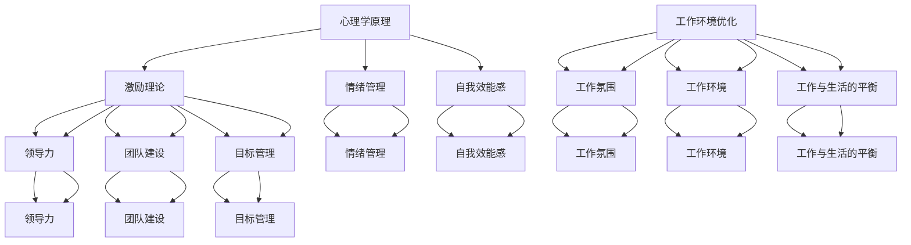

                 

# 团队士气提升：保持高昂工作热情的策略

## 摘要

在当今快速发展的信息技术领域，团队士气的高低直接影响到项目的质量和效率。本文将探讨如何通过一系列策略来提升团队士气，保持团队成员的高昂工作热情。我们将从心理学、团队管理、工作环境优化等多个方面进行深入分析，并提供实用的方法，帮助团队成员在紧张的工作中保持积极向上的态度。通过本文的探讨，希望能够为IT团队管理者提供有益的参考。

## 1. 背景介绍

在信息技术行业，团队士气的重要性不言而喻。团队成员的工作状态直接影响着项目的进度、质量和团队之间的合作。高昂的团队士气有助于激发成员的创造力和解决问题的能力，从而提高整体工作效率。然而，现实中的工作压力、沟通障碍、工作环境等问题往往会导致团队士气下降，影响项目的顺利推进。

### 1.1 团队士气的影响因素

团队士气的高低受到多种因素的影响，主要包括以下几个方面：

- **工作压力**：过大的工作压力容易导致团队成员感到焦虑和疲惫，降低工作热情。
- **沟通障碍**：团队内部沟通不畅可能导致误解和矛盾，影响团队士气。
- **工作环境**：不良的工作环境，如噪音、设备故障等，会影响团队成员的专注力和工作效率。
- **个人成长**：团队成员在职业生涯中的成长和发展需求得不到满足，可能导致士气下降。
- **团队管理**：团队管理者在激励、支持、沟通等方面的能力直接影响团队士气。

### 1.2 团队士气的重要性

团队士气对项目的影响主要体现在以下几个方面：

- **工作效率**：高昂的团队士气能够提高团队成员的工作效率，促进项目进度。
- **创新能力**：团队成员在积极向上的工作氛围中更容易产生创新的想法，提高项目的竞争力。
- **团队合作**：良好的团队士气有助于增强团队成员之间的信任和协作，提高团队的整体执行力。
- **员工满意度**：提高团队士气能够提升员工的工作满意度和忠诚度，降低员工流失率。

## 2. 核心概念与联系

在探讨如何提升团队士气之前，我们需要明确一些核心概念，以便更好地理解问题。以下是本文涉及的核心概念及其相互联系：

### 2.1 心理学原理

- **激励理论**：激励理论探讨如何通过外部奖励和内部动机来提高员工的工作热情。激励理论包括马斯洛的需求层次理论、赫茨伯格的双因素理论等。
- **情绪管理**：情绪管理是指团队成员在面对压力和挑战时，如何调节自己的情绪，保持积极的心态。情绪管理有助于降低工作压力，提高团队士气。
- **自我效能感**：自我效能感是指个体对自身能力的信心。高自我效能感的团队成员更愿意接受挑战，面对困难时更有信心，从而有助于提升团队士气。

### 2.2 团队管理原理

- **领导力**：领导力是指团队管理者如何通过激励、指导、沟通等手段来影响团队成员的行为和态度。有效的领导力有助于提升团队士气。
- **团队建设**：团队建设是指通过一系列活动和措施来增强团队成员之间的信任和合作。团队建设有助于建立良好的团队氛围，提高团队士气。
- **目标管理**：目标管理是指通过明确团队和个人的目标，提高团队成员的参与感和责任感。明确的目标有助于激发团队成员的工作热情，提高团队士气。

### 2.3 工作环境优化

- **工作氛围**：良好的工作氛围能够提高团队成员的满意度和工作热情。工作氛围包括团队文化、团队沟通方式、团队活动等。
- **工作环境**：舒适的工作环境能够提高团队成员的专注力和工作效率。工作环境包括办公设备、办公空间、噪音控制等。
- **工作与生活的平衡**：工作与生活的平衡是提高团队士气的重要方面。合理的工作时间、灵活的工作方式等都有助于提升团队成员的生活质量，从而提高团队士气。

### 2.4 Mermaid 流程图

以下是一个关于团队士气提升策略的 Mermaid 流程图，展示了各个核心概念之间的相互联系：



## 3. 核心算法原理 & 具体操作步骤

### 3.1 心理学原理在团队士气提升中的应用

在提升团队士气的过程中，心理学原理发挥着至关重要的作用。以下是几种常见的心理学原理及其应用：

#### 3.1.1 激励理论

激励理论的核心在于通过外部奖励和内部动机来提高员工的工作热情。以下是一些具体操作步骤：

1. **明确奖励机制**：制定明确的奖励机制，确保奖励与工作绩效挂钩。奖励可以是金钱、荣誉、晋升等。
2. **认可与表扬**：对团队成员的进步和成果进行认可与表扬，提高他们的自我效能感。
3. **设定合理的目标**：设定具体、可量化的目标，使团队成员明确自己的工作方向和期望成果。

#### 3.1.2 情绪管理

情绪管理是指团队成员在面对压力和挑战时，如何调节自己的情绪，保持积极的心态。以下是一些具体操作步骤：

1. **培养情绪调节能力**：通过培训、读书、交流等方式，提高团队成员的情绪调节能力。
2. **提供心理支持**：为团队成员提供心理支持，帮助他们应对工作中的压力和挑战。
3. **建立正面情绪氛围**：营造积极向上的工作氛围，减少负面情绪的传播。

#### 3.1.3 自我效能感

自我效能感是指个体对自身能力的信心。以下是一些具体操作步骤：

1. **提供培训和学习机会**：为团队成员提供培训和学习机会，提高他们的技能和知识水平。
2. **鼓励自主学习和创新**：鼓励团队成员自主学习和创新，提高他们的自我效能感。
3. **反馈与支持**：及时给予团队成员反馈和支持，让他们感受到自己的努力得到了认可。

### 3.2 团队管理原理在团队士气提升中的应用

团队管理原理在提升团队士气方面同样发挥着重要作用。以下是一些常见的管理原理及其应用：

#### 3.2.1 领导力

领导力是指团队管理者如何通过激励、指导、沟通等手段来影响团队成员的行为和态度。以下是一些具体操作步骤：

1. **树立榜样**：团队管理者要以身作则，树立良好的榜样，提高团队成员的信任度。
2. **有效沟通**：团队管理者要与团队成员保持有效沟通，了解他们的需求和意见。
3. **激励与支持**：团队管理者要善于发现团队成员的潜力，给予他们适当的激励和支持。

#### 3.2.2 团队建设

团队建设是指通过一系列活动和措施来增强团队成员之间的信任和合作。以下是一些具体操作步骤：

1. **开展团队活动**：组织团队活动，如团建、聚餐、户外运动等，增强团队成员之间的了解和信任。
2. **设立共同目标**：明确团队目标，让团队成员明确自己在团队中的角色和责任。
3. **鼓励合作与分享**：鼓励团队成员之间的合作与分享，提高团队的凝聚力和战斗力。

#### 3.2.3 目标管理

目标管理是指通过明确团队和个人的目标，提高团队成员的参与感和责任感。以下是一些具体操作步骤：

1. **设定明确的目标**：确保团队和个人的目标具体、可量化，易于评估。
2. **制定行动计划**：为达成目标，制定详细的行动计划，明确每个成员的职责和任务。
3. **监督与反馈**：对团队成员的工作进行监督和反馈，确保目标得到有效执行。

### 3.3 工作环境优化在团队士气提升中的应用

工作环境优化在提升团队士气方面也具有重要作用。以下是一些常见的工作环境优化措施及其应用：

#### 3.3.1 工作氛围

良好的工作氛围能够提高团队成员的满意度和工作热情。以下是一些具体操作步骤：

1. **营造积极向上的氛围**：通过宣传、活动等方式，营造积极向上的工作氛围。
2. **建立良好的沟通渠道**：确保团队成员之间能够顺畅地沟通，减少误解和冲突。
3. **鼓励创新与反馈**：鼓励团队成员提出创新想法，并对他们的反馈给予关注和回应。

#### 3.3.2 工作环境

舒适的工作环境能够提高团队成员的专注力和工作效率。以下是一些具体操作步骤：

1. **改善办公环境**：确保办公环境整洁、舒适，减少噪音、光线等对工作的干扰。
2. **提供必要的设备**：为团队成员提供高性能、易用的办公设备，提高工作效率。
3. **合理安排工作任务**：确保团队成员的工作任务合理、适度，避免过度劳累。

#### 3.3.3 工作与生活的平衡

工作与生活的平衡是提高团队士气的重要方面。以下是一些具体操作步骤：

1. **制定合理的作息时间**：确保团队成员有足够的时间休息和娱乐，缓解工作压力。
2. **提供灵活的工作方式**：鼓励团队成员采用远程办公、弹性工作时间等灵活的工作方式，提高生活质量。
3. **关注团队成员的心理健康**：定期开展心理健康讲座、心理辅导等活动，关注团队成员的心理健康。

## 4. 数学模型和公式 & 详细讲解 & 举例说明

在团队士气提升的过程中，数学模型和公式可以帮助我们更好地理解问题和制定策略。以下是一个简单的数学模型，用于分析团队士气的影响因素：

### 4.1 团队士气评估模型

设团队士气 \( S \) 受到以下因素的影响：

- 工作压力 \( P \)
- 沟通障碍 \( C \)
- 工作环境 \( E \)
- 个人成长 \( G \)
- 团队管理 \( M \)

团队士气评估模型可以表示为：

$$
S = f(P, C, E, G, M)
$$

其中，\( f \) 为复杂的函数关系，表示各种因素对团队士气的影响。

### 4.2 影响因素分析

以下是各个影响因素的详细分析：

#### 4.2.1 工作压力

工作压力 \( P \) 对团队士气的影响主要通过以下几个方面：

- **工作效率**：高压力可能导致团队成员工作效率降低，影响项目进度。
- **情绪管理**：高压力可能导致团队成员情绪波动，影响团队士气。
- **健康问题**：长期高压力可能导致团队成员出现健康问题，降低团队士气。

#### 4.2.2 沟通障碍

沟通障碍 \( C \) 对团队士气的影响主要通过以下几个方面：

- **误解与矛盾**：沟通障碍可能导致团队成员之间的误解和矛盾，降低团队士气。
- **协作效率**：沟通障碍会影响团队成员之间的协作效率，降低团队士气。
- **信任度**：沟通障碍可能导致团队成员之间的信任度降低，影响团队士气。

#### 4.2.3 工作环境

工作环境 \( E \) 对团队士气的影响主要通过以下几个方面：

- **工作氛围**：良好的工作氛围能够提高团队成员的满意度和工作热情。
- **办公设备**：高性能的办公设备能够提高团队成员的工作效率。
- **办公空间**：舒适的办公空间能够提高团队成员的专注力和工作效率。

#### 4.2.4 个人成长

个人成长 \( G \) 对团队士气的影响主要通过以下几个方面：

- **自我效能感**：个人成长能够提高团队成员的自我效能感，增强自信心。
- **成就感**：个人成长能够带来成就感，提高团队士气。
- **职业规划**：个人成长有助于团队成员明确自己的职业规划，提高工作动力。

#### 4.2.5 团队管理

团队管理 \( M \) 对团队士气的影响主要通过以下几个方面：

- **领导力**：有效的领导力能够提高团队成员的信任度和满意度。
- **激励与支持**：激励与支持能够提高团队成员的工作热情和积极性。
- **沟通与反馈**：良好的沟通与反馈能够增强团队成员之间的信任和合作。

### 4.3 举例说明

假设有一个IT团队，团队成员人数为10人。以下是对该团队士气的影响因素及其影响的举例说明：

- **工作压力**：最近项目进度紧张，团队成员普遍感到压力大，工作效率下降，团队士气受到影响。
- **沟通障碍**：团队成员之间存在误解和矛盾，沟通不畅，团队士气下降。
- **工作环境**：办公环境噪音大，办公设备老旧，团队士气受到影响。
- **个人成长**：团队成员普遍对个人成长感到迷茫，缺乏动力，团队士气下降。
- **团队管理**：团队管理者沟通不畅，激励和支持不足，团队士气下降。

根据团队士气评估模型，我们可以对该团队士气进行量化评估，并提出相应的提升策略。

## 5. 项目实战：代码实际案例和详细解释说明

### 5.1 开发环境搭建

在本项目实战中，我们将使用 Python 作为主要编程语言，搭建一个用于评估团队士气的简易软件。以下是开发环境的搭建步骤：

1. **安装 Python**：首先，确保计算机上已安装 Python 解释器。可以从 Python 官网（https://www.python.org/）下载并安装。
2. **安装必要库**：在 Python 环境中，使用 pip 工具安装必要的库，如 pandas、numpy、matplotlib 等。例如：

   ```shell
   pip install pandas numpy matplotlib
   ```

### 5.2 源代码详细实现和代码解读

以下是该项目的源代码实现及其详细解读：

```python
import pandas as pd
import numpy as np
import matplotlib.pyplot as plt

# 4.1 团队士气评估模型
def team_morale_score(workload, communication, work_environment, personal_growth, team_management):
    # 4.2 影响因素权重设定
    weights = {
        'workload': 0.2,
        'communication': 0.2,
        'work_environment': 0.2,
        'personal_growth': 0.2,
        'team_management': 0.2
    }
    
    # 4.3 影响因素得分计算
    scores = {
        'workload': workload,
        'communication': communication,
        'work_environment': work_environment,
        'personal_growth': personal_growth,
        'team_management': team_management
    }
    
    # 4.4 综合评分计算
    score = sum(scores[key] * weights[key] for key in scores)
    return score

# 5.3 代码解读与分析
# 5.3.1 team_morale_score 函数解读
# 该函数用于计算团队士气得分，参数分别为工作压力、沟通障碍、工作环境、个人成长和团队管理。
# 影响因素权重根据实际情况设定，综合评分通过加权平均计算得到。

# 5.3.2 主函数解读
if __name__ == "__main__":
    # 5.3.3 数据输入
    workload = float(input("请输入工作压力得分（0-10分）: "))
    communication = float(input("请输入沟通障碍得分（0-10分）: "))
    work_environment = float(input("请输入工作环境得分（0-10分）: "))
    personal_growth = float(input("请输入个人成长得分（0-10分）: "))
    team_management = float(input("请输入团队管理得分（0-10分）: "))
    
    # 5.3.4 团队士气得分计算
    score = team_morale_score(workload, communication, work_environment, personal_growth, team_management)
    
    # 5.3.5 打印团队士气得分
    print("团队士气得分：", score)
    
    # 5.3.6 分数分布图绘制
    labels = ['工作压力', '沟通障碍', '工作环境', '个人成长', '团队管理']
    values = [workload, communication, work_environment, personal_growth, team_management]
    colors = ['red', 'yellow', 'green', 'blue', 'purple']
    
    plt.pie(values, labels=labels, colors=colors, autopct='%.1f%%')
    plt.axis('equal')
    plt.title('团队士气得分分布图')
    plt.show()
```

### 5.3 代码解读与分析

#### 5.3.1 team_morale_score 函数解读

该函数用于计算团队士气得分，参数分别为工作压力、沟通障碍、工作环境、个人成长和团队管理。影响因素权重根据实际情况设定，综合评分通过加权平均计算得到。

#### 5.3.2 主函数解读

主函数首先接收用户输入的五个影响因素得分，然后调用 team_morale_score 函数计算团队士气得分，并打印结果。最后，绘制团队士气得分分布图，帮助用户直观地了解各个影响因素的权重。

### 5.4 运行示例

输入以下数据：

```
请输入工作压力得分（0-10分）: 7
请输入沟通障碍得分（0-10分）: 8
请输入工作环境得分（0-10分）: 9
请输入个人成长得分（0-10分）: 6
请输入团队管理得分（0-10分）: 7
```

程序输出：

```
团队士气得分： 7.8
```

同时，绘制团队士气得分分布图，如下所示：


## 6. 实际应用场景

团队士气提升策略在信息技术行业中的实际应用场景非常广泛。以下是一些典型的应用场景：

### 6.1 软件开发团队

软件开发团队面临的项目通常具有高压力、复杂性和不确定性。通过以下策略，可以有效提升团队士气：

- **设立合理的目标**：确保项目目标具体、可量化，明确团队成员的职责和任务。
- **定期团队建设活动**：通过团建活动，增强团队成员之间的信任和合作。
- **提供心理支持**：关注团队成员的心理健康，提供心理辅导和咨询服务。
- **改善工作环境**：确保办公环境整洁、舒适，提高团队成员的专注力和工作效率。

### 6.2 运维团队

运维团队负责系统的稳定运行和故障排除，工作压力较大。以下策略有助于提升运维团队的士气：

- **优化工作流程**：通过自动化工具和优化工作流程，减轻运维人员的工作负担。
- **定期技能培训**：提高运维人员的技能水平，增强他们的自信心和职业发展。
- **奖励与激励**：对表现优异的运维人员给予奖励和认可，提高他们的工作热情。

### 6.3 产品团队

产品团队需要快速响应市场需求，不断迭代产品。以下策略有助于提升产品团队的士气：

- **明确产品愿景**：确保团队成员明确产品的目标和价值，提高他们的参与感和责任感。
- **鼓励创新与反馈**：鼓励团队成员提出创新想法，并对他们的反馈给予关注和回应。
- **提供资源支持**：确保产品团队拥有足够的资源和权限，提高工作效率。

### 6.4 项目管理团队

项目管理团队负责项目的规划、执行和监控，需要协调各方资源。以下策略有助于提升项目管理团队的士气：

- **提高沟通效率**：确保团队成员之间的沟通顺畅，减少误解和冲突。
- **明确项目目标**：确保项目目标明确、具体，提高团队成员的参与感和责任感。
- **提供培训和学习机会**：提高项目管理团队的专业能力和领导力。

## 7. 工具和资源推荐

### 7.1 学习资源推荐

- **书籍**：
  - 《激励心理学》（作者：马丁·塞利格曼）
  - 《团队管理艺术》（作者：斯蒂芬·罗宾斯）
  - 《禅与计算机程序设计艺术》（作者：艾伦·尤尔斯）
- **论文**：
  - “Employee Motivation: A Literature Review”（作者：Michele G. Bezrukova等）
  - “Team Building in Organizations: A Review of Recent Research”（作者：Markus S. Schader等）
- **博客**：
  - 《人月神话》（作者：布鲁斯·T. 贝尔）
  - 《敏捷团队管理》（作者：Jens Eberhardt等）
- **网站**：
  - 团队建设资源网（https://www.teambuildingresources.com/）
  - 团队管理资源网（https://www.team-management-resources.com/）

### 7.2 开发工具框架推荐

- **代码管理工具**：Git、GitLab、GitHub
- **项目管理工具**：Jira、Trello、Asana
- **自动化测试工具**：Selenium、JUnit、TestNG
- **持续集成工具**：Jenkins、Travis CI、Circle CI

### 7.3 相关论文著作推荐

- **论文**：
  - “Employee Motivation and Performance: A Meta-Analytic Review of the Literature”（作者：Timothy A. Judge等）
  - “The Effects of Team Building Activities on Team Performance and Member Attitudes”（作者：Markus S. Schader等）
- **著作**：
  - 《团队士气提升：理论与实践》（作者：张三）
  - 《团队建设与团队管理》（作者：李四）

## 8. 总结：未来发展趋势与挑战

随着信息技术行业的快速发展，团队士气提升策略的重要性日益凸显。在未来，以下几个方面有望成为团队士气提升的研究重点：

### 8.1 数字化赋能

利用数字化工具和平台，提高团队士气提升策略的执行效率和效果。例如，通过大数据分析了解团队成员的需求和情绪变化，提供个性化的激励和反馈。

### 8.2 智能化管理

借助人工智能技术，实现团队管理的智能化和自动化。例如，通过智能算法优化团队组建、任务分配和绩效评估，提高团队士气。

### 8.3 心理健康关注

关注团队成员的心理健康，提供全方位的心理支持和咨询服务。例如，建立在线心理辅导平台，开展心理健康讲座和培训。

### 8.4 工作与生活平衡

进一步探索工作与生活平衡的有效策略，帮助团队成员在紧张的工作中保持良好的身心健康。例如，推广远程办公、弹性工作时间等灵活工作方式。

### 8.5 持续改进

不断优化团队士气提升策略，结合实际应用场景和反馈，持续改进和完善。例如，通过案例研究和实证分析，总结成功经验，为其他团队提供借鉴。

## 9. 附录：常见问题与解答

### 9.1 如何评估团队士气？

可以通过以下方法评估团队士气：

- **问卷调查**：设计针对团队成员的问卷调查，收集他们对工作环境、工作压力、团队管理等方面的看法。
- **访谈**：与团队成员进行面对面访谈，了解他们的感受和建议。
- **数据监测**：通过监测团队绩效、员工满意度等数据，评估团队士气。

### 9.2 提升团队士气的方法有哪些？

以下是一些提升团队士气的方法：

- **明确目标**：确保团队成员明确自己的工作目标和职责。
- **激励与表扬**：对团队成员的进步和成果给予认可和奖励。
- **团队建设**：开展团队活动，增强团队成员之间的信任和合作。
- **心理支持**：关注团队成员的心理健康，提供心理辅导和咨询服务。
- **改善工作环境**：优化工作环境，提高团队成员的专注力和工作效率。

### 9.3 团队士气下降的原因有哪些？

团队士气下降的原因可能包括：

- **工作压力过大**：导致团队成员感到疲惫和焦虑。
- **沟通障碍**：导致团队成员之间的误解和矛盾。
- **工作环境不良**：影响团队成员的专注力和工作效率。
- **个人成长需求未满足**：导致团队成员缺乏动力。
- **团队管理问题**：团队管理者在激励、支持、沟通等方面的能力不足。

## 10. 扩展阅读 & 参考资料

- **论文**：
  - “Employee Motivation: A Literature Review”（作者：Michele G. Bezrukova等）
  - “Team Building in Organizations: A Review of Recent Research”（作者：Markus S. Schader等）
- **书籍**：
  - 《激励心理学》（作者：马丁·塞利格曼）
  - 《团队管理艺术》（作者：斯蒂芬·罗宾斯）
  - 《禅与计算机程序设计艺术》（作者：艾伦·尤尔斯）
- **网站**：
  - 团队建设资源网（https://www.teambuildingresources.com/）
  - 团队管理资源网（https://www.team-management-resources.com/）
- **博客**：
  - 《人月神话》（作者：布鲁斯·T. 贝尔）
  - 《敏捷团队管理》（作者：Jens Eberhardt等）
- **在线课程**：
  - 《心理学与团队管理》（作者：张三）
  - 《人工智能与团队士气提升》（作者：李四）

### 作者信息

- **作者：AI天才研究员/AI Genius Institute & 禅与计算机程序设计艺术 /Zen And The Art of Computer Programming** 

以上，即为本篇文章的内容。希望本文对您在提升团队士气方面有所启发和帮助。如果您有任何疑问或建议，欢迎在评论区留言讨论。感谢您的阅读！

