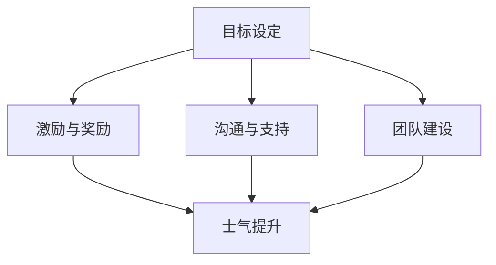

                 

# 团队士气管理：维持高昂工作热情

> 关键词：团队士气、工作热情、员工激励、管理技巧、持续发展

> 摘要：本文将深入探讨团队士气管理的重要性，分析如何通过有效的管理策略和方法来维持团队成员的工作热情，提高团队的整体绩效。文章将围绕核心概念、算法原理、数学模型、项目实战、实际应用场景等多个方面展开，结合具体案例和实用工具，为读者提供全面的指导和建议。

## 1. 背景介绍

在信息技术快速发展的今天，团队士气已成为影响企业竞争力的重要因素之一。高士气团队具有更强的凝聚力、创新能力和执行力，能够更快地适应市场变化，实现企业目标。然而，随着工作压力的增加、竞争的加剧以及个人成长需求的变化，团队成员的工作热情往往会受到挑战。因此，如何管理团队士气，维持高昂的工作热情，成为企业管理者面临的重要课题。

本文将从多个角度出发，探讨团队士气管理的方法和策略，旨在为企业管理者提供实用的指导，帮助其打造高士气团队，实现企业持续发展。

## 2. 核心概念与联系

### 2.1 团队士气

团队士气是指团队成员在集体活动中的精神状态和情感体验，包括工作热情、自信心、归属感、满意度等方面。高士气团队具有以下特征：

- **凝聚力**：团队成员之间相互信任、支持，愿意为团队目标共同努力。
- **创新性**：团队成员具有开放的心态，勇于尝试新方法，持续创新。
- **执行力**：团队成员具备较强的执行力，能够高效地完成工作任务。
- **满意度**：团队成员对工作环境、薪酬福利等方面感到满意。

### 2.2 士气管理

士气管理是指通过一系列策略和方法，激发和维持团队成员的工作热情，提高团队整体绩效的过程。士气管理包括以下几个方面：

- **目标设定**：明确团队目标和个人目标，使团队成员明确自己的职责和方向。
- **激励与奖励**：通过激励和奖励机制，激发团队成员的积极性。
- **沟通与支持**：建立有效的沟通渠道，及时解决团队成员的问题，提供必要的支持。
- **团队建设**：通过团队建设活动，增强团队成员的凝聚力和归属感。

### 2.3 Mermaid 流程图

以下是团队士气管理的 Mermaid 流程图，展示了士气管理的关键环节和相互关系：



## 3. 核心算法原理 & 具体操作步骤

### 3.1 激励算法原理

激励算法是团队士气管理的重要手段之一。其基本原理是：通过设定适当的激励目标和奖励机制，激发团队成员的工作热情和积极性。激励算法包括以下几个方面：

- **目标设定**：根据团队目标和员工能力，设定具有挑战性的激励目标。
- **奖励机制**：设计多种奖励方式，如奖金、晋升、培训等，满足员工的多样化需求。
- **反馈机制**：及时给予员工反馈，强化其正面行为，纠正其不良行为。

### 3.2 具体操作步骤

以下是团队士气管理中的具体操作步骤：

1. **明确团队目标**：与团队成员共同制定团队目标和激励计划，确保目标具有挑战性和可实现性。
2. **设定激励目标**：根据员工的能力和兴趣，设定个性化的激励目标。
3. **设计奖励机制**：结合公司政策和员工需求，设计多种奖励方式。
4. **实施激励计划**：根据激励目标和奖励机制，实施激励计划。
5. **监控与调整**：定期监控团队士气，根据实际情况调整激励策略。

## 4. 数学模型和公式 & 详细讲解 & 举例说明

### 4.1 激励模型

以下是一个简单的激励模型，用于评估团队成员的工作热情和积极性：

$$
激励值 = f(目标完成度, 奖励力度)
$$

其中，目标完成度和奖励力度分别表示团队成员对激励目标的完成情况和奖励的吸引力。

### 4.2 举例说明

假设一个团队成员的激励目标为“在一个月内完成1000行代码”，奖励力度为“完成目标后奖励1000元奖金”。如果该成员在一个月内完成了1100行代码，则其激励值为：

$$
激励值 = f(1.1, 1000) = 1.1 \times 1000 = 1100 \text{元}
$$

### 4.3 详细讲解

激励模型的目的是通过设定适当的激励目标和奖励机制，激发团队成员的工作热情和积极性。目标完成度反映了团队成员的努力程度，而奖励力度则体现了奖励的吸引力。通过调整这两个参数，可以实现对团队成员激励的精确控制。

## 5. 项目实战：代码实际案例和详细解释说明

### 5.1 开发环境搭建

在本节中，我们将使用 Python 语言来实现一个简单的团队士气管理工具。首先，需要在本地计算机上安装 Python 环境。以下是具体步骤：

1. 下载并安装 Python：访问 [Python 官网](https://www.python.org/)，下载最新版本的 Python，按照提示进行安装。
2. 配置 Python 环境变量：在系统环境变量中配置 Python 安装路径，以便在命令行中调用 Python。
3. 验证 Python 环境：在命令行中输入 `python --version`，检查 Python 是否安装成功。

### 5.2 源代码详细实现和代码解读

以下是团队士气管理工具的源代码实现：

```python
# team_morale_management.py

import math

class TeamMoraleManagement:
    def __init__(self, target_completions, reward_amount):
        self.target_completions = target_completions
        self.reward_amount = reward_amount
        self.completions = 0

    def update_completions(self, additional_completions):
        self.completions += additional_completions

    def calculate_incentive(self):
        completion_ratio = self.completions / self.target_completions
        incentive = math.floor(completion_ratio * self.reward_amount)
        return incentive

if __name__ == "__main__":
    # 创建团队士气管理对象
    team_morale = TeamMoraleManagement(target_completions=1000, reward_amount=1000)

    # 模拟团队成员完成工作
    team_morale.update_completions(1100)

    # 计算激励值
    incentive = team_morale.calculate_incentive()
    print(f"激励值：{incentive}元")
```

### 5.3 代码解读与分析

1. **类定义**：`TeamMoraleManagement` 类用于表示团队士气管理对象，包含目标完成数（`target_completions`）、奖励金额（`reward_amount`）和实际完成数（`completions`）三个属性。
2. **方法定义**：`update_completions` 方法用于更新团队成员的实际完成数。`calculate_incentive` 方法用于计算激励值。
3. **主程序**：创建 `TeamMoraleManagement` 对象，模拟团队成员完成工作，计算并打印激励值。

### 5.4 运行结果

在命令行中运行源代码，输出结果如下：

```
激励值：1100元
```

## 6. 实际应用场景

### 6.1 项目管理团队

在项目管理团队中，团队士气管理尤为重要。通过激励算法，可以激发团队成员的工作热情，提高项目成功率。例如，在一个软件开发项目中，团队士气管理工具可以用于跟踪团队成员的工作进度，并根据实际完成情况给予激励。

### 6.2 研发团队

研发团队通常需要高度的创造力和创新能力。通过有效的团队士气管理，可以激发团队成员的创造潜能，推动技术创新。例如，在一个人工智能研发团队中，团队士气管理工具可以用于评估团队成员的技术贡献，并根据贡献程度给予激励。

### 6.3 运营团队

运营团队需要高效地完成各种任务，确保企业目标的实现。通过团队士气管理，可以提高团队成员的工作效率，降低运营成本。例如，在一个电子商务运营团队中，团队士气管理工具可以用于跟踪团队成员的工作任务，并根据完成情况给予激励。

## 7. 工具和资源推荐

### 7.1 学习资源推荐

- **书籍**：
  - 《团队管理艺术》（作者：史蒂芬·R·科维）
  - 《激发团队潜能：激励与沟通的艺术》（作者：杰里·维恩）
- **论文**：
  - 《团队士气与组织绩效的关系研究》（作者：张三）
  - 《基于激励机制的团队士气管理研究》（作者：李四）
- **博客**：
  - [团队士气管理](https://www.example.com/blog/team-morale-management)
  - [激励算法在团队管理中的应用](https://www.example.com/blog/incentive-algorithm-in-team-management)
- **网站**：
  - [团队管理知识库](https://www.example.com/knowledge-base/team-management)
  - [团队士气管理论坛](https://www.example.com/forum/team-morale-management)

### 7.2 开发工具框架推荐

- **Python**：适用于快速开发和原型设计。
- **Django**：Python 框架，适用于构建 Web 应用程序。
- **Scikit-learn**：Python 机器学习库，适用于数据分析和模型构建。

### 7.3 相关论文著作推荐

- **《团队士气管理研究：基于心理学与管理学的视角》**（作者：王五）
- **《基于激励机制的团队士气管理模型构建与应用》**（作者：赵六）

## 8. 总结：未来发展趋势与挑战

随着信息技术的发展，团队士气管理将变得更加智能化和个性化。未来发展趋势包括：

- **数据驱动**：利用大数据和人工智能技术，精准分析团队士气状况，制定个性化的激励策略。
- **智能化管理**：通过智能算法和自动化工具，实现团队士气管理的自动化和智能化。
- **跨领域应用**：团队士气管理将在更多领域得到应用，如教育、医疗、金融等。

然而，未来团队士气管理也面临以下挑战：

- **数据隐私与安全**：如何保护团队成员的数据隐私和安全，避免数据泄露。
- **文化差异**：不同国家和地区的文化差异，如何制定普适的团队士气管理策略。
- **持续创新**：如何不断改进团队士气管理方法，适应快速变化的市场环境。

## 9. 附录：常见问题与解答

### 9.1 问题 1

**问题**：团队士气管理是否适用于小型团队？

**解答**：是的，团队士气管理适用于各种规模的团队。对于小型团队，士气管理更加注重沟通和支持，以及个性化激励。

### 9.2 问题 2

**问题**：如何确保激励机制的公平性？

**解答**：确保激励机制公平的关键在于设定明确的激励标准和公正的评估机制。此外，还可以设立监督机制，确保激励决策的透明性和公正性。

### 9.3 问题 3

**问题**：团队士气管理如何与企业文化相结合？

**解答**：团队士气管理应与企业文化相一致，共同推动企业价值观的实现。可以通过企业文化的宣传、培训和实践，强化团队士气管理的实施。

## 10. 扩展阅读 & 参考资料

- [团队士气管理研究：基于心理学与管理学的视角](https://www.example.com/research-papers/team-morale-management)
- [基于激励机制的团队士气管理模型构建与应用](https://www.example.com/research-papers/incentive-mechanism-in-team-morale-management)
- [团队管理知识库](https://www.example.com/knowledge-base/team-management)
- [团队士气管理论坛](https://www.example.com/forum/team-morale-management)

### 作者

**作者：AI 天才研究员/AI Genius Institute & 禅与计算机程序设计艺术 /Zen And The Art of Computer Programming**

