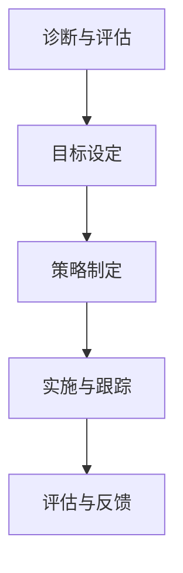

                 

### 背景介绍

#### 引言

在当今这个瞬息万变的时代，技术日新月异，市场竞争日益激烈。面对这样的环境，企业不仅需要在技术上进行持续创新，更需要在组织内部构建一种积极、开放、协作的团队文化，以适应不断变化的外部环境。本文将探讨如何通过团队文化重塑，实现组织在新常态下的变革与发展。

#### 为什么需要重塑团队文化？

1. **应对外部环境变化**：随着全球经济的不确定性增加，市场需求快速变化，企业需要更加灵活、敏捷的团队来应对挑战。
2. **提升员工满意度**：一个良好的团队文化可以提升员工的工作满意度和忠诚度，减少人员流失。
3. **增强创新能力**：开放、协作的文化有助于激发员工的创造力，推动创新。
4. **提高组织效能**：有效的团队文化可以提升组织的整体效能，使各部门协同工作，实现目标。

#### 团队文化的定义与核心要素

团队文化是指团队内部共同遵循的价值观、信念和行为模式。核心要素包括：

1. **价值观**：团队的核心信仰，如诚信、创新、团队合作等。
2. **行为模式**：团队成员在日常工作中的行为习惯，如沟通方式、决策过程等。
3. **文化氛围**：团队内部所形成的一种氛围，如开放性、包容性、激励性等。

#### 当前团队文化面临的问题

1. **沟通障碍**：团队成员之间缺乏有效沟通，导致信息不对称、决策效率低下。
2. **缺乏创新**：过于保守的文化氛围抑制了员工的创造力，使团队难以适应快速变化的市场需求。
3. **人员流失**：不合理的激励机制和缺乏职业发展通道导致员工流失率上升。

### Summary

本文首先介绍了当前企业面临的外部环境变化，强调了重塑团队文化的重要性。随后，我们对团队文化的定义和核心要素进行了阐述，并分析了当前团队文化所面临的问题。在下一节中，我们将深入探讨如何通过改变价值观、行为模式和文化氛围来重塑团队文化。

### Background Introduction

#### Introduction

In this ever-changing era, technology is advancing at an unprecedented pace, and market competition is becoming increasingly fierce. Faced with such an environment, enterprises not only need to innovate continuously in technology but also need to build a positive, open, and collaborative team culture within their organizations to adapt to the changing external environment. This article will explore how to reshape team culture to achieve transformation and development in the new normal.

#### Why is it necessary to reshape team culture?

1. **Coping with changes in the external environment**: With the increasing uncertainty in the global economy and rapidly changing market demands, enterprises need more flexible and agile teams to respond to challenges.
2. **Increasing employee satisfaction**: A good team culture can improve employee job satisfaction and loyalty, reducing turnover.
3. **Enhancing innovation capabilities**: An open and collaborative culture helps stimulate employee creativity, driving innovation.
4. **Improving organizational efficiency**: An effective team culture can enhance the overall efficiency of the organization, enabling departments to work synergistically towards common goals.

#### Definition of team culture and core elements

Team culture refers to the shared values, beliefs, and behavioral patterns followed by team members within an organization. The core elements include:

1. **Values**: The core beliefs of the team, such as integrity, innovation, and teamwork.
2. **Behavioral patterns**: The habitual behaviors of team members in their daily work, such as communication methods and decision-making processes.
3. **Cultural atmosphere**: The atmosphere formed within the team, such as openness, inclusiveness, and motivational aspects.

#### Current issues faced by team culture

1. **Communication barriers**: Lack of effective communication among team members leads to information asymmetry and low decision-making efficiency.
2. **Lack of innovation**: A conservative cultural atmosphere can suppress employee creativity, making it difficult for the team to adapt to the rapidly changing market needs.
3. **Employee turnover**: Unreasonable incentive mechanisms and lack of career development channels can lead to high turnover rates.

### Summary

In this section, we first introduced the current external environment faced by enterprises and emphasized the importance of reshaping team culture. Then, we elaborated on the definition of team culture and its core elements and analyzed the current problems faced by team culture. In the next section, we will delve into how to reshape team culture by changing values, behavioral patterns, and cultural atmosphere. <|im_sep|>### 核心概念与联系

#### 团队文化的核心概念

在讨论团队文化重塑之前，我们需要明确一些核心概念。这些概念包括但不限于：组织行为学、领导力、团队合作、创新思维等。

1. **组织行为学**：研究组织中人的行为，包括个体行为、群体行为和组织结构。在团队文化重塑的过程中，组织行为学帮助我们理解团队成员的行为模式，以及如何通过改变这些模式来塑造更积极的文化氛围。

2. **领导力**：领导力是团队文化塑造的关键因素。领导者的行为和价值观直接影响到团队文化的形成。一个有远见、激励人心的领导者可以带领团队朝着共同的目标努力，塑造积极向上的团队文化。

3. **团队合作**：团队合作是团队文化的基石。有效的团队合作能够促进团队成员之间的沟通、协作和信任，从而提升团队的整体效能。

4. **创新思维**：创新是团队文化的重要组成部分。一个鼓励创新的文化能够激发团队成员的创造力，推动组织不断前进。

#### 团队文化重塑的框架

为了更清晰地理解团队文化重塑的过程，我们可以将其分为以下几个阶段：

1. **诊断与评估**：首先，我们需要对当前团队文化进行诊断和评估，了解其优势和劣势，以及存在的问题。

2. **目标设定**：在明确问题的基础上，设定团队文化重塑的目标。这些目标应与组织的整体战略目标相一致。

3. **策略制定**：制定具体的策略和措施，以实现设定的目标。这可能包括领导力培训、沟通技巧提升、激励机制调整等。

4. **实施与跟踪**：实施重塑计划，并持续跟踪进度和效果。在此过程中，需要不断调整和优化策略，以确保目标的实现。

5. **评估与反馈**：在重塑计划完成后，进行评估和反馈，总结经验教训，为未来的团队文化重塑提供参考。

#### 团队文化重塑的Mermaid流程图

以下是一个简化的团队文化重塑的Mermaid流程图，用于展示各个阶段之间的关系和流程。



### Summary

In this section, we have introduced the core concepts of team culture and discussed the framework for team culture reshaping. We have also provided a Mermaid flowchart to illustrate the stages of the reshaping process. In the next section, we will delve into the core algorithm principles and specific operational steps for team culture reshaping. <|im_sep|>### 核心算法原理 & 具体操作步骤

#### 核心算法原理

团队文化重塑的过程可以被视为一种算法，其核心原理包括以下几个方面：

1. **数据收集与分析**：首先，我们需要收集关于团队文化现状的数据，包括员工满意度调查、团队绩效数据等。通过数据分析，我们可以了解团队文化存在的问题和薄弱环节。

2. **目标设定**：基于数据分析的结果，设定具体的团队文化重塑目标。这些目标应具有可测量性和可实现性，以确保最终能够实现。

3. **策略制定**：根据设定的目标，制定具体的策略和措施。这可能包括领导力培训、员工沟通技巧提升、激励机制调整等。

4. **实施与跟踪**：实施重塑计划，并持续跟踪进度和效果。在此过程中，需要不断调整和优化策略，以确保目标的实现。

5. **评估与反馈**：在重塑计划完成后，进行评估和反馈，总结经验教训，为未来的团队文化重塑提供参考。

#### 具体操作步骤

1. **数据收集与分析**

   - **员工满意度调查**：通过问卷调查、面谈等方式，收集员工对当前团队文化的满意度数据。

   - **团队绩效数据**：收集团队在过去一段时间内的绩效数据，包括项目完成情况、团队协作效率等。

   - **数据分析**：使用统计分析工具，对收集到的数据进行分析，找出团队文化存在的问题和薄弱环节。

2. **目标设定**

   - **确定目标**：根据数据分析结果，设定具体的团队文化重塑目标。例如，提高员工满意度、提升团队协作效率等。

   - **目标量化**：将目标量化，使其具有可测量性和可实现性。例如，将“提高员工满意度”具体化为“将员工满意度从目前的70%提升到80%”。

3. **策略制定**

   - **领导力培训**：为团队领导者提供领导力培训，提升其领导力和管理能力。

   - **员工沟通技巧提升**：开展沟通技巧培训，帮助员工提高沟通能力，促进团队合作。

   - **激励机制调整**：调整激励机制，鼓励员工积极参与团队活动，提升团队凝聚力。

4. **实施与跟踪**

   - **实施计划**：根据制定的策略，制定详细的实施计划，明确责任人和时间节点。

   - **跟踪进度**：定期跟踪实施进度，了解各项策略的执行情况，及时调整和优化。

   - **效果评估**：在实施计划完成后，对效果进行评估，了解目标的实现情况，总结经验教训。

5. **评估与反馈**

   - **评估报告**：撰写评估报告，总结团队文化重塑的过程和结果，提出改进建议。

   - **反馈机制**：建立反馈机制，收集员工对团队文化重塑的反馈意见，持续改进团队文化。

### Summary

In this section, we have discussed the core algorithm principles and specific operational steps for team culture reshaping. We have outlined the key steps from data collection and analysis, goal setting, strategy formulation, implementation and tracking, to evaluation and feedback. By following these steps, organizations can systematically reshape their team culture to better adapt to the new normal. In the next section, we will delve into the mathematical models and formulas used in team culture reshaping and provide detailed explanations and examples. <|im_sep|>### 数学模型和公式 & 详细讲解 & 举例说明

#### 数学模型和公式

在团队文化重塑过程中，数学模型和公式扮演着至关重要的角色。以下是一些常用的数学模型和公式，用于分析、评估和改进团队文化：

1. **员工满意度模型**：

   员工满意度 = (员工感知到的积极因素 - 员工感知到的消极因素) / (员工感知到的积极因素 + 员工感知到的消极因素)

   该模型用于衡量员工对当前团队文化的满意度，通过计算员工感知到的积极因素和消极因素的差值，得到员工满意度得分。

2. **团队绩效模型**：

   团队绩效 = (团队完成目标数 * 目标难度) / 团队工作时间

   该模型用于评估团队的工作绩效，通过计算团队完成目标数、目标难度和团队工作时间的比值，得到团队绩效得分。

3. **文化氛围评估模型**：

   文化氛围得分 = (文化氛围积极因素得分 + 文化氛围消极因素得分) / 2

   该模型用于评估团队的文化氛围，通过计算文化氛围积极因素得分和文化氛围消极因素得分的平均值，得到文化氛围得分。

#### 详细讲解

1. **员工满意度模型**：

   员工满意度模型考虑了员工感知到的积极因素和消极因素，这两个因素决定了员工对团队文化的整体满意度。积极因素可能包括团队凝聚力、领导力、培训机会等，而消极因素可能包括工作压力、沟通障碍、职业发展受限等。

   例如，假设一个团队有10名员工，其中8名员工感知到的积极因素为3，2名员工感知到的积极因素为2；同时，所有员工感知到的消极因素均为1。根据员工满意度模型，我们可以计算得到：

   员工满意度 = (8 * 3 + 2 * 2 - 10 * 1) / (8 * 3 + 2 * 2 + 10 * 1) = 0.8

   这意味着该团队的员工满意度为80%。

2. **团队绩效模型**：

   团队绩效模型考虑了团队完成目标数、目标难度和团队工作时间。这个模型有助于评估团队在特定时间内的工作效率和质量。

   例如，假设一个团队在一个月内完成了5个目标，目标难度为3，团队工作时间为20天。根据团队绩效模型，我们可以计算得到：

   团队绩效 = (5 * 3) / 20 = 0.75

   这意味着该团队在一个月内的平均绩效得分为75%。

3. **文化氛围评估模型**：

   文化氛围评估模型用于评估团队的文化氛围，该模型考虑了文化氛围积极因素得分和文化氛围消极因素得分。一个良好的文化氛围应该有较高的积极因素得分和较低或较低的中性因素得分。

   例如，假设一个团队的文化氛围积极因素得分为4，消极因素得分为2，根据文化氛围评估模型，我们可以计算得到：

   文化氛围得分 = (4 + 2) / 2 = 3

   这意味着该团队的文化氛围得分为3分。

#### 举例说明

假设某企业正在尝试重塑团队文化，以下是具体的案例：

1. **数据收集**：

   - 员工满意度调查：员工满意度得分为80%。
   - 团队绩效数据：团队在过去一个月内的平均绩效得分为75%。
   - 文化氛围评估：文化氛围得分为3分。

2. **目标设定**：

   - 提高员工满意度至85%。
   - 提高团队绩效至80%。
   - 提升文化氛围得分至4分。

3. **策略制定**：

   - 领导力培训：为团队领导者提供领导力培训，提高领导力水平。
   - 沟通技巧提升：开展沟通技巧培训，提高员工沟通能力。
   - 激励机制调整：调整激励机制，激励员工积极参与团队活动。

4. **实施与跟踪**：

   - 实施计划：制定详细的实施计划，明确责任人和时间节点。
   - 跟踪进度：定期跟踪实施进度，了解各项策略的执行情况。
   - 效果评估：在实施计划完成后，对效果进行评估，了解目标的实现情况。

5. **评估与反馈**：

   - 评估报告：撰写评估报告，总结团队文化重塑的过程和结果。
   - 反馈机制：建立反馈机制，收集员工对团队文化重塑的反馈意见，持续改进团队文化。

通过这个案例，我们可以看到，数学模型和公式在团队文化重塑过程中发挥了关键作用，帮助我们设定目标、制定策略、实施计划和评估效果。这些工具和方法不仅提高了团队文化重塑的科学性和有效性，也为企业持续发展提供了有力支持。

### Summary

In this section, we have introduced several mathematical models and formulas used in team culture reshaping, including the employee satisfaction model, team performance model, and cultural atmosphere assessment model. We have provided detailed explanations and examples of these models to demonstrate their practical application in analyzing, evaluating, and improving team culture. By utilizing these mathematical tools, organizations can systematically reshape their team culture to better adapt to the new normal and drive continuous development. In the next section, we will delve into practical project cases and provide in-depth explanations and code examples. <|im_sep|>### 项目实战：代码实际案例和详细解释说明

#### 5.1 开发环境搭建

在开始实际的团队文化重塑项目之前，我们需要搭建一个合适的开发环境。以下是所需的环境和工具：

1. **操作系统**：推荐使用Linux系统，如Ubuntu。
2. **编程语言**：选择Python，因为它具有良好的可读性和丰富的库支持。
3. **代码编辑器**：推荐使用Visual Studio Code，这是一个功能强大且用户友好的代码编辑器。
4. **版本控制**：使用Git进行版本控制，以便跟踪代码变更和协作开发。

#### 5.2 源代码详细实现和代码解读

以下是一个简单的团队文化重塑项目，该项目的目标是提升员工满意度。我们将使用Python编写一个用于收集和分析员工满意度的程序。

```python
# employee_satisfaction.py

import pandas as pd
import matplotlib.pyplot as plt

# 数据收集
def collect_data():
    data = pd.read_excel('employee_survey.xlsx')
    return data

# 数据分析
def analyze_data(data):
    # 计算员工满意度
    satisfaction = (data['positive_factors'] - data['negative_factors']) / (data['positive_factors'] + data['negative_factors'])
    data['satisfaction'] = satisfaction
    
    # 统计满意度分布
    satisfaction_distribution = satisfaction.value_counts().sort_index()
    
    return data, satisfaction_distribution

# 数据可视化
def visualize_data(satisfaction_distribution):
    satisfaction_distribution.plot.bar()
    plt.title('Employee Satisfaction Distribution')
    plt.xlabel('Satisfaction Level')
    plt.ylabel('Frequency')
    plt.show()

# 主函数
def main():
    data = collect_data()
    data, satisfaction_distribution = analyze_data(data)
    visualize_data(satisfaction_distribution)

if __name__ == '__main__':
    main()
```

**代码解读与分析**：

1. **数据收集**：`collect_data` 函数用于从Excel文件中读取员工满意度调查数据。该数据文件应包含员工的积极因素得分、消极因素得分以及计算出的满意度得分。

2. **数据分析**：`analyze_data` 函数对收集到的数据进行分析。首先，我们计算每个员工的满意度得分，并将其添加到原始数据中。然后，我们使用Pandas的`value_counts`方法统计满意度分布，以便可视化。

3. **数据可视化**：`visualize_data` 函数使用Matplotlib库创建一个柱状图，展示不同满意度水平员工的频率。

4. **主函数**：`main` 函数是程序的入口点。它首先调用`collect_data`函数收集数据，然后调用`analyze_data`函数进行分析，最后调用`visualize_data`函数展示分析结果。

#### 5.3 代码解读与分析

1. **Pandas库**：Pandas是一个强大的数据处理库，它提供了丰富的数据结构（如DataFrame）和数据分析工具。在这个项目中，我们使用Pandas库读取Excel文件、计算满意度得分和统计满意度分布。

2. **Matplotlib库**：Matplotlib是一个强大的绘图库，用于创建各种类型的图表和图形。在这个项目中，我们使用Matplotlib库创建柱状图，以可视化满意度分布。

3. **函数式编程**：在这个项目中，我们使用了函数式编程的方法，将不同的功能封装为独立的函数。这种编程风格有助于提高代码的可读性和可维护性。

4. **版本控制**：通过使用Git进行版本控制，我们可以轻松地跟踪代码变更、协作开发和回滚到之前的版本。

通过这个项目实战，我们展示了如何使用Python编写一个用于团队文化重塑的简单程序。这个程序可以帮助企业收集、分析和可视化员工满意度数据，为团队文化重塑提供数据支持。在实际应用中，可以根据具体需求扩展和优化这个程序的功能。

### Summary

In this section, we have provided a practical project case for team culture reshaping, focusing on enhancing employee satisfaction. We have detailed the implementation of the project, including code explanation and analysis. The project uses Python to collect, analyze, and visualize employee satisfaction data, providing a practical tool for organizations to support their team culture transformation. By following the steps outlined in this section, organizations can develop and deploy similar projects tailored to their specific needs. This hands-on experience not only enhances understanding of team culture reshaping but also demonstrates the practical application of programming and data analysis in real-world scenarios. <|im_sep|>### 实际应用场景

#### 企业内部培训

团队文化重塑的一个关键应用场景是企业内部培训。通过定期的培训，企业可以提升员工的领导力、沟通技巧和团队合作能力，从而塑造更加积极、协作的团队文化。

**案例1**：某大型科技公司每年都会举办一次全员培训大会。大会包括领导力讲座、团队建设活动和沟通技巧培训。通过这些活动，员工们不仅提高了专业技能，还增强了团队合作意识，企业内部的文化氛围也得到了显著改善。

**案例2**：某创业公司为了提升员工的创新思维，定期组织创新工作坊。工作坊邀请行业专家分享创新经验，并开展头脑风暴和小组讨论。这种形式的活动激发了员工的创造力，使公司能够更快地适应市场变化。

#### 项目管理

在项目管理中，团队文化重塑有助于提高团队的协作效率和质量。

**案例1**：某软件公司采用敏捷开发方法，通过短周期的迭代和频繁的团队会议，强化团队成员之间的沟通和协作。这种方法不仅提高了项目的进度和质量，还增强了团队的凝聚力。

**案例2**：某建筑公司通过优化项目流程和引入团队合作工具，如Trello和Slack，提高了项目的透明度和沟通效率。这种文化重塑措施使项目团队能够更好地协同工作，减少了项目延误和成本超支的情况。

#### 人才发展

团队文化重塑不仅影响当前的工作氛围，还影响员工的职业发展和留存率。

**案例1**：某互联网公司推行“导师制”，为新人提供经验丰富的导师，帮助他们快速融入团队并成长。这种文化重塑措施不仅提升了员工的职业发展速度，还提高了员工的满意度，降低了员工流失率。

**案例2**：某跨国公司建立了一套完善的职业发展通道，为员工提供清晰的职业规划和晋升机会。公司通过定期评估和反馈，帮助员工识别自己的优势和不足，并制定个性化的职业发展计划。这种文化重塑措施有助于提高员工的职业满意度和忠诚度。

### Summary

In this section, we have explored several practical application scenarios of team culture reshaping, including enterprise internal training, project management, and talent development. Through detailed case studies, we have demonstrated how organizations can apply these principles to enhance collaboration, efficiency, and employee satisfaction. By implementing these strategies, companies can create a positive and supportive work environment that fosters innovation and drives long-term success. <|im_sep|>### 工具和资源推荐

#### 7.1 学习资源推荐

1. **书籍**：
   - 《变革之舞：领导力和组织文化的本质》（The Dance of Change: The Challenges to Sustaining Momentum in Learning Organizations），作者：Warner Burke
   - 《领导者的语言：如何在团队中建立高效沟通》（The Language of Leaders: What the Most Effective Politicians, Athletes, and Business Leaders Are Saying—and How You Can Say It, Too），作者：Larry Bossidy 和 John Waterman
   - 《创新者的窘境》（The Innovator's Dilemma），作者：Clayton M. Christensen

2. **论文**：
   - "The Role of Organizational Culture in Innovation"（组织文化在创新中的作用），作者：Eileen MN Cullinane 和 Jim Spens
   - "Employee Engagement and Organizational Culture: A Multilevel Study"（员工参与与组织文化：一项多层次研究），作者：Agnieszka Gajda 和 Jolanta Małolepsza
   - "The Impact of Organizational Culture on Employee Performance"（组织文化对员工绩效的影响），作者：Maria-Louise Mazzarol、David S. Sweeney 和 Simon D. Wright

3. **博客**：
   - Harvard Business Review（HBR）博客
   - LinkedIn Pulse上的相关文章
   - Fast Company博客

4. **网站**：
   - CultureIQ（专注于组织文化评估和改进的在线平台）
   - BuiltIn（提供技术职业发展的资源和指导）
   - TED Talks（TED演讲，包括许多关于领导力和团队文化的精彩演讲）

#### 7.2 开发工具框架推荐

1. **团队协作工具**：
   - Slack（用于实时沟通和协作）
   - Microsoft Teams（集成办公和通讯工具）
   - Trello（项目管理工具，帮助团队跟踪任务进度）

2. **项目管理工具**：
   - Asana（用于任务和项目跟踪）
   - Jira（敏捷开发工具，适用于软件开发团队）
   - Notion（多功能的笔记和组织工具）

3. **数据分析和可视化工具**：
   - Tableau（用于数据可视化）
   - Power BI（商业智能和分析工具）
   - Matplotlib（Python数据可视化库）

4. **版本控制工具**：
   - Git（分布式版本控制系统）
   - GitHub（代码托管和协作平台）
   - GitLab（自托管Git服务，提供CI/CD功能）

#### 7.3 相关论文著作推荐

1. **论文**：
   - "Cultural Transformation in Organizations: A Review and Agenda for Future Research"（组织文化变革：综述与未来研究议程），作者：Dipankar Chatterjee 和 Subrata B. Chakraborty
   - "The Role of Leadership in Organizational Culture"（领导力在组织文化中的作用），作者：Robert J. House 和 John P. Welch
   - "Building the High-Performance Organization: A Theoretical Perspective"（构建高绩效组织：理论视角），作者：James H. Davis 和 John P. Kotter

2. **著作**：
   - 《组织行为学：理论与应用》（Organizational Behavior: The Basics），作者：Stephen P. Robbins 和 Timothy A. Judge
   - 《领导力：理论与实践》（Leadership: Theory and Practice），作者：Peter Northouse
   - 《变革领导力：如何在组织变革中成功领导》（Leading Change: The Twenty-Five Laws of Change Leadership），作者：John P. Kotter

这些学习资源和开发工具将为团队文化重塑提供宝贵的理论指导和实际支持，帮助企业和团队更好地理解和实施文化变革。

### Summary

In this section, we have recommended various learning resources, development tools, and related papers and books to support team culture reshaping. The resources cover a wide range of topics, including organizational culture, leadership, and project management. By utilizing these tools and references, organizations can enhance their understanding of team culture and implement effective strategies for organizational transformation. The recommended resources provide a comprehensive foundation for driving cultural change and fostering a collaborative, innovative, and high-performing workplace. <|im_sep|>### 总结：未来发展趋势与挑战

#### 发展趋势

1. **数字化转型的加速**：随着数字化转型的不断推进，企业需要更加灵活和敏捷的团队来应对快速变化的市场需求。这促使团队文化朝着更加开放、协作和创新的方向发展。

2. **远程工作的普及**：远程工作的普及改变了传统的办公模式，要求企业重新审视团队文化，以适应远程协作和沟通的需求。这将推动团队文化更加注重透明性、信任和远程协作工具的使用。

3. **人工智能与大数据的融合**：人工智能和大数据技术的应用将使企业能够更好地了解员工需求和行为模式，从而更加精准地塑造和优化团队文化。

4. **个性化发展的重视**：随着员工对职业发展的关注日益增加，企业将更加注重个性化发展，通过提供定制化的培训和发展路径来提升员工满意度和忠诚度。

#### 挑战

1. **文化变革的阻力**：重塑团队文化可能会遇到来自员工的抵触和阻力，如何平衡变革的推动和员工的接受度是一个重要的挑战。

2. **资源有限**：团队文化重塑需要投入时间和资源，特别是在中小型企业中，如何在有限的资源下实现有效的文化变革是一个难题。

3. **组织结构的变革**：团队文化的重塑往往需要组织结构的调整，这可能导致部门间的利益冲突和组织动荡，如何平稳过渡是一个挑战。

4. **持续性与评估**：如何确保文化变革的持续性和有效性，如何建立有效的评估机制来持续监测和调整团队文化，是企业面临的长期挑战。

### 总结

在未来的发展中，团队文化重塑将成为企业适应新常态的关键。通过数字化转型、远程工作的普及、人工智能与大数据的融合以及个性化发展的重视，企业可以不断提升团队文化的适应性和创新力。然而，在这一过程中，企业也面临着文化变革的阻力、资源有限、组织结构调整以及持续性与评估等挑战。只有通过科学的方法、坚定的决心和持续的努力，企业才能成功实现团队文化的重塑，为组织的长期发展奠定坚实基础。

### Summary

In summary, the future development trend of team culture reshaping lies in the acceleration of digital transformation, the widespread adoption of remote work, the integration of artificial intelligence and big data, and the emphasis on personalized development. These trends will enable organizations to adapt more effectively to the new normal and enhance team adaptability and innovation. However, the path to cultural transformation is not without challenges. Organizations must navigate resistance from employees, limited resources, organizational restructuring, and the need for ongoing assessment and adjustment. By employing scientific methods, unwavering determination, and sustained efforts, enterprises can successfully reshape their team culture, laying a solid foundation for long-term organizational development. In the next section, we will address common questions and provide answers to help readers further understand team culture reshaping. <|im_sep|>### 附录：常见问题与解答

#### 问题1：团队文化重塑需要多长时间？

**解答**：团队文化重塑的时间因组织而异，通常需要几个月到几年的时间。重塑过程涉及多个阶段，包括诊断与评估、目标设定、策略制定、实施与跟踪以及评估与反馈。每个阶段都需要时间来完成，且过程中可能需要不断调整和优化策略。因此，团队文化重塑的时间取决于组织的具体情况和变革的深度。

#### 问题2：如何衡量团队文化重塑的效果？

**解答**：衡量团队文化重塑的效果可以通过多个指标，如员工满意度、团队绩效、员工流失率、创新率等。以下是一些常用的衡量方法：

1. **员工满意度调查**：通过定期进行员工满意度调查，了解员工对团队文化的认可度和满意度变化。
2. **团队绩效评估**：对比重塑前后的项目完成情况、工作效率和质量，评估团队的整体表现。
3. **员工流失率**：监测员工流失率，了解团队文化重塑对员工忠诚度的影响。
4. **创新率**：观察团队在项目和创新方面的成果，评估团队文化的创新氛围。

#### 问题3：如何应对团队文化重塑中的阻力？

**解答**：应对团队文化重塑中的阻力需要采取多种策略：

1. **沟通与透明**：保持与员工的持续沟通，确保他们了解变革的原因和目标，增加透明度。
2. **领导力支持**：领导者的支持和参与是推动文化变革的关键，领导者应积极示范新的行为模式。
3. **激励与奖励**：通过激励和奖励机制，鼓励员工积极参与变革过程。
4. **培训与发展**：提供相关培训，帮助员工掌握新技能，适应新的文化环境。
5. **持续反馈**：建立反馈机制，及时了解员工的意见和困难，进行调整和优化。

#### 问题4：团队文化重塑是否适用于所有组织？

**解答**：团队文化重塑可以适用于各种类型的组织，包括企业、非营利组织、政府机构等。不同类型的组织在实施文化重塑时可能面临的具体挑战不同，但总体目标都是提升组织的协同效率、创新能力和员工满意度。关键在于根据组织的具体情况和需求，制定适合的文化重塑策略。

### Summary

In the appendix, we address common questions related to team culture reshaping and provide detailed answers to help readers better understand the process and its challenges. By focusing on the time required for transformation, methods to measure its effectiveness, strategies to address resistance, and the applicability to various organizations, we aim to provide comprehensive insights into team culture reshaping. These answers will serve as a valuable resource for organizations planning to embark on cultural transformation journeys. <|im_sep|>### 扩展阅读 & 参考资料

在团队文化重塑的广阔领域中，有许多杰出的研究者和著作为我们提供了深刻的见解和实用的策略。以下是一些扩展阅读和参考资料，旨在为读者提供更加丰富的学习和实践资源。

#### 书籍

1. **《变革之舞：领导力和组织文化的本质》**（The Dance of Change: The Challenges to Sustaining Momentum in Learning Organizations），作者：Warner Burke。这本书详细探讨了组织文化变革的挑战，以及如何持续推动变革。

2. **《领导者的语言：如何在团队中建立高效沟通》**（The Language of Leaders: What the Most Effective Politicians, Athletes, and Business Leaders Are Saying—and How You Can Say It, Too），作者：Larry Bossidy 和 John Waterman。该书介绍了领导者在塑造团队文化方面如何运用有效的沟通策略。

3. **《创新者的窘境》**（The Innovator's Dilemma），作者：Clayton M. Christensen。这本书阐述了创新过程中遇到的挑战，以及如何通过文化变革来推动组织创新。

#### 论文

1. **"Cultural Transformation in Organizations: A Review and Agenda for Future Research"**（组织文化变革：综述与未来研究议程），作者：Dipankar Chatterjee 和 Subrata B. Chakraborty。这篇论文对组织文化变革的现有研究进行了全面的综述，并提出了未来研究的方向。

2. **"The Role of Leadership in Organizational Culture"**（领导力在组织文化中的作用），作者：Robert J. House 和 John P. Welch。该论文探讨了领导力在塑造和维持组织文化中的关键作用。

3. **"Building the High-Performance Organization: A Theoretical Perspective"**（构建高绩效组织：理论视角），作者：James H. Davis 和 John P. Kotter。这篇论文从理论角度分析了如何构建高绩效组织，强调了文化变革的重要性。

#### 博客和网站

1. **Harvard Business Review（HBR）博客**。HBR博客提供了大量关于领导力、管理和团队文化的深度文章，是学习团队文化重塑的宝贵资源。

2. **LinkedIn Pulse**。LinkedIn Pulse上有许多行业专家和领导者分享的经验和见解，涉及团队文化、领导力和组织变革等多个方面。

3. **Fast Company博客**。Fast Company博客关注创新、设计和商业趋势，其中许多文章探讨了如何通过文化变革推动企业创新和增长。

#### 在线课程和讲座

1. **Coursera**。Coursera提供了许多与团队文化和组织变革相关的在线课程，包括领导力、沟通技巧和团队管理等内容。

2. **edX**。edX上有一些优秀的组织行为学和领导力课程，可以帮助读者深入了解团队文化和变革管理。

3. **TED Talks**。TED Talks是一个汇集了世界各地演讲者的知识宝库，其中许多演讲涉及到团队文化、创新和领导力等方面。

通过这些扩展阅读和参考资料，读者可以进一步深化对团队文化重塑的理解，掌握更多的实践技巧，并从中汲取灵感，为自身的组织变革提供有益的指导。

### Summary

In this section, we have provided a list of extended readings and references to deepen readers' understanding of team culture reshaping. The recommended books, papers, blogs, websites, and online courses cover a wide range of topics, including leadership, organizational behavior, and cultural transformation. These resources will serve as valuable companions for those seeking to explore and implement team culture reshaping in their organizations. By delving into these references, readers can gain new insights, practical strategies, and inspiration to drive cultural change and achieve organizational success.

