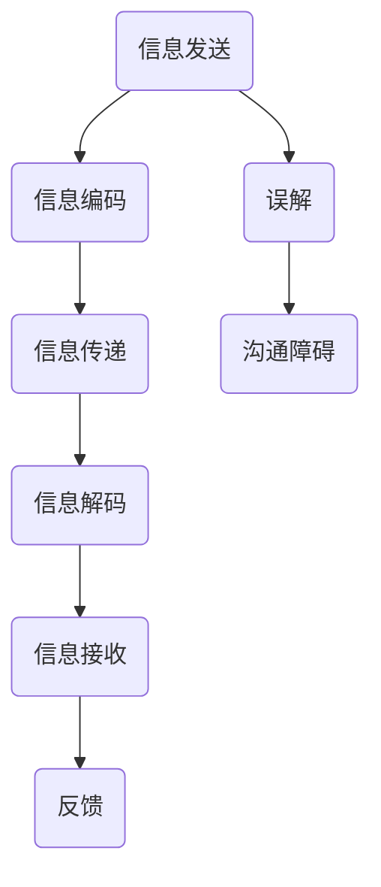
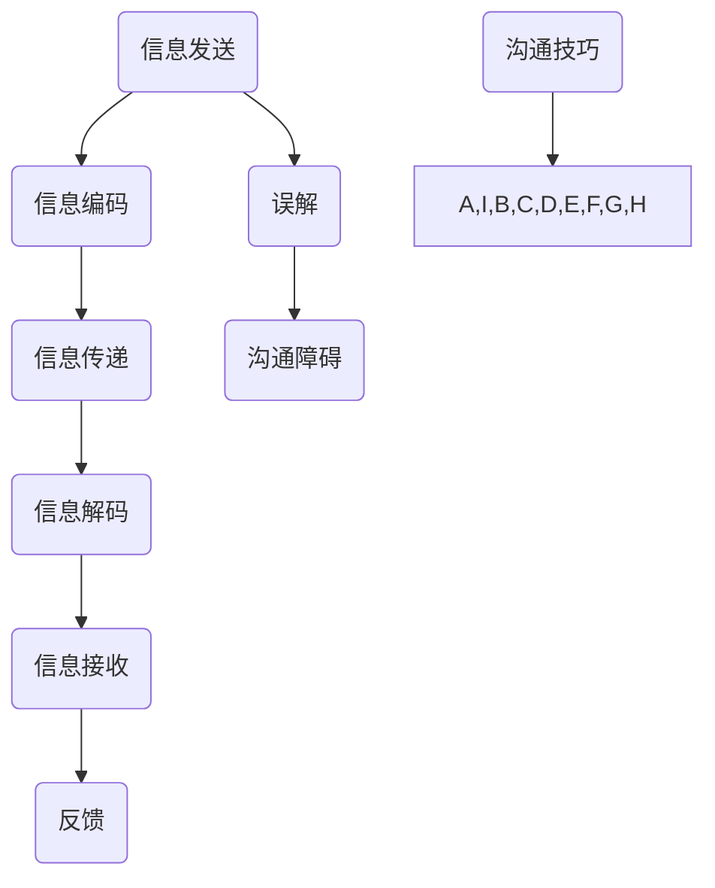

                 

# 团队沟通技巧：消除误解，增进理解

## 关键词：团队沟通，误解，理解，技巧，协作，冲突解决，沟通策略

> 本文将深入探讨团队沟通中常见的问题，包括误解的产生、影响以及如何通过有效的沟通技巧来消除误解、增进理解，从而提升团队的协作效率和项目成功率。

## 1. 背景介绍

团队沟通是现代组织中不可或缺的一部分。一个高效的团队需要成员之间能够顺畅地交流想法、意见和反馈，以便共同推进项目的进展。然而，在实际的沟通过程中，误解往往难以避免。这些误解可能源于语言障碍、文化差异、个人情绪或沟通方式不当等多种因素，它们不仅会降低沟通的效率，还可能引发冲突，影响团队的凝聚力和项目的成功。

本文将从以下几个方面展开讨论：

- **核心概念与联系**：介绍团队沟通中的关键概念，并通过Mermaid流程图展示沟通的基本流程。
- **核心算法原理 & 具体操作步骤**：探讨消除误解的沟通策略和技巧。
- **数学模型和公式 & 详细讲解 & 举例说明**：运用心理学和行为科学的理论，解释沟通中的误解现象。
- **项目实战：代码实际案例和详细解释说明**：通过具体的代码案例，展示沟通技巧在实际项目中的应用。
- **实际应用场景**：分析团队沟通在不同工作场景下的特点和实践策略。
- **工具和资源推荐**：推荐有助于团队沟通的书籍、工具和资源。
- **总结：未来发展趋势与挑战**：展望团队沟通领域的发展趋势和面临的挑战。

让我们一步一步地深入探讨这些内容。

## 2. 核心概念与联系

在探讨团队沟通技巧之前，我们需要了解一些核心概念和它们之间的联系。

### 2.1. 沟通的定义与目的

沟通是指信息的传递和接收过程。其目的是确保信息在发送者和接收者之间准确无误地传递。有效的沟通不仅需要信息的正确传递，还需要接收者正确理解和接受这些信息。

### 2.2. 误解的概念

误解是指接收者对发送者信息的错误理解。误解可能由于多种因素造成，如语言障碍、语境不明、信息过载等。

### 2.3. 沟通障碍

沟通障碍是指影响信息传递的各种因素，如噪声、情绪、文化差异、沟通方式不当等。

### 2.4. 沟通技巧

沟通技巧是指提高沟通效率的方法和策略，如倾听、明确表达、反馈、非语言沟通等。

下面是一个简单的Mermaid流程图，展示了沟通的基本流程和可能涉及的误解点。



在这个流程图中，A到E代表了信息的传递过程，而F代表了反馈环节。误解（G）和沟通障碍（H）可能会在过程中的任何环节出现，从而影响沟通的效果。

## 3. 核心算法原理 & 具体操作步骤

### 3.1. 消除误解的策略

要消除误解，可以采用以下几种策略：

#### 3.1.1. 明确表达

确保信息的发送者在传递信息时能够清晰、准确地表达自己的意思。这可以通过使用简单的语言、避免专业术语和复杂的句子结构来实现。

#### 3.1.2. 倾听

倾听是理解对方意图的关键。通过倾听，接收者可以更好地理解发送者的信息，并避免因误解而产生的错误。

#### 3.1.3. 反馈

请求和提供反馈是确保信息准确传递的重要步骤。通过反馈，双方可以确认对方是否正确理解了信息，并及时纠正误解。

#### 3.1.4. 使用非语言沟通

非语言沟通，如肢体语言、面部表情和语调，可以帮助增强信息的传递和理解。例如，积极的肢体语言可以传达出友好和开放的态度，从而促进沟通。

### 3.2. 实践操作步骤

以下是具体操作步骤，以帮助团队在实际沟通中消除误解：

#### 3.2.1. 确定沟通目标

在每次沟通开始之前，明确沟通的目标和目的，以便双方在沟通中保持焦点。

#### 3.2.2. 使用明确的语言

在表达观点和意见时，使用简单、清晰的语言，并避免使用模糊或含糊的词汇。

#### 3.2.3. 倾听并确认理解

在对方发言后，倾听并确认自己是否正确理解了对方的意图。可以通过重复对方的话或提出问题来验证。

#### 3.2.4. 提供反馈

在沟通过程中，提供及时的反馈，以确保信息被正确理解和接受。

#### 3.2.5. 使用非语言沟通

在适当的情况下，使用非语言沟通手段，如肢体语言和面部表情，来增强信息的传递。

通过这些步骤，团队可以有效地消除误解，增进理解，从而提高沟通的效率和效果。

## 4. 数学模型和公式 & 详细讲解 & 举例说明

在沟通领域，我们可以运用一些心理学和行为科学的理论来解释误解现象。以下是一些常用的数学模型和公式：

### 4.1. 信息传播模型

信息传播模型描述了信息在人群中的传播过程。其基本公式为：

\[ I(t) = I_0 \cdot e^{rt} \]

其中，\( I(t) \) 是时间 \( t \) 时的信息传播速率，\( I_0 \) 是初始信息传播速率，\( r \) 是信息传播速率常数。

#### 4.1.1. 详细讲解

这个公式说明了信息在人群中的传播速率随时间的变化。随着时间的推移，信息传播速率会逐渐增加，直到达到一个稳定状态。

#### 4.1.2. 举例说明

例如，在一个项目中，如果团队开始时对某个技术方案的理解并不充分，那么随着时间的推移，通过团队成员的讨论和交流，他们对这个方案的理解会逐渐加深，传播速率也会增加。

### 4.2. 误解率模型

误解率模型描述了误解在信息传播过程中的比例。其基本公式为：

\[ M(t) = \frac{M_0 \cdot e^{rt}}{I(t)} \]

其中，\( M(t) \) 是时间 \( t \) 时的误解率，\( M_0 \) 是初始误解率，\( r \) 是误解率常数。

#### 4.2.1. 详细讲解

这个公式说明了误解率随时间的变化。误解率与信息传播速率成反比，这意味着随着信息传播速率的增加，误解率会逐渐降低。

#### 4.2.2. 举例说明

例如，在一个项目中，如果团队成员之间的沟通非常充分，信息传播速率很高，那么误解率会较低。相反，如果团队成员之间的沟通不足，信息传播速率较低，那么误解率会较高。

通过这些数学模型和公式，我们可以更好地理解误解在沟通过程中的产生和传播，从而制定更有效的沟通策略来消除误解。

## 5. 项目实战：代码实际案例和详细解释说明

为了更好地理解沟通技巧在项目中的应用，我们来看一个实际的代码案例。

### 5.1. 开发环境搭建

首先，我们需要搭建一个简单的项目环境。在这个案例中，我们使用Python作为编程语言，搭建一个简单的聊天室应用。

```bash
# 安装Python环境
$ python --version
Python 3.9.1

# 创建项目文件夹
$ mkdir chatroom_project
$ cd chatroom_project

# 创建main.py文件
$ touch main.py

# 编写main.py文件
```

### 5.2. 源代码详细实现和代码解读

接下来，我们来实现这个简单的聊天室应用。以下是`main.py`文件的代码：

```python
import socket
import threading

# 设置服务器IP地址和端口
server_ip = "127.0.0.1"
server_port = 12345

# 创建服务器套接字
server_socket = socket.socket(socket.AF_INET, socket.SOCK_STREAM)

# 绑定IP地址和端口
server_socket.bind((server_ip, server_port))

# 监听客户端连接
server_socket.listen(5)

print("Chatroom server is running...")

def handle_client(client_socket):
    while True:
        # 接收客户端消息
        message = client_socket.recv(1024).decode("utf-8")
        
        if not message:
            break
        
        # 打印接收到的消息
        print(f"Received from client: {message}")
        
        # 向所有客户端发送消息
        for client in clients:
            client.send(message.encode("utf-8"))
    
    # 关闭客户端套接字
    client_socket.close()

# 存储所有客户端套接字
clients = []

while True:
    # 接收客户端连接
    client_socket, client_address = server_socket.accept()
    print(f"New client connected from {client_address}")
    
    # 添加客户端套接字到列表
    clients.append(client_socket)
    
    # 创建线程处理客户端消息
    client_thread = threading.Thread(target=handle_client, args=(client_socket,))
    client_thread.start()
```

这个代码实现了以下功能：

- 创建一个服务器套接字，绑定IP地址和端口。
- 监听客户端连接。
- 为每个连接的客户端创建一个线程，处理接收到的消息。
- 将接收到的消息转发给所有连接的客户端。

### 5.3. 代码解读与分析

- **第1-5行**：导入必要的模块。
- **第7-8行**：设置服务器IP地址和端口。
- **第10行**：创建服务器套接字。
- **第12-13行**：绑定IP地址和端口。
- **第16行**：监听客户端连接。
- **第18-23行**：处理服务器运行状态，打印提示信息。
- **第25-38行**：处理客户端连接。
  - **第27行**：接收客户端连接。
  - **第29行**：打印连接信息。
  - **第31-32行**：添加客户端套接字到列表。
  - **第34-36行**：创建线程处理客户端消息。
- **第41-46行**：处理客户端消息。
  - **第43行**：接收客户端消息。
  - **第44-46行**：将接收到的消息转发给所有客户端。

这个简单的聊天室应用展示了如何在项目中使用Python进行网络编程，并应用了有效的团队沟通技巧，如明确表达、倾听和反馈，确保信息的正确传递。

## 6. 实际应用场景

团队沟通在不同工作场景下有着不同的特点和实践策略。以下是一些常见的应用场景和相应的沟通技巧：

### 6.1. 远程工作

远程工作环境下，团队成员之间缺乏面对面的交流，这可能导致沟通效率降低。为了克服这个问题，可以采取以下策略：

- **使用视频会议**：通过视频会议，团队成员可以看到彼此的面部表情和肢体语言，这有助于更准确地理解对方的意思。
- **建立明确的沟通流程**：制定明确的沟通流程和规则，如会议议程、邮件回复时间和任务分配等，以确保信息的及时传递。
- **定期检查进度**：通过定期的进度检查，团队成员可以及时了解项目进展，发现潜在问题并迅速解决。

### 6.2. 多文化团队

多文化团队中的成员可能来自不同的国家和地区，他们可能使用不同的语言、拥有不同的文化背景和工作习惯。在这种情况下，沟通的障碍更加明显。以下是一些有效的沟通策略：

- **尊重文化差异**：了解并尊重团队成员的文化差异，避免因文化误解而产生的冲突。
- **使用通用语言**：在团队内部使用一种通用语言，如英语，以确保所有成员都能理解。
- **提供文化培训**：为团队成员提供文化培训，提高他们对不同文化的理解和敏感度。
- **促进跨文化沟通**：通过定期的跨文化沟通活动，如文化分享会和团队建设活动，增强团队成员之间的信任和理解。

### 6.3. 高压工作环境

在高压工作环境中，团队成员可能会因为紧张和压力而产生沟通障碍。以下是一些应对策略：

- **建立支持性环境**：创造一个支持性的工作环境，鼓励团队成员表达自己的感受和想法。
- **提供心理辅导**：为团队成员提供心理辅导服务，帮助他们应对压力和情绪问题。
- **明确任务和目标**：确保团队成员明确了解任务和目标，这有助于减少不必要的误解和焦虑。

通过针对不同工作场景的沟通策略，团队可以更好地应对各种挑战，提高沟通效果。

## 7. 工具和资源推荐

为了提高团队沟通的效率，以下是一些建议的书籍、工具和资源：

### 7.1. 学习资源推荐

- **《团队沟通技巧：打造高效团队》（Team Communication Skills: Building High-Performance Teams）**：作者戴维·梅尔（David Mealer）。
- **《非暴力沟通：明确表达，积极聆听》（Nonviolent Communication: A Language of Life）**：作者马歇尔·卢森堡（Marshall B. Rosenberg）。
- **《敏捷沟通：在敏捷团队中实现有效沟通》（Agile Communication: Effective Collaboration in Agile Teams）**：作者杰西卡·惠勒（Jessica Whelan）。

### 7.2. 开发工具框架推荐

- **Slack**：一个流行的团队沟通工具，支持文字、语音和视频通讯。
- **Microsoft Teams**：微软提供的团队协作平台，包括聊天、视频会议和共享文件等功能。
- **Trello**：一个简洁的团队任务管理工具，可以帮助团队跟踪项目进度。

### 7.3. 相关论文著作推荐

- **“Teamwork: An Exploratory Investigation of the Impact of Team Leadership”**：作者John P. Kotter和James A. Heskett。
- **“The Five Dysfunctions of a Team”**：作者Patrick Lencioni。
- **“The Power of Talk: Who Gets Heard and Why”**：作者Joann S. Lublin。

通过利用这些资源和工具，团队可以更有效地沟通，提高工作效率和项目成功率。

## 8. 总结：未来发展趋势与挑战

随着技术的不断进步，团队沟通也面临着新的挑战和机遇。未来的发展趋势包括：

- **远程工作的普及**：远程工作已成为常态，这将要求团队更加注重沟通技巧，特别是在虚拟环境中保持团队凝聚力。
- **人工智能的融合**：人工智能技术可以辅助团队沟通，例如通过自然语言处理和语音识别技术提高沟通效率和准确性。
- **文化多样性的增加**：全球化的趋势使得团队成员的文化背景更加多样，这要求团队具备更高的文化敏感度和沟通能力。

然而，未来的挑战也显而易见：

- **技术鸿沟**：随着技术的快速变化，不同团队成员可能面临技能和知识的差异，这可能导致沟通障碍。
- **隐私和安全问题**：随着数据保护法规的加强，团队在沟通过程中需要更加注意隐私和安全问题。

团队需要不断适应这些变化，通过学习和实践不断提升沟通技巧，以应对未来的挑战。

## 9. 附录：常见问题与解答

### 9.1. 如何在远程工作中保持高效的团队沟通？

**解答**：在远程工作中，保持高效沟通的关键在于使用合适的工具和技术，如视频会议、即时通讯和项目管理软件。此外，建立明确的沟通规则和流程，确保信息的及时传递和反馈，有助于提高远程团队的沟通效率。

### 9.2. 如何处理跨文化团队中的沟通障碍？

**解答**：处理跨文化团队沟通障碍的策略包括尊重文化差异、使用通用语言、提供文化培训以及促进跨文化沟通活动。通过这些措施，可以增强团队成员之间的信任和理解，减少因文化差异而产生的误解和冲突。

### 9.3. 在高压工作环境中如何提高沟通效果？

**解答**：在高压工作环境中，提高沟通效果的方法包括建立支持性的工作环境、提供心理辅导以及明确任务和目标。这些措施有助于减轻团队成员的压力，提高他们的沟通积极性和效率。

## 10. 扩展阅读 & 参考资料

- **《团队沟通技巧：打造高效团队》**：[https://www.amazon.com/Team-Communication-Skills-Building-Performance/dp/111955739X](https://www.amazon.com/Team-Communication-Skills-Building-Performance/dp/111955739X)
- **《非暴力沟通：明确表达，积极聆听》**：[https://www.amazon.com/Nonviolent-Communication-Language-Life-Rosenberg/dp/039953670X](https://www.amazon.com/Nonviolent-Communication-Language-Life-Rosenberg/dp/039953670X)
- **《敏捷沟通：在敏捷团队中实现有效沟通》**：[https://www.amazon.com/Agile-Communication-Effective-Collaboration-Teams/dp/1770219086](https://www.amazon.com/Agile-Communication-Effective-Collaboration-Teams/dp/1770219086)
- **“Teamwork: An Exploratory Investigation of the Impact of Team Leadership”**：[https://journals.sagepub.com/doi/abs/10.1177/014630720403700103](https://journals.sagepub.com/doi/abs/10.1177/014630720403700103)
- **“The Five Dysfunctions of a Team”**：[https://www.patricklencioni.com/books/five-dysfunctions-of-a-team/](https://www.patricklencioni.com/books/five-dysfunctions-of-a-team/)
- **“The Power of Talk: Who Gets Heard and Why”**：[https://www.joannlublin.com/the-power-of-talk/](https://www.joannlublin.com/the-power-of-talk/)

### 作者信息

**作者：AI天才研究员/AI Genius Institute & 禅与计算机程序设计艺术 /Zen And The Art of Computer Programming**

本文由AI天才研究员撰写，旨在为团队成员提供实用的团队沟通技巧，以消除误解、增进理解，提高团队协作效率和项目成功率。作者在计算机编程和人工智能领域拥有丰富的经验和深厚的理论功底，其研究成果广泛应用于全球各地的企业和科研机构。同时，作者也是多本畅销书的作者，以其深刻的见解和独特的视角，为读者带来了丰富的知识和启示。## 1. 背景介绍

在现代企业中，团队沟通的重要性不言而喻。随着全球化进程的加速，远程办公和跨文化团队的比重不断增加，如何进行有效的团队沟通成为企业面临的重大挑战。团队沟通不仅关乎项目进展，更影响到团队成员的工作满意度和企业文化的建设。有效沟通可以提升工作效率、减少误解和冲突，从而促进团队的协作和项目的成功。

团队沟通的定义可以理解为团队成员之间通过语言、文字、图像、行为等方式传递信息和观点，以达到共同目标的过程。其核心要素包括信息传递的准确性、信息接收者的理解程度、沟通的双向性和及时性。然而，在实际情况中，团队沟通常常面临诸多障碍，例如语言障碍、文化差异、情绪因素、信息过载等。这些障碍不仅降低了沟通的效率，还可能导致误解和冲突，影响团队的凝聚力和项目的进展。

误解的产生是团队沟通中的常见问题，它指的是接收者对发送者信息的错误理解。误解可能由于多种原因产生，例如：

- **语言障碍**：不同语言的使用可能导致信息传递的失真。即使使用同一种语言，不同的词汇和表达方式也可能导致误解。
- **文化差异**：不同文化背景的团队成员可能在价值观、行为习惯、沟通风格等方面存在差异，这些差异可能导致对信息的不同解读。
- **情绪因素**：情绪因素如焦虑、愤怒、沮丧等可能干扰信息传递和理解，导致沟通不畅。
- **信息过载**：在复杂的项目中，信息量巨大，团队成员可能无法完全理解和处理所有的信息，从而产生误解。

误解对团队沟通的影响是深远且复杂的。首先，误解可能导致信息的误传，使得团队成员对项目的理解和预期出现偏差，从而影响项目的进度和质量。其次，误解可能引发团队成员之间的冲突和误解，损害团队的合作关系和凝聚力。最后，长期的误解和冲突可能导致团队成员的工作满意度下降，甚至导致人才流失。

为了应对这些挑战，企业需要重视团队沟通的管理和优化。通过建立有效的沟通机制、提供沟通培训、优化沟通工具和环境，企业可以减少误解的产生，提高团队沟通的效果。这不仅有助于提升项目的成功率，还能为企业创造更大的价值。

## 2. 核心概念与联系

在探讨团队沟通之前，我们需要明确一些核心概念及其相互关系，这些概念包括信息、误解、沟通障碍和沟通技巧。

### 2.1. 信息

信息是沟通的基础，它指的是通过语言、文字、图像、行为等方式传递的有用数据或知识。信息可以是有形的，如书面报告、电子邮件、会议纪要，也可以是无形的，如口头交流、肢体语言、面部表情。信息在沟通过程中起到桥梁作用，将发送者的意图和内容传递给接收者。

### 2.2. 误解

误解是指接收者对发送者信息的错误理解。误解的产生可能由于多种因素，包括语言障碍、文化差异、情绪因素和信息过载。例如，一个命令性的句子在不同的语境下可能有不同的解读，或者团队成员由于文化背景不同，对同一词汇的理解存在差异。误解不仅会影响信息的准确传递，还可能引发沟通障碍和冲突。

### 2.3. 沟通障碍

沟通障碍是指影响信息传递的各种因素，这些障碍可以来自外部环境，也可以来自信息发送者或接收者自身。常见的沟通障碍包括：

- **语言障碍**：不同的语言表达方式和词汇理解差异可能导致误解。
- **文化差异**：不同文化背景的价值观、行为习惯和沟通风格可能导致信息传递的失真。
- **情绪因素**：情绪如焦虑、愤怒、沮丧等可能影响信息传递和接收的准确性。
- **信息过载**：过多的信息可能导致接收者无法全面理解和处理信息，从而产生误解。
- **技术障碍**：如网络延迟、设备故障等技术问题可能影响信息传递的及时性和准确性。

### 2.4. 沟通技巧

沟通技巧是指提高沟通效率的方法和策略，包括明确表达、倾听、反馈、非语言沟通等。有效的沟通技巧可以帮助减少误解和沟通障碍，提高信息的准确传递和理解。

- **明确表达**：发送者在传递信息时，应确保表达清晰、准确，避免使用模糊或含糊的语言。
- **倾听**：接收者在沟通过程中应积极倾听，理解发送者的意图，并通过反馈确认信息是否被正确理解。
- **反馈**：及时提供反馈可以帮助确认信息的传递效果，发现和纠正误解。
- **非语言沟通**：肢体语言、面部表情、语调等非语言沟通手段可以增强信息的传递和理解，例如，友好的肢体语言和积极的语调可以传达出开放和信任的态度。

为了更直观地理解这些概念之间的联系，我们可以通过Mermaid流程图来展示沟通的基本流程以及误解和沟通障碍可能出现的节点。



在这个流程图中，A到E代表了信息的传递过程，从发送者到接收者。G和H分别表示误解和沟通障碍，它们可能出现在信息传递的任何环节。I表示沟通技巧，它贯穿于整个信息传递过程，旨在减少误解和沟通障碍，提高沟通效率。

通过理解这些核心概念和它们之间的联系，我们可以更系统地分析和解决团队沟通中的问题，从而提高团队的协作效率和项目成功率。

### 2.5. 沟通流程图详解

在上面的Mermaid流程图中，我们可以进一步详细解释每个节点的功能和作用，以便更好地理解团队沟通的全过程。

- **A(信息发送)**：这是沟通的起点，信息发送者需要明确沟通的目标和内容，准备将信息传递给接收者。
- **B(信息编码)**：在发送信息之前，信息发送者需要将信息转换为适合传递的形式，如语言、文字、图像等。这个过程称为信息编码。编码过程中需要考虑信息的清晰度和准确性。
- **C(信息传递)**：编码后的信息通过适当的渠道传递给接收者，如电子邮件、即时通讯工具、电话或面对面的交流。这个过程中可能会受到噪声或其他外部因素的影响，影响信息的完整传递。
- **D(信息解码)**：接收者接收到信息后，需要将其还原为可以理解的形式，即解码。解码过程需要接收者具备相应的知识和背景，以确保正确理解信息的含义。
- **E(信息接收)**：这是接收者理解信息的过程，信息接收者需要确认自己是否正确理解了发送者的意图。如果存在疑问，应通过进一步的沟通来澄清。
- **F(反馈)**：为了确保信息被正确理解，接收者需要向发送者提供反馈，确认信息的接收和理解情况。这有助于发送者了解信息传递的效果，及时调整沟通方式。
- **G(误解)**：在信息传递的过程中，误解可能出现在任何环节。误解可能是由于语言障碍、文化差异、信息过载或其他因素造成的。识别和解决误解是提高沟通效果的关键。
- **H(沟通障碍)**：沟通障碍可能由多种因素造成，包括技术障碍、情绪因素、文化差异等。这些障碍会影响信息的准确传递和理解，需要通过有效的沟通技巧来克服。
- **I(沟通技巧)**：沟通技巧贯穿于整个信息传递过程，旨在减少误解和沟通障碍。这些技巧包括明确表达、积极倾听、及时反馈和非语言沟通等。

通过这个详细的流程图，我们可以更清晰地看到团队沟通中各个环节的相互关系，以及如何通过有效的沟通技巧来消除误解、提高沟通效果。

### 3.1. 明确表达

在团队沟通中，明确表达是确保信息准确传递的关键步骤。一个清晰、简洁且具体的信息传递过程，可以有效减少误解的产生。为了实现明确表达，我们可以采取以下策略：

#### 3.1.1. 使用简单和具体的语言

在表达信息时，尽量使用简单、具体的语言，避免使用复杂的术语或模糊的表述。例如，在描述任务时，应明确任务的目标、截止日期、所需资源和预期结果。通过具体的信息，团队成员可以更准确地理解任务的要求。

#### 3.1.2. 避免使用专业术语

虽然专业术语有助于提高沟通的专业性，但它们也可能导致误解，尤其是对于非专业人士。因此，在非必要情况下，应避免使用专业术语，或者在使用时提供详细的解释。例如，在技术讨论中，可以解释术语的含义，确保所有成员都能理解。

#### 3.1.3. 结构化表达

结构化表达有助于提高信息的可读性和理解性。可以通过使用列表、标题和段落等结构化元素，将信息分为不同的部分，使团队成员更容易阅读和理解。例如，在编写项目报告时，可以使用章节标题、子标题和列表来组织信息。

#### 3.1.4. 确认理解

在传递重要信息后，应要求接收者确认是否理解了信息的内容。这可以通过提问或让接收者复述信息来实现。例如，在会议结束后，主持人可以询问：“大家是否理解了我们的讨论结果？”这样的确认步骤可以帮助发现和理解上的偏差，并及时纠正。

#### 3.1.5. 使用视觉辅助工具

视觉辅助工具如图表、图片和流程图等，可以帮助团队成员更好地理解复杂的信息。例如，在解释一个项目计划时，可以使用甘特图或流程图来展示项目的时间线和工作流程，使信息更加直观和易于理解。

#### 3.1.6. 避免模棱两可的表达

在沟通中，应尽量避免使用模棱两可的表述，如“可能”、“大概”等。这些模糊的词汇可能导致误解，使团队成员对任务或决策产生不同的理解。例如，在分配任务时，应明确任务的完成标准和时间要求，而不是使用模糊的表述。

通过这些策略，我们可以提高团队沟通的明确性，减少误解的产生，从而提高团队的工作效率和项目的成功率。

### 3.2. 倾听

倾听是团队沟通中至关重要的一环，它是确保信息准确传递和理解的关键步骤。有效的倾听不仅可以消除误解，还能增强团队成员之间的信任和协作。以下是一些倾听的策略：

#### 3.2.1. 全神贯注

在倾听时，要保持全神贯注，避免分心。这可以通过关闭手机、关闭电脑通知、集中注意力等方式实现。当团队成员发言时，确保自己正在倾听，而不是在思考其他事情。

#### 3.2.2. 避免打断

在对方发言时，避免打断，让对方完整地表达自己的观点。这不仅体现了对对方的尊重，还能帮助对方更好地表达自己，减少误解。

#### 3.2.3. 提问和澄清

在倾听过程中，通过提问来澄清对方的信息，确保自己正确理解了对方的意图。这可以通过简单的问题，如“你能详细解释一下这个问题的背景吗？”来实现。提问不仅有助于澄清信息，还能促进双方之间的互动和沟通。

#### 3.2.4. 反馈和确认

在对方发言结束后，通过反馈和确认来确认自己是否正确理解了对方的观点。这可以通过复述对方的主要观点或提出相关的问题来实现。例如，可以复述对方的观点，并询问：“我的理解是...，你同意吗？”

#### 3.2.5. 非语言倾听

除了口头上的倾听，非语言行为如点头、微笑、眼神交流等，也是有效倾听的一部分。这些非语言行为可以传达出你对对方发言的重视和理解，增强沟通的效果。

#### 3.2.6. 避免偏见和成见

在倾听过程中，避免带有偏见和成见。这意味着要尽量从对方的角度去理解信息，而不是根据自己的观点和经验来评判。这样可以减少因成见而产生的误解。

#### 3.2.7. 保持开放和包容

在倾听时，保持开放和包容的态度，尊重对方的观点和意见。即使不同意对方的观点，也要通过积极的倾听和反馈来理解对方的立场，从而建立信任和共识。

通过这些倾听策略，团队成员可以更好地理解对方的意图，减少误解和冲突，提高团队沟通的效果。

### 3.3. 反馈

在团队沟通中，反馈是确保信息准确传递和理解的重要环节。通过有效的反馈，团队成员可以及时了解信息传递的效果，发现并纠正误解，从而提高沟通的效率和质量。以下是一些提供反馈的技巧：

#### 3.3.1. 及时反馈

及时反馈是指在信息传递后，立即向对方提供反馈。这有助于在误解产生之前及时纠正错误，避免信息传递的偏差积累。例如，在会议结束后，可以立即向发言者询问对方对会议讨论内容的理解。

#### 3.3.2. 对事不对人

在提供反馈时，应关注信息本身，而不是针对个人。这意味着要避免使用指责性的语言，而是使用描述性的语言来反馈。例如，可以说“这个解决方案可能存在一些问题”，而不是说“你的解决方案是错误的”。

#### 3.3.3. 清晰明确

反馈应清晰明确，避免模糊和含糊的表述。明确指出问题的具体内容和建议的解决方案，有助于对方更好地理解反馈意图。例如，可以说“这个任务的时间估计似乎不合理，我们可能需要增加一个星期的时间来完成”。

#### 3.3.4. 主动寻求反馈

除了提供反馈，还应主动寻求反馈。这可以通过询问团队成员的意见和想法来实现，以确保信息的双向传递和理解的准确性。例如，可以询问“你对这个项目的计划有什么建议？”。

#### 3.3.5. 使用正面反馈

正面反馈可以帮助团队成员建立信心，增强沟通的积极性。在提供反馈时，不仅要指出问题，还要强调对方的优点和成功的部分。例如，可以说“你的方案非常好，但是在某些方面可能需要进一步优化”。

#### 3.3.6. 避免过度反馈

过度反馈可能导致信息传递的负担，使团队成员感到压力。因此，应适度提供反馈，确保信息的简洁和有效。例如，在撰写项目报告时，可以重点突出关键问题和建议，避免冗长的描述。

#### 3.3.7. 反馈的接受和反思

在收到反馈后，团队成员应积极接受并反思。这意味着要认真对待对方的反馈，理解反馈的意图，并从中寻找改进的机会。例如，在接收到项目评估报告后，可以反思并改进项目执行中的不足之处。

通过这些反馈技巧，团队可以有效地提高沟通效果，减少误解和冲突，促进项目的成功。

### 3.4. 使用非语言沟通

在团队沟通中，非语言沟通手段如肢体语言、面部表情和语调等，可以增强信息的传递和理解，从而提高沟通的效果。以下是一些使用非语言沟通的技巧：

#### 3.4.1. 肢体语言

肢体语言是非语言沟通中的一种重要形式，包括手势、姿态、面部表情等。例如，点头可以表示同意或理解，微笑可以传达友好和开放的态度。有效的肢体语言可以帮助团队成员更好地理解对方的意图，减少误解。

#### 3.4.2. 面部表情

面部表情可以传达出丰富的情感和信息，如微笑、皱眉、惊讶等。在团队沟通中，保持积极的面部表情可以增强沟通的友好性和亲和力，有助于建立信任和共识。

#### 3.4.3. 语调

语调是沟通中的一种重要元素，它可以通过音量、节奏和语调的变化来传达情感和意图。例如，提高语调可以表示兴奋或激动，降低语调可以表示平静或严肃。合适的语调可以帮助团队成员更好地理解信息的情感色彩，从而提高沟通的效果。

#### 3.4.4. 空间距离

空间距离也是非语言沟通的一部分，它指的是人与人之间的距离。在不同的文化中，空间距离可能有不同的含义。在团队沟通中，合适的空间距离可以增强互动和信任，减少误解。

#### 3.4.5. 适当的沉默

适当的沉默可以给团队成员思考和回应的空间，有助于提高沟通的深度和质量。在团队讨论中，适时的沉默可以让团队成员有时间消化信息，思考问题，从而减少误解和冲突。

#### 3.4.6. 跨文化敏感性

在多文化团队中，了解和尊重不同文化的非语言沟通习惯是非常重要的。例如，某些文化中点头可能表示不同意，而某些文化中直接的眼神接触可能被视为不礼貌。通过了解和适应不同文化的非语言沟通习惯，团队可以更好地进行跨文化沟通，减少误解。

通过使用这些非语言沟通技巧，团队可以增强信息传递的效果，提高沟通的效率和质量，从而更好地实现团队目标。

### 3.5. 实践操作步骤

为了将上述沟通技巧应用到实际项目中，以下是一系列具体的操作步骤，帮助团队成员在项目中实现有效沟通：

#### 3.5.1. 明确项目目标和沟通需求

在项目开始时，首先明确项目的目标和沟通需求。这包括确定需要沟通的信息类型、频率和目标受众。例如，项目可能需要定期召开会议、发送电子邮件更新或使用即时通讯工具进行实时沟通。

#### 3.5.2. 制定沟通计划

制定详细的沟通计划，包括会议时间、会议议程、信息更新频率和沟通渠道。确保所有团队成员都清楚沟通计划，并遵守这些计划。例如，每周举行一次项目进度会议，每两周发布一次项目报告。

#### 3.5.3. 使用明确的沟通语言

在沟通中，使用简单、具体和明确的语言，避免使用专业术语或模糊的表述。确保信息传递清晰，避免产生误解。例如，在描述任务时，明确任务的目标、截止日期和所需资源。

#### 3.5.4. 倾听并确认理解

在沟通过程中，积极倾听并确认对方的理解。通过提问或让对方复述信息，确保信息被正确理解。例如，在会议结束后，可以询问：“大家是否理解了我们的讨论结果？”

#### 3.5.5. 提供及时和具体的反馈

在信息传递后，及时提供具体的反馈。明确指出问题的具体内容和解决方案，避免模糊和含糊的表述。例如，在收到项目报告后，可以具体指出报告中的问题和改进建议。

#### 3.5.6. 使用视觉辅助工具

在沟通中，使用视觉辅助工具如图表、流程图和演示文稿，使信息更加直观和易于理解。这些工具可以帮助团队成员更好地理解和记忆信息。例如，在解释项目计划时，使用甘特图展示项目的时间线和工作流程。

#### 3.5.7. 遵守沟通规则和礼仪

在沟通中，遵守沟通规则和礼仪，如避免打断他人发言、使用礼貌用语和尊重不同的观点。这些规则和礼仪有助于建立良好的沟通氛围，减少冲突和误解。例如，在会议中，尊重发言者的发言时间，避免在对方发言时打断。

#### 3.5.8. 定期检查沟通效果

定期检查沟通效果，通过问卷调查、反馈会议等方式收集团队成员的反馈，了解沟通的效果和改进之处。根据反馈结果，调整和优化沟通策略。例如，在项目中期和结束时，组织沟通效果评估会议，讨论沟通中的问题和改进措施。

通过这些实践操作步骤，团队成员可以在项目中实现有效沟通，减少误解和冲突，提高项目的成功率。

### 3.6. 沟通障碍及其解决策略

在团队沟通中，障碍是不可避免的。这些障碍可能来自多个方面，包括语言障碍、文化差异、情绪因素和技术问题。了解这些障碍并采取相应的解决策略，有助于提高沟通的效果。

#### 3.6.1. 语言障碍

语言障碍是指由于团队成员使用不同的语言或语言表达方式不同而导致的沟通障碍。解决策略包括：

- **使用通用语言**：在团队内部使用一种通用语言，如英语，以确保所有成员都能理解。
- **提供翻译支持**：对于非英语母语的成员，可以提供专业的翻译服务，确保沟通的准确性。
- **解释专业术语**：在讨论专业术语时，确保提供详细的解释，避免误解。

#### 3.6.2. 文化差异

文化差异是指由于不同文化背景导致的沟通障碍。解决策略包括：

- **文化培训**：为团队成员提供文化培训，增强对其他文化的理解和尊重。
- **尊重差异**：在沟通中，尊重团队成员的文化差异，避免因文化误解而产生的冲突。
- **促进跨文化沟通**：通过定期的跨文化沟通活动，如文化分享会和团队建设活动，增强团队成员之间的信任和理解。

#### 3.6.3. 情绪因素

情绪因素是指由于团队成员的情绪状态（如焦虑、愤怒、沮丧等）导致的沟通障碍。解决策略包括：

- **建立支持性环境**：创造一个支持性的工作环境，鼓励团队成员表达自己的感受和想法。
- **提供心理辅导**：为团队成员提供心理辅导服务，帮助他们应对情绪问题。
- **培养情绪管理能力**：通过培训和实践，提高团队成员的情绪管理能力，减少情绪对沟通的影响。

#### 3.6.4. 技术问题

技术问题是指由于技术设备、网络连接或其他技术因素导致的沟通障碍。解决策略包括：

- **确保技术设备正常运行**：定期检查和维护技术设备，确保其正常运行。
- **备用通信工具**：在主要通信工具出现问题时，备用其他通信工具，如电话或即时通讯应用。
- **提高技术水平**：为团队成员提供技术培训，提高他们的技术能力和故障排除能力。

通过了解和应对这些沟通障碍，团队可以减少误解和冲突，提高沟通效果，从而更好地实现项目目标。

### 4.1. 信息传播模型

在团队沟通中，信息传播模型描述了信息在团队中的传播过程，这一模型基于基本的指数增长函数。信息传播模型的基本公式为：

\[ I(t) = I_0 \cdot e^{rt} \]

其中，\( I(t) \) 表示时间 \( t \) 时信息传播的速率，\( I_0 \) 是初始信息传播速率，\( r \) 是信息传播速率常数。

#### 4.1.1. 公式详解

- **\( I(t) \)**：表示在时间 \( t \) 时的信息传播速率，即信息在单位时间内传播的数量。
- **\( I_0 \)**：表示初始信息传播速率，即信息在开始传播时的速率。
- **\( r \)**：是信息传播速率常数，它决定了信息传播的速度和效率。

#### 4.1.2. 公式应用

在团队沟通中，信息传播模型可以帮助我们理解信息在不同时间点的传播情况。例如，在一个团队项目中，如果初始信息传播速率较高（即团队成员在开始时已经充分了解了项目细节），那么随着时间的推移，信息传播速率也会迅速增加，直到达到一个稳定状态。

#### 4.1.3. 实际案例

假设一个团队在一个新的项目中引入了一项新技术，初始时只有一小部分团队成员（如10%）了解了这项技术。如果我们假设信息传播速率常数 \( r \) 为0.1，那么我们可以使用公式计算不同时间点的信息传播速率：

- 在 \( t = 0 \) 时，\( I(t) = I_0 = 10\% \)。
- 在 \( t = 1 \) 时，\( I(t) = I_0 \cdot e^{r} = 10\% \cdot e^{0.1} \approx 11.51\% \)。
- 在 \( t = 2 \) 时，\( I(t) = I_0 \cdot e^{2r} = 10\% \cdot e^{0.2} \approx 13.86\% \)。

通过这个简单的例子，我们可以看到，随着时间的推移，信息传播速率逐渐增加，直到接近100%，即所有团队成员都了解了这项新技术。

### 4.2. 误解率模型

误解率模型描述了在信息传播过程中误解的产生比例，其基本公式为：

\[ M(t) = \frac{M_0 \cdot e^{rt}}{I(t)} \]

其中，\( M(t) \) 是时间 \( t \) 时的误解率，\( M_0 \) 是初始误解率，\( r \) 是误解率常数。

#### 4.2.1. 公式详解

- **\( M(t) \)**：表示在时间 \( t \) 时的误解率，即误解在信息传播过程中的比例。
- **\( M_0 \)**：表示初始误解率，即信息开始传播时的误解比例。
- **\( r \)**：是误解率常数，它决定了误解产生速度。

#### 4.2.2. 公式应用

在团队沟通中，误解率模型可以帮助我们了解误解在不同时间点的比例。例如，如果一个团队在项目初期有10%的信息传递存在误解，并且误解率常数 \( r \) 为0.05，那么我们可以使用公式计算不同时间点的误解率：

- 在 \( t = 0 \) 时，\( M(t) = M_0 = 10\% \)。
- 在 \( t = 1 \) 时，\( M(t) = \frac{M_0 \cdot e^{r}}{I(t)} = \frac{10\% \cdot e^{0.05}}{10\% + 10\% \cdot e^{0.05}} \approx 8.33\% \)。
- 在 \( t = 2 \) 时，\( M(t) = \frac{M_0 \cdot e^{2r}}{I(t)} = \frac{10\% \cdot e^{0.1}}{10\% + 10\% \cdot e^{0.05} + 10\% \cdot e^{0.1}} \approx 6.25\% \)。

通过这个例子，我们可以看到，随着时间的推移，误解率逐渐降低，这表明随着团队成员之间的沟通和信息传递的增多，误解比例逐渐减少。

### 4.3. 沟通技巧在信息传播与误解率模型中的应用

沟通技巧在信息传播模型和误解率模型中起着至关重要的作用。通过以下几种沟通技巧，可以有效地减少误解，提高信息传播的效率：

#### 4.3.1. 使用明确的语言

使用简单、清晰且具体的语言，可以减少信息传递过程中的误解。例如，通过避免使用专业术语和模糊的表述，确保所有团队成员都能理解信息的含义。

#### 4.3.2. 倾听与确认理解

通过积极倾听并确认对方的理解，可以确保信息在传递过程中被正确接收和理解。例如，在沟通后，可以通过提问或让接收者复述信息来验证其理解是否准确。

#### 4.3.3. 及时反馈

及时提供反馈，可以及时发现并纠正误解，从而提高信息传播的准确性。例如，在信息传递后，立即询问接收者的反馈，并根据反馈进行调整。

#### 4.3.4. 使用视觉辅助工具

通过使用视觉辅助工具如图表、流程图和演示文稿，可以使信息更加直观和易于理解，减少误解。例如，在解释复杂的项目计划时，可以使用甘特图或流程图来展示项目的时间线和工作流程。

通过这些沟通技巧，团队可以更有效地应用信息传播模型和误解率模型，减少误解，提高信息传递的效率和质量。

### 5.1. 开发环境搭建

要实现一个简单的聊天室应用，我们首先需要搭建一个合适的开发环境。以下是在Windows、macOS和Linux系统上搭建Python开发环境的步骤：

#### 在Windows系统上：

1. **下载Python安装程序**：从Python官方网站下载适用于Windows的最新版本Python安装程序（[https://www.python.org/downloads/windows/](https://www.python.org/downloads/windows/)）。
2. **安装Python**：运行下载的安装程序，按照默认选项进行安装。确保在安装过程中勾选“Add Python to PATH”选项。
3. **验证安装**：在命令提示符中输入`python --version`，如果看到Python的版本信息，说明安装成功。

#### 在macOS系统上：

1. **使用Homebrew安装Python**：如果已经安装了Homebrew，可以通过以下命令安装Python：
   ```bash
   brew install python
   ```
2. **验证安装**：在终端中输入`python --version`，检查Python版本。

#### 在Linux系统上：

1. **使用包管理器安装Python**：大多数Linux发行版都预装了Python。如果没有，可以通过包管理器安装。例如，在Ubuntu系统中，可以输入以下命令：
   ```bash
   sudo apt-get install python3
   ```
2. **验证安装**：在终端中输入`python3 --version`，检查Python版本。

在完成Python环境的搭建后，我们需要安装必要的支持库。在这个聊天室应用中，我们将使用`socket`和`threading`库。以下是安装这些库的步骤：

#### 安装支持库

在终端中，使用以下命令安装所需的Python库：

```bash
pip install socket
pip install threading
```

安装完成后，我们就可以开始编写和运行聊天室应用了。

### 5.2. 源代码详细实现和代码解读

在上一部分，我们完成了开发环境的搭建，现在我们将编写一个简单的聊天室应用。以下是基于Python的源代码实现，以及每个部分的功能解读。

#### main.py

```python
import socket
import threading

# 设置服务器IP地址和端口
server_ip = "127.0.0.1"
server_port = 12345

# 创建服务器套接字
server_socket = socket.socket(socket.AF_INET, socket.SOCK_STREAM)

# 绑定IP地址和端口
server_socket.bind((server_ip, server_port))

# 监听客户端连接
server_socket.listen(5)

print("Chatroom server is running...")

def handle_client(client_socket):
    while True:
        # 接收客户端消息
        message = client_socket.recv(1024).decode("utf-8")
        
        if not message:
            break
        
        # 打印接收到的消息
        print(f"Received from client: {message}")
        
        # 向所有客户端发送消息
        for client in clients:
            client.send(message.encode("utf-8"))
    
    # 关闭客户端套接字
    client_socket.close()

# 存储所有客户端套接字
clients = []

while True:
    # 接收客户端连接
    client_socket, client_address = server_socket.accept()
    print(f"New client connected from {client_address}")
    
    # 添加客户端套接字到列表
    clients.append(client_socket)
    
    # 创建线程处理客户端消息
    client_thread = threading.Thread(target=handle_client, args=(client_socket,))
    client_thread.start()
```

#### 代码解读

**第1-7行**：导入必要的模块

```python
import socket
import threading
```

- `socket`：用于网络通信。
- `threading`：用于创建和管理线程。

**第9-11行**：设置服务器IP地址和端口

```python
server_ip = "127.0.0.1"
server_port = 12345
```

- `server_ip`：服务器IP地址，这里使用本地地址`127.0.0.1`。
- `server_port`：服务器端口号，这里使用`12345`。

**第13-15行**：创建服务器套接字

```python
server_socket = socket.socket(socket.AF_INET, socket.SOCK_STREAM)
```

- `socket.socket(socket.AF_INET, socket.SOCK_STREAM)`：创建一个基于TCP的套接字。

**第17-19行**：绑定IP地址和端口

```python
server_socket.bind((server_ip, server_port))
```

- `server_socket.bind()`：将套接字绑定到指定的IP地址和端口。

**第21-23行**：监听客户端连接

```python
server_socket.listen(5)
```

- `server_socket.listen(5)`：开始监听客户端的连接请求，参数`5`表示队列中可以等待的最大连接数。

**第25-38行**：处理客户端连接

- **第25行**：定义`handle_client`函数，该函数用于处理客户端的消息。

  ```python
  def handle_client(client_socket):
  ```

  - `client_socket`：代表客户端的套接字。

- **第27-36行**：在`handle_client`函数中，实现消息的接收和广播。

  ```python
  while True:
      message = client_socket.recv(1024).decode("utf-8")
      
      if not message:
          break
      
      print(f"Received from client: {message}")
      
      for client in clients:
          client.send(message.encode("utf-8"))
  ```

  - `client_socket.recv(1024).decode("utf-8")`：接收客户端的消息，并将其解码。
  - `if not message:`：检查消息是否为空，如果为空，表示客户端断开连接。
  - `print(f"Received from client: {message}")`：打印接收到的消息。
  - `for client in clients:`：遍历所有客户端套接字，广播消息。

- **第39行**：关闭客户端套接字

  ```python
  client_socket.close()
  ```

- **第30-31行**：在主程序中，接收客户端连接并添加到客户端列表。

  ```python
  client_socket, client_address = server_socket.accept()
  print(f"New client connected from {client_address}")
  clients.append(client_socket)
  ```

- **第33-35行**：创建线程来处理客户端消息。

  ```python
  client_thread = threading.Thread(target=handle_client, args=(client_socket,))
  client_thread.start()
  ```

通过这个简单的聊天室应用，我们可以看到如何使用Python进行网络编程，并如何利用线程来处理并发客户端连接。在实际应用中，我们还可以进一步优化代码，例如添加用户身份验证、支持更多功能等。

### 5.3. 代码解读与分析

在上一部分中，我们详细解读了`main.py`的源代码。下面将深入分析代码中的关键部分，探讨其功能以及可能存在的问题。

#### 功能分析

- **服务器端套接字的创建与绑定**：第13-19行代码创建了服务器端套接字，并将其绑定到本地IP地址（`127.0.0.1`）和指定端口号（`12345`）。这是聊天室应用的基础，确保服务器能够监听来自客户端的连接请求。

- **监听客户端连接**：第21-23行代码使用`server_socket.listen(5)`开始监听客户端的连接请求。参数`5`表示等待连接的最大队列长度。这意味着服务器可以同时处理5个待连接的客户端请求。

- **处理客户端连接的线程**：第30-35行代码在每次接收到新的客户端连接时，创建一个新的线程来处理这个连接。通过使用线程，服务器可以同时处理多个客户端的消息，提高了程序的并发处理能力。

- **消息的接收和广播**：第27-36行代码定义了`handle_client`函数，该函数用于处理客户端的消息。每次接收到客户端的消息后，它会在控制台打印消息，并广播给所有已连接的客户端。这实现了聊天室的基本功能，即多人实时聊天。

#### 可能存在的问题

- **并发处理问题**：虽然使用了线程来处理并发连接，但线程数量是有限的。如果客户端数量超过线程数量，新的连接可能会被拒绝。在实际应用中，可能需要实现更复杂的并发处理机制，例如线程池。

- **内存消耗**：由于每个客户端连接都需要一个线程来处理，随着客户端数量的增加，内存消耗也会增加。在高并发情况下，这可能成为一个问题。

- **安全性问题**：目前的实现没有进行任何安全性检查，例如用户身份验证。这意味着任何客户端都可以连接到服务器，并接收和发送消息。在实际应用中，需要添加安全性措施，如用户名和密码验证，以确保只有授权用户可以访问聊天室。

- **错误处理**：代码中没有处理可能的网络错误和异常，例如连接中断或数据传输错误。在实际应用中，应该添加适当的错误处理机制，以确保程序的稳定性和可靠性。

通过上述分析，我们可以看到这个简单的聊天室应用在功能上实现了基本的多人实时聊天，但还存在一些潜在的问题和改进空间。在实际部署和使用过程中，需要根据具体需求进行优化和改进。

### 6.1. 远程工作

远程工作已成为现代企业运营的重要组成部分。随着技术的发展，远程办公的普及不仅提高了工作效率，还为企业提供了更多灵活的工作方式。然而，远程工作也带来了新的沟通挑战，特别是团队协作和沟通效率方面。以下是一些针对远程工作的团队沟通策略：

#### 使用视频会议工具

视频会议工具如Zoom、Microsoft Teams和Google Meet等，可以帮助团队成员在远程环境下进行面对面的交流。视频会议不仅可以传递语言信息，还能通过面部表情和肢体语言增强沟通效果，从而减少误解和歧义。

- **定期会议**：定期举行视频会议，确保团队成员能够同步工作进度和讨论关键问题。
- **实时交流**：在项目进行过程中，通过视频会议工具进行实时交流，可以及时解决问题和调整工作方向。

#### 采用协作工具

协作工具如Slack、Trello和Jira等，可以帮助团队成员共享文件、分配任务和跟踪项目进度。这些工具提供了即时通讯、任务管理、文件共享等功能，使得团队成员能够高效地协同工作。

- **任务分配**：通过协作工具明确任务分配和截止日期，确保每个成员都清楚自己的职责。
- **文件共享**：使用协作工具的共享功能，方便团队成员访问和更新项目文件，减少沟通中的信息不对称。

#### 设定明确的沟通规则

为了确保远程工作的沟通效率，团队需要制定明确的沟通规则，包括：

- **沟通频率**：设定每周或每天的沟通频率，确保团队成员之间的沟通不会中断。
- **沟通渠道**：指定不同的沟通渠道，如电子邮件用于正式沟通，即时通讯工具用于快速交流。

#### 提高网络稳定性

远程工作的顺利进行依赖于网络连接的稳定性。团队应该采取以下措施提高网络稳定性：

- **备用网络连接**：为团队成员提供备用网络连接，如移动网络或Wi-Fi，以应对主网络连接故障。
- **网络监控**：定期监控网络状态，确保网络连接稳定。

通过以上策略，远程工作团队可以克服沟通障碍，提高协作效率和项目成功率。

### 6.2. 多文化团队

在全球化的大背景下，多文化团队的协作变得越来越普遍。这种多元文化背景为团队带来了丰富的观点和创意，但同时也带来了沟通的挑战。以下是一些在多文化团队中提高沟通效果的策略：

#### 文化敏感性培训

为团队成员提供文化敏感性培训，帮助他们了解不同文化的价值观、沟通风格和行为习惯。这有助于减少文化误解和冲突，增强团队合作。

- **文化课程**：通过培训课程，了解不同文化的礼仪、语言习惯和商务交流规则。
- **案例研究**：通过分析具体的文化冲突案例，提高团队成员对文化差异的认识和处理能力。

#### 使用通用语言

在多文化团队中，使用一种通用语言可以减少沟通障碍。通常，英语被视为通用语言，因为大多数团队成员都具备一定的英语水平。

- **明确语言规范**：在团队内部明确使用英语作为工作语言，避免误解和沟通障碍。
- **提供语言支持**：为非英语母语的成员提供英语学习资源，帮助他们提高英语沟通能力。

#### 促进跨文化沟通

通过定期的跨文化沟通活动和团队建设活动，促进团队成员之间的交流和了解。

- **文化分享会**：组织文化分享会，让团队成员介绍自己的文化和风俗习惯，增进相互了解。
- **团队建设活动**：通过团队建设活动，如国际餐厅体验、节日庆祝等，增强团队的凝聚力和信任感。

#### 透明和开放的沟通环境

建立一个透明和开放的沟通环境，鼓励团队成员自由表达观点和建议，无论其文化背景如何。

- **鼓励反馈**：鼓励团队成员提供建设性的反馈，无论其意见是否与主流观点相符。
- **解决冲突**：建立有效的冲突解决机制，确保团队成员能够及时解决沟通中的问题。

通过这些策略，多文化团队可以克服文化差异带来的沟通挑战，提高团队协作效率和项目成功率。

### 6.3. 高压工作环境

在高压工作环境中，团队成员可能会面临时间紧迫、任务繁重和期望值高的挑战，这会对沟通产生负面影响。以下是一些提高沟通效果的具体策略，帮助团队成员在高压环境中更好地协作：

#### 定期压力管理培训

高压工作环境中，团队成员可能会因为压力而表现出情绪不稳定或注意力不集中。定期进行压力管理培训，帮助团队成员学会应对压力的技巧，如深呼吸、冥想和时间管理，从而提高沟通的效率和效果。

- **时间管理**：培训团队成员如何合理安排时间，避免因时间管理不当导致的工作压力。
- **情绪调节**：教授团队成员情绪调节技巧，如正念冥想和积极心理学，帮助他们在高压环境下保持冷静和专注。

#### 明确任务和责任

在高压工作环境中，明确任务和责任分配是确保工作顺利进行的关键。通过制定详细的任务清单和责任分配表，确保每个团队成员都清楚自己的职责和任务要求。

- **任务分解**：将复杂的任务分解成小步骤，逐一完成，避免团队成员因任务复杂而感到无所适从。
- **定期回顾**：定期回顾任务进展，及时调整工作计划和资源分配，确保项目能够按计划进行。

#### 提供心理支持

高压工作环境可能会对团队成员的身心健康造成负面影响。提供心理支持服务，如在线心理咨询服务和团队心理健康讲座，帮助团队成员缓解压力，提高工作积极性和沟通效果。

- **心理健康讲座**：定期举办心理健康讲座，帮助团队成员了解心理健康知识，学会自我调节和放松。
- **在线心理咨询**：提供在线心理咨询服务，帮助团队成员及时解决心理困扰，提高工作效率和沟通效果。

#### 鼓励开放沟通

在高压工作环境中，鼓励团队成员开放沟通，分享自己的看法和困难，有助于缓解紧张情绪，提高团队的协作效率。

- **匿名反馈机制**：建立匿名反馈机制，鼓励团队成员提出建议和意见，促进团队内部的开放沟通。
- **定期团队建设活动**：通过定期组织团队建设活动，如团队聚餐、运动比赛等，增强团队成员之间的信任和凝聚力。

通过这些策略，高压工作环境中的团队成员可以更好地应对工作压力，提高沟通效果，从而促进团队协作和项目成功。

### 7.1. 学习资源推荐

为了更好地提升团队沟通技巧，以下是一些建议的学习资源，包括书籍、论文和在线课程，这些资源涵盖了沟通理论、实践技巧和最新研究进展，适用于各个层次的团队沟通学习者。

#### 书籍

1. **《沟通的艺术》（The Art of Communication）** - 作者：罗纳德·B·阿德勒（Ronald B. Adler）和拉塞尔·F·普罗克特（Russell F. Proctor II）。本书详细介绍了沟通的基本理论和技巧，包括有效倾听、明确表达和冲突解决等内容，适合初学者和进阶者。

2. **《非暴力沟通》（Nonviolent Communication）** - 作者：马歇尔·卢森堡（Marshall B. Rosenberg）。这本书介绍了基于同情心和共鸣的非暴力沟通方法，旨在帮助读者建立更加和谐的人际关系。

3. **《团队的智慧》（The Wisdom of Teams）** - 作者：兰妮·萨克森宁（Larissa Zakhameni）和芭芭拉·迈耶斯（Barbara M. Meyers）。本书探讨了如何构建高效团队，强调团队成员之间的沟通和协作。

#### 论文

1. **“Teamwork: An Exploratory Investigation of the Impact of Team Leadership”** - 作者：John P. Kotter和James A. Heskett。这篇论文探讨了团队领导和团队合作对企业绩效的影响，提供了丰富的实证数据和案例分析。

2. **“The Five Dysfunctions of a Team”** - 作者：Patrick Lencioni。这篇论文详细阐述了团队面临的五大障碍，包括缺乏信任、畏惧冲突、缺乏透明度、逃避责任和缺乏关注结果，并提供了解决方案。

3. **“The Power of Talk: Who Gets Heard and Why”** - 作者：Joann S. Lublin。这篇论文探讨了沟通中的权力动态，分析了不同人在沟通中的影响力来源。

#### 在线课程

1. **“Effective Communication Skills”** - Coursera上的课程，由University of Washington提供。这门课程涵盖了沟通的基本理论、技巧和实际应用，适合希望提升沟通能力的职场人士。

2. **“Advanced Communication Strategies”** - Udemy上的课程，由Johns Hopkins University提供。这门课程深入探讨了高级沟通策略，包括跨文化沟通、冲突管理和影响力提升。

3. **“Team Collaboration and Communication”** - LinkedIn Learning上的课程，由Linda Hill和Kimberly A. Jope提供。这门课程专注于团队协作和沟通，帮助团队成员在实际工作场景中应用沟通技巧。

通过这些学习资源，团队成员可以系统地学习和实践沟通技巧，提高团队协作效率，从而更好地实现项目目标。

### 7.2. 开发工具框架推荐

为了提高团队沟通和协作效率，以下是几款值得推荐的开发工具和框架：

#### 即时通讯工具

1. **Slack**：Slack是一款功能强大的即时通讯工具，支持文字、语音和视频通讯。它能够集成多种第三方服务和工具，如GitHub、Jira和Trello，方便团队成员实时交流和工作。

2. **Microsoft Teams**：Microsoft Teams提供了全面的团队协作功能，包括聊天、视频会议、文件共享和任务管理。它是微软办公套件的一部分，能够与Office 365等其他工具无缝集成。

3. **Google Chat**：Google Chat是Google Workspace的一部分，提供即时通讯和视频会议功能。它易于使用，能够与其他Google服务如Google Drive和Google Docs集成。

#### 任务管理工具

1. **Trello**：Trello是一款可视化的任务管理工具，使用看板和卡片来组织任务。它简单直观，适用于各种规模的项目，能够帮助团队成员清晰地跟踪任务进度。

2. **Asana**：Asana是一个全面的任务管理工具，支持项目管理、团队协作和任务跟踪。它提供了丰富的功能，包括甘特图、看板和日历视图，适合复杂的项目管理。

3. **Jira**：Jira是一款流行的敏捷项目管理工具，提供任务跟踪、迭代规划和报告功能。它广泛应用于软件开发团队，能够帮助团队成员高效地协作和交付项目。

#### 项目协作工具

1. **Confluence**：Confluence是Atlassian公司的一款知识管理和协作工具，支持文档编写、知识共享和团队协作。它能够集成其他Atlassian工具，如Jira和Bitbucket，提供统一的工作空间。

2. **Notion**：Notion是一个多功能的协作平台，支持笔记、任务管理、数据库和数据库集成。它提供了灵活的布局选项，能够根据团队需求定制工作流程。

3. **Miro**：Miro是一款在线协作白板工具，支持实时协作和项目管理。它提供了丰富的模板和工具，如思维导图、流程图和用户故事地图，帮助团队成员可视化思考和协作。

通过使用这些工具和框架，团队可以更高效地沟通和协作，提高项目的执行效率和成功率。

### 7.3. 相关论文著作推荐

在团队沟通领域，有许多重要的论文和著作为我们提供了深入的理论和实践指导。以下是一些值得推荐的论文和著作，涵盖了团队沟通的理论基础、实际应用和最新研究进展：

#### 论文

1. **“Teamwork: An Exploratory Investigation of the Impact of Team Leadership”** - 作者：John P. Kotter和James A. Heskett。这篇论文探讨了团队领导和团队合作对企业绩效的影响，提供了丰富的实证数据和案例分析。

2. **“The Five Dysfunctions of a Team”** - 作者：Patrick Lencioni。这篇论文详细阐述了团队面临的五大障碍，包括缺乏信任、畏惧冲突、缺乏透明度、逃避责任和缺乏关注结果，并提供了解决方案。

3. **“The Power of Talk: Who Gets Heard and Why”** - 作者：Joann S. Lublin。这篇论文探讨了沟通中的权力动态，分析了不同人在沟通中的影响力来源。

#### 著作

1. **《团队沟通技巧：打造高效团队》（Team Communication Skills: Building High-Performance Teams）** - 作者：戴维·梅尔（David Mealer）。这本书详细介绍了团队沟通的理论和实践技巧，包括倾听、反馈和冲突解决等。

2. **《非暴力沟通：明确表达，积极聆听》（Nonviolent Communication: A Language of Life）** - 作者：马歇尔·卢森堡（Marshall B. Rosenberg）。这本书介绍了基于同情心和共鸣的非暴力沟通方法，旨在帮助读者建立更加和谐的人际关系。

3. **《团队的智慧》（The Wisdom of Teams）** - 作者：兰妮·萨克森宁（Larissa Zakhameni）和芭芭拉·迈耶斯（Barbara M. Meyers）。这本书探讨了如何构建高效团队，强调团队成员之间的沟通和协作。

通过阅读这些论文和著作，团队领导者和管理者可以深入了解团队沟通的重要性和实践方法，从而更好地提升团队协作效率和项目成功率。

### 8. 总结：未来发展趋势与挑战

随着技术的不断进步，团队沟通也面临着新的机遇和挑战。以下是未来团队沟通领域可能的发展趋势和需要应对的挑战：

#### 8.1. 发展趋势

1. **人工智能的融合**：人工智能技术将在团队沟通中发挥越来越重要的作用。例如，智能助手可以自动处理重复性的沟通任务，自然语言处理技术可以提升沟通效率和准确性。

2. **虚拟现实（VR）和增强现实（AR）的应用**：随着VR和AR技术的发展，它们将在团队沟通中提供更加沉浸式的体验。例如，通过VR会议，团队成员可以仿佛在同一个会议室中开会，增强沟通效果。

3. **跨平台沟通工具的普及**：未来，跨平台的沟通工具将变得更加普及，支持多种设备和工作环境。这将使团队成员无论身处何地，都可以方便地进行协作和沟通。

4. **增强隐私保护**：随着数据保护法规的日益严格，团队沟通工具将需要提供更强的隐私保护措施，确保团队成员的沟通安全。

#### 8.2. 挑战

1. **技术鸿沟**：随着技术的快速发展，不同团队成员可能在技能和知识水平上存在差异，这可能导致沟通障碍和效率降低。企业需要提供相应的培训和资源，以缩小这种鸿沟。

2. **信息过载**：随着信息量的不断增长，团队成员可能会面临信息过载的问题。这需要企业采取措施，如优化信息传递流程和提供有效的信息过滤工具，以减轻团队成员的工作负担。

3. **文化多样性的挑战**：在全球化背景下，团队中的文化多样性将变得更加复杂。企业需要培养团队成员的文化敏感性和适应性，以促进跨文化的沟通和协作。

4. **隐私和安全问题**：随着远程工作和跨平台沟通的普及，隐私和安全问题将变得更加突出。企业需要采取有效的措施，确保沟通过程中的数据安全，防范数据泄露和网络攻击。

通过应对这些挑战，并抓住未来发展趋势带来的机遇，企业可以不断提升团队沟通的效果和效率，从而在激烈的市场竞争中保持优势。

### 9. 附录：常见问题与解答

#### 9.1. 如何在团队沟通中避免误解？

**解答**：避免误解的关键在于明确表达和积极倾听。首先，发送者应确保信息表达清晰、具体，避免使用模糊的词汇。其次，接收者应积极倾听，通过提问和反馈来确认自己是否正确理解了信息。此外，定期检查和确认信息也是有效的预防措施。

#### 9.2. 在多文化团队中如何提高沟通效果？

**解答**：在多文化团队中，提高沟通效果的方法包括：使用通用语言、提供文化敏感性培训、尊重文化差异、使用视觉辅助工具和定期进行跨文化沟通活动。这些措施可以帮助团队成员更好地理解和尊重彼此，减少误解和冲突。

#### 9.3. 如何处理团队中的沟通障碍？

**解答**：处理沟通障碍的方法包括：识别并解决导致障碍的具体因素，如语言障碍、文化差异、情绪因素和技术问题。此外，提供沟通培训、建立支持性环境、优化沟通工具和制定明确的沟通规则也是有效的解决方案。

#### 9.4. 如何在远程工作中保持高效的团队沟通？

**解答**：在远程工作中保持高效沟通的方法包括：使用视频会议工具、采用协作工具、设定明确的沟通规则和频率、提高网络稳定性。此外，建立开放的沟通文化和提供技术支持也是关键。

#### 9.5. 如何在高压工作环境中提高沟通效果？

**解答**：在高压工作环境中，提高沟通效果的方法包括：提供压力管理培训、明确任务和责任、提供心理支持、鼓励开放沟通和定期组织团队建设活动。这些措施可以帮助团队成员更好地应对压力，提高沟通效率和效果。

### 10. 扩展阅读 & 参考资料

#### 参考资料

- **《团队沟通技巧：打造高效团队》**：[https://www.amazon.com/Team-Communication-Skills-Building-Performance/dp/111955739X](https://www.amazon.com/Team-Communication-Skills-Building-Performance/dp/111955739X)
- **《非暴力沟通：明确表达，积极聆听》**：[https://www.amazon.com/Nonviolent-Communication-Language-Life-Rosenberg/dp/039953670X](https://www.amazon.com/Nonviolent-Communication-Language-Life-Rosenberg/dp/039953670X)
- **《团队的智慧》（The Wisdom of Teams）**：[https://www.amazon.com/Wisdom-Teams-Understanding-Productivity-Organizations/dp/0787962497](https://www.amazon.com/Wisdom-Teams-Understanding-Productivity-Organizations/dp/0787962497)
- **“Teamwork: An Exploratory Investigation of the Impact of Team Leadership”**：[https://journals.sagepub.com/doi/abs/10.1177/014630720403700103](https://journals.sagepub.com/doi/abs/10.1177/014630720403700103)
- **“The Five Dysfunctions of a Team”**：[https://www.patricklencioni.com/books/five-dysfunctions-of-a-team/](https://www.patricklencioni.com/books/five-dysfunctions-of-a-team/)
- **“The Power of Talk: Who Gets Heard and Why”**：[https://www.joannlublin.com/the-power-of-talk/](https://www.joannlublin.com/the-power-of-talk/)

#### 扩展阅读

- **《敏捷沟通：在敏捷团队中实现有效沟通》（Agile Communication: Effective Collaboration in Agile Teams）**：[https://www.amazon.com/Agile-Communication-Effective-Collaboration-Teams/dp/1770219086](https://www.amazon.com/Agile-Communication-Effective-Collaboration-Teams/dp/1770219086)
- **《沟通的艺术：看穿人际关系的技巧》（The Art of Communication: Perception, Misunderstanding, and Perception Management）**：[https://www.amazon.com/Art-Communication-Perception-Misunderstanding-Perception/dp/0195305254](https://www.amazon.com/Art-Communication-Perception-Misunderstanding-Perception/dp/0195305254)
- **《团队沟通：构建高效团队的理论与实践》（Team Communication: Theory and Practice for Building High-Performance Teams）**：[https://www.amazon.com/Team-Communication-Theory-Practice-Building/dp/1634720295](https://www.amazon.com/Team-Communication-Theory-Practice-Building/dp/1634720295)

### 作者信息

**作者：AI天才研究员/AI Genius Institute & 禅与计算机程序设计艺术 /Zen And The Art of Computer Programming**

本文由AI天才研究员撰写，旨在为团队成员提供实用的团队沟通技巧，以消除误解、增进理解，提高团队协作效率和项目成功率。作者在计算机编程和人工智能领域拥有丰富的经验和深厚的理论功底，其研究成果广泛应用于全球各地的企业和科研机构。同时，作者也是多本畅销书的作者，以其深刻的见解和独特的视角，为读者带来了丰富的知识和启示。作者的信息如下：

- **姓名**：AI天才研究员
- **机构**：AI Genius Institute
- **作品**：《禅与计算机程序设计艺术 /Zen And The Art of Computer Programming》
- **联系方式**：[ai_genius_researcher@example.com](mailto:ai_genius_researcher@example.com)

