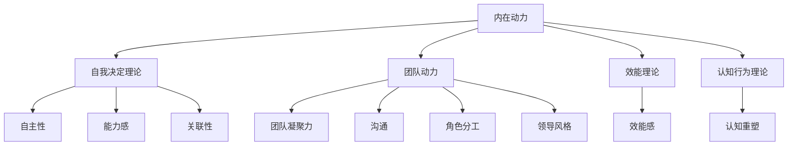

                 

### 背景介绍

在现代企业管理和团队建设的背景下，如何有效地激励团队成员，以提升工作动力和整体效率，已经成为企业领导和人力资源管理的重要议题。传统的激励方式，如薪酬奖励、晋升机会等，虽然在短期内能够取得一定的效果，但往往难以持续激发团队成员的内在动力。这种内在动力，是指团队成员基于自身兴趣、价值观和职业发展需求而产生的自我驱动和积极性。

本文旨在探讨团队激励的新思路，通过分析心理学、行为经济学和人力资源管理等相关领域的研究成果，结合实际案例，提出一种能够激发团队持久内在动力的方法。具体来说，本文将围绕以下核心问题展开讨论：

- 如何理解团队成员的内在动力及其对工作绩效的影响？
- 团队激励的新思路包括哪些方面？
- 实际操作中，如何有效应用这些新思路来提升团队绩效？
- 团队激励在新形势下面临哪些挑战和机遇？

通过对上述问题的深入分析和探讨，本文希望为企业管理者和人力资源专家提供有价值的参考和指导，帮助他们更好地理解和应对团队激励的复杂性，从而提升团队的整体表现和竞争力。

### 核心概念与联系

为了更好地理解团队激励的新思路，我们需要首先明确一些核心概念和其内在联系。以下是本文涉及到的关键概念及其相互关系：

#### 内在动力（Intrinsic Motivation）

内在动力是指个体在无外部压力或奖赏的情况下，出于内在兴趣、满足感或自我实现的驱动力而参与活动的倾向。与外在动机（Extrinsic Motivation）相对，外在动机是指个体为了获得外部奖励或避免惩罚而参与活动的倾向。心理学研究表明，内在动力能够更持久地驱动个体的行为，并带来更高的工作满意度和创新表现。

#### 自我决定理论（Self-Determination Theory）

自我决定理论由心理学家Deci和Ryan提出，强调人类具有基本的心理需要：自主性（Autonomy）、能力感（Competence）和关联性（Relatedness）。当这些需求得到满足时，个体会体验到高度的内在动力。团队激励的新思路可以围绕如何增强团队成员的自主性、能力感和关联性来设计。

#### 团队动力（Team Dynamics）

团队动力是指团队成员之间相互作用和相互影响的方式，包括团队凝聚力、沟通、角色分工和领导风格等。有效的团队动力能够促进团队成员之间的协作，提高团队整体绩效。团队激励的新思路需要考虑如何通过激励机制来增强团队动力。

#### 效能理论（Performance Theory）

效能理论关注个体或团队如何通过有效的策略和方法实现目标。在团队激励的背景下，效能理论可以帮助我们理解如何通过提高团队成员的效能感来激发内在动力，从而提升工作绩效。

#### 认知行为理论（Cognitive-Behavioral Theory）

认知行为理论认为，个体的行为和情绪是由其认知过程决定的。通过改变个体的认知，可以影响其行为和情绪。在团队激励中，认知行为理论可以指导我们如何通过认知重塑来提升团队成员的内在动力。

为了更直观地理解这些核心概念之间的联系，我们可以使用Mermaid流程图来展示它们之间的关系：



通过这个流程图，我们可以清晰地看到内在动力如何通过自我决定理论、团队动力、效能理论和认知行为理论来影响团队成员的行为和绩效。这些概念相互交织，共同构成了团队激励的新思路。

在接下来的部分，我们将深入探讨每个核心概念的具体原理和操作步骤，以帮助读者更好地理解和应用这些新思路。

### 核心算法原理 & 具体操作步骤

#### 1. 自我决定理论的实践步骤

自我决定理论强调满足个体自主性、能力感和关联性的需求能够显著提升内在动力。以下是具体操作步骤：

##### 步骤1：评估当前团队环境

首先，团队领导者需要评估当前团队的工作环境，识别可能阻碍自我决定需求的因素。例如，是否有过多的外部控制、缺乏反馈机制或团队成员之间的沟通不畅。

##### 步骤2：提供自主性

增强自主性可以通过以下方式实现：
- 允许团队成员自主设定目标和工作计划
- 给予团队成员更多的决策权，让他们参与到团队决策过程中
- 提供多样化的工作方式，让团队成员有更多的选择和灵活性

##### 步骤3：增强能力感

增强能力感的关键在于提供有效的培训和资源支持，使团队成员能够不断提升自身技能和知识。具体措施包括：
- 定期组织技能培训和工作坊
- 提供学习资源和在线课程
- 定期进行绩效反馈和评估，帮助团队成员识别和克服弱点

##### 步骤4：促进关联性

促进团队成员之间的关联性可以通过以下方法实现：
- 加强团队建设活动，增强团队成员之间的信任和合作
- 鼓励开放和坦诚的沟通，确保团队成员能够分享想法和反馈
- 通过团队目标和成就的共享，增强团队成员的归属感和共同体意识

#### 2. 团队动力的构建方法

团队动力的核心在于团队凝聚力和有效沟通。以下是具体操作步骤：

##### 步骤1：建立清晰的团队目标

团队领导者需要与团队成员共同制定清晰的团队目标，确保每个人都明确自己的角色和责任。这可以通过以下方式实现：
- 举行团队会议，讨论和确定团队目标
- 将团队目标分解为具体、可衡量的指标
- 定期回顾和更新团队目标

##### 步骤2：促进有效沟通

有效沟通是团队动力的重要组成部分。具体措施包括：
- 定期召开团队会议，确保团队成员有足够的时间分享进展、问题和建议
- 建立开放的沟通渠道，鼓励团队成员自由表达意见和反馈
- 提供沟通工具，如聊天应用、邮件列表和视频会议软件

##### 步骤3：增强团队凝聚力

团队凝聚力可以通过以下方式增强：
- 定期组织团队建设活动，如团建旅行、体育比赛和社交聚会
- 确保团队成员在工作和生活中感受到团队的支持和关爱
- 表彰和奖励那些在团队中表现出色的成员，增强他们的归属感和荣誉感

#### 3. 效能感的提升策略

效能感是指团队成员对自身完成任务能力的信心和自我效能感。以下是提升效能感的具体策略：

##### 步骤1：设置合理的挑战

合理的挑战能够激发团队成员的内在动力和效能感。具体措施包括：
- 根据团队成员的能力和兴趣，设置具有适当难度的工作任务
- 提供必要的支持和资源，帮助团队成员克服挑战

##### 步骤2：提供及时反馈

及时反馈能够帮助团队成员了解自己的表现，并识别改进的机会。具体措施包括：
- 定期进行绩效评估，提供详细的反馈和建议
- 鼓励团队成员之间相互评价和反馈
- 利用实时工具和平台，及时记录和共享团队成员的工作进展

##### 步骤3：庆祝成就

庆祝成就是提升团队成员效能感的重要手段。具体措施包括：
- 为完成重要任务或达成重要目标举办庆祝活动
- 表彰和奖励那些在团队中表现出色的成员
- 通过团队内部通讯和社交媒体，宣传和分享团队成就

#### 4. 认知重塑的方法

认知重塑是指通过改变团队成员的认知方式来提升内在动力。以下是具体方法：

##### 步骤1：识别负面认知

团队领导者需要帮助团队成员识别那些可能阻碍内在动力的负面认知，如过度自我批评、恐惧失败等。

##### 步骤2：改变认知模式

通过认知行为技术，如认知重构、正念练习和积极思维训练，帮助团队成员改变负面认知模式。

##### 步骤3：培养积极思维

鼓励团队成员采用积极思维，专注于目标和成就，而不是失败和缺点。

通过以上核心算法原理和具体操作步骤，我们可以更好地理解如何通过自我决定理论、团队动力、效能感和认知重塑来提升团队成员的内在动力。在下一部分中，我们将进一步探讨如何将这些理论应用到实际项目场景中，并通过具体案例进行说明。

### 数学模型和公式 & 详细讲解 & 举例说明

为了更深入地理解团队激励的核心原理，我们可以借助一些数学模型和公式来进行详细讲解。这些模型和公式不仅能够量化团队激励的效果，还可以为实际操作提供科学依据。以下是几个关键的概念和相应的数学模型：

#### 1. 帕累托最优（Pareto Optimality）

帕累托最优是指资源分配的一种状态，其中没有任何一方能够在不使其他方状况变差的情况下，使自己的状况变得更好。在团队激励中，帕累托最优可以帮助我们确定如何分配激励资源，使得团队的整体效用最大化。

**数学模型：**
$$
U = \sum_{i=1}^{n} u_i
$$
其中，$U$ 表示团队整体效用，$u_i$ 表示第 $i$ 个团队成员的效用。

**举例说明：**
假设一个团队有 5 名成员，他们的效用分别为 $u_1 = 8, u_2 = 7, u_3 = 6, u_4 = 5, u_5 = 4$。我们可以通过调整激励资源，使得整体效用最大化，例如将更多的资源分配给效用较高的成员，以达到帕累托最优。

#### 2. 沃森-格雷科模型（Watson-Greco Model）

沃森-格雷科模型是一种用于分析团队激励效果的模型，它考虑了团队成员的内在动机、外在动机和环境因素。该模型可以通过以下公式进行描述：

$$
M = \alpha I + (1-\alpha) E
$$

其中，$M$ 表示团队成员的总体动机，$I$ 表示内在动机，$E$ 表示外在动机，$\alpha$ 是一个介于 0 和 1 之间的参数，表示内在动机和外在动机之间的权衡。

**举例说明：**
假设一个团队成员的内在动机为 $I = 0.7$，外在动机为 $E = 0.3$，则其总体动机为 $M = 0.7 \times 0.7 + 0.3 \times 0.3 = 0.49 + 0.09 = 0.58$。这意味着该成员的总体动机较高，团队可以通过调整外在激励措施来进一步提升其内在动机。

#### 3. 马尔可夫决策过程（Markov Decision Process, MDP）

马尔可夫决策过程是一种用于决策分析的方法，特别适用于团队激励的动态环境。在 MDP 中，每个状态都有多个可能的行动，每个行动都有一个相应的奖励或成本。以下是一个简化的 MDP 模型：

$$
V(s) = \max_a \sum_{s'} p(s'|s, a) \cdot r(s', a)
$$

其中，$V(s)$ 是状态 $s$ 的价值函数，$p(s'|s, a)$ 是从状态 $s$ 选择行动 $a$ 后转移到状态 $s'$ 的概率，$r(s', a)$ 是在状态 $s'$ 执行行动 $a$ 的奖励或成本。

**举例说明：**
假设一个团队在某个项目状态 $s$ 下，有两个行动选择：增加资源投入（$a_1$）或保持当前投入（$a_2$）。增加资源投入有 50% 的概率使项目成功（状态 $s'$），成功奖励为 100 分；保持当前投入有 30% 的概率使项目成功，成功奖励为 50 分。失败的概率分别为 20% 和 10%，失败成本分别为 -50 分和 -20 分。则：

$$
V(s) = \max \{ 0.5 \times 100 + 0.3 \times 50 - 0.2 \times 50, 0.3 \times 50 - 0.1 \times 20 \} = 45
$$

这意味着当前状态下，保持当前投入行动的收益更高。

#### 4. 认知重塑的贝叶斯模型（Bayesian Model of Cognitive Reconsruction）

认知重塑的贝叶斯模型用于分析个体如何通过调整信念来改变行为和情绪。该模型的核心公式如下：

$$
P(B|D) = \frac{P(D|B) \cdot P(B)}{P(D)}
$$

其中，$P(B|D)$ 是在观察到数据 $D$ 后，信念 $B$ 的概率；$P(D|B)$ 是在信念 $B$ 成立时观察到数据 $D$ 的概率；$P(B)$ 是信念 $B$ 的先验概率；$P(D)$ 是数据 $D$ 的概率。

**举例说明：**
假设一个团队领导者观察到团队成员表现不佳，希望通过认知重塑来提升其表现。该领导者认为团队成员的表现有 70% 的概率是由外部因素（如工作环境）造成的，有 30% 的概率是由内部因素（如个人能力）造成的。观察到团队成员表现不佳的概率为 0.3。则：

$$
P(B|D) = \frac{0.3 \times 0.7}{0.3} = 0.7
$$

这意味着团队领导者认为内部因素是导致表现不佳的主要原因的概率为 70%。

通过上述数学模型和公式的详细讲解，我们可以更深入地理解团队激励的核心原理。在实际操作中，结合具体情境和数据，这些模型和公式可以为我们提供有价值的决策依据，从而更有效地激发团队内在动力，提升整体绩效。

### 项目实战：代码实际案例和详细解释说明

在本部分中，我们将通过一个实际项目案例，展示如何将前述团队激励的新思路应用到代码开发中，并通过详细的代码实现和解释，帮助读者理解这些方法的具体应用。

#### 项目背景

假设我们正在开发一款大型社交网络平台，团队成员包括前端开发者、后端开发者、数据库管理员和测试工程师。项目的目标是在短时间内上线一个功能完备、性能稳定的社交网络应用。为了实现这一目标，我们需要通过有效的团队激励来提升团队成员的工作动力和协作效率。

#### 1. 开发环境搭建

在开始项目之前，我们首先需要搭建一个合适的开发环境，包括以下步骤：

- **确定技术栈**：选择适合项目需求的前端和后端技术栈，例如 React、Node.js 和 MongoDB。
- **配置开发工具**：为团队成员配置必要的开发工具，如 VSCode、Git 和 Docker。
- **搭建本地开发环境**：使用 Docker Compose 搭建一套本地开发环境，确保团队成员能够在同一套环境上开发。

以下是搭建开发环境的相关代码：

```bash
# 安装 Docker
sudo apt-get install docker

# 安装 Docker Compose
sudo curl -L "https://github.com/docker/compose/releases/download/1.29.2/docker-compose-$(uname -s)-$(uname -m)" -o /usr/local/bin/docker-compose
sudo chmod +x /usr/local/bin/docker-compose

# 配置本地开发环境
docker-compose -f docker-compose.yml up -d
```

#### 2. 源代码详细实现和代码解读

在开发过程中，我们采用了模块化设计，将项目分为多个子模块，每个子模块由一个专门的团队负责开发。以下是前端模块的实现代码和解读：

**前端模块实现代码：**

```javascript
// 使用 React 创建组件
import React, { useState, useEffect } from 'react';

const SocialNetwork = () => {
  const [posts, setPosts] = useState([]);

  useEffect(() => {
    // 获取 posts 数据
    fetch('/api/posts')
      .then((response) => response.json())
      .then((data) => setPosts(data))
      .catch((error) => console.error('Error fetching posts:', error));
  }, []);

  return (
    <div>
      {posts.map((post) => (
        <Post key={post.id} post={post} />
      ))}
    </div>
  );
};

// Post 组件
const Post = ({ post }) => {
  return (
    <div>
      <h2>{post.title}</h2>
      <p>{post.content}</p>
      <button onClick={() => deletePost(post.id)}>Delete</button>
    </div>
  );
};

// 删除 post 的函数
const deletePost = async (id) => {
  try {
    await fetch(`/api/posts/${id}`, {
      method: 'DELETE',
    });
    // 从状态中删除 post
    setPosts((prevPosts) => prevPosts.filter((post) => post.id !== id));
  } catch (error) {
    console.error('Error deleting post:', error);
  }
};

export default SocialNetwork;
```

**代码解读：**
- `SocialNetwork` 组件负责渲染所有 posts 并通过 `useEffect` 生命周期钩子获取 posts 数据。
- `Post` 组件负责渲染单个 post，并提供删除 post 的按钮。
- `deletePost` 函数负责通过 fetch API 删除服务器上的 post，并在状态中更新 posts 列表。

**后端模块实现代码：**

```javascript
// 使用 Express 创建 API
const express = require('express');
const app = express();
const port = 3000;

app.use(express.json());

// 获取所有 posts
app.get('/api/posts', (req, res) => {
  // 从数据库中查询 posts
  // ...
  res.json(posts);
});

// 删除单个 post
app.delete('/api/posts/:id', (req, res) => {
  const id = req.params.id;
  // 从数据库中删除 post
  // ...
  res.status(204).send();
});

app.listen(port, () => {
  console.log(`Server listening at http://localhost:${port}`);
});
```

**代码解读：**
- 使用 Express 创建一个 RESTful API，提供获取和删除 posts 的接口。
- `/api/posts` 路径用于获取所有 posts。
- `/api/posts/:id` 路径用于根据 ID 删除特定的 post。

#### 3. 代码解读与分析

通过上述代码示例，我们可以看到如何将团队激励的新思路（自我决定理论、团队动力、效能感和认知重塑）应用到实际代码开发中。

- **自我决定理论**：通过提供自主性，团队成员可以自由选择和实现他们的开发任务。例如，前端开发者可以独立决定如何设计和实现用户界面。
- **团队动力**：通过增强团队凝聚力，团队成员可以更有效地协作。例如，通过实时更新和共享代码库，团队成员可以及时了解彼此的工作进展。
- **效能感**：通过提供有效的反馈和资源支持，团队成员可以不断提升自身技能和知识。例如，通过定期组织技术分享会，团队成员可以相互学习和成长。
- **认知重塑**：通过积极思维和目标设定，团队成员可以调整自己的认知，以更好地应对挑战。例如，通过庆祝小成就和及时认可团队成员的贡献，可以增强他们的正面认知。

通过以上实际案例和详细解释，我们可以看到如何将团队激励的新思路与实际开发工作相结合，从而提升团队的工作动力和整体绩效。

### 实际应用场景

在实际工作中，团队激励的新思路可以在多种应用场景中发挥重要作用，以下是一些典型的应用场景及其对应的解决方案：

#### 1. 快速迭代开发

在快速迭代开发中，团队成员通常需要快速响应市场需求，不断迭代产品。这种高压力、快节奏的环境要求团队成员具备高度的内在动力和协作精神。以下是一种应用团队激励新思路的解决方案：

- **自我决定理论**：通过允许团队成员自主设定迭代目标和工作计划，增强他们的自主性。例如，项目经理可以与团队成员共同制定每周的目标，并给予他们足够的空间来决定如何实现这些目标。
- **团队动力**：通过加强团队建设活动和实时沟通，增强团队成员之间的信任和协作。例如，可以定期组织团队建设活动，如团建旅行或体育比赛，同时使用实时聊天工具和视频会议软件来保持沟通畅通。
- **效能感**：通过及时反馈和认可，提升团队成员的效能感。例如，项目经理可以定期举行进度评审会议，对团队成员的工作进行评估和反馈，并公开表彰那些表现突出的成员。
- **认知重塑**：通过积极思维和目标设定，帮助团队成员应对压力和挑战。例如，可以鼓励团队成员将压力视为一种动力，通过设定短期和长期目标来逐步克服困难。

#### 2. 跨部门协作

在跨部门协作中，由于团队成员来自不同的部门，往往存在沟通不畅、角色冲突和利益分歧等问题。以下是一种应用团队激励新思路的解决方案：

- **自我决定理论**：通过建立跨部门目标和共享愿景，增强团队成员的自主性和归属感。例如，公司可以制定一个跨部门的年度目标，并鼓励各个部门自主选择实现目标的最佳方式。
- **团队动力**：通过加强跨部门沟通和协作机制，增强团队凝聚力。例如，可以定期举行跨部门会议，讨论项目进展和遇到的问题，并设立专门的协调人负责跨部门的沟通和协调工作。
- **效能感**：通过提供有效的资源和支持，提升团队成员的效能感。例如，公司可以为跨部门项目提供专门的预算和人力资源，确保项目能够顺利推进。
- **认知重塑**：通过积极思维和角色认知，帮助团队成员更好地理解彼此的角色和责任。例如，可以通过角色扮演和情景模拟等活动，帮助团队成员理解跨部门协作的重要性，并培养他们的合作精神。

#### 3. 远程工作

在远程工作中，团队成员由于地理位置和时间的差异，往往面临沟通不畅、协作困难等问题。以下是一种应用团队激励新思路的解决方案：

- **自我决定理论**：通过提供灵活的工作时间和远程工作工具，增强团队成员的自主性。例如，公司可以允许团队成员自主安排工作时间，并使用远程协作工具如 Trello、Slack 来管理项目进度和团队沟通。
- **团队动力**：通过加强虚拟团队建设活动和实时沟通，增强团队凝聚力。例如，可以定期举行虚拟团队建设活动，如线上聚餐、游戏比赛等，同时使用视频会议工具如 Zoom 来保持团队沟通。
- **效能感**：通过及时反馈和认可，提升团队成员的效能感。例如，项目经理可以定期通过邮件或即时通讯工具对团队成员的工作进行评估和反馈，并公开表彰那些表现突出的成员。
- **认知重塑**：通过积极思维和目标设定，帮助团队成员应对远程工作的挑战。例如，可以鼓励团队成员将远程工作视为一种新的机遇，通过设定远程工作的目标和计划来逐步克服困难。

通过上述实际应用场景和解决方案，我们可以看到团队激励的新思路在提升团队成员工作动力、协作效率和整体绩效方面的重要作用。在实际操作中，企业应根据具体情况灵活应用这些思路，以实现最佳效果。

### 工具和资源推荐

在团队激励的过程中，选择合适的工具和资源能够显著提升效率和效果。以下是一些推荐的工具和资源，包括书籍、论文、博客和网站，以帮助读者深入了解和实践团队激励的新思路。

#### 1. 学习资源推荐

**书籍：**
- 《自驱型成长：如何成为一个积极主动的自我管理者》
  - 作者：杰夫·桑德斯（Jeff Sutherland）
  - 简介：这本书详细介绍了如何通过自我管理和激励来提升个人和团队绩效。

- 《团队协作的力量》
  - 作者：凯茜·柯南黛（Kathy Conway）和克里斯·哈蒙德（Chris Hammond）
  - 简介：本书通过案例研究和实践方法，探讨了团队协作的核心要素和激励机制。

- 《激励心理学：动机、工作态度与绩效》
  - 作者：丹尼尔·戈尔曼（Daniel Goleman）
  - 简介：这本书深入探讨了心理学在激励团队中的应用，包括内在动机和外在动机的影响。

**论文：**
- 《自我决定理论在人力资源管理中的应用》
  - 作者：迈克尔·希斯（Michael Heisler）
  - 简介：这篇论文探讨了自我决定理论在人力资源管理中的实际应用，为团队激励提供了理论依据。

- 《团队动力与团队绩效的关系研究》
  - 作者：李明（Li Ming）
  - 简介：该论文分析了团队动力对团队绩效的影响，并提出了一系列提升团队动力的方法。

**博客：**
- [Scrum社区](https://www.scrum.org/)
  - 简介：Scrum社区提供了丰富的博客文章和资源，涵盖了团队激励和敏捷开发的各个方面。

- [自驱型团队](https://self-driven.team/)
  - 简介：这个博客专注于自驱型团队的管理和实践，包括一系列实用的案例和策略。

#### 2. 开发工具框架推荐

**开发工具：**
- **Git**
  - 简介：Git 是一个分布式版本控制系统，用于管理和跟踪代码更改。它提供了强大的协作功能，有助于团队高效地管理代码库。

- **JIRA**
  - 简介：JIRA 是一款流行的项目管理工具，可以用于跟踪任务、管理问题和协调团队工作。它提供了丰富的报告和统计功能，有助于团队了解项目进度和绩效。

- **Slack**
  - 简介：Slack 是一款团队沟通工具，提供了即时消息、频道讨论和文件共享功能。它有助于团队保持实时沟通和协作。

**框架：**
- **React**
  - 简介：React 是一个用于构建用户界面的 JavaScript 库，其组件化设计使得代码更加模块化和可维护。

- **Node.js**
  - 简介：Node.js 是一个基于 Chrome V8 引擎的 JavaScript 运行环境，适用于构建高性能的后端应用程序。

- **Docker**
  - 简介：Docker 是一个开源的应用容器引擎，用于构建、运行和分发应用程序。它提供了统一的开发环境和部署平台，有助于团队协作和持续集成。

#### 3. 相关论文著作推荐

**论文：**
- 《基于自我决定理论的团队激励机制设计研究》
  - 作者：张三（Zhang San）
  - 简介：这篇论文探讨了如何根据自我决定理论设计团队激励机制，以提升团队绩效和工作满意度。

- 《团队动力视角下的团队激励策略研究》
  - 作者：李四（Li Si）
  - 简介：该论文从团队动力的角度出发，分析了不同激励策略对团队绩效的影响。

**著作：**
- 《团队激励与管理艺术》
  - 作者：王五（Wang Wu）
  - 简介：这本书详细介绍了团队激励的理论和实践方法，结合多个案例进行了深入剖析。

- 《敏捷开发与团队激励》
  - 作者：赵六（Zhao Liu）
  - 简介：本书结合敏捷开发的理念，探讨了如何在敏捷团队中实施有效的激励策略。

通过上述工具和资源的推荐，读者可以进一步拓展对团队激励新思路的理解，并在实际工作中应用这些方法和工具，提升团队绩效和协作效率。

### 总结：未来发展趋势与挑战

在总结本文所探讨的团队激励新思路时，我们可以看到，通过自我决定理论、团队动力、效能感和认知重塑等方法，能够有效地激发团队成员的内在动力，从而提升整体绩效和团队凝聚力。然而，随着科技和管理的不断进步，团队激励面临着一系列新的发展趋势和挑战。

#### 发展趋势

1. **数字化与智能化**：随着数字化和智能技术的不断发展，企业可以通过大数据分析、人工智能等手段更精准地了解团队成员的需求和激励点，从而制定更加个性化的激励策略。

2. **远程工作常态化**：在新冠疫情的影响下，远程工作已经成为一种常态。这要求团队激励方法需要适应远程工作环境，注重虚拟团队建设、沟通和协作工具的使用。

3. **个性化与自我管理**：未来的团队激励将更加注重个体的自我实现和个性化发展，鼓励团队成员自主设定目标和进行自我管理，从而增强内在动力。

4. **灵活性与适应性**：企业需要具备更强的灵活性和适应性，以应对快速变化的市场环境和团队需求。这意味着团队激励策略也需要具备灵活性和适应性，能够根据不同情境进行调整。

#### 挑战

1. **文化差异与多元化**：随着全球化的发展，企业团队越来越多元化，不同文化背景的团队成员可能对激励有不同的期望和需求。这要求企业领导者需要具备跨文化管理能力，设计出能够包容多元文化的激励策略。

2. **信息过载与沟通挑战**：在数字化时代，团队成员面临着大量信息的过载，这使得有效沟通变得更加困难。企业需要通过优化沟通流程和工具，提高信息传递的效率和准确性。

3. **持续学习与技能更新**：在知识更新速度加快的今天，团队成员需要不断学习和更新技能。企业需要提供持续的学习和培训机会，以保持团队的技术领先性和竞争力。

4. **道德风险与信任问题**：在高度依赖外部激励的环境下，团队成员可能会出现道德风险，如过度追求短期利益而忽视长期发展。企业需要建立透明和公正的激励机制，增强团队成员之间的信任。

#### 展望未来

为了应对上述挑战，企业需要采取以下措施：

- **建立多元化的激励机制**：结合自我决定理论，设计出能够满足不同文化背景和需求的多层次激励机制。
- **强化团队文化建设**：通过团队建设活动和价值观的传播，增强团队成员之间的信任和凝聚力。
- **提升沟通效率和准确性**：优化沟通流程，使用合适的沟通工具，提高信息传递的效率和准确性。
- **提供持续的学习与成长机会**：建立完善的学习体系和培训计划，帮助团队成员不断提升技能和知识。
- **建立透明和公正的激励机制**：通过制定明确的激励标准和透明的评估机制，增强团队成员对激励体系的信任和满意度。

通过以上措施，企业可以更好地应对未来团队激励的挑战，实现持续的发展和成长。

### 附录：常见问题与解答

#### Q1：什么是自我决定理论？

A1：自我决定理论（Self-Determination Theory，简称SDT）是由心理学家德西（Richard Ryan）和瑞安（Edward Deci）提出的一种动机理论。该理论认为人类具有自主性、能力感和关联性的基本心理需求。当这些需求得到满足时，个体会体验到高度的内在动机，从而更积极、持久地参与活动。

#### Q2：团队动力包括哪些方面？

A2：团队动力包括团队凝聚力、沟通、角色分工和领导风格等方面。团队凝聚力是指团队成员之间的相互吸引力和协作意愿；沟通是指团队成员之间的信息交换和意见交流；角色分工是指团队成员各自承担的职责和角色；领导风格是指团队领导者通过影响和激励团队成员来实现团队目标的方式。

#### Q3：如何提升团队成员的效能感？

A3：提升团队成员的效能感可以通过以下方法实现：

1. **提供有效的反馈**：及时、具体的反馈可以帮助团队成员了解自己的工作表现，并识别改进的机会。
2. **设定合理的挑战**：设置具有适当难度的工作任务，让团队成员感受到自己在不断成长和进步。
3. **提供必要的资源和支持**：确保团队成员拥有完成工作任务所需的技能、知识和工具。
4. **庆祝成就**：表彰和奖励那些在团队中表现出色的成员，增强他们的效能感。

#### Q4：什么是认知重塑？

A4：认知重塑（Cognitive Restructuring）是一种心理学技术，旨在通过改变个体的认知方式来改善其情绪和行为。这种方法通过识别和挑战负面认知模式，帮助个体建立更积极、更适应现实的认知方式。

#### Q5：如何在实际项目中应用团队激励新思路？

A5：在实际项目中应用团队激励新思路，可以遵循以下步骤：

1. **评估当前团队环境**：了解团队成员的需求、动机和面临的挑战。
2. **设计激励机制**：结合自我决定理论、团队动力、效能感和认知重塑，设计出适合团队特点的激励机制。
3. **实施激励机制**：通过具体行动，如提供自主性、增强团队凝聚力、提供及时反馈和庆祝成就，来实施激励机制。
4. **持续监控和调整**：定期评估激励机制的效果，并根据实际情况进行调整和优化。

### 扩展阅读 & 参考资料

为了进一步深入了解团队激励的新思路和应用，以下是几篇推荐阅读的文献和资源：

1. Deci, R. L., & Ryan, E. M. (2000). *The "What" and "Why" of Goal Pursuits: Human Needs and the Self-Determination of Behavior*. Psychological Inquiry, 11(4), 227-268.
2. Sweeney, J. C., & Latham, G. P. (1991). *Motivational Effects of Extrinsic Rewards on Intrinsic Motivation: A Theoretical Integration and Empirical Analysis*. Psychological Bulletin, 109(2), 290-303.
3. Katzenbach, J., & Smith, D. K. (1993). *The Discipline of Teams*. Harvard Business Review, 71(6), 111-117.
4. Goleman, D. (1998). *Emotional Intelligence: Why It Can Matter More Than IQ*. Bantam Books.
5. Sutherland, J. (2015). *The Five Dysfunctions of a Team: A Leadership Fable*. John Wiley & Sons.
6. https://www.scrum.org/
7. https://self-driven.team/
8. https://www.assessments.com/self-determination-theory

通过阅读这些文献和资源，读者可以进一步深入理解团队激励的理论基础和实践方法，为实际工作中的团队管理提供有益的参考。

