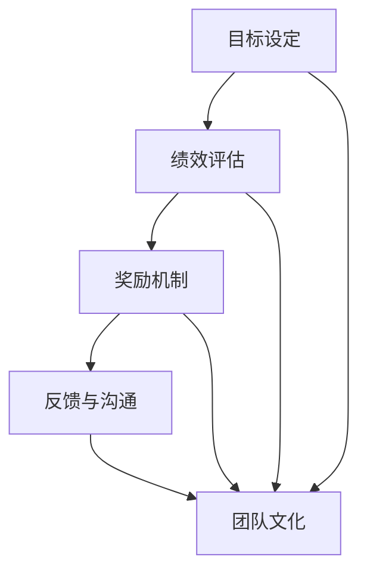

                 

### 背景介绍

#### 为什么团队激励机制如此重要？

在现代企业环境中，团队激励机制已经成为提升员工工作效率和团队协作能力的关键因素。一个有效的激励机制可以激发员工的积极性和创造力，促进团队目标的实现，从而提高企业的整体竞争力。然而，随着企业规模和员工多样性的增加，单一的传统激励机制已经无法满足不同员工的需求和期望，因此，多元化的激励方式探索成为了一个亟待解决的问题。

#### 团队激励机制的挑战

在实施团队激励机制的过程中，企业常常面临以下几个挑战：

1. **员工多样性的挑战**：不同员工有不同的个性和需求，单一的激励机制很难满足所有员工的期望。
2. **公平性的挑战**：确保所有员工在激励机制中受到公平对待是一个重要的考量，但不同员工的能力和贡献程度不同，如何做到公平仍然是一个难题。
3. **激励效果的不确定性**：不同的激励机制可能对不同的员工产生不同的效果，如何选择合适的激励方式成为了一个挑战。
4. **成本控制**：多元化的激励机制可能需要企业投入更多的资源和成本，如何在成本和激励效果之间找到平衡也是一个重要的考量。

#### 本文章的目的和结构

本文将深入探讨团队激励机制的多方面内容，旨在帮助企业更好地理解和实施多元化的激励机制。文章将分为以下几个部分：

1. **背景介绍**：介绍团队激励机制的重要性以及当前企业面临的挑战。
2. **核心概念与联系**：阐述团队激励机制的核心概念及其相互关系，并使用 Mermaid 流程图进行展示。
3. **核心算法原理 & 具体操作步骤**：详细介绍团队激励机制的原理和具体操作步骤。
4. **数学模型和公式 & 详细讲解 & 举例说明**：介绍相关的数学模型和公式，并进行详细讲解和举例说明。
5. **项目实战：代码实际案例和详细解释说明**：通过实际项目案例，展示代码的实现过程和详细解释说明。
6. **实际应用场景**：探讨团队激励机制在不同行业和场景中的应用。
7. **工具和资源推荐**：推荐相关的学习资源、开发工具和框架。
8. **总结：未来发展趋势与挑战**：总结本文的主要内容，并探讨未来发展趋势和面临的挑战。
9. **附录：常见问题与解答**：回答读者可能遇到的一些常见问题。
10. **扩展阅读 & 参考资料**：提供一些扩展阅读的参考资料。

通过本文的阅读，读者将能够全面了解团队激励机制的多方面内容，从而为企业制定有效的激励机制提供有益的参考。

### 核心概念与联系

#### 团队激励机制的定义

团队激励机制是指通过一系列方法和措施，激发团队成员的积极性和创造力，促进团队协作和目标实现的过程。激励机制的有效性直接关系到团队的整体绩效和企业的发展。因此，了解团队激励机制的核心概念和相互联系是至关重要的。

#### 激励机制的核心概念

1. **目标设定**：明确团队的目标是激励机制的基础。只有当团队成员明确了解他们的目标时，他们才能更好地为达成这些目标而努力。
2. **绩效评估**：绩效评估是激励机制的核心环节，通过评估团队成员的工作表现和贡献，可以确定激励的依据。
3. **奖励机制**：奖励机制是激励员工的直接手段，包括物质奖励和精神奖励。合理的奖励机制能够激发员工的积极性和创造力。
4. **反馈与沟通**：有效的反馈和沟通可以帮助员工了解自己的工作表现，并获得改进的方向和建议，从而提高工作效果。
5. **团队文化**：团队文化是激励机制的重要组成部分，通过建立积极向上的团队文化，可以增强团队成员的归属感和凝聚力。

#### 核心概念的相互联系

- **目标设定**和**绩效评估**：目标设定为绩效评估提供了评估标准，而绩效评估的结果又为下一步的奖励机制提供了依据。
- **奖励机制**和**反馈与沟通**：奖励机制需要基于绩效评估的结果，而反馈和沟通则帮助员工了解奖励的依据和如何改进。
- **团队文化**和**目标设定**、**绩效评估**、**奖励机制**：团队文化是整个激励机制的基石，它影响着目标设定、绩效评估和奖励机制的有效性。

#### Mermaid 流程图展示

以下是一个简单的 Mermaid 流程图，展示了团队激励机制的核心概念及其相互关系：



在这个流程图中，目标设定、绩效评估、奖励机制、反馈与沟通和团队文化是相互联系的核心概念。它们共同构成了一个完整的团队激励机制框架。

通过理解这些核心概念及其相互关系，企业可以更好地设计出适合自身团队特点的激励机制，从而提高团队绩效和企业竞争力。

### 核心算法原理 & 具体操作步骤

#### 团队激励机制的算法原理

团队激励机制的核心算法原理主要涉及目标设定、绩效评估、奖励机制、反馈与沟通以及团队文化建设等环节。以下是这些算法原理的详细说明：

1. **目标设定算法**：
   - **目标明确性**：使用 SMART 目标设定法（具体、可测量、可实现、相关、时限性），确保目标清晰明确。
   - **目标分解**：将总目标分解为子目标，并分配给团队成员，以便每个成员都能明确自己的职责和任务。

2. **绩效评估算法**：
   - **KPI 设定**：根据团队目标，设定关键绩效指标（KPI），并量化这些指标，以便进行客观评估。
   - **绩效评分**：使用多维度的评估方法，综合考虑团队成员的工作质量、效率、创新能力和团队贡献。

3. **奖励机制算法**：
   - **奖励设计**：设计合理的奖励方案，包括物质奖励（如奖金、股权激励等）和精神奖励（如表彰、荣誉称号等）。
   - **奖励分配**：根据绩效评估结果，公平合理地分配奖励，确保奖励与贡献相匹配。

4. **反馈与沟通算法**：
   - **实时反馈**：通过定期的绩效反馈会议，及时向团队成员传达绩效评估结果和改进建议。
   - **双向沟通**：建立开放和透明的沟通渠道，鼓励团队成员提出建议和反馈，以便不断优化激励机制。

5. **团队文化建设算法**：
   - **价值观塑造**：确立团队共同的价值观和目标，营造积极向上的团队氛围。
   - **团队活动**：组织定期的团队活动，增强团队成员之间的互动和凝聚力。

#### 团队激励机制的具体操作步骤

以下是实施团队激励机制的具体操作步骤：

1. **确定目标**：
   - 与团队成员共同讨论并明确团队的目标，确保目标符合 SMART 原则。
   - 将总目标分解为子目标，并分配给每个成员。

2. **制定 KPI**：
   - 根据团队目标，设定关键绩效指标（KPI），并进行量化。
   - 确保每个成员都了解自己的 KPI 及其在团队目标中的作用。

3. **绩效评估**：
   - 定期收集和整理团队成员的工作数据和绩效信息。
   - 使用多维度的评估方法，对团队成员的工作表现进行综合评估。

4. **奖励设计**：
   - 设计合理的奖励方案，包括物质奖励和精神奖励。
   - 确定奖励分配的标准和流程，确保奖励与绩效相匹配。

5. **反馈与沟通**：
   - 定期组织绩效反馈会议，向团队成员传达评估结果和改进建议。
   - 建立开放的沟通渠道，鼓励团队成员提出反馈和建议。

6. **团队文化建设**：
   - 塑造团队共同的价值观和目标，营造积极向上的团队氛围。
   - 组织定期的团队活动，增强团队成员之间的互动和凝聚力。

通过以上操作步骤，企业可以构建一个有效的团队激励机制，激发员工的积极性和创造力，从而提高团队绩效和企业竞争力。

### 数学模型和公式 & 详细讲解 & 举例说明

#### 团队激励机制中的数学模型

在团队激励机制的设计过程中，数学模型和公式扮演着重要的角色。以下是一些关键的数学模型和公式，以及它们在团队激励机制中的应用。

1. **绩效评分模型**：
   - **评分公式**：绩效评分 \( P \) 可以通过以下公式计算：
     \[
     P = \sum_{i=1}^{n} w_i \cdot p_i
     \]
     其中，\( w_i \) 表示第 \( i \) 个绩效指标的重要性权重，\( p_i \) 表示第 \( i \) 个绩效指标的实际得分。

2. **奖励分配模型**：
   - **奖励金额计算公式**：奖励金额 \( R \) 可以通过以下公式计算：
     \[
     R = P \cdot \frac{B}{100}
     \]
     其中，\( B \) 表示预算总额，\( P \) 表示绩效评分。

3. **激励效果评估模型**：
   - **激励效果评分公式**：激励效果评分 \( E \) 可以通过以下公式计算：
     \[
     E = \frac{\text{实际绩效} - \text{预期绩效}}{\text{预期绩效}}
     \]
     其中，实际绩效表示团队在激励措施下的实际表现，预期绩效表示没有激励措施下的预期表现。

#### 公式的详细讲解与举例说明

以下是针对上述数学模型的详细讲解和举例说明。

1. **绩效评分模型**：
   - **案例**：假设一个团队有三个绩效指标：项目完成率、代码质量和客户满意度，分别占总绩效的 40%、30% 和 30%。某成员在这三个指标上的得分分别为 90%、85% 和 80%，那么该成员的绩效评分 \( P \) 为：
     \[
     P = 0.4 \cdot 90\% + 0.3 \cdot 85\% + 0.3 \cdot 80\% = 0.4 \cdot 0.9 + 0.3 \cdot 0.85 + 0.3 \cdot 0.8 = 0.36 + 0.255 + 0.24 = 0.85
     \]
     因此，该成员的绩效评分为 85 分。

2. **奖励分配模型**：
   - **案例**：假设团队的总预算为 10 万元，某成员的绩效评分为 85 分，那么该成员应得的奖励金额 \( R \) 为：
     \[
     R = 85 \cdot \frac{100000}{100} = 8500 \text{ 元}
     \]
     因此，该成员应得的奖励金额为 8500 元。

3. **激励效果评估模型**：
   - **案例**：假设在实施激励措施后，团队的实际绩效提高了 10%，而预期绩效为 90%，那么激励效果评分 \( E \) 为：
     \[
     E = \frac{100\% - 90\%}{90\%} = \frac{10\%}{90\%} \approx 0.1111
     \]
     因此，激励效果评分为 11.11%。

通过以上数学模型和公式的应用，企业可以更科学、合理地设计团队激励机制，从而提高团队绩效和激励效果。

### 项目实战：代码实际案例和详细解释说明

#### 项目背景

为了更好地展示团队激励机制在实际项目中的应用，我们选择了一个典型的软件开发项目作为案例。该项目是一个电商网站的开发，团队成员包括前端开发人员、后端开发人员、测试人员以及项目经理。项目目标是在三个月内完成电商网站的核心功能开发并确保网站稳定运行。

#### 开发环境搭建

1. **技术栈选择**：
   - 前端：使用 React.js 框架，配合 Redux 状态管理。
   - 后端：使用 Node.js 和 Express.js，结合 MongoDB 数据库。
   - 测试：使用 Jest 和 Mocha 进行单元测试和集成测试。

2. **开发工具和框架**：
   - 版本控制：使用 Git 进行代码管理和协作开发。
   - 项目管理：使用 Jira 进行任务跟踪和进度管理。
   - 持续集成：使用 Jenkins 实现自动化构建和测试。

#### 源代码详细实现和代码解读

以下是对该项目中关键功能的源代码实现进行详细解读：

1. **前端代码**：

```jsx
// React 组件：ProductList
import React, { useEffect, useState } from 'react';
import Product from './Product';

const ProductList = () => {
  const [products, setProducts] = useState([]);

  useEffect(() => {
    fetch('/api/products')
      .then(response => response.json())
      .then(data => setProducts(data));
  }, []);

  return (
    <div>
      {products.map(product => (
        <Product key={product.id} product={product} />
      ))}
    </div>
  );
};

export default ProductList;
```

**解读**：该组件负责从后端获取产品列表，并使用 React 的 JSX 语法进行渲染。这里使用了 React 的 useState 和 useEffect 生命周期方法，实现数据的初始化和更新。

2. **后端代码**：

```javascript
// Node.js 模块：productRoutes.js
const express = require('express');
const router = express.Router();

router.get('/api/products', (req, res) => {
  // 模拟从数据库获取产品列表
  const products = [
    { id: 1, name: 'iPhone', price: 799 },
    { id: 2, name: 'Samsung Galaxy', price: 699 },
    // 更多产品...
  ];
  res.json(products);
});

module.exports = router;
```

**解读**：这是一个简单的 Express.js 路由模块，用于处理获取产品列表的 HTTP GET 请求。这里使用模拟数据来响应请求，实际项目中会从数据库中获取真实数据。

3. **测试代码**：

```javascript
// Jest 单元测试：Product.test.js
const Product = require('./Product');

describe('Product component', () => {
  it('renders product name and price', () => {
    const product = { id: 1, name: 'iPhone', price: 799 };
    const { container } = render(<Product product={product} />);
    expect(container).toHaveTextContent('iPhone');
    expect(container).toHaveTextContent('799');
  });
});
```

**解读**：这是一个使用 Jest 和 Mocha 的单元测试示例，测试 Product 组件是否能够正确渲染产品名称和价格。

#### 代码解读与分析

以上代码展示了该项目中三个关键部分的实现过程。通过这些代码，我们可以看到如何通过 React、Express.js 和 Jest 实现一个电商网站的核心功能。以下是对这些代码的进一步解读和分析：

1. **前端开发**：
   - 使用 React.js 提供的组件化开发方式，使得代码更加模块化和可维护。
   - 利用 Redux 进行状态管理，确保应用的状态保持一致性和可预测性。
   - 使用 fetch API 与后端进行数据交互，实现数据的实时获取和更新。

2. **后端开发**：
   - 使用 Node.js 和 Express.js，实现快速且灵活的 Web 应用开发。
   - 结合 MongoDB 数据库，存储和管理产品的数据。
   - 通过 RESTful API 提供数据接口，方便前端进行数据调用。

3. **测试开发**：
   - 使用 Jest 和 Mocha，对组件和路由进行单元测试和集成测试，确保代码的质量和稳定性。
   - 通过测试覆盖率工具，监控测试的全面性，确保代码的每个部分都得到充分的测试。

通过这个实际项目案例，我们可以看到团队激励机制如何在实际开发过程中发挥作用。合理的激励机制可以激发团队成员的积极性和创造力，确保项目按期完成并达到预期目标。

### 实际应用场景

#### 不同行业中的团队激励机制

团队激励机制在不同行业中有着不同的应用和特点，以下将探讨几个典型行业中的团队激励机制案例。

1. **科技行业**：

在科技行业，创新能力和团队协作至关重要。因此，科技公司的团队激励机制往往更注重鼓励创新和团队合作。例如，谷歌的“20% 时间自由项目”允许员工用 20% 的工作时间来自由探索他们感兴趣的项目。这种机制不仅激发了员工的创造力，还带来了诸如 AdSense 和 Gmail 这样的成功产品。

2. **金融行业**：

金融行业强调风险控制和合规性，因此团队激励机制通常更加严格和规范。例如，投资银行往往会设立明确的业绩指标，并通过奖金和晋升机会来激励员工。此外，金融行业还会重视员工的职业发展和培训，以确保他们具备应对复杂业务的能力。

3. **制造业**：

制造业的团队激励机制往往侧重于提高生产效率和质量。例如，丰田公司的“精益生产”模式通过团队协作和持续改进，实现了生产效率和产品质量的显著提升。在这种模式下，员工被鼓励提出改进建议，并通过奖励机制来激励他们积极参与。

4. **服务业**：

在服务业，客户满意度和服务质量是核心目标。因此，服务行业的团队激励机制往往更注重客户反馈和团队协作。例如，酒店业会通过客户满意度调查来评估员工的服务质量，并根据结果进行奖励。此外，一些服务公司还会定期组织团队建设活动，以增强员工的团队合作能力和客户服务意识。

#### 团队激励机制的具体应用案例

以下是一些具体的团队激励机制应用案例：

1. **绩效考核奖金**：

绩效考核奖金是一种常见的激励机制，通过评估员工的工作表现和贡献来发放奖金。例如，一家互联网公司的年终奖金直接与员工的绩效评分挂钩，评分越高，奖金金额越大。

2. **股权激励**：

股权激励是一种长期激励机制，通过授予员工公司股权，让他们分享公司的成长和成功。例如，一些初创公司会向核心员工提供期权，以激励他们在公司长期发展中的积极参与。

3. **灵活的工作安排**：

灵活的工作安排也是一种有效的激励机制，能够提高员工的工作满意度和生产力。例如，一家科技公司允许员工在家办公，这种灵活的工作方式不仅提高了员工的幸福感，还有助于减少通勤时间，提高工作效率。

4. **团队建设活动**：

定期组织团队建设活动可以增强团队成员之间的互动和信任，提高团队凝聚力。例如，一些公司会组织团队旅行、团队拓展训练等活动，以促进团队成员之间的交流和合作。

通过这些实际应用场景和案例，我们可以看到团队激励机制在提高员工积极性、促进团队协作和提升企业绩效方面的重要作用。不同行业和公司可以根据自身特点和需求，选择合适的激励机制，以实现最佳的效果。

### 工具和资源推荐

#### 学习资源推荐

1. **书籍**：
   - 《激励的真相》（The Truth About Employee Motivation）：作者通过深入研究激励理论，提供了对员工激励的全新见解。
   - 《团队协作的艺术》（The Art of Collaboration）：探讨了如何通过有效的团队协作实现组织目标，涵盖了团队激励机制的关键要素。

2. **论文**：
   - 《团队激励机制的设计与实施》（Design and Implementation of Team Incentive Mechanisms）：该论文详细分析了团队激励机制的设计原则和实施策略，提供了实用的指导。
   - 《激励与绩效：理论、实证与政策》（Incentives and Performance: Theory, Evidence and Policy）：探讨了不同类型的激励措施对员工绩效的影响，以及政策层面的考量。

3. **博客**：
   - [麦肯锡博客](https://www.mckinsey.com/business-functions/organization/our-insights/how-to-design-an-effective-team-incentive-plan)：麦肯锡的博客文章提供了关于团队激励机制的深入分析和实战案例。
   - [哈佛商业评论](https://hbr.org/topic/team-incentive)：哈佛商业评论的专栏文章，涵盖了团队激励的最新研究和实践。

4. **网站**：
   - [团队能力发展协会](https://teameddevelopment.com/)：提供了关于团队激励机制和团队建设的丰富资源和工具。
   - [行为科学中心](https://behavioralsciencecenter.org/research/incentives/)：专注于激励理论和实践的研究，提供了大量相关的研究报告和案例分析。

#### 开发工具框架推荐

1. **绩效评估工具**：
   - [Benchmarks](https://www.benchmarks.com/)：提供全面的绩效评估和管理解决方案，包括评估工具、培训材料和咨询服务。
   - [ClearCompany](https://www.clearcompany.com/)：一个集成的人才管理和绩效管理系统，支持自定义评估指标和反馈机制。

2. **团队协作工具**：
   - [Slack](https://slack.com/)：支持团队沟通和协作的实时工具，可以帮助团队成员更高效地分享信息和协调工作。
   - [Trello](https://trello.com/)：一个简单直观的项目管理工具，可以帮助团队跟踪任务进度和协作。

3. **激励机制设计工具**：
   - [KPI Builder](https://kpibuilder.io/)：一个在线工具，帮助组织设计和管理关键绩效指标（KPI）。
   - [Team Performance Insight](https://www.teamperformanceinsight.com/)：提供关于团队绩效的洞察和反馈，帮助管理者优化激励机制。

#### 相关论文著作推荐

1. **《组织行为学：激励理论的应用》（Organizational Behavior: The Applications of Motivation Theories）**：详细介绍了不同激励理论在组织行为中的应用，对理解团队激励机制的设计和实施具有重要参考价值。

2. **《激励与动机：心理学视角》（Incentives and Motivation: A Psychological Perspective）**：从心理学角度探讨了激励和动机的基本原理，为管理者提供了实用的激励策略。

通过这些学习资源和工具，企业可以更好地设计和实施多元化的团队激励机制，从而提高员工的满意度和绩效，促进组织的可持续发展。

### 总结：未来发展趋势与挑战

#### 团队激励机制的未来发展趋势

1. **个性化激励**：随着大数据和人工智能技术的不断发展，未来的团队激励机制将更加注重个性化激励，通过分析员工的行为数据和心理需求，为每个员工量身定制激励方案。

2. **可持续性激励**：企业将更加关注可持续发展，推动绿色激励措施，如环保项目参与、碳足迹减少等，激励员工为环境保护贡献自己的力量。

3. **远程工作激励**：随着远程工作越来越普遍，企业将开发更多适应远程工作的激励措施，如灵活工作时间、远程团队建设活动等，以保持员工的参与度和团队凝聚力。

4. **跨文化激励**：全球化背景下，企业将需要面对多元文化背景的员工，跨文化激励将成为重要趋势，通过尊重和融合不同文化的激励方式，提高员工的文化适应性和工作效率。

#### 团队激励机制面临的挑战

1. **公平性挑战**：在多元化的团队中，如何确保激励机制公平公正，避免因种族、性别、年龄等因素导致的歧视，将是一个持续的挑战。

2. **成本控制**：随着激励机制的多样化，企业需要在提高激励效果和成本控制之间找到平衡，确保激励措施的可持续性。

3. **数据隐私和安全**：随着激励机制的数字化，如何保护员工的数据隐私和安全，防止数据泄露，将成为企业需要关注的重要问题。

4. **员工满意度**：如何确保激励措施能够真正提高员工的工作满意度和忠诚度，避免激励措施的滥用和疲劳，是一个需要深入探讨的问题。

#### 发展趋势与挑战的应对策略

1. **加强数据分析和决策支持**：利用大数据和人工智能技术，加强对员工行为和绩效的数据分析，为激励机制的设计和优化提供科学依据。

2. **制定明确的激励政策**：明确激励政策的目标、标准和实施流程，确保激励机制的透明度和可执行性。

3. **培养跨文化意识**：通过培训和文化交流活动，提高管理者和员工的跨文化意识，促进团队内部的和谐与合作。

4. **注重激励效果评估**：定期对激励措施的效果进行评估，及时调整和优化激励策略，确保激励措施的持续有效性。

通过应对这些挑战，企业可以更好地实施多元化的团队激励机制，提高员工的满意度和绩效，促进组织的可持续发展。

### 附录：常见问题与解答

#### 1. 什么是团队激励机制？

团队激励机制是指通过一系列方法和措施，激发团队成员的积极性和创造力，促进团队协作和目标实现的过程。它包括目标设定、绩效评估、奖励机制、反馈与沟通和团队文化建设等环节。

#### 2. 为什么团队激励机制如此重要？

团队激励机制能够提高员工的工作满意度和忠诚度，增强团队凝聚力和协作能力，从而提高企业的整体绩效和竞争力。

#### 3. 如何设计有效的团队激励机制？

设计有效的团队激励机制需要考虑员工的多样性、绩效评估的公平性和激励效果的可持续性。可以采用目标设定、关键绩效指标（KPI）、奖励机制、反馈与沟通和文化建设等多种方法。

#### 4. 团队激励机制中常见的问题有哪些？

常见问题包括激励机制的不公平性、激励效果的不确定性、成本控制困难以及数据隐私和安全问题。

#### 5. 如何评估团队激励机制的有效性？

可以通过定期收集员工反馈、绩效数据以及团队目标完成情况来评估激励机制的有效性。此外，还可以通过对比激励机制实施前后的绩效差异来进行评估。

#### 6. 如何应对多元化的团队激励机制中的公平性挑战？

可以通过明确激励政策、定期评估和调整激励机制、以及培养跨文化意识来应对多元化的团队激励机制中的公平性挑战。

#### 7. 激励机制的成本如何控制？

可以通过合理设计激励机制、优化绩效评估指标、以及定期评估和调整激励措施来控制成本。此外，还可以采用技术创新来降低激励机制的执行成本。

### 扩展阅读 & 参考资料

1. **《激励的真相》（The Truth About Employee Motivation）**：作者 Michael M. Hammer，深入探讨了员工激励的本质和真相，为企业管理者提供了实用的激励策略。
2. **《团队协作的艺术》（The Art of Collaboration）**：作者 James M. Kouzes 和 Barry Z. Posner，详细介绍了如何通过有效的团队协作实现组织目标，涵盖了团队激励机制的关键要素。
3. **《组织行为学：激励理论的应用》（Organizational Behavior: The Applications of Motivation Theories）**：作者 Stephen P. Robbins 和 Timothy A. Judge，介绍了不同激励理论在组织行为中的应用，对理解团队激励机制的设计和实施具有重要参考价值。
4. **《激励与动机：心理学视角》（Incentives and Motivation: A Psychological Perspective）**：作者 John P. Jetton 和 Dale S. Beaudoin，从心理学角度探讨了激励和动机的基本原理，为管理者提供了实用的激励策略。
5. **[团队能力发展协会](https://teameddevelopment.com/)**：提供了关于团队激励机制和团队建设的丰富资源和工具。
6. **[行为科学中心](https://behavioralsciencecenter.org/research/incentives/)**：专注于激励理论和实践的研究，提供了大量相关的研究报告和案例分析。
7. **[麦肯锡博客](https://www.mckinsey.com/business-functions/organization/our-insights/how-to-design-an-effective-team-incentive-plan)**：麦肯锡的博客文章提供了关于团队激励机制的深入分析和实战案例。
8. **[哈佛商业评论](https://hbr.org/topic/team-incentive)**：哈佛商业评论的专栏文章，涵盖了团队激励的最新研究和实践。

