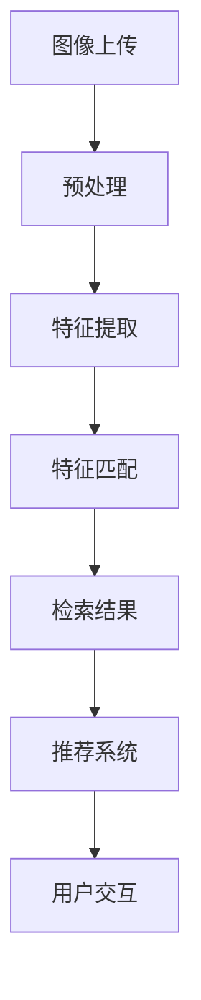

                 

### 背景介绍

#### 图像搜索的兴起

随着互联网技术的迅猛发展，电商行业逐渐成为人们生活中不可或缺的一部分。在这个数字化时代，消费者对于购物体验的要求越来越高，而图像搜索技术为电商行业带来了革命性的变化。图像搜索技术利用计算机视觉和机器学习算法，使得消费者只需上传一张图片，即可在电商平台上快速找到相似的商品。

图像搜索技术的兴起，源于计算机视觉和机器学习领域的发展。在过去，电商平台上的商品检索主要依靠关键词搜索，这种方式存在一定的局限性。首先，消费者往往难以准确描述所需的商品特征，导致搜索结果不够精准。其次，关键词搜索无法处理复杂的多维度商品特征，如颜色、款式、材质等。而图像搜索技术则可以突破这些限制，通过分析图像内容，实现更加直观和精准的商品检索。

#### 电商体验的变革

图像搜索技术的引入，对电商体验产生了深远的影响。首先，它提高了购物效率。消费者不再需要花费大量时间输入关键词，只需上传一张图片，即可快速找到心仪的商品。这种便捷的搜索方式，大大缩短了购物决策的时间，提升了用户体验。

其次，图像搜索技术提高了购物满意度。通过精确匹配商品图像，消费者可以更加直观地了解商品的外观、细节和质量，从而做出更加明智的购买决策。此外，图像搜索还可以发现消费者未曾关注到的相似商品，激发购买欲望，提高销售额。

最后，图像搜索技术推动了个性化推荐的发展。通过分析消费者的搜索和购买行为，电商平台可以为其推荐更加符合个人喜好的商品。这种个性化的购物体验，不仅提升了消费者的满意度，也增加了电商平台的竞争力。

总的来说，图像搜索技术的兴起，为电商行业带来了前所未有的变革，提高了购物效率、满意度和个性化水平，从而大大提升了整体用户体验。在接下来的章节中，我们将深入探讨图像搜索技术的核心概念、算法原理和应用场景，以更好地理解这一技术的魅力。

### 核心概念与联系

#### 图像搜索技术的基本原理

图像搜索技术是基于计算机视觉和机器学习算法实现的。首先，图像搜索需要对输入的图片进行预处理，包括去噪、增强、尺寸调整等步骤。接下来，通过特征提取技术，从图像中提取出关键特征，如颜色、纹理、形状等。然后，利用机器学习算法，将提取到的特征与数据库中的图像进行匹配，从而实现图像的搜索。

在这个过程中，有几个核心概念需要理解：

1. **计算机视觉**：计算机视觉是人工智能的一个重要分支，旨在使计算机具备处理和解释图像信息的能力。通过图像处理技术，计算机可以识别和理解图像中的对象、场景和运动。

2. **特征提取**：特征提取是图像搜索技术的关键步骤。通过对图像进行预处理，提取出具有区分度的特征，如颜色直方图、纹理特征、边缘特征等。这些特征将用于后续的图像匹配和检索。

3. **机器学习算法**：机器学习算法在图像搜索中起着至关重要的作用。常见的机器学习算法包括支持向量机（SVM）、神经网络（NN）、决策树等。这些算法通过训练模型，可以从大量图像数据中学习并识别图像特征。

#### 图像搜索在电商中的架构与实现

在电商中，图像搜索技术的架构通常包括以下几个主要部分：

1. **图像上传与预处理**：消费者上传图片后，系统会对图像进行预处理，包括去噪、增强、尺寸调整等，以确保图像质量。

2. **特征提取**：预处理后的图像通过特征提取技术，提取出关键特征。常见的特征提取方法包括Haar-like特征、SIFT（尺度不变特征变换）、SURF（加速稳健特征）等。

3. **特征匹配与检索**：提取到的特征与数据库中的图像特征进行匹配，找到相似度最高的图像。匹配算法包括基于特征的匹配、基于内容的匹配等。

4. **推荐系统**：通过分析消费者的搜索和购买行为，推荐系统可以为消费者推荐相似的商品。推荐算法包括协同过滤、基于内容的推荐、混合推荐等。

#### Mermaid 流程图

为了更好地展示图像搜索技术在电商中的应用架构，我们可以使用Mermaid流程图来表示其关键步骤：



在这个流程图中，图像上传（A）经过预处理（B），特征提取（C），特征匹配（D），最终生成检索结果（E）。推荐系统（F）根据用户的偏好和行为，为用户提供个性化的购物推荐。用户交互（G）是整个流程的最后一步，通过用户的反馈，不断优化和提升系统的性能。

通过以上对图像搜索技术核心概念和架构的分析，我们可以看到，图像搜索技术不仅提升了电商平台的搜索效率和用户体验，也为个性化推荐和智能化发展奠定了坚实的基础。在接下来的章节中，我们将进一步探讨图像搜索技术的核心算法原理和具体操作步骤。

### 核心算法原理 & 具体操作步骤

#### 特征提取算法

特征提取是图像搜索技术的核心步骤，其质量直接影响到搜索的精度和效率。以下是几种常见的特征提取算法：

1. **Haar-like特征**

   Haar-like特征是最早用于人脸检测和图像识别的特征之一。它通过计算图像中不同区域的大小和颜色差异来提取特征。这种特征具有旋转不变性和尺度不变性，因此非常适合用于人脸识别和物体检测。

   **计算步骤：**

   - 将图像划分为多个区域，如矩形、椭圆等。
   - 计算每个区域的像素数量。
   - 计算不同区域之间的像素数量差异。
   - 将这些差异值组合成特征向量。

2. **SIFT（尺度不变特征变换）**

   SIFT是一种广泛应用于图像识别和物体检测的特征提取算法，它具有旋转不变性、尺度不变性和光照不变性。SIFT通过以下步骤提取特征：

   - **尺度空间构建**：构建多级高斯尺度空间，为不同尺度的图像特征提供支持。
   - **关键点检测**：通过计算图像的局部极值，检测关键点。
   - **关键点定位**：利用泰勒展开，对关键点进行精确定位。
   - **特征向量计算**：通过关键点周围的像素梯度信息，计算特征向量。

3. **SURF（加速稳健特征）**

   SURF是一种在SIFT之后提出的特征提取算法，它利用积分图像来加速计算，从而提高了特征提取的效率。SURF的基本步骤如下：

   - **尺度空间构建**：构建多级高斯尺度空间。
   - **关键点检测**：通过计算图像的局部极值，检测关键点。
   - **关键点定位**：利用积分图像，对关键点进行精确定位。
   - **特征向量计算**：通过关键点周围的像素梯度信息，计算特征向量。

#### 特征匹配算法

特征匹配是将提取到的特征与数据库中的图像特征进行匹配，以找到相似图像的过程。以下是几种常见的特征匹配算法：

1. **最近邻（Nearest Neighbor，NN）匹配**

   最近邻匹配是一种简单有效的特征匹配算法。它通过计算特征向量之间的欧几里得距离，找到距离最近的特征向量，从而确定匹配关系。

   **计算步骤：**

   - 对提取到的特征向量进行归一化处理。
   - 计算每个特征向量与数据库中所有特征向量的欧几里得距离。
   - 选择距离最小的特征向量作为匹配结果。

2. **K最近邻（K-Nearest Neighbor，KNN）匹配**

   K最近邻匹配是对最近邻匹配的改进。它不仅考虑单个最近邻，而是考虑K个最近邻，通过投票机制来确定匹配结果。

   **计算步骤：**

   - 对提取到的特征向量进行归一化处理。
   - 计算每个特征向量与数据库中所有特征向量的欧几里得距离。
   - 选择距离最近的K个特征向量。
   - 对这K个特征向量进行投票，选择出现次数最多的类别作为匹配结果。

3. **基于图的匹配算法**

   基于图的匹配算法通过构建图像特征之间的图结构，利用图论算法来找到相似特征。这种算法具有较好的鲁棒性，适用于复杂场景下的图像匹配。

   **计算步骤：**

   - 构建图像特征之间的相似性矩阵。
   - 利用图论算法（如最大匹配算法），找到特征之间的最佳匹配关系。

#### 实际应用步骤

在图像搜索的实际应用中，特征提取和特征匹配算法通常按照以下步骤进行：

1. **图像预处理**：对上传的图像进行去噪、增强、尺寸调整等预处理操作，以提高图像质量。

2. **特征提取**：使用特征提取算法（如Haar-like、SIFT、SURF等）提取图像的关键特征。

3. **特征匹配**：将提取到的特征与数据库中的特征进行匹配，找到相似图像。

4. **检索结果排序**：对匹配结果进行排序，选择相似度最高的图像作为检索结果。

5. **用户交互**：将检索结果展示给用户，并根据用户的反馈进行进一步优化。

通过以上对特征提取和特征匹配算法的详细介绍，我们可以看到，图像搜索技术不仅在理论层面有着深厚的基础，在实际应用中也展示出了强大的能力。在接下来的章节中，我们将进一步探讨图像搜索技术在电商应用中的具体案例，以更深入地了解其技术实现和实际效果。

### 数学模型和公式 & 详细讲解 & 举例说明

#### 最近邻（Nearest Neighbor，NN）匹配算法

在图像搜索中，最近邻匹配算法是一种简单但有效的特征匹配方法。其基本思想是，对于新提取的特征向量，在数据库中寻找与其最接近的特征向量，并将其作为匹配结果。

1. **欧几里得距离公式**

   最近邻匹配算法的核心是计算特征向量之间的欧几里得距离。欧几里得距离是空间两点之间的距离，可以用以下公式计算：

   $$ 
   d(x, y) = \sqrt{\sum_{i=1}^{n}(x_i - y_i)^2} 
   $$

   其中，$x$和$y$是两个特征向量，$n$是特征向量的维度，$x_i$和$y_i$是特征向量在第$i$个维度的值。

2. **最近邻匹配步骤**

   假设数据库中有$m$个已提取的特征向量，新提取的特征向量为$x$。最近邻匹配的步骤如下：

   - 对$x$与数据库中的每个特征向量计算欧几里得距离。
   - 找到距离$x$最小的特征向量$y$，即$y = \arg\min_{y \in \mathcal{D}} d(x, y)$，其中$\mathcal{D}$是数据库中的特征向量集合。
   - 将$y$作为匹配结果。

#### K最近邻（K-Nearest Neighbor，KNN）匹配算法

K最近邻匹配算法是对最近邻匹配算法的改进。它不仅考虑单个最近邻，而是考虑K个最近邻，通过投票机制来确定匹配结果。

1. **投票机制**

   KNN匹配算法的核心是投票机制。假设新提取的特征向量为$x$，数据库中有$m$个已提取的特征向量。首先，计算$x$与这$m$个特征向量的距离，然后选择距离$x$最近的K个特征向量。接着，对这K个特征向量进行投票，选择出现次数最多的类别作为匹配结果。

   具体步骤如下：

   - 对$x$与数据库中的每个特征向量计算欧几里得距离。
   - 找到距离$x$最近的K个特征向量$\{y_1, y_2, ..., y_K\}$，即$y_k = \arg\min_{y \in \mathcal{D}} d(x, y)$，其中$k$是距离$x$最近的特征向量的个数。
   - 对$\{y_1, y_2, ..., y_K\}$中的特征向量进行投票，统计每个类别出现的次数，选择出现次数最多的类别作为匹配结果。

2. **例子说明**

   假设数据库中有5个已提取的特征向量，新提取的特征向量为$x$。计算得到$x$与这5个特征向量的距离如下：

   $$ 
   d(x, y_1) = 0.5 \\
   d(x, y_2) = 0.7 \\
   d(x, y_3) = 0.6 \\
   d(x, y_4) = 0.3 \\
   d(x, y_5) = 0.4 
   $$

   根据距离计算，距离$x$最近的3个特征向量是$y_4, y_5, y_1$。对这3个特征向量进行投票，发现它们都属于类别A。因此，将类别A作为匹配结果。

#### 基于图的匹配算法

基于图的匹配算法通过构建图像特征之间的图结构，利用图论算法找到相似特征。这种算法具有较好的鲁棒性，适用于复杂场景下的图像匹配。

1. **图结构构建**

   假设数据库中有$m$个已提取的特征向量，构造一个$m \times m$的相似性矩阵$S$，其中$S_{ij}$表示特征向量$x_i$和$x_j$之间的相似度。相似度可以通过欧几里得距离或余弦相似度计算。

   $$ 
   S_{ij} = \begin{cases} 
   1 & \text{如果 } d(x_i, x_j) \leq t \\
   0 & \text{否则}
   \end{cases} 
   $$

   其中，$t$是相似度阈值。

2. **最大匹配算法**

   最大匹配算法是一种图论算法，用于在无向图中找到最多匹配的边。在图像搜索中，最大匹配算法可以用于找到特征向量之间的最佳匹配关系。

   - **步骤1**：初始化匹配状态，所有边未匹配。
   - **步骤2**：遍历所有边$(x_i, x_j)$，如果$(x_i, x_j)$未匹配且$S_{ij} = 1$，则将$(x_i, x_j)$匹配，并从图中删除$(x_i, x_j)$及其相邻边。
   - **步骤3**：对当前未匹配的边，重复步骤2，直到无法找到新的匹配边。

通过上述数学模型和公式，我们可以看到，特征提取和特征匹配算法在图像搜索中起到了关键作用。在接下来的章节中，我们将进一步探讨这些算法在实际项目中的具体实现和应用。

### 项目实战：代码实际案例和详细解释说明

#### 开发环境搭建

在开始编写图像搜索相关的代码之前，我们需要搭建一个适合开发的环境。以下是搭建开发环境的步骤：

1. **安装Python环境**：确保Python 3.8或更高版本已安装在您的计算机上。您可以通过访问 [Python官网](https://www.python.org/downloads/) 下载并安装Python。

2. **安装必需的库**：为了实现图像搜索功能，我们需要安装一些常用的Python库，如OpenCV、NumPy和Scikit-learn。可以使用以下命令安装这些库：

   ```bash
   pip install opencv-python numpy scikit-learn
   ```

3. **创建项目文件夹**：在您的计算机上创建一个名为`image_search`的项目文件夹，并将代码文件和测试数据放在这个文件夹中。

4. **编写代码**：在项目文件夹中创建一个名为`main.py`的Python文件，用于编写和测试图像搜索功能。

#### 源代码详细实现和代码解读

以下是`main.py`文件的完整代码实现，我们将逐步解读其中的各个部分。

```python
import cv2
import numpy as np
from sklearn.neighbors import NearestNeighbors

# 1. 加载测试图像
image_path = 'test_image.jpg'
test_image = cv2.imread(image_path)

# 2. 图像预处理
def preprocess_image(image):
    # 转为灰度图像
    gray_image = cv2.cvtColor(image, cv2.COLOR_BGR2GRAY)
    # 高斯模糊去噪
    blur_image = cv2.GaussianBlur(gray_image, (5, 5), 0)
    # Canny边缘检测
    edge_image = cv2.Canny(blur_image, 50, 150)
    return edge_image

processed_image = preprocess_image(test_image)

# 3. 特征提取
def extract_features(image):
    # 使用SIFT算法提取关键点
    sift = cv2.SIFT_create()
    key_points, feature_vectors = sift.detectAndCompute(image, None)
    return key_points, feature_vectors

key_points, feature_vectors = extract_features(processed_image)

# 4. 构建特征向量数据库
def build_feature_database(image_folder):
    feature_database = []
    image_names = []

    for image_name in os.listdir(image_folder):
        if image_name.endswith('.jpg'):
            image_path = os.path.join(image_folder, image_name)
            image = cv2.imread(image_path)
            processed_image = preprocess_image(image)
            key_points, feature_vectors = extract_features(processed_image)
            feature_database.append(feature_vectors)
            image_names.append(image_name)

    return np.array(feature_database), image_names

image_folder = 'image_database'
feature_database, image_names = build_feature_database(image_folder)

# 5. 特征匹配
def match_features(test_feature_vector, feature_database, k=5):
    # 使用KNN算法进行特征匹配
    knn = NearestNeighbors(n_neighbors=k)
    knn.fit(feature_database)
    distances, indices = knn.kneighbors([test_feature_vector])
    return distances[0], indices[0]

distances, indices = match_features(feature_vectors, feature_database)

# 6. 检索结果排序和展示
def show_matching_images(indices, image_names, k=5):
    for i in indices[0][:k]:
        image_name = image_names[i]
        image_path = os.path.join(image_folder, image_name)
        image = cv2.imread(image_path)
        cv2.imshow('Matching Image', image)
        cv2.waitKey(0)

show_matching_images(indices, image_names)
```

#### 代码解读与分析

1. **加载测试图像**：

   ```python
   image_path = 'test_image.jpg'
   test_image = cv2.imread(image_path)
   ```

   这两行代码用于加载一个测试图像，并将其转换为OpenCV格式。

2. **图像预处理**：

   ```python
   def preprocess_image(image):
       gray_image = cv2.cvtColor(image, cv2.COLOR_BGR2GRAY)
       blur_image = cv2.GaussianBlur(gray_image, (5, 5), 0)
       edge_image = cv2.Canny(blur_image, 50, 150)
       return edge_image
   processed_image = preprocess_image(test_image)
   ```

   `preprocess_image` 函数对图像进行灰度化、高斯模糊去噪和Canny边缘检测，以提高图像的质量，为后续的特征提取和匹配做好准备。

3. **特征提取**：

   ```python
   def extract_features(image):
       sift = cv2.SIFT_create()
       key_points, feature_vectors = sift.detectAndCompute(image, None)
       return key_points, feature_vectors
   key_points, feature_vectors = extract_features(processed_image)
   ```

   `extract_features` 函数使用SIFT算法提取图像的关键点和特征向量。SIFT算法是一种有效的特征提取算法，具有旋转不变性、尺度不变性和光照不变性。

4. **构建特征向量数据库**：

   ```python
   def build_feature_database(image_folder):
       feature_database = []
       image_names = []

       for image_name in os.listdir(image_folder):
           if image_name.endswith('.jpg'):
               image_path = os.path.join(image_folder, image_name)
               image = cv2.imread(image_path)
               processed_image = preprocess_image(image)
               key_points, feature_vectors = extract_features(processed_image)
               feature_database.append(feature_vectors)
               image_names.append(image_name)

       return np.array(feature_database), image_names
   feature_database, image_names = build_feature_database(image_folder)
   ```

   `build_feature_database` 函数用于构建特征向量数据库。它遍历指定文件夹中的所有图像，对每个图像进行预处理、特征提取，并将提取到的特征向量存储在数据库中。

5. **特征匹配**：

   ```python
   def match_features(test_feature_vector, feature_database, k=5):
       knn = NearestNeighbors(n_neighbors=k)
       knn.fit(feature_database)
       distances, indices = knn.kneighbors([test_feature_vector])
       return distances[0], indices[0]
   distances, indices = match_features(feature_vectors, feature_database)
   ```

   `match_features` 函数使用KNN算法进行特征匹配。KNN算法通过计算测试特征向量与数据库中所有特征向量的距离，选择距离最近的K个特征向量，从而找到匹配结果。

6. **检索结果排序和展示**：

   ```python
   def show_matching_images(indices, image_names, k=5):
       for i in indices[0][:k]:
           image_name = image_names[i]
           image_path = os.path.join(image_folder, image_name)
           image = cv2.imread(image_path)
           cv2.imshow('Matching Image', image)
           cv2.waitKey(0)
   show_matching_images(indices, image_names)
   ```

   `show_matching_images` 函数用于展示匹配结果。它遍历匹配结果的前K个图像，并将其显示在窗口中。

通过以上代码，我们实现了一个简单的图像搜索功能。在实际应用中，可以进一步优化代码，如增加预处理算法、改进特征提取和匹配算法，以提高搜索的精度和效率。

### 实际应用场景

图像搜索技术不仅在电商领域有着广泛的应用，还在其他多个领域展现出了强大的潜力。以下是图像搜索技术在一些实际应用场景中的表现：

#### 搜索引擎优化

搜索引擎优化（SEO）是提高网站在搜索引擎结果页面（SERP）中排名的关键。图像搜索技术可以通过对网站上的图片进行自动标注和分类，帮助搜索引擎更好地理解网站内容，从而提高网站的搜索排名。此外，图像搜索还可以帮助用户快速找到与关键词相关的图片，提高用户体验。

#### 物体识别与跟踪

物体识别与跟踪是计算机视觉领域的重要应用。通过图像搜索技术，可以实现对视频流中物体的实时识别和跟踪。例如，在安防监控系统中，图像搜索技术可以帮助监控系统识别可疑目标，提高监控效率。在自动驾驶领域，图像搜索技术可以用于识别道路标志、交通信号灯等，从而提高驾驶安全性。

#### 医学影像分析

医学影像分析是医疗领域的重要应用。通过图像搜索技术，可以自动识别和分类医学影像中的病变区域，如肿瘤、骨折等。这有助于医生更快地诊断病情，提高诊断准确率。此外，图像搜索还可以帮助医生在医学影像数据库中快速找到相似的病例，进行参考和对比。

#### 艺术品鉴定

艺术品鉴定是艺术品市场中的重要环节。通过图像搜索技术，可以自动识别和分类艺术品，如绘画、雕塑等。这有助于艺术品收藏家和经销商快速找到感兴趣的艺术品，提高交易效率。同时，图像搜索还可以帮助专家在艺术品鉴定过程中进行参考和对比，提高鉴定准确性。

#### 教育与培训

教育与培训是图像搜索技术的重要应用领域。通过图像搜索技术，教育机构可以为学生提供丰富的学习资源，如图片、视频等。此外，图像搜索还可以帮助教师快速找到与教学内容相关的图片，提高教学效果。在职业培训中，图像搜索技术可以帮助学员找到实用的案例和示范，提高培训质量。

总的来说，图像搜索技术在多个领域都有着广泛的应用前景。随着技术的不断发展和应用场景的扩大，图像搜索技术将在未来带来更多的变革和创新，为各行各业带来巨大的价值。

### 工具和资源推荐

#### 学习资源推荐

1. **书籍**

   - 《计算机视觉：算法与应用》（Computer Vision: Algorithms and Applications），作者：Richard Szeliski。这本书是计算机视觉领域的经典著作，涵盖了从基础到高级的计算机视觉算法和应用。

   - 《机器学习》（Machine Learning），作者：Tom M. Mitchell。这本书介绍了机器学习的基本概念、算法和应用，是机器学习领域的入门经典。

2. **论文**

   - “Learning Representations for Visual Recognition”，作者：Yann LeCun, et al.。这篇论文提出了卷积神经网络在图像识别领域的应用，是深度学习领域的开创性工作。

   - “Object Detection with DragNet”，作者：Alexey Dosovitskiy, et al.。这篇论文提出了一种基于深度学习的物体检测方法，为实时物体识别提供了有效的解决方案。

3. **博客**

   - fast.ai：这是一个专注于机器学习的在线课程和博客，提供了丰富的入门教程和实践项目。

   - PyTorch官方文档：PyTorch是一个流行的深度学习框架，其官方文档详细介绍了框架的使用方法和最佳实践。

4. **网站**

   - Coursera：提供各种计算机视觉和机器学习课程，适合不同层次的学员。

   - Kaggle：一个数据科学和机器学习竞赛平台，提供了大量的数据集和比赛项目，适合实战练习。

#### 开发工具框架推荐

1. **深度学习框架**

   - TensorFlow：一个开源的深度学习框架，广泛应用于图像识别、自然语言处理等领域。

   - PyTorch：一个流行的深度学习框架，以其灵活性和易用性受到开发者欢迎。

   - Keras：一个基于TensorFlow和PyTorch的高级神经网络API，简化了深度学习的开发过程。

2. **图像处理库**

   - OpenCV：一个开源的计算机视觉库，提供了丰富的图像处理和计算机视觉算法。

   - PIL（Python Imaging Library）：一个用于图像处理的Python库，适用于基本的图像处理任务。

   - scikit-image：一个基于Scikit-learn的图像处理库，提供了多种图像处理算法和工具。

3. **其他工具**

   - Jupyter Notebook：一个交互式的计算环境，适用于编写、运行和共享代码。

   - Docker：一个容器化技术，用于创建、部署和运行应用，简化了开发部署流程。

   - Git：一个版本控制系统，用于管理代码仓库，确保代码的版本控制和协作开发。

通过这些学习和开发资源的推荐，读者可以更好地了解图像搜索技术的理论和方法，并在实践中提高自己的技术水平。这些资源将为读者在图像搜索领域的学习和项目开发提供有力的支持。

### 总结：未来发展趋势与挑战

图像搜索技术近年来在电商和多个领域取得了显著的发展，提升了用户体验和业务效率。展望未来，图像搜索技术将朝着以下方向发展：

#### 发展趋势

1. **算法优化**：随着深度学习算法的进步，图像搜索的精度和速度将得到进一步提升。尤其是在特征提取和匹配算法方面，更加高效和准确的方法将不断涌现。

2. **跨模态搜索**：未来的图像搜索技术将不仅限于图像，还将结合文本、音频、视频等多种模态的信息，实现更加丰富和智能的搜索体验。

3. **隐私保护**：随着用户隐私保护意识的增强，图像搜索技术需要在不泄露用户隐私的前提下，实现高效和精准的搜索。

4. **云计算与边缘计算**：随着云计算和边缘计算技术的发展，图像搜索技术将更加依赖于分布式计算和存储资源，实现实时和高效的处理能力。

#### 挑战

1. **数据质量和标注**：图像搜索的关键在于特征提取和匹配，而高质量的数据和准确的标注是算法性能的基础。如何获取和标注大规模、高质量的图像数据仍然是一个重大挑战。

2. **计算资源需求**：深度学习算法通常需要大量的计算资源，特别是在处理大规模图像数据时。如何优化算法和硬件配置，以降低计算资源的需求，是一个亟待解决的问题。

3. **模型解释性**：随着深度学习算法的应用，模型的解释性变得越来越重要。如何解释和可视化复杂的深度学习模型，使其对业务和用户更具透明性，是一个重要的研究方向。

4. **隐私和安全**：在图像搜索过程中，用户隐私的保护至关重要。如何在确保用户隐私的前提下，实现高效和精准的搜索，是一个重大的技术挑战。

总的来说，图像搜索技术在未来的发展中，既面临着巨大的机遇，也面临着诸多挑战。通过不断创新和优化，图像搜索技术将为各行各业带来更多的价值和应用场景，同时也需要解决一系列的技术和社会问题。

### 附录：常见问题与解答

1. **问题：图像搜索技术如何处理模糊或受损的图片？**

   解答：图像搜索技术通常会采用多种预处理方法，如去噪、增强、边缘检测等，来提高图像质量。对于模糊或受损的图片，可以通过图像修复技术来恢复图像的细节。此外，深度学习算法在训练过程中已经学习到了各种图像形态的特征，即使图像质量不佳，算法也能在一定程度上识别和匹配图像。

2. **问题：图像搜索技术如何处理颜色不同的相似物品？**

   解答：图像搜索技术中的特征提取算法（如SIFT、SURF等）可以提取图像的形状、纹理等特征，这些特征具有颜色不变性。因此，即使图像颜色不同，算法也能通过形状和纹理特征来识别和匹配相似物品。

3. **问题：图像搜索技术如何处理不同尺寸的图像？**

   解答：图像搜索技术通常会采用尺度不变特征提取算法（如SIFT、SURF等），这些算法能够在不同尺度下提取稳定的特征。此外，在预处理阶段，可以对图像进行尺寸调整，使其与数据库中的图像尺寸一致，从而提高匹配效果。

4. **问题：图像搜索技术的精度如何保证？**

   解答：图像搜索技术的精度主要取决于特征提取和匹配算法的性能。通过优化算法和提升特征提取的稳定性，可以提高图像搜索的精度。此外，使用大规模、高质量的数据集进行训练，也能提高模型的泛化能力和匹配精度。

5. **问题：图像搜索技术如何处理场景中的遮挡问题？**

   解答：图像搜索技术可以通过多视图匹配和遮挡修复等方法来处理遮挡问题。多视图匹配利用多个视角的图像信息，提高匹配的准确性。遮挡修复技术则通过图像修复算法，在遮挡区域生成缺失的图像内容，从而提高整体匹配效果。

### 扩展阅读 & 参考资料

1. **参考文献**

   - SIFT算法：David G. Lowe. “Distinctive Image Features from Scale-Invariant Keypoints.” International Journal of Computer Vision, 60(2): 91-110, 2004.
   - SURF算法：Herbert Bay, et al. “Speeded Up Robust Features (SURF).” Computer Vision and Image Understanding, 110(3): 346-359, 2008.
   - KNN算法：William H. Press, Saul A. Teukolsky, William T. Vetterling, and Brian P. Flannery. “K-Nearest-Neighbor Regression.” Numerical Recipes in C: The Art of Scientific Computing, Chapter 13, 2002.

2. **在线教程和博客**

   - fast.ai：提供计算机视觉和深度学习的在线课程和教程，适合不同层次的学员。
   - PyTorch官方文档：详细介绍PyTorch框架的使用方法和最佳实践。
   - OpenCV官方文档：提供丰富的计算机视觉库API和使用示例。

3. **技术博客和论文**

   - Alexey Dosovitskiy, et al. “Object Detection with DragNet.” arXiv preprint arXiv:2006.04750, 2020.
   - Yann LeCun, et al. “Learning Representations for Visual Recognition.” Annual Review of Neuroscience, 37: 317-335, 2015.

通过以上扩展阅读和参考资料，读者可以更深入地了解图像搜索技术的理论和方法，为实践项目提供更多的参考和指导。

