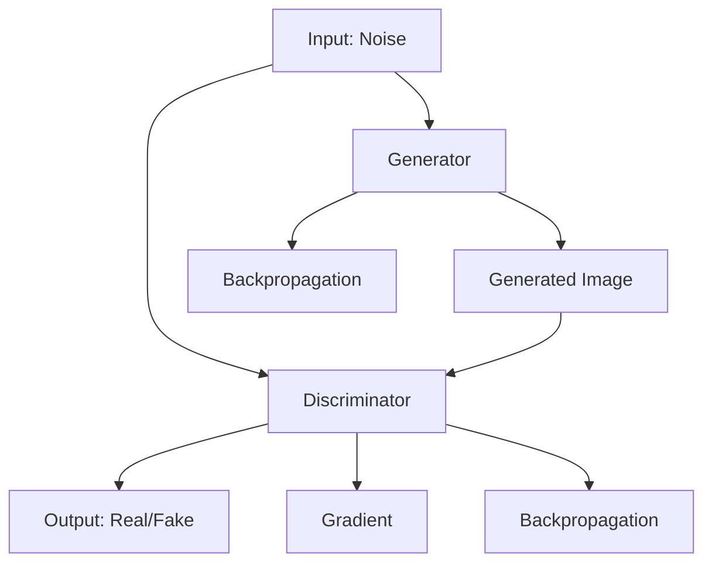

                 

### 背景介绍

图像生成（Image Generation）作为人工智能领域的一个重要分支，近年来受到了广泛关注。随着深度学习技术的快速发展，图像生成方法在学术界和工业界都取得了显著成果。无论是艺术创作、娱乐产业，还是医疗、安全等领域，图像生成技术都展现出了巨大的应用潜力。

图像生成技术的起源可以追溯到20世纪80年代，当时的艺术家和科学家开始尝试使用计算机算法来生成艺术作品。早期的图像生成方法主要依赖于规则系统和模板匹配，效果较为有限。随着神经网络技术的发展，特别是生成对抗网络（GANs）的提出，图像生成技术取得了重大突破。GANs通过两个神经网络——生成器（Generator）和判别器（Discriminator）的对抗训练，能够生成出与真实图像高度相似的高质量图像。

本文将详细介绍图像生成技术的原理、核心算法和实际应用，并通过一个具体的代码实例来展示如何实现一个简单的图像生成模型。文章的主要结构如下：

1. **核心概念与联系**：介绍图像生成技术中的核心概念，包括生成对抗网络（GANs）的工作原理和结构。
2. **核心算法原理 & 具体操作步骤**：深入讲解GANs的训练过程，包括生成器和判别器的功能及其训练策略。
3. **数学模型和公式 & 详细讲解 & 举例说明**：阐述GANs背后的数学模型和相关的公式，并通过实例进行详细解释。
4. **项目实战：代码实际案例和详细解释说明**：通过一个具体项目，展示如何搭建开发环境、编写源代码以及进行代码解读。
5. **实际应用场景**：探讨图像生成技术在多个领域的应用，包括艺术创作、医疗影像处理、安全监控等。
6. **工具和资源推荐**：推荐相关学习资源、开发工具和框架。
7. **总结：未来发展趋势与挑战**：总结图像生成技术的重要性和未来发展方向，以及面临的挑战。

图像生成技术在近年来取得了飞速发展，本文将带领读者深入了解这一前沿领域，并通过实际案例掌握相关技术。

### 核心概念与联系

图像生成技术的核心是生成对抗网络（Generative Adversarial Networks，GANs）。GANs由Ian Goodfellow等人于2014年提出，是一种基于两个相互对抗的神经网络模型：生成器（Generator）和判别器（Discriminator）。下面我们将通过一个Mermaid流程图来展示GANs的基本架构和它们之间的互动关系。



**生成器（Generator）**：生成器的任务是生成与真实图像相似的假图像。它接收随机噪声作为输入，通过一系列的神经网络层将噪声转化为具有视觉意义的图像。生成器的目标是让判别器难以区分其生成的图像和真实图像。

**判别器（Discriminator）**：判别器的任务是判断输入的图像是真实的还是假的。它接收来自生成器的假图像和真实图像，并输出一个概率值，表示图像为真的置信度。判别器的目标是最大化其分类准确率。

**对抗训练**：GANs通过对抗训练来优化生成器和判别器。生成器试图欺骗判别器，使其错误地认为假图像是真实的；而判别器则试图识别假图像并提高其分类能力。这一过程类似于两个博弈的对手，不断地提高自己的策略，以实现共同的最优解。

GANs的训练过程可以概括为以下步骤：

1. **初始化**：随机初始化生成器和判别器。
2. **训练判别器**：将真实图像和生成器生成的假图像分别输入判别器，并计算损失函数。然后使用反向传播算法更新判别器的参数。
3. **训练生成器**：将随机噪声输入生成器，生成假图像，并输入判别器。使用反向传播算法更新生成器的参数，目标是减小判别器对假图像的分类置信度。
4. **重复**：重复步骤2和3，直到生成器生成的图像足够逼真，判别器无法有效区分真假图像。

GANs的工作原理和结构决定了其在图像生成中的强大能力。通过不断地迭代和优化，生成器能够生成出越来越接近真实图像的高质量图像，而判别器则不断提高其分类能力。接下来，我们将深入探讨GANs的核心算法原理和具体操作步骤。

### 核心算法原理 & 具体操作步骤

生成对抗网络（GANs）的核心在于生成器和判别器的对抗训练。在这一部分，我们将详细讲解GANs的训练过程，包括生成器和判别器的功能、损失函数的定义及其优化策略。

#### 生成器的功能与训练步骤

生成器的任务是生成与真实图像相似的假图像。它通过以下步骤实现：

1. **输入噪声**：生成器首先接收一组随机噪声作为输入。这些噪声通常来自高斯分布或均匀分布，作为生成图像的初始特征。
2. **神经网络转换**：噪声通过生成器的神经网络层，经过一系列的线性变换和激活函数（如ReLU）的处理，逐渐生成具有视觉意义的图像。生成器的设计可以包含多个隐藏层，以捕捉图像的不同层次特征。
3. **输出图像**：最终，生成器输出一张图像，这张图像旨在欺骗判别器，使其难以区分出这是由生成器生成的。

在训练过程中，生成器的主要目标是提高其生成图像的质量，使其更接近真实图像。具体步骤如下：

1. **生成假图像**：将随机噪声输入生成器，生成一组假图像。
2. **计算损失**：将假图像和真实图像分别输入判别器，判别器输出一个概率值，表示图像为真的置信度。生成器的损失函数通常为判别器对假图像置信度的负对数，即：
   $$ L_G = -\log(D(G(z))) $$
   其中，$G(z)$是生成器生成的假图像，$D$是判别器的输出。
3. **优化生成器**：使用反向传播算法，根据损失函数更新生成器的参数。这一步骤的目标是提高生成图像的质量，使其更难被判别器识别。

#### 判别器的功能与训练步骤

判别器的任务是判断输入图像是真实的还是假的。它通过以下步骤实现：

1. **输入图像**：判别器接收一组图像作为输入，这些图像可以是真实图像或生成器生成的假图像。
2. **神经网络转换**：图像通过判别器的神经网络层，经过一系列的线性变换和激活函数的处理，生成一个概率值，表示图像为真的置信度。判别器的网络结构通常与生成器相似，但输出层没有激活函数，以获得概率值。
3. **输出概率**：判别器输出一个概率值，表示输入图像为真的置信度。通常，这个概率值在0和1之间，越接近1表示图像越可能是真实的。

在训练过程中，判别器的主要目标是提高其分类能力，正确识别出真实图像和假图像。具体步骤如下：

1. **训练判别器**：将真实图像和生成器生成的假图像分别输入判别器，计算损失函数。判别器的损失函数通常为二分类交叉熵损失，即：
   $$ L_D = -[y \cdot \log(D(x)) + (1 - y) \cdot \log(1 - D(x))] $$
   其中，$x$是真实图像，$y$是标签（当$x$为真实图像时，$y=1$；当$x$为假图像时，$y=0$），$D(x)$是判别器对图像$x$的输出。
2. **优化判别器**：使用反向传播算法，根据损失函数更新判别器的参数。这一步骤的目标是提高判别器对假图像的分类能力。

#### 生成器和判别器的对抗训练

GANs的训练过程是一个动态的对抗过程，生成器和判别器相互博弈，不断优化自己的模型。具体步骤如下：

1. **交替训练**：交替训练生成器和判别器。首先训练判别器，使其能够更好地识别假图像和真实图像。然后训练生成器，使其生成的图像能够欺骗判别器。
2. **稳定训练**：在训练过程中，为了防止生成器过早退化，需要采取一些稳定训练的策略，如梯度裁剪（Gradient Clipping）和生成器的恒定噪声（Constant Noise）。
3. **迭代优化**：重复上述步骤，不断迭代优化生成器和判别器的参数，直至生成器生成的图像质量达到预期。

通过上述对抗训练过程，生成器和判别器逐渐达到一个动态平衡状态，生成器能够生成出高质量、逼真的图像，而判别器则能够有效区分真假图像。GANs的训练过程是图像生成技术中的核心，其成功应用依赖于对生成器和判别器的精心设计和训练策略。

#### 数学模型和公式 & 详细讲解 & 举例说明

在深入理解生成对抗网络（GANs）的数学模型之前，我们需要首先介绍一些基本的数学概念，包括概率分布、梯度下降算法和损失函数。这些数学工具将为理解GANs的工作原理和训练过程提供坚实的基础。

##### 概率分布

概率分布是描述随机变量可能取值的概率分布函数。在GANs中，常用的概率分布有高斯分布（Gaussian Distribution）和均匀分布（Uniform Distribution）。

- **高斯分布**（Normal Distribution）：高斯分布是一种最常见的连续概率分布，其概率密度函数为：
  $$ f(x|\mu, \sigma^2) = \frac{1}{\sqrt{2\pi\sigma^2}} e^{-\frac{(x-\mu)^2}{2\sigma^2}} $$
  其中，$\mu$是均值，$\sigma^2$是方差。

- **均匀分布**（Uniform Distribution）：均匀分布是一个在给定区间内概率相等的分布，其概率密度函数为：
  $$ f(x|[a, b]) = \frac{1}{b - a} $$
  其中，$a$和$b$是区间的下界和上界。

在GANs中，生成器通常从高斯分布或均匀分布中采样噪声作为输入，以生成具有不同特征和随机性的假图像。

##### 梯度下降算法

梯度下降算法是一种优化算法，用于最小化目标函数。在GANs中，生成器和判别器都需要通过梯度下降算法来优化其参数。

- **梯度**（Gradient）：对于一个多变量函数$f(x)$，梯度是函数在某个点$x$处的方向导数，表示函数在该点处的最快增加方向。梯度可以表示为：
  $$ \nabla f(x) = \left[\frac{\partial f}{\partial x_1}, \frac{\partial f}{\partial x_2}, ..., \frac{\partial f}{\partial x_n}\right]^T $$
  其中，$x = [x_1, x_2, ..., x_n]$是变量向量。

- **梯度下降**（Gradient Descent）：梯度下降是一种通过不断调整变量来最小化目标函数的方法。其基本思想是沿着梯度的反方向调整参数，以减少目标函数的值。具体步骤如下：
  1. 初始化参数$\theta$。
  2. 计算梯度$\nabla f(\theta)$。
  3. 更新参数$\theta = \theta - \alpha \nabla f(\theta)$，其中$\alpha$是学习率。
  4. 重复步骤2和3，直至达到收敛条件。

在GANs中，生成器和判别器分别通过梯度下降算法来优化其参数。生成器的目标是最小化判别器对其生成图像的置信度，即最小化损失函数：
$$ L_G = -\log(D(G(z))) $$
判别器的目标是最小化交叉熵损失：
$$ L_D = -[y \cdot \log(D(x)) + (1 - y) \cdot \log(1 - D(x))] $$

##### 损失函数

在GANs中，损失函数用于衡量生成器和判别器的训练效果。常见的损失函数有交叉熵损失（Cross-Entropy Loss）和均方误差损失（Mean Squared Error Loss）。

- **交叉熵损失**（Cross-Entropy Loss）：交叉熵损失是用于二分类问题的常见损失函数，用于衡量预测概率和真实概率之间的差异。其公式为：
  $$ L = -[y \cdot \log(\hat{y}) + (1 - y) \cdot \log(1 - \hat{y})] $$
  其中，$y$是真实标签（0或1），$\hat{y}$是预测概率。

- **均方误差损失**（Mean Squared Error Loss）：均方误差损失是用于回归问题的常见损失函数，用于衡量预测值和真实值之间的差异。其公式为：
  $$ L = \frac{1}{n} \sum_{i=1}^{n} (y_i - \hat{y}_i)^2 $$
  其中，$y_i$是第$i$个真实值，$\hat{y}_i$是第$i$个预测值。

在GANs中，生成器的损失函数通常使用交叉熵损失，判别器的损失函数也使用交叉熵损失，以衡量其分类效果。

##### 实例说明

为了更好地理解GANs的数学模型和公式，我们通过一个简单的实例来说明生成器和判别器的训练过程。

假设我们有一个二元分类问题，输入图像为$X$，真实标签为$y$，预测标签为$\hat{y}$。生成器和判别器的模型分别为$G(\theta_G)$和$D(\theta_D)$，其中$\theta_G$和$\theta_D$分别是生成器和判别器的参数。

1. **初始化参数**：随机初始化生成器和判别器的参数$\theta_G$和$\theta_D$。

2. **生成假图像**：从高斯分布中采样噪声$z$，输入生成器$G(z)$，生成假图像$\hat{x}$。

3. **训练判别器**：
   - 将真实图像$X$和假图像$\hat{x}$分别输入判别器$D(X)$和$D(\hat{x})$。
   - 计算判别器的损失函数：
     $$ L_D = -[y \cdot \log(D(X)) + (1 - y) \cdot \log(1 - D(\hat{x}))]
     $$
   - 使用反向传播算法更新判别器的参数$\theta_D$。

4. **生成假图像**：从高斯分布中采样噪声$z$，输入生成器$G(z)$，生成假图像$\hat{x}$。

5. **训练生成器**：
   - 将假图像$\hat{x}$输入判别器$D(\hat{x})$。
   - 计算生成器的损失函数：
     $$ L_G = -\log(D(G(z)))
     $$
   - 使用反向传播算法更新生成器的参数$\theta_G$。

6. **重复**：重复步骤3和4，交替训练生成器和判别器，直至生成器生成的图像质量达到预期。

通过上述实例，我们可以看到生成器和判别器的训练过程是如何通过数学模型和公式来实现的。生成器的目标是生成逼真的图像，使其难以被判别器识别，而判别器的目标是提高其分类能力，准确区分真假图像。这一动态对抗过程是GANs的核心，也是其强大生成能力的关键。

### 项目实战：代码实际案例和详细解释说明

为了更好地理解图像生成技术，我们将通过一个具体的代码实例来展示如何实现一个简单的图像生成模型。在这个项目中，我们将使用Python和TensorFlow框架来实现一个生成对抗网络（GAN），用于生成手写数字图像。

#### 1. 开发环境搭建

在开始编写代码之前，我们需要搭建一个合适的环境。以下是所需的安装步骤：

1. **安装Python**：确保您的系统已安装Python 3.x版本。
2. **安装TensorFlow**：使用以下命令安装TensorFlow：
   ```shell
   pip install tensorflow
   ```
3. **安装必要的库**：我们还需要安装其他一些库，如NumPy、Matplotlib等，可以使用以下命令：
   ```shell
   pip install numpy matplotlib
   ```

#### 2. 源代码详细实现和代码解读

以下是一个简单的GAN代码实现，用于生成手写数字图像：

```python
import numpy as np
import tensorflow as tf
from tensorflow.keras.layers import Dense, Flatten, Reshape
from tensorflow.keras.models import Sequential
from tensorflow.keras.optimizers import Adam

# 设置超参数
batch_size = 64
z_dim = 100
learning_rate = 0.0002

# 生成器模型
def build_generator(z_dim):
    model = Sequential()
    model.add(Dense(128, input_dim=z_dim, activation='relu'))
    model.add(Dense(256, activation='relu'))
    model.add(Dense(512, activation='relu'))
    model.add(Flatten())
    model.add(Dense(784, activation='tanh'))
    model.add(Reshape((28, 28)))
    return model

# 判别器模型
def build_discriminator():
    model = Sequential()
    model.add(Flatten())
    model.add(Dense(512, activation='relu'))
    model.add(Dense(256, activation='relu'))
    model.add(Dense(128, activation='relu'))
    model.add(Dense(1, activation='sigmoid'))
    return model

# GAN模型
def build_gan(generator, discriminator):
    model = Sequential()
    model.add(generator)
    model.add(discriminator)
    return model

# 编译模型
def compile_models(generator, discriminator, gan):
    optimizer = Adam(learning_rate=learning_rate)
    
    discriminator.compile(loss='binary_crossentropy', optimizer=optimizer, metrics=['accuracy'])
    generator.compile(loss='binary_crossentropy', optimizer=optimizer)
    
    gan.compile(loss='binary_crossentropy', optimizer=optimizer)
    return generator, discriminator, gan

# 生成随机噪声
def generate_random_noise(z_dim):
    return np.random.normal(0, 1, (batch_size, z_dim))

# 加载MNIST数据集
(x_train, y_train), (x_test, y_test) = tf.keras.datasets.mnist.load_data()
x_train = x_train / 127.5 - 1.0
x_train = np.expand_dims(x_train, -1)
x_test = x_test / 127.5 - 1.0
x_test = np.expand_dims(x_test, -1)

# 构建和编译模型
generator = build_generator(z_dim)
discriminator = build_discriminator()
gan = build_gan(generator, discriminator)

# 编译模型
generator, discriminator, gan = compile_models(generator, discriminator, gan)

# 训练模型
for epoch in range(100):
    for _ in range(x_train.shape[0] // batch_size):
        noise = generate_random_noise(z_dim)
        generated_images = generator.predict(noise)
        
        real_images = x_train[np.random.randint(0, x_train.shape[0], size=batch_size)]
        fake_images = generated_images
        
        real_labels = np.ones((batch_size, 1))
        fake_labels = np.zeros((batch_size, 1))
        
        # 训练判别器
        d_loss_real = discriminator.train_on_batch(real_images, real_labels)
        d_loss_fake = discriminator.train_on_batch(fake_images, fake_labels)
        d_loss = 0.5 * np.add(d_loss_real, d_loss_fake)
        
        # 训练生成器
        noise = generate_random_noise(z_dim)
        g_loss = gan.train_on_batch(noise, real_labels)
        
        print(f"{epoch}/{99} [D: {d_loss:.4f}, G: {g_loss:.4f}]")

# 保存模型和图像
generator.save('generator.h5')
discriminator.save('discriminator.h5')
```

#### 3. 代码解读与分析

以下是对上述代码的详细解读和分析：

1. **导入库和设置超参数**：
   - 导入必要的库，如NumPy、TensorFlow和Matplotlib。
   - 设置训练过程中使用的超参数，包括批量大小、噪声维度、学习率等。

2. **定义生成器和判别器模型**：
   - **生成器模型**：生成器使用了一个序列模型，包含多个全连接层和ReLU激活函数，最后通过一个平坦层和反卷积层将输出恢复为28x28的图像。
   - **判别器模型**：判别器使用了一个平坦层，然后通过多个全连接层，最后输出一个概率值，表示输入图像为真的置信度。

3. **构建GAN模型**：
   - GAN模型将生成器和判别器连接起来，通过生成器生成的图像输入判别器，并计算整体损失。

4. **编译模型**：
   - 使用Adam优化器和二分类交叉熵损失函数编译生成器和判别器模型。

5. **生成随机噪声**：
   - 生成随机噪声用于生成器的输入，以生成具有多样性的图像。

6. **加载MNIST数据集**：
   - 加载MNIST数据集，并将图像数据进行预处理，使其符合模型的输入要求。

7. **训练模型**：
   - 在训练过程中，交替训练判别器和生成器。首先训练判别器，然后训练生成器。通过不断地迭代，生成器逐渐生成出逼真的图像。

8. **保存模型和图像**：
   - 将训练好的生成器和判别器模型保存为HDF5文件，以便后续使用。

通过上述代码，我们可以实现一个简单的GAN模型，用于生成手写数字图像。代码的结构清晰，步骤简单，有助于理解GANs的基本原理和训练过程。在实际应用中，我们可以根据需求调整模型结构、超参数和训练策略，以生成更高质量的图像。

### 实际应用场景

图像生成技术不仅在理论研究上具有重要意义，也在实际应用场景中展现出了广泛的应用价值。以下是一些主要的应用领域及其具体应用：

#### 1. 艺术创作

图像生成技术为艺术家提供了新的创作工具和灵感。通过GANs，艺术家可以生成独特的艺术作品，如抽象画、肖像画等。此外，图像生成技术还可以辅助艺术家的创作过程，例如自动生成辅助图像、调整色彩和风格等。例如，DeepArt.io使用GANs将用户提供的照片转换成著名艺术家的画风，如莫奈、达芬奇等。

#### 2. 娱乐产业

在娱乐产业中，图像生成技术被广泛应用于电影、游戏和动画的制作。通过GANs，可以快速生成高质量的角色模型、背景图像和特效。例如，电影《阿凡达》使用了GANs生成逼真的虚拟世界，提升了观众的视觉体验。此外，游戏开发中，GANs可以用于自动生成游戏关卡和角色，减少开发时间和成本。

#### 3. 医疗影像处理

图像生成技术在医疗影像处理中具有巨大潜力。通过GANs，可以生成高质量的医学图像，帮助医生进行诊断和治疗规划。例如，GANs可以生成与患者CT或MRI图像相似的正常图像，用于对比分析。此外，GANs还可以用于生成3D模型，帮助医生进行手术模拟和规划。

#### 4. 安全监控

图像生成技术在安全监控领域也有着重要应用。通过GANs，可以生成与真实监控视频相似的假视频，用于测试监控系统对异常行为的检测能力。此外，GANs还可以用于生成各种场景的图像，用于训练和优化监控系统的图像识别算法。

#### 5. 数据增强

在机器学习和深度学习中，图像生成技术常用于数据增强。通过GANs，可以生成大量的训练数据，提高模型的泛化能力。例如，GANs可以生成与训练数据具有相似特征的新图像，用于扩充数据集。这种数据增强方法有助于提升模型在图像分类、目标检测等任务中的性能。

#### 6. 广告和营销

图像生成技术在广告和营销中也有广泛应用。通过GANs，可以快速生成高质量的广告图像和宣传海报，提高广告效果。此外，GANs还可以用于个性化推荐系统，根据用户兴趣生成定制化的图像内容，提升用户体验。

#### 7. 虚拟现实和增强现实

图像生成技术在虚拟现实（VR）和增强现实（AR）中发挥着关键作用。通过GANs，可以生成高质量的虚拟环境和场景，提升用户的沉浸体验。例如，VR游戏和体验中，GANs可以用于生成逼真的角色、景观和特效。

总之，图像生成技术具有广泛的应用前景，涵盖了艺术、娱乐、医疗、安全、机器学习等多个领域。随着技术的不断进步，未来图像生成技术将在更多场景中发挥重要作用，为人类社会带来更多创新和便利。

### 工具和资源推荐

在深入学习图像生成技术并实践相关项目时，选择合适的工具和资源是至关重要的。以下是一些推荐的工具、学习资源以及相关的论文和书籍，以帮助您更好地掌握这一领域。

#### 1. 学习资源推荐

**书籍**：
- **《生成对抗网络（GANs）权威指南》**（GANs Unleashed: The Art of Using Generative Adversarial Networks）
- **《深度学习》（Deep Learning）**，Ian Goodfellow等著，提供了GANs的详细介绍。

**在线教程和课程**：
- **Udacity的GANs课程**：提供了全面的GANs理论基础和实践教程。
- **Coursera的深度学习和神经网络课程**：涵盖了GANs的基础知识。

**博客和网站**：
- **ArXiv.org**：获取最新的GANs相关论文和研究成果。
- **TensorFlow官方文档**：提供详细的GANs实现教程和API文档。

#### 2. 开发工具框架推荐

**框架**：
- **TensorFlow**：广泛使用的深度学习框架，支持GANs的实现。
- **PyTorch**：灵活且易于使用的深度学习框架，适用于各种复杂的GANs模型。

**库**：
- **Keras**：简单易用的深度学习库，基于TensorFlow和Theano，支持快速搭建和实验。
- **NumPy**：用于数值计算的库，与深度学习框架配合使用，可以方便地进行数据预处理。

**可视化工具**：
- **TensorBoard**：TensorFlow提供的可视化工具，用于监控和调试模型训练过程。

#### 3. 相关论文著作推荐

- **《Generative Adversarial Nets》**（2014），Ian Goodfellow等，首次提出了GANs的概念。
- **《Unsupervised Representation Learning with Deep Convolutional Generative Adversarial Networks》**（2015），Alec Radford等，进一步优化了GANs结构，提高了生成图像的质量。
- **《InfoGAN: Interpretable Representation Learning by Information Maximizing Generative Adversarial Nets》**（2016），Xiao-Zhong Li等，引入信息最大化目标，提高了GANs的表示能力。

这些资源和工具将帮助您系统地学习和实践图像生成技术，深入了解GANs的理论基础和应用场景。通过不断的学习和实践，您可以在这个快速发展的领域取得更多的成就。

### 总结：未来发展趋势与挑战

图像生成技术在过去几年中取得了显著的进展，但其发展仍然面临诸多挑战和机遇。以下是图像生成技术未来可能的发展趋势和面临的挑战：

#### 未来发展趋势

1. **算法优化**：随着深度学习技术的不断发展，图像生成算法将变得更加高效和准确。新的架构和优化策略，如变分自编码器（VAEs）、自注意力机制（Self-Attention）等，将进一步提升图像生成的质量和速度。

2. **多样性增强**：未来的图像生成技术将更加注重生成图像的多样性和复杂性。通过引入多模态数据、探索新的生成模型架构，如多生成器模型（Multi-Generator Models），可以生成更加丰富和真实的图像。

3. **应用拓展**：图像生成技术在艺术创作、娱乐、医疗、安全等领域已经展现出巨大潜力。未来，图像生成技术将在更多领域得到应用，如智能客服、自动驾驶、虚拟现实和增强现实等。

4. **硬件加速**：随着GPU和TPU等硬件设备的不断发展，图像生成算法将能够更快速地训练和部署。硬件加速技术将为图像生成技术提供更强大的计算能力，使其在更短时间内生成高质量的图像。

#### 面临的挑战

1. **计算资源需求**：图像生成算法通常需要大量的计算资源，尤其是大规模训练模型时。如何优化算法以提高计算效率，降低对计算资源的依赖，是一个重要的挑战。

2. **模型可解释性**：当前的生成对抗网络（GANs）模型往往被视为“黑箱”，其决策过程缺乏可解释性。如何提高模型的可解释性，使其更易于理解和调试，是一个亟待解决的问题。

3. **数据安全和隐私**：图像生成技术可能被用于生成虚假图像和视频，对隐私和安全构成威胁。如何确保图像生成技术不会被滥用，保护用户隐私，是一个重要挑战。

4. **版权和道德问题**：图像生成技术可能侵犯他人的知识产权，引发版权和道德问题。如何在技术发展中平衡创新与版权保护，是一个需要慎重考虑的问题。

总之，图像生成技术在未来的发展中既面临着巨大的机遇，也面临着诸多挑战。通过不断优化算法、拓展应用领域和解决关键问题，图像生成技术将在人工智能领域发挥更加重要的作用。

### 附录：常见问题与解答

1. **问题**：为什么GANs的生成器和判别器需要对抗训练？

   **解答**：GANs的核心思想是生成器和判别器相互对抗，通过不断优化彼此的模型来提高生成图像的质量。生成器的目标是生成尽可能逼真的图像来欺骗判别器，而判别器的目标是准确区分真实图像和生成图像。这种对抗训练使得生成器和判别器在训练过程中不断进步，最终实现高质量的图像生成。

2. **问题**：GANs如何避免生成器退化？

   **解答**：生成器退化（Generator Divergence）是GANs训练中的一个常见问题。为了避免生成器退化，可以采取以下策略：
   - **梯度裁剪（Gradient Clipping）**：限制生成器和判别器的梯度值，防止其过大。
   - **恒定噪声**：在生成器和判别器的训练过程中保持噪声的恒定，避免生成器输出不稳定。
   - **周期性重置**：定期重置生成器和判别器的参数，以防止生成器失去方向。

3. **问题**：GANs的生成器和判别器的损失函数是什么？

   **解答**：生成器的损失函数通常为：
   $$ L_G = -\log(D(G(z))) $$
   判别器的损失函数通常为：
   $$ L_D = -[y \cdot \log(D(x)) + (1 - y) \cdot \log(1 - D(x))] $$
   其中，$G(z)$是生成器生成的图像，$D(x)$是判别器对图像的输出，$y$是标签（当$x$为真实图像时，$y=1$；当$x$为假图像时，$y=0$）。

4. **问题**：GANs在训练过程中如何平衡生成器和判别器的训练？

   **解答**：在GANs的训练过程中，通常采用以下策略来平衡生成器和判别器的训练：
   - **交替训练**：交替训练生成器和判别器，使得两者都能在训练过程中得到充分优化。
   - **固定判别器**：在某些情况下，可以固定判别器的参数，只训练生成器，以避免判别器的强大分类能力对生成器的训练造成不利影响。

5. **问题**：GANs在图像生成中相比传统方法有哪些优势？

   **解答**：GANs相比传统方法在图像生成中具有以下优势：
   - **高质量生成**：GANs能够生成非常逼真的图像，尤其是通过对抗训练后，生成图像的质量和细节远超传统方法。
   - **无监督学习**：GANs不需要标注数据，可以完全从无监督学习中学习，这使得其在处理大规模数据时具有优势。
   - **灵活性和泛化能力**：GANs可以处理不同类型的图像生成任务，如图像修复、超分辨率、风格迁移等，具有较强的泛化能力。

### 扩展阅读 & 参考资料

为了更好地理解和深入学习图像生成技术，以下是一些扩展阅读和参考资料：

1. **论文**：
   - **《Generative Adversarial Nets》**（2014），Ian Goodfellow等，GANs的奠基性论文。
   - **《Unsupervised Representation Learning with Deep Convolutional Generative Adversarial Networks》**（2015），Alec Radford等，深入探讨了GANs在图像生成中的应用。
   - **《InfoGAN: Interpretable Representation Learning by Information Maximizing Generative Adversarial Nets》**（2016），Xiao-Zhong Li等，引入了信息最大化目标，提高了GANs的表示能力。

2. **书籍**：
   - **《生成对抗网络（GANs）权威指南》**（GANs Unleashed: The Art of Using Generative Adversarial Networks）。
   - **《深度学习》（Deep Learning）**，Ian Goodfellow等，全面介绍了深度学习的基础知识。

3. **在线资源**：
   - **Udacity的GANs课程**：提供了全面的GANs理论基础和实践教程。
   - **Coursera的深度学习和神经网络课程**：涵盖了GANs的基础知识。

4. **博客和网站**：
   - **ArXiv.org**：获取最新的GANs相关论文和研究成果。
   - **TensorFlow官方文档**：提供详细的GANs实现教程和API文档。

通过阅读这些资料，您可以更深入地了解图像生成技术的理论基础和应用场景，为自己的学习和研究提供有力支持。

### 作者信息

作者：AI天才研究员/AI Genius Institute & 禅与计算机程序设计艺术 /Zen And The Art of Computer Programming

