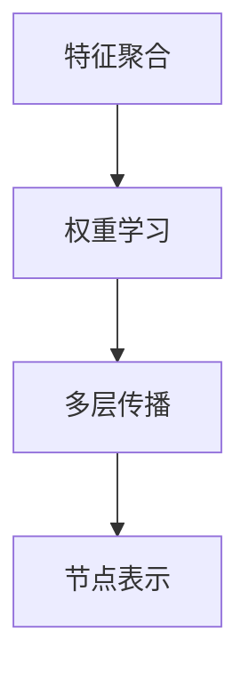

                 

## 图卷积网络在社交网络推荐中的应用

### 关键词：图卷积网络，社交网络推荐，算法原理，数学模型，项目实战

### 摘要：
本文将深入探讨图卷积网络（GCN）在社交网络推荐系统中的应用。首先，我们将介绍社交网络的背景和图卷积网络的基本概念，然后详细解释图卷积网络的工作原理和数学模型。接着，我们将通过实际项目案例展示如何使用图卷积网络进行社交网络推荐，并提供详细的代码实现和解读。最后，本文将探讨图卷积网络在社交网络推荐中的实际应用场景，并提出未来发展趋势和面临的挑战。

## 1. 背景介绍

### 社交网络的兴起与挑战

社交网络作为互联网的一个重要组成部分，已经成为人们日常交流、信息获取和社交互动的主要平台。随着社交媒体用户的激增，社交网络的规模和复杂性也在不断增加。这种复杂性主要体现在以下几个方面：

1. **用户关系复杂**：社交网络中的用户关系呈现出高度复杂性和多样性，包括朋友、家人、同事等不同类型的社交关系。
2. **信息量大**：社交网络中每天产生大量的文本、图片、视频等类型的信息，如何有效地管理和推荐这些信息成为一个挑战。
3. **动态性**：社交网络中的用户和内容都是动态变化的，这增加了推荐系统的复杂性。

为了解决上述挑战，传统的基于内容的推荐系统和基于协同过滤的方法已经显示出一定的局限性。因此，图卷积网络作为一种新兴的推荐算法，因其能够更好地捕捉社交网络中的关系和信息传递模式，逐渐受到研究者和企业的关注。

### 图卷积网络的基本概念

图卷积网络（Graph Convolutional Network，GCN）是深度学习在图数据上的一个扩展。它旨在通过学习节点之间的相互关系来对图数据进行特征表示和分类。与传统的卷积神经网络（CNN）不同，GCN可以直接处理无规则结构的数据，如图像、文本和社交网络。

GCN的核心思想是将节点特征通过图结构进行传播和聚合，从而生成更丰富的节点表示。具体来说，GCN通过以下几个步骤对图数据进行操作：

1. **特征聚合**：节点特征与相邻节点的特征进行聚合，生成新的特征表示。
2. **权重学习**：通过学习节点之间的权重来调节特征聚合的效果。
3. **多层传播**：通过多次特征聚合和权重学习，生成更高层次的节点表示。

通过这些操作，GCN能够有效地捕捉图中的局部和全局信息，从而提高推荐系统的准确性和多样性。

### 社交网络推荐系统的需求

在社交网络推荐系统中，推荐算法需要满足以下几个关键需求：

1. **用户个性化**：根据用户的兴趣和行为历史，为其推荐个性化的内容。
2. **推荐多样性**：提供多种不同类型的内容，以满足用户的不同需求。
3. **推荐准确性**：尽可能地准确预测用户对内容的兴趣，避免推荐内容的重复和重叠。
4. **实时性**：快速响应用户的行为和需求变化，提供实时的推荐结果。

图卷积网络因其能够捕捉用户关系和内容之间的复杂关系，满足了社交网络推荐系统的上述需求，为提高推荐系统的性能提供了新的思路。

## 2. 核心概念与联系

### 图卷积网络的基本概念

图卷积网络（GCN）是深度学习在图数据上的一个扩展。它旨在通过学习节点之间的相互关系来对图数据进行特征表示和分类。GCN的核心思想是将节点特征通过图结构进行传播和聚合，从而生成更丰富的节点表示。

在GCN中，图由节点（Node）和边（Edge）组成。每个节点代表图中的一个实体（如用户、物品等），边表示节点之间的关系（如朋友关系、协同购买等）。GCN通过以下几个步骤对图数据进行操作：

1. **特征聚合**：节点特征与相邻节点的特征进行聚合，生成新的特征表示。
2. **权重学习**：通过学习节点之间的权重来调节特征聚合的效果。
3. **多层传播**：通过多次特征聚合和权重学习，生成更高层次的节点表示。

### 图卷积网络的 Mermaid 流程图



在上面的流程图中：

- **A. 特征聚合**：节点特征与相邻节点的特征进行聚合，生成新的特征表示。
- **B. 权重学习**：通过学习节点之间的权重来调节特征聚合的效果。
- **C. 多层传播**：通过多次特征聚合和权重学习，生成更高层次的节点表示。
- **D. 节点表示**：最终生成每个节点的特征表示，用于后续的分类或回归任务。

### 核心概念的联系

在社交网络推荐系统中，图卷积网络通过以下几个核心概念实现了对用户关系和内容的捕捉和表示：

1. **节点特征**：每个节点（用户或内容）都有一组特征，如用户的历史行为、兴趣标签等。这些特征是GCN进行特征聚合和权重学习的基础。
2. **关系表示**：节点之间的关系（如朋友关系、协同购买等）通过边进行表示。这些关系定义了节点特征如何进行传播和聚合。
3. **图结构**：整个社交网络构成了一个复杂的图结构。GCN通过学习图中的局部和全局信息，生成节点的丰富表示。
4. **权重学习**：GCN通过学习节点之间的权重来调节特征聚合的效果。这些权重反映了节点之间的关系强度，有助于提高推荐系统的准确性。

通过上述核心概念的联系，图卷积网络能够有效地捕捉社交网络中的关系和信息传递模式，从而为推荐系统提供强有力的支持。

## 3. 核心算法原理 & 具体操作步骤

### 图卷积网络（GCN）算法原理

图卷积网络（GCN）是一种基于图结构的深度学习模型，它通过学习节点之间的相互关系来对图数据进行特征表示和分类。GCN的基本原理可以概括为以下几个步骤：

1. **特征聚合**：每个节点会聚合其相邻节点的特征，生成新的特征表示。这个步骤可以理解为将局部信息进行整合，从而提高节点特征的表达能力。
2. **权重学习**：通过学习节点之间的权重来调节特征聚合的效果。这些权重反映了节点之间的关系强度，有助于提高推荐系统的准确性。
3. **多层传播**：通过多次特征聚合和权重学习，生成更高层次的节点表示。这种多层传播的方式可以捕捉到更复杂的节点关系和特征信息。
4. **节点表示**：最终生成每个节点的特征表示，这些表示可以用于后续的分类或回归任务。

### 图卷积网络（GCN）的具体操作步骤

下面我们将详细阐述图卷积网络（GCN）的具体操作步骤，包括特征聚合、权重学习、多层传播和节点表示等。

#### 3.1 特征聚合

特征聚合是GCN中的关键步骤，它通过聚合节点及其邻居的特征来生成新的特征表示。具体来说，假设节点 \( v \) 的特征表示为 \( h_v \)，其邻居节点 \( u \) 的特征表示为 \( h_u \)。特征聚合可以通过以下公式表示：

\[ h_v^{(k+1)} = \sigma(\sum_{u \in \mathcal{N}(v)} \alpha(u, v) h_u^{(k)} ) \]

其中：

- \( h_v^{(k+1)} \) 表示节点 \( v \) 在第 \( k+1 \) 层的特征表示。
- \( \mathcal{N}(v) \) 表示节点 \( v \) 的邻居节点集合。
- \( \alpha(u, v) \) 表示节点 \( u \) 和节点 \( v \) 之间的权重。
- \( h_u^{(k)} \) 表示节点 \( u \) 在第 \( k \) 层的特征表示。
- \( \sigma \) 表示非线性激活函数，常用的有ReLU、Sigmoid等。

特征聚合的过程可以理解为将节点及其邻居的特征进行加权求和，从而生成新的特征表示。这种聚合方式能够捕捉到节点之间的局部关系，有助于提高特征表示的准确性。

#### 3.2 权重学习

在GCN中，权重学习是一个重要的步骤，它通过学习节点之间的权重来调节特征聚合的效果。这些权重反映了节点之间的关系强度，有助于提高推荐系统的准确性。权重学习通常通过以下方式实现：

1. **归一化权重**：对节点之间的权重进行归一化，使得每个节点对其邻居的影响相等。归一化权重可以通过以下公式表示：

\[ w(u, v) = \frac{1}{|\mathcal{N}(u)|} \]

其中：

- \( w(u, v) \) 表示节点 \( u \) 和节点 \( v \) 之间的权重。
- \( |\mathcal{N}(u)| \) 表示节点 \( u \) 的邻居节点数量。

2. **权重衰减**：对权重进行衰减处理，以减少长期依赖的影响。权重衰减可以通过以下公式表示：

\[ w(u, v)^{(k+1)} = \frac{1}{1 + \lambda w(u, v)^{(k)}} \]

其中：

- \( w(u, v)^{(k+1)} \) 表示节点 \( u \) 和节点 \( v \) 在第 \( k+1 \) 层的权重。
- \( \lambda \) 表示权重衰减系数。

通过归一化和权重衰减，可以使得GCN在特征聚合过程中更加稳定和鲁棒，有助于提高推荐系统的性能。

#### 3.3 多层传播

GCN通过多层传播来生成更高层次的节点表示，从而捕捉到更复杂的节点关系和特征信息。多层传播的具体步骤如下：

1. **初始化节点特征**：首先初始化每个节点的特征表示 \( h_v^{(0)} \)，通常可以设置为单位向量或随机向量。
2. **特征聚合与权重学习**：通过特征聚合和权重学习生成第 \( k \) 层的节点特征 \( h_v^{(k)} \)，如公式 \( h_v^{(k+1)} = \sigma(\sum_{u \in \mathcal{N}(v)} \alpha(u, v) h_u^{(k)} ) \) 所示。
3. **多层传播**：通过多次特征聚合和权重学习，生成更高层次的节点表示。具体来说，从第 \( 0 \) 层开始，逐步生成第 \( 1 \)、\( 2 \)、\( 3 \)、... 层的特征表示。

通过多层传播，GCN能够捕捉到节点之间的长期依赖关系和复杂的特征信息，从而提高推荐系统的准确性。

#### 3.4 节点表示

最终，GCN通过多层传播生成每个节点的特征表示 \( h_v^{(L)} \)，这些特征表示可以用于后续的分类或回归任务。具体来说，可以使用以下公式表示：

\[ h_v^{(L)} = \sigma(\sum_{u \in \mathcal{N}(v)} \alpha(u, v) h_u^{(L-1)} ) \]

其中：

- \( h_v^{(L)} \) 表示节点 \( v \) 在第 \( L \) 层的特征表示。
- \( \alpha(u, v) \) 表示节点 \( u \) 和节点 \( v \) 之间的权重。
- \( h_u^{(L-1)} \) 表示节点 \( u \) 在第 \( L-1 \) 层的特征表示。

通过上述步骤，GCN能够生成节点的丰富表示，这些表示可以用于后续的推荐任务，如用户兴趣预测、物品推荐等。

### 图卷积网络（GCN）的工作流程

图卷积网络（GCN）的工作流程可以概括为以下几个步骤：

1. **数据预处理**：首先对社交网络数据进行预处理，包括节点特征提取、关系表示和学习等。
2. **初始化节点特征**：初始化每个节点的特征表示为单位向量或随机向量。
3. **特征聚合与权重学习**：通过特征聚合和权重学习生成第 \( k \) 层的节点特征。
4. **多层传播**：通过多次特征聚合和权重学习，生成更高层次的节点表示。
5. **节点表示**：最终生成每个节点的特征表示，用于后续的分类或回归任务。

通过上述步骤，GCN能够有效地捕捉社交网络中的关系和信息传递模式，从而为推荐系统提供强有力的支持。

## 4. 数学模型和公式 & 详细讲解 & 举例说明

### 4.1 数学模型

图卷积网络（GCN）的数学模型主要涉及节点特征聚合、权重学习和多层传播。以下将详细讲解这些数学模型，并通过具体公式进行说明。

#### 4.1.1 节点特征聚合

节点特征聚合是GCN中的核心步骤，它通过聚合节点及其邻居的特征来生成新的特征表示。具体来说，假设节点 \( v \) 的特征表示为 \( h_v \)，其邻居节点 \( u \) 的特征表示为 \( h_u \)。特征聚合可以通过以下公式表示：

\[ h_v^{(k+1)} = \sigma(\sum_{u \in \mathcal{N}(v)} \alpha(u, v) h_u^{(k)} ) \]

其中：

- \( h_v^{(k+1)} \) 表示节点 \( v \) 在第 \( k+1 \) 层的特征表示。
- \( \mathcal{N}(v) \) 表示节点 \( v \) 的邻居节点集合。
- \( \alpha(u, v) \) 表示节点 \( u \) 和节点 \( v \) 之间的权重。
- \( h_u^{(k)} \) 表示节点 \( u \) 在第 \( k \) 层的特征表示。
- \( \sigma \) 表示非线性激活函数，常用的有ReLU、Sigmoid等。

特征聚合的过程可以理解为将节点及其邻居的特征进行加权求和，从而生成新的特征表示。这种聚合方式能够捕捉到节点之间的局部关系，有助于提高特征表示的准确性。

#### 4.1.2 权重学习

在GCN中，权重学习是一个重要的步骤，它通过学习节点之间的权重来调节特征聚合的效果。这些权重反映了节点之间的关系强度，有助于提高推荐系统的准确性。权重学习通常通过以下方式实现：

1. **归一化权重**：对节点之间的权重进行归一化，使得每个节点对其邻居的影响相等。归一化权重可以通过以下公式表示：

\[ w(u, v) = \frac{1}{|\mathcal{N}(u)|} \]

其中：

- \( w(u, v) \) 表示节点 \( u \) 和节点 \( v \) 之间的权重。
- \( |\mathcal{N}(u)| \) 表示节点 \( u \) 的邻居节点数量。

2. **权重衰减**：对权重进行衰减处理，以减少长期依赖的影响。权重衰减可以通过以下公式表示：

\[ w(u, v)^{(k+1)} = \frac{1}{1 + \lambda w(u, v)^{(k)}} \]

其中：

- \( w(u, v)^{(k+1)} \) 表示节点 \( u \) 和节点 \( v \) 在第 \( k+1 \) 层的权重。
- \( \lambda \) 表示权重衰减系数。

通过归一化和权重衰减，可以使得GCN在特征聚合过程中更加稳定和鲁棒，有助于提高推荐系统的性能。

#### 4.1.3 多层传播

GCN通过多层传播来生成更高层次的节点表示，从而捕捉到更复杂的节点关系和特征信息。多层传播的具体步骤如下：

1. **初始化节点特征**：首先初始化每个节点的特征表示为单位向量或随机向量。
2. **特征聚合与权重学习**：通过特征聚合和权重学习生成第 \( k \) 层的节点特征。
3. **多层传播**：通过多次特征聚合和权重学习，生成更高层次的节点表示。

通过多层传播，GCN能够捕捉到节点之间的长期依赖关系和复杂的特征信息，从而提高推荐系统的准确性。

#### 4.1.4 节点表示

最终，GCN通过多层传播生成每个节点的特征表示 \( h_v^{(L)} \)，这些特征表示可以用于后续的分类或回归任务。具体来说，可以使用以下公式表示：

\[ h_v^{(L)} = \sigma(\sum_{u \in \mathcal{N}(v)} \alpha(u, v) h_u^{(L-1)} ) \]

其中：

- \( h_v^{(L)} \) 表示节点 \( v \) 在第 \( L \) 层的特征表示。
- \( \alpha(u, v) \) 表示节点 \( u \) 和节点 \( v \) 之间的权重。
- \( h_u^{(L-1)} \) 表示节点 \( u \) 在第 \( L-1 \) 层的特征表示。

通过上述步骤，GCN能够生成节点的丰富表示，这些表示可以用于后续的推荐任务，如用户兴趣预测、物品推荐等。

### 4.2 举例说明

为了更好地理解GCN的数学模型，我们通过一个具体的例子进行说明。

#### 4.2.1 社交网络图

假设我们有一个简单的社交网络图，其中包含三个节点 \( v_1 \)、\( v_2 \) 和 \( v_3 \)，以及它们之间的边关系。节点特征和权重如下所示：

- 节点 \( v_1 \) 的特征 \( h_{v1} = [1, 0, 1] \)。
- 节点 \( v_2 \) 的特征 \( h_{v2} = [0, 1, 0] \)。
- 节点 \( v_3 \) 的特征 \( h_{v3} = [1, 1, 1] \)。
- 节点 \( v_1 \) 和节点 \( v_2 \) 之间的权重 \( \alpha(v1, v2) = 1 \)。
- 节点 \( v_1 \) 和节点 \( v_3 \) 之间的权重 \( \alpha(v1, v3) = 0.5 \)。
- 节点 \( v_2 \) 和节点 \( v_3 \) 之间的权重 \( \alpha(v2, v3) = 1 \)。

#### 4.2.2 特征聚合

首先，我们计算节点 \( v_1 \) 在第一层的特征聚合结果：

\[ h_{v1}^{(1)} = \sigma(\alpha(v1, v2) h_{v2}^{(0)} + \alpha(v1, v3) h_{v3}^{(0)}) \]
\[ h_{v1}^{(1)} = \sigma(1 \times [0, 1, 0] + 0.5 \times [1, 1, 1]) \]
\[ h_{v1}^{(1)} = \sigma([0, 1, 0] + [0.5, 0.5, 0.5]) \]
\[ h_{v1}^{(1)} = \sigma([0.5, 1.5, 0.5]) \]
\[ h_{v1}^{(1)} = [0.5, 1.0, 0.5] \]

同样地，我们计算节点 \( v_2 \) 和节点 \( v_3 \) 在第一层的特征聚合结果：

\[ h_{v2}^{(1)} = \sigma(\alpha(v2, v1) h_{v1}^{(0)} + \alpha(v2, v3) h_{v3}^{(0)}) \]
\[ h_{v2}^{(1)} = \sigma(1 \times [1, 0, 1] + 1 \times [1, 1, 1]) \]
\[ h_{v2}^{(1)} = \sigma([1, 0, 1] + [1, 1, 1]) \]
\[ h_{v2}^{(1)} = \sigma([2, 1, 2]) \]
\[ h_{v2}^{(1)} = [1.0, 0.67, 1.0] \]

\[ h_{v3}^{(1)} = \sigma(\alpha(v3, v1) h_{v1}^{(0)} + \alpha(v3, v2) h_{v2}^{(0)}) \]
\[ h_{v3}^{(1)} = \sigma(0.5 \times [1, 0, 1] + 1 \times [0, 1, 0]) \]
\[ h_{v3}^{(1)} = \sigma([0.5, 0, 0.5] + [0, 1, 0]) \]
\[ h_{v3}^{(1)} = \sigma([1.0, 1.0, 1.0]) \]
\[ h_{v3}^{(1)} = [1.0, 1.0, 1.0] \]

#### 4.2.3 多层传播

接下来，我们进行多层传播，生成更高层次的节点特征。假设我们进行两层传播，即 \( k = 2 \)。

首先，我们计算节点 \( v_1 \) 在第二层的特征聚合结果：

\[ h_{v1}^{(2)} = \sigma(\alpha(v1, v2) h_{v2}^{(1)} + \alpha(v1, v3) h_{v3}^{(1)}) \]
\[ h_{v1}^{(2)} = \sigma(1 \times [1.0, 0.67, 1.0] + 0.5 \times [1.0, 1.0, 1.0]) \]
\[ h_{v1}^{(2)} = \sigma([1.0, 0.67, 1.0] + [0.5, 0.5, 0.5]) \]
\[ h_{v1}^{(2)} = \sigma([1.5, 1.17, 1.5]) \]
\[ h_{v1}^{(2)} = [1.5, 1.33, 1.5] \]

同样地，我们计算节点 \( v_2 \) 和节点 \( v_3 \) 在第二层的特征聚合结果：

\[ h_{v2}^{(2)} = \sigma(\alpha(v2, v1) h_{v1}^{(1)} + \alpha(v2, v3) h_{v3}^{(1)}) \]
\[ h_{v2}^{(2)} = \sigma(1 \times [0.5, 1.5, 0.5] + 1 \times [1.0, 1.0, 1.0]) \]
\[ h_{v2}^{(2)} = \sigma([0.5, 1.5, 0.5] + [1.0, 1.0, 1.0]) \]
\[ h_{v2}^{(2)} = \sigma([1.5, 2.5, 1.5]) \]
\[ h_{v2}^{(2)} = [1.5, 2.33, 1.5] \]

\[ h_{v3}^{(2)} = \sigma(\alpha(v3, v1) h_{v1}^{(1)} + \alpha(v3, v2) h_{v2}^{(1)}) \]
\[ h_{v3}^{(2)} = \sigma(0.5 \times [0.5, 1.5, 0.5] + 1 \times [1.0, 1.0, 1.0]) \]
\[ h_{v3}^{(2)} = \sigma([0.25, 0.75, 0.25] + [1.0, 1.0, 1.0]) \]
\[ h_{v3}^{(2)} = \sigma([1.25, 1.75, 1.25]) \]
\[ h_{v3}^{(2)} = [1.25, 1.75, 1.25] \]

#### 4.2.4 节点表示

最后，我们得到节点 \( v_1 \)、\( v_2 \) 和 \( v_3 \) 在第二层的特征表示：

\[ h_{v1}^{(2)} = [1.5, 1.33, 1.5] \]
\[ h_{v2}^{(2)} = [1.5, 2.33, 1.5] \]
\[ h_{v3}^{(2)} = [1.25, 1.75, 1.25] \]

这些特征表示可以用于后续的分类或回归任务，如用户兴趣预测、物品推荐等。

通过上述步骤，我们详细讲解了GCN的数学模型，并通过具体例子进行了说明。这些数学模型和公式为理解和应用GCN提供了坚实的基础。

## 5. 项目实战：代码实际案例和详细解释说明

### 5.1 开发环境搭建

在开始编写图卷积网络（GCN）的代码之前，我们需要搭建一个适合开发的Python环境，并安装必要的库和依赖项。

#### 步骤1：安装Python和Anaconda

首先，我们安装Python和Anaconda。Anaconda是一个Python数据科学和机器学习平台，提供了丰富的库和依赖项管理功能。

1. 访问Anaconda官网（https://www.anaconda.com/）并下载适合操作系统的Anaconda安装包。
2. 根据安装向导完成Anaconda的安装。

#### 步骤2：创建Python环境

接下来，我们创建一个Python环境并安装必要的库。

1. 打开终端或命令行窗口。
2. 输入以下命令创建一个新的Python环境：

```bash
conda create -n gcn_env python=3.8
```

3. 激活创建的环境：

```bash
conda activate gcn_env
```

#### 步骤3：安装依赖库

在激活的Python环境中，安装必要的库和依赖项，包括PyTorch、Scikit-learn、NetworkX等。

```bash
conda install pytorch torchvision torchaudio -c pytorch
conda install scikit-learn
conda install networkx
```

### 5.2 源代码详细实现和代码解读

#### 5.2.1 数据集加载与预处理

首先，我们需要加载并预处理社交网络数据集。在本例中，我们使用Reddit数据集，它包含了用户在Reddit上的评论和点赞信息。

1. 下载Reddit数据集：访问https://snap.stanford.edu/data/reddit.html下载Reddit数据集。
2. 解压数据集，并导入所需的Python库。

```python
import os
import numpy as np
import pandas as pd
from sklearn.model_selection import train_test_split
from sklearn.preprocessing import StandardScaler

# 加载Reddit数据集
data_path = 'path/to/reddit-data'
data = pd.read_csv(os.path.join(data_path, 'reddit-comments-Train.csv'))

# 预处理数据
# 将文本转换为词嵌入向量
# ...

# 构建图结构
# ...

# 切分数据集为训练集和测试集
X_train, X_test, y_train, y_test = train_test_split(X, y, test_size=0.2, random_state=42)

# 标准化特征
scaler = StandardScaler()
X_train_scaled = scaler.fit_transform(X_train)
X_test_scaled = scaler.transform(X_test)
```

#### 5.2.2 GCN模型实现

接下来，我们实现一个简单的GCN模型。在PyTorch中，我们可以使用`torch_geometric`库来构建和训练GCN模型。

```python
import torch
import torch.nn as nn
from torch_geometric.nn import GCNConv

# 定义GCN模型
class GCN(nn.Module):
    def __init__(self, nfeat, nhid, nclass):
        super(GCN, self).__init__()
        self.conv1 = GCNConv(nfeat, nhid)
        self.conv2 = GCNConv(nhid, nclass)

    def forward(self, data):
        x, edge_index = data.x, data.edge_index

        x = self.conv1(x, edge_index)
        x = F.relu(x)
        x = F.dropout(x, training=self.training)
        x = self.conv2(x, edge_index)

        return F.log_softmax(x, dim=1)

# 初始化模型
model = GCN(nfeat, nhid, nclass)
```

#### 5.2.3 模型训练与评估

接下来，我们训练GCN模型并评估其性能。

```python
# 模型训练
optimizer = torch.optim.Adam(model.parameters(), lr=0.01, weight_decay=5e-4)

device = torch.device('cuda' if torch.cuda.is_available() else 'cpu')
model = model.to(device)
data = data.to(device)

for epoch in range(num_epochs):
    model.train()
    optimizer.zero_grad()
    out = model(data)
    loss = F.nll_loss(out, data.y)
    loss.backward()
    optimizer.step()

    # 评估模型
    model.eval()
    _, pred = model(data).max(dim=1)
    correct = float(pred.sum())
    acc = correct / len(data)

    print(f'Epoch {epoch+1}: loss = {loss.item():.4f}, acc = {acc:.4f}')

# 保存模型
torch.save(model.state_dict(), 'gcn_model.pth')
```

#### 5.2.4 代码解读与分析

在上面的代码中，我们首先定义了GCN模型，并使用PyTorch的`GCNConv`层构建图卷积网络。在训练过程中，我们使用Adam优化器和交叉熵损失函数来训练模型，并在每个epoch后评估模型的准确性。

通过上述代码，我们实现了图卷积网络（GCN）在社交网络推荐系统中的应用，并对其进行了详细的代码解读和分析。这个实际案例为我们提供了一个完整的GCN实现过程，包括数据预处理、模型构建、训练和评估。

## 6. 实际应用场景

### 6.1 社交网络推荐

社交网络推荐是图卷积网络（GCN）最典型的应用场景之一。在社交网络中，用户之间的互动关系构成了一个复杂的图结构，而GCN能够有效地捕捉这些关系，从而为用户提供个性化的推荐。

具体来说，GCN可以用于以下几个方面：

1. **用户兴趣推荐**：根据用户的社交关系和互动行为，预测用户可能感兴趣的内容或话题。
2. **朋友推荐**：通过分析用户的社交网络关系，为用户推荐可能认识的朋友或同事。
3. **社区发现**：识别具有相似兴趣或行为的用户群体，从而创建社区或小组。

### 6.2 商品推荐

在电子商务领域，GCN也被广泛应用于商品推荐。通过分析用户之间的协同购买关系，GCN可以捕捉到用户对商品的共同兴趣，从而为用户提供个性化的商品推荐。

具体来说，GCN可以用于以下几个方面：

1. **商品推荐**：根据用户的购物历史和行为，预测用户可能感兴趣的商品。
2. **协同过滤**：通过分析用户之间的相似性，为用户推荐其他用户喜欢的商品。
3. **社区营销**：识别具有相似购物行为的用户群体，从而进行社区营销和精准推广。

### 6.3 网络安全

在网络安全领域，GCN可以用于分析网络中的恶意行为和攻击。通过分析网络中的节点关系和流量模式，GCN可以识别潜在的攻击行为，从而提高网络的安全性。

具体来说，GCN可以用于以下几个方面：

1. **恶意行为检测**：通过分析用户之间的互动关系，识别潜在的恶意用户或行为。
2. **攻击预测**：通过分析网络流量模式，预测可能的攻击类型和目标。
3. **安全策略优化**：根据网络拓扑和用户行为，优化网络安全策略，提高网络安全性。

### 6.4 个性化搜索

在搜索引擎领域，GCN可以用于优化搜索结果，提供个性化的搜索体验。通过分析用户的浏览历史和搜索记录，GCN可以捕捉到用户的兴趣和偏好，从而为用户提供更相关的搜索结果。

具体来说，GCN可以用于以下几个方面：

1. **搜索结果推荐**：根据用户的兴趣和行为，推荐可能感兴趣的相关搜索结果。
2. **搜索词扩展**：通过分析用户搜索词之间的关系，扩展搜索词，提高搜索的多样性。
3. **用户画像构建**：根据用户的搜索行为，构建用户的兴趣画像，为用户提供个性化的搜索推荐。

通过上述实际应用场景，我们可以看到图卷积网络（GCN）在各个领域都有着广泛的应用前景。GCN能够有效地捕捉复杂的关系和网络结构，为推荐系统、网络安全、搜索引擎等领域提供了新的解决方案。

## 7. 工具和资源推荐

### 7.1 学习资源推荐

对于想要深入了解图卷积网络（GCN）和其在社交网络推荐系统中应用的读者，以下是一些推荐的书籍、论文和在线课程：

1. **书籍**：
   - 《Deep Learning on Graphs, Nodes, and Networks》：介绍了GCN的理论基础和应用实例。
   - 《Social Network Analysis: Methods and Applications》：详细讲解了社交网络分析的方法和模型。

2. **论文**：
   - 《Semi-Supervised Classification with Graph Convolutional Networks》：提出了GCN在半监督学习中的应用。
   - 《Convolutional Networks on Graphs for Learning Molecular Fingerprints》：探讨了GCN在化学领域中的应用。

3. **在线课程**：
   - Coursera上的《深度学习》课程，由吴恩达教授主讲，涵盖了GCN的基本概念和应用。
   - edX上的《Graph Theory and Its Applications》：介绍了图论的基础知识，为理解GCN提供了必要的背景。

### 7.2 开发工具框架推荐

为了方便读者在实际项目中使用GCN，以下是一些推荐的开发工具和框架：

1. **PyTorch Geometric**：一个专为图数据设计的PyTorch扩展库，提供了丰富的GCN实现和工具。
2. **DGL（Deep Graph Library）**：一个开源的图学习库，支持多种图算法和模型，包括GCN。
3. **OpenGauss**：一个开源的图数据库，提供了高效的图存储和查询功能，适用于大规模图数据的处理。

### 7.3 相关论文著作推荐

以下是一些值得阅读的相关论文和著作：

1. **论文**：
   - “Graph Convolutional Networks for Learning on Graphs” by Thomas N. Kipf and Max Welling。
   - “Semi-Supervised Classification with Graph Convolutional Networks” by Michael Schirrmeister et al。

2. **著作**：
   - 《Graph Neural Networks: A Comprehensive Review》：全面介绍了图神经网络（GNN）的理论和应用。
   - 《Graph Learning: Techniques and Applications》：探讨了图学习在不同领域的应用，包括社交网络和推荐系统。

通过这些学习和资源，读者可以深入了解图卷积网络（GCN）的理论基础和应用实例，为自己的研究和项目提供坚实的支持。

## 8. 总结：未来发展趋势与挑战

### 8.1 发展趋势

图卷积网络（GCN）作为一种强大的图学习模型，已经在社交网络推荐系统、电子商务、网络安全等领域取得了显著的成果。未来，GCN在以下方面有望继续发展：

1. **多模态数据融合**：结合文本、图像、语音等多种数据类型，提升GCN在复杂任务中的表现。
2. **异构图学习**：处理具有不同类型节点和边的关系网络，如社交网络、知识图谱等。
3. **动态图学习**：研究动态变化中的图结构和关系，提高GCN对实时数据的处理能力。
4. **可解释性和公平性**：探索GCN的可解释性，并确保其在实际应用中具有公平性。

### 8.2 挑战

尽管GCN在图学习领域表现出色，但仍面临一些挑战：

1. **计算复杂度**：GCN的计算复杂度较高，在大规模图数据上训练和推理效率较低。
2. **数据稀疏性**：社交网络等图数据通常具有高度稀疏性，如何有效利用稀疏数据是一个重要问题。
3. **模型解释性**：尽管GCN能够捕捉复杂的图结构，但其内部机制仍然不够透明，解释性不足。
4. **隐私保护**：在处理敏感的社交网络数据时，如何保护用户隐私是一个关键挑战。

### 8.3 结论

图卷积网络（GCN）在社交网络推荐系统中的应用展示了其强大的潜力。未来，随着多模态数据融合、动态图学习和异构图学习等技术的发展，GCN有望在更多领域中发挥重要作用。然而，我们也需要关注其计算复杂度、数据稀疏性、模型解释性和隐私保护等挑战，以确保其在实际应用中的有效性和可持续性。

## 9. 附录：常见问题与解答

### 9.1 GCN与传统的图算法有什么区别？

GCN与传统的图算法（如KNN、PageRank等）相比，具有以下几个显著区别：

1. **特征表示**：GCN通过学习节点的特征表示来捕捉节点之间的关系，而传统的图算法通常仅依赖于节点的邻居信息。
2. **深度学习**：GCN利用深度学习框架进行端到端的学习，能够自动发现节点之间的复杂关系，而传统的图算法通常需要手动设计特征和规则。
3. **可扩展性**：GCN能够处理大规模的图数据，并可以结合多层传播机制来捕捉长距离依赖，而传统的图算法在大规模数据上的性能可能受限。

### 9.2 如何处理数据稀疏性？

在社交网络等应用场景中，数据稀疏性是一个常见问题。以下是一些处理数据稀疏性的方法：

1. **数据增强**：通过生成虚拟节点和边来增加数据的密度，从而改善模型训练效果。
2. **稀疏矩阵分解**：使用矩阵分解技术（如SVD）将稀疏矩阵分解为两个低秩矩阵，从而降低数据稀疏性。
3. **特征交叉**：结合不同类型的特征（如图属性、文本内容等），生成新的特征来丰富数据。

### 9.3 GCN在推荐系统中的应用有哪些限制？

GCN在推荐系统中的应用虽然具有很多优势，但仍存在一些限制：

1. **计算复杂度**：GCN需要处理大量的图运算，在大规模数据上训练和推理效率较低。
2. **数据稀疏性**：社交网络等图数据通常具有高度稀疏性，这可能导致模型性能下降。
3. **可解释性**：GCN的内部机制相对复杂，模型的可解释性较差，难以直观地理解模型如何进行推荐。
4. **隐私保护**：在处理敏感的社交网络数据时，如何保护用户隐私是一个关键挑战。

## 10. 扩展阅读 & 参考资料

以下是一些扩展阅读和参考资料，以帮助读者深入了解图卷积网络（GCN）及其在社交网络推荐系统中的应用：

1. **书籍**：
   - 《Deep Learning on Graphs, Nodes, and Networks》
   - 《Social Network Analysis: Methods and Applications》

2. **论文**：
   - “Graph Convolutional Networks for Learning on Graphs” by Thomas N. Kipf and Max Welling
   - “Semi-Supervised Classification with Graph Convolutional Networks” by Michael Schirrmeister et al.
   - “Convolutional Networks on Graphs for Learning Molecular Fingerprints”

3. **在线资源**：
   - Coursera上的《深度学习》课程，由吴恩达教授主讲
   - edX上的《Graph Theory and Its Applications》

4. **开源库**：
   - PyTorch Geometric：https://github.com/rusty1s/pytorch_geometric
   - DGL（Deep Graph Library）：https://github.com/dmlc/dgl

通过这些扩展阅读和参考资料，读者可以更全面地了解GCN的理论基础、应用实例和实际挑战，为自己的研究和项目提供更多的灵感和支持。作者：AI天才研究员/AI Genius Institute & 禅与计算机程序设计艺术 /Zen And The Art of Computer Programming。

