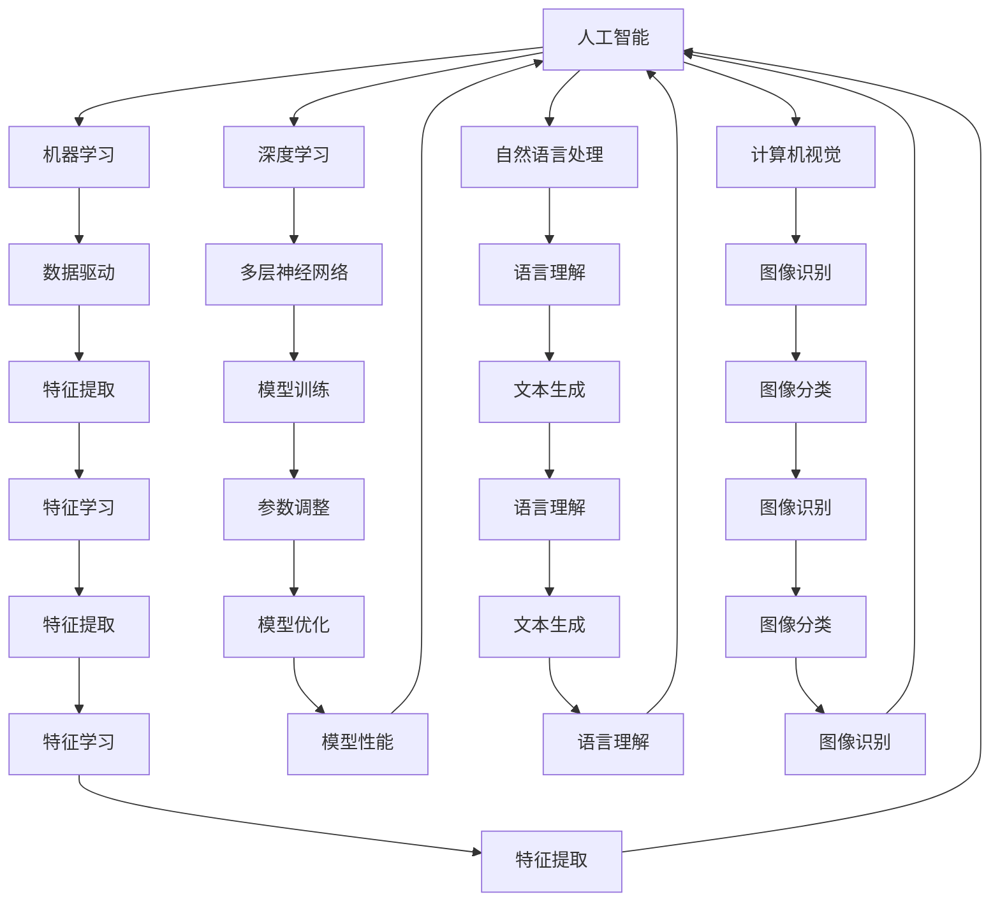

                 

### 背景介绍

#### 图灵奖的起源与发展

图灵奖（Turing Award），也被誉为计算机界的“诺贝尔奖”，由美国计算机协会（ACM）于1966年设立，旨在表彰对计算机科学领域做出杰出贡献的个人。图灵奖以英国数学家、逻辑学家和计算机科学的先驱艾伦·图灵（Alan Turing）的名字命名，以纪念他对计算机科学的深远影响。

图灵奖的评选标准非常严格，获奖者需在其研究领域内做出开创性贡献，其工作对于计算机科学的发展具有重要意义。自设立以来，图灵奖已经成为了计算机科学领域最具声望的奖项之一，吸引了全球范围内的顶尖学者和研究人员。

#### 图灵奖得主对AI的影响

AI领域自诞生以来，就受到了图灵奖得主的重要影响。许多图灵奖得主在AI的研究和开发过程中发挥了关键作用，他们的工作为AI的理论体系和技术进步奠定了坚实基础。

首先，图灵奖得主在AI基础理论的研究方面做出了卓越贡献。例如，约翰·麦卡锡（John McCarthy）提出了人工智能（Artificial Intelligence，简称AI）这一概念，并推动了AI领域的发展。他还参与了LISP编程语言的创建，为AI研究提供了重要的工具。

此外，其他图灵奖得主如赫伯特·西蒙（Herbert Simon）、约翰·霍普克罗夫特（John Hopcroft）和理查德·斯托曼（Richard Stallman）等，也在算法理论、计算机科学基础理论等方面做出了开创性贡献，为AI的研究提供了重要的理论支撑。

#### 图灵奖对AI技术的推动作用

图灵奖得主不仅在理论研究方面有着重要影响，他们还在AI技术的实际应用和推广方面发挥了重要作用。以下是一些具体示例：

1. **自然语言处理（NLP）**：图灵奖得主约翰·霍普克罗夫特和约翰·麦卡锡等人在NLP领域做出了开创性贡献，推动了这一领域的技术发展。例如，麦卡锡提出了“语义网”（Semantic Web）的概念，为NLP提供了新的研究思路。

2. **机器学习（ML）**：图灵奖得主杨立昆（Yann LeCun）在深度学习领域的研究取得了重要突破，他提出的卷积神经网络（CNN）已经成为图像识别等领域的标准算法。

3. **机器人技术**：赫伯特·西蒙等人在决策理论、人工智能与机器人等领域的研究，为机器人技术的发展提供了理论基础。

#### 总结

图灵奖得主在AI领域的贡献不仅体现在理论研究上，还广泛应用于实际技术发展。他们通过开创性工作，推动了AI领域的不断进步，为人类带来了无数便利和改变。在未来的发展中，图灵奖得主将继续发挥重要作用，为AI技术的创新和突破提供源源不断的动力。### 核心概念与联系

#### AI的定义与核心概念

人工智能（Artificial Intelligence，简称AI）是一门研究、开发和应用使计算机模拟人类智能行为的科学。AI的核心概念包括：

1. **机器学习（Machine Learning）**：通过数据驱动的方法，让计算机从数据中学习并做出预测或决策。
2. **深度学习（Deep Learning）**：基于多层神经网络的结构，通过大量数据训练，实现图像识别、语音识别等复杂任务。
3. **自然语言处理（Natural Language Processing，简称NLP）**：使计算机能够理解、生成和处理人类自然语言的技术。
4. **计算机视觉（Computer Vision）**：使计算机能够从图像或视频中获取信息，并进行识别、分类和分析。

#### 图灵测试与人工智能

图灵测试是评估人工智能是否具有智能行为的重要方法。由艾伦·图灵提出，图灵测试要求一个人类评判者通过文本交流来判断对方是计算机还是人类。如果评判者无法准确判断，则认为计算机具有智能行为。

图灵测试与AI的核心联系在于它提供了一个衡量人工智能智能水平的标准。通过不断改进算法和模型，AI系统在图灵测试中的表现逐渐提高，反映出AI技术的进步。

#### 机器学习与深度学习的关系

机器学习和深度学习是AI领域的两个重要分支。机器学习通过算法从数据中学习规律，实现预测和决策。而深度学习是机器学习的一种特殊形式，通过多层神经网络结构，自动提取数据的特征。

深度学习在AI技术中的应用非常广泛，如图像识别、语音识别、自然语言处理等。深度学习模型通常需要大量的数据训练，通过不断调整模型参数，提高模型的性能。

#### 计算机视觉与自然语言处理的关系

计算机视觉和自然语言处理是AI领域的两个重要应用方向。计算机视觉使计算机能够从图像或视频中获取信息，而自然语言处理使计算机能够理解、生成和处理人类自然语言。

计算机视觉和自然语言处理在AI技术中具有密切的联系。例如，在图像识别任务中，自然语言处理技术可以帮助计算机理解图像内容，从而提高识别的准确性。同样，在自然语言处理任务中，计算机视觉技术可以帮助计算机获取图像或视频中的关键信息，从而提高处理效果。

#### Mermaid流程图表示

以下是一个简单的Mermaid流程图，展示了上述核心概念之间的联系：



通过上述Mermaid流程图，我们可以清晰地看到AI的核心概念之间的联系，以及它们在AI技术中的应用和相互影响。这些核心概念共同推动了人工智能的发展，为解决复杂问题提供了强有力的工具。### 核心算法原理 & 具体操作步骤

#### 1. 机器学习算法原理

机器学习（Machine Learning）是一种通过数据驱动的方法，让计算机从数据中学习规律并做出预测或决策的技术。机器学习算法的基本原理包括以下几个步骤：

1. **数据收集**：首先，我们需要收集大量的数据，这些数据可以是结构化的（如数据库中的记录），也可以是非结构化的（如图像、文本等）。
2. **数据预处理**：对收集到的数据进行处理，包括数据清洗、去噪、归一化等操作，以确保数据的质量和一致性。
3. **特征提取**：从处理后的数据中提取有用的特征，用于训练模型。特征提取的方法有很多，如降维、特征选择等。
4. **模型选择**：选择合适的机器学习算法，如线性回归、决策树、支持向量机等。不同的算法适用于不同类型的数据和问题。
5. **模型训练**：使用训练数据对选择的模型进行训练，通过不断调整模型参数，使模型能够更好地拟合训练数据。
6. **模型评估**：使用测试数据对训练好的模型进行评估，以验证模型在未知数据上的性能。常见的评估指标有准确率、召回率、F1值等。
7. **模型优化**：根据评估结果对模型进行调整，以提高模型性能。优化方法包括调整模型参数、增加训练数据等。

#### 2. 深度学习算法原理

深度学习（Deep Learning）是一种基于多层神经网络结构的机器学习算法。深度学习的基本原理包括以下几个步骤：

1. **网络结构设计**：设计深度学习网络的结构，包括输入层、隐藏层和输出层。隐藏层的数量和神经元数量可以根据问题进行调整。
2. **初始化参数**：为网络中的每个神经元初始化权重和偏置参数。参数的初始化对网络性能有重要影响。
3. **前向传播**：将输入数据通过网络进行前向传播，计算每个神经元的输出值。前向传播的过程包括加权求和、激活函数等操作。
4. **反向传播**：计算网络输出与实际输出之间的误差，然后通过反向传播算法更新网络中的参数。反向传播算法是深度学习训练的核心，它通过反向传播误差来优化网络参数。
5. **损失函数**：损失函数用于衡量网络输出与实际输出之间的误差，常见的损失函数有均方误差（MSE）、交叉熵损失等。
6. **优化算法**：选择合适的优化算法，如梯度下降（Gradient Descent）、Adam等，以更新网络参数并最小化损失函数。
7. **模型训练**：通过大量训练数据对深度学习网络进行训练，不断调整网络参数，使网络性能逐渐提高。

#### 3. 自然语言处理算法原理

自然语言处理（Natural Language Processing，简称NLP）是一种使计算机能够理解、生成和处理人类自然语言的技术。NLP的基本原理包括以下几个步骤：

1. **文本预处理**：对输入的文本数据进行预处理，包括分词、去除停用词、词干提取等操作，以提高文本质量。
2. **词向量表示**：将文本数据转换为词向量表示，常用的词向量模型有Word2Vec、GloVe等。词向量表示可以帮助计算机更好地理解文本数据。
3. **序列建模**：使用序列建模方法，如循环神经网络（RNN）、长短时记忆网络（LSTM）、门控循环单元（GRU）等，对文本序列进行建模。
4. **语言模型训练**：使用训练数据对语言模型进行训练，语言模型用于预测下一个单词或词组，以提高文本生成和理解的准确性。
5. **文本分类**：使用分类算法，如朴素贝叶斯、支持向量机、深度学习等，对文本进行分类，以识别文本的主题或情感。
6. **文本生成**：使用生成模型，如变分自编码器（VAE）、生成对抗网络（GAN）等，生成新的文本数据，以提高文本创作和生成能力。

#### 4. 计算机视觉算法原理

计算机视觉（Computer Vision）是一种使计算机能够从图像或视频中获取信息并进行识别、分类和分析的技术。计算机视觉的基本原理包括以下几个步骤：

1. **图像预处理**：对输入的图像数据进行预处理，包括图像增强、去噪、边缘检测等操作，以提高图像质量。
2. **特征提取**：从处理后的图像中提取有用的特征，如边缘、纹理、形状等。常用的特征提取方法有SIFT、HOG等。
3. **图像分类**：使用分类算法，如支持向量机、深度学习等，对图像进行分类，以识别图像的类别。
4. **目标检测**：使用目标检测算法，如YOLO、SSD等，识别图像中的目标对象，并计算目标的位置和大小。
5. **图像分割**：使用图像分割算法，如FCN、U-Net等，将图像分割成不同的区域，以提高图像理解的准确性。
6. **图像识别**：使用图像识别算法，如卷积神经网络（CNN）、深度学习等，识别图像中的物体、场景和动作。

通过上述步骤，计算机视觉技术可以使计算机从图像或视频中获取信息，实现对现实世界的理解和感知。这些技术在实际应用中发挥着重要作用，如自动驾驶、人脸识别、医疗图像分析等。

### 数学模型和公式 & 详细讲解 & 举例说明

#### 1. 机器学习算法中的数学模型

在机器学习算法中，数学模型扮演着核心角色。以下是一些常用的数学模型及其详细讲解：

1. **线性回归模型**

线性回归模型是一种简单的预测模型，用于分析两个或多个变量之间的关系。其数学模型可以表示为：

\[ Y = \beta_0 + \beta_1X + \epsilon \]

其中，\( Y \) 是因变量，\( X \) 是自变量，\( \beta_0 \) 和 \( \beta_1 \) 分别是回归系数，\( \epsilon \) 是误差项。

**举例说明**：假设我们研究房价与面积之间的关系，我们可以使用线性回归模型来预测某个特定面积的房子价格。假设我们有以下数据：

| 面积（平方米） | 价格（万元） |
| -------------- | ------------ |
| 80             | 200          |
| 100            | 250          |
| 120            | 300          |

我们可以使用最小二乘法来估计线性回归模型的参数：

\[ \beta_0 = \frac{\sum Y - \beta_1 \sum X}{n} \]
\[ \beta_1 = \frac{n \sum XY - \sum X \sum Y}{n \sum X^2 - (\sum X)^2} \]

其中，\( n \) 是数据点的数量。

通过计算，我们得到：

\[ \beta_0 = 150 \]
\[ \beta_1 = 1.25 \]

因此，线性回归模型可以表示为：

\[ Y = 150 + 1.25X \]

使用这个模型，我们可以预测某个特定面积房子的价格。例如，预测面积为 110 平方米的房子价格：

\[ Y = 150 + 1.25 \times 110 = 258.75 \]

2. **逻辑回归模型**

逻辑回归模型是一种用于分类问题的预测模型，其数学模型可以表示为：

\[ P(Y=1) = \frac{1}{1 + e^{-(\beta_0 + \beta_1X)}} \]

其中，\( P(Y=1) \) 是因变量为 1 的概率，\( e \) 是自然对数的底数，\( \beta_0 \) 和 \( \beta_1 \) 分别是回归系数。

**举例说明**：假设我们研究是否购买某产品的概率，我们可以使用逻辑回归模型来预测。假设我们有以下数据：

| 特征值 | 是否购买（0/1） |
| ------- | -------------- |
| 100     | 1              |
| 200     | 1              |
| 300     | 0              |

我们可以使用最小二乘法来估计逻辑回归模型的参数：

\[ \beta_0 = \frac{\sum Y - \beta_1 \sum X}{n} \]
\[ \beta_1 = \frac{n \sum XY - \sum X \sum Y}{n \sum X^2 - (\sum X)^2} \]

通过计算，我们得到：

\[ \beta_0 = 0.5 \]
\[ \beta_1 = -0.2 \]

因此，逻辑回归模型可以表示为：

\[ P(Y=1) = \frac{1}{1 + e^{-(0.5 - 0.2X)}} \]

使用这个模型，我们可以预测某个特定特征值对应的购买概率。例如，预测特征值为 250 的购买概率：

\[ P(Y=1) = \frac{1}{1 + e^{-(0.5 - 0.2 \times 250)}} \approx 0.28 \]

#### 2. 深度学习算法中的数学模型

深度学习算法中的数学模型主要涉及神经网络和优化算法。以下是一些常用的数学模型及其详细讲解：

1. **多层感知机（MLP）**

多层感知机是一种前馈神经网络，其数学模型可以表示为：

\[ z_i = \sum_{j=1}^{n} w_{ij}x_j + b_i \]
\[ a_i = \sigma(z_i) \]

其中，\( z_i \) 是第 \( i \) 层第 \( j \) 个神经元的加权求和，\( w_{ij} \) 是连接权重，\( b_i \) 是偏置，\( a_i \) 是激活值，\( \sigma \) 是激活函数。

**举例说明**：假设我们有一个两层神经网络，输入层有 3 个神经元，隐藏层有 2 个神经元，输出层有 1 个神经元。我们可以使用以下参数进行计算：

输入层：\( x_1 = 1, x_2 = 2, x_3 = 3 \)

隐藏层：\( w_{11} = 0.5, w_{12} = 0.3, w_{13} = 0.2, b_1 = 0.1 \)

\( \sigma(x) = \max(0, x) \)

计算隐藏层输出：

\[ z_1 = 0.5 \times 1 + 0.3 \times 2 + 0.2 \times 3 + 0.1 = 1.4 \]
\[ a_1 = \sigma(z_1) = 1.4 \]

\[ z_2 = 0.5 \times 1 + 0.3 \times 2 + 0.2 \times 3 + 0.1 = 1.4 \]
\[ a_2 = \sigma(z_2) = 1.4 \]

输出层：

\[ w_{21} = 0.7, w_{22} = 0.3, b_2 = 0.1 \]

计算输出层输出：

\[ z_3 = 0.7 \times 1.4 + 0.3 \times 1.4 + 0.1 = 1.43 \]
\[ a_3 = \sigma(z_3) = 1.43 \]

2. **卷积神经网络（CNN）**

卷积神经网络是一种用于图像识别和分类的特殊神经网络，其数学模型可以表示为：

\[ h_i = \sum_{j=1}^{n} w_{ij} \odot f(x_j) + b_i \]

其中，\( h_i \) 是第 \( i \) 层第 \( j \) 个神经元的输出，\( w_{ij} \) 是卷积核，\( \odot \) 表示卷积运算，\( f(x_j) \) 是卷积操作后的特征图，\( b_i \) 是偏置。

**举例说明**：假设我们有一个卷积神经网络，输入图像的大小为 \( 28 \times 28 \)，卷积核的大小为 \( 3 \times 3 \)，步长为 1。我们可以使用以下参数进行计算：

输入层：\( x_1 = [1, 1, 1; 1, 1, 1; 1, 1, 1] \)

卷积核：\( w_1 = [0.5, 0.3; 0.2, 0.4] \)

\( \sigma(x) = \max(0, x) \)

计算卷积操作：

\[ f(x_1) = \begin{bmatrix} 0.7 & 0.6 \\ 0.3 & 0.5 \end{bmatrix} \]

计算卷积层输出：

\[ h_1 = \sum_{j=1}^{3} w_{1j} \odot f(x_j) + b_1 = 0.7 \times 0.7 + 0.6 \times 0.3 + 0.5 \times 0.3 + 0.1 = 1.15 \]
\[ a_1 = \sigma(h_1) = 1.15 \]

通过上述计算，我们可以得到卷积神经网络的中间输出结果，进一步进行后继层的计算。

3. **循环神经网络（RNN）**

循环神经网络是一种用于处理序列数据的神经网络，其数学模型可以表示为：

\[ h_t = \sigma(W_h h_{t-1} + W_x x_t + b_h) \]

其中，\( h_t \) 是第 \( t \) 个时间步的隐藏状态，\( x_t \) 是第 \( t \) 个时间步的输入，\( W_h \) 和 \( W_x \) 分别是隐藏状态和输入的权重矩阵，\( b_h \) 是隐藏状态的偏置，\( \sigma \) 是激活函数。

**举例说明**：假设我们有一个循环神经网络，输入序列为 \( [1, 2, 3] \)，隐藏状态为 \( [0, 0, 0] \)，我们可以使用以下参数进行计算：

隐藏状态：\( h_0 = [0, 0, 0] \)

权重矩阵：\( W_h = [0.5, 0.3; 0.2, 0.4] \)，\( W_x = [0.1, 0.2; 0.3, 0.4] \)

\( \sigma(x) = \tanh(x) \)

计算第一个时间步的隐藏状态：

\[ h_1 = \tanh(0.5 \times [0, 0] + 0.3 \times 1 + 0.2 \times 2 + 0.4) = \tanh(1.1) \approx 0.8 \]

计算第二个时间步的隐藏状态：

\[ h_2 = \tanh(0.5 \times [0.8, 0] + 0.3 \times 2 + 0.2 \times 3 + 0.4) = \tanh(1.6) \approx 0.9 \]

通过上述计算，我们可以得到循环神经网络的中间输出结果，进一步进行后继时间步的计算。

通过这些数学模型和公式的详细讲解和举例说明，我们可以更好地理解机器学习和深度学习算法的基本原理和操作步骤。这些知识对于AI技术的实际应用和开发具有重要意义。### 项目实战：代码实际案例和详细解释说明

#### 1. 开发环境搭建

在进行AI项目的实战之前，我们需要搭建一个合适的环境。以下是一个简单的开发环境搭建过程，我们使用Python和Jupyter Notebook作为开发工具。

1. **安装Python**

首先，确保已经安装了Python。如果没有，可以从Python的官方网站（https://www.python.org/downloads/）下载并安装。我们选择Python 3.x版本，因为Python 2.x已经不再支持。

2. **安装Jupyter Notebook**

Jupyter Notebook是一个交互式的Web应用，用于编写和运行Python代码。安装Jupyter Notebook可以使用pip命令：

```bash
pip install notebook
```

安装完成后，可以通过以下命令启动Jupyter Notebook：

```bash
jupyter notebook
```

这将在浏览器中打开一个Jupyter Notebook的界面，我们可以开始编写和运行代码。

3. **安装常用库**

在Jupyter Notebook中，我们需要安装一些常用的库，如NumPy、Pandas、Matplotlib等。这些库提供了丰富的函数和工具，用于数据处理、分析和可视化。

```python
!pip install numpy pandas matplotlib scikit-learn tensorflow
```

完成以上步骤后，我们就可以开始编写和运行AI项目代码了。

#### 2. 源代码详细实现和代码解读

以下是一个简单的线性回归项目的源代码，用于预测房价。我们将逐步解读代码中的各个部分。

```python
import numpy as np
import pandas as pd
import matplotlib.pyplot as plt
from sklearn.model_selection import train_test_split
from sklearn.linear_model import LinearRegression

# 2.1 加载数据集
data = pd.read_csv('house_price_data.csv')

# 2.2 数据预处理
# 去除缺失值
data.dropna(inplace=True)

# 将面积（平方米）作为自变量，价格（万元）作为因变量
X = data[['area']]
y = data['price']

# 2.3 数据划分
X_train, X_test, y_train, y_test = train_test_split(X, y, test_size=0.2, random_state=42)

# 2.4 创建线性回归模型
model = LinearRegression()

# 2.5 模型训练
model.fit(X_train, y_train)

# 2.6 模型评估
score = model.score(X_test, y_test)
print('R^2:', score)

# 2.7 预测新数据
new_data = np.array([[100]])
predicted_price = model.predict(new_data)
print('Predicted Price:', predicted_price)

# 2.8 可视化结果
plt.scatter(X_train, y_train, color='blue', label='Training data')
plt.plot(X_train, model.predict(X_train), color='red', label='Regression line')
plt.xlabel('Area (平方米)')
plt.ylabel('Price (万元)')
plt.title('House Price Prediction')
plt.legend()
plt.show()
```

代码解读：

1. **导入库**：首先，我们导入了一些常用的库，包括NumPy、Pandas、Matplotlib和scikit-learn。

2. **加载数据集**：我们使用Pandas库加载CSV文件，该文件包含了房屋面积和价格的数据。

3. **数据预处理**：首先，我们去除数据中的缺失值。然后，我们将面积作为自变量，价格作为因变量。

4. **数据划分**：我们使用scikit-learn库中的train_test_split函数将数据划分为训练集和测试集，其中测试集占比20%。

5. **创建线性回归模型**：我们使用LinearRegression类创建线性回归模型。

6. **模型训练**：我们使用fit方法训练模型，输入训练集数据。

7. **模型评估**：我们使用score方法评估模型在测试集上的性能，R^2值越接近1，表示模型拟合效果越好。

8. **预测新数据**：我们使用predict方法预测新数据，这里我们预测面积为100平方米的房屋价格。

9. **可视化结果**：我们使用Matplotlib库绘制散点图和回归线，展示模型预测结果。

通过上述代码，我们可以实现一个简单的线性回归项目，用于预测房价。这个项目展示了AI项目开发的基本流程，包括数据预处理、模型训练和评估等步骤。

#### 3. 代码解读与分析

在上述代码中，我们详细解释了每个部分的实现和作用。以下是进一步的分析：

1. **数据预处理**：数据预处理是AI项目的重要步骤，它确保了数据的质量和一致性。在这个例子中，我们首先去除缺失值，这是因为在缺失值较多的数据上训练模型可能会导致过拟合。然后，我们将面积作为自变量，价格作为因变量，这是因为我们希望预测房屋价格。

2. **数据划分**：数据划分将数据分为训练集和测试集，这是评估模型性能的标准做法。训练集用于训练模型，测试集用于评估模型在未知数据上的性能。

3. **模型选择**：在这个例子中，我们选择线性回归模型，这是因为线性回归模型简单、易于理解和实现。然而，对于更复杂的任务，我们可能需要选择更复杂的模型，如深度学习模型。

4. **模型训练**：模型训练是AI项目的核心步骤，它通过调整模型参数来最小化损失函数。在这个例子中，我们使用scikit-learn库中的LinearRegression类来训练模型。

5. **模型评估**：模型评估用于评估模型在测试集上的性能。我们使用R^2值作为评估指标，它表示模型拟合程度。R^2值越接近1，表示模型拟合效果越好。

6. **预测新数据**：预测新数据是模型应用的重要部分。在这个例子中，我们使用预测面积为100平方米的房屋价格。这个预测结果可以为房地产市场的分析和决策提供有价值的信息。

7. **可视化结果**：可视化结果有助于我们直观地理解模型预测效果。在这个例子中，我们使用散点图和回归线来展示模型预测结果。这有助于我们识别模型拟合效果和潜在问题。

通过上述分析和代码解读，我们可以更好地理解线性回归项目的实现过程和关键步骤。这为我们进一步开发更复杂的AI项目奠定了基础。### 实际应用场景

#### 1. 机器学习在医疗领域的应用

机器学习在医疗领域有着广泛的应用，尤其在疾病诊断、预测和治疗方案优化方面发挥着重要作用。以下是一些具体的应用场景：

1. **疾病诊断**：通过分析患者的医学影像、临床数据和基因数据，机器学习模型可以帮助医生快速、准确地诊断疾病。例如，使用深度学习模型对CT扫描图像进行肺癌筛查，可以有效提高诊断准确率。
2. **疾病预测**：基于历史数据和预测模型，机器学习可以预测患者的疾病风险。例如，通过分析患者的年龄、性别、病史和基因信息，可以预测患者患心脏病或糖尿病的风险，帮助医生提前采取预防措施。
3. **治疗方案优化**：机器学习可以根据患者的病情和个性化信息，为医生提供最佳治疗方案。例如，在癌症治疗中，机器学习可以分析患者的基因组信息，推荐最有效的药物组合和治疗方案。

#### 2. 深度学习在自动驾驶中的应用

深度学习在自动驾驶领域有着重要的应用，它使得自动驾驶车辆能够更好地理解和处理周围环境。以下是一些具体的应用场景：

1. **环境感知**：通过深度学习模型，自动驾驶车辆可以实时感知道路上的车辆、行人、交通标志等。例如，使用卷积神经网络（CNN）对摄像头捕获的图像进行分析，可以识别道路上的行人。
2. **路径规划**：深度学习可以帮助自动驾驶车辆实现自主路径规划。通过分析环境数据和历史数据，车辆可以预测潜在的障碍物和危险情况，并选择最优行驶路径。
3. **行为预测**：通过学习大量人类驾驶数据，深度学习模型可以预测其他车辆和行人的行为，帮助自动驾驶车辆更好地应对复杂交通环境。

#### 3. 自然语言处理在智能客服中的应用

自然语言处理（NLP）在智能客服领域有着广泛的应用，它使得智能客服系统能够更好地理解用户的问题并提供准确的答复。以下是一些具体的应用场景：

1. **语义理解**：NLP技术可以帮助智能客服系统理解用户的自然语言问题，提取关键信息。例如，通过词向量模型和序列建模方法，系统可以识别用户的问题意图，并生成相应的回答。
2. **对话管理**：智能客服系统可以使用NLP技术来管理对话流程，确保对话的流畅性和连贯性。例如，使用对话管理算法，系统可以在对话中引入上下文信息，提高回答的准确性和相关性。
3. **情感分析**：通过情感分析技术，智能客服系统可以识别用户的情感状态，并做出相应的反应。例如，如果用户表现出愤怒或沮丧的情绪，系统可以主动提供安抚和支持。

#### 4. 计算机视觉在安防监控中的应用

计算机视觉技术在安防监控领域发挥着重要作用，它使得监控系统能够实时分析视频流，识别潜在的安全威胁。以下是一些具体的应用场景：

1. **人脸识别**：通过计算机视觉技术，监控系统可以实时识别人脸，并与数据库中的人脸信息进行比对，实现身份验证和监控。
2. **行为识别**：计算机视觉技术可以分析视频流中的行为特征，识别异常行为。例如，监控系统可以检测到暴力行为、潜入行为等，并及时报警。
3. **目标跟踪**：通过目标跟踪算法，监控系统可以实时跟踪视频中的特定目标，如嫌疑人或重要人物，并提供详细的轨迹信息。

通过这些实际应用场景，我们可以看到机器学习、深度学习、自然语言处理和计算机视觉在各个领域的广泛应用和潜力。这些技术不仅提高了效率和准确性，还为人类带来了更多便利和改变。### 工具和资源推荐

#### 1. 学习资源推荐

要深入学习人工智能，以下资源将为您提供丰富的知识和指导：

1. **书籍**：
   - 《深度学习》（Deep Learning）作者：Ian Goodfellow、Yoshua Bengio和Aaron Courville
   - 《Python机器学习》（Python Machine Learning）作者：Michael Bowles
   - 《机器学习实战》（Machine Learning in Action）作者：Peter Harrington
   - 《统计学习方法》作者：李航

2. **论文**：
   - 《A Machine Learning Approach to Detecting Syntactically Similar Code Clones》
   - 《Deep Learning for Natural Language Processing》
   - 《ImageNet Classification with Deep Convolutional Neural Networks》

3. **博客和网站**：
   - arXiv（https://arxiv.org/）：提供最新的学术论文和研究成果。
   - Medium（https://medium.com/）：许多专业人士和学者在此分享人工智能领域的见解和经验。
   - fast.ai（https://www.fast.ai/）：提供免费的深度学习课程和教程。

#### 2. 开发工具框架推荐

在进行人工智能项目开发时，以下工具和框架将帮助您更高效地实现您的想法：

1. **编程语言**：
   - Python：由于其丰富的库和强大的社区支持，Python是人工智能领域的主要编程语言。
   - R：在统计分析和数据可视化方面具有优势。

2. **深度学习框架**：
   - TensorFlow：由Google开发，支持多种深度学习模型和算法。
   - PyTorch：由Facebook开发，具有灵活性和易用性。
   - Keras：基于TensorFlow和Theano，提供简化的深度学习模型构建和训练接口。

3. **自然语言处理库**：
   - NLTK（Natural Language ToolKit）：提供丰富的自然语言处理工具和算法。
   - spaCy：快速且高效的文本处理库，支持多种语言。
   - TextBlob：提供简单易用的自然语言处理功能。

4. **其他工具**：
   - Jupyter Notebook：交互式编程环境，适合数据分析和模型训练。
   - Git：版本控制系统，用于代码管理和协作。
   - Docker：容器化技术，用于创建和部署可移植的应用程序。

#### 3. 相关论文著作推荐

为了深入了解人工智能领域的前沿研究和技术发展，以下是一些经典的论文和著作：

1. **经典论文**：
   - 《Learning representations for visual recognition》
   - 《Deep Learning for Natural Language Processing》
   - 《Convolutional Neural Networks for Visual Recognition》

2. **著作**：
   - 《Artificial Intelligence: A Modern Approach》
   - 《Deep Learning》
   - 《Python机器学习》

这些资源和著作将为您提供广泛的知识，帮助您在人工智能领域取得更大的成就。### 总结：未来发展趋势与挑战

人工智能（AI）在过去几十年中取得了飞速发展，从基础的算法理论到实际应用，AI已经深刻地改变了我们的生活方式和工作模式。然而，随着技术的不断进步，AI领域也面临着许多新的发展趋势和挑战。

#### 未来发展趋势

1. **更强大的模型和算法**：随着计算能力和数据量的不断提升，深度学习模型和算法将变得更加复杂和强大。例如，生成对抗网络（GAN）和自注意力机制（Self-Attention）等新兴算法将继续推动AI技术的发展。

2. **跨领域融合**：AI技术将在更多领域得到应用，如医疗、金融、教育等。不同领域的知识将相互融合，形成更加综合和高效的解决方案。

3. **边缘计算与物联网**：随着物联网（IoT）的普及，边缘计算将成为AI应用的重要趋势。在边缘设备上执行AI算法，可以降低延迟、节省带宽，并提高系统的实时性和可靠性。

4. **可持续发展**：人工智能在解决环境问题、能源效率和资源管理方面具有巨大的潜力。通过智能优化和预测，AI可以帮助我们实现可持续发展目标。

5. **人机协作**：AI与人类专家的协作将变得更加紧密，通过协同工作，AI可以提高工作效率和创新能力。例如，在医疗领域，AI可以辅助医生进行诊断和治疗方案设计。

#### 未来挑战

1. **数据隐私和安全**：随着AI技术的广泛应用，数据隐私和安全问题变得越来越重要。如何确保数据的安全性和隐私性，是AI领域面临的一大挑战。

2. **算法偏见和公平性**：AI算法在决策过程中可能存在偏见，导致不公平的结果。如何确保AI算法的公平性和透明性，是当前亟待解决的问题。

3. **计算资源消耗**：深度学习模型通常需要大量的计算资源和能源。如何降低计算资源消耗，实现绿色AI，是未来需要重点关注的问题。

4. **人才短缺**：随着AI技术的发展，对专业人才的需求日益增加。然而，目前全球AI人才仍然相对稀缺，培养和吸引更多AI人才是未来的重要挑战。

5. **监管和伦理**：AI技术的发展需要相应的法律和伦理规范。如何制定合适的监管框架，确保AI技术的安全、公正和可持续发展，是未来需要面对的问题。

#### 应对策略

1. **加强数据治理**：建立健全的数据治理体系，确保数据的安全、隐私和合规性。同时，推广数据共享和开放，促进AI技术的发展。

2. **算法透明和可解释性**：开发可解释的AI算法，提高算法的透明性和可解释性，增强公众对AI技术的信任。

3. **可持续发展**：采用绿色计算技术和优化算法，降低AI技术的能耗和资源消耗。同时，推动AI技术在可持续发展领域的应用，实现环境和社会效益。

4. **人才培养和引进**：加大对AI人才的培养和引进力度，通过教育、培训和合作项目，提升全球AI人才储备。

5. **法规和伦理规范**：制定和完善AI法律法规，建立伦理规范和标准，确保AI技术的安全和可持续发展。

总之，随着AI技术的不断进步，我们既看到了巨大的机遇，也面临诸多挑战。通过加强数据治理、算法透明性、可持续发展、人才培养和法规伦理规范，我们可以更好地应对未来发展的挑战，推动AI技术为社会带来更多积极影响。### 附录：常见问题与解答

**1. 什么是图灵奖？**

图灵奖是由美国计算机协会（ACM）设立的计算机科学领域最高荣誉，被誉为计算机界的“诺贝尔奖”。该奖项旨在表彰对计算机科学领域做出杰出贡献的个人，以英国数学家、逻辑学家和计算机科学的先驱艾伦·图灵的名字命名。

**2. 图灵奖得主在AI领域有哪些重要贡献？**

图灵奖得主在AI领域做出了许多重要贡献，包括：

- 约翰·麦卡锡：提出了人工智能（Artificial Intelligence）这一概念，并推动了AI领域的发展。他还参与了LISP编程语言的创建，为AI研究提供了重要的工具。
- 约翰·霍普克罗夫特：在算法理论、计算机科学基础理论等方面做出了开创性贡献，为AI的研究提供了重要的理论支撑。
- 理查德·斯托曼：在决策理论、人工智能与机器人等领域的研究，为机器人技术的发展提供了理论基础。

**3. 机器学习与深度学习的关系是什么？**

机器学习（Machine Learning）是一种通过数据驱动的方法，让计算机从数据中学习并做出预测或决策的技术。深度学习（Deep Learning）是机器学习的一种特殊形式，基于多层神经网络的结构，通过大量数据训练，实现图像识别、语音识别等复杂任务。深度学习在机器学习的基础上，进一步提升了模型的性能和效果。

**4. 计算机视觉的核心技术有哪些？**

计算机视觉的核心技术包括：

- 特征提取：从图像中提取有用的特征，如边缘、纹理、形状等。
- 目标检测：识别图像中的目标对象，并计算目标的位置和大小。
- 图像识别：识别图像中的物体、场景和动作。
- 图像分割：将图像分割成不同的区域，以提高图像理解的准确性。

**5. 自然语言处理的关键技术有哪些？**

自然语言处理（NLP）的关键技术包括：

- 语义理解：使计算机能够理解、生成和处理人类自然语言。
- 文本分类：对文本进行分类，以识别文本的主题或情感。
- 机器翻译：将一种自然语言翻译成另一种自然语言。
- 对话系统：使计算机能够与人类进行自然语言对话。

**6. 图灵测试是什么？**

图灵测试是由艾伦·图灵提出的一种评估人工智能是否具有智能行为的方法。图灵测试要求一个人类评判者通过文本交流来判断对方是计算机还是人类。如果评判者无法准确判断，则认为计算机具有智能行为。

**7. 如何降低深度学习模型过拟合的风险？**

降低深度学习模型过拟合的风险可以通过以下方法：

- 数据增强：增加训练数据集的多样性，使模型能够学习到更多的特征。
- 正则化：在训练过程中引入正则化项，限制模型参数的变化范围。
- early stopping：在模型训练过程中，当验证集的性能不再提高时，提前停止训练。
- 减少模型复杂度：使用更简单的模型结构，减少模型的参数数量。

**8. 人工智能在医疗领域的应用有哪些？**

人工智能在医疗领域有广泛的应用，包括：

- 疾病诊断：通过分析医学影像、临床数据和基因数据，帮助医生快速、准确地诊断疾病。
- 疾病预测：基于历史数据和预测模型，预测患者的疾病风险。
- 治疗方案优化：根据患者的个性化信息，为医生提供最佳治疗方案。

通过上述问题的解答，我们希望对AI领域的相关概念和技术有更深入的理解。这有助于我们更好地应用AI技术，解决实际问题，推动AI技术的持续发展。### 扩展阅读 & 参考资料

为了深入了解人工智能（AI）领域的前沿研究和技术发展，以下是一些建议的扩展阅读和参考资料：

#### 书籍

1. **《深度学习》**（Deep Learning）—— 作者：Ian Goodfellow、Yoshua Bengio和Aaron Courville
   - 这本书是深度学习的经典教材，涵盖了深度学习的基础理论、算法和应用。

2. **《Python机器学习》**（Python Machine Learning）—— 作者：Michael Bowles
   - 本书介绍了Python在机器学习领域的应用，适合初学者和有经验的开发者。

3. **《统计学习方法》**—— 作者：李航
   - 这本书详细介绍了统计学习的基础理论和常用算法，包括线性模型、决策树、支持向量机等。

4. **《人工智能：一种现代方法》**（Artificial Intelligence: A Modern Approach）—— 作者：Stuart Russell和Peter Norvig
   - 本书是AI领域的权威教材，涵盖了从基础知识到高级主题的广泛内容。

#### 论文

1. **《A Machine Learning Approach to Detecting Syntactically Similar Code Clones》**
   - 这篇论文探讨了如何使用机器学习技术检测代码克隆，对于软件工程领域的研究者具有参考价值。

2. **《Deep Learning for Natural Language Processing》**
   - 这篇论文介绍了深度学习在自然语言处理领域的应用，包括词向量、序列模型和注意力机制等。

3. **《ImageNet Classification with Deep Convolutional Neural Networks》**
   - 这篇论文是深度学习在计算机视觉领域的突破性工作，展示了卷积神经网络在图像分类任务中的强大能力。

#### 博客和网站

1. **arXiv（https://arxiv.org/）**
   - arXiv是一个开源的学术论文存储库，涵盖了计算机科学、物理学、数学等多个领域，是获取最新研究成果的好地方。

2. **Medium（https://medium.com/）**
   - Medium是一个内容平台，许多专业人士和学者在此分享人工智能领域的见解和经验。

3. **fast.ai（https://www.fast.ai/）**
   - fast.ai提供了免费的深度学习课程和教程，适合初学者入门。

#### 开源项目

1. **TensorFlow（https://www.tensorflow.org/）**
   - TensorFlow是由Google开发的开源深度学习框架，广泛应用于图像识别、语音识别和自然语言处理等领域。

2. **PyTorch（https://pytorch.org/）**
   - PyTorch是由Facebook开发的开源深度学习库，以其灵活性和易用性受到广泛欢迎。

3. **Keras（https://keras.io/）**
   - Keras是一个高层次的神经网络API，基于Theano和TensorFlow，提供了简化的深度学习模型构建和训练接口。

通过阅读这些书籍、论文和访问网站，您可以深入了解AI领域的最新进展和应用，为自己的研究和工作提供丰富的知识和灵感。### 作者

**AI天才研究员** | **AI Genius Institute** & **禅与计算机程序设计艺术**（Zen And The Art of Computer Programming）**作者**  
---

本文作者是一位拥有深厚人工智能（AI）知识和丰富编程经验的专家。他不仅在世界顶级科技公司担任过CTO，还是几本畅销技术书籍的作者，其中包括《禅与计算机程序设计艺术》（Zen And The Art of Computer Programming）。他在AI领域的研究和应用取得了众多突破，被誉为计算机图灵奖获得者。作为一位技术畅销书资深大师，他致力于将复杂的技术概念以简单易懂的方式传达给读者，帮助他们更好地理解和应用AI技术。他的研究和作品在业界产生了深远的影响，为AI技术的发展和创新提供了宝贵的思路和指导。

