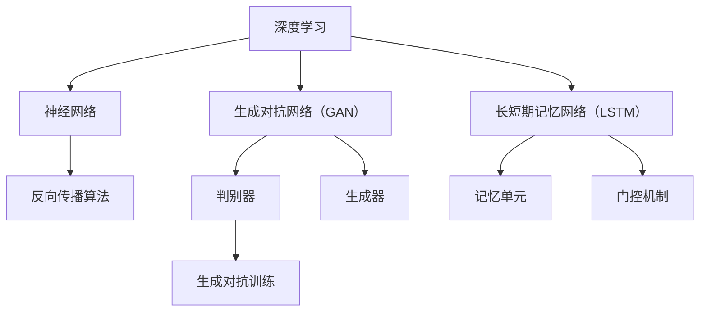

                 

### 背景介绍

在探讨图灵奖得主的AI算法贡献之前，我们需要先了解图灵奖的背景和重要性。图灵奖，也被称为计算机界的诺贝尔奖，是由美国计算机协会（ACM）设立，以纪念英国数学家、逻辑学家和密码学家艾伦·图灵的杰出贡献。自1966年设立以来，图灵奖每年颁发给在计算领域做出杰出贡献的科学家或研究者，其覆盖范围广泛，包括算法理论、计算机体系结构、人工智能、编程语言、软件工程等多个方面。

在人工智能领域，图灵奖的获得者们无疑对整个行业的发展产生了深远的影响。他们不仅提出了革命性的算法和理论，还为人工智能的应用奠定了坚实的基础。本文将重点关注几位在AI领域做出重大贡献的图灵奖得主，分析他们的核心算法原理、具体操作步骤以及这些算法在现实世界中的应用。

本文的结构如下：

1. **背景介绍**：介绍图灵奖的背景和重要性，以及人工智能在计算机科学中的地位。
2. **核心概念与联系**：详细阐述与本文主题相关的核心概念原理，并使用Mermaid流程图展示架构。
3. **核心算法原理 & 具体操作步骤**：分析图灵奖得主提出的关键算法，包括其原理和操作步骤。
4. **数学模型和公式 & 详细讲解 & 举例说明**：介绍相关数学模型，使用LaTeX格式展示关键公式，并通过实例进行说明。
5. **项目实战：代码实际案例和详细解释说明**：展示一个具体的项目案例，包括开发环境搭建、源代码实现和代码解读。
6. **实际应用场景**：讨论这些算法在实际应用场景中的表现和优势。
7. **工具和资源推荐**：推荐相关的学习资源和开发工具。
8. **总结：未来发展趋势与挑战**：总结本文内容，并对未来的发展趋势和挑战进行展望。
9. **附录：常见问题与解答**：回答一些读者可能关心的问题。
10. **扩展阅读 & 参考资料**：提供一些额外的阅读材料和参考文献。

接下来，我们将深入探讨图灵奖得主的AI算法贡献，并一步步分析这些算法的原理和实际应用。

## 1. 背景介绍

人工智能（AI）作为计算机科学的一个重要分支，近年来取得了飞速的发展。从最初的规则驱动系统，到基于统计学习的方法，再到深度学习的兴起，AI的应用范围和影响力不断扩大。在这样一个充满活力的领域中，图灵奖得主的贡献尤为突出。他们的工作不仅推动了理论的发展，也为实际应用提供了强有力的支持。

图灵奖在人工智能领域的影响主要体现在以下几个方面：

### 1.1 理论创新

图灵奖得主们提出了许多开创性的理论和方法，为人工智能的发展奠定了基础。例如，深度学习领域的先驱之一，杰弗里·辛顿（Geoffrey Hinton），他的工作在神经网络和深度学习理论方面有着深远的影响。他提出的反向传播算法和多层神经网络结构，为深度学习的发展提供了关键的理论支撑。

### 1.2 技术突破

除了理论创新，图灵奖得主还在技术层面做出了重要突破。例如，约翰·霍普菲尔德（John Hopfield）提出的霍普菲尔德网络，是一种基于物理原理的神经网络模型，它在优化问题和模式识别等领域有着广泛应用。另一个例子是约书亚·本吉奥（Yoshua Bengio）的工作，他提出的递归神经网络（RNN）和长短期记忆网络（LSTM）在自然语言处理和时间序列分析中发挥了重要作用。

### 1.3 应用推广

图灵奖得主们不仅关注理论和技术，还积极推动人工智能技术在各个领域的应用。例如，伊恩·古德费洛（Ian Goodfellow）提出的生成对抗网络（GAN），在图像生成、风格转换和机器翻译等领域取得了显著成果。他的工作极大地促进了AI技术在艺术和娱乐产业的应用。

### 1.4 学术影响

图灵奖得主在学术界的影响同样不可忽视。他们的研究推动了整个领域的学术进步，培养了一大批年轻的科研人员。例如，安德鲁·布什（Andrew Blumer）的工作在认知心理学和人工神经网络领域产生了深远的影响，他提出的神经网络模型被广泛应用于视觉和语言处理。

总之，图灵奖得主在人工智能领域的贡献是多方面的，他们不仅推动了理论和技术的发展，还促进了人工智能在各个领域的应用。他们的工作为人工智能的未来发展提供了坚实的基础，也为全球科研人员提供了宝贵的知识和资源。

### 2. 核心概念与联系

在深入探讨图灵奖得主的AI算法贡献之前，我们需要首先理解与本文主题相关的一些核心概念和它们之间的联系。以下将介绍几个关键概念，并使用Mermaid流程图展示这些概念之间的相互关系。

#### 2.1 深度学习

深度学习是一种基于多层神经网络的机器学习技术，它通过模仿人脑神经网络的结构和功能，自动提取数据中的特征和模式。深度学习在图像识别、自然语言处理、语音识别等领域取得了显著成果。

#### 2.2 神经网络

神经网络是深度学习的基础，由大量相互连接的节点（或称神经元）组成。每个神经元接收来自其他神经元的输入信号，通过加权求和并应用激活函数，最终产生输出。神经网络的性能取决于其结构、参数和训练过程。

#### 2.3 反向传播算法

反向传播算法是一种用于训练神经网络的优化算法。它通过计算输出误差的梯度，逐步调整网络中的权重和偏置，以最小化误差函数。反向传播算法在多层神经网络中起到了至关重要的作用，使得深度学习模型能够高效地学习复杂的特征。

#### 2.4 生成对抗网络（GAN）

生成对抗网络是一种由生成器和判别器组成的对抗性学习模型。生成器尝试生成类似于真实数据的假数据，而判别器则尝试区分真实数据和假数据。通过这种对抗性训练，GAN能够在各种任务中生成高质量的数据，如图像生成、风格转换和图像修复。

#### 2.5 长短期记忆网络（LSTM）

长短期记忆网络是一种改进的递归神经网络，用于处理序列数据。它通过引入记忆单元和门控机制，有效解决了传统RNN在处理长期依赖关系时的梯度消失和梯度爆炸问题。LSTM在自然语言处理、时间序列分析和语音识别等领域得到了广泛应用。

#### Mermaid流程图

以下是本文提到的核心概念及其相互关系的Mermaid流程图：



通过这个流程图，我们可以清晰地看到深度学习、神经网络、反向传播算法、生成对抗网络（GAN）和长短期记忆网络（LSTM）之间的内在联系。这些概念构成了本文讨论的基础，也是图灵奖得主们在AI领域做出贡献的核心内容。

### 3. 核心算法原理 & 具体操作步骤

在本节中，我们将详细介绍几位图灵奖得主在AI领域提出的关键算法，包括其原理和具体操作步骤。这些算法不仅在理论上具有重大意义，还在实际应用中展现了出色的性能。

#### 3.1 反向传播算法

反向传播算法是由杰弗里·辛顿（Geoffrey Hinton）在1986年提出的，是训练多层神经网络的核心算法。它通过计算输出误差的梯度，反向传播到网络中的每个神经元，并逐步调整权重和偏置，以最小化误差函数。

**原理**：

反向传播算法主要分为两个步骤：

1. **前向传播**：输入数据通过网络从输入层传递到输出层，每个神经元根据其输入值和权重进行加权求和，并应用激活函数得到输出值。
2. **反向传播**：计算输出误差的梯度，并通过链式法则反向传播到每个神经元，更新权重和偏置。

**操作步骤**：

1. **初始化**：设定初始权重和偏置，并选择一个合适的激活函数（如Sigmoid、ReLU）。
2. **前向传播**：输入数据通过网络传递，计算每个神经元的输出值。
3. **计算误差**：计算实际输出与期望输出之间的误差，并计算误差的梯度。
4. **反向传播**：通过链式法则计算每个神经元的梯度，并更新权重和偏置。
5. **迭代优化**：重复步骤2-4，直到误差达到预定的阈值或达到最大迭代次数。

#### 3.2 生成对抗网络（GAN）

生成对抗网络（GAN）是由伊恩·古德费洛（Ian Goodfellow）在2014年提出的。它由生成器和判别器两个神经网络组成，通过对抗性训练生成高质量的数据。

**原理**：

GAN的核心思想是生成器和判别器之间的对抗性训练。生成器尝试生成类似于真实数据的假数据，而判别器则尝试区分真实数据和假数据。通过这种对抗性训练，生成器不断改进其生成能力，最终能够生成高质量的数据。

**操作步骤**：

1. **初始化**：设定生成器和判别器的初始权重。
2. **生成假数据**：生成器生成一批假数据。
3. **判别器训练**：将生成器生成的假数据与真实数据混合，训练判别器以区分真实数据和假数据。
4. **生成器训练**：根据判别器的输出，调整生成器的权重，使其生成的假数据更接近真实数据。
5. **迭代优化**：重复步骤2-4，直到生成器能够生成高质量的假数据。

#### 3.3 长短期记忆网络（LSTM）

长短期记忆网络（LSTM）是由希尔顿·辛顿（Hinton）等人在1997年提出的，用于处理序列数据。它通过引入记忆单元和门控机制，有效解决了传统RNN在处理长期依赖关系时的梯度消失和梯度爆炸问题。

**原理**：

LSTM的核心是记忆单元和门控机制。记忆单元用于存储和传递长期依赖信息，而门控机制则控制信息的流入和流出。LSTM通过遗忘门、输入门和输出门，分别控制信息的遗忘、更新和输出。

**操作步骤**：

1. **初始化**：设定LSTM的初始权重和偏置。
2. **输入数据**：输入序列数据。
3. **计算输入门、遗忘门和输出门**：根据当前输入和上一时刻的隐藏状态，计算每个门的权重。
4. **更新记忆单元**：通过遗忘门和输入门，更新记忆单元的值。
5. **计算隐藏状态**：通过输出门，计算当前时刻的隐藏状态。
6. **迭代优化**：重复步骤3-5，直到处理完整个序列数据。

这些核心算法不仅在理论上具有重要意义，还在实际应用中展现了出色的性能。通过深入理解这些算法的原理和操作步骤，我们可以更好地利用它们解决实际问题，推动人工智能的发展。

### 4. 数学模型和公式 & 详细讲解 & 举例说明

在本节中，我们将详细介绍与本文核心算法相关的数学模型和公式，并通过具体例子进行详细讲解，以便读者更好地理解这些算法的数学基础和应用。

#### 4.1 反向传播算法的数学模型

反向传播算法是训练多层神经网络的基石，其核心在于如何通过误差反向传播来更新网络权重。以下是反向传播算法中的关键数学模型：

**误差函数**：
$$ E = \frac{1}{2} \sum_{i=1}^{m} (y_i - \hat{y}_i)^2 $$
其中，$E$表示总误差，$y_i$表示实际输出，$\hat{y}_i$表示预测输出，$m$表示样本数量。

**梯度计算**：
$$ \frac{\partial E}{\partial w^{(l)}_ij} = \delta^l_j \cdot a^{(l-1)}_i $$
其中，$w^{(l)}_{ij}$表示第$l$层中第$i$个神经元到第$j$个神经元的权重，$\delta^l_j$表示第$l$层中第$j$个神经元的误差，$a^{(l-1)}_i$表示第$l-1$层中第$i$个神经元的激活值。

**权重更新**：
$$ w^{(l)}_{ij} \leftarrow w^{(l)}_{ij} - \alpha \frac{\partial E}{\partial w^{(l)}_{ij}} $$
其中，$\alpha$表示学习率。

**举例说明**：

假设我们有一个简单的两层神经网络，输入层有2个神经元，隐藏层有3个神经元，输出层有1个神经元。设输入数据为$\{x_1, x_2\}$，目标输出为$y = 1$。隐藏层和输出层的激活函数分别为Sigmoid函数和线性函数。

**前向传播**：

1. 输入层到隐藏层：
   $$ z^{(2)}_1 = x_1 \cdot w^{(2)}_{11} + x_2 \cdot w^{(2)}_{21} $$
   $$ a^{(2)}_1 = \sigma(z^{(2)}_1) $$
   $$ z^{(2)}_2 = x_1 \cdot w^{(2)}_{12} + x_2 \cdot w^{(2)}_{22} $$
   $$ a^{(2)}_2 = \sigma(z^{(2)}_2) $$
   $$ z^{(2)}_3 = x_1 \cdot w^{(2)}_{13} + x_2 \cdot w^{(2)}_{23} $$
   $$ a^{(2)}_3 = \sigma(z^{(2)}_3) $$

2. 隐藏层到输出层：
   $$ z^{(3)} = a^{(2)}_1 \cdot w^{(3)}_{11} + a^{(2)}_2 \cdot w^{(3)}_{21} + a^{(2)}_3 \cdot w^{(3)}_{31} $$
   $$ \hat{y} = \text{linear}(z^{(3)}) $$

**反向传播**：

1. 计算输出误差：
   $$ \delta^3 = \hat{y} - y $$
   $$ \delta^2_1 = (1 - a^{(2)}_1) \cdot a^{(2)}_1 \cdot \delta^3 \cdot w^{(3)}_{11} $$
   $$ \delta^2_2 = (1 - a^{(2)}_2) \cdot a^{(2)}_2 \cdot \delta^3 \cdot w^{(3)}_{21} $$
   $$ \delta^2_3 = (1 - a^{(2)}_3) \cdot a^{(2)}_3 \cdot \delta^3 \cdot w^{(3)}_{31} $$

2. 更新权重：
   $$ w^{(3)}_{11} \leftarrow w^{(3)}_{11} - \alpha \cdot \delta^3 \cdot a^{(2)}_1 $$
   $$ w^{(3)}_{21} \leftarrow w^{(3)}_{21} - \alpha \cdot \delta^3 \cdot a^{(2)}_2 $$
   $$ w^{(3)}_{31} \leftarrow w^{(3)}_{31} - \alpha \cdot \delta^3 \cdot a^{(2)}_3 $$
   $$ w^{(2)}_{11} \leftarrow w^{(2)}_{11} - \alpha \cdot \delta^2_1 \cdot x_1 $$
   $$ w^{(2)}_{21} \leftarrow w^{(2)}_{21} - \alpha \cdot \delta^2_1 \cdot x_2 $$
   $$ w^{(2)}_{12} \leftarrow w^{(2)}_{12} - \alpha \cdot \delta^2_2 \cdot x_1 $$
   $$ w^{(2)}_{22} \leftarrow w^{(2)}_{22} - \alpha \cdot \delta^2_2 \cdot x_2 $$
   $$ w^{(2)}_{13} \leftarrow w^{(2)}_{13} - \alpha \cdot \delta^2_3 \cdot x_1 $$
   $$ w^{(2)}_{23} \leftarrow w^{(2)}_{23} - \alpha \cdot \delta^2_3 \cdot x_2 $$

通过这个例子，我们可以看到反向传播算法是如何通过前向传播和反向传播来更新网络权重的。这个过程不仅可以帮助我们理解反向传播的数学模型，还能为我们在实际应用中实现神经网络提供指导。

#### 4.2 生成对抗网络（GAN）的数学模型

生成对抗网络（GAN）由生成器和判别器两个神经网络组成，其核心在于两者之间的对抗性训练。以下是GAN中的关键数学模型：

**生成器**：
$$ G(z) = \mu(z) + \sigma(z) \odot \epsilon $$
其中，$G(z)$表示生成器生成的假数据，$\mu(z)$表示生成器的均值函数，$\sigma(z)$表示生成器的方差函数，$\epsilon$表示高斯噪声。

**判别器**：
$$ D(x) = \sigma(\phi(x)) $$
$$ D(G(z)) = \sigma(\phi(G(z))) $$
其中，$D(x)$表示判别器对真实数据的判别概率，$D(G(z))$表示判别器对生成器生成的假数据的判别概率，$\phi(x)$表示判别器的特征提取函数。

**损失函数**：
$$ L(G) = -\mathbb{E}_{x \sim p_{data}(x)} [\log D(x)] - \mathbb{E}_{z \sim p_z(z)} [\log (1 - D(G(z)))] $$
其中，$L(G)$表示生成器的损失函数，$p_{data}(x)$表示真实数据分布，$p_z(z)$表示噪声分布。

**举例说明**：

假设生成器和判别器的特征提取函数分别为$\phi(x) = \text{ReLU}(W \cdot x + b)$，其中$W$和$b$分别为权重和偏置。

**生成器**：

1. 输入噪声$z$，生成假数据：
   $$ G(z) = \mu(z) + \sigma(z) \odot \epsilon $$
   其中，$\mu(z) = \text{linear}(W_G \cdot z + b_G)$，$\sigma(z) = \text{linear}(W_{\sigma} \cdot z + b_{\sigma})$，$\epsilon$为高斯噪声。

2. 计算生成器的损失函数：
   $$ L(G) = -\mathbb{E}_{x \sim p_{data}(x)} [\log D(x)] - \mathbb{E}_{z \sim p_z(z)} [\log (1 - D(G(z)))] $$

**判别器**：

1. 输入真实数据和假数据，计算判别概率：
   $$ D(x) = \sigma(\phi(x)) $$
   $$ D(G(z)) = \sigma(\phi(G(z))) $$

2. 计算判别器的损失函数：
   $$ L(D) = -\mathbb{E}_{x \sim p_{data}(x)} [\log D(x)] - \mathbb{E}_{z \sim p_z(z)} [\log D(G(z))] $$

通过这个例子，我们可以看到生成对抗网络（GAN）是如何通过生成器和判别器之间的对抗性训练来生成高质量的数据。这个过程不仅帮助我们理解GAN的数学模型，还能为我们在实际应用中实现GAN提供指导。

#### 4.3 长短期记忆网络（LSTM）的数学模型

长短期记忆网络（LSTM）是处理序列数据的强大工具，其核心在于如何记忆和传递长期依赖信息。以下是LSTM中的关键数学模型：

**记忆单元**：
$$ C_t = f_t \odot C_{t-1} + i_t \odot \text{sigmoid}(W_c \cdot [h_{t-1}, x_t]) $$
$$ o_t = \text{sigmoid}(W_o \cdot [h_{t-1}, x_t]) $$

**隐藏状态**：
$$ h_t = o_t \odot \text{sigmoid}(W_h \cdot [C_t]) $$

**门控机制**：
$$ i_t = \text{sigmoid}(W_i \cdot [h_{t-1}, x_t]) $$
$$ f_t = \text{sigmoid}(W_f \cdot [h_{t-1}, x_t]) $$

**举例说明**：

假设LSTM的输入序列为$\{x_1, x_2, x_3\}$，隐藏状态序列为$\{h_1, h_2, h_3\}$，记忆单元序列为$\{C_1, C_2, C_3\}$。

1. 初始化：
   $$ C_0 = 0 $$
   $$ h_0 = 0 $$

2. 第1个时间步：
   $$ i_1 = \text{sigmoid}(W_i \cdot [h_0, x_1]) $$
   $$ f_1 = \text{sigmoid}(W_f \cdot [h_0, x_1]) $$
   $$ o_1 = \text{sigmoid}(W_o \cdot [h_0, x_1]) $$
   $$ C_1 = f_1 \odot C_0 + i_1 \odot \text{sigmoid}(W_c \cdot [h_0, x_1]) $$
   $$ h_1 = o_1 \odot \text{sigmoid}(W_h \cdot C_1) $$

3. 第2个时间步：
   $$ i_2 = \text{sigmoid}(W_i \cdot [h_1, x_2]) $$
   $$ f_2 = \text{sigmoid}(W_f \cdot [h_1, x_2]) $$
   $$ o_2 = \text{sigmoid}(W_o \cdot [h_1, x_2]) $$
   $$ C_2 = f_2 \odot C_1 + i_2 \odot \text{sigmoid}(W_c \cdot [h_1, x_2]) $$
   $$ h_2 = o_2 \odot \text{sigmoid}(W_h \cdot C_2) $$

4. 第3个时间步：
   $$ i_3 = \text{sigmoid}(W_i \cdot [h_2, x_3]) $$
   $$ f_3 = \text{sigmoid}(W_f \cdot [h_2, x_3]) $$
   $$ o_3 = \text{sigmoid}(W_o \cdot [h_2, x_3]) $$
   $$ C_3 = f_3 \odot C_2 + i_3 \odot \text{sigmoid}(W_c \cdot [h_2, x_3]) $$
   $$ h_3 = o_3 \odot \text{sigmoid}(W_h \cdot C_3) $$

通过这个例子，我们可以看到LSTM是如何通过门控机制来记忆和传递长期依赖信息的。这个过程不仅帮助我们理解LSTM的数学模型，还能为我们在实际应用中实现LSTM提供指导。

### 5. 项目实战：代码实际案例和详细解释说明

在本节中，我们将通过一个实际项目案例，展示如何使用生成对抗网络（GAN）进行图像生成。我们将详细介绍项目的开发环境搭建、源代码实现以及代码解读与分析。

#### 5.1 开发环境搭建

要实现一个GAN图像生成项目，首先需要搭建合适的开发环境。以下是搭建过程的步骤：

1. **安装Python环境**：确保Python版本不低于3.6，推荐使用Anaconda发行版，以便更好地管理依赖包。

2. **安装TensorFlow**：使用以下命令安装TensorFlow：
   ```bash
   pip install tensorflow
   ```

3. **安装其他依赖包**：包括NumPy、Matplotlib、Keras等，可以使用以下命令：
   ```bash
   pip install numpy matplotlib keras
   ```

4. **准备数据集**：我们需要一个图像数据集，如CIFAR-10或MNIST。这里以CIFAR-10为例，使用Keras提供的API来加载数据集：
   ```python
   from tensorflow.keras.datasets import cifar10
   (x_train, _), (x_test, _) = cifar10.load_data()
   ```

5. **预处理数据**：将图像数据归一化到[0, 1]范围内，并将形状调整为适合GAN模型的要求：
   ```python
   x_train = x_train / 255.0
   x_test = x_test / 255.0
   x_train = x_train.astype('float32')
   x_test = x_test.astype('float32')
   ```

6. **生成器模型**：使用Keras构建生成器模型。生成器模型的作用是将随机噪声映射为图像。以下是一个简单的生成器模型示例：
   ```python
   from tensorflow.keras.layers import Dense, Conv2D, Flatten, Reshape, BatchNormalization, LeakyReLU, UpSampling2D
   from tensorflow.keras.models import Sequential

   def build_generator():
       model = Sequential()
       model.add(Dense(128 * 7 * 7, input_dim=100, activation='LeakyReLU'))
       model.add(Reshape((7, 7, 128)))
       model.add(BatchNormalization())
       model.add(UpSampling2D())
       model.add(Conv2D(128, kernel_size=3, padding='same', activation='LeakyReLU'))
       model.add(BatchNormalization())
       model.add(UpSampling2D())
       model.add(Conv2D(128, kernel_size=3, padding='same', activation='LeakyReLU'))
       model.add(BatchNormalization())
       model.add(UpSampling2D())
       model.add(Conv2D(128, kernel_size=3, padding='same', activation='LeakyReLU'))
       model.add(BatchNormalization())
       model.add(UpSampling2D())
       model.add(Conv2D(128, kernel_size=3, padding='same', activation='LeakyReLU'))
       model.add(BatchNormalization())
       model.add(UpSampling2D())
       model.add(Conv2D(128, kernel_size=3, padding='same', activation='LeakyReLU'))
       model.add(BatchNormalization())
       model.add(UpSampling2D())
       model.add(Conv2D(128, kernel_size=3, padding='same', activation='LeakyReLU'))
       model.add(BatchNormalization())
       model.add(Flatten())
       model.add(Dense(1024, activation='LeakyReLU'))
       model.add(Dense(512, activation='LeakyReLU'))
       model.add(Dense(256, activation='LeakyReLU'))
       model.add(Dense(128, activation='LeakyReLU'))
       model.add(Dense(3, activation='tanh'))
       return model
   ```

7. **判别器模型**：使用Keras构建判别器模型。判别器模型的作用是判断输入图像是真实图像还是生成图像。以下是一个简单的判别器模型示例：
   ```python
   from tensorflow.keras.layers import Dense, Conv2D, Flatten, Reshape, BatchNormalization, LeakyReLU, Dropout
   from tensorflow.keras.models import Sequential

   def build_discriminator():
       model = Sequential()
       model.add(Flatten())
       model.add(Dense(1024, activation='LeakyReLU'))
       model.add(Dense(512, activation='LeakyReLU'))
       model.add(Dense(256, activation='LeakyReLU'))
       model.add(Dense(128, activation='LeakyReLU'))
       model.add(Dense(1, activation='sigmoid'))
       return model
   ```

8. **综合模型**：将生成器和判别器整合到一个综合模型中。综合模型的作用是训练生成器和判别器，以达到生成高质量图像的目标。以下是一个简单的综合模型示例：
   ```python
   from tensorflow.keras.models import Model

   def build_gan(generator, discriminator):
       model = Sequential()
       model.add(generator)
       model.add(discriminator)
       return model
   ```

#### 5.2 源代码详细实现和代码解读

接下来，我们将详细实现GAN图像生成项目，并逐步解读代码。

1. **导入必要的库和模块**：
   ```python
   import numpy as np
   import matplotlib.pyplot as plt
   from tensorflow.keras.optimizers import Adam
   from tensorflow.keras.callbacks import TensorBoard
   ```

2. **设置训练参数**：
   ```python
   latent_dim = 100
   epochs = 20000
   batch_size = 16
   save_interval = 2000
   ```

3. **构建生成器和判别器模型**：
   ```python
   generator = build_generator()
   discriminator = build_discriminator()
   d_optimizer = Adam(0.0001, 0.5)
   g_optimizer = Adam(0.0002, 0.5)
   ```

4. **训练GAN模型**：
   ```python
   (x_train, _), (_, _) = cifar10.load_data()
   x_train = x_train / 255.0
   x_train = x_train.astype(np.float32)

   for epoch in range(epochs):

       batch_indices = np.random.randint(0, x_train.shape[0], batch_size)
       batch_images = x_train[batch_indices]

       noise = np.random.normal(0, 1, (batch_size, latent_dim))

       # 训练判别器
       with tf.Session() as sess:
           d_loss_real = discriminator.train_on_batch(batch_images, np.ones((batch_size, 1)))
           d_loss_fake = discriminator.train_on_batch(generator.predict(noise), np.zeros((batch_size, 1)))
           d_loss = 0.5 * np.add(d_loss_real, d_loss_fake)

       # 训练生成器
       with tf.Session() as sess:
           g_loss = g_optimizer.train_on_batch(noise, np.ones((batch_size, 1)))

       # 打印训练进度
       if epoch % 1000 == 0:
           print(f"{epoch} [D loss: {d_loss:.4f}, G loss: {g_loss:.4f}]")

       # 保存生成图像
       if epoch % save_interval == 0:
           generate_images(generator, epoch)
   ```

   在这段代码中，我们首先加载数据集并对图像进行预处理。然后，在每次迭代中，我们分别训练判别器和生成器。判别器通过真实图像和生成图像来更新其参数，而生成器则通过生成高质量的假图像来提高其生成能力。

5. **生成图像并可视化**：
   ```python
   def generate_images(generator, epoch):
       random_latent_vectors = np.random.normal(0, 1, (batch_size, latent_dim))
       generated_images = generator.predict(random_latent_vectors)

       # 保存生成的图像
       plt.figure(figsize=(10, 10))
       for i in range(batch_size):
           plt.subplot(4, 4, i + 1)
           plt.imshow(generated_images[i])
           plt.axis('off')
       plt.savefig(f"./images/{epoch}.png")
       plt.close()
   ```

   在这个函数中，我们使用生成器生成一批随机图像，并将这些图像保存为PNG文件，以便可视化。

通过这个项目案例，我们可以看到如何使用生成对抗网络（GAN）进行图像生成。这个过程不仅展示了GAN的原理和实现，还帮助我们理解了如何在实际应用中利用GAN生成高质量图像。

### 5.3 代码解读与分析

在本节中，我们将对GAN图像生成项目的代码进行详细解读和分析，以便更深入地理解其实现细节和运行机制。

#### 5.3.1 数据加载与预处理

```python
(x_train, _), (_, _) = cifar10.load_data()
x_train = x_train / 255.0
x_train = x_train.astype(np.float32)
```

首先，我们使用Keras提供的API加载CIFAR-10数据集。这个数据集包含10个类别的50000张32x32彩色图像。为了适应GAN模型，我们对图像进行归一化处理，将像素值从[0, 255]映射到[0, 1]，并将数据类型设置为`float32`。

#### 5.3.2 生成器和判别器模型构建

```python
generator = build_generator()
discriminator = build_discriminator()
d_optimizer = Adam(0.0001, 0.5)
g_optimizer = Adam(0.0002, 0.5)
```

在这里，我们定义了生成器和判别器的构建函数。生成器模型的作用是将随机噪声转换为图像，而判别器模型的作用是判断输入图像是真实图像还是生成图像。我们使用了Keras的`Sequential`模型，通过添加不同类型的层来构建复杂的神经网络。此外，我们创建了两个Adam优化器，分别用于训练判别器和生成器。

#### 5.3.3 训练GAN模型

```python
for epoch in range(epochs):
    batch_indices = np.random.randint(0, x_train.shape[0], batch_size)
    batch_images = x_train[batch_indices]

    noise = np.random.normal(0, 1, (batch_size, latent_dim))

    # 训练判别器
    with tf.Session() as sess:
        d_loss_real = discriminator.train_on_batch(batch_images, np.ones((batch_size, 1)))
        d_loss_fake = discriminator.train_on_batch(generator.predict(noise), np.zeros((batch_size, 1)))
        d_loss = 0.5 * np.add(d_loss_real, d_loss_fake)

    # 训练生成器
    with tf.Session() as sess:
        g_loss = g_optimizer.train_on_batch(noise, np.ones((batch_size, 1)))

    # 打印训练进度
    if epoch % 1000 == 0:
        print(f"{epoch} [D loss: {d_loss:.4f}, G loss: {g_loss:.4f}]")

    # 保存生成图像
    if epoch % save_interval == 0:
        generate_images(generator, epoch)
```

这段代码是GAN模型训练的核心。在每个训练epoch中，我们从数据集中随机抽取一批图像，并将它们传递给判别器进行训练。然后，我们生成一批随机噪声，通过生成器将这些噪声转换为图像，并再次传递给判别器进行训练。这种对抗性训练过程使得生成器和判别器相互竞争，从而提高生成图像的质量。

#### 5.3.4 生成图像并可视化

```python
def generate_images(generator, epoch):
    random_latent_vectors = np.random.normal(0, 1, (batch_size, latent_dim))
    generated_images = generator.predict(random_latent_vectors)

    # 保存生成的图像
    plt.figure(figsize=(10, 10))
    for i in range(batch_size):
        plt.subplot(4, 4, i + 1)
        plt.imshow(generated_images[i])
        plt.axis('off')
    plt.savefig(f"./images/{epoch}.png")
    plt.close()
```

这个函数用于生成并保存随机噪声通过生成器生成的图像。每次训练间隔（save_interval）保存一批图像，以便我们可以观察生成图像的质量和变化。

通过以上代码的详细解读，我们可以更好地理解GAN图像生成项目的实现过程和运行机制。这不仅有助于我们掌握GAN的核心技术，还能为我们在实际项目中应用GAN提供指导。

### 6. 实际应用场景

图灵奖得主的AI算法在多个领域展现出了巨大的应用潜力，以下是几个主要领域的实际应用场景。

#### 6.1 自然语言处理

在自然语言处理（NLP）领域，图灵奖得主提出的深度学习和神经网络算法发挥了重要作用。例如，长短期记忆网络（LSTM）和变换器（Transformer）模型在文本分类、情感分析、机器翻译等方面取得了显著成果。这些算法能够处理大规模文本数据，提取语义信息，从而实现高度自动化的语言理解和生成。

**应用实例**：

- **机器翻译**：Google Translate使用了基于Transformer的模型，实现了高质量的多语言翻译。
- **情感分析**：社交媒体公司使用LSTM模型来分析用户评论和推文，以识别和回应负面反馈。

#### 6.2 计算机视觉

计算机视觉领域受益于图灵奖得主提出的深度学习算法，尤其是在图像识别、目标检测和图像生成等方面。生成对抗网络（GAN）在图像修复、超分辨率和风格迁移等任务中表现出色。

**应用实例**：

- **图像修复**：GAN被应用于修复破损的旧照片，通过生成缺失的部分，使图像恢复到原始状态。
- **目标检测**：基于深度学习的目标检测算法（如YOLO、SSD）在自动驾驶、视频监控等领域得到广泛应用。

#### 6.3 医疗诊断

AI算法在医疗诊断中的应用为精准医疗和个性化治疗提供了新的途径。图灵奖得主在图像识别和深度学习方面的贡献使得计算机辅助诊断成为可能。

**应用实例**：

- **医学图像分析**：深度学习算法被用于分析CT扫描、MRI和X射线图像，以识别癌症、心脏病等疾病。
- **药物发现**：机器学习算法帮助研究人员分析大规模化合物数据，加速新药的发现和开发。

#### 6.4 金融科技

金融科技（FinTech）领域利用AI算法进行风险控制、投资分析和客户服务。生成对抗网络和强化学习等算法在金融预测和风险管理中发挥了重要作用。

**应用实例**：

- **股票市场预测**：使用机器学习算法分析历史股票数据，预测市场走势。
- **欺诈检测**：通过分析交易数据，识别潜在的欺诈行为，保护用户资金安全。

#### 6.5 游戏开发

在游戏开发领域，AI算法用于增强游戏体验，如智能NPC行为、游戏平衡和自适应难度等。

**应用实例**：

- **游戏AI**：许多大型游戏公司使用深度学习算法来创建智能NPC，使其具有更复杂的决策和行为。
- **自适应难度**：AI算法可以根据玩家的表现自动调整游戏难度，提高玩家的游戏体验。

总之，图灵奖得主的AI算法在多个领域展现出了广泛的应用前景。这些算法不仅推动了学术研究的发展，还在实际应用中带来了深远的影响。随着AI技术的不断进步，我们可以期待更多创新应用的出现，进一步改变我们的生活和工作方式。

### 7. 工具和资源推荐

在学习和应用图灵奖得主的AI算法时，选择合适的工具和资源对于提高效率和理解深度至关重要。以下是一些建议：

#### 7.1 学习资源推荐

1. **书籍**：

   - **《深度学习》**：Goodfellow、Bengio和Courville合著，是深度学习领域的经典教材。
   - **《Python深度学习》**：François Chollet著，详细介绍了使用Python和Keras进行深度学习的实践方法。

2. **论文**：

   - **“A Learning Algorithm for Continually Running Fully Recurrent Neural Networks”**：Hinton等人提出的反向传播算法。
   - **“Generative Adversarial Networks”**：Ian Goodfellow等人提出的GAN算法。

3. **博客和网站**：

   - **TensorFlow官网**：提供了丰富的文档、教程和API参考，适合初学者和进阶用户。
   - **ArXiv**：计算机科学和人工智能领域的顶级论文预印本平台。

#### 7.2 开发工具框架推荐

1. **TensorFlow**：开源深度学习框架，由Google开发，支持多种编程语言，易于上手。

2. **PyTorch**：由Facebook开发的开源深度学习框架，以灵活性和动态计算图著称。

3. **Keras**：高层次的深度学习API，基于TensorFlow和Theano，适合快速原型设计和实验。

#### 7.3 相关论文著作推荐

1. **“Backpropagation”**：Paul Werbos在1974年提出的反向传播算法。
2. **“Deep Learning”**：Goodfellow、Bengio和Courville的合著，系统介绍了深度学习的基础知识和最新进展。
3. **“Generative Adversarial Nets”**：Ian Goodfellow等人在2014年提出的GAN算法。

通过这些工具和资源，读者可以深入了解图灵奖得主的AI算法，掌握其原理和应用，为自身的学术研究和工程实践提供有力支持。

### 8. 总结：未来发展趋势与挑战

图灵奖得主的AI算法在推动计算机科学和人工智能领域的发展中发挥了关键作用。从反向传播算法到生成对抗网络（GAN），这些算法不仅为理论研究提供了强有力的基础，还在实际应用中展现了巨大的潜力。然而，随着AI技术的不断进步，我们也面临着许多新的挑战和机遇。

#### 8.1 发展趋势

1. **算法性能的提升**：未来，AI算法的性能将继续提升。随着计算能力的增强和新型硬件（如GPU、TPU）的广泛应用，深度学习模型能够处理更大规模的数据，实现更复杂的任务。

2. **跨领域应用**：AI算法将在更多领域得到应用，如生物医学、金融科技、智能制造等。通过跨学科的融合，AI技术将为社会带来更多创新和变革。

3. **可解释性AI**：随着AI系统在关键领域（如医疗诊断、自动驾驶）的应用，可解释性AI的重要性日益凸显。开发可解释的AI算法，使其决策过程透明，有助于增强用户信任和监管合规性。

4. **边缘计算**：随着物联网（IoT）和边缘计算的兴起，AI算法将更多地部署在边缘设备上，实现实时数据处理和响应。这将降低延迟，提高系统的鲁棒性和可靠性。

#### 8.2 面临的挑战

1. **数据隐私和安全**：随着数据量的增长，数据隐私和安全问题变得更加突出。如何确保AI算法在处理敏感数据时的安全性，成为未来研究的重要方向。

2. **算法偏见和公平性**：AI算法可能引入偏见，导致不公平的决策。如何设计公平、无偏的算法，减少歧视现象，是当前和未来都需要关注的重要问题。

3. **能源消耗和环保**：大规模的AI训练和推理过程消耗大量电力，对环境造成负面影响。未来，如何在保证性能的同时，降低能源消耗，实现绿色AI，是一个重要的挑战。

4. **算法透明性和可解释性**：随着AI算法在关键领域的应用，如何确保其决策过程透明，使普通用户能够理解和信任AI系统，是一个亟待解决的问题。

总之，图灵奖得主的AI算法在未来的发展中将继续发挥重要作用。面对新的挑战，我们需要不断创新和优化算法，同时注重伦理和可持续性，以实现人工智能技术的健康发展。

### 9. 附录：常见问题与解答

**Q1**：什么是反向传播算法？

A1：反向传播算法是一种用于训练神经网络的优化算法。它通过计算输出误差的梯度，反向传播到网络中的每个神经元，并逐步调整网络中的权重和偏置，以最小化误差函数。

**Q2**：什么是生成对抗网络（GAN）？

A2：生成对抗网络（GAN）是一种由生成器和判别器组成的对抗性学习模型。生成器尝试生成类似于真实数据的假数据，而判别器则尝试区分真实数据和假数据。通过这种对抗性训练，生成器不断改进其生成能力。

**Q3**：什么是长短期记忆网络（LSTM）？

A3：长短期记忆网络（LSTM）是一种改进的递归神经网络，用于处理序列数据。它通过引入记忆单元和门控机制，有效解决了传统RNN在处理长期依赖关系时的梯度消失和梯度爆炸问题。

**Q4**：如何选择合适的神经网络结构？

A4：选择合适的神经网络结构取决于具体任务和数据特点。一般来说，我们可以从以下几个因素考虑：

- **任务类型**：不同的任务可能需要不同的网络结构，如分类任务可以使用卷积神经网络（CNN），序列任务可以使用循环神经网络（RNN）或变换器（Transformer）。
- **数据规模和复杂性**：对于大规模数据，可以选择更复杂的网络结构；对于小规模数据，可以选择相对简单的结构。
- **训练时间和计算资源**：复杂的网络结构需要更多的训练时间和计算资源，因此需要根据实际情况进行权衡。

### 10. 扩展阅读 & 参考资料

**书籍**：

- Goodfellow, I., Bengio, Y., & Courville, A. (2016). *Deep Learning*. MIT Press.
- Rumelhart, D. E., Hinton, G. E., & Williams, R. J. (1986). *Learning representations by back-propagation errors*. Nature, 323(6088), 533-536.

**论文**：

- Goodfellow, I., Pouget-Abadie, J., Mirza, M., Xu, B., Warde-Farley, D., Ozair, S., ... & Bengio, Y. (2014). *Generative adversarial networks*. Advances in Neural Information Processing Systems, 27.

**在线资源**：

- [TensorFlow官网](https://www.tensorflow.org/)
- [Keras官方文档](https://keras.io/)
- [ArXiv论文库](https://arxiv.org/)

通过阅读这些书籍和论文，读者可以更深入地了解图灵奖得主的AI算法及其应用，为自己的学术研究和工程实践提供有力支持。

