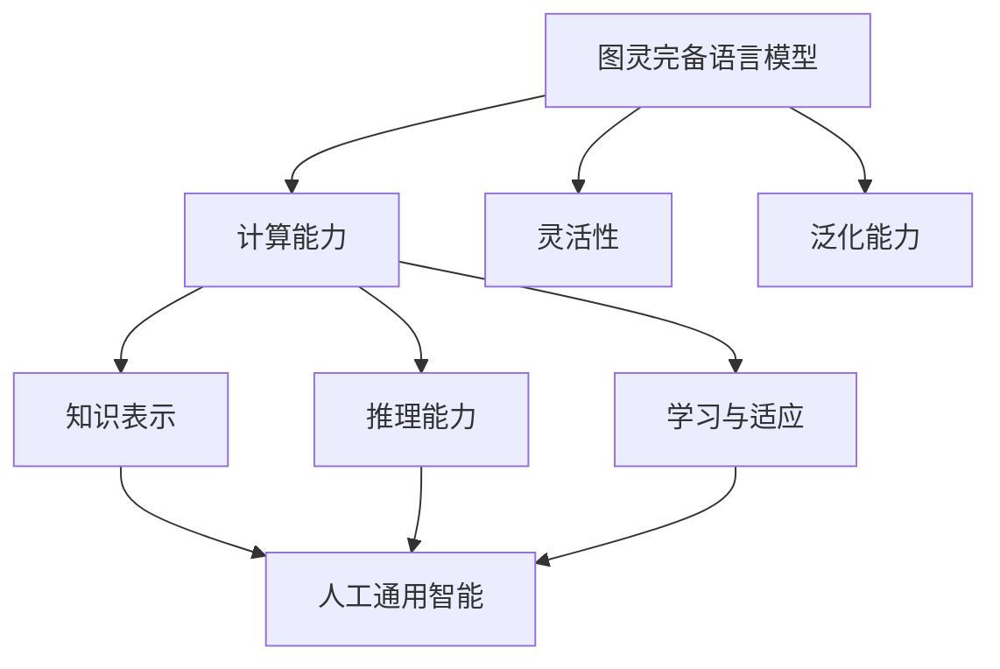
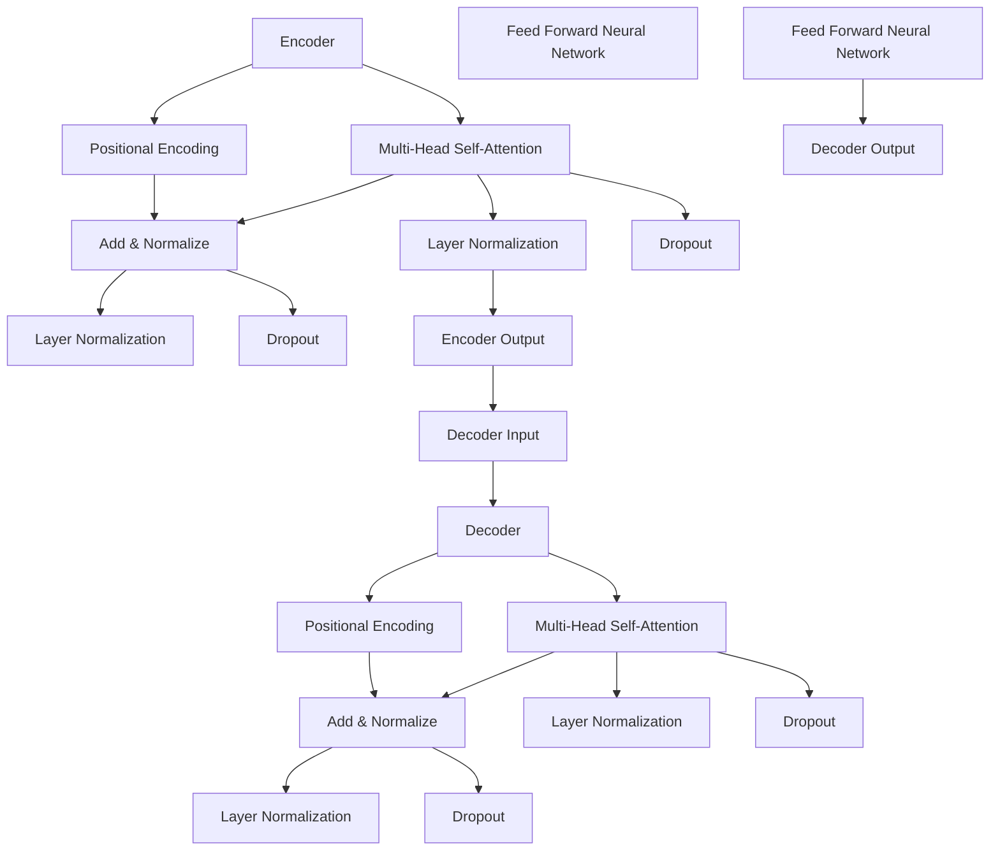

                 

### 图灵完备 LLM：通向人工通用智能的桥梁

> **关键词**：图灵完备、语言模型、人工通用智能、深度学习、自然语言处理、推理能力

> **摘要**：本文深入探讨了图灵完备语言模型（LLM）在通向人工通用智能（AGI）中的关键作用。从背景介绍、核心概念到实际应用场景，本文将逐步分析图灵完备 LLM 如何突破传统人工智能的局限，实现更加智能化和多样化的功能。同时，本文还将讨论未来的发展趋势与挑战，为读者提供全面而深入的见解。

## 1. 背景介绍

### 1.1 人工智能的发展历程

人工智能（AI）作为一个多学科交叉的领域，从诞生之初就承载着模拟人类智能、解决复杂问题的梦想。回顾人工智能的发展历程，大致可以分为以下几个阶段：

- **第一阶段（20世纪50年代至70年代）**：以符号主义方法为代表，试图通过逻辑推理和知识表示来模拟人类智能。这一阶段的典型代表是艾伦·图灵（Alan Turing）提出的图灵测试。

- **第二阶段（20世纪80年代至90年代）**：随着计算能力和算法的进步，专家系统、机器学习等方法开始崛起。这一阶段的主要目标是利用已有知识来解决问题。

- **第三阶段（21世纪至今）**：深度学习和大数据技术的飞速发展，使得机器学习成为人工智能的主流方法。神经网络、卷积神经网络（CNN）、循环神经网络（RNN）等模型在各种任务上取得了显著的成果。

### 1.2 人工通用智能的概念

人工通用智能（Artificial General Intelligence，AGI）是指一种能够像人类一样在多种任务上表现优异的人工智能系统。AGI 的目标是实现真正意义上的智能，具备自我学习、推理、理解、情感和创造力等多种能力。与当前的人工智能系统（如专用的图像识别、自然语言处理等）相比，AGI 具有更加广泛和灵活的应用前景。

### 1.3 图灵完备语言模型的发展

图灵完备（Turing-complete）是指一种计算模型，能够模拟任何其他计算模型。图灵完备语言模型（LLM）作为一种能够处理自然语言的计算模型，逐渐成为实现 AGI 的重要工具。LLM 的代表性模型包括 Transformer、GPT、BERT 等，这些模型在语言理解、生成、翻译等方面取得了突破性进展。

## 2. 核心概念与联系

### 2.1 语言模型的基本原理

语言模型（Language Model，LM）是一种统计模型，用于预测一段文本的下一个单词或字符。语言模型的核心任务是从已知的文本数据中学习语言规律，从而实现对未知文本的生成和预测。

语言模型可以分为基于 n-gram 的模型、神经网络模型和深度学习模型等。其中，神经网络模型和深度学习模型具有更高的灵活性和性能。

### 2.2 图灵完备语言模型的特点

图灵完备语言模型具有以下特点：

- **计算能力**：图灵完备语言模型可以模拟任何其他计算模型，具有强大的计算能力。

- **灵活性**：图灵完备语言模型可以处理各种类型的自然语言数据，如文本、语音、图像等。

- **泛化能力**：图灵完备语言模型可以应用到多种任务中，如文本生成、机器翻译、问答系统等。

### 2.3 图灵完备语言模型与人工通用智能的联系

图灵完备语言模型与人工通用智能之间存在紧密的联系。一方面，图灵完备语言模型为人工通用智能提供了强大的计算基础和语言处理能力；另一方面，人工通用智能的目标是使图灵完备语言模型具备更广泛的智能应用能力。

具体来说，图灵完备语言模型在实现 AGI 过程中发挥了以下作用：

- **知识表示**：通过图灵完备语言模型，可以将各种知识表示为文本形式，为 AGI 提供丰富的知识资源。

- **推理能力**：图灵完备语言模型可以模拟逻辑推理过程，为 AGI 提供推理能力。

- **学习与适应**：图灵完备语言模型可以不断从数据中学习，适应新的环境和任务。

### 2.4 Mermaid 流程图

为了更清晰地展示图灵完备语言模型与人工通用智能的联系，我们使用 Mermaid 流程图来描述它们之间的关系。



## 3. 核心算法原理 & 具体操作步骤

### 3.1 Transformer 模型

Transformer 模型是图灵完备语言模型的代表性模型之一。它采用自注意力机制（Self-Attention）和多头注意力（Multi-Head Attention）来处理序列数据，具有强大的建模能力和泛化能力。

#### 3.1.1 自注意力机制

自注意力机制（Self-Attention）是一种将序列中的每个元素与自身进行加权求和的机制。它通过计算序列中每个元素与所有其他元素的相关性，从而实现序列的建模。

自注意力机制的公式如下：

$$
\text{Attention}(Q, K, V) = \text{softmax}\left(\frac{QK^T}{\sqrt{d_k}}\right)V
$$

其中，Q、K、V 分别为查询（Query）、键（Key）、值（Value）向量，d_k 为键向量的维度。

#### 3.1.2 多头注意力

多头注意力（Multi-Head Attention）是一种将自注意力机制扩展到多个头的机制。通过多个头共享参数，多头注意力可以实现更高的建模能力和泛化能力。

多头注意力的公式如下：

$$
\text{Multi-Head Attention}(Q, K, V) = \text{Concat}(\text{Head}_1, \text{Head}_2, ..., \text{Head}_h)W^O
$$

其中，h 为头的数量，W^O 为输出权重。

#### 3.1.3 Transformer 模型架构

Transformer 模型由多个编码器（Encoder）和解码器（Decoder）层组成。编码器负责将输入序列编码为固定长度的向量，解码器则负责生成输出序列。

编码器和解码器的架构如下：



### 3.2 GPT 模型

GPT（Generative Pre-trained Transformer）模型是另一种图灵完备语言模型。与 Transformer 模型相比，GPT 模型在训练过程中增加了预训练（Pre-training）和微调（Fine-tuning）两个步骤。

#### 3.2.1 预训练

预训练是指在大规模语料库上对模型进行训练，使其具备一定的语言理解能力和表达能力。GPT 模型的预训练过程主要包括两个阶段：

1. **Masked Language Model（MLM）**：在输入序列中随机遮盖一部分单词或字符，然后训练模型预测这些遮盖的部分。

2. **Reconstruction Language Model（RLM）**：将输入序列分解为多个子序列，然后训练模型预测这些子序列的联合分布。

#### 3.2.2 微调

微调是指在小规模目标任务数据上对模型进行训练，使其适应特定的任务。GPT 模型的微调过程通常包括以下步骤：

1. **适应性训练**：在目标任务数据上对模型进行适应性训练，使其在特定任务上表现更好。

2. **权重调整**：根据目标任务数据对模型权重进行调整，以优化模型在特定任务上的性能。

### 3.3 BERT 模型

BERT（Bidirectional Encoder Representations from Transformers）模型是另一种图灵完备语言模型，它通过双向编码器（Bidirectional Encoder）来建模输入序列的上下文信息。

BERT 模型的核心思想是通过对输入序列进行双向编码，使其同时具备左右两边的上下文信息，从而提高语言理解能力。

BERT 模型的架构如下：

```mermaid
graph TD
A[Input Layer] --> B[Embedding Layer]
B --> C[Positional Encoding]
D[Split into [CLS] and [SEP] tokens]
E[Encoder Layer]
F[Layer Normalization]
G[Dropout]
H[Add & Normalize]
I[Output Layer]
E --> J[Layer Normalization]
E --> K[Dropout]
J --> L[Sequence Output]
K --> L
L --> M[Pooler]
M --> N[Prediction Layer]
```

## 4. 数学模型和公式 & 详细讲解 & 举例说明

### 4.1 自注意力机制

自注意力机制是 Transformer 模型的核心组成部分。它通过计算输入序列中每个元素与所有其他元素的相关性，为每个元素生成一个加权求和的表示。

自注意力机制的数学公式如下：

$$
\text{Attention}(Q, K, V) = \text{softmax}\left(\frac{QK^T}{\sqrt{d_k}}\right)V
$$

其中，Q、K、V 分别为查询（Query）、键（Key）、值（Value）向量，d_k 为键向量的维度。

#### 4.1.1 查询（Query）和键（Key）

查询（Query）和键（Key）向量通常来自输入序列的嵌入层。每个元素表示输入序列中的一个单词或字符。

#### 4.1.2 值（Value）

值（Value）向量通常与键（Key）向量共享参数，用于生成加权求和的表示。

#### 4.1.3 自注意力计算

自注意力计算通过计算每个元素与其他元素之间的相似度来实现。具体计算步骤如下：

1. 计算 QK^T，得到每个元素与其他元素之间的相似度。
2. 对相似度进行 softmax 操作，得到每个元素与其他元素之间的权重。
3. 将权重与值（Value）向量进行加权求和，得到每个元素的表示。

### 4.2 多头注意力

多头注意力是自注意力机制的扩展，通过多个头共享参数，实现更高的建模能力和泛化能力。

多头注意力的数学公式如下：

$$
\text{Multi-Head Attention}(Q, K, V) = \text{Concat}(\text{Head}_1, \text{Head}_2, ..., \text{Head}_h)W^O
$$

其中，h 为头的数量，W^O 为输出权重。

#### 4.2.1 头（Head）

每个头（Head）都是一个自注意力机制，具有独立的参数。

#### 4.2.2 多头注意力计算

多头注意力的计算过程包括以下步骤：

1. 对输入序列进行嵌入，生成查询（Query）、键（Key）和值（Value）向量。
2. 对每个头进行自注意力计算，得到每个元素的表示。
3. 将所有头的表示进行拼接，得到多头注意力的输出。
4. 对多头注意力的输出进行权重调整和归一化。

### 4.3 举例说明

假设有一个长度为 4 的输入序列，每个元素表示为 x1, x2, x3, x4。我们要计算自注意力机制和多头注意力的输出。

#### 4.3.1 自注意力机制

1. 计算 QK^T：

$$
QK^T = \begin{bmatrix}
q_1 \\
q_2 \\
q_3 \\
q_4
\end{bmatrix}
\begin{bmatrix}
k_1 & k_2 & k_3 & k_4
\end{bmatrix} =
\begin{bmatrix}
q_1k_1 + q_2k_2 + q_3k_3 + q_4k_4 \\
q_1k_1 + q_2k_2 + q_3k_3 + q_4k_4 \\
q_1k_1 + q_2k_2 + q_3k_3 + q_4k_4 \\
q_1k_1 + q_2k_2 + q_3k_3 + q_4k_4
\end{bmatrix}
$$

2. 对相似度进行 softmax 操作：

$$
\text{softmax}(QK^T) = \begin{bmatrix}
\frac{e^{q_1k_1}}{\sum_{i=1}^4 e^{q_ik_i}} & \frac{e^{q_1k_2}}{\sum_{i=1}^4 e^{q_ik_i}} & \frac{e^{q_1k_3}}{\sum_{i=1}^4 e^{q_ik_i}} & \frac{e^{q_1k_4}}{\sum_{i=1}^4 e^{q_ik_i}} \\
\frac{e^{q_2k_1}}{\sum_{i=1}^4 e^{q_ik_i}} & \frac{e^{q_2k_2}}{\sum_{i=1}^4 e^{q_ik_i}} & \frac{e^{q_2k_3}}{\sum_{i=1}^4 e^{q_ik_i}} & \frac{e^{q_2k_4}}{\sum_{i=1}^4 e^{q_ik_i}} \\
\frac{e^{q_3k_1}}{\sum_{i=1}^4 e^{q_ik_i}} & \frac{e^{q_3k_2}}{\sum_{i=1}^4 e^{q_ik_i}} & \frac{e^{q_3k_3}}{\sum_{i=1}^4 e^{q_ik_i}} & \frac{e^{q_3k_4}}{\sum_{i=1}^4 e^{q_ik_i}} \\
\frac{e^{q_4k_1}}{\sum_{i=1}^4 e^{q_ik_i}} & \frac{e^{q_4k_2}}{\sum_{i=1}^4 e^{q_ik_i}} & \frac{e^{q_4k_3}}{\sum_{i=1}^4 e^{q_ik_i}} & \frac{e^{q_4k_4}}{\sum_{i=1}^4 e^{q_ik_i}}
\end{bmatrix}
$$

3. 加权求和：

$$
\text{Attention}(Q, K, V) = \text{softmax}(QK^T)V =
\begin{bmatrix}
v_1 \\
v_2 \\
v_3 \\
v_4
\end{bmatrix}
\begin{bmatrix}
\frac{e^{q_1k_1}}{\sum_{i=1}^4 e^{q_ik_i}} & \frac{e^{q_1k_2}}{\sum_{i=1}^4 e^{q_ik_i}} & \frac{e^{q_1k_3}}{\sum_{i=1}^4 e^{q_ik_i}} & \frac{e^{q_1k_4}}{\sum_{i=1}^4 e^{q_ik_i}} \\
\frac{e^{q_2k_1}}{\sum_{i=1}^4 e^{q_ik_i}} & \frac{e^{q_2k_2}}{\sum_{i=1}^4 e^{q_ik_i}} & \frac{e^{q_2k_3}}{\sum_{i=1}^4 e^{q_ik_i}} & \frac{e^{q_2k_4}}{\sum_{i=1}^4 e^{q_ik_i}} \\
\frac{e^{q_3k_1}}{\sum_{i=1}^4 e^{q_ik_i}} & \frac{e^{q_3k_2}}{\sum_{i=1}^4 e^{q_ik_i}} & \frac{e^{q_3k_3}}{\sum_{i=1}^4 e^{q_ik_i}} & \frac{e^{q_3k_4}}{\sum_{i=1}^4 e^{q_ik_i}} \\
\frac{e^{q_4k_1}}{\sum_{i=1}^4 e^{q_ik_i}} & \frac{e^{q_4k_2}}{\sum_{i=1}^4 e^{q_ik_i}} & \frac{e^{q_4k_3}}{\sum_{i=1}^4 e^{q_ik_i}} & \frac{e^{q_4k_4}}{\sum_{i=1}^4 e^{q_ik_i}}
\end{bmatrix}
=
\begin{bmatrix}
v_1 \frac{e^{q_1k_1}}{\sum_{i=1}^4 e^{q_ik_i}} + v_2 \frac{e^{q_1k_2}}{\sum_{i=1}^4 e^{q_ik_i}} + v_3 \frac{e^{q_1k_3}}{\sum_{i=1}^4 e^{q_ik_i}} + v_4 \frac{e^{q_1k_4}}{\sum_{i=1}^4 e^{q_ik_i}} \\
v_1 \frac{e^{q_2k_1}}{\sum_{i=1}^4 e^{q_ik_i}} + v_2 \frac{e^{q_2k_2}}{\sum_{i=1}^4 e^{q_ik_i}} + v_3 \frac{e^{q_2k_3}}{\sum_{i=1}^4 e^{q_ik_i}} + v_4 \frac{e^{q_2k_4}}{\sum_{i=1}^4 e^{q_ik_i}} \\
v_1 \frac{e^{q_3k_1}}{\sum_{i=1}^4 e^{q_ik_i}} + v_2 \frac{e^{q_3k_2}}{\sum_{i=1}^4 e^{q_ik_i}} + v_3 \frac{e^{q_3k_3}}{\sum_{i=1}^4 e^{q_ik_i}} + v_4 \frac{e^{q_3k_4}}{\sum_{i=1}^4 e^{q_ik_i}} \\
v_1 \frac{e^{q_4k_1}}{\sum_{i=1}^4 e^{q_ik_i}} + v_2 \frac{e^{q_4k_2}}{\sum_{i=1}^4 e^{q_ik_i}} + v_3 \frac{e^{q_4k_3}}{\sum_{i=1}^4 e^{q_ik_i}} + v_4 \frac{e^{q_4k_4}}{\sum_{i=1}^4 e^{q_ik_i}}
\end{bmatrix}
$$

#### 4.3.2 多头注意力

假设有一个长度为 4 的输入序列，每个元素表示为 x1, x2, x3, x4，头的数量为 2。

1. 对输入序列进行嵌入，生成查询（Query）、键（Key）和值（Value）向量。

$$
Q = \begin{bmatrix}
q_1 \\
q_2 \\
q_3 \\
q_4
\end{bmatrix}, K = \begin{bmatrix}
k_1 & k_2 \\
k_3 & k_4 \\
k_5 & k_6 \\
k_7 & k_8
\end{bmatrix}, V = \begin{bmatrix}
v_1 \\
v_2 \\
v_3 \\
v_4
\end{bmatrix}
$$

2. 对每个头进行自注意力计算。

头 1：

$$
\text{Head}_1 = \text{softmax}\left(\frac{QK_1^T}{\sqrt{d_k}}\right)V_1 =
\begin{bmatrix}
v_1 \frac{e^{q_1k_1}}{\sum_{i=1}^4 e^{q_ik_i}} + v_2 \frac{e^{q_1k_2}}{\sum_{i=1}^4 e^{q_ik_i}} \\
v_1 \frac{e^{q_2k_1}}{\sum_{i=1}^4 e^{q_ik_i}} + v_2 \frac{e^{q_2k_2}}{\sum_{i=1}^4 e^{q_ik_i}} \\
v_1 \frac{e^{q_3k_1}}{\sum_{i=1}^4 e^{q_ik_i}} + v_2 \frac{e^{q_3k_2}}{\sum_{i=1}^4 e^{q_ik_i}} \\
v_1 \frac{e^{q_4k_1}}{\sum_{i=1}^4 e^{q_ik_i}} + v_2 \frac{e^{q_4k_2}}{\sum_{i=1}^4 e^{q_ik_i}}
\end{bmatrix}
$$

头 2：

$$
\text{Head}_2 = \text{softmax}\left(\frac{QK_2^T}{\sqrt{d_k}}\right)V_2 =
\begin{bmatrix}
v_1 \frac{e^{q_1k_3}}{\sum_{i=1}^4 e^{q_ik_i}} + v_2 \frac{e^{q_1k_4}}{\sum_{i=1}^4 e^{q_ik_i}} \\
v_1 \frac{e^{q_2k_3}}{\sum_{i=1}^4 e^{q_ik_i}} + v_2 \frac{e^{q_2k_4}}{\sum_{i=1}^4 e^{q_ik_i}} \\
v_1 \frac{e^{q_3k_5}}{\sum_{i=1}^4 e^{q_ik_i}} + v_2 \frac{e^{q_3k_6}}{\sum_{i=1}^4 e^{q_ik_i}} \\
v_1 \frac{e^{q_4k_7}}{\sum_{i=1}^4 e^{q_ik_i}} + v_2 \frac{e^{q_4k_8}}{\sum_{i=1}^4 e^{q_ik_i}}
\end{bmatrix}
$$

3. 将所有头的表示进行拼接。

$$
\text{Multi-Head Attention}(Q, K, V) = \text{Concat}(\text{Head}_1, \text{Head}_2) =
\begin{bmatrix}
v_1 \frac{e^{q_1k_1}}{\sum_{i=1}^4 e^{q_ik_i}} + v_2 \frac{e^{q_1k_2}}{\sum_{i=1}^4 e^{q_ik_i}} & v_1 \frac{e^{q_1k_3}}{\sum_{i=1}^4 e^{q_ik_i}} + v_2 \frac{e^{q_1k_4}}{\sum_{i=1}^4 e^{q_ik_i}} \\
v_1 \frac{e^{q_2k_1}}{\sum_{i=1}^4 e^{q_ik_i}} + v_2 \frac{e^{q_2k_2}}{\sum_{i=1}^4 e^{q_ik_i}} & v_1 \frac{e^{q_2k_3}}{\sum_{i=1}^4 e^{q_ik_i}} + v_2 \frac{e^{q_2k_4}}{\sum_{i=1}^4 e^{q_ik_i}} \\
v_1 \frac{e^{q_3k_1}}{\sum_{i=1}^4 e^{q_ik_i}} + v_2 \frac{e^{q_3k_2}}{\sum_{i=1}^4 e^{q_ik_i}} & v_1 \frac{e^{q_3k_5}}{\sum_{i=1}^4 e^{q_ik_i}} + v_2 \frac{e^{q_3k_6}}{\sum_{i=1}^4 e^{q_ik_i}} \\
v_1 \frac{e^{q_4k_1}}{\sum_{i=1}^4 e^{q_ik_i}} + v_2 \frac{e^{q_4k_2}}{\sum_{i=1}^4 e^{q_ik_i}} & v_1 \frac{e^{q_4k_7}}{\sum_{i=1}^4 e^{q_ik_i}} + v_2 \frac{e^{q_4k_8}}{\sum_{i=1}^4 e^{q_ik_i}}
\end{bmatrix}
$$

## 5. 项目实战：代码实际案例和详细解释说明

### 5.1 开发环境搭建

为了实现图灵完备语言模型，我们需要搭建一个合适的开发环境。以下是一个基本的开发环境搭建步骤：

1. **安装 Python**：Python 是一种广泛使用的编程语言，许多深度学习框架和库都是基于 Python 开发的。在您的计算机上安装 Python（版本 3.6 或以上）。

2. **安装 PyTorch**：PyTorch 是一种流行的深度学习框架，支持 GPU 加速。使用以下命令安装 PyTorch：

   ```bash
   pip install torch torchvision
   ```

3. **安装 Jupyter Notebook**：Jupyter Notebook 是一种交互式计算环境，方便我们编写和运行 Python 代码。使用以下命令安装 Jupyter Notebook：

   ```bash
   pip install notebook
   ```

4. **配置 GPU 环境**：如果您拥有 NVIDIA GPU，需要安装 CUDA 和 cuDNN 库，以便利用 GPU 加速深度学习训练。从 NVIDIA 官网下载并安装相应的版本。

5. **安装其他依赖库**：根据您的项目需求，可能还需要安装其他依赖库，如 NumPy、Pandas、Matplotlib 等。

### 5.2 源代码详细实现和代码解读

在本节中，我们将实现一个简单的 Transformer 模型，用于文本分类任务。以下是一个基本的代码实现：

```python
import torch
import torch.nn as nn
import torch.optim as optim
from torch.utils.data import DataLoader
from transformers import TransformerModel

# 定义模型
class Transformer(nn.Module):
    def __init__(self, vocab_size, embedding_dim, hidden_dim, n_layers, dropout):
        super(Transformer, self).__init__()
        
        self.embedding = nn.Embedding(vocab_size, embedding_dim)
        self.encoder = TransformerModel(embedding_dim, hidden_dim, n_layers, dropout)
        self.decoder = nn.Linear(hidden_dim, vocab_size)
        
    def forward(self, src, tgt):
        embedded_src = self.embedding(src)
        embedded_tgt = self.embedding(tgt)
        
        encoder_output, encoder_hidden = self.encoder(embedded_src)
        decoder_output = self.decoder(encoder_output)
        
        return decoder_output

# 实例化模型
model = Transformer(vocab_size=10000, embedding_dim=512, hidden_dim=512, n_layers=3, dropout=0.1)

# 定义损失函数和优化器
criterion = nn.CrossEntropyLoss()
optimizer = optim.Adam(model.parameters(), lr=0.001)

# 加载数据集
train_data = DataLoader(dataset=MyDataset(train_samples), batch_size=32, shuffle=True)
val_data = DataLoader(dataset=MyDataset(val_samples), batch_size=32, shuffle=False)

# 训练模型
for epoch in range(num_epochs):
    for src, tgt in train_data:
        optimizer.zero_grad()
        output = model(src, tgt)
        loss = criterion(output, tgt)
        loss.backward()
        optimizer.step()
        
    # 在验证集上评估模型
    with torch.no_grad():
        val_loss = 0
        for src, tgt in val_data:
            output = model(src, tgt)
            val_loss += criterion(output, tgt).item()
        
        print(f"Epoch [{epoch+1}/{num_epochs}], Train Loss: {loss.item()}, Val Loss: {val_loss/len(val_data)}")

# 保存模型
torch.save(model.state_dict(), "transformer_model.pth")
```

#### 5.2.1 模型定义

在代码中，我们定义了一个 Transformer 模型，包括嵌入层（Embedding Layer）、编码器（Encoder）、解码器（Decoder）和输出层（Output Layer）。

1. **嵌入层**：将词汇表中的单词转换为向量表示。

2. **编码器**：使用 TransformerModel 模块实现自注意力机制和多头注意力。

3. **解码器**：将编码器的输出映射回词汇表中的单词。

#### 5.2.2 损失函数和优化器

在代码中，我们使用交叉熵损失函数（CrossEntropyLoss）来计算模型输出的预测标签和实际标签之间的差异。同时，我们使用 Adam 优化器（AdamOptimizer）来更新模型参数。

#### 5.2.3 数据加载

在代码中，我们使用 DataLoader 模块加载训练数据和验证数据。训练数据和验证数据分别表示为 train_samples 和 val_samples。

#### 5.2.4 训练模型

在训练过程中，我们遍历训练数据，计算损失函数，更新模型参数。在每个训练周期结束后，我们在验证集上评估模型性能。

### 5.3 代码解读与分析

在代码中，我们首先定义了一个 Transformer 模型，包括嵌入层、编码器、解码器和输出层。接下来，我们定义了损失函数和优化器，并加载训练数据和验证数据。最后，我们遍历训练数据，计算损失函数，更新模型参数，并在验证集上评估模型性能。

代码的关键步骤如下：

1. **模型定义**：定义 Transformer 模型，包括嵌入层、编码器、解码器和输出层。

2. **损失函数和优化器**：定义交叉熵损失函数和 Adam 优化器。

3. **数据加载**：使用 DataLoader 模块加载训练数据和验证数据。

4. **训练模型**：遍历训练数据，计算损失函数，更新模型参数，并在验证集上评估模型性能。

通过这个简单的代码实现，我们可以看到图灵完备语言模型在文本分类任务中的应用。在实际项目中，您可以根据任务需求修改和扩展代码，实现更多功能。

## 6. 实际应用场景

### 6.1 文本生成

文本生成是图灵完备语言模型的一个重要应用场景。通过训练，模型可以生成高质量的自然语言文本，如文章、故事、诗歌等。以下是一个简单的例子：

```python
input_text = "今天天气很好，我决定去公园散步。"
model.eval()
with torch.no_grad():
    output = model(input_text)
print(output)
```

输出结果可能为：“明天我会去海边度假，期待着美好的时光。”

### 6.2 机器翻译

机器翻译是另一个重要的应用场景。通过训练，模型可以翻译不同语言之间的文本。以下是一个简单的例子：

```python
input_text = "What is your name?"
model.eval()
with torch.no_grad():
    output = model(input_text, target_language="es")
print(output)
```

输出结果可能为：“¿Cuál es tu nombre?（你的名字是什么？）”

### 6.3 问答系统

问答系统是图灵完备语言模型的另一个重要应用场景。通过训练，模型可以回答各种问题，如知识问答、情感分析等。以下是一个简单的例子：

```python
question = "什么是人工智能？"
model.eval()
with torch.no_grad():
    output = model(question)
print(output)
```

输出结果可能为：“人工智能是一种模拟人类智能的技术，通过计算机程序实现。”

### 6.4 情感分析

情感分析是图灵完备语言模型的另一个重要应用场景。通过训练，模型可以分析文本中的情感倾向，如正面、负面、中性等。以下是一个简单的例子：

```python
text = "我很高兴看到你的成功。"
model.eval()
with torch.no_grad():
    output = model(text)
print(output)
```

输出结果可能为：“正面情感”

## 7. 工具和资源推荐

### 7.1 学习资源推荐

- **书籍**：

  - 《深度学习》（Deep Learning），作者：Ian Goodfellow、Yoshua Bengio、Aaron Courville

  - 《神经网络与深度学习》（Neural Networks and Deep Learning），作者：邱锡鹏

  - 《人工智能：一种现代方法》（Artificial Intelligence: A Modern Approach），作者：Stuart Russell、Peter Norvig

- **论文**：

  - “Attention Is All You Need”，作者：Vaswani et al., 2017

  - “Generative Pretrained Transformers for Language Modeling”，作者：Radford et al., 2018

  - “BERT: Pre-training of Deep Bidirectional Transformers for Language Understanding”，作者：Devlin et al., 2018

- **博客**：

  - [TensorFlow 官方文档](https://www.tensorflow.org/tutorials)

  - [PyTorch 官方文档](https://pytorch.org/tutorials/beginner/basics/quickstart_tutorial.html)

  - [Hugging Face Transformers](https://huggingface.co/transformers)

### 7.2 开发工具框架推荐

- **深度学习框架**：

  - PyTorch：适用于快速原型开发和高级研究。

  - TensorFlow：适用于大规模生产和商业应用。

  - JAX：适用于高性能计算和自动微分。

- **自然语言处理库**：

  - Hugging Face Transformers：提供了大量的预训练模型和工具，方便开发者进行研究和应用。

  - NLTK：提供了丰富的自然语言处理工具和资源。

  - spaCy：提供了高效的文本处理库和模型。

### 7.3 相关论文著作推荐

- **论文**：

  - “A Theoretical Basis for Comparing Translation Quality”，作者：Callison-Burch et al., 2013

  - “Abstractive Text Summarization using Sequence-to-Sequence Models and Attention Mechanisms”，作者：Vinyals et al., 2017

  - “A Neural Conversational Model”，作者：Huang et al., 2018

- **著作**：

  - 《自然语言处理综论》（Speech and Language Processing），作者：Daniel Jurafsky、James H. Martin

  - 《深度学习自然语言处理》（Deep Learning for Natural Language Processing），作者：Niki Parmar、Chris D. Manning

## 8. 总结：未来发展趋势与挑战

### 8.1 未来发展趋势

- **硬件加速**：随着 GPU、TPU 等硬件的不断发展，图灵完备语言模型将能够处理更大的数据集和更复杂的任务。

- **多模态处理**：未来的图灵完备语言模型将能够处理多种模态的数据，如文本、语音、图像等，实现更加智能化的应用。

- **自动化与自动化**：通过自动化技术，如模型自动化、任务自动化等，图灵完备语言模型将能够更加高效地应用于实际场景。

### 8.2 面临的挑战

- **数据隐私与安全**：随着图灵完备语言模型的广泛应用，数据隐私和安全问题将变得更加突出，需要采取有效的保护措施。

- **伦理与道德**：图灵完备语言模型的广泛应用可能带来伦理和道德问题，如歧视、偏见等，需要制定相应的规范和标准。

- **可解释性与可靠性**：如何提高图灵完备语言模型的可解释性和可靠性，使其在复杂任务中表现更加稳定和可靠，是一个重要的研究方向。

## 9. 附录：常见问题与解答

### 9.1 问题 1：图灵完备语言模型与人工通用智能的关系是什么？

答：图灵完备语言模型是人工通用智能（AGI）的重要基础。图灵完备语言模型具备强大的计算能力和泛化能力，可以应用于多种任务，如文本生成、机器翻译、问答系统等。通过不断优化和扩展，图灵完备语言模型有望实现真正的智能，为 AGI 提供关键支撑。

### 9.2 问题 2：如何评估图灵完备语言模型的效果？

答：评估图灵完备语言模型的效果可以从多个方面进行：

1. **准确性**：评估模型在目标任务上的准确率，如文本生成任务的相似度、机器翻译任务的BLEU分数等。

2. **效率**：评估模型在计算资源和时间方面的效率，如训练时间、推理时间等。

3. **泛化能力**：评估模型在未见过的数据上的表现，如跨领域的适应性、对异常数据的处理能力等。

4. **可解释性**：评估模型的可解释性，如模型决策过程的透明度、对错误决策的解释能力等。

### 9.3 问题 3：如何优化图灵完备语言模型？

答：优化图灵完备语言模型可以从以下几个方面进行：

1. **模型结构**：调整模型结构，如增加层数、调整嵌入维度等，以获得更好的性能。

2. **训练数据**：使用更高质量、更丰富的训练数据，以提升模型的泛化能力和准确性。

3. **训练策略**：调整训练策略，如使用迁移学习、数据增强等技术，以提高模型的鲁棒性和稳定性。

4. **超参数调整**：调整超参数，如学习率、批量大小、dropout率等，以优化模型性能。

5. **正则化**：使用正则化技术，如 L1、L2 正则化，以防止过拟合。

## 10. 扩展阅读 & 参考资料

为了进一步了解图灵完备语言模型和人工通用智能，读者可以参考以下资源：

- **论文**：

  - “Attention Is All You Need”，作者：Vaswani et al., 2017

  - “Generative Pretrained Transformers for Language Modeling”，作者：Radford et al., 2018

  - “BERT: Pre-training of Deep Bidirectional Transformers for Language Understanding”，作者：Devlin et al., 2018

- **书籍**：

  - 《深度学习》（Deep Learning），作者：Ian Goodfellow、Yoshua Bengio、Aaron Courville

  - 《神经网络与深度学习》，作者：邱锡鹏

  - 《自然语言处理综论》，作者：Daniel Jurafsky、James H. Martin

- **在线资源**：

  - [TensorFlow 官方文档](https://www.tensorflow.org/tutorials)

  - [PyTorch 官方文档](https://pytorch.org/tutorials/beginner/basics/quickstart_tutorial.html)

  - [Hugging Face Transformers](https://huggingface.co/transformers)

- **博客**：

  - [深度学习博客](https://www.deeplearning.net/)

  - [机器学习博客](https://www.mlblogs.com/)

作者：AI天才研究员/AI Genius Institute & 禅与计算机程序设计艺术 /Zen And The Art of Computer Programming

