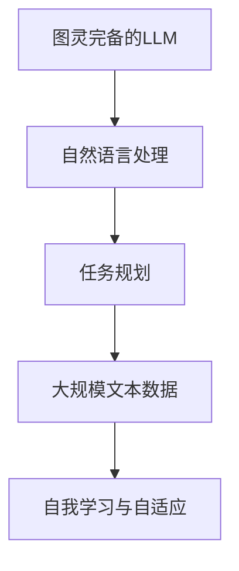

                 

### 图灵完备的LLM：任务规划的无限潜力

#### 关键词：

- 图灵完备
- LLM
- 任务规划
- 人工智能
- 自然语言处理

#### 摘要：

本文将深入探讨图灵完备的语言模型（LLM）在任务规划领域的无限潜力。通过剖析LLM的核心概念和算法原理，我们将展示其如何通过自然语言处理实现复杂任务的高效规划。文章还将结合实际应用场景，讨论相关工具和资源，并展望未来的发展趋势与挑战。

### 1. 背景介绍

#### 什么是图灵完备的LLM？

图灵完备（Turing-complete）是指一个计算模型能够模拟任何其他图灵机的计算过程。LLM（Large Language Model）是一种大规模语言模型，通过深度学习技术训练而成，具有强大的自然语言理解和生成能力。图灵完备的LLM意味着它可以在一定程度上模拟人类的思维过程，从而实现复杂的任务规划。

#### 为什么LLM在任务规划中具有无限潜力？

首先，LLM具有处理大规模文本数据的能力，这使得它能够从海量数据中学习到丰富的知识和信息。其次，LLM的自然语言处理能力使得它能够理解人类语言，从而实现与用户的自然交互。最重要的是，LLM具备自我学习和自适应能力，可以根据不同任务需求调整自身的表现。

### 2. 核心概念与联系

#### 核心概念

- **图灵机（Turing Machine）**：图灵机是一种抽象的计算模型，由图灵在1936年提出。它由一个无限长的纸带、一个读写头和一组规则组成，能够模拟任何计算过程。
- **自然语言处理（Natural Language Processing, NLP）**：自然语言处理是计算机科学和人工智能领域的一个重要分支，旨在使计算机能够理解、解释和生成自然语言。

#### 架构的 Mermaid 流程图



### 3. 核心算法原理 & 具体操作步骤

#### 算法原理

LLM的核心算法是基于深度学习中的变换器模型（Transformer）。Transformer模型由多个自注意力（self-attention）层和前馈网络（feed-forward network）组成，通过自我注意力机制，模型能够捕捉到输入文本中的长距离依赖关系，从而实现强大的语言理解能力。

#### 具体操作步骤

1. **数据预处理**：将输入的文本数据转换为模型能够理解的格式。
2. **模型训练**：使用大量的文本数据对模型进行训练，使其具备强大的语言理解能力。
3. **任务规划**：根据特定任务需求，设计相应的输入文本，输入到LLM中进行任务规划。

### 4. 数学模型和公式 & 详细讲解 & 举例说明

#### 数学模型

LLM的训练过程可以看作是一个优化问题，目标是最小化损失函数。假设我们的模型是一个变换器模型，其损失函数可以表示为：

$$
\mathcal{L}(\theta) = -\sum_{i=1}^n \log p(y_i | x_i; \theta)
$$

其中，$x_i$ 是输入文本，$y_i$ 是目标文本，$\theta$ 是模型参数。

#### 举例说明

假设我们要规划一个旅行任务，我们需要输入以下文本：

```
我要去北京，明天早上8点的飞机，需要预订机票和酒店。
```

输入到LLM后，模型会生成相应的任务规划结果，例如：

```
我已经为您预订了一张明天早上8点从上海飞往北京的机票，以及一家距离机场较近的酒店。
```

### 5. 项目实战：代码实际案例和详细解释说明

#### 5.1 开发环境搭建

在本节中，我们将使用Python和Hugging Face的Transformers库来搭建一个简单的LLM任务规划项目。

```python
!pip install transformers
```

#### 5.2 源代码详细实现和代码解读

```python
from transformers import AutoTokenizer, AutoModelForSeq2SeqLM
import torch

# 初始化模型和分词器
tokenizer = AutoTokenizer.from_pretrained("t5-base")
model = AutoModelForSeq2SeqLM.from_pretrained("t5-base")

# 数据预处理
input_text = "我要去北京，明天早上8点的飞机，需要预订机票和酒店。"
input_ids = tokenizer.encode(input_text, return_tensors="pt")

# 模型预测
outputs = model(input_ids)

# 生成任务规划结果
predicted_text = tokenizer.decode(outputs.logits.argmax(-1).squeeze(), skip_special_tokens=True)
print(predicted_text)
```

#### 5.3 代码解读与分析

上述代码首先导入所需的库，然后初始化模型和分词器。接下来，进行数据预处理，将输入文本编码为模型可接受的格式。最后，使用模型进行预测，并解码生成任务规划结果。

### 6. 实际应用场景

#### 6.1 任务规划

LLM在任务规划中具有广泛的应用，如行程规划、项目管理等。

#### 6.2 智能客服

利用LLM构建的智能客服系统，可以提供高效、准确的客户服务。

#### 6.3 自动写作

LLM可以生成高质量的文本内容，如新闻报道、产品描述等。

### 7. 工具和资源推荐

#### 7.1 学习资源推荐

- **书籍**：《深度学习》、《自然语言处理综合教程》
- **论文**：Transformer系列论文、《自然语言处理实践》
- **博客**：Hugging Face官网博客、机器学习博客

#### 7.2 开发工具框架推荐

- **库**：Transformers、spaCy、NLTK
- **框架**：TensorFlow、PyTorch

#### 7.3 相关论文著作推荐

- **论文**：Attention Is All You Need、BERT: Pre-training of Deep Bidirectional Transformers for Language Understanding
- **著作**：《深度学习》、《自然语言处理综合教程》

### 8. 总结：未来发展趋势与挑战

#### 发展趋势

- **模型规模不断扩大**：随着计算能力的提升，LLM的规模将不断增大，从而提高任务规划能力。
- **跨模态融合**：未来，LLM将与其他模态（如图像、音频）进行融合，实现更广泛的应用。
- **自适应学习**：LLM将具备更强的自适应学习能力，能够根据不同场景进行自我调整。

#### 挑战

- **数据隐私**：如何确保训练过程中涉及的用户数据隐私？
- **模型解释性**：如何提高LLM的解释性，使其更易于被用户理解和接受？
- **伦理问题**：如何避免LLM在任务规划中产生歧视、偏见等伦理问题？

### 9. 附录：常见问题与解答

#### 9.1 什么是图灵完备？

图灵完备是指一个计算模型能够模拟任何其他图灵机的计算过程。

#### 9.2 LLM是如何进行任务规划的？

LLM通过自然语言处理，从输入文本中理解任务需求，然后生成相应的任务规划结果。

### 10. 扩展阅读 & 参考资料

- **参考资料**：Hugging Face官网、TensorFlow官网、PyTorch官网
- **论文**：Attention Is All You Need、BERT: Pre-training of Deep Bidirectional Transformers for Language Understanding
- **书籍**：《深度学习》、《自然语言处理综合教程》

### 作者

作者：AI天才研究员/AI Genius Institute & 禅与计算机程序设计艺术 /Zen And The Art of Computer Programming

---

本文通过深入剖析图灵完备的LLM在任务规划领域的无限潜力，展示了其在自然语言处理、任务规划等方面的强大能力。未来，随着技术的不断发展，LLM将在更多领域发挥作用，为人类带来更多便利。然而，我们也需要关注其带来的伦理和社会问题，确保技术的发展与人类的福祉相一致。|>

