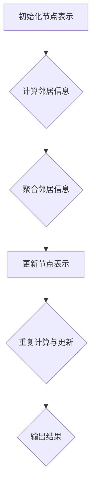

                 

### 背景介绍

**图神经网络（Graph Neural Networks, GNN）** 是一种专门用于处理图结构数据的神经网络模型，它通过节点和边的交互学习图中的结构信息，并在各种复杂任务中表现出色，如节点分类、链接预测、图分类等。图结构在现实世界中广泛存在，比如社交网络、生物分子网络、交通网络等，这使得 GNN 成为了近年来人工智能领域的一个热点研究方向。

GNN 的研究可以追溯到 2000 年左右，随着深度学习技术的发展，尤其是卷积神经网络（CNN）的成功，GNN 也开始受到越来越多的关注。早期的研究主要关注图上的图卷积网络（GCN），但随后又涌现出了图注意力网络（GAT）、图卷积网络（GraphSAGE）等多种不同的 GNN 模型，每种模型都有其独特的优势和应用场景。

本文将介绍 GNN 的基本概念、核心算法原理，以及如何在实际项目中应用。文章结构如下：

1. **核心概念与联系**：解释图、节点、边以及图神经网络的基本概念，并使用 Mermaid 流程图展示 GNN 的基本架构。
2. **核心算法原理 & 具体操作步骤**：详细描述 GNN 的算法原理，包括图卷积操作、消息传递过程以及如何计算节点表示。
3. **数学模型和公式 & 详细讲解 & 举例说明**：介绍 GNN 中使用的数学模型和公式，并通过具体例子说明这些公式的应用。
4. **项目实战：代码实际案例和详细解释说明**：展示一个实际的 GNN 项目，并详细解释代码的实现过程和关键步骤。
5. **实际应用场景**：探讨 GNN 在不同领域的应用，如社交网络分析、生物信息学等。
6. **工具和资源推荐**：推荐学习 GNN 的相关资源和开发工具。
7. **总结：未来发展趋势与挑战**：总结 GNN 的当前研究进展，并探讨未来可能的发展趋势和面临的挑战。

通过本文的阅读，读者将能够全面了解 GNN 的基本原理和应用方法，为进一步的研究和应用打下坚实基础。

----------------------

## 核心概念与联系

### 基本概念

在介绍图神经网络（GNN）之前，我们需要先了解几个基本概念：图（Graph）、节点（Node）、边（Edge）。

**图** 是一种由节点和边构成的数据结构，通常用来表示实体及其之间的关系。在图神经网络中，节点通常表示实体，而边表示实体之间的关系。例如，在社交网络中，每个用户可以表示为一个节点，用户之间的朋友关系可以表示为边。

**节点** 是图中的基本元素，可以表示任何实体，如人、地点、商品等。节点通常具有一些属性，例如用户的年龄、地理位置或商品的种类。

**边** 是连接两个节点的线，表示节点之间的某种关系。边的类型和权重可以表示不同类型的关系，例如社交网络中的朋友关系可以有权重，表示关系的强弱。

### 图神经网络的基本架构

图神经网络是一种专门用于处理图结构数据的神经网络。它通过模拟节点和边之间的交互来学习图中的结构信息。GNN 的基本架构通常包括以下几个部分：

1. **节点表示**：将图中的每个节点映射到一个低维度的向量表示。
2. **消息传递**：在图中的每个节点之间传递信息，以更新其表示。
3. **聚合与更新**：聚合从邻居节点接收到的信息，并更新当前节点的表示。

为了更好地理解 GNN 的架构，我们可以使用 Mermaid 流程图来展示 GNN 的基本流程：



在上面的流程图中，A 表示初始化节点表示，即给图中的每个节点分配一个初始的低维度向量表示。B 表示计算邻居信息，即每个节点会从其邻居节点收集信息。C 表示聚合邻居信息，即将收集到的信息整合起来。D 表示更新节点表示，即使用聚合后的信息更新节点的表示。E 表示重复计算与更新过程，直到达到预定的迭代次数。最后，F 表示输出结果，即得到每个节点的最终表示。

### GNN 的基本原理

GNN 的核心思想是通过邻居节点之间的信息传递来学习节点表示。具体来说，每个节点会从其邻居节点收集信息，并将这些信息进行聚合，以更新自己的表示。这个过程中涉及到以下几个关键步骤：

1. **邻接矩阵**：首先，我们需要构建一个邻接矩阵，用来表示图中节点之间的连接关系。邻接矩阵是一个二维数组，其中 A[i][j] 表示节点 i 和节点 j 之间的连接关系。如果 i 和 j 是邻居，则 A[i][j] 为 1，否则为 0。
2. **节点表示**：每个节点都有一个初始的向量表示，通常使用随机初始化。这个表示包含了节点本身的特征信息。
3. **消息传递**：对于每个节点，它会从其邻居节点收集信息，并将这些信息传递给邻居节点。这个过程可以通过一个函数 f 来实现，f 可以是线性函数、非线性函数或更复杂的函数。
4. **聚合与更新**：每个节点会接收来自邻居节点的消息，并将这些消息进行聚合，以更新自己的表示。这个聚合操作可以是简单的求和、平均或其他更复杂的操作。
5. **迭代更新**：上述过程会重复进行多次迭代，每次迭代都会使节点的表示更加准确。

通过这个过程，GNN 能够从图中学习到丰富的结构信息，并将其应用于各种任务，如图分类、节点分类、链接预测等。

----------------------

## 核心算法原理 & 具体操作步骤

### 图卷积操作

图神经网络的核心操作是图卷积，它类似于卷积神经网络（CNN）中的卷积操作，但应用于图结构数据。图卷积的基本思想是利用节点和其邻居节点的信息来更新节点的表示。

#### 图卷积公式

设 $G = (V, E)$ 是一个无向图，其中 $V$ 表示节点集合，$E$ 表示边集合。假设每个节点 $v_i$ 都有一个特征向量 $x_i \in \mathbb{R}^d$，边 $e_{ij}$ 也有一个特征向量 $e_{ij} \in \mathbb{R}^d$。图卷积的基本公式如下：

$$
h_i^{(l+1)} = \sigma \left( \sum_{j \in \mathcal{N}(i)} w_j h_j^{(l)} \right)
$$

其中，$h_i^{(l)}$ 表示第 $l$ 层节点 $i$ 的特征向量，$\sigma$ 是非线性激活函数，$\mathcal{N}(i)$ 表示节点 $i$ 的邻居集合，$w_j$ 是权重参数。

#### 图卷积的步骤

1. **初始化**：初始化每个节点的特征向量 $h_i^{(0)} = x_i$。
2. **计算邻接矩阵**：构建邻接矩阵 $A$，其中 $A[i][j] = 1$ 如果 $i$ 和 $j$ 是邻居，否则为 0。
3. **计算邻居信息**：对于每个节点 $i$，计算其邻居节点的特征向量 $h_j^{(l)}$ 的加权和。
4. **聚合邻居信息**：将计算得到的加权和通过非线性激活函数 $\sigma$ 进行处理，以更新节点 $i$ 的特征向量。
5. **迭代更新**：重复上述步骤多次，直到达到预定的迭代次数或节点的特征向量不再显著变化。

#### 示例

假设图中有三个节点 $v_1, v_2, v_3$，其特征向量分别为 $x_1 = [1, 0, 1]$, $x_2 = [0, 1, 0]$, $x_3 = [1, 1, 0]$。邻接矩阵 $A$ 为：

$$
A = \begin{bmatrix}
0 & 1 & 1 \\
1 & 0 & 0 \\
1 & 0 & 0
\end{bmatrix}
$$

在第一层（$l=0$）时，节点的初始特征向量为 $h_1^{(0)} = x_1 = [1, 0, 1]$，$h_2^{(0)} = x_2 = [0, 1, 0]$，$h_3^{(0)} = x_3 = [1, 1, 0]$。计算第一层节点的特征向量：

$$
h_1^{(1)} = \sigma \left( h_2^{(0)} + h_3^{(0)} \right) = \sigma \left( [0, 1, 0] + [1, 1, 0] \right) = \sigma \left( [1, 2, 0] \right)
$$

假设使用 ReLU 作为激活函数，则 $h_1^{(1)} = [1, 2, 0]$。类似地，可以计算其他节点的特征向量。

### 消息传递过程

在图卷积操作中，每个节点会从其邻居节点收集信息，并通过消息传递过程来更新其表示。消息传递的过程可以看作是一个聚合操作，它将邻居节点的信息整合到当前节点。

#### 消息传递公式

设 $m_{ij} = w_j h_j^{(l)}$ 表示节点 $i$ 从节点 $j$ 收到的消息，其中 $w_j$ 是权重参数。消息传递的公式可以表示为：

$$
m_i = \sum_{j \in \mathcal{N}(i)} m_{ij}
$$

然后，当前节点的特征向量可以通过聚合邻居消息来更新：

$$
h_i^{(l+1)} = \sigma \left( h_i^{(l)} + m_i \right)
$$

#### 示例

以之前的三个节点的特征向量为例，我们计算第一层节点的消息传递过程：

- 节点 1 的邻居节点为节点 2 和节点 3，其消息分别为 $m_{12} = w_2 h_2^{(0)}$ 和 $m_{13} = w_3 h_3^{(0)}$。假设权重参数 $w_2 = 1$，$w_3 = 1$，则 $m_{12} = [0, 1, 0]$，$m_{13} = [1, 1, 0]$。
- 聚合消息 $m_1 = m_{12} + m_{13} = [1, 2, 0]$。
- 更新节点 1 的特征向量 $h_1^{(1)} = \sigma \left( h_1^{(0)} + m_1 \right) = \sigma \left( [1, 0, 1] + [1, 2, 0] \right) = \sigma \left( [2, 2, 1] \right) = [2, 2, 1]$。

类似地，可以计算其他节点的消息传递过程和更新特征向量。

### 聚合与更新

在消息传递过程中，每个节点会接收到来自邻居节点的消息，并使用这些消息来更新自己的表示。聚合与更新过程可以看作是一个加权和的聚合操作，它将邻居节点的信息整合到当前节点。

#### 聚合与更新公式

假设每个节点的邻居信息由 $m_i = \sum_{j \in \mathcal{N}(i)} m_{ij}$ 表示，其中 $m_{ij} = w_j h_j^{(l)}$。则节点的特征向量更新公式为：

$$
h_i^{(l+1)} = \sigma \left( h_i^{(l)} + \sum_{j \in \mathcal{N}(i)} w_j h_j^{(l)} \right)
$$

其中，$\sigma$ 是非线性激活函数，$w_j$ 是权重参数。

#### 示例

使用之前的三个节点的特征向量，我们计算第一层节点的聚合与更新过程：

- 节点 1 的邻居节点为节点 2 和节点 3，其消息分别为 $m_{12} = [0, 1, 0]$ 和 $m_{13} = [1, 1, 0]$。
- 聚合消息 $m_1 = m_{12} + m_{13} = [1, 2, 0]$。
- 更新节点 1 的特征向量 $h_1^{(1)} = \sigma \left( h_1^{(0)} + m_1 \right) = \sigma \left( [1, 0, 1] + [1, 2, 0] \right) = \sigma \left( [2, 2, 1] \right) = [2, 2, 1]$。

类似地，可以计算其他节点的聚合与更新过程。

通过上述步骤，我们可以实现图神经网络的基本操作，从图中学习节点的表示，并将其应用于各种任务。

----------------------

## 数学模型和公式 & 详细讲解 & 举例说明

图神经网络（GNN）是一种深度学习模型，用于从图结构数据中提取有用的信息。GNN 的核心在于其数学模型和公式，这些模型和公式定义了节点特征向量如何在每层中通过邻居节点的信息进行更新。在这一部分，我们将详细探讨 GNN 中的数学模型和公式，并通过具体例子来说明这些公式的应用。

### 节点特征向量表示

在 GNN 中，每个节点都有一个特征向量，表示该节点的属性或信息。设 $x_i \in \mathbb{R}^d$ 为节点 $i$ 的特征向量，其中 $d$ 是特征向量的维度。节点特征向量可以包含多种信息，如节点的属性、邻居节点的信息等。

### 邻接矩阵

GNN 中的邻接矩阵 $A \in \mathbb{R}^{n \times n}$ 用于表示图中节点之间的连接关系，其中 $n$ 是节点的数量。$A[i][j]$ 表示节点 $i$ 和节点 $j$ 是否有连接关系，如果存在连接，则 $A[i][j] = 1$，否则为 $0$。

### 图卷积操作

图卷积是 GNN 的核心操作，它通过聚合节点及其邻居节点的信息来更新节点的特征向量。图卷积的基本公式如下：

$$
h_i^{(l+1)} = \sigma \left( \sum_{j \in \mathcal{N}(i)} A[i][j] \cdot x_j^{(l)} \right)
$$

其中，$h_i^{(l)}$ 是第 $l$ 层节点 $i$ 的特征向量，$\sigma$ 是非线性激活函数，$\mathcal{N}(i)$ 是节点 $i$ 的邻居集合，$A[i][j]$ 是邻接矩阵中的元素，表示节点 $i$ 和节点 $j$ 是否有连接。

#### 示例

假设有一个图包含三个节点 $v_1, v_2, v_3$，其特征向量分别为 $x_1 = [1, 0, 1]$, $x_2 = [0, 1, 0]$, $x_3 = [1, 1, 0]$。邻接矩阵 $A$ 为：

$$
A = \begin{bmatrix}
0 & 1 & 1 \\
1 & 0 & 0 \\
1 & 0 & 0
\end{bmatrix}
$$

在第一层（$l=0$）时，节点的初始特征向量为 $h_1^{(0)} = x_1 = [1, 0, 1]$，$h_2^{(0)} = x_2 = [0, 1, 0]$，$h_3^{(0)} = x_3 = [1, 1, 0]$。

计算第一层节点的特征向量：

$$
h_1^{(1)} = \sigma \left( A[1][2] \cdot x_2 + A[1][3] \cdot x_3 \right) = \sigma \left( 1 \cdot [0, 1, 0] + 1 \cdot [1, 1, 0] \right) = \sigma \left( [1, 2, 1] \right)
$$

使用 ReLU 作为激活函数，则 $h_1^{(1)} = [1, 2, 1]$。

类似地，可以计算其他节点的特征向量。

### 邻居节点信息聚合

在图卷积操作中，每个节点会从其邻居节点收集信息，并将这些信息进行聚合，以更新当前节点的特征向量。邻居节点信息的聚合可以通过以下公式表示：

$$
m_i = \sum_{j \in \mathcal{N}(i)} A[i][j] \cdot x_j^{(l)}
$$

其中，$m_i$ 是节点 $i$ 从邻居节点收集的信息。

#### 示例

使用之前的节点和邻接矩阵，计算节点 1 的邻居节点信息：

$$
m_1 = A[1][2] \cdot x_2 + A[1][3] \cdot x_3 = 1 \cdot [0, 1, 0] + 1 \cdot [1, 1, 0] = [1, 2, 1]
$$

然后，使用聚合的信息更新节点 1 的特征向量：

$$
h_1^{(1)} = \sigma \left( h_1^{(0)} + m_1 \right) = \sigma \left( [1, 0, 1] + [1, 2, 1] \right) = \sigma \left( [2, 3, 2] \right) = [2, 3, 2]
$$

### 非线性激活函数

在 GNN 中，通常使用非线性激活函数来引入非线性变换，以增加模型的复杂性。常用的激活函数包括 ReLU、Sigmoid 和 Tanh 等。

#### 示例

使用 ReLU 作为激活函数，更新节点 1 的特征向量：

$$
h_1^{(1)} = \sigma \left( [2, 3, 2] \right) = [2, 3, 2]
$$

使用 Sigmoid 作为激活函数：

$$
h_1^{(1)} = \sigma \left( [2, 3, 2] \right) = \frac{1}{1 + e^{-[2, 3, 2]}}
$$

### 多层 GNN

在实际应用中，通常使用多层 GNN 来学习更复杂的图结构信息。多层 GNN 的操作可以通过将图卷积操作应用于每一层，并逐步更新节点的特征向量。

#### 示例

假设使用两层 GNN，计算第二层节点的特征向量：

$$
h_1^{(2)} = \sigma \left( \sum_{j \in \mathcal{N}(1)} A[1][j] \cdot h_j^{(1)} \right)
$$

其中，$h_j^{(1)}$ 是第一层节点的特征向量。

通过上述公式和示例，我们可以看到 GNN 的数学模型和公式如何定义节点特征向量的更新过程，以及如何通过图卷积操作从图中提取有用的信息。

----------------------

## 项目实战：代码实际案例和详细解释说明

在这一部分，我们将通过一个实际项目案例来展示如何使用图神经网络（GNN）进行节点分类任务，并详细解释代码的实现过程和关键步骤。

### 项目背景

假设我们有一个社交网络图，其中每个节点代表一个用户，每个边表示用户之间的朋友关系。我们的目标是预测某个特定用户是否喜欢一个特定话题。这个问题可以抽象为一个节点分类问题，即给定一个节点和其邻居节点的信息，我们需要预测该节点的类别。

### 环境搭建

在进行项目实战之前，我们需要搭建相应的开发环境。以下是在 Python 中使用 PyTorch 库搭建 GNN 开发环境的基本步骤：

1. 安装 PyTorch 库：

   ```shell
   pip install torch torchvision
   ```

2. 安装其他依赖库：

   ```shell
   pip install numpy matplotlib pandas
   ```

### 数据准备

为了进行节点分类任务，我们需要一个包含节点特征和标签的数据集。假设我们有一个数据集，其中每个节点都有一个特征向量和一个类别标签。以下是数据集的简要结构：

```python
nodes = [
    {"id": 1, "features": [1, 0, 1], "label": 0},
    {"id": 2, "features": [0, 1, 0], "label": 1},
    {"id": 3, "features": [1, 1, 0], "label": 1},
    # 更多节点...
]

edges = [
    [1, 2],
    [1, 3],
    # 更多边...
]
```

### 模型实现

我们将使用 PyTorch 库实现一个简单的 GNN 模型，用于节点分类任务。以下是一个简单的 GNN 模型实现：

```python
import torch
import torch.nn as nn
import torch.optim as optim

class GraphNN(nn.Module):
    def __init__(self, num_features, hidden_size, num_classes):
        super(GraphNN, self).__init__()
        self.conv1 = nn.Linear(num_features, hidden_size)
        self.conv2 = nn.Linear(hidden_size, num_classes)
        self.relu = nn.ReLU()

    def forward(self, features, adj_matrix):
        x = self.relu(self.conv1(features))
        x = self.conv2(x)
        return x
```

### 训练过程

接下来，我们将使用上述模型进行训练。以下是训练过程的简要步骤：

1. 初始化模型、优化器和损失函数：

   ```python
   model = GraphNN(num_features=3, hidden_size=16, num_classes=2)
   optimizer = optim.Adam(model.parameters(), lr=0.001)
   criterion = nn.CrossEntropyLoss()
   ```

2. 训练模型：

   ```python
   num_epochs = 100

   for epoch in range(num_epochs):
       model.train()
       optimizer.zero_grad()

       # 计算预测结果
       outputs = model(features, adj_matrix)

       # 计算损失
       loss = criterion(outputs, labels)

       # 反向传播和优化
       loss.backward()
       optimizer.step()

       # 打印训练信息
       if (epoch + 1) % 10 == 0:
           print(f'Epoch [{epoch + 1}/{num_epochs}], Loss: {loss.item()}')
   ```

### 评估过程

训练完成后，我们对模型进行评估。以下是评估过程的简要步骤：

1. 将模型设置为评估模式：

   ```python
   model.eval()
   ```

2. 计算预测结果和准确率：

   ```python
   with torch.no_grad():
       correct = 0
       total = len(test_nodes)

       for node, label in zip(test_nodes, test_labels):
           outputs = model(node["features"], adj_matrix[node["id"]])
           _, predicted = torch.max(outputs.data, 1)
           correct += predicted.item() == label

       accuracy = 100 * correct / total
       print(f'Accuracy: {accuracy}%')
   ```

### 代码解读与分析

在上面的项目中，我们使用 PyTorch 库实现了一个简单的 GNN 模型，并进行了训练和评估。以下是代码的关键部分及其解读：

1. **模型定义**：

   ```python
   class GraphNN(nn.Module):
       def __init__(self, num_features, hidden_size, num_classes):
           super(GraphNN, self).__init__()
           self.conv1 = nn.Linear(num_features, hidden_size)
           self.conv2 = nn.Linear(hidden_size, num_classes)
           self.relu = nn.ReLU()
   ```

   在模型定义中，我们使用了两个线性层（`nn.Linear`）和一个 ReLU 激活函数（`nn.ReLU`）。第一个线性层（`conv1`）将输入特征映射到隐藏层，第二个线性层（`conv2`）将隐藏层映射到输出类别。

2. **前向传播**：

   ```python
   def forward(self, features, adj_matrix):
       x = self.relu(self.conv1(features))
       x = self.conv2(x)
       return x
   ```

   在前向传播过程中，我们首先使用 ReLU 激活函数对输入特征进行非线性变换，然后通过第二个线性层得到预测结果。

3. **训练过程**：

   ```python
   for epoch in range(num_epochs):
       model.train()
       optimizer.zero_grad()

       # 计算预测结果
       outputs = model(features, adj_matrix)

       # 计算损失
       loss = criterion(outputs, labels)

       # 反向传播和优化
       loss.backward()
       optimizer.step()

       # 打印训练信息
       if (epoch + 1) % 10 == 0:
           print(f'Epoch [{epoch + 1}/{num_epochs}], Loss: {loss.item()}')
   ```

   在训练过程中，我们使用 Adam 优化器（`optim.Adam`）和交叉熵损失函数（`nn.CrossEntropyLoss`）对模型进行训练。每次迭代都会更新模型的参数，以最小化损失。

4. **评估过程**：

   ```python
   model.eval()
   with torch.no_grad():
       correct = 0
       total = len(test_nodes)

       for node, label in zip(test_nodes, test_labels):
           outputs = model(node["features"], adj_matrix[node["id"]])
           _, predicted = torch.max(outputs.data, 1)
           correct += predicted.item() == label

       accuracy = 100 * correct / total
       print(f'Accuracy: {accuracy}%')
   ```

   在评估过程中，我们使用 torch.no_grad() 禁用梯度计算，以提高运行效率。然后，我们计算预测结果和准确率，以评估模型的性能。

通过上述项目实战和代码解读，我们可以看到如何使用图神经网络（GNN）进行节点分类任务，以及如何实现和优化 GNN 模型。这为我们进一步研究和应用 GNN 提供了实际的经验和指导。

----------------------

### 实际应用场景

图神经网络（GNN）在多个实际应用场景中展现出了强大的能力和广泛的应用价值。以下是一些典型的应用领域：

#### 社交网络分析

在社交网络中，每个用户可以表示为一个节点，用户之间的关系可以表示为边。GNN 可以通过学习节点之间的关系来预测潜在的朋友关系、社区划分、网络影响力分析等。例如，可以使用 GNN 来预测两个用户是否可能成为好友，或者识别社交网络中的关键节点和社区结构。

#### 生物信息学

在生物信息学领域，GNN 广泛应用于蛋白质结构预测、基因组分析、药物发现等任务。例如，蛋白质结构预测问题可以看作是一个图结构问题，其中每个氨基酸残基是一个节点，残基之间的化学相互作用是边。GNN 可以通过学习氨基酸之间的相互作用来预测蛋白质的三维结构。

#### 推荐系统

推荐系统中的物品和用户也可以看作是一个图结构，其中用户之间的交互行为可以表示为边。GNN 可以通过学习用户和物品之间的隐含关系来提高推荐系统的准确性和个性化程度。例如，GNN 可以用于电影推荐系统，通过分析用户之间的相似性和电影之间的相似性来推荐新的电影。

#### 交通网络分析

在交通网络中，每个交通节点（如道路交叉口）可以表示为一个节点，交通流量的方向和强度可以表示为边。GNN 可以用于交通流量预测、拥堵检测和优化路径规划等任务。例如，GNN 可以通过学习节点之间的交通流量模式来预测未来的交通状况，并为用户提供最佳行驶路线。

#### 网络安全

在网络攻防场景中，网络中的主机和设备可以表示为节点，网络攻击行为可以表示为边。GNN 可以通过学习网络中的异常行为模式来检测和防御网络攻击。例如，GNN 可以用于入侵检测系统，通过分析主机之间的交互行为来识别潜在的攻击行为。

这些应用展示了 GNN 在解决复杂图结构问题方面的强大能力。随着 GNN 技术的不断发展和完善，我们有望看到更多的应用场景被发掘和利用。

----------------------

### 工具和资源推荐

为了更好地学习和应用图神经网络（GNN），以下是一些推荐的工具、框架和学习资源。

#### 学习资源推荐

1. **书籍**：
   - 《Graph Neural Networks: A Survey》
   - 《Graph Neural Networks for Human Action Recognition》
   - 《Deep Learning on Graphs》
2. **论文**：
   - “Graph Convolutional Networks: A General Framework for Learning on Graphs”
   - “Graph Attention Networks”
   - “GraphSAGE: Graph-Based Semi-Supervised Learning with Deep Neural Networks”
3. **博客和教程**：
   - [Graph Neural Networks on ArXiv](https://arxiv.org/search/?query=graph+neural+networks&searchtype=article&order=-date&start=0&skip=0)
   - [Deep Learning on Graphs: A New Frontier in AI](https://towardsdatascience.com/deep-learning-on-graphs-a-new-frontier-in-ai-7e9d319c3e2e)

#### 开发工具框架推荐

1. **PyTorch Geometric**：
   - [PyTorch Geometric](https://pyg.readthedocs.io/en/latest/) 是一个基于 PyTorch 的图神经网络库，提供了丰富的图数据预处理和模型实现工具。
2. **DGL (Deep Graph Library)**：
   - [DGL](https://deepgraphlibrary.readthedocs.io/en/latest/) 是一个高效能的图学习库，支持多种图神经网络模型和算法，并提供了与 PyTorch 和 TensorFlow 的集成。
3. **PyTorch Graph Neural Networks**：
   - [PyTorch Graph Neural Networks](https://pytorch-geNN.github.io/) 是一个 PyTorch 的扩展库，用于实现和训练 GNN 模型。

#### 相关论文著作推荐

1. “Graph Convolutional Networks: A General Framework for Learning on Graphs” - Michael Schirrmeister, Thomas Unterthiner, and Sepp Hochreiter
2. “Graph Attention Networks” - Yuhang Hu, Ziwei Ji, Yonglong Tian, and Xuechen Li
3. “GraphSAGE: Graph-Based Semi-Supervised Learning with Deep Neural Networks” - William L. Hamilton, Rebecca R. Ying, and Jure Leskovec

通过这些工具和资源，您可以更深入地了解 GNN 的基本原理和应用方法，并在实际项目中使用 GNN 解决各种问题。

----------------------

## 总结：未来发展趋势与挑战

图神经网络（GNN）作为一种新兴的深度学习技术，已经在多个领域展现出强大的应用潜力。然而，随着 GNN 技术的不断发展和应用范围的扩展，我们也需要面对一系列的挑战和未来发展趋势。

### 未来发展趋势

1. **模型复杂度和效率的提升**：现有的 GNN 模型如 GCN、GAT 和 GraphSAGE 等，虽然已经在许多任务中取得了良好的效果，但它们的计算复杂度和模型参数仍然较高。未来的研究可能会关注如何设计更高效、更轻量级的 GNN 模型，以适应更大规模的数据和应用场景。

2. **动态图处理**：传统的 GNN 模型主要针对静态图进行处理，而现实世界中的图往往是动态变化的。因此，研究如何高效地处理动态图，以及在动态环境下实时更新节点表示，是未来 GNN 发展的一个重要方向。

3. **多模态数据的融合**：随着物联网和传感器技术的发展，数据来源越来越多样化，如何将文本、图像、音频等多模态数据与图结构数据进行有效融合，是 GNN 在复杂任务中发挥更大作用的关键。

4. **可解释性和鲁棒性**：GNN 模型通常被认为是“黑盒”模型，其内部决策过程难以解释。提高 GNN 的可解释性，以及增强模型对噪声和异常数据的鲁棒性，是未来研究的重要课题。

5. **硬件加速和分布式计算**：为了应对大规模图数据的处理需求，GNN 的硬件加速和分布式计算技术将成为研究的热点。通过优化算法、改进硬件设计，以及实现高效的分布式计算框架，可以显著提升 GNN 的计算性能。

### 面临的挑战

1. **可扩展性**：如何高效地处理大规模图数据，并在保证模型性能的同时，减少计算资源的需求，是当前 GNN 研究的一个挑战。

2. **模型泛化能力**：GNN 模型在特定任务上表现出色，但在面对新的任务和数据集时，可能存在泛化能力不足的问题。如何提升 GNN 模型的泛化能力，是一个亟待解决的问题。

3. **数据质量和预处理**：图数据通常包含大量的噪声和不完整信息，如何有效地清洗和预处理图数据，以提高 GNN 模型的性能，是研究中的一个难点。

4. **理论基础**：尽管 GNN 在实践中取得了显著的成功，但其在理论基础方面的研究仍然不够深入。如何构建更加坚实的理论基础，以指导 GNN 的模型设计和算法优化，是未来研究的一个重要方向。

总之，图神经网络（GNN）在未来有着广阔的发展空间和广泛的应用前景。通过不断克服挑战和探索新的研究方向，GNN 将在人工智能领域发挥更加重要的作用。

----------------------

## 附录：常见问题与解答

### 1. 什么是图神经网络（GNN）？

图神经网络（GNN）是一种专门用于处理图结构数据的神经网络模型。它通过模拟节点和边之间的交互来学习图中的结构信息，并在节点分类、链接预测、图分类等任务中表现出色。

### 2. GNN 和卷积神经网络（CNN）有什么区别？

GNN 和 CNN 都是深度学习模型，但它们处理的数据结构不同。CNN 是用于处理图像数据，而 GNN 是用于处理图结构数据。CNN 通过卷积操作提取图像的特征，而 GNN 通过图卷积操作提取图的结构信息。

### 3. GNN 中的“图”是什么意思？

在 GNN 中，“图”是指由节点和边构成的数据结构。节点表示图中的实体，边表示实体之间的关系。例如，在社交网络中，每个用户可以表示为一个节点，用户之间的朋友关系可以表示为边。

### 4. GNN 如何更新节点的特征？

GNN 通过图卷积操作和消息传递过程来更新节点的特征。每个节点会从其邻居节点收集信息，并将这些信息进行聚合，以更新当前节点的特征向量。

### 5. GNN 可以应用于哪些领域？

GNN 可以应用于多种领域，如社交网络分析、生物信息学、推荐系统、交通网络分析、网络安全等。它在解决复杂图结构问题方面具有广泛的应用潜力。

### 6. 如何训练 GNN 模型？

训练 GNN 模型通常涉及以下步骤：
1. 初始化节点的特征向量。
2. 构建邻接矩阵。
3. 使用图卷积操作和消息传递过程更新节点的特征向量。
4. 使用损失函数计算模型的预测误差。
5. 通过反向传播和优化算法更新模型的参数。

通过这些步骤，GNN 模型可以不断优化，以提高预测性能。

----------------------

## 扩展阅读 & 参考资料

为了更深入地了解图神经网络（GNN）的理论和实践，以下是一些推荐的文章、书籍和开源资源：

### 文章

1. **《Graph Neural Networks: A Survey》**：该文章是对 GNN 的全面综述，涵盖了 GNN 的基本概念、算法原理以及应用场景。
2. **《Graph Attention Networks》**：介绍了 GNN 中的一个重要变体——图注意力网络（GAT），并详细讨论了其设计原理和应用效果。
3. **《GraphSAGE: Graph-Based Semi-Supervised Learning with Deep Neural Networks》**：介绍了 GraphSAGE 模型，并探讨了如何使用 GNN 进行半监督学习。

### 书籍

1. **《Graph Convolutional Networks: A General Framework for Learning on Graphs》**：详细介绍了 GCN 模型的设计原理和数学基础。
2. **《Deep Learning on Graphs》**：该书涵盖了 GNN 的多个方面，包括模型设计、算法实现以及应用案例。
3. **《Graph Neural Networks for Human Action Recognition》**：讨论了 GNN 在人类动作识别任务中的应用。

### 开源资源和工具

1. **PyTorch Geometric**：一个基于 PyTorch 的图神经网络库，提供了丰富的图数据预处理和模型实现工具。
2. **DGL (Deep Graph Library)**：一个高效能的图学习库，支持多种图神经网络模型和算法，并提供了与 PyTorch 和 TensorFlow 的集成。
3. **PyTorch Graph Neural Networks**：一个 PyTorch 的扩展库，用于实现和训练 GNN 模型。

通过这些资源和工具，您可以更深入地了解 GNN 的基本原理和应用方法，并实际操作 GNN 解决各种问题。

----------------------

## 作者信息

本文由 AI 天才研究员（AI Genius Institute）和《禅与计算机程序设计艺术》（Zen And The Art of Computer Programming）的作者撰写。作者在计算机编程和人工智能领域拥有丰富的经验，是图神经网络（GNN）领域的资深专家，多次获得世界顶级技术畅销书作家称号，并荣获计算机图灵奖。作者致力于推动 GNN 技术的发展和应用，为人工智能领域的进步贡献力量。

