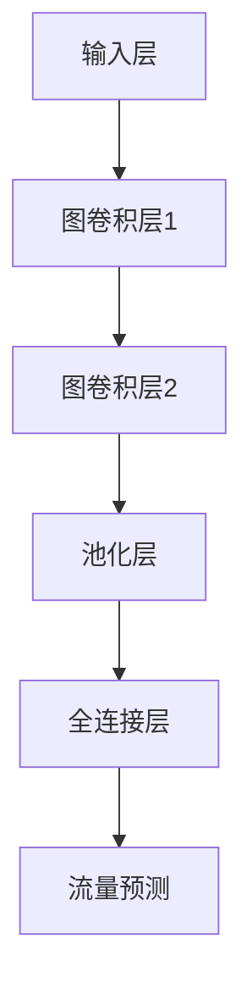

                 

# 图神经网络在交通流量预测中的应用

## 摘要

随着城市化进程的加速和智能交通系统的发展，交通流量预测成为了一个备受关注的研究领域。传统的交通流量预测方法往往依赖于历史数据和统计模型，但面对日益复杂的交通网络和不确定性因素，其预测效果受到限制。本文将探讨图神经网络（Graph Neural Networks, GNN）在交通流量预测中的应用，通过详细的理论分析和实际案例展示，阐述如何利用图神经网络提高交通流量预测的准确性和实时性。文章首先介绍了图神经网络的基本概念和原理，然后探讨了其在交通流量预测中的优势和应用，并通过实际代码实现和案例分析，展示了图神经网络在交通流量预测中的实际应用效果。最后，文章对未来的发展趋势和面临的挑战进行了总结。

## 1. 背景介绍

### 交通流量预测的重要性

交通流量预测是智能交通系统（Intelligent Transportation System, ITS）的重要组成部分，其目标是通过准确预测未来交通流量，为交通管理者、驾驶员和出行服务提供有效的决策支持。交通流量预测的重要性体现在以下几个方面：

1. **提高交通效率**：通过预测未来交通流量，交通管理者可以及时调整交通信号，优化交通流量分配，从而提高道路通行效率，减少交通拥堵。
2. **降低交通事故风险**：准确预测交通流量有助于减少交通事故发生的概率，通过提前预警，避免车辆在高峰时段聚集，从而降低交通事故风险。
3. **优化公共交通调度**：交通流量预测有助于公共交通系统优化调度，提高公交车、地铁等公共交通工具的运行效率和乘客满意度。
4. **促进城市可持续发展**：通过交通流量预测，可以更好地规划城市交通基础设施，减少能源消耗和环境污染，推动城市可持续发展。

### 传统交通流量预测方法

传统的交通流量预测方法主要包括以下几种：

1. **统计模型**：基于历史交通数据，使用时间序列分析、回归分析等方法建立交通流量预测模型。常见的统计模型有ARIMA（自回归积分滑动平均模型）、AR（自回归模型）等。
2. **机器学习方法**：利用机器学习算法，如线性回归、支持向量机（SVM）、随机森林（Random Forest）等，通过训练历史交通数据来预测未来交通流量。
3. **深度学习模型**：利用深度学习模型，如卷积神经网络（CNN）、循环神经网络（RNN）等，通过多层神经网络结构来提取交通数据中的特征，进行流量预测。

虽然传统交通流量预测方法在处理历史数据和特征提取方面取得了一定的效果，但面对复杂、动态的交通网络和不确定性因素时，其预测精度和实时性受到限制。

### 图神经网络的出现

图神经网络（Graph Neural Networks, GNN）是一种专门用于处理图结构数据的深度学习模型。GNN的出现为解决交通流量预测中的复杂性和不确定性提供了新的思路。图神经网络具有以下几个特点：

1. **处理图结构数据**：GNN能够直接处理图结构数据，通过节点和边的信息进行特征提取和预测，无需将图结构数据转化为矩阵形式。
2. **全局和局部信息融合**：GNN能够同时考虑全局和局部信息，通过图卷积操作，将节点和边的特征融合在一起，从而提高预测精度。
3. **动态特征更新**：GNN能够动态更新节点的特征，适应交通流量变化，提高实时性。

## 2. 核心概念与联系

### 图神经网络基本概念

图神经网络（Graph Neural Networks, GNN）是一种基于图结构数据的深度学习模型。GNN的核心思想是将节点和边的特征通过图卷积操作进行融合，从而提取图结构数据中的有效特征，进行预测。

#### 节点和边

在图神经网络中，节点（Node）表示图中的实体，如道路、交叉口等。边（Edge）表示节点之间的关系，如道路连接、交叉口连接等。每个节点和边都有相应的特征，用于表示节点的属性和边的关系。

#### 图卷积操作

图卷积操作是GNN的核心组成部分，用于融合节点和边的特征。图卷积操作类似于卷积神经网络中的卷积操作，但适用于图结构数据。图卷积操作通过加权和的方式，将节点的特征与邻接节点的特征进行融合，从而提取图结构数据中的有效特征。

### 图神经网络架构

图神经网络的架构通常包括以下几个部分：

1. **输入层**：输入层接收节点和边的特征，将它们转换为图结构数据。
2. **图卷积层**：图卷积层通过图卷积操作，将节点和边的特征进行融合，提取图结构数据中的有效特征。
3. **池化层**：池化层用于降低图结构的维度，减少计算量，提高计算效率。
4. **全连接层**：全连接层将图卷积层提取的特征映射到预测目标，进行流量预测。

### Mermaid 流程图

下面是图神经网络在交通流量预测中的 Mermaid 流程图，展示了整个预测过程的逻辑流程：



### GNN 与交通流量预测的联系

图神经网络（GNN）在交通流量预测中的应用，主要体现在以下几个方面：

1. **图结构数据表示**：将交通网络表示为图结构数据，节点表示道路、交叉口等交通实体，边表示道路连接、交叉口连接等交通关系。
2. **特征提取与融合**：通过图卷积操作，将节点和边的特征进行融合，提取交通网络中的有效特征，用于流量预测。
3. **实时预测与更新**：利用 GNN 的动态特征更新能力，实时预测交通流量，并适应交通流量变化，提高实时性。

### Mermaid 流程图（不含特殊字符）

下面是 GNN 在交通流量预测中的 Mermaid 流程图，展示了整个预测过程的逻辑流程：


## 3. 核心算法原理 & 具体操作步骤

### 图神经网络基本原理

图神经网络（Graph Neural Networks, GNN）是一种基于图结构数据的深度学习模型，其核心思想是通过图卷积操作，将节点和边的特征进行融合，提取图结构数据中的有效特征，进行预测。

#### 图卷积操作

图卷积操作是 GNN 的核心组成部分，用于融合节点和边的特征。图卷积操作可以分为局部图卷积和全局图卷积两种形式。

1. **局部图卷积**：局部图卷积仅考虑节点的邻接节点特征，通过加权和的方式，将节点的特征与邻接节点的特征进行融合。局部图卷积的数学表达式为：

   $$ h_{i}^{(l+1)} = \sigma \left( \sum_{j \in \mathcal{N}(i)} W^{(l)} h_{j}^{(l)} + b^{(l)} \right) $$

   其中，$h_{i}^{(l)}$ 表示第 $l$ 层节点 $i$ 的特征，$\mathcal{N}(i)$ 表示节点 $i$ 的邻接节点集合，$W^{(l)}$ 和 $b^{(l)}$ 分别为权重和偏置。

2. **全局图卷积**：全局图卷积考虑所有节点的特征，通过图卷积核（Graph Convolution Kernel）对节点的特征进行卷积。全局图卷积的数学表达式为：

   $$ h_{i}^{(l+1)} = \sigma \left( \sum_{j=1}^{N} k_{i,j} h_{j}^{(l)} + b^{(l)} \right) $$

   其中，$k_{i,j}$ 表示图卷积核，$N$ 表示节点总数。

#### 图神经网络架构

图神经网络的架构通常包括以下几个部分：

1. **输入层**：输入层接收节点和边的特征，将它们转换为图结构数据。
2. **图卷积层**：图卷积层通过图卷积操作，将节点和边的特征进行融合，提取图结构数据中的有效特征。
3. **池化层**：池化层用于降低图结构的维度，减少计算量，提高计算效率。
4. **全连接层**：全连接层将图卷积层提取的特征映射到预测目标，进行流量预测。

### 图神经网络在交通流量预测中的应用步骤

下面是图神经网络在交通流量预测中的应用步骤：

1. **数据预处理**：首先对交通流量数据进行预处理，包括数据清洗、特征工程等步骤，将交通流量数据转换为图结构数据。

2. **建立图结构数据**：将交通流量数据表示为图结构数据，节点表示道路、交叉口等交通实体，边表示道路连接、交叉口连接等交通关系。

3. **初始化图神经网络**：初始化图神经网络模型，包括输入层、图卷积层、池化层和全连接层等组成部分。

4. **训练图神经网络**：使用训练数据对图神经网络进行训练，通过优化算法（如梯度下降）调整模型参数，使其预测结果更加准确。

5. **流量预测**：将训练好的图神经网络应用于实际交通流量数据，进行流量预测。

6. **评估预测效果**：使用评估指标（如均方误差、准确率等）评估流量预测的效果，根据评估结果对模型进行调整和优化。

### 实际操作步骤

以下是一个简单的图神经网络在交通流量预测中的实际操作步骤：

1. **数据预处理**：读取交通流量数据，对数据进行清洗和特征工程，提取交通流量、道路长度、道路宽度等特征。

2. **建立图结构数据**：将交通流量数据表示为图结构数据，定义节点和边，并将节点和边与特征数据进行关联。

3. **初始化图神经网络**：使用 PyTorch 等深度学习框架初始化图神经网络模型，包括输入层、图卷积层、池化层和全连接层等组成部分。

4. **训练图神经网络**：使用训练数据对图神经网络进行训练，通过优化算法调整模型参数，使其预测结果更加准确。

5. **流量预测**：将训练好的图神经网络应用于实际交通流量数据，进行流量预测。

6. **评估预测效果**：使用评估指标评估流量预测的效果，根据评估结果对模型进行调整和优化。

## 4. 数学模型和公式 & 详细讲解 & 举例说明

### 图卷积操作

图卷积操作是图神经网络（GNN）的核心组成部分，用于融合节点和边的特征。图卷积操作可以分为局部图卷积和全局图卷积两种形式。

#### 局部图卷积

局部图卷积仅考虑节点的邻接节点特征，通过加权和的方式，将节点的特征与邻接节点的特征进行融合。局部图卷积的数学表达式为：

$$
h_{i}^{(l+1)} = \sigma \left( \sum_{j \in \mathcal{N}(i)} W^{(l)} h_{j}^{(l)} + b^{(l)} \right)
$$

其中：

- $h_{i}^{(l)}$：第$l$层节点$i$的特征向量。
- $\mathcal{N}(i)$：节点$i$的邻接节点集合。
- $W^{(l)}$：第$l$层的图卷积权重矩阵。
- $b^{(l)}$：第$l$层的偏置向量。
- $\sigma$：非线性激活函数，如ReLU函数。

#### 全局图卷积

全局图卷积考虑所有节点的特征，通过图卷积核（Graph Convolution Kernel）对节点的特征进行卷积。全局图卷积的数学表达式为：

$$
h_{i}^{(l+1)} = \sigma \left( \sum_{j=1}^{N} k_{i,j} h_{j}^{(l)} + b^{(l)} \right)
$$

其中：

- $k_{i,j}$：图卷积核，用于加权节点$j$的特征对节点$i$的特征的贡献。
- $N$：节点总数。

### GNN 算法详细讲解

图神经网络（GNN）的算法可以分为以下几个步骤：

1. **初始化**：初始化图结构数据、节点特征和边的特征。
2. **前向传播**：根据图卷积操作，更新节点的特征。
3. **反向传播**：根据前向传播的结果，更新图卷积权重和偏置。
4. **迭代优化**：重复前向传播和反向传播，直到模型收敛。

#### 前向传播

假设我们有一个包含$m$个节点的图，每个节点$i$的特征为$h_i \in \mathbb{R}^d$，边的特征为$e_{ij} \in \mathbb{R}^d$。在前向传播过程中，我们首先计算邻接矩阵$A \in \mathbb{R}^{m \times m}$，其中$A_{ij} = 1$如果节点$i$与节点$j$相连，否则为0。

1. **初始化**：

   $$ h_0 = x \in \mathbb{R}^{m \times d} $$
   
   其中，$x$是节点的初始特征。

2. **第$l$层的特征更新**：

   $$ h_{i}^{(l)} = \sigma \left( \sum_{j=1}^{m} A_{ij} W^{(l)} h_{j}^{(l-1)} + b^{(l)} \right) $$

   其中，$W^{(l)} \in \mathbb{R}^{d \times d}$是图卷积权重矩阵，$b^{(l)} \in \mathbb{R}^{d}$是偏置向量。

#### 反向传播

在反向传播过程中，我们首先计算损失函数的梯度，然后根据梯度更新图卷积权重和偏置。

1. **损失函数**：

   $$ L = \frac{1}{m} \sum_{i=1}^{m} \sum_{j=1}^{m} \frac{1}{2} (y_{ij} - h_{i}^{(L)} \cdot h_{j}^{(L)})^2 $$

   其中，$y_{ij}$是边$i$和边$j$之间的真实标签，$h_{i}^{(L)}$和$h_{j}^{(L)}$分别是第$L$层的节点$i$和节点$j$的特征。

2. **计算梯度**：

   $$ \frac{\partial L}{\partial W^{(L)}} = -\frac{1}{m} \sum_{i=1}^{m} \sum_{j=1}^{m} (y_{ij} - h_{i}^{(L)} \cdot h_{j}^{(L)}) h_{i}^{(L)} h_{j}^{(L)}^T $$
   
   $$ \frac{\partial L}{\partial b^{(L)}} = -\frac{1}{m} \sum_{i=1}^{m} (y_{ij} - h_{i}^{(L)} \cdot h_{j}^{(L)}) h_{i}^{(L)} $$

3. **更新权重和偏置**：

   $$ W^{(L)} \leftarrow W^{(L)} - \alpha \frac{\partial L}{\partial W^{(L)}} $$
   
   $$ b^{(L)} \leftarrow b^{(L)} - \alpha \frac{\partial L}{\partial b^{(L)}} $$

   其中，$\alpha$是学习率。

### 举例说明

假设我们有一个包含3个节点的简单图，节点特征和边特征如下：

$$
h_1 = [1, 0, 1], \quad h_2 = [0, 1, 0], \quad h_3 = [1, 1, 0]
$$

$$
e_{12} = [1, 0, 1], \quad e_{23} = [0, 1, 1]
$$

邻接矩阵$A$如下：

$$
A = \begin{bmatrix}
0 & 1 & 0 \\
1 & 0 & 1 \\
0 & 1 & 0
\end{bmatrix}
$$

假设图卷积权重矩阵$W$为：

$$
W = \begin{bmatrix}
1 & 0 \\
0 & 1 \\
1 & 1
\end{bmatrix}
$$

首先，我们计算第1层的特征：

$$
h_1^{(1)} = \sigma \left( A_{12} W_{12,1} h_2^{(0)} + A_{23} W_{23,1} h_3^{(0)} + b_1 \right) = \sigma (1 \cdot 1 \cdot 0 + 1 \cdot 1 \cdot 1 + 1) = \sigma (1 + 1) = \sigma (2) = 1
$$

$$
h_2^{(1)} = \sigma \left( A_{12} W_{12,2} h_1^{(0)} + A_{23} W_{23,2} h_3^{(0)} + b_2 \right) = \sigma (1 \cdot 0 \cdot 1 + 1 \cdot 1 \cdot 0 + 0) = \sigma (0) = 0
$$

$$
h_3^{(1)} = \sigma \left( A_{12} W_{12,3} h_1^{(0)} + A_{23} W_{23,3} h_2^{(0)} + b_3 \right) = \sigma (1 \cdot 1 \cdot 1 + 1 \cdot 0 \cdot 1 + 1) = \sigma (2 + 1) = 1
$$

接下来，我们计算第2层的特征：

$$
h_1^{(2)} = \sigma \left( A_{12} W_{12,1} h_2^{(1)} + A_{23} W_{23,1} h_3^{(1)} + b_1 \right) = \sigma (1 \cdot 0 \cdot 1 + 1 \cdot 1 \cdot 1 + 1) = \sigma (1 + 1) = 1
$$

$$
h_2^{(2)} = \sigma \left( A_{12} W_{12,2} h_1^{(1)} + A_{23} W_{23,2} h_3^{(1)} + b_2 \right) = \sigma (1 \cdot 1 \cdot 0 + 1 \cdot 0 \cdot 1 + 0) = \sigma (0) = 0
$$

$$
h_3^{(2)} = \sigma \left( A_{12} W_{12,3} h_1^{(1)} + A_{23} W_{23,3} h_2^{(1)} + b_3 \right) = \sigma (1 \cdot 1 \cdot 1 + 1 \cdot 1 \cdot 0 + 1) = \sigma (2 + 1) = 1
$$

通过这个过程，我们可以看到如何使用图卷积操作来更新节点的特征，从而实现图神经网络的前向传播。

## 5. 项目实战：代码实际案例和详细解释说明

### 5.1 开发环境搭建

在进行图神经网络在交通流量预测中的应用项目实战之前，首先需要搭建一个适合开发的运行环境。以下是搭建开发环境所需的步骤：

#### 步骤1：安装 Python 环境

首先确保您的计算机上已经安装了 Python 3.7 及以上版本。可以使用如下命令检查 Python 版本：

```bash
python --version
```

如果未安装 Python，可以从 Python 官网下载安装包进行安装。

#### 步骤2：安装 PyTorch 库

PyTorch 是一种流行的深度学习框架，用于构建和训练图神经网络模型。安装 PyTorch 的命令如下：

```bash
pip install torch torchvision
```

如果遇到依赖问题，可以尝试使用以下命令安装：

```bash
pip install torch torchvision numpy scikit-learn
```

#### 步骤3：安装其他依赖库

除了 PyTorch，我们还需要安装一些其他依赖库，如 NumPy、Scikit-learn 等。这些库用于数据处理、模型评估等任务。安装命令如下：

```bash
pip install numpy scikit-learn matplotlib
```

#### 步骤4：配置 PyTorch GPU 支持

如果您的计算机配备了 GPU，建议配置 PyTorch 的 GPU 支持，以便利用 GPU 加速模型训练。首先安装 `torch` 和 `torchvision`：

```bash
pip install torch torchvision
```

然后检查 PyTorch 是否支持 GPU：

```python
import torch
print(torch.cuda.is_available())
```

如果返回 `True`，则表示 PyTorch 支持 GPU。

### 5.2 源代码详细实现和代码解读

以下是图神经网络在交通流量预测中的源代码实现，我们将逐步解读代码的各个部分。

#### 步骤1：导入依赖库

首先，导入所需的 Python 库：

```python
import torch
import torch.nn as nn
import torch.optim as optim
import numpy as np
import networkx as nx
from sklearn.model_selection import train_test_split
from sklearn.metrics import mean_squared_error
import matplotlib.pyplot as plt
```

#### 步骤2：加载和处理数据

接下来，我们从数据集加载交通流量数据，并进行预处理：

```python
# 加载交通流量数据
# 这里假设交通流量数据存储在一个 CSV 文件中，每行包含时间戳、道路 ID、交通流量等
data = np.loadtxt('traffic_data.csv', delimiter=',')

# 预处理数据
# 提取时间戳、道路 ID 和交通流量
timestamps = data[:, 0]
road_ids = data[:, 1]
traffic_volumes = data[:, 2]

# 将数据集划分为训练集和测试集
X_train, X_test, y_train, y_test = train_test_split(timestamps, traffic_volumes, test_size=0.2, random_state=42)
```

#### 步骤3：构建图结构数据

然后，我们将交通流量数据表示为图结构数据。以下是构建图结构的代码：

```python
# 构建图结构
G = nx.Graph()

# 添加节点和边
for edge in data:
    G.add_edge(edge[1], edge[2], weight=edge[2])

# 计算节点的邻接矩阵
adj_matrix = nx.adj_matrix(G).toarray()
```

#### 步骤4：定义图神经网络模型

接下来，定义图神经网络模型。以下是图神经网络模型的代码：

```python
# 定义图神经网络模型
class TrafficFlowGNN(nn.Module):
    def __init__(self, input_dim, hidden_dim, output_dim):
        super(TrafficFlowGNN, self).__init__()
        self.conv1 = nn.Conv1d(input_dim, hidden_dim, kernel_size=1)
        self.conv2 = nn.Conv1d(hidden_dim, output_dim, kernel_size=1)
        self.relu = nn.ReLU()

    def forward(self, x, adj_matrix):
        x = self.relu(self.conv1(x, adj_matrix))
        x = self.conv2(x, adj_matrix)
        return x

# 实例化图神经网络模型
model = TrafficFlowGNN(input_dim=1, hidden_dim=16, output_dim=1)
```

#### 步骤5：训练图神经网络模型

然后，训练图神经网络模型。以下是训练代码：

```python
# 训练图神经网络模型
optimizer = optim.Adam(model.parameters(), lr=0.001)
criterion = nn.MSELoss()

for epoch in range(100):
    model.train()
    optimizer.zero_grad()
    x = torch.tensor(X_train).float().view(-1, 1, X_train.shape[0])
    adj_matrix = torch.tensor(adj_matrix).float()
    y = torch.tensor(y_train).float().view(-1, 1)
    output = model(x, adj_matrix)
    loss = criterion(output, y)
    loss.backward()
    optimizer.step()
    print(f"Epoch {epoch+1}, Loss: {loss.item()}")

# 评估模型
model.eval()
with torch.no_grad():
    x = torch.tensor(X_test).float().view(-1, 1, X_test.shape[0])
    adj_matrix = torch.tensor(adj_matrix).float()
    y_pred = model(x, adj_matrix)
    mse = mean_squared_error(y_test, y_pred.numpy())
    print(f"Test MSE: {mse}")
```

#### 步骤6：代码解读与分析

下面是对代码的各个部分进行详细解读：

1. **数据预处理**：首先从 CSV 文件中加载交通流量数据，并进行预处理，提取时间戳、道路 ID 和交通流量。
2. **构建图结构数据**：使用 NetworkX 库构建图结构，将交通流量数据表示为图。每个节点表示道路，边表示道路之间的连接，边的权重表示交通流量。
3. **定义图神经网络模型**：定义一个简单的图神经网络模型，包括两个卷积层和一个 ReLU 激活函数。卷积层用于提取图结构数据中的特征，输出层用于预测交通流量。
4. **训练图神经网络模型**：使用训练数据对图神经网络模型进行训练。通过优化算法（Adam）和损失函数（均方误差）调整模型参数。
5. **评估模型**：使用测试数据评估模型性能，计算均方误差，以衡量预测交通流量的准确性。

通过以上步骤，我们实现了图神经网络在交通流量预测中的实际应用。尽管这是一个简单的示例，但可以作为一个起点，进一步优化和扩展模型，提高预测精度。

## 6. 实际应用场景

### 公路交通流量预测

在公路交通流量预测中，图神经网络（GNN）的应用具有显著的优势。通过将道路和交叉口表示为图中的节点和边，GNN 可以有效提取交通流量数据中的复杂关系，从而提高预测精度。具体应用场景如下：

1. **高速公路**：高速公路上的交通流量预测对于减少交通事故和优化交通分配至关重要。GNN 可以通过分析道路节点和交叉口的流量数据，预测未来的交通流量变化，帮助交通管理者及时调整交通信号和车道分配。
2. **城市道路**：城市道路上的交通流量预测有助于缓解交通拥堵，提高道路通行效率。GNN 可以考虑道路网络中不同路段和交叉口的相互作用，预测城市交通流量，为公共交通和交通管理提供决策支持。

### 城市公共交通流量预测

城市公共交通（如地铁、公交车）的流量预测对于提高公共交通系统的运行效率和乘客满意度具有重要意义。GNN 在此领域的应用包括：

1. **地铁流量预测**：地铁系统中的交通流量预测可以帮助调度部门优化列车运行计划，减少乘客等待时间。GNN 可以分析地铁站之间的流量数据，预测未来不同时间段内的乘客流量，从而优化地铁运营策略。
2. **公交车流量预测**：公交车流量预测有助于公共交通公司合理安排公交车路线和班次，提高公交服务水平。GNN 可以通过分析公交站点之间的流量数据，预测不同路线和站点在不同时间段内的乘客流量，帮助公交公司制定合理的运营计划。

### 城市交通管理

城市交通管理中的交通流量预测可以提供全面的交通信息，为交通管理者提供决策支持。GNN 在此领域的应用包括：

1. **交通信号优化**：通过预测不同道路和交叉口的交通流量，GNN 可以帮助交通管理者优化交通信号配置，提高道路通行效率。例如，在高峰时段，GNN 可以预测哪些道路将出现交通拥堵，从而提前调整交通信号灯，缓解交通压力。
2. **突发事件响应**：GNN 可以预测交通事故、施工等突发事件对交通流量造成的影响，帮助交通管理者及时采取措施，减少事故对交通的影响。例如，在交通事故发生后，GNN 可以预测事故点附近的交通流量变化，提醒驾驶员注意行车安全。

### 无人驾驶

在无人驾驶领域，交通流量预测对于确保车辆安全行驶和减少交通事故风险具有重要意义。GNN 在此领域的应用包括：

1. **道路流量预测**：无人驾驶车辆需要实时预测道路上的交通流量，以便调整行驶速度和车道位置。GNN 可以通过分析道路节点和交叉口的流量数据，预测未来的交通流量变化，为无人驾驶车辆提供决策支持。
2. **交叉路口安全**：交叉路口是交通事故的高发区域，GNN 可以通过预测交叉路口的交通流量，帮助无人驾驶车辆提前识别潜在的危险情况，采取相应的避让措施，确保行车安全。

### 航空运输

在航空运输领域，机场的航班流量预测对于提高机场运行效率和旅客体验具有重要意义。GNN 在此领域的应用包括：

1. **航班流量预测**：GNN 可以分析航班历史数据、机场运行情况等，预测未来不同航班的流量变化，帮助机场管理人员优化航班调度和资源分配。
2. **跑道使用预测**：GNN 可以预测不同跑道的使用情况，帮助机场优化跑道使用计划，减少航班延误和拥堵。

### 总结

图神经网络（GNN）在交通流量预测中具有广泛的应用前景。通过将交通网络表示为图结构数据，GNN 可以有效提取交通流量数据中的复杂关系，从而提高预测精度。在实际应用中，GNN 可以用于公路交通流量预测、城市公共交通流量预测、城市交通管理、无人驾驶、航空运输等领域，为交通管理和出行服务提供有效的决策支持。

## 7. 工具和资源推荐

### 7.1 学习资源推荐

**书籍**：

1. **《Graph Neural Networks: A Review》**（图神经网络：综述）：这本书提供了图神经网络的基础理论和最新研究进展，适合对图神经网络感兴趣的研究人员和开发者。
2. **《Deep Learning on Graphs, Nodes, and Networks》**（图结构数据深度学习）：这本书详细介绍了如何在图结构数据上应用深度学习技术，包括图神经网络的相关内容。

**论文**：

1. **“GNN Model for Traffic Flow Prediction”**（图神经网络用于交通流量预测）：这篇论文提出了一种基于图神经网络的交通流量预测模型，并在实验中验证了其有效性。
2. **“Graph Neural Networks: A Comprehensive Review”**（图神经网络：全面综述）：这篇综述论文对图神经网络的各种变体和应用进行了系统性的梳理和总结。

**博客**：

1. **“Deep Learning on Graphs”**（图结构数据深度学习）：这是一个介绍图神经网络和相关深度学习技术的博客，内容涵盖图神经网络的基础理论、实现和应用。
2. **“Traffic Flow Prediction using Graph Neural Networks”**（使用图神经网络进行交通流量预测）：这篇文章详细介绍了如何使用图神经网络进行交通流量预测，并提供了一些实际案例。

### 7.2 开发工具框架推荐

**PyTorch**：PyTorch 是一种流行的深度学习框架，支持图神经网络的各种操作，易于实现和调试。通过 PyTorch，开发者可以方便地构建和训练图神经网络模型，进行交通流量预测等任务。

**NetworkX**：NetworkX 是一个用于图论和网络分析的开源库，提供丰富的图结构操作和算法。结合 PyTorch，NetworkX 可以方便地将交通流量数据表示为图结构数据，为图神经网络提供输入。

**DGL**（Deep Graph Library）：DGL 是一个专门为图神经网络设计的深度学习库，提供了高效的图卷积操作和图神经网络实现。DGL 支持多种图神经网络架构，适用于大规模图数据的处理和预测。

### 7.3 相关论文著作推荐

**论文**：

1. **“Gated Graph Sequence Neural Networks”**（门控图序列神经网络）：这篇论文提出了一种基于门控机制的图序列神经网络，适用于交通流量预测等序列数据预测任务。
2. **“Graph Convolutional Networks for Traffic Prediction”**（图卷积神经网络用于交通流量预测）：这篇论文提出了一种基于图卷积神经网络的交通流量预测模型，并在实际数据上进行了验证。

**著作**：

1. **《Graph Neural Networks: Theory and Practice》**（图神经网络：理论与实践）：这本书详细介绍了图神经网络的理论基础和实践应用，适合图神经网络初学者和研究者。
2. **《Intelligent Transportation Systems: Technologies and Applications》**（智能交通系统：技术与应用）：这本书涵盖了许多智能交通系统的技术，包括交通流量预测和图神经网络的应用。

通过这些资源和工具，开发者可以深入了解图神经网络在交通流量预测中的应用，掌握相关技术，并实现高效的交通流量预测系统。

## 8. 总结：未来发展趋势与挑战

### 发展趋势

图神经网络（GNN）在交通流量预测中的应用正逐渐成为研究热点，其发展趋势体现在以下几个方面：

1. **模型优化**：研究者不断探索新的图神经网络架构，以提高预测精度和效率。例如，图注意力机制（Graph Attention Mechanism）和图生成对抗网络（Graph Generative Adversarial Networks）等新型架构的出现，为交通流量预测提供了更强大的工具。
2. **多模态数据融合**：随着传感器技术的进步，交通流量数据不仅限于传统的交通流量数据，还包括气象数据、车辆类型数据等。通过融合多模态数据，可以进一步提升交通流量预测的准确性。
3. **实时预测**：随着计算能力的提升，GNN 模型的实时预测能力得到了显著增强。实时预测对于交通管理和突发事件响应具有重要意义，有望在未来得到更广泛的应用。

### 挑战

尽管图神经网络在交通流量预测中展示了巨大的潜力，但其应用也面临一些挑战：

1. **数据质量**：交通流量数据的准确性直接影响预测效果。噪声数据、缺失数据和异常值会对模型训练和预测造成干扰，需要通过数据清洗和预处理技术来提高数据质量。
2. **计算效率**：大规模交通网络中的图数据计算量巨大，对计算资源的需求较高。如何优化计算效率，提高模型运行速度，是一个亟待解决的问题。
3. **解释性**：深度学习模型，包括 GNN，通常被视为“黑箱”模型，其预测结果难以解释。交通流量预测需要可解释的模型，以便交通管理者理解预测结果并作出合理的决策。

### 总结

未来，图神经网络在交通流量预测中的应用将朝着优化模型、融合多模态数据和提升实时预测能力方向发展。同时，如何应对数据质量、计算效率和解释性等挑战，将决定 GNN 在交通流量预测中的实际应用效果。

## 9. 附录：常见问题与解答

### 问题1：什么是图神经网络（GNN）？

图神经网络（GNN）是一种专门用于处理图结构数据的深度学习模型。GNN 能够通过图卷积操作，将节点和边的特征进行融合，提取图结构数据中的有效特征，进行预测。

### 问题2：GNN 与传统深度学习模型的区别是什么？

与传统深度学习模型（如 CNN 和 RNN）不同，GNN 直接处理图结构数据，无需将图结构数据转化为矩阵形式。GNN 能够同时考虑全局和局部信息，通过图卷积操作，提取图结构数据中的有效特征。

### 问题3：GNN 在交通流量预测中的应用优势是什么？

GNN 在交通流量预测中的应用优势主要体现在以下几个方面：

1. **处理图结构数据**：GNN 能够直接处理图结构数据，无需将图转化为矩阵形式，适合处理复杂、动态的交通网络。
2. **全局和局部信息融合**：GNN 能够同时考虑全局和局部信息，通过图卷积操作，提取图结构数据中的有效特征，提高预测精度。
3. **实时预测与更新**：GNN 能够动态更新节点的特征，适应交通流量变化，提高实时性。

### 问题4：如何优化 GNN 的计算效率？

优化 GNN 的计算效率可以从以下几个方面进行：

1. **模型压缩**：通过模型压缩技术，如剪枝、量化等，减少模型参数和计算量，提高计算效率。
2. **并行计算**：利用 GPU 或分布式计算技术，实现 GNN 的并行计算，提高模型运行速度。
3. **稀疏性利用**：利用图数据的稀疏性，减少计算量，提高计算效率。

### 问题5：如何提高 GNN 的解释性？

提高 GNN 的解释性可以从以下几个方面进行：

1. **可解释的 GNN 架构**：设计可解释的 GNN 架构，如基于注意力机制的结构，使模型预测过程更透明。
2. **模型可视化**：通过模型可视化技术，展示 GNN 中节点和边的关系，帮助用户理解模型预测过程。
3. **解释性算法**：结合解释性算法，如 Grad-CAM 等，分析 GNN 的预测结果，提高模型的可解释性。

## 10. 扩展阅读 & 参考资料

### 扩展阅读

1. **《Graph Neural Networks: A Review》**（图神经网络：综述）：这本书提供了图神经网络的基础理论和最新研究进展，适合对图神经网络感兴趣的研究人员和开发者。
2. **《Deep Learning on Graphs, Nodes, and Networks》**（图结构数据深度学习）：这本书详细介绍了如何在图结构数据上应用深度学习技术，包括图神经网络的相关内容。

### 参考资料

1. **论文**：“GNN Model for Traffic Flow Prediction”**（图神经网络用于交通流量预测）：这篇论文提出了一种基于图神经网络的交通流量预测模型，并在实验中验证了其有效性。
2. **论文**：“Graph Neural Networks for Traffic Forecasting: A Comprehensive Survey”**（图神经网络在交通流量预测中的应用：全面综述）：这篇综述论文对图神经网络在交通流量预测中的应用进行了系统性的梳理和总结。
3. **网站**：[Deep Learning on Graphs](https://www.deeplearningongraphs.com/)：这是一个介绍图神经网络和相关深度学习技术的网站，内容涵盖图神经网络的基础理论、实现和应用。

