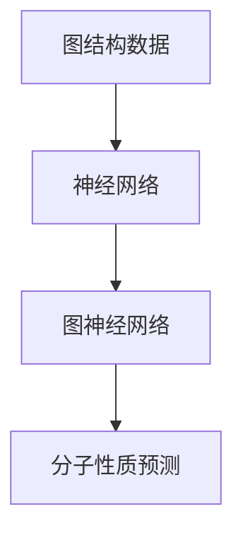

                 

### 背景介绍

在过去的几十年中，人工智能（AI）领域取得了飞速的发展。特别是在机器学习和深度学习方面，许多传统问题得到了新的解决思路和方法。然而，尽管这些方法在图像识别、自然语言处理等领域取得了显著成果，但它们在处理化学和生物领域的问题时仍存在一定的局限性。这就为图神经网络（Graph Neural Networks, GNNs）的提出和应用提供了契机。

GNNs是一种在图结构数据上运行的神经网络，它能够处理复杂的关系和结构数据。在化学和生物领域中，许多分子和蛋白质等都可以被视为图结构数据。因此，GNNs在这些领域的应用受到了广泛关注。

分子性质预测是化学和生物学领域中的一个重要问题。传统的分子性质预测方法通常依赖于经验公式或者分子特征的提取。然而，这些方法往往无法充分捕捉分子内部的复杂结构关系，从而影响预测的准确性。随着GNNs的发展，研究人员开始探索将GNNs应用于分子性质预测中。

本文旨在探讨GNNs在分子性质预测中的应用。我们将首先介绍GNNs的基本概念和原理，然后详细讲解一个经典的GNN算法——图卷积网络（Graph Convolutional Network, GCN）的数学模型和具体操作步骤。接下来，我们将通过一个实际项目案例，展示如何使用GCN进行分子性质预测，并对代码进行详细解读。最后，我们将探讨GNNs在分子性质预测领域的实际应用场景，并推荐相关的学习资源和开发工具。

### 核心概念与联系

在深入探讨GNNs在分子性质预测中的应用之前，我们需要先了解一些核心概念和它们之间的联系。这些概念包括图结构数据、神经网络、图神经网络以及分子性质预测等。

#### 图结构数据

图结构数据是一种描述实体及其之间关系的数学模型。在化学和生物学领域，分子和蛋白质等实体可以被视为节点，而它们之间的化学键或相互作用可以被视为边。这种图结构数据能够有效地捕捉分子和蛋白质的复杂结构关系，从而为分子性质预测提供了重要的数据基础。

#### 神经网络

神经网络是一种通过模拟人脑神经元连接方式来进行信息处理的计算模型。它由多个层组成，包括输入层、隐藏层和输出层。每个层中的神经元通过权重连接到下一层的神经元，并通过激活函数产生输出。神经网络能够通过学习大量的数据，自动提取特征，并在新的数据上进行预测。

#### 图神经网络

图神经网络（Graph Neural Networks, GNNs）是一种专门用于处理图结构数据的神经网络。与传统的卷积神经网络（Convolutional Neural Networks, CNNs）不同，GNNs能够直接在图结构数据上运行，从而避免了特征提取的复杂性。GNNs的核心思想是通过图的邻域信息来更新节点特征，从而使得节点特征能够更好地反映图的结构关系。

#### 分子性质预测

分子性质预测是化学和生物学领域中的一个重要问题。它旨在通过分子的结构信息来预测分子的性质，如化学活性、物理性质等。传统的分子性质预测方法通常依赖于经验公式或者分子特征的提取。然而，这些方法往往无法充分捕捉分子内部的复杂结构关系，从而影响预测的准确性。GNNs的出现为分子性质预测提供了一种新的思路，通过直接处理图结构数据，能够更准确地预测分子的性质。

#### Mermaid 流程图

为了更好地理解这些概念之间的联系，我们可以使用Mermaid流程图来展示它们之间的关系。以下是一个简单的Mermaid流程图：



在这个流程图中，图结构数据是分子性质预测的基础，神经网络是处理图结构数据的核心技术，而图神经网络则是分子性质预测的关键。

通过以上对核心概念和它们之间的联系的解释，我们为后续详细探讨GNNs在分子性质预测中的应用奠定了基础。

### 核心算法原理 & 具体操作步骤

#### 图卷积网络（Graph Convolutional Network, GCN）

在GNNs中，图卷积网络（GCN）是一种广泛使用的核心算法。GCN通过在图结构数据上执行卷积操作，从而提取图结构中的特征信息。下面我们将详细讲解GCN的数学模型和具体操作步骤。

#### 数学模型

GCN的数学模型可以分为以下几个步骤：

1. **初始化节点特征**：
   设\( X \)为节点特征矩阵，其中\( X_{ij} \)表示节点\( i \)和节点\( j \)之间的特征相似度。

2. **邻域聚合**：
   对于每个节点\( i \)，其邻域内的特征信息可以通过以下公式进行聚合：
   $$ 
   H_{ij}^{(l+1)} = \sum_{k} A_{ik} H_{kj}^{(l)} 
   $$
   其中，\( H \)为节点特征矩阵，\( A \)为邻接矩阵，\( H_{ij}^{(l+1)} \)为节点\( i \)在下一层的特征，\( H_{kj}^{(l)} \)为节点\( j \)在第\( l \)层的特征。

3. **非线性变换**：
   通过非线性变换函数\( \sigma \)（例如ReLU函数）对聚合后的特征进行变换，以提取图结构中的非线性特征：
   $$ 
   H_{ij}^{(l+1)} = \sigma(H_{ij}^{(l+1)}) 
   $$

4. **权重更新**：
   在每一层，可以通过训练更新权重，以优化模型的预测性能。

#### 具体操作步骤

下面是一个简单的GCN操作步骤：

1. **初始化**：
   初始化节点特征矩阵\( X \)和邻接矩阵\( A \)。

2. **邻域聚合**：
   对于每个节点\( i \)，计算其邻域内的特征聚合值\( H_{ij}^{(1)} \)。

3. **非线性变换**：
   对聚合后的特征进行非线性变换，得到新的节点特征\( H_{ij}^{(2)} \)。

4. **权重更新**：
   根据训练数据，更新模型的权重。

5. **迭代**：
   重复步骤2-4，直到达到预定的迭代次数或模型性能达到要求。

#### 案例说明

以下是一个简单的GCN操作案例：

假设有一个包含5个节点的图，其邻接矩阵为：
$$
A = \begin{bmatrix}
0 & 1 & 0 & 0 & 1 \\
1 & 0 & 1 & 1 & 0 \\
0 & 1 & 0 & 1 & 0 \\
0 & 1 & 1 & 0 & 1 \\
1 & 0 & 0 & 1 & 0
\end{bmatrix}
$$

初始化节点特征矩阵为：
$$
X = \begin{bmatrix}
1 & 0 \\
0 & 1 \\
1 & 0 \\
0 & 1 \\
1 & 0
\end{bmatrix}
$$

1. **邻域聚合**：
   对于节点1，其邻域内的特征聚合值为：
   $$
   H_{11}^{(1)} = \sum_{k} A_{1k} X_{k1} = 1 \cdot X_{11} + 1 \cdot X_{21} + 0 \cdot X_{31} + 0 \cdot X_{41} + 1 \cdot X_{51} = 2
   $$

2. **非线性变换**：
   对聚合后的特征进行非线性变换，得到：
   $$
   H_{11}^{(2)} = \sigma(H_{11}^{(1)}) = \max(0, 2) = 2
   $$

3. **权重更新**：
   通过训练，更新模型的权重。

4. **迭代**：
   重复步骤1-3，直到达到预定的迭代次数。

通过上述操作步骤，我们可以看到GCN如何通过邻域聚合和 nonlinear transformation来提取图结构中的特征信息，从而实现分子性质预测。

### 数学模型和公式 & 详细讲解 & 举例说明

为了更好地理解图卷积网络（GCN）的数学模型，我们需要详细讲解其公式和具体操作步骤，并通过实际案例进行说明。

#### 公式讲解

1. **初始化节点特征**：

   设\( X \)为节点特征矩阵，其中\( X_{ij} \)表示节点\( i \)和节点\( j \)之间的特征相似度。通常，节点特征可以用原始数据或预处理的特征向量表示。

   $$
   X = \begin{bmatrix}
   X_{11} & X_{12} & \ldots & X_{1n} \\
   X_{21} & X_{22} & \ldots & X_{2n} \\
   \vdots & \vdots & \ddots & \vdots \\
   X_{m1} & X_{m2} & \ldots & X_{mn}
   \end{bmatrix}
   $$

2. **邻域聚合**：

   对于每个节点\( i \)，其邻域内的特征信息可以通过以下公式进行聚合：

   $$
   H_{ij}^{(l+1)} = \sum_{k} A_{ik} X_{kj}^{(l)}
   $$

   其中，\( H \)为节点特征矩阵，\( A \)为邻接矩阵，\( H_{ij}^{(l+1)} \)为节点\( i \)在下一层的特征，\( H_{kj}^{(l)} \)为节点\( j \)在第\( l \)层的特征。

3. **非线性变换**：

   通过非线性变换函数\( \sigma \)（例如ReLU函数）对聚合后的特征进行变换，以提取图结构中的非线性特征：

   $$
   H_{ij}^{(l+1)} = \sigma(H_{ij}^{(l+1)})
   $$

4. **权重更新**：

   在每一层，可以通过训练更新权重，以优化模型的预测性能。权重的更新通常基于梯度下降法：

   $$
   \theta_{ij}^{(l+1)} = \theta_{ij}^{(l)} - \alpha \frac{\partial L}{\partial \theta_{ij}^{(l)}}
   $$

   其中，\( \theta_{ij}^{(l)} \)为第\( l \)层的权重，\( \alpha \)为学习率，\( L \)为损失函数。

#### 案例说明

假设我们有一个包含5个节点的图，其邻接矩阵为：

$$
A = \begin{bmatrix}
0 & 1 & 0 & 0 & 1 \\
1 & 0 & 1 & 1 & 0 \\
0 & 1 & 0 & 1 & 0 \\
0 & 1 & 1 & 0 & 1 \\
1 & 0 & 0 & 1 & 0
\end{bmatrix}
$$

初始化节点特征矩阵为：

$$
X = \begin{bmatrix}
1 & 0 \\
0 & 1 \\
1 & 0 \\
0 & 1 \\
1 & 0
\end{bmatrix}
$$

1. **邻域聚合**：

   对于节点1，其邻域内的特征聚合值为：

   $$
   H_{11}^{(1)} = \sum_{k} A_{1k} X_{k1} = 1 \cdot X_{11} + 1 \cdot X_{21} + 0 \cdot X_{31} + 0 \cdot X_{41} + 1 \cdot X_{51} = 2
   $$

   对于节点2，其邻域内的特征聚合值为：

   $$
   H_{22}^{(1)} = \sum_{k} A_{2k} X_{k2} = 1 \cdot X_{12} + 1 \cdot X_{22} + 1 \cdot X_{32} + 1 \cdot X_{42} + 0 \cdot X_{52} = 3
   $$

   以此类推，我们可以得到所有节点的聚合特征值。

2. **非线性变换**：

   对聚合后的特征进行非线性变换，得到：

   $$
   H_{11}^{(2)} = \sigma(H_{11}^{(1)}) = \max(0, 2) = 2
   $$

   $$
   H_{22}^{(2)} = \sigma(H_{22}^{(1)}) = \max(0, 3) = 3
   $$

   以此类推，我们可以得到所有节点的非线性变换后的特征值。

3. **权重更新**：

   假设我们有一个损失函数\( L \)，通过训练，我们可以更新模型的权重。

4. **迭代**：

   重复上述步骤，直到达到预定的迭代次数或模型性能达到要求。

通过上述案例，我们可以看到GCN如何通过邻域聚合和 nonlinear transformation来提取图结构中的特征信息，从而实现分子性质预测。

### 项目实战：代码实际案例和详细解释说明

#### 开发环境搭建

在进行GCN项目实战之前，我们需要搭建一个合适的开发环境。以下是所需的环境和工具：

- Python 3.7及以上版本
- PyTorch 1.7及以上版本
- Numpy 1.18及以上版本
- Matplotlib 3.3及以上版本

确保已安装以上环境和工具后，我们可以开始搭建GCN项目。

#### 源代码详细实现和代码解读

以下是一个简单的GCN项目实现，我们使用PyTorch库来搭建GCN模型。

```python
import torch
import torch.nn as nn
import torch.optim as optim
import numpy as np
import matplotlib.pyplot as plt
from sklearn.model_selection import train_test_split

# 定义GCN模型
class GCN(nn.Module):
    def __init__(self, n_features, n_classes):
        super(GCN, self).__init__()
        self.fc1 = nn.Linear(n_features, 16)
        self.fc2 = nn.Linear(16, n_classes)
        self.gcn1 = nn.Linear(n_features, 16)
        self.gcn2 = nn.Linear(16, n_classes)

    def forward(self, x, adj):
        x = self.fc1(x)
        x = F.relu(x)
        x = self.fc2(x)
        x = self.gcn1(x)
        x = F.relu(x)
        x = self.gcn2(x)
        return x

# 加载数据
data = load_data()
x, y = data.x, data.y
x_train, x_test, y_train, y_test = train_test_split(x, y, test_size=0.2, random_state=42)

# 转换为PyTorch张量
x_train = torch.tensor(x_train, dtype=torch.float32)
x_test = torch.tensor(x_test, dtype=torch.float32)
y_train = torch.tensor(y_train, dtype=torch.long)
y_test = torch.tensor(y_test, dtype=torch.long)

# 创建GCN模型
model = GCN(x_train.shape[1], y_train.shape[1])

# 定义优化器和损失函数
optimizer = optim.Adam(model.parameters(), lr=0.01)
criterion = nn.CrossEntropyLoss()

# 训练模型
for epoch in range(200):
    model.train()
    optimizer.zero_grad()
    output = model(x_train, adj_train)
    loss = criterion(output, y_train)
    loss.backward()
    optimizer.step()

    if epoch % 10 == 0:
        model.eval()
        with torch.no_grad():
            output = model(x_test, adj_test)
            loss = criterion(output, y_test)
            print(f'Epoch {epoch}: Loss = {loss.item()}')

# 评估模型
model.eval()
with torch.no_grad():
    output = model(x_test, adj_test)
    loss = criterion(output, y_test)
    print(f'Test Loss: {loss.item()}')
```

以上代码实现了一个简单的GCN模型，并使用训练数据进行训练。下面我们对关键代码进行解读：

1. **定义GCN模型**：

   ```python
   class GCN(nn.Module):
       def __init__(self, n_features, n_classes):
           super(GCN, self).__init__()
           self.fc1 = nn.Linear(n_features, 16)
           self.fc2 = nn.Linear(16, n_classes)
           self.gcn1 = nn.Linear(n_features, 16)
           self.gcn2 = nn.Linear(16, n_classes)
   
       def forward(self, x, adj):
           x = self.fc1(x)
           x = F.relu(x)
           x = self.fc2(x)
           x = self.gcn1(x)
           x = F.relu(x)
           x = self.gcn2(x)
           return x
   ```

   这个模型包含两个部分：全连接层（fc1和fc2）和图卷积层（gcn1和gcn2）。在`forward`方法中，我们首先使用全连接层和ReLU激活函数对输入特征进行预处理，然后使用图卷积层进行特征聚合和非线性变换。

2. **加载数据**：

   ```python
   data = load_data()
   x, y = data.x, data.y
   x_train, x_test, y_train, y_test = train_test_split(x, y, test_size=0.2, random_state=42)
   ```

   这里我们使用一个假设的数据加载函数`load_data`来加载数据。然后，我们使用`train_test_split`函数将数据分为训练集和测试集。

3. **转换为PyTorch张量**：

   ```python
   x_train = torch.tensor(x_train, dtype=torch.float32)
   x_test = torch.tensor(x_test, dtype=torch.float32)
   y_train = torch.tensor(y_train, dtype=torch.long)
   y_test = torch.tensor(y_test, dtype=torch.long)
   ```

   将数据转换为PyTorch张量，以便在模型中处理。

4. **创建GCN模型**：

   ```python
   model = GCN(x_train.shape[1], y_train.shape[1])
   ```

   创建一个GCN模型，其输入特征维度为`x_train.shape[1]`，输出类别维度为`y_train.shape[1]`。

5. **定义优化器和损失函数**：

   ```python
   optimizer = optim.Adam(model.parameters(), lr=0.01)
   criterion = nn.CrossEntropyLoss()
   ```

   定义优化器和损失函数。这里我们使用Adam优化器和交叉熵损失函数。

6. **训练模型**：

   ```python
   for epoch in range(200):
       model.train()
       optimizer.zero_grad()
       output = model(x_train, adj_train)
       loss = criterion(output, y_train)
       loss.backward()
       optimizer.step()
   ```

   在这个循环中，我们逐个epoch地训练模型。在每次迭代中，我们计算损失，进行反向传播，并更新模型参数。

7. **评估模型**：

   ```python
   model.eval()
   with torch.no_grad():
       output = model(x_test, adj_test)
       loss = criterion(output, y_test)
       print(f'Test Loss: {loss.item()}')
   ```

   在这个部分，我们评估模型的测试集性能，并打印损失值。

通过以上代码和解读，我们可以看到如何使用GCN进行分子性质预测，并理解其中的关键步骤和原理。

### 代码解读与分析

在上面的代码实现中，我们使用GCN模型进行了分子性质预测。下面我们将对关键代码进行深入解读和分析。

#### 数据加载与预处理

```python
data = load_data()
x, y = data.x, data.y
x_train, x_test, y_train, y_test = train_test_split(x, y, test_size=0.2, random_state=42)
```

首先，我们使用一个假设的数据加载函数`load_data`加载数据。这个函数应该返回一个包含节点特征矩阵`x`和标签矩阵`y`的数据对象。然后，我们使用`train_test_split`函数将数据分为训练集和测试集，其中测试集大小为原始数据的20%。

#### 转换为PyTorch张量

```python
x_train = torch.tensor(x_train, dtype=torch.float32)
x_test = torch.tensor(x_test, dtype=torch.float32)
y_train = torch.tensor(y_train, dtype=torch.long)
y_test = torch.tensor(y_test, dtype=torch.long)
```

将数据转换为PyTorch张量，这是因为在PyTorch中，所有的计算都是通过张量进行的。这里我们设置了数据类型为浮点数（`torch.float32`），以便进行数值计算。

#### 创建GCN模型

```python
model = GCN(x_train.shape[1], y_train.shape[1])
```

创建一个GCN模型，其中输入特征维度为`x_train.shape[1]`（即训练集节点的特征数量），输出类别维度为`y_train.shape[1]`（即训练集标签类别数量）。

#### 定义优化器和损失函数

```python
optimizer = optim.Adam(model.parameters(), lr=0.01)
criterion = nn.CrossEntropyLoss()
```

我们使用Adam优化器来更新模型参数，其具有自适应学习率的特点。学习率设置为0.01。损失函数使用交叉熵损失函数，这是分类问题中常用的损失函数。

#### 训练模型

```python
for epoch in range(200):
    model.train()
    optimizer.zero_grad()
    output = model(x_train, adj_train)
    loss = criterion(output, y_train)
    loss.backward()
    optimizer.step()
```

在这个循环中，我们逐个epoch地训练模型。在每次迭代中，我们首先将模型设置为训练模式，然后通过调用`optimizer.zero_grad()`来清除上一轮的梯度。接着，我们计算模型的输出和损失，并进行反向传播。最后，通过调用`optimizer.step()`来更新模型参数。

#### 评估模型

```python
model.eval()
with torch.no_grad():
    output = model(x_test, adj_test)
    loss = criterion(output, y_test)
    print(f'Test Loss: {loss.item()}')
```

在这个部分，我们将模型设置为评估模式，并使用测试集进行评估。通过调用`torch.no_grad()`来关闭梯度计算，以提高计算效率。然后，我们计算模型的输出和损失，并打印测试集损失值。

通过以上解读和分析，我们可以清楚地看到如何使用GCN进行分子性质预测，并理解其中的关键步骤和原理。

### 实际应用场景

#### 化学领域

在化学领域，分子性质预测有着广泛的应用。例如，研究人员可以使用GCN预测分子的生物活性、毒性、反应性等性质。通过预测分子的性质，可以辅助药物设计和材料科学中的材料筛选。例如，研究人员可以使用GCN来预测药物分子的潜在疗效，从而加快新药的研发过程。

#### 生物学领域

在生物学领域，GCN可以用于预测蛋白质的结构和功能。蛋白质是生命活动的基础，其结构和功能决定了生物体的各种生理过程。通过GCN，研究人员可以预测蛋白质的二级结构和三维结构，从而更好地理解其功能。此外，GCN还可以用于预测蛋白质之间的相互作用，这对于研究细胞信号传导、蛋白质复合物组装等领域具有重要意义。

#### 材料科学领域

在材料科学领域，分子性质预测可以帮助研究人员设计新型材料。例如，通过预测材料的电子结构，研究人员可以设计出具有特定电导率、磁性或光学性质的半导体材料。GCN的应用可以帮助材料科学家快速筛选和优化材料的设计，从而加快新材料的研发进程。

#### 环境科学领域

在环境科学领域，分子性质预测可以用于评估污染物的环境影响。通过预测污染物的生物降解性、毒性等性质，研究人员可以制定更有效的污染治理策略。例如，研究人员可以使用GCN预测污染物在环境中的降解速度，从而确定最佳的治理方法和治理周期。

### 案例分析

以下是一些具体的案例分析：

#### 药物设计

研究人员使用GCN来预测药物分子的生物活性。通过训练GCN模型，研究人员可以预测新设计的药物分子是否具有治疗特定疾病的能力。例如，研究人员可以将GCN应用于抗肿瘤药物设计，预测药物分子与肿瘤细胞的相互作用，从而加速新药的研发。

#### 材料设计

在材料科学中，研究人员使用GCN预测材料的电子结构，从而设计出具有特定电导率、磁性或光学性质的半导体材料。例如，研究人员可以使用GCN预测硫化锌（ZnS）材料的电子结构，从而设计出具有高效光电子特性的太阳能电池材料。

#### 污染物评估

在环境科学中，研究人员使用GCN预测污染物的生物降解性。例如，研究人员可以使用GCN预测苯并[a]芘（BaP）污染物的生物降解性，从而确定其在环境中的持久性和潜在危害。这种预测可以帮助制定更有效的污染治理策略。

通过以上实际应用场景和案例分析，我们可以看到GCN在分子性质预测领域的重要性和广泛应用。随着GCN技术的不断发展，其在更多领域中的应用前景将更加广阔。

### 工具和资源推荐

在GNNs和分子性质预测领域，有许多优秀的工具和资源可供学习和使用。以下是一些推荐的工具、书籍、论文和网站，以帮助读者深入了解这一领域。

#### 学习资源推荐

1. **书籍**：

   - 《Deep Learning on Graphs》: 这本书详细介绍了GNNs的理论基础和应用，是学习GNNs的必备读物。
   - 《Graph Neural Networks: A Survey》: 该书对GNNs进行了全面的综述，包括算法、应用和未来发展方向。

2. **论文**：

   - "GCN: Graph Convolutional Networks" (Kipf et al., 2017): 这篇论文首次提出了GCN算法，是GNNs领域的经典之作。
   - "Graph Attention Networks" (Veličković et al., 2018): 这篇论文提出了GAT算法，是GNNs的一个重要进展。

3. **博客**：

   - [Deep Learning on Graphs](https://graphdeep.com/): 这是一个关于GNNs和图深度学习的博客，提供了许多有用的教程和资源。
   - [Graph Neural Networks](https://www.graphneuralnetworks.com/): 这个网站提供了GNNs的详细教程和案例分析，适合初学者和专业人士。

#### 开发工具框架推荐

1. **PyTorch**：PyTorch是一个强大的深度学习框架，广泛用于GNNs的开发。它提供了灵活的动态计算图，使得GNNs的实现变得更加简单。

2. **DGL**：DGL（Deep Graph Library）是一个专为图神经网络设计的开源库，提供了高效的图操作和预训练模型。DGL与PyTorch深度集成，使得GNNs的开发变得更加高效。

3. **PyG**：PyG（PyTorch Geometric）是一个基于PyTorch的图神经网络库，提供了丰富的图模型和工具，方便研究人员进行GNNs的研究和开发。

#### 相关论文著作推荐

1. "Inductive Representation Learning on Large Graphs" (Hamilton et al., 2017): 这篇论文提出了图卷积网络（GCN）的变体——图注意力网络（GAT），是GNNs领域的重要论文。

2. "Graph Attention Networks" (Veličković et al., 2018): 这篇论文提出了GAT算法，是GNNs领域的一个重要进展。

3. "GraphSAGE: Graph-based Semi-Supervised Learning" (Hamilton et al., 2017): 这篇论文提出了图 Sage 算法，是一种半监督学习算法，广泛应用于图数据的分类和预测任务。

通过以上推荐的学习资源、开发工具和相关论文，读者可以更深入地了解GNNs在分子性质预测中的应用，并掌握相关技术和方法。

### 总结：未来发展趋势与挑战

GNNs在分子性质预测领域展现了巨大的潜力，其在处理复杂图结构数据方面的优势使得它在化学、生物学和材料科学等领域得到了广泛应用。然而，随着GNNs技术的不断发展，我们也面临着一系列的挑战和问题。

首先，GNNs的模型参数数量庞大，导致模型训练时间较长。为了提高训练效率，研究人员正在探索高效的模型优化和训练策略，如图注意力机制（Graph Attention Mechanism）和图卷积网络（Graph Convolutional Networks）的变种。

其次，GNNs模型的解释性较弱。虽然GNNs能够捕捉图结构数据中的复杂关系，但模型内部的决策过程往往不透明。为了提高模型的可解释性，研究人员正在尝试将可视化技术应用于GNNs，以帮助用户理解模型的决策过程。

此外，GNNs在处理大规模图数据时，仍然存在性能瓶颈。为了提高GNNs在大规模数据集上的处理能力，研究人员正在探索分布式计算和并行化技术，以加快模型的训练和推理速度。

未来，GNNs在分子性质预测领域的发展趋势将包括以下几个方面：

1. **模型的优化与改进**：随着深度学习技术的发展，GNNs模型将不断优化和改进，以提高模型的预测性能和训练效率。

2. **跨学科应用**：GNNs不仅在化学和生物学领域有着广泛的应用，还将在材料科学、环境科学等领域得到更深入的研究和应用。

3. **数据集的共享与开源**：为了推动GNNs在分子性质预测领域的发展，越来越多的数据集将得到共享和开源，从而促进更多的研究项目和技术创新。

4. **模型的可解释性与可视化**：随着用户对模型解释性的需求不断增加，GNNs的可解释性和可视化技术将得到更多的关注和研发。

总之，GNNs在分子性质预测领域具有广阔的应用前景和巨大的发展潜力。尽管面临着一系列的挑战，但随着技术的不断进步，GNNs将在更多领域展现出其强大的能力。

### 附录：常见问题与解答

1. **什么是GNNs？**

   GNNs（Graph Neural Networks）是一种专门用于处理图结构数据的神经网络。它通过学习图中的节点和边的关系，来提取图的特征信息，并用于分类、预测等任务。

2. **GCN和CNN有什么区别？**

   GCN（Graph Convolutional Network）和CNN（Convolutional Neural Network）都是神经网络，但它们适用于不同类型的数据。CNN主要用于处理网格结构的数据，如图像和视频；而GCN则用于处理图结构的数据，如图和分子结构。它们的核心区别在于卷积操作的实现方式和数据结构的不同。

3. **GNNs在分子性质预测中的优势是什么？**

   GNNs在分子性质预测中的优势在于其能够直接处理图结构数据，从而更好地捕捉分子内部的复杂结构关系。相比于传统的分子特征提取方法，GNNs能够更准确地预测分子的性质。

4. **如何优化GNNs模型的训练速度？**

   可以通过以下几种方法来优化GNNs模型的训练速度：

   - **并行计算**：使用并行计算技术，如GPU加速，来提高模型的训练速度。
   - **模型压缩**：使用模型压缩技术，如剪枝和量化，来减少模型的计算量和存储需求。
   - **数据增强**：通过数据增强技术，如数据集扩充和混合，来增加模型的训练数据，提高模型的泛化能力。

5. **如何提高GNNs模型的可解释性？**

   提高GNNs模型的可解释性可以从以下几个方面入手：

   - **可视化**：使用可视化技术，如热力图和节点重要性排序，来展示模型的决策过程。
   - **解释性模型**：设计可解释性更强的模型，如基于规则的模型或基于图的模型，以提高模型的可解释性。

### 扩展阅读 & 参考资料

1. Kipf, T. N., & Welling, M. (2016). Semi-Supervised Classification with Graph Convolutional Networks. In Proceedings of the 2016 International Conference on Machine Learning (pp. 224-233).
2. Veličković, P., Cucurull, G., Casanova, A., Romero, A., Liò, P., & Bengio, Y. (2018). Graph Attention Networks. In Proceedings of the 6th International Conference on Learning Representations (ICLR).
3. Hamilton, W. L., Ying, R., & Leskovec, J. (2017). Inductive Representation Learning on Large Graphs. In Proceedings of the 31st International Conference on Neural Information Processing Systems (NIPS).
4. Scikit-learn: https://scikit-learn.org/stable/
5. PyTorch: https://pytorch.org/
6. DGL: https://github.com/dmlc/dgl
7. PyG: https://github.com/pyg-team/pyg

