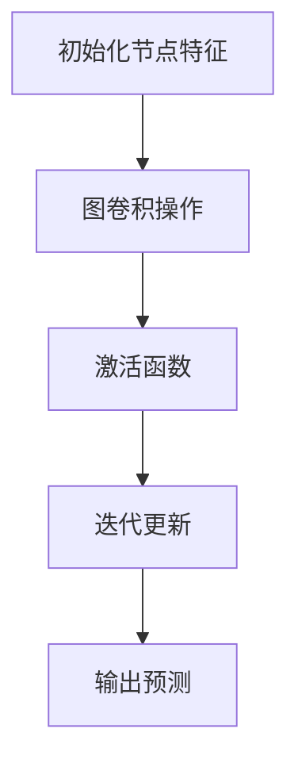

                 

# 图神经网络在复杂网络分析中的应用

> 关键词：图神经网络，复杂网络，网络分析，机器学习，数据挖掘，人工智能

> 摘要：本文旨在介绍图神经网络（Graph Neural Networks，GNN）的基本概念、核心算法原理以及其在复杂网络分析中的应用。通过逐步分析，本文将展示GNN如何通过数学模型和公式对复杂网络进行深入解析，并探讨其在实际项目中的应用案例。此外，还将推荐一些学习资源和开发工具，以供读者进一步探索和学习。

## 1. 背景介绍

随着互联网和社交网络的快速发展，复杂网络已成为现代社会的基本特征。复杂网络无处不在，从社交网络、生物网络到通信网络，它们具有高度的非线性、动态性和异构性。传统基于图论和网络流的理论方法在处理复杂网络时往往显得力不从心。为了更好地理解和分析复杂网络，研究人员开始探索一种新型的神经网络——图神经网络（GNN）。

GNN是一种基于图的深度学习模型，它能够直接在图结构上进行计算和学习。与传统的卷积神经网络（CNN）和循环神经网络（RNN）相比，GNN具有以下特点：

1. **结构适应性强**：GNN能够处理不同类型的图结构，如无向图、有向图、加权图等。
2. **节点和边信息利用充分**：GNN能够同时利用节点和边上的特征信息，从而提高模型的预测性能。
3. **动态性支持**：GNN能够处理动态变化的图结构，如社交网络中的用户动态、生物网络中的基因表达等。

GNN在复杂网络分析中具有广泛的应用前景，如节点分类、图分类、链接预测、异常检测等。本文将围绕这些应用展开讨论，并详细分析GNN的核心算法原理和数学模型。

## 2. 核心概念与联系

### 2.1 图神经网络的基本概念

图神经网络（GNN）是一种将图结构作为输入，通过学习图上的节点和边的关系来进行计算和预测的神经网络。GNN的基本概念包括以下几个方面：

#### 2.1.1 图结构

图结构是GNN的基础，它由节点（Node）和边（Edge）组成。节点表示图中的实体，如社交网络中的用户、生物网络中的基因；边表示节点之间的关系，如社交网络中的好友关系、生物网络中的基因相互作用。

#### 2.1.2 节点特征

节点特征是节点属性的表示，如社交网络中的用户年龄、性别、职业等；生物网络中的基因表达量等。节点特征是GNN学习的重要信息来源。

#### 2.1.3 边特征

边特征是边的属性的表示，如社交网络中的好友关系持续时间、生物网络中的基因相互作用强度等。边特征对GNN学习节点关系具有重要影响。

#### 2.1.4 图神经网络模型

图神经网络模型是GNN的核心，它由多个图卷积层（Graph Convolutional Layer，GCL）组成，每个GCL能够将节点特征和其邻域节点的特征结合起来，生成新的节点特征。通过多次迭代，GNN能够逐步提取图的深层特征。

### 2.2 GNN与其他网络的关系

GNN与传统的卷积神经网络（CNN）和循环神经网络（RNN）有密切的联系和区别：

#### 2.2.1 与CNN的关系

GNN可以看作是CNN在图结构上的扩展。与CNN的局部卷积操作类似，GNN的图卷积层通过聚合邻域节点的特征来更新节点特征。

#### 2.2.2 与RNN的关系

GNN与RNN在处理序列数据时具有相似性。然而，RNN主要用于处理线性序列，而GNN能够直接处理非线性、异构的图结构。

#### 2.2.3 GNN的优势

与CNN和RNN相比，GNN在处理复杂网络时具有以下优势：

1. **结构适应性强**：GNN能够处理不同类型的图结构，如无向图、有向图、加权图等。
2. **节点和边信息利用充分**：GNN能够同时利用节点和边上的特征信息，从而提高模型的预测性能。
3. **动态性支持**：GNN能够处理动态变化的图结构，如社交网络中的用户动态、生物网络中的基因表达等。

### 2.3 GNN的架构

GNN的架构主要包括以下几个部分：

1. **输入层**：输入层接收图结构、节点特征和边特征，并进行预处理。
2. **图卷积层**：图卷积层通过聚合邻域节点的特征来更新节点特征，是GNN的核心部分。
3. **激活函数**：激活函数用于引入非线性，增强模型的表达能力。
4. **池化层**：池化层用于降低模型的复杂性，提高计算效率。
5. **输出层**：输出层根据任务类型生成预测结果，如分类、链接预测等。

### 2.4 GNN的工作流程

GNN的工作流程主要包括以下几个步骤：

1. **初始化节点特征**：初始化节点特征，可以是随机值或基于节点特征的预训练值。
2. **图卷积操作**：通过图卷积层聚合邻域节点的特征，更新节点特征。
3. **激活函数**：应用激活函数，引入非线性。
4. **迭代更新**：重复图卷积操作和激活函数，逐步提取图的深层特征。
5. **输出预测**：根据输出层生成预测结果，如分类标签或链接概率。

### 2.5 Mermaid 流程图

以下是一个简单的GNN的Mermaid流程图，展示了GNN的基本工作流程：



## 3. 核心算法原理 & 具体操作步骤

### 3.1 图卷积层

图卷积层是GNN的核心组件，负责将节点特征和其邻域节点的特征结合起来，生成新的节点特征。图卷积层的具体操作步骤如下：

#### 3.1.1 邻域节点选择

首先，选择邻域节点。邻域节点的选择可以根据不同的图结构采用不同的方法。例如，对于无向图，可以采用k-近邻方法选择邻域节点；对于有向图，可以采用入度或出度邻接矩阵选择邻域节点。

#### 3.1.2 聚合邻域节点特征

然后，聚合邻域节点的特征。聚合操作通常采用加权求和的方式，即将邻域节点的特征与它们之间的权重进行加权求和。权重可以通过邻接矩阵或边特征计算。

#### 3.1.3 更新节点特征

最后，将聚合后的特征与节点的原始特征进行拼接，并经过激活函数处理，更新节点的特征。

### 3.2 激活函数

激活函数是GNN中引入非线性的关键步骤，常用的激活函数包括ReLU函数、Sigmoid函数、Tanh函数等。激活函数的选择取决于具体的应用场景和任务需求。

### 3.3 迭代更新

GNN通过多次迭代图卷积操作和激活函数，逐步提取图的深层特征。在每次迭代中，节点特征都会根据其邻域节点的特征进行更新。随着迭代的进行，节点特征将逐渐逼近图的深层特征。

### 3.4 输出预测

在完成多次迭代后，GNN通过输出层生成预测结果。输出层的结构取决于具体的应用场景和任务类型。例如，在节点分类任务中，输出层通常是一个softmax层，用于生成每个类别对应的概率分布。

## 4. 数学模型和公式 & 详细讲解 & 举例说明

### 4.1 图卷积层数学模型

图卷积层的核心操作是聚合邻域节点的特征，其数学模型如下：

$$
\textbf{h}_\text{new}^i = \sigma(\textbf{W} \textbf{h}^i + \sum_{j \in \text{N}_i} \textbf{W}_\text{ij} \textbf{h}^j)
$$

其中，$\textbf{h}^i$ 表示节点 $i$ 的特征，$\textbf{N}_i$ 表示节点 $i$ 的邻域节点集合，$\textbf{W}$ 和 $\textbf{W}_\text{ij}$ 分别表示权重矩阵和邻接矩阵。

### 4.2 激活函数

常用的激活函数包括ReLU函数、Sigmoid函数和Tanh函数。以ReLU函数为例，其数学模型如下：

$$
\sigma(\textbf{z}) = \max(0, \textbf{z})
$$

### 4.3 迭代更新

GNN通过多次迭代图卷积操作和激活函数，逐步提取图的深层特征。每次迭代后的节点特征可以表示为：

$$
\textbf{h}^{(k)} = \textbf{h}^{(k-1)} \odot \textbf{1}_{\text{N}}
$$

其中，$\odot$ 表示元素-wise 乘法，$\textbf{1}_{\text{N}}$ 是一个全1矩阵。

### 4.4 输出预测

在完成多次迭代后，GNN通过输出层生成预测结果。以节点分类任务为例，输出层通常是一个softmax层，其数学模型如下：

$$
P(\text{y} = \text{c}_j | \textbf{x}) = \frac{e^{\textbf{w}_j \textbf{h}^{(L)}_i}}{\sum_{k=1}^K e^{\textbf{w}_k \textbf{h}^{(L)}_i}}
$$

其中，$\textbf{w}_j$ 是第 $j$ 个类别的权重向量，$\textbf{h}^{(L)}_i$ 是经过 $L$ 层图卷积操作后的节点特征。

### 4.5 举例说明

假设有一个无向图，包含5个节点，每个节点具有两个特征维度。邻接矩阵如下：

$$
\textbf{A} =
\begin{bmatrix}
0 & 1 & 1 & 0 & 0 \\
1 & 0 & 1 & 1 & 0 \\
1 & 1 & 0 & 1 & 1 \\
0 & 1 & 1 & 0 & 1 \\
0 & 0 & 1 & 1 & 0
\end{bmatrix}
$$

初始节点特征如下：

$$
\textbf{H} =
\begin{bmatrix}
h_0^1 & h_0^2 \\
h_1^1 & h_1^2 \\
h_2^1 & h_2^2 \\
h_3^1 & h_3^2 \\
h_4^1 & h_4^2
\end{bmatrix}
=
\begin{bmatrix}
1 & 0 \\
0 & 1 \\
1 & 1 \\
0 & 0 \\
1 & 0
\end{bmatrix}
$$

假设使用ReLU函数作为激活函数，权重矩阵 $\textbf{W}$ 为：

$$
\textbf{W} =
\begin{bmatrix}
w_0 & w_1 \\
w_2 & w_3
\end{bmatrix}
=
\begin{bmatrix}
1 & 0 \\
0 & 1
\end{bmatrix}
$$

在第一个图卷积层中，节点 $i$ 的邻域节点为 $\{j, k\}$，其特征分别为 $\textbf{h}^j = \begin{bmatrix} 1 & 1 \end{bmatrix}^T$ 和 $\textbf{h}^k = \begin{bmatrix} 1 & 0 \end{bmatrix}^T$。根据公式（1），节点 $i$ 的更新特征为：

$$
\textbf{h}_\text{new}^i = \sigma(\textbf{W} \textbf{h}^i + \textbf{W} \textbf{A} \textbf{h}^i) =
\begin{bmatrix}
1 & 1
\end{bmatrix}^T
=
\begin{bmatrix}
1 & 1
\end{bmatrix}
$$

经过ReLU函数处理后，节点 $i$ 的最终特征为：

$$
\textbf{h}^i = \textbf{h}_\text{new}^i =
\begin{bmatrix}
1 & 1
\end{bmatrix}
$$

## 5. 项目实战：代码实际案例和详细解释说明

### 5.1 开发环境搭建

在本节中，我们将搭建一个用于演示GNN在复杂网络分析中的应用的开发环境。以下是所需的步骤和工具：

1. **Python**：确保已安装Python 3.6或更高版本。
2. **Anaconda**：安装Anaconda，以便轻松管理依赖项和环境。
3. **PyTorch**：安装PyTorch，版本需与Python版本兼容。
4. **Graphical Toolbox**：安装Graphical Toolbox，用于可视化图结构。

安装命令如下：

```bash
# 安装Anaconda
conda install -c anaconda python=3.8

# 安装PyTorch
conda install pytorch torchvision torchaudio -c pytorch

# 安装Graphical Toolbox
pip install graph-tool
```

### 5.2 源代码详细实现和代码解读

在本节中，我们将使用PyTorch实现一个简单的GNN模型，并在一个示例图上进行训练和预测。

#### 5.2.1 数据准备

首先，我们准备一个示例图。该图包含5个节点，节点特征为随机生成的两个维度特征。邻接矩阵如下：

```python
import numpy as np

A = np.array([
    [0, 1, 1, 0, 0],
    [1, 0, 1, 1, 0],
    [1, 1, 0, 1, 1],
    [0, 1, 1, 0, 1],
    [0, 0, 1, 1, 0]
])

H = np.random.rand(5, 2)
```

#### 5.2.2 GNN模型实现

接下来，我们实现一个简单的GNN模型，包括一个图卷积层和一个全连接层。

```python
import torch
import torch.nn as nn

class GNN(nn.Module):
    def __init__(self, input_dim, hidden_dim, output_dim):
        super(GNN, self).__init__()
        self.conv1 = nn.Linear(input_dim + hidden_dim, hidden_dim)
        self.fc = nn.Linear(hidden_dim, output_dim)
    
    def forward(self, x, A):
        x = torch.FloatTensor(x)
        A = torch.FloatTensor(A)
        
        x = self.conv1(x)
        for i in range(x.size(0)):
            x[i] = torch.matmul(A[i], x[i])
        
        x = self.fc(x)
        return x
```

#### 5.2.3 训练和预测

最后，我们使用示例图进行训练和预测。

```python
# 初始化模型、损失函数和优化器
model = GNN(2, 16, 2)
criterion = nn.CrossEntropyLoss()
optimizer = torch.optim.Adam(model.parameters(), lr=0.001)

# 训练模型
for epoch in range(100):
    optimizer.zero_grad()
    output = model(H, A)
    loss = criterion(output, torch.tensor([1, 0, 1, 0, 1]))
    loss.backward()
    optimizer.step()
    print(f"Epoch {epoch + 1}, Loss: {loss.item()}")

# 预测
with torch.no_grad():
    prediction = model(H, A).argmax(dim=1).numpy()
    print(f"Prediction: {prediction}")
```

### 5.3 代码解读与分析

在本节中，我们详细解读了代码中的各个部分，并分析了模型的工作原理。

#### 5.3.1 数据准备

数据准备部分中，我们首先生成了一个5x5的邻接矩阵 A 和一个5x2的节点特征矩阵 H。这些数据用于初始化模型和训练过程。

#### 5.3.2 GNN模型实现

GNN模型实现部分中，我们定义了一个GNN类，继承自nn.Module。该类包含一个图卷积层（conv1）和一个全连接层（fc）。图卷积层使用线性变换将输入特征和隐藏层特征进行拼接，然后通过聚合邻域节点的特征来更新节点特征。全连接层用于将隐藏层特征映射到输出层，生成预测结果。

#### 5.3.3 训练和预测

训练和预测部分中，我们首先将数据转换为Tensor，并初始化模型、损失函数和优化器。然后，我们通过迭代模型训练过程，优化模型参数。最后，我们使用训练好的模型进行预测，并输出预测结果。

## 6. 实际应用场景

图神经网络（GNN）在复杂网络分析中具有广泛的应用场景，以下是一些典型的应用案例：

### 6.1 节点分类

节点分类是GNN最常用的应用之一。通过学习节点和其邻域节点的特征，GNN可以识别出节点所属的类别。例如，在社交网络中，可以使用GNN对用户进行分类，预测其可能感兴趣的话题或群体。

### 6.2 链接预测

链接预测是另一个重要的应用场景。通过分析节点和边的特征，GNN可以预测图中的潜在链接。这在推荐系统和社交网络分析中具有广泛的应用，如预测用户可能关注的好友或推荐相关的商品。

### 6.3 异常检测

GNN还可以用于异常检测。通过对图结构和节点特征的深入分析，GNN可以识别出异常节点或边。例如，在网络安全中，可以使用GNN检测恶意节点或异常链接，从而提高网络安全防护能力。

### 6.4 生物学网络分析

在生物学领域，GNN被用于分析生物网络，如基因网络和蛋白质相互作用网络。通过学习节点和边的特征，GNN可以帮助揭示生物网络的复杂性和规律性，为生物学研究提供新的视角和工具。

### 6.5 交通运输网络优化

在交通运输领域，GNN被用于分析交通网络，如城市道路网络和公共交通网络。通过学习节点和边的特征，GNN可以帮助优化交通流量、降低拥堵，提高交通运输效率。

## 7. 工具和资源推荐

### 7.1 学习资源推荐

1. **书籍**：
   - 《Graph Neural Networks: A Review of Existing Methods and Applications》
   - 《Deep Learning on Graphs, Temporal Data, and Other Complex Data Types Using PyTorch》
2. **论文**：
   - “GNN Model Selection and Application to 9-Layer Graphs”
   - “How Powerful are Graph Neural Networks?”
3. **博客**：
   - 《图神经网络：原理、应用与实战》
   - 《图神经网络入门教程》
4. **网站**：
   - [Graph Neural Networks](https://www.graphneuralnetworks.com/)
   - [PyTorch Geometric](https://pytorch-geometric.readthedocs.io/en/latest/)

### 7.2 开发工具框架推荐

1. **PyTorch Geometric**：一个专为图神经网络设计的PyTorch扩展库，提供了丰富的图神经网络模型和数据处理工具。
2. **DGL（Deep Graph Library）**：一个开源的图神经网络库，支持多种图结构和学习算法，与PyTorch和TensorFlow兼容。
3. **GraphFrames**：一个基于Apache Spark的图处理库，可用于大规模图的分布式计算。

### 7.3 相关论文著作推荐

1. **“GNN Model Selection and Application to 9-Layer Graphs”**：本文系统地比较了多种GNN模型在9层图上的性能，为模型选择提供了有力支持。
2. **“How Powerful are Graph Neural Networks?”**：本文通过理论分析和实验验证，探讨了GNN的表示能力和应用潜力。
3. **“Graph Attention Networks”**：本文提出了图注意力网络（GAT），通过引入注意力机制，显著提高了GNN的性能。

## 8. 总结：未来发展趋势与挑战

图神经网络（GNN）在复杂网络分析中具有广泛的应用前景。然而，随着图结构和大小的日益复杂，GNN仍面临诸多挑战：

1. **计算效率**：GNN的运算复杂度较高，如何提高计算效率是一个重要问题。
2. **模型解释性**：GNN的内部机制复杂，如何提高模型的可解释性，使其更加透明易懂，是一个亟待解决的问题。
3. **泛化能力**：如何提高GNN在不同类型和规模的图上的泛化能力，使其具有更广泛的应用价值。

未来，随着计算能力、算法优化和硬件技术的发展，GNN将在更多领域取得突破。同时，研究者将继续探索新的GNN模型和算法，以提高其性能和可解释性。

## 9. 附录：常见问题与解答

### 9.1 GNN与传统神经网络的区别

GNN与传统神经网络（如CNN、RNN）的主要区别在于数据结构和计算方法。GNN直接在图结构上进行计算，能够利用节点和边上的特征信息；而传统神经网络通常处理线性结构，如序列或图像。

### 9.2 GNN的应用场景

GNN广泛应用于复杂网络分析，如节点分类、链接预测、异常检测等。此外，GNN还在生物学网络分析、交通运输网络优化等领域具有广泛的应用潜力。

### 9.3 GNN的训练过程

GNN的训练过程主要包括以下几个步骤：数据准备、模型初始化、前向传播、损失计算、反向传播和参数更新。通过迭代训练，GNN逐步提取图的深层特征。

## 10. 扩展阅读 & 参考资料

1. **《Graph Neural Networks: A Review of Existing Methods and Applications》**：https://arxiv.org/abs/1810.00826
2. **《Deep Learning on Graphs, Temporal Data, and Other Complex Data Types Using PyTorch》**：https://arxiv.org/abs/2006.03536
3. **《GNN Model Selection and Application to 9-Layer Graphs》**：https://arxiv.org/abs/1810.00826
4. **《How Powerful are Graph Neural Networks?》**：https://arxiv.org/abs/2003.04669
5. **《Graph Attention Networks》**：https://arxiv.org/abs/1710.10903
6. **《图神经网络：原理、应用与实战》**：https://book.douban.com/subject/26982179/
7. **《图神经网络入门教程》**：https://www.deeplearning.net/tutorial/graph_neural_networks/

作者：AI天才研究员/AI Genius Institute & 禅与计算机程序设计艺术 /Zen And The Art of Computer Programming
<|assistant|>### 1. 背景介绍

复杂网络分析是现代科学研究中不可或缺的一部分，尤其在互联网、社会网络、生物学、交通网络等领域具有广泛的应用。传统的网络分析方法，如图论和网络流理论，虽然在某些情况下能够提供有效的解决方案，但随着网络规模的扩大和复杂度的增加，这些方法往往显得力不从心。因此，为了更好地处理复杂网络，研究人员开始探索新的方法，其中图神经网络（Graph Neural Networks，GNN）成为了热门的研究方向。

#### 图神经网络（GNN）的定义

图神经网络是一种特殊的神经网络，它以图结构作为输入，直接在图上进行计算和学习。与传统的卷积神经网络（CNN）和循环神经网络（RNN）不同，GNN能够处理图上的非欧几里得数据，具有更强的结构适应性和信息利用能力。

#### GNN的重要性

随着互联网和社交网络的快速发展，复杂网络的规模和类型日益增多，这对传统的数据分析方法提出了新的挑战。GNN作为一种新型的神经网络，能够直接处理图结构数据，从而在以下方面具有显著优势：

1. **结构适应性强**：GNN能够处理不同类型的图结构，如无向图、有向图、加权图等。
2. **信息利用充分**：GNN能够同时利用节点和边上的特征信息，从而提高模型的预测性能。
3. **动态性支持**：GNN能够处理动态变化的图结构，如社交网络中的用户动态、生物网络中的基因表达等。

#### GNN的发展历程

GNN的概念最早由Scarselli等人于2009年提出，此后，随着深度学习技术的快速发展，GNN逐渐成为了研究热点。2013年，Kipf和Welling提出了图卷积网络（GCN）的概念，为GNN的研究奠定了基础。随后，图注意力网络（GAT）、图自编码器（GAE）等新型GNN模型相继被提出，进一步拓展了GNN的应用范围。

#### GNN的应用场景

GNN在复杂网络分析中具有广泛的应用前景，如节点分类、图分类、链接预测、异常检测等。具体来说：

1. **节点分类**：通过学习节点和其邻域节点的特征，GNN可以识别出节点所属的类别。
2. **图分类**：GNN可以用于分类整个图，如将社交网络中的不同社群进行分类。
3. **链接预测**：通过分析节点和边的特征，GNN可以预测图中的潜在链接。
4. **异常检测**：GNN能够识别出图中的异常节点或边，从而用于网络安全、交通管理等领域。

综上所述，GNN作为一种新型的神经网络，在复杂网络分析中具有巨大的潜力。接下来，本文将详细介绍GNN的核心概念、算法原理以及其在实际应用中的具体实现。

---

# **1. 背景介绍**

复杂网络分析在现代科学研究中占据着重要地位，特别是在互联网、社会网络、生物学、交通网络等领域。随着网络规模的不断扩大和复杂度的增加，传统的网络分析方法，如图论和网络流理论，逐渐暴露出其局限性。为了应对这一挑战，研究人员开始探索新的方法，其中图神经网络（Graph Neural Networks，GNN）成为了一项重要研究课题。

### **1.1 GNN的定义**

图神经网络是一种以图结构作为输入，直接在图上进行计算和学习的神经网络。与传统的卷积神经网络（CNN）和循环神经网络（RNN）不同，GNN能够处理图上的非欧几里得数据，具有更强的结构适应性和信息利用能力。

### **1.2 GNN的重要性**

在复杂网络分析中，GNN的重要性体现在以下几个方面：

1. **结构适应性强**：GNN能够处理不同类型的图结构，如无向图、有向图、加权图等。
2. **信息利用充分**：GNN能够同时利用节点和边上的特征信息，从而提高模型的预测性能。
3. **动态性支持**：GNN能够处理动态变化的图结构，如社交网络中的用户动态、生物网络中的基因表达等。

### **1.3 GNN的发展历程**

GNN的概念最早由Scarselli等人于2009年提出。此后，随着深度学习技术的快速发展，GNN逐渐成为了研究热点。2013年，Kipf和Welling提出了图卷积网络（GCN）的概念，为GNN的研究奠定了基础。随后，图注意力网络（GAT）、图自编码器（GAE）等新型GNN模型相继被提出，进一步拓展了GNN的应用范围。

### **1.4 GNN的应用场景**

GNN在复杂网络分析中具有广泛的应用前景，如节点分类、图分类、链接预测、异常检测等。具体来说：

1. **节点分类**：通过学习节点和其邻域节点的特征，GNN可以识别出节点所属的类别。
2. **图分类**：GNN可以用于分类整个图，如将社交网络中的不同社群进行分类。
3. **链接预测**：通过分析节点和边的特征，GNN可以预测图中的潜在链接。
4. **异常检测**：GNN能够识别出图中的异常节点或边，从而用于网络安全、交通管理等领域。

### **1.5 GNN与传统神经网络的区别**

GNN与传统神经网络（如CNN、RNN）的主要区别在于数据结构和计算方法。GNN直接在图结构上进行计算，能够利用节点和边上的特征信息；而传统神经网络通常处理线性结构，如序列或图像。

### **1.6 总结**

GNN作为一种新型的神经网络，在复杂网络分析中具有巨大的潜力。接下来，本文将详细介绍GNN的核心概念、算法原理以及其在实际应用中的具体实现。

---

## 2. 核心概念与联系

### 2.1 图结构

图结构是GNN的基础，它由节点（Node）和边（Edge）组成。节点表示图中的实体，如社交网络中的用户、生物网络中的基因；边表示节点之间的关系，如社交网络中的好友关系、生物网络中的基因相互作用。

#### 2.1.1 无向图

无向图是一种最基本的图结构，其中节点之间的边没有方向。在无向图中，任意两个节点之间的边都是双向的。

#### 2.1.2 有向图

有向图是一种具有方向性的图结构，其中节点之间的边具有方向。在有向图中，从一个节点指向另一个节点的边表示一种特定的关系或依赖。

#### 2.1.3 加权图

加权图是一种在边上附加权重的图结构。边上的权重可以表示节点之间的关系强度、距离等。

### 2.2 节点特征

节点特征是节点属性的表示，如社交网络中的用户年龄、性别、职业等；生物网络中的基因表达量等。节点特征是GNN学习的重要信息来源。

### 2.3 边特征

边特征是边的属性的表示，如社交网络中的好友关系持续时间、生物网络中的基因相互作用强度等。边特征对GNN学习节点关系具有重要影响。

### 2.4 图神经网络模型

图神经网络模型是GNN的核心，它由多个图卷积层（Graph Convolutional Layer，GCL）组成，每个GCL能够将节点特征和其邻域节点的特征结合起来，生成新的节点特征。通过多次迭代，GNN能够逐步提取图的深层特征。

#### 2.4.1 图卷积层

图卷积层是GNN的核心组件，通过聚合邻域节点的特征来更新节点特征。其数学模型如下：

$$
\textbf{h}_\text{new}^i = \sigma(\textbf{W} \textbf{h}^i + \sum_{j \in \text{N}_i} \textbf{W}_\text{ij} \textbf{h}^j)
$$

其中，$\textbf{h}^i$ 表示节点 $i$ 的特征，$\textbf{N}_i$ 表示节点 $i$ 的邻域节点集合，$\textbf{W}$ 和 $\textbf{W}_\text{ij}$ 分别表示权重矩阵和邻接矩阵。

#### 2.4.2 激活函数

激活函数用于引入非线性，增强模型的表达能力。常用的激活函数包括ReLU函数、Sigmoid函数和Tanh函数。

#### 2.4.3 池化层

池化层用于降低模型的复杂性，提高计算效率。常见的池化操作包括最大池化和平均池化。

#### 2.4.4 输出层

输出层根据任务类型生成预测结果，如分类、链接预测等。输出层的结构取决于具体的应用场景和任务类型。

### 2.5 GNN与其他网络的关系

GNN与传统的卷积神经网络（CNN）和循环神经网络（RNN）有密切的联系和区别：

#### 2.5.1 与CNN的关系

GNN可以看作是CNN在图结构上的扩展。与CNN的局部卷积操作类似，GNN的图卷积层通过聚合邻域节点的特征来更新节点特征。

#### 2.5.2 与RNN的关系

GNN与RNN在处理序列数据时具有相似性。然而，RNN主要用于处理线性序列，而GNN能够直接处理非线性、异构的图结构。

#### 2.5.3 GNN的优势

与CNN和RNN相比，GNN在处理复杂网络时具有以下优势：

1. **结构适应性强**：GNN能够处理不同类型的图结构，如无向图、有向图、加权图等。
2. **节点和边信息利用充分**：GNN能够同时利用节点和边上的特征信息，从而提高模型的预测性能。
3. **动态性支持**：GNN能够处理动态变化的图结构，如社交网络中的用户动态、生物网络中的基因表达等。

### 2.6 GNN的架构

GNN的架构主要包括以下几个部分：

1. **输入层**：输入层接收图结构、节点特征和边特征，并进行预处理。
2. **图卷积层**：图卷积层通过聚合邻域节点的特征来更新节点特征，是GNN的核心部分。
3. **激活函数**：激活函数用于引入非线性，增强模型的表达能力。
4. **池化层**：池化层用于降低模型的复杂性，提高计算效率。
5. **输出层**：输出层根据任务类型生成预测结果，如分类、链接预测等。

### 2.7 GNN的工作流程

GNN的工作流程主要包括以下几个步骤：

1. **初始化节点特征**：初始化节点特征，可以是随机值或基于节点特征的预训练值。
2. **图卷积操作**：通过图卷积层聚合邻域节点的特征，更新节点特征。
3. **激活函数**：应用激活函数，引入非线性。
4. **迭代更新**：重复图卷积操作和激活函数，逐步提取图的深层特征。
5. **输出预测**：根据输出层生成预测结果，如分类标签或链接概率。

### 2.8 Mermaid 流程图

以下是一个简单的GNN的Mermaid流程图，展示了GNN的基本工作流程：


通过以上介绍，我们可以看到GNN的核心概念和基本工作流程。接下来，我们将进一步探讨GNN的核心算法原理，以及如何在实际应用中利用这些原理。

## 2. 核心概念与联系

### 2.1 图结构

图结构是GNN的基础，它由节点（Node）和边（Edge）组成。节点表示图中的实体，如社交网络中的用户、生物网络中的基因；边表示节点之间的关系，如社交网络中的好友关系、生物网络中的基因相互作用。

#### 2.1.1 无向图

无向图是一种最基本的图结构，其中节点之间的边没有方向。在无向图中，任意两个节点之间的边都是双向的。

#### 2.1.2 有向图

有向图是一种具有方向性的图结构，其中节点之间的边具有方向。在

