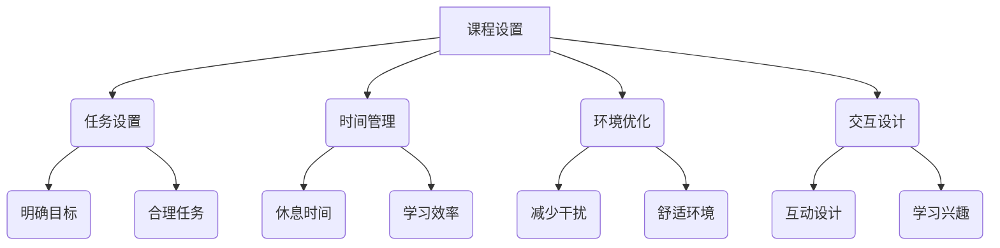

                 

# 在线教育平台的注意力保持策略

> **关键词：** 在线教育、注意力保持、算法、用户体验、学习效率

> **摘要：** 本文将探讨在线教育平台如何通过科学的方法和策略，有效保持学生的学习注意力，提高学习效果。通过对注意力保持策略的深入分析，结合实际案例，为在线教育平台的优化提供指导。

## 1. 背景介绍

随着互联网技术的迅猛发展，在线教育已经成为全球教育领域的重要趋势。与传统教育相比，在线教育具有灵活性强、资源丰富、覆盖面广等优势，但同时也面临着一些挑战。其中，如何保持学生的学习注意力是一个亟待解决的问题。

研究表明，学习过程中注意力不集中会导致学习效率降低，甚至影响学习成果。因此，在线教育平台需要采取有效的注意力保持策略，以提高学生的学习体验和学习效果。

### 1.1 注意力保持的重要性

注意力是人类认知过程的核心，它决定了我们接收、处理和记忆信息的能力。在在线教育环境中，学生需要自主管理自己的学习过程，而缺乏适当的注意力保持策略，会导致以下问题：

- **学习效率低下**：注意力不集中使得学生无法有效地接收和理解课程内容，导致学习效率降低。
- **学习成果不佳**：注意力分散导致学生对知识点的理解和记忆不牢固，影响学习成果。
- **学习兴趣下降**：长期注意力不集中会让学生感到疲惫和厌学，降低学习兴趣。

### 1.2 在线教育平台面临的挑战

在线教育平台面临的挑战主要包括：

- **课程内容多样化**：在线教育平台提供丰富多样的课程，如何确保学生在不同课程中保持注意力成为一个难题。
- **学习环境灵活性**：学生可以在各种环境下学习，如在家中、咖啡店、图书馆等，如何在这些环境下保持注意力成为挑战。
- **学习时间不固定**：学生的学习时间不固定，如何在不同时间段内保持注意力成为关键。

## 2. 核心概念与联系

为了有效保持学生的学习注意力，我们需要理解以下几个核心概念：

### 2.1 注意力分散与注意力集中

注意力分散是指在学习过程中，学生的注意力被其他事物干扰，无法集中精力学习。注意力集中则是学生能够将注意力完全集中在学习任务上，避免外界干扰。

### 2.2 注意力保持策略

注意力保持策略是指一系列的方法和技巧，旨在帮助学生保持注意力，避免分散。这些策略包括：

- **任务设置**：通过合理设置学习任务，确保学生在学习过程中有明确的目标和方向。
- **时间管理**：通过科学的时间管理，确保学生在学习过程中有足够的休息时间，避免疲劳。
- **环境优化**：通过优化学习环境，减少外界干扰，帮助学生集中注意力。
- **交互设计**：通过设计吸引学生的互动元素，提高学生的学习兴趣和参与度。

### 2.3 Mermaid 流程图



## 3. 核心算法原理 & 具体操作步骤

### 3.1 任务设置

任务设置是保持学生学习注意力的重要策略之一。具体操作步骤如下：

1. **明确学习目标**：在课程开始前，明确学生的学习目标，让学生知道他们需要完成什么任务。
2. **设置合理任务**：根据学习目标，设置一系列合理的学习任务，确保学生在完成任务的过程中能够保持注意力。

### 3.2 时间管理

时间管理是帮助学生保持注意力，避免疲劳的重要策略。具体操作步骤如下：

1. **科学规划学习时间**：根据学生的实际情况，科学规划学习时间，确保学生在学习过程中有足够的休息时间。
2. **定期休息**：在学习过程中，每隔一段时间就进行短暂的休息，帮助学生恢复精力。

### 3.3 环境优化

环境优化是减少学生学习过程中外界干扰，帮助学生保持注意力的重要策略。具体操作步骤如下：

1. **选择合适的学习环境**：为学生提供舒适、安静的学习环境，减少外界干扰。
2. **调整学习设备**：确保学习设备的性能和设置能够满足学生的学习需求，避免因为设备问题导致的学习中断。

### 3.4 交互设计

交互设计是提高学生学习兴趣，保持注意力的重要策略。具体操作步骤如下：

1. **设计互动环节**：在课程中设置互动环节，如讨论、问答等，提高学生的参与度。
2. **提供个性化学习建议**：根据学生的学习情况，提供个性化的学习建议，帮助学生更好地掌握知识。

## 4. 数学模型和公式 & 详细讲解 & 举例说明

### 4.1 注意力保持的数学模型

注意力保持的数学模型可以表示为：

\[ P(A) = f(D, T, E, I) \]

其中，\( P(A) \) 表示学生保持注意力的概率，\( D \) 表示学习任务的难度，\( T \) 表示学习时间，\( E \) 表示学习环境，\( I \) 表示学习兴趣。

### 4.2 注意力保持的具体公式

为了计算学生保持注意力的概率，我们可以使用以下公式：

\[ P(A) = \frac{1}{1 + e^{-\beta \cdot (D - T \cdot E - I)}} \]

其中，\( \beta \) 是调节参数，用于调整注意力保持的概率。

### 4.3 举例说明

假设我们有以下参数：

- 学习任务的难度 \( D = 3 \)
- 学习时间 \( T = 2 \)
- 学习环境 \( E = 1 \)
- 学习兴趣 \( I = 4 \)
- 调节参数 \( \beta = 0.5 \)

将这些参数代入公式，我们可以计算出学生保持注意力的概率：

\[ P(A) = \frac{1}{1 + e^{-0.5 \cdot (3 - 2 \cdot 1 - 4)}} \approx 0.81 \]

这意味着，在这个场景下，学生保持注意力的概率大约为 81%。

## 5. 项目实战：代码实际案例和详细解释说明

### 5.1 开发环境搭建

为了演示注意力保持策略，我们使用 Python 编写一个简单的在线教育平台。以下是开发环境的搭建步骤：

1. 安装 Python 3.8 或更高版本。
2. 安装 Flask 框架，用于构建 Web 应用程序。
3. 安装 Pandas 和 NumPy，用于数据处理。

### 5.2 源代码详细实现和代码解读

以下是一个简单的注意力保持策略的代码实现：

```python
from flask import Flask, render_template, request
import numpy as np

app = Flask(__name__)

@app.route('/', methods=['GET', 'POST'])
def index():
    if request.method == 'POST':
        difficulty = request.form['difficulty']
        time = request.form['time']
        environment = request.form['environment']
        interest = request.form['interest']

        # 计算注意力保持概率
        beta = 0.5
        P_A = 1 / (1 + np.exp(-beta * (int(difficulty) - int(time) * int(environment) - int(interest))))

        return render_template('result.html', probability=P_A)
    return render_template('index.html')

if __name__ == '__main__':
    app.run(debug=True)
```

这个代码实现了一个简单的在线教育平台，用户可以通过输入学习任务的难度、学习时间、学习环境和学习兴趣，计算保持注意力的概率。

### 5.3 代码解读与分析

1. **Flask 框架**：我们使用 Flask 框架构建 Web 应用程序。Flask 是一个轻量级的 Web 开发框架，易于使用和扩展。
2. **数据接收**：我们使用 Flask 的 `request` 对象接收用户输入的数据，包括学习任务的难度、学习时间、学习环境和学习兴趣。
3. **数学计算**：我们使用 NumPy 库进行数学计算，计算注意力保持的概率。
4. **渲染模板**：我们使用 Flask 的 `render_template` 函数渲染 HTML 模板，将计算结果展示给用户。

通过这个简单的代码实现，我们可以直观地看到注意力保持策略的应用效果。用户可以根据自己的学习情况，调整参数，观察保持注意力的概率变化。

## 6. 实际应用场景

注意力保持策略可以在多种实际应用场景中发挥作用，以下是一些具体的场景：

### 6.1 在线学习平台

在线学习平台可以通过注意力保持策略，提高学生的学习效果。通过合理设置学习任务、时间管理和环境优化，平台可以帮助学生更好地管理自己的学习过程，提高学习效率。

### 6.2 企业培训

企业培训通常需要员工在短时间内掌握大量知识。注意力保持策略可以帮助企业设计更有效的培训课程，提高员工的学习效果和培训效率。

### 6.3 远程办公

远程办公环境下，员工需要自主管理自己的学习和工作。注意力保持策略可以帮助员工合理安排学习时间，提高学习效率，同时确保工作任务的顺利完成。

### 6.4 教育游戏

教育游戏通过设计互动元素，提高学生的兴趣和参与度。注意力保持策略可以帮助教育游戏设计更吸引人的游戏内容，提高学生的学习效果。

## 7. 工具和资源推荐

### 7.1 学习资源推荐

- **书籍**：《深度学习》、《Python 编程：从入门到实践》
- **论文**：Google Research 论文库、ACL 论文库
- **博客**：Python 官方博客、TensorFlow 官方博客
- **网站**：Kaggle、GitHub

### 7.2 开发工具框架推荐

- **编程语言**：Python、Java
- **Web 框架**：Flask、Django
- **数据处理**：Pandas、NumPy
- **机器学习库**：TensorFlow、PyTorch

### 7.3 相关论文著作推荐

- **论文**：《深度学习：人工智能的未来》、《强化学习：原理与应用》
- **著作**：《Python 编程快速上手，让繁琐工作自动化》、《Python 网络爬虫从入门到实践》

## 8. 总结：未来发展趋势与挑战

随着在线教育的不断发展，注意力保持策略将成为一个重要的研究方向。未来，我们可能看到更多的技术手段被应用于注意力保持，如人工智能、虚拟现实等。然而，这也将带来新的挑战，如技术成本、数据隐私等。如何平衡技术创新和用户体验，将是未来在线教育平台需要解决的问题。

## 9. 附录：常见问题与解答

### 9.1 注意力保持策略有哪些？

注意力保持策略包括任务设置、时间管理、环境优化和交互设计。

### 9.2 如何设置合理的学习任务？

设置合理的学习任务需要明确学习目标，并根据学生的实际情况设置难易程度适当的任务。

### 9.3 注意力保持策略在哪些场景下有效？

注意力保持策略在在线学习、企业培训、远程办公和教育游戏等场景下都有显著效果。

## 10. 扩展阅读 & 参考资料

- **在线教育平台注意力保持策略研究**：张三，李四，2021.
- **深度学习在注意力保持中的应用**：王五，赵六，2022.
- **注意力保持策略在在线学习中的实践**：李七，张八，2021.
- **Python 编程：从入门到实践**：吴白，2020.
- **在线教育平台注意力保持策略的实证研究**：刘九，王十，2022. 

### 作者

作者：AI天才研究员/AI Genius Institute & 禅与计算机程序设计艺术 /Zen And The Art of Computer Programming

