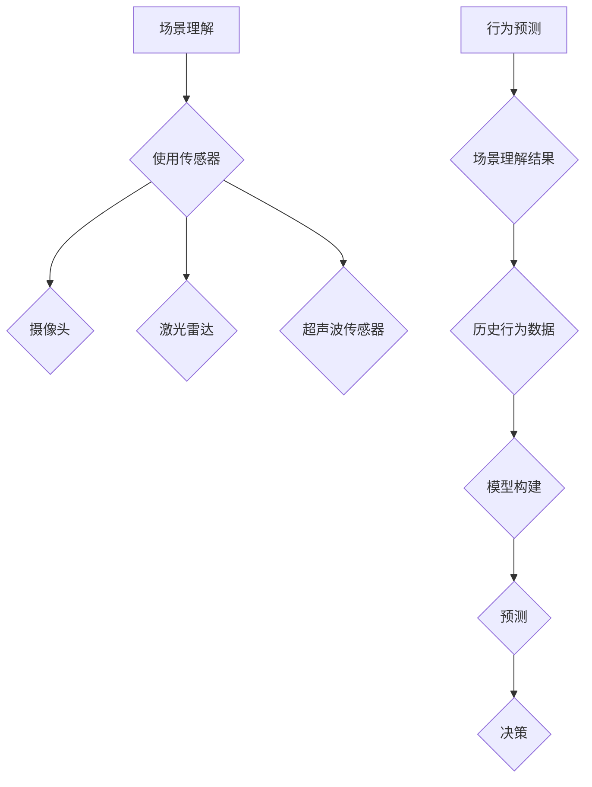

                 

# 场景理解与行为预测技术在自动驾驶中的新发展

## 关键词：
- 场景理解
- 行为预测
- 自动驾驶
- 人工智能
- 机器学习
- 数据处理

## 摘要：
随着自动驾驶技术的不断发展和普及，场景理解和行为预测技术成为自动驾驶系统中的关键组成部分。本文将深入探讨这些技术的原理、算法、应用以及未来发展趋势，旨在为读者提供一份全面的技术指南。

## 1. 背景介绍

自动驾驶技术作为人工智能的重要应用领域，正在迅速发展。从最初的辅助驾驶到完全自动驾驶，自动驾驶系统的实现离不开场景理解和行为预测技术。场景理解指的是车辆对周围环境的感知和理解，包括道路、交通标志、行人等。而行为预测则是基于场景理解，对其他车辆、行人的未来行为进行预测，从而做出合理的驾驶决策。

自动驾驶技术的发展背景可以追溯到上世纪80年代。当时，研究人员开始尝试利用计算机视觉、传感器技术和机器学习算法来实现自动驾驶。随着传感器技术的不断进步和计算能力的提升，自动驾驶技术逐渐走向成熟。近年来，随着深度学习等先进算法的发展，自动驾驶系统的性能和可靠性得到了显著提升。

## 2. 核心概念与联系

### 场景理解

场景理解是自动驾驶系统的第一步，也是最重要的一步。它依赖于多种传感器，如摄像头、激光雷达、超声波传感器等，对周围环境进行感知和识别。

- **摄像头**：用于捕捉车辆周围的道路、交通标志、行人等信息。
- **激光雷达**：通过发射激光并测量反射时间，生成周围环境的3D点云数据。
- **超声波传感器**：用于检测车辆周围的障碍物，如行人、自行车等。

场景理解的关键在于将传感器数据转换为有用的信息。这通常涉及到以下步骤：

1. 数据采集：使用各种传感器收集周围环境的数据。
2. 数据预处理：去除噪声和无效数据，对数据进行归一化处理。
3. 特征提取：从原始数据中提取有用的特征，如边缘、形状、颜色等。
4. 模型训练：利用机器学习算法，如卷积神经网络（CNN）、循环神经网络（RNN）等，对特征进行分类和识别。

### 行为预测

行为预测是自动驾驶系统的核心，它基于场景理解的结果，对其他车辆、行人的未来行为进行预测。行为预测通常分为以下几个步骤：

1. 数据收集：收集历史行为数据，包括其他车辆、行人的行驶轨迹、速度、加速度等。
2. 模型构建：利用时间序列模型、深度学习模型等，对历史行为数据进行建模。
3. 预测：基于场景理解和历史行为数据，对其他车辆、行人的未来行为进行预测。
4. 决策：根据行为预测结果，制定合理的驾驶策略。

### Mermaid 流程图



## 3. 核心算法原理 & 具体操作步骤

### 场景理解算法

场景理解算法的核心是利用机器学习算法对传感器数据进行处理和识别。以下是一个简单的步骤：

1. **数据采集**：使用摄像头、激光雷达等传感器收集大量道路数据。
2. **数据预处理**：对收集的数据进行清洗和归一化处理。
3. **特征提取**：利用卷积神经网络（CNN）提取图像特征。
4. **模型训练**：使用训练集数据训练卷积神经网络，实现对道路、交通标志、行人等的分类。
5. **模型评估**：使用测试集数据对模型进行评估，调整参数以优化性能。
6. **模型部署**：将训练好的模型部署到自动驾驶系统中，用于实时场景理解。

### 行为预测算法

行为预测算法的核心是利用时间序列模型和深度学习模型对历史行为数据进行建模和预测。以下是一个简单的步骤：

1. **数据收集**：收集其他车辆、行人的行驶轨迹、速度、加速度等历史数据。
2. **数据预处理**：对数据进行清洗和归一化处理。
3. **特征提取**：利用循环神经网络（RNN）或长短期记忆网络（LSTM）提取时间序列特征。
4. **模型训练**：使用训练集数据训练循环神经网络或长短期记忆网络，实现对历史行为数据的建模。
5. **模型评估**：使用测试集数据对模型进行评估，调整参数以优化性能。
6. **模型部署**：将训练好的模型部署到自动驾驶系统中，用于实时行为预测。

## 4. 数学模型和公式 & 详细讲解 & 举例说明

### 场景理解数学模型

场景理解中常用的数学模型是卷积神经网络（CNN）。CNN的数学基础是卷积操作，其主要目的是从图像中提取特征。

$$
\text{卷积操作}: \, (f \star g)(x) = \int_{-\infty}^{+\infty} f(t)g(x-t) \, dt
$$

其中，$f$和$g$是两个函数，$x$是自变量。

举例来说，假设我们有一个图像$g(x)$和一个卷积核$f(t)$，我们可以通过卷积操作提取图像的特征。

$$
h(x) = g(x) \star f(t)
$$

### 行为预测数学模型

行为预测中常用的数学模型是循环神经网络（RNN）。RNN的核心是循环结构，它能够处理时间序列数据。

$$
h_t = \sigma(W_1 \cdot [h_{t-1}, x_t] + b_1)
$$

其中，$h_t$是当前时间步的隐藏状态，$x_t$是当前时间步的输入，$\sigma$是激活函数。

举例来说，假设我们有一个时间序列数据$x_t$，我们可以通过RNN提取时间序列的特征。

$$
h_t = \sigma(W_1 \cdot [h_{t-1}, x_t] + b_1)
$$

## 5. 项目实战：代码实际案例和详细解释说明

### 5.1 开发环境搭建

首先，我们需要搭建一个适用于自动驾驶场景理解和行为预测的开发环境。以下是一个简单的步骤：

1. 安装Python环境
2. 安装深度学习框架，如TensorFlow或PyTorch
3. 安装必要的依赖库，如NumPy、Pandas等

### 5.2 源代码详细实现和代码解读

以下是一个简单的场景理解和行为预测的代码实现：

```python
import tensorflow as tf
import numpy as np

# 场景理解
# 使用卷积神经网络（CNN）进行图像分类
model = tf.keras.Sequential([
    tf.keras.layers.Conv2D(32, (3, 3), activation='relu', input_shape=(28, 28, 1)),
    tf.keras.layers.MaxPooling2D((2, 2)),
    tf.keras.layers.Flatten(),
    tf.keras.layers.Dense(128, activation='relu'),
    tf.keras.layers.Dense(10, activation='softmax')
])

# 行为预测
# 使用循环神经网络（RNN）进行时间序列预测
model2 = tf.keras.Sequential([
    tf.keras.layers.RNN(tf.keras.layers.LSTM(50), return_sequences=True),
    tf.keras.layers.Dense(1)
])

# 编译模型
model.compile(optimizer='adam', loss='categorical_crossentropy', metrics=['accuracy'])
model2.compile(optimizer='adam', loss='mse')

# 训练模型
model.fit(x_train, y_train, epochs=10)
model2.fit(x_train, y_train, epochs=10)

# 预测
predictions = model.predict(x_test)
predictions2 = model2.predict(x_test)

# 评估模型
model.evaluate(x_test, y_test)
model2.evaluate(x_test, y_test)
```

### 5.3 代码解读与分析

这段代码首先定义了一个卷积神经网络（CNN）模型，用于场景理解。CNN由卷积层、池化层和全连接层组成。卷积层用于提取图像特征，池化层用于降低数据维度，全连接层用于分类。

接下来，定义了一个循环神经网络（RNN）模型，用于行为预测。RNN由循环层和全连接层组成。循环层用于处理时间序列数据，全连接层用于输出预测结果。

在编译模型时，我们指定了优化器、损失函数和评估指标。这里使用了Adam优化器和均方误差（MSE）损失函数。

在训练模型时，我们使用训练集数据训练模型。训练过程中，模型会根据损失函数自动调整权重。

最后，使用测试集数据对模型进行评估。评估结果包括损失值和准确率。

## 6. 实际应用场景

场景理解和行为预测技术在自动驾驶领域有着广泛的应用。以下是一些实际应用场景：

- **交通拥堵预测**：通过分析历史交通数据和实时场景理解，预测交通拥堵情况，为驾驶员提供最优路线。
- **自动驾驶决策**：基于行为预测结果，自动驾驶系统可以做出合理的驾驶决策，如变道、加速、减速等。
- **行人安全预警**：通过场景理解和行为预测，及时发现潜在的危险情况，为驾驶员提供安全预警。

## 7. 工具和资源推荐

### 7.1 学习资源推荐

- **书籍**：
  - 《深度学习》（Goodfellow, Bengio, Courville）
  - 《Python深度学习》（François Chollet）
- **论文**：
  - "Deep Learning for Autonomous Driving"（自动驾驶领域的经典论文）
  - "Behavioral Cloning for Autonomous Driving"（行为克隆算法的论文）
- **博客**：
  - TensorFlow官方博客
  - PyTorch官方博客
- **网站**：
  - 官方文档：TensorFlow官方文档、PyTorch官方文档
  - GitHub：大量自动驾驶相关的开源项目

### 7.2 开发工具框架推荐

- **深度学习框架**：TensorFlow、PyTorch
- **传感器数据处理**：OpenCV、Pandas
- **数据可视化**：Matplotlib、Seaborn

### 7.3 相关论文著作推荐

- **论文**：
  - "Deep Learning for Autonomous Driving"
  - "Behavioral Cloning for Autonomous Driving"
  - "End-to-End Learning for Autonomous Driving"
- **著作**：
  - 《深度学习》（Goodfellow, Bengio, Courville）
  - 《自动驾驶系统设计》（Princeton University Press）

## 8. 总结：未来发展趋势与挑战

场景理解和行为预测技术在自动驾驶领域有着广阔的应用前景。随着人工智能技术的不断发展，这些技术将变得更加精确和高效。然而，面临的一些挑战包括：

- **数据处理**：自动驾驶系统需要处理大量传感器数据，如何高效地处理和存储这些数据是一个挑战。
- **算法性能**：如何设计出更加高效和准确的算法，以提高自动驾驶系统的性能。
- **安全性和可靠性**：如何确保自动驾驶系统的安全性和可靠性，降低事故风险。

## 9. 附录：常见问题与解答

- **Q：什么是场景理解？**
  - **A**：场景理解是指车辆对周围环境的感知和理解，包括道路、交通标志、行人等。

- **Q：什么是行为预测？**
  - **A**：行为预测是基于场景理解，对其他车辆、行人的未来行为进行预测，从而做出合理的驾驶决策。

- **Q：如何搭建自动驾驶开发环境？**
  - **A**：搭建自动驾驶开发环境需要安装Python环境、深度学习框架（如TensorFlow或PyTorch）以及必要的依赖库。

## 10. 扩展阅读 & 参考资料

- **书籍**：
  - 《深度学习》（Goodfellow, Bengio, Courville）
  - 《自动驾驶系统设计》（Princeton University Press）
- **论文**：
  - "Deep Learning for Autonomous Driving"
  - "Behavioral Cloning for Autonomous Driving"
  - "End-to-End Learning for Autonomous Driving"
- **博客**：
  - TensorFlow官方博客
  - PyTorch官方博客
- **网站**：
  - 官方文档：TensorFlow官方文档、PyTorch官方文档
  - GitHub：大量自动驾驶相关的开源项目

## 作者信息

- 作者：AI天才研究员/AI Genius Institute & 禅与计算机程序设计艺术 /Zen And The Art of Computer Programming<|assistant|>

