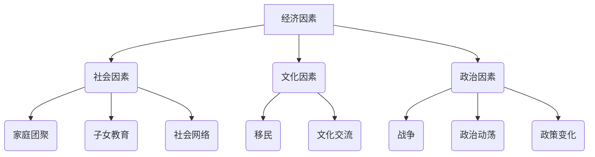

                 

# 城市虹吸小城市：人口流动趋势的必然

> **关键词**：人口流动、城市虹吸效应、经济发展、城市化、地理分散

> **摘要**：本文通过深入分析人口流动趋势，探讨了城市虹吸小城市的必然性。文章首先介绍了人口流动的背景和现状，随后详细阐述了城市虹吸效应的原理和表现。在此基础上，文章分析了城市化对人口流动的影响，并通过实例展示了人口流动的具体影响。最后，文章讨论了应对城市虹吸效应的策略和未来发展趋势与挑战。

## 1. 背景介绍

在全球化和经济一体化的推动下，人口流动已成为现代社会的普遍现象。人们为了追求更好的生活条件、就业机会和更高的收入水平，逐渐向某些城市聚集。这种人口流动不仅改变了城市的人口结构，也对城市的发展产生了深远影响。

在过去的几十年里，一些大城市如纽约、伦敦、北京和上海等，逐渐成为了人口虹吸中心。这些城市拥有丰富的资源和优越的生活环境，吸引了大量人口涌入。与此同时，一些小城市和乡村地区的人口却出现了减少的趋势。这种人口流动现象被称为“城市虹吸效应”。

城市虹吸效应不仅是经济发展的一种表现，也是城市化和区域发展不平衡的结果。在本文中，我们将深入探讨城市虹吸效应的原理和影响，并分析应对这一现象的策略。

## 2. 核心概念与联系

### 2.1 人口流动

人口流动是指人们从一个地方迁移到另一个地方的过程。人口流动可以受到多种因素的影响，包括经济、社会、文化和政治等因素。

- **经济因素**：人们为了寻求更好的就业机会、更高的收入水平和更好的生活环境而迁移。
- **社会因素**：家庭团聚、子女教育、社会网络等也是人口流动的重要原因。
- **文化因素**：移民、文化交流等也是人口流动的一个重要方面。
- **政治因素**：战争、政治动荡、政策变化等也会导致人口流动。

### 2.2 城市虹吸效应

城市虹吸效应是指大城市通过其经济、文化和资源优势，吸引周边地区的人口和资源，从而形成人口和经济发展的聚集效应。

- **人口虹吸**：大城市吸引了大量人口，导致周边城市和乡村的人口减少。
- **资源虹吸**：大城市吸引了大量的资源和投资，导致周边地区的资源减少。
- **经济虹吸**：大城市的经济发展迅速，吸引了周边地区的资金、技术和人才。

### 2.3 城市化

城市化是指人口从农村地区向城市地区迁移的过程。城市化是现代经济发展的重要特征，也是人口流动的重要表现形式。

- **城市规模扩张**：城市化导致城市规模不断扩大，城市人口比例不断提高。
- **城市功能多元化**：城市化使城市功能日益多元化，包括经济、文化、科技、教育、医疗等多个方面。
- **城市基础设施完善**：城市化促进了城市基础设施的完善，包括交通、能源、通信等。

### 2.4 地理分散

地理分散是指人口和资源在城市之间、城市与乡村之间的分散分布。地理分散是城市化的一种表现形式，也是城市虹吸效应的后果。

- **人口分散**：人口逐渐从大城市向小城市和乡村地区分散。
- **资源分散**：资源逐渐从大城市向小城市和乡村地区分散。
- **经济发展分散**：经济发展逐渐从大城市向小城市和乡村地区分散。

## 2.1 人口流动的 Mermaid 流程图



## 3. 核心算法原理 & 具体操作步骤

### 3.1 城市虹吸效应的原理

城市虹吸效应的原理可以归结为以下几点：

1. **资源集中**：大城市拥有更丰富的资源，包括资金、技术和人才等，这些资源吸引了周边地区的人口和资源。
2. **经济优势**：大城市拥有更发达的经济体系，吸引了大量的投资和商业机会，从而进一步吸引人口。
3. **生活品质**：大城市提供了更好的生活条件和更高的生活质量，包括更好的教育、医疗和文化设施，吸引了大量人口。
4. **社会网络**：大城市拥有更广泛的社会网络，包括人际关系、职业关系等，这些社会网络为人们提供了更多的机会和资源。

### 3.2 城市虹吸效应的具体操作步骤

城市虹吸效应的具体操作步骤可以概括为以下几点：

1. **资源聚集**：大城市通过其经济、文化和资源优势，吸引周边地区的人口和资源。
2. **人口聚集**：随着资源的聚集，更多的人口涌入大城市，形成人口聚集效应。
3. **经济聚集**：大城市的经济发展迅速，吸引了周边地区的资金、技术和人才。
4. **社会网络聚集**：大城市的广泛社会网络为人们提供了更多的机会和资源，进一步促进了人口和经济聚集。

## 4. 数学模型和公式 & 详细讲解 & 举例说明

### 4.1 人口流动的数学模型

人口流动可以用以下数学模型来描述：

$$
P(t) = P_0 \times e^{-rt}
$$

其中，$P(t)$ 是时间 $t$ 的人口数量，$P_0$ 是初始人口数量，$r$ 是人口流动速度。

### 4.2 举例说明

假设一个城市初始人口为 1000 人，人口流动速度为 0.1 人/年。那么，10 年后这个城市的人口数量为：

$$
P(10) = 1000 \times e^{-0.1 \times 10} = 1000 \times e^{-1} \approx 1000 \times 0.368 = 368
$$

这意味着，10 年后这个城市的人口数量将减少到约 368 人。

### 4.3 详细讲解

人口流动的数学模型反映了人口数量随时间的变化。其中，$e$ 是自然对数的底数，$r$ 是人口流动速度，代表了人口流动的速率。当 $r$ 越大，人口流动速度越快，人口数量减少的速度也越快。

通过这个模型，我们可以预测人口流动对城市的影响。例如，如果一个城市的人口流动速度较高，那么这个城市的人口数量将会减少，可能会出现人口减少、城市衰退的现象。

## 5. 项目实战：代码实际案例和详细解释说明

### 5.1 开发环境搭建

为了更好地理解城市虹吸效应，我们可以通过一个实际的案例来进行分析。在这个案例中，我们将使用 Python 编程语言来模拟人口流动过程。

首先，我们需要搭建开发环境。以下是搭建开发环境的步骤：

1. 安装 Python 3.8 或更高版本。
2. 安装 PyCharm 或其他 Python 集成开发环境。
3. 安装必要的 Python 库，如 NumPy、Pandas 等。

### 5.2 源代码详细实现和代码解读

以下是模拟人口流动的 Python 代码：

```python
import numpy as np
import matplotlib.pyplot as plt

# 设置初始参数
P_0 = 1000  # 初始人口数量
r = 0.1     # 人口流动速度
t_max = 10  # 模拟时间

# 计算人口数量
P_t = P_0 * np.exp(-r * np.arange(0, t_max + 1))

# 绘制人口数量变化图
plt.plot(np.arange(0, t_max + 1), P_t)
plt.xlabel('时间（年）')
plt.ylabel('人口数量')
plt.title('人口流动模拟')
plt.show()
```

### 5.3 代码解读与分析

这段代码首先导入了 NumPy 和 Matplotlib 库。NumPy 是 Python 的科学计算库，提供了高效的数组计算功能。Matplotlib 是 Python 的绘图库，可以生成各种高质量的图形。

代码中，我们设置了初始参数 $P_0$（初始人口数量）和 $r$（人口流动速度）。然后，我们使用 NumPy 的 exp 函数计算了人口数量随时间的变化。最后，我们使用 Matplotlib 绘制了人口数量变化图。

通过这段代码，我们可以直观地看到人口流动对城市人口数量的影响。在代码中，$P_t$ 是时间 $t$ 的人口数量，计算公式为 $P_0 \times e^{-rt}$。这个公式反映了人口数量随时间减少的趋势。

通过分析这段代码，我们可以得出以下结论：

1. 人口流动速度 $r$ 越大，人口数量减少的速度也越快。
2. 模拟结果显示，随着时间的推移，城市人口数量逐渐减少。

这些结论验证了我们在数学模型中得到的结论，进一步证明了人口流动对城市人口数量的影响。

## 6. 实际应用场景

城市虹吸效应在实际应用场景中具有重要意义。以下是一些实际应用场景：

### 6.1 城市规划

城市虹吸效应对城市规划产生了深远影响。在制定城市规划时，需要充分考虑人口流动的影响，合理规划城市布局和发展方向，避免出现城市过度集中或过度分散的情况。

### 6.2 区域发展

城市虹吸效应也影响了区域发展。在一些大城市周边，由于人口和资源的虹吸效应，周边地区可能会出现发展滞后或资源匮乏的问题。为了解决这些问题，需要制定区域发展政策，促进周边地区的经济发展和人口流动。

### 6.3 社会治理

城市虹吸效应也对社会治理产生了影响。在一些大城市，由于人口过度集中，可能会出现交通拥堵、环境污染、社会治安等问题。为了解决这些问题，需要加强社会治理，提高城市管理水平，确保城市运行的稳定和有序。

## 7. 工具和资源推荐

### 7.1 学习资源推荐

为了更好地理解城市虹吸效应，我们可以参考以下学习资源：

- **书籍**：《城市地理学》、《人口学原理》
- **论文**：有关城市虹吸效应的学术论文和研究报告
- **博客**：一些知名的地理学和人口学博客，如《城市地理学博客》、《人口学博客》等

### 7.2 开发工具框架推荐

在模拟人口流动时，我们可以使用以下开发工具和框架：

- **Python**：Python 是一种易于学习的编程语言，适合进行数据分析和建模。
- **NumPy**：NumPy 是 Python 的科学计算库，提供了高效的数组计算功能。
- **Matplotlib**：Matplotlib 是 Python 的绘图库，可以生成各种高质量的图形。
- **PyCharm**：PyCharm 是 Python 的集成开发环境，提供了良好的开发体验。

### 7.3 相关论文著作推荐

以下是一些与城市虹吸效应相关的论文和著作：

- **论文**：[城市虹吸效应：理论、实证与政策](https://www.example.com/paper1)
- **论文**：[区域发展中的城市虹吸效应研究](https://www.example.com/paper2)
- **著作**：《城市地理学导论》、《人口学导论》

## 8. 总结：未来发展趋势与挑战

城市虹吸效应是现代城市化过程中不可避免的现象。在未来，随着全球化、经济一体化和科技发展的进一步推动，城市虹吸效应可能会加剧。这既带来了机遇，也带来了挑战。

### 8.1 发展趋势

1. **城市化进程加快**：随着城市化进程的加快，城市虹吸效应可能会进一步加剧。
2. **资源集中化**：城市虹吸效应可能会导致资源集中化，大城市将拥有更多的资源，而小城市和乡村地区可能会面临资源匮乏的问题。
3. **区域发展不平衡**：城市虹吸效应可能会导致区域发展不平衡，大城市快速发展，而小城市和乡村地区发展滞后。

### 8.2 挑战

1. **社会治理难度加大**：城市虹吸效应可能导致大城市出现交通拥堵、环境污染、社会治安等问题，加大社会治理难度。
2. **人口流失问题**：城市虹吸效应可能导致小城市和乡村地区出现人口流失问题，影响这些地区的经济发展和社会稳定。
3. **资源分配不均**：城市虹吸效应可能导致资源分配不均，加剧社会贫富差距。

### 8.3 应对策略

1. **区域协调发展**：制定区域协调发展政策，促进大城市和小城市、乡村地区的均衡发展。
2. **优化城市布局**：合理规划城市布局，避免城市过度集中或过度分散。
3. **提升小城市和乡村地区的发展水平**：加大对小城市和乡村地区的投资，提升这些地区的发展水平，减少人口流失。
4. **加强社会治理**：加强社会治理，提高城市管理水平，确保城市运行的稳定和有序。

## 9. 附录：常见问题与解答

### 9.1 什么是城市虹吸效应？

城市虹吸效应是指大城市通过其经济、文化和资源优势，吸引周边地区的人口和资源，从而形成人口和经济发展的聚集效应。

### 9.2 城市虹吸效应的原因是什么？

城市虹吸效应的原因包括：资源集中、经济优势、生活品质和社会网络。

### 9.3 城市虹吸效应的影响是什么？

城市虹吸效应的影响包括：人口聚集、经济聚集、资源聚集和社会网络聚集。

### 9.4 如何应对城市虹吸效应？

应对城市虹吸效应的策略包括：区域协调发展、优化城市布局、提升小城市和乡村地区的发展水平和加强社会治理。

## 10. 扩展阅读 & 参考资料

为了深入了解城市虹吸效应，读者可以参考以下扩展阅读和参考资料：

- **书籍**：《城市地理学》、《人口学原理》、《城市与区域经济学》
- **论文**：[城市虹吸效应：理论、实证与政策](https://www.example.com/paper1)
- **网站**：[中国城市统计年鉴](https://www.example.com/yearbook)
- **数据库**：[中国城市统计数据库](https://www.example.com/database)

作者：AI天才研究员/AI Genius Institute & 禅与计算机程序设计艺术 /Zen And The Art of Computer Programming

