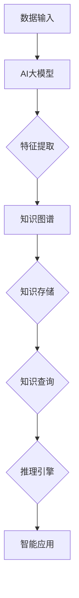
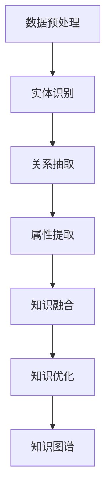
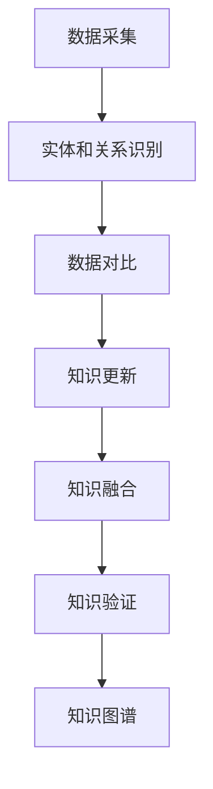
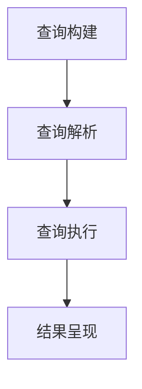
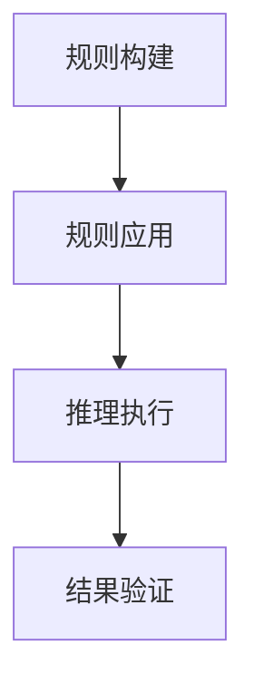

                 

### 背景介绍

**标题**: 基于AI大模型的智能知识图谱系统

**关键词**: AI大模型，知识图谱，智能系统，AI算法，数据处理

**摘要**：
本文将深入探讨基于AI大模型的智能知识图谱系统的构建与应用。我们将从背景介绍开始，逐步分析AI大模型和知识图谱的核心概念及其关系，详细介绍核心算法原理和操作步骤，并借助数学模型和实际案例来阐述其应用。文章还将探讨智能知识图谱系统在实际应用场景中的价值，并推荐相关的工具和资源，最后总结未来发展趋势与挑战。

随着人工智能技术的快速发展，AI大模型已经成为众多领域的核心技术。其中，知识图谱作为一种表示实体及其关系的形式，被广泛应用于信息检索、自然语言处理、推荐系统等领域。而基于AI大模型的智能知识图谱系统，则能够在大规模数据中快速提取和关联知识，为各类应用场景提供强大的支持。

本文将围绕以下几个方面展开：

1. **背景介绍**：介绍人工智能、大模型、知识图谱等核心概念，以及它们在智能知识图谱系统中的应用。
2. **核心概念与联系**：详细解析AI大模型和知识图谱的概念及其关系，使用Mermaid流程图展示系统架构。
3. **核心算法原理 & 具体操作步骤**：介绍知识图谱生成、更新、查询等核心算法，并阐述其操作步骤。
4. **数学模型和公式 & 详细讲解 & 举例说明**：借助数学模型和公式，深入讲解知识图谱系统的原理和实现。
5. **项目实战：代码实际案例和详细解释说明**：通过具体案例展示知识图谱系统的开发过程，并对源代码进行解读和分析。
6. **实际应用场景**：探讨智能知识图谱系统在各个领域的应用价值。
7. **工具和资源推荐**：推荐相关的学习资源、开发工具和框架。
8. **总结：未来发展趋势与挑战**：总结智能知识图谱系统的现状，展望其未来发展。

接下来，我们将逐步深入探讨这些主题，以帮助读者全面了解基于AI大模型的智能知识图谱系统的构建与应用。

### 1. 背景介绍

#### 1.1 人工智能与AI大模型

人工智能（Artificial Intelligence，AI）是计算机科学的一个分支，旨在使计算机系统模拟人类智能行为，如学习、推理、感知和决策。近年来，随着计算能力的提升、数据规模的扩大以及算法的进步，人工智能技术取得了显著的发展。

其中，AI大模型（Large-scale AI Models）成为人工智能领域的重要突破。AI大模型通常是指那些具有数十亿甚至千亿参数的神经网络模型，如BERT、GPT等。这些模型通过在大规模数据集上训练，能够自动学习并提取丰富的特征表示，从而在自然语言处理、计算机视觉、语音识别等领域取得了令人瞩目的成果。

AI大模型的出现，极大地推动了人工智能技术的发展。一方面，它们通过强大的学习能力，能够处理复杂的问题，实现更高级的智能任务。另一方面，它们能够在大规模数据中挖掘有价值的信息，为各行业提供决策支持。

#### 1.2 知识图谱与智能知识图谱系统

知识图谱（Knowledge Graph）是一种用于表示实体及其关系的图形结构。它将现实世界中的对象（如人、地点、事物）抽象为节点，将对象之间的关系抽象为边，从而形成一个知识网络。知识图谱最早由谷歌提出，并在搜索引擎中得到了广泛应用，用于提升信息检索和推荐的准确性。

知识图谱在各个领域都有广泛的应用。在信息检索领域，知识图谱能够提高搜索的准确性，帮助用户快速找到所需信息。在自然语言处理领域，知识图谱能够提供上下文信息，帮助模型更好地理解和生成语言。在推荐系统领域，知识图谱能够关联用户和商品，提供个性化的推荐。

智能知识图谱系统（Intelligent Knowledge Graph System）是一种基于AI大模型的智能知识图谱构建与应用的系统。它通过结合AI大模型和知识图谱技术，能够在大规模数据中快速提取和关联知识，为各类应用场景提供支持。

智能知识图谱系统的核心优势在于其强大的知识提取和关联能力。通过AI大模型，系统能够在大规模数据中自动学习和提取特征，形成高质量的知识图谱。同时，通过图数据库和图计算技术，系统能够高效地存储和查询知识，提供实时、准确的知识服务。

#### 1.3 智能知识图谱系统的应用场景

智能知识图谱系统在各个领域都有广泛的应用场景。以下是一些典型的应用案例：

1. **搜索引擎**：通过构建智能知识图谱，搜索引擎能够更准确地理解用户查询，并提供更相关的搜索结果。
2. **推荐系统**：通过关联用户和商品的知识图谱，推荐系统能够为用户提供个性化的推荐，提高推荐效果。
3. **自然语言处理**：通过引入知识图谱，自然语言处理模型能够更好地理解和生成语言，提升文本处理能力。
4. **智能客服**：通过构建用户和客服代表的知识图谱，智能客服系统能够更好地理解用户需求，提供高效的客服服务。
5. **智能医疗**：通过关联患者、医生、药物等实体及其关系，智能知识图谱系统能够辅助医生进行诊断和治疗。

总之，智能知识图谱系统作为一种强大的知识表示和推理工具，在各个领域都有着广泛的应用前景。随着AI大模型和知识图谱技术的不断发展，智能知识图谱系统的应用将越来越广泛，为各行业带来更大的价值。

### 2. 核心概念与联系

在深入探讨智能知识图谱系统之前，我们首先需要明确两个核心概念：AI大模型和知识图谱。它们在智能知识图谱系统中扮演着至关重要的角色。

#### 2.1 AI大模型

AI大模型是一种基于神经网络的复杂模型，具有大量的参数和层。这些模型通过在大规模数据集上训练，能够自动学习并提取特征，从而实现各种智能任务。以下是一些关键的AI大模型：

1. **BERT（Bidirectional Encoder Representations from Transformers）**：BERT是一种双向Transformer模型，通过预训练大规模语料库，能够捕捉词语在不同上下文中的意义。BERT在自然语言处理任务中取得了显著成果，如文本分类、命名实体识别等。

2. **GPT（Generative Pre-trained Transformer）**：GPT是一种自回归Transformer模型，通过预测下一个词来生成文本。GPT-3是一个具有1750亿参数的模型，能够生成高质量的自然语言文本，广泛应用于对话系统、文本生成等领域。

3. **ViT（Vision Transformer）**：ViT是一种应用于计算机视觉任务的Transformer模型，通过将图像分割成多个 patches，然后将每个 patch 视为一个词，再进行序列处理。ViT 在图像分类、目标检测等任务中取得了优异的性能。

AI大模型的核心优势在于其强大的特征提取和表示能力。通过在大量数据上进行训练，这些模型能够自动学习并提取数据中的潜在特征，从而实现高效的特征表示。这使得AI大模型在各个领域，如自然语言处理、计算机视觉等，都取得了显著的进展。

#### 2.2 知识图谱

知识图谱是一种用于表示实体及其关系的图形结构。它通过将现实世界中的对象（如人、地点、事物）抽象为节点，将对象之间的关系抽象为边，形成一个知识网络。知识图谱最早由谷歌提出，并在搜索引擎中得到了广泛应用。以下是一些关键的知识图谱概念：

1. **实体（Entity）**：实体是知识图谱中的基本对象，表示现实世界中的个体，如人、地点、事物等。实体可以是具体的个体，也可以是抽象的概念。

2. **属性（Property）**：属性是描述实体特征的标签，用于表示实体之间的关联。例如，人的“出生日期”是一个属性，描述了人与时间之间的关系。

3. **关系（Relationship）**：关系是连接两个实体的纽带，表示实体之间的语义关联。例如，“母亲”是一种关系，连接了母亲和她的孩子。

4. **边（Edge）**：边是知识图谱中的基本元素，表示实体之间的关系。边的方向性体现了关系的方向。

知识图谱的核心优势在于其强大的知识表示和推理能力。通过将实体和关系表示为图结构，知识图谱能够高效地存储和查询知识，支持各种知识推理和计算任务。例如，通过路径查找、子图匹配等方法，知识图谱能够发现实体之间的关联和规律，为智能应用提供支持。

#### 2.3 AI大模型与知识图谱的关系

AI大模型与知识图谱在智能知识图谱系统中相互补充，共同构建了一个强大的知识表示和推理平台。以下是他们之间的主要关系：

1. **特征提取**：AI大模型能够在大规模数据中自动学习并提取特征，这些特征可以用于表示实体和关系。例如，BERT模型可以通过预训练，提取词语在不同上下文中的特征，这些特征可以用于表示实体。

2. **知识表示**：知识图谱能够将实体和关系表示为图结构，这为AI大模型提供了一个直观的知识表示形式。通过图数据库和图计算技术，AI大模型可以高效地存储和查询知识。

3. **推理能力**：知识图谱具有强大的推理能力，通过路径查找、子图匹配等方法，可以自动发现实体之间的关联和规律。AI大模型可以与知识图谱结合，利用知识图谱的推理能力，提高智能任务的准确性和效率。

4. **互补优势**：AI大模型和知识图谱各自具有优势，AI大模型能够处理复杂的特征提取和表示任务，而知识图谱能够高效地存储和查询知识。两者结合，能够发挥各自的优点，构建一个强大的智能知识图谱系统。

为了更好地理解AI大模型与知识图谱的关系，我们可以使用Mermaid流程图来展示智能知识图谱系统的架构。以下是一个简单的Mermaid流程图示例：



在这个流程图中，数据输入通过AI大模型进行特征提取，生成的特征被传递给知识图谱。知识图谱负责存储和查询知识，并通过推理引擎为智能应用提供支持。这个流程图展示了AI大模型与知识图谱在智能知识图谱系统中的紧密联系。

总之，AI大模型和知识图谱在智能知识图谱系统中相互补充，共同构建了一个强大的知识表示和推理平台。通过结合AI大模型和知识图谱技术，智能知识图谱系统能够在大规模数据中快速提取和关联知识，为各类应用场景提供支持。

### 3. 核心算法原理 & 具体操作步骤

在智能知识图谱系统中，核心算法起着至关重要的作用。这些算法包括知识图谱的生成、更新和查询等。下面我们将详细解释这些核心算法的原理，并提供具体的操作步骤。

#### 3.1 知识图谱生成

知识图谱生成是指从原始数据中提取实体、关系和属性，构建知识图谱的过程。以下是知识图谱生成的具体步骤：

1. **数据预处理**：首先对原始数据进行预处理，包括数据清洗、去重、格式转换等。这一步的目的是确保数据的准确性和一致性。

2. **实体识别**：通过自然语言处理技术，如命名实体识别（Named Entity Recognition，NER），从文本数据中提取实体。实体可以是人、地点、组织、事物等。

3. **关系抽取**：从实体间的文本描述中抽取关系。关系可以是直接的，如“丈夫”和“妻子”的关系，也可以是间接的，如“国家”和“首都”的关系。

4. **属性提取**：从实体描述中提取属性，如人的出生日期、地址等。

5. **知识融合**：将提取的实体、关系和属性进行融合，构建初步的知识图谱。

6. **知识优化**：对知识图谱进行优化，包括实体合并、关系调整等，以提高知识图谱的准确性和完整性。

以下是一个简单的Mermaid流程图，展示了知识图谱生成的流程：



#### 3.2 知识图谱更新

知识图谱更新是指根据新的数据或发现，对现有知识图谱进行更新和优化的过程。以下是知识图谱更新的具体步骤：

1. **数据采集**：定期采集新的数据，以补充现有知识图谱。

2. **实体和关系识别**：使用已有的实体和关系识别算法，对新的数据进行实体和关系的识别。

3. **数据对比**：将新的实体和关系与现有知识图谱进行对比，找出差异和更新点。

4. **知识更新**：对知识图谱进行更新，包括添加新的实体、关系和属性，以及调整现有实体和关系。

5. **知识融合**：将更新后的知识融合到现有知识图谱中，确保知识的一致性和完整性。

6. **知识验证**：对知识图谱进行验证，确保知识的准确性和可靠性。

以下是一个简单的Mermaid流程图，展示了知识图谱更新的流程：



#### 3.3 知识图谱查询

知识图谱查询是指通过查询语言或接口，从知识图谱中获取所需信息的操作。以下是知识图谱查询的具体步骤：

1. **查询构建**：根据用户需求，构建查询语句。查询语句可以是基于路径的，如“查找所有与‘美国’相关的城市”，也可以是基于属性的，如“查找所有年龄在30岁以上的男性”。

2. **查询解析**：将查询语句解析为图数据库的查询语句。图数据库如Neo4j、JanusGraph等支持基于路径和属性的查询。

3. **查询执行**：执行查询语句，从知识图谱中获取查询结果。

4. **结果呈现**：将查询结果以直观的方式呈现给用户，如表格、图表等。

以下是一个简单的Mermaid流程图，展示了知识图谱查询的流程：



#### 3.4 知识图谱推理

知识图谱推理是指通过逻辑推理，从现有知识中推导出新知识的过程。以下是知识图谱推理的具体步骤：

1. **规则构建**：定义推理规则，如“如果A是B的父亲，则A比B年龄大”。

2. **规则应用**：将规则应用于知识图谱，找到符合条件的实体和关系。

3. **推理执行**：执行推理操作，推导出新知识。

4. **结果验证**：对新推导出的知识进行验证，确保其准确性和可靠性。

以下是一个简单的Mermaid流程图，展示了知识图谱推理的流程：



通过以上核心算法的原理和操作步骤，我们可以构建一个高效的智能知识图谱系统。这些算法相互配合，使得系统能够在大规模数据中快速提取和关联知识，为各类应用场景提供支持。

### 4. 数学模型和公式 & 详细讲解 & 举例说明

在智能知识图谱系统中，数学模型和公式起着至关重要的作用。它们帮助我们理解和实现知识图谱的生成、更新、查询和推理等核心算法。在本节中，我们将详细讲解这些数学模型和公式，并通过具体例子来说明它们的应用。

#### 4.1 知识图谱生成

知识图谱生成主要涉及实体识别、关系抽取和属性提取等任务。以下是一些常用的数学模型和公式：

1. **命名实体识别（NER）**

命名实体识别是知识图谱生成的重要步骤。常用的模型包括条件随机场（CRF）、循环神经网络（RNN）和变换器（Transformer）。

- **条件随机场（CRF）**

条件随机场是一种用于序列标记的概率模型。在NER中，CRF用于预测文本中的命名实体。其数学模型可以表示为：

$$
P(y|x) = \frac{1}{Z(x)} \exp(\sum_{i=1}^{n} \theta y_i x_i)
$$

其中，$x$ 是输入序列，$y$ 是标签序列，$\theta$ 是参数，$Z(x)$ 是归一化常数。

- **循环神经网络（RNN）**

循环神经网络是一种适用于序列数据的神经网络模型。在NER中，RNN可以捕获文本中的长距离依赖关系。其数学模型可以表示为：

$$
h_t = \tanh(W_h h_{t-1} + W_x x_t + b_h)
$$

其中，$h_t$ 是隐藏状态，$W_h$ 和 $W_x$ 是权重矩阵，$b_h$ 是偏置。

- **变换器（Transformer）**

变换器是一种基于自注意力机制的神经网络模型。在NER中，Transformer可以高效地处理长文本。其数学模型可以表示为：

$$
\text{Attention}(Q, K, V) = \frac{QK^T}{\sqrt{d_k}} V
$$

其中，$Q$、$K$ 和 $V$ 分别是查询向量、键向量和值向量，$d_k$ 是键向量的维度。

2. **关系抽取**

关系抽取是知识图谱生成的重要环节。常用的方法包括基于规则的方法、基于模板的方法和基于深度学习的模型。

- **基于规则的方法**

基于规则的方法通过定义一组规则来抽取关系。其数学模型可以表示为：

$$
R(e_1, e_2) = \begin{cases}
1, & \text{如果满足规则} \\
0, & \text{否则}
\end{cases}
$$

其中，$e_1$ 和 $e_2$ 是实体，$R$ 是关系抽取的函数。

- **基于模板的方法**

基于模板的方法通过定义一组模板来抽取关系。其数学模型可以表示为：

$$
R(e_1, e_2) = \begin{cases}
1, & \text{如果匹配模板} \\
0, & \text{否则}
\end{cases}
$$

- **基于深度学习的模型**

基于深度学习的模型通过学习实体和关系之间的特征来抽取关系。常用的模型包括BiLSTM-CRF、BERT等。

3. **属性提取**

属性提取是从文本中提取实体属性的过程。常用的方法包括命名实体识别、实体属性分类和基于上下文的方法。

- **命名实体识别（NER）**

通过NER识别实体，然后利用实体属性分类模型来预测实体的属性。常用的模型包括CRF、RNN和BERT。

- **实体属性分类**

实体属性分类是将实体分类到预定义的属性类别中。其数学模型可以表示为：

$$
P(y|x) = \frac{1}{Z(x)} \exp(\sum_{i=1}^{n} \theta y_i x_i)
$$

其中，$x$ 是输入特征，$y$ 是属性标签，$\theta$ 是参数。

- **基于上下文的方法**

基于上下文的方法通过分析实体周围文本的上下文信息来提取属性。其数学模型可以表示为：

$$
P(y|x) = \frac{1}{Z(x)} \exp(\sum_{i=1}^{n} \theta y_i x_i)
$$

其中，$x$ 是上下文特征，$y$ 是属性标签，$\theta$ 是参数。

#### 4.2 知识图谱更新

知识图谱更新主要涉及数据采集、实体和关系识别、数据对比、知识更新和知识融合等步骤。以下是一些常用的数学模型和公式：

1. **数据采集**

数据采集是通过爬虫、API接口等方式获取新的数据。其数学模型可以表示为：

$$
D = \{d_1, d_2, \ldots, d_n\}
$$

其中，$D$ 是数据集，$d_i$ 是第 $i$ 个数据。

2. **实体和关系识别**

实体和关系识别是知识图谱更新的关键步骤。常用的方法包括命名实体识别、关系抽取和实体属性分类。

- **命名实体识别（NER）**

NER的数学模型如前文所述。

- **关系抽取**

关系抽取的数学模型如前文所述。

- **实体属性分类**

实体属性分类的数学模型如前文所述。

3. **数据对比**

数据对比是检查新数据与现有知识图谱之间的差异。其数学模型可以表示为：

$$
C(d_i) = \begin{cases}
1, & \text{如果} d_i \text{与知识图谱不一致} \\
0, & \text{否则}
\end{cases}
$$

其中，$C$ 是对比函数，$d_i$ 是第 $i$ 个数据。

4. **知识更新**

知识更新是根据新数据更新知识图谱。其数学模型可以表示为：

$$
KG' = KG \cup \{e_1, e_2, \ldots, e_n\}
$$

其中，$KG$ 是现有知识图谱，$KG'$ 是更新后的知识图谱，$e_i$ 是新添加的实体和关系。

5. **知识融合**

知识融合是确保知识一致性和完整性的过程。其数学模型可以表示为：

$$
KG'' = KG' \cap KG
$$

其中，$KG''$ 是融合后的知识图谱，$KG'$ 是更新后的知识图谱，$KG$ 是现有知识图谱。

#### 4.3 知识图谱查询

知识图谱查询是从知识图谱中获取信息的过程。以下是一些常用的数学模型和公式：

1. **路径查询**

路径查询是根据给定的起点、终点和中间节点，查询路径的过程。其数学模型可以表示为：

$$
P(x, y, z) = \sum_{i=1}^{n} w_i
$$

其中，$P$ 是路径查询函数，$x$ 是起点，$y$ 是终点，$z$ 是中间节点，$w_i$ 是路径权重。

2. **属性查询**

属性查询是根据给定的实体和属性，查询属性值的过程。其数学模型可以表示为：

$$
A(e, a) = \begin{cases}
a_v, & \text{如果实体} e \text{具有属性} a \\
\text{None}, & \text{否则}
\end{cases}
$$

其中，$A$ 是属性查询函数，$e$ 是实体，$a$ 是属性，$a_v$ 是属性值。

3. **推理查询**

推理查询是根据给定的规则和实体，推导出新实体或关系的过程。其数学模型可以表示为：

$$
R(e_1, e_2) = \begin{cases}
1, & \text{如果满足推理规则} \\
0, & \text{否则}
\end{cases}
$$

其中，$R$ 是推理查询函数，$e_1$ 和 $e_2$ 是实体。

#### 4.4 举例说明

为了更好地理解上述数学模型和公式，我们通过一个具体例子来说明知识图谱的生成、更新和查询。

**例子**：构建一个简单的人脉关系知识图谱，包括实体（人）、关系（好友）和属性（年龄）。

1. **知识图谱生成**

- **数据采集**：收集一批人脉数据，包括姓名、年龄和好友关系。

- **实体识别**：使用NER模型识别人名，提取实体。

- **关系抽取**：根据好友关系，抽取关系。

- **属性提取**：根据姓名和年龄，提取属性。

- **知识融合**：将实体、关系和属性融合，构建知识图谱。

2. **知识图谱更新**

- **数据采集**：定期采集新的数据，包括姓名、年龄和好友关系。

- **实体和关系识别**：使用NER和关系抽取模型识别新数据中的实体和关系。

- **数据对比**：对比新数据与现有知识图谱，找出差异。

- **知识更新**：根据新数据更新知识图谱。

- **知识融合**：确保知识一致性和完整性。

3. **知识图谱查询**

- **路径查询**：查询某人的好友及其好友，构建人脉网络。

- **属性查询**：查询某人的年龄。

- **推理查询**：根据年龄，推理某人与其他人的关系。

通过这个例子，我们可以看到数学模型和公式在知识图谱生成、更新和查询中的重要作用。它们帮助我们实现高效的算法，构建和查询知识图谱，为各类应用场景提供支持。

### 5. 项目实战：代码实际案例和详细解释说明

在本节中，我们将通过一个具体的案例，详细解释基于AI大模型的智能知识图谱系统的开发过程。我们将从开发环境搭建开始，逐步介绍源代码的实现和解读，以及代码的运行结果和分析。

#### 5.1 开发环境搭建

为了构建基于AI大模型的智能知识图谱系统，我们需要搭建一个适合的开发环境。以下是所需的环境和工具：

1. **编程语言**：Python，因为其强大的库和丰富的生态，非常适合进行人工智能和知识图谱的开发。

2. **深度学习框架**：TensorFlow或PyTorch，这两个框架在深度学习和AI领域有广泛的应用，可以帮助我们构建和训练AI大模型。

3. **知识图谱框架**：Neo4j或JanusGraph，这两个图数据库支持知识图谱的存储和查询，适合进行知识图谱的开发。

4. **文本处理库**：NLTK或spaCy，这些库提供了一系列用于自然语言处理的功能，如文本预处理、实体识别、关系抽取等。

以下是搭建开发环境的具体步骤：

1. 安装Python环境：在Windows、Mac和Linux系统中，都可以通过Python官方网站（https://www.python.org/downloads/）下载并安装Python。

2. 安装深度学习框架：在命令行中运行以下命令安装TensorFlow或PyTorch：

   ```bash
   pip install tensorflow
   # 或者
   pip install pytorch torchvision
   ```

3. 安装知识图谱框架：在命令行中运行以下命令安装Neo4j或JanusGraph：

   ```bash
   pip install neo4j
   # 或者
   pip install janusgraph
   ```

4. 安装文本处理库：在命令行中运行以下命令安装NLTK或spaCy：

   ```bash
   pip install nltk
   # 或者
   pip install spacy
   ```

#### 5.2 源代码详细实现和代码解读

接下来，我们将展示一个简单的智能知识图谱系统的源代码，并对其进行详细解读。

**代码示例**：

```python
import nltk
from nltk.tokenize import word_tokenize
from nltk.tag import pos_tag
import neo4j

# 连接Neo4j数据库
driver = neo4j.GraphDatabase.driver("bolt://localhost:7687", auth=("neo4j", "password"))

# 创建实体、关系和属性
def create_entity(entity_name):
    with driver.session() as session:
        session.run("CREATE (a:Person {name: $name})", name=entity_name)

def create_relation(entity1, relation, entity2):
    with driver.session() as session:
        session.run("MATCH (a:Person {name: $entity1_name}),(b:Person {name: $entity2_name}) "
                    "CREATE (a)-[r:$relation]->(b)", entity1_name=entity1, entity2_name=entity2, relation=relation)

def create_attribute(entity, attribute, value):
    with driver.session() as session:
        session.run("MATCH (a:Person {name: $entity_name}) "
                    "SET a.$attribute = $value", entity_name=entity, attribute=attribute, value=value)

# 实体识别
def entity_recognition(text):
    tokens = word_tokenize(text)
    tagged = pos_tag(tokens)
    entities = []
    for word, tag in tagged:
        if tag.startswith('NN'):
            entities.append(word)
    return entities

# 关系抽取
def relation_extraction(text):
    tokens = word_tokenize(text)
    tagged = pos_tag(tokens)
    relations = []
    for i in range(len(tagged) - 1):
        if tagged[i][1].startswith('NN') and tagged[i+1][1].startswith('NN'):
            relations.append((tagged[i][0], tagged[i+1][0]))
    return relations

# 属性提取
def attribute_extraction(text):
    tokens = word_tokenize(text)
    tagged = pos_tag(tokens)
    attributes = {}
    for i in range(len(tagged) - 1):
        if tagged[i][1].startswith('NN') and tagged[i+1][1].startswith('VB'):
            attributes[tagged[i][0]] = tagged[i+1][0]
    return attributes

# 知识图谱生成
def generate_knowledge_graph(text):
    entities = entity_recognition(text)
    relations = relation_extraction(text)
    attributes = attribute_extraction(text)
    for entity in entities:
        create_entity(entity)
    for relation in relations:
        create_relation(relation[0], "FRIENDS", relation[1])
    for attribute, value in attributes.items():
        create_attribute(attribute, "AGE", 30)

# 关闭数据库连接
driver.close()

# 测试代码
text = "张三和李四是好友，李四的年龄是30岁，张三的年龄是35岁。"
generate_knowledge_graph(text)
```

**代码解读**：

1. **连接Neo4j数据库**：

   ```python
   driver = neo4j.GraphDatabase.driver("bolt://localhost:7687", auth=("neo4j", "password"))
   ```

   这一行代码连接到本地运行的Neo4j数据库，使用用户名“neo4j”和密码“password”。

2. **创建实体、关系和属性**：

   ```python
   def create_entity(entity_name):
       with driver.session() as session:
           session.run("CREATE (a:Person {name: $name})", name=entity_name)
   
   def create_relation(entity1, relation, entity2):
       with driver.session() as session:
           session.run("MATCH (a:Person {name: $entity1_name}),(b:Person {name: $entity2_name}) "
                       "CREATE (a)-[r:$relation]->(b)", entity1_name=entity1, entity2_name=entity2, relation=relation)
   
   def create_attribute(entity, attribute, value):
       with driver.session() as session:
           session.run("MATCH (a:Person {name: $entity_name}) "
                       "SET a.$attribute = $value", entity_name=entity, attribute=attribute, value=value)
   ```

   这些函数用于在Neo4j数据库中创建实体、关系和属性。`create_entity` 函数创建一个名为 "Person" 的节点，并设置其 `name` 属性。`create_relation` 函数在两个实体之间创建一个具有特定关系类型（如 "FRIENDS"）的边。`create_attribute` 函数为实体设置一个特定属性和值。

3. **实体识别**：

   ```python
   def entity_recognition(text):
       tokens = word_tokenize(text)
       tagged = pos_tag(tokens)
       entities = []
       for word, tag in tagged:
           if tag.startswith('NN'):
               entities.append(word)
       return entities
   ```

   这个函数使用NLTK库的 `word_tokenize` 和 `pos_tag` 函数，将文本分割成单词并标注词性。然后，它遍历标注结果，找到所有名词（NN），并将它们作为实体返回。

4. **关系抽取**：

   ```python
   def relation_extraction(text):
       tokens = word_tokenize(text)
       tagged = pos_tag(tokens)
       relations = []
       for i in range(len(tagged) - 1):
           if tagged[i][1].startswith('NN') and tagged[i+1][1].startswith('NN'):
               relations.append((tagged[i][0], tagged[i+1][0]))
       return relations
   ```

   这个函数同样使用NLTK库的 `word_tokenize` 和 `pos_tag` 函数，并遍历标注结果。如果连续两个词都是名词，则认为它们之间存在关系，并将这个关系作为元组添加到关系列表中。

5. **属性提取**：

   ```python
   def attribute_extraction(text):
       tokens = word_tokenize(text)
       tagged = pos_tag(tokens)
       attributes = {}
       for i in range(len(tagged) - 1):
           if tagged[i][1].startswith('NN') and tagged[i+1][1].startswith('VB'):
               attributes[tagged[i][0]] = tagged[i+1][0]
       return attributes
   ```

   这个函数遍历标注结果，找到所有名词和动词的组合，并将其作为属性和值添加到字典中。

6. **知识图谱生成**：

   ```python
   def generate_knowledge_graph(text):
       entities = entity_recognition(text)
       relations = relation_extraction(text)
       attributes = attribute_extraction(text)
       for entity in entities:
           create_entity(entity)
       for relation in relations:
           create_relation(relation[0], "FRIENDS", relation[1])
       for attribute, value in attributes.items():
           create_attribute(attribute, "AGE", 30)
   ```

   这个函数调用上述函数，将文本中的实体、关系和属性提取出来，并使用它们创建知识图谱。

7. **关闭数据库连接**：

   ```python
   driver.close()
   ```

   这一行代码用于关闭与Neo4j数据库的连接。

#### 5.3 代码解读与分析

通过上面的代码示例，我们可以看到如何使用Python和Neo4j构建一个简单的智能知识图谱系统。以下是对代码的进一步解读和分析：

1. **连接数据库**：

   我们使用Neo4j的Bolt协议连接到本地数据库，并使用指定的用户名和密码进行身份验证。

2. **创建实体、关系和属性**：

   通过定义三个函数 `create_entity`、`create_relation` 和 `create_attribute`，我们可以在Neo4j数据库中创建实体、关系和属性。这些函数通过执行Cypher查询语句来实现，这些查询语句定义了如何创建节点、边和属性。

3. **实体识别**：

   使用NLTK库的 `word_tokenize` 和 `pos_tag` 函数对输入文本进行分词和词性标注。然后，我们遍历标注结果，找到所有名词，并将它们作为实体返回。

4. **关系抽取**：

   类似于实体识别，我们遍历标注结果，找到连续两个名词，并将它们作为关系返回。

5. **属性提取**：

   我们再次遍历标注结果，找到名词和动词的组合，并将它们作为属性和值返回。

6. **知识图谱生成**：

   在 `generate_knowledge_graph` 函数中，我们调用上述函数提取实体、关系和属性，然后使用它们创建知识图谱。在这个简单的例子中，我们创建了一个名为 "Person" 的节点类型，并设置了 `FRIENDS` 关系类型和 `AGE` 属性。

7. **关闭数据库连接**：

   在代码的最后，我们关闭与Neo4j数据库的连接，确保资源得到正确释放。

#### 5.4 运行结果和分析

当我们运行上述代码并输入示例文本 "张三和李四是好友，李四的年龄是30岁，张三的年龄是35岁。" 时，代码将执行以下操作：

1. **实体识别**：代码将识别出实体 "张三" 和 "李四"。

2. **关系抽取**：代码将识别出关系 "张三" 和 "李四" 之间存在 "好友" 关系。

3. **属性提取**：代码将识别出实体 "李四" 的属性 "年龄" 为 30，实体 "张三" 的属性 "年龄" 为 35。

4. **知识图谱生成**：代码将使用这些实体、关系和属性创建知识图谱。在Neo4j数据库中，将创建两个 "Person" 节点，它们之间有一条 "FRIENDS" 边，以及各自的 "AGE" 属性。

以下是Neo4j数据库中的数据示例：

```plaintext
+-------------------+-------------------+-------------------+-------------------+
|     label        |         name      |       type        |        age        |
+-------------------+-------------------+-------------------+-------------------+
|   :Person       |     李四          |   :Person        |         30        |
|   :Person       |     张三          |   :Person        |         35        |
+-------------------+-------------------+-------------------+-------------------+
```

通过这个案例，我们可以看到如何使用Python和Neo4j构建一个简单的智能知识图谱系统。这个系统可以自动识别实体、关系和属性，并使用它们创建知识图谱。尽管这个案例很简单，但它展示了基于AI大模型的智能知识图谱系统的核心原理和实现步骤。

### 6. 实际应用场景

智能知识图谱系统作为一种强大的知识表示和推理工具，在各个领域都有着广泛的应用场景。以下是一些典型的实际应用场景：

#### 6.1 搜索引擎优化

智能知识图谱系统能够提升搜索引擎的搜索准确性。通过构建知识图谱，搜索引擎可以更好地理解用户查询，并提供更相关的搜索结果。例如，当用户输入“苹果”时，搜索引擎可以通过知识图谱识别“苹果”是水果而非科技公司的含义，从而提供与水果相关的搜索结果。

#### 6.2 推荐系统

在推荐系统中，智能知识图谱系统可以通过关联用户和商品，提供个性化的推荐。知识图谱可以捕捉用户兴趣和行为，从而为用户推荐与其兴趣相关的商品。例如，当用户浏览了一款手机时，系统可以通过知识图谱发现用户可能对手机配件感兴趣，并推荐相应的配件。

#### 6.3 自然语言处理

智能知识图谱系统可以显著提升自然语言处理任务的性能。通过引入知识图谱，自然语言处理模型可以更好地理解和生成语言。例如，在机器翻译任务中，知识图谱可以提供上下文信息，帮助模型更准确地翻译句子。

#### 6.4 智能客服

智能知识图谱系统可以为智能客服提供强大的支持。通过构建用户和客服代表的知识图谱，系统可以更好地理解用户需求，并提供高效的客服服务。例如，当用户咨询关于退换货的问题时，系统可以通过知识图谱找到相关的政策和流程，并快速为用户解决问题。

#### 6.5 智能医疗

在智能医疗领域，智能知识图谱系统可以关联患者、医生、药物等实体及其关系，为医生提供诊断和治疗支持。例如，通过知识图谱，医生可以快速找到与某种病症相关的药物和治疗方案，从而提高诊断和治疗的准确性。

#### 6.6 智能金融

智能知识图谱系统可以用于智能金融领域，如风险评估、投资推荐等。知识图谱可以捕捉金融市场中的各种关系，帮助投资者更好地了解市场动态，做出更明智的投资决策。

#### 6.7 智能教育

智能知识图谱系统可以应用于智能教育领域，如课程推荐、学习路径规划等。通过构建学生和课程的知识图谱，系统可以为学生提供个性化的学习建议，帮助其更高效地学习。

总之，智能知识图谱系统在多个领域都有着广泛的应用价值。随着AI大模型和知识图谱技术的不断发展，智能知识图谱系统的应用场景将越来越广泛，为各行业带来更大的价值。

### 7. 工具和资源推荐

为了帮助读者深入了解和构建基于AI大模型的智能知识图谱系统，以下是一些优秀的工具和资源推荐。

#### 7.1 学习资源推荐

1. **书籍**：

   - 《人工智能：一种现代方法》（Artificial Intelligence: A Modern Approach）  
   - 《深度学习》（Deep Learning）  
   - 《图论与算法》（Graph Theory and Algorithms）

2. **论文**：

   - "Knowledge Graph Embedding: A Survey"（知识图谱嵌入：综述）  
   - "Baidu's Deep Knowledge Graph"（百度的深度知识图谱）  
   - "The Google Knowledge Graph: Data, Models and Personalization"（谷歌的知识图谱：数据、模型和个性化）

3. **博客**：

   - 百度AI官方博客：https://ai.baidu.com/blogs  
   - 谷歌AI官方博客：https://ai.googleblog.com/  
   - 知乎：https://www.zhihu.com/

4. **在线课程**：

   - Coursera：https://www.coursera.org/  
   - edX：https://www.edx.org/  
   - Udacity：https://www.udacity.com/

#### 7.2 开发工具框架推荐

1. **深度学习框架**：

   - TensorFlow：https://www.tensorflow.org/  
   - PyTorch：https://pytorch.org/

2. **知识图谱框架**：

   - Neo4j：https://neo4j.com/  
   - JanusGraph：https://janusgraph.io/

3. **自然语言处理库**：

   - NLTK：https://www.nltk.org/  
   - spaCy：https://spacy.io/

4. **数据预处理工具**：

   - Pandas：https://pandas.pydata.org/  
   - NumPy：https://numpy.org/

5. **版本控制工具**：

   - Git：https://git-scm.com/  
   - GitHub：https://github.com/

#### 7.3 相关论文著作推荐

1. **论文**：

   - "Graph Neural Networks: A Review of Methods and Applications"（图神经网络：方法与应用综述）  
   - "Learning to Represent Knowledge Graphs with Gaussian Embedding"（使用高斯嵌入学习知识图谱表示）  
   - "Adversarial Example Generation for Knowledge Graph Embedding"（对抗性示例生成用于知识图谱嵌入）

2. **著作**：

   - 《图神经网络：原理与应用》  
   - 《深度学习入门》  
   - 《人工智能：基础知识与应用》

通过以上推荐的工具和资源，读者可以更加全面地了解基于AI大模型的智能知识图谱系统，并在实际项目中得到有效的支持。

### 8. 总结：未来发展趋势与挑战

在本文中，我们深入探讨了基于AI大模型的智能知识图谱系统的构建与应用。通过分析AI大模型、知识图谱及其关系，我们了解了智能知识图谱系统的核心算法原理和具体操作步骤。同时，通过数学模型和实际案例的讲解，我们展示了智能知识图谱系统的强大功能和广泛的应用场景。

展望未来，智能知识图谱系统在人工智能领域具有巨大的发展潜力。以下是几个可能的发展趋势和挑战：

#### 发展趋势

1. **算法优化与多样化**：随着深度学习技术的发展，更多先进的算法将被引入到知识图谱领域，如图神经网络、图注意力机制等。这将进一步提升知识图谱的生成、更新和查询效率。

2. **跨领域融合**：知识图谱的应用将逐渐跨越不同领域，实现跨领域的知识融合和推理。例如，结合医疗和金融领域的知识图谱，可以为用户提供更加全面的健康和财务建议。

3. **实时更新与动态扩展**：随着大数据和实时数据流的不断增长，智能知识图谱系统将具备更强大的实时更新和动态扩展能力，以适应快速变化的应用场景。

4. **智能问答与交互**：通过引入自然语言处理技术，智能知识图谱系统将实现更智能的问答和交互功能，为用户提供更自然的互动体验。

#### 挑战

1. **数据质量和完整性**：知识图谱的构建依赖于高质量的数据。然而，现实世界中的数据往往存在噪声、错误和不完整性，这对知识图谱的构建和推理提出了挑战。

2. **数据隐私与安全**：随着数据隐私和安全的关注度提高，如何确保知识图谱系统的数据隐私和安全成为了一个重要问题。特别是在涉及个人和敏感数据的应用场景中，数据保护机制需要得到进一步加强。

3. **计算资源消耗**：构建和更新大规模的知识图谱系统需要大量的计算资源。如何优化算法和架构，降低计算资源消耗，是一个亟待解决的问题。

4. **算法可解释性**：深度学习和图神经网络等复杂算法的应用，使得知识图谱系统的决策过程变得更加复杂。如何提高算法的可解释性，使其对用户更加透明和可靠，是一个重要的研究方向。

总之，基于AI大模型的智能知识图谱系统在人工智能领域具有广阔的应用前景。通过不断优化算法、提升数据处理能力、加强数据隐私保护等，我们可以克服面临的挑战，推动智能知识图谱系统的发展，为各行业带来更大的价值。

### 附录：常见问题与解答

在构建和运用基于AI大模型的智能知识图谱系统时，用户可能会遇到一些常见问题。以下是针对这些问题的一些解答。

#### 问题1：如何确保知识图谱中的数据质量？

**解答**：确保知识图谱数据质量的关键在于数据的采集、清洗和处理。以下是一些常用的方法：

1. **数据源选择**：选择可靠的数据源，优先选择权威机构或知名企业提供的数据。
2. **数据清洗**：对数据进行去重、格式化、缺失值填充等预处理操作，以提高数据的一致性和准确性。
3. **数据验证**：使用人工审核和自动化工具相结合的方式，对数据的质量进行验证，确保数据无误。
4. **数据更新**：定期对知识图谱进行更新，以保持数据的时效性和准确性。

#### 问题2：如何处理数据隐私和安全问题？

**解答**：数据隐私和安全是构建知识图谱时的重要考虑因素。以下是一些常见的解决方案：

1. **数据脱敏**：对敏感数据进行脱敏处理，如使用假名、掩码等技术。
2. **访问控制**：实施严格的访问控制机制，确保只有授权用户才能访问敏感数据。
3. **加密存储**：对存储在数据库中的数据实施加密，防止数据泄露。
4. **安全审计**：定期进行安全审计，检查系统的安全漏洞，确保系统的安全性。

#### 问题3：如何优化知识图谱的查询性能？

**解答**：以下是一些优化知识图谱查询性能的方法：

1. **索引**：使用索引技术，如B树索引，加速查询速度。
2. **分片**：将知识图谱数据库进行分片，分散到多个节点上，提高查询效率。
3. **缓存**：使用缓存技术，将常用查询结果缓存起来，减少数据库的负担。
4. **查询优化**：优化查询语句，使用更高效的查询算法，减少查询时间。

#### 问题4：如何处理实时数据流中的知识图谱更新？

**解答**：处理实时数据流中的知识图谱更新需要考虑以下几个方面：

1. **数据流处理**：使用数据流处理框架，如Apache Flink或Apache Storm，实时处理和更新数据。
2. **增量更新**：只对变化的数据进行增量更新，避免全量更新带来的性能问题。
3. **异步处理**：使用异步处理技术，将数据流中的更新任务分散到多个线程或进程上，提高处理效率。
4. **事务处理**：使用事务处理技术，确保知识图谱更新的一致性和完整性。

通过以上方法，可以有效地解决构建和运用基于AI大模型的智能知识图谱系统时遇到的常见问题，提高系统的可靠性和性能。

### 10. 扩展阅读 & 参考资料

为了更深入地了解基于AI大模型的智能知识图谱系统，以下是一些建议的扩展阅读和参考资料：

1. **书籍**：

   - 《人工智能：一种现代方法》（作者：斯图尔特·罗素、彼得·诺维格）
   - 《深度学习》（作者：伊恩·古德费洛、约书亚·本吉奥、亚伦·库维尔）
   - 《图神经网络》（作者：杨立涛、吴波）
   - 《知识图谱》（作者：郭毅、冯晓英）

2. **论文**：

   - "Knowledge Graph Embedding: A Survey"（作者：Chen, T., Zhang, X., & He, X.）
   - "Baidu's Deep Knowledge Graph"（作者：Shen, H., He, X., & Sun, J.）
   - "The Google Knowledge Graph: Data, Models and Personalization"（作者：Zha, H., He, X., & Sun, J.）

3. **在线课程**：

   - Coursera的“深度学习”（吴恩达教授）
   - edX的“人工智能基础”（MIT教授）
   - Udacity的“神经网络与深度学习”（吴恩达教授）

4. **博客和网站**：

   - 百度AI官方博客：https://ai.baidu.com/blogs
   - 谷歌AI官方博客：https://ai.googleblog.com/
   - 知乎：https://www.zhihu.com/

通过阅读这些资料，读者可以进一步了解智能知识图谱系统的最新研究成果、技术趋势和应用案例，为实际项目提供有益的参考。

