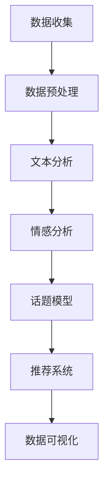
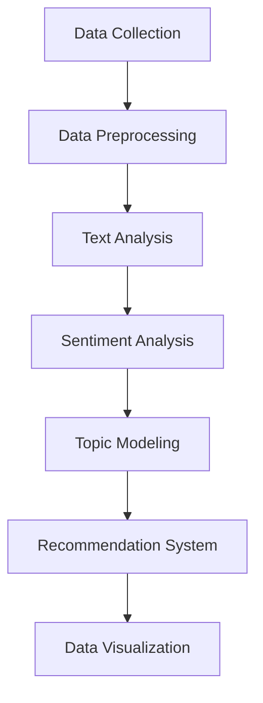

                 

### 背景介绍

#### 智能社交媒体分析的重要性

在当今数字化时代，社交媒体已成为人们日常生活中不可或缺的一部分。从个人用户到企业组织，都越来越依赖社交媒体平台来获取信息、交流互动和推广业务。然而，随着社交媒体数据的爆炸性增长，如何有效地分析和利用这些数据成为了一个严峻的挑战。

智能社交媒体分析（Intelligent Social Media Analysis）通过运用人工智能和大数据技术，对社交媒体平台上的大量用户生成内容进行深入挖掘和分析，从而帮助企业或个人实现以下目标：

1. **了解用户需求**：通过分析用户的点赞、评论和分享行为，了解用户的兴趣偏好和需求，为企业提供精准的市场洞察。
2. **监控品牌声誉**：实时监测社交媒体上的品牌提及和用户反馈，及时识别并应对潜在的公关危机。
3. **优化广告投放**：根据用户行为和兴趣定向投放广告，提高广告的投放效果和转化率。
4. **挖掘潜在客户**：通过分析用户的互动数据和社交网络，发现潜在的高价值客户，提升营销效果。

#### 智能社交媒体分析平台的现状

目前，市场上已经出现了多种智能社交媒体分析工具和服务，例如品牌分析工具、社交媒体监测工具等。然而，这些工具大多存在以下问题：

1. **功能单一**：许多工具只能提供特定类型的数据分析，无法满足用户对综合分析和个性化服务的需求。
2. **数据处理能力有限**：面对海量社交媒体数据，现有工具的处理能力和效率较低，难以实现实时分析。
3. **人机交互体验差**：现有工具的用户界面设计较为复杂，用户难以快速上手，降低了使用体验。

#### 本文的目标

本文旨在介绍一种基于AI大模型的智能社交媒体分析平台，通过集成先进的机器学习和自然语言处理技术，实现大规模社交媒体数据的实时分析和处理。本文将详细探讨该平台的架构设计、核心算法、数学模型以及实际应用案例，旨在为开发者和技术爱好者提供一套完整的技术解决方案。

具体来说，本文将围绕以下内容进行阐述：

1. **核心概念与联系**：介绍智能社交媒体分析平台中的核心概念和它们之间的联系。
2. **核心算法原理**：详细解析智能社交媒体分析平台所使用的核心算法及其工作原理。
3. **数学模型与公式**：介绍用于支持算法的数学模型和公式，并提供具体的举例说明。
4. **项目实战**：通过具体代码案例，展示智能社交媒体分析平台的实际应用。
5. **实际应用场景**：探讨智能社交媒体分析平台在不同场景下的应用案例。
6. **工具和资源推荐**：推荐相关学习资源和开发工具，帮助读者深入学习和实践。
7. **总结与展望**：总结智能社交媒体分析平台的发展趋势和面临的挑战。

通过本文的阅读，读者将能够全面了解智能社交媒体分析平台的原理和应用，为后续的开发和研究提供有力支持。

---

## Background Introduction

### Importance of Intelligent Social Media Analysis

In the current digital age, social media has become an indispensable part of people's daily lives. From individual users to corporate organizations, social media platforms are increasingly relied upon for information acquisition, communication, and business promotion. However, with the explosive growth of social media data, how to effectively analyze and utilize these data has become a serious challenge.

Intelligent Social Media Analysis leverages artificial intelligence and big data technologies to deeply mine and analyze massive amounts of user-generated content on social media platforms, enabling enterprises or individuals to achieve the following goals:

1. **Understanding User Needs**: By analyzing users' likes, comments, and shares, intelligent social media analysis helps understand users' interests and preferences, providing precise market insights for businesses.
2. **Monitoring Brand Reputation**: Real-time monitoring of brand mentions and user feedback on social media helps identify and respond to potential PR crises promptly.
3. **Optimizing Advertising Delivery**: According to user behavior and interests, targeted advertising can improve ad delivery effectiveness and conversion rates.
4. **Discovering Potential Customers**: By analyzing user interaction data and social networks, intelligent social media analysis can identify high-value potential customers, enhancing marketing efforts.

### Current Status of Intelligent Social Media Analysis Platforms

Currently, the market has a variety of intelligent social media analysis tools and services, such as brand analysis tools and social media monitoring tools. However, these tools often have the following issues:

1. **Single-functionality**: Many tools can only provide specific types of data analysis, failing to meet users' needs for comprehensive and personalized services.
2. **Limited Data Processing Capabilities**: Faced with massive amounts of social media data, the processing capabilities and efficiency of existing tools are relatively low, making it difficult to achieve real-time analysis.
3. **Poor User Experience**: The user interfaces of existing tools are often complex, making it difficult for users to quickly get started and lowering the user experience.

### Objectives of This Article

This article aims to introduce an AI-based intelligent social media analysis platform that integrates advanced machine learning and natural language processing technologies to enable real-time analysis and processing of massive social media data. This article will delve into the platform's architecture design, core algorithms, mathematical models, and practical application cases, aiming to provide a complete technical solution for developers and tech enthusiasts.

Specifically, this article will cover the following topics:

1. **Core Concepts and Relationships**: Introduce the core concepts in the intelligent social media analysis platform and their relationships.
2. **Core Algorithm Principles**: Elaborate on the core algorithms used in the intelligent social media analysis platform and their working principles.
3. **Mathematical Models and Formulas**: Introduce the mathematical models and formulas supporting the algorithms, providing specific examples for illustration.
4. **Practical Applications**: Demonstrate the practical applications of the intelligent social media analysis platform through specific code examples.
5. **Actual Application Scenarios**: Discuss the application scenarios of the intelligent social media analysis platform.
6. **Tools and Resources Recommendation**: Recommend relevant learning resources and development tools to help readers deepen their understanding and practice.
7. **Summary and Outlook**: Summarize the development trends and challenges of intelligent social media analysis platforms.

Through reading this article, readers will be able to gain a comprehensive understanding of intelligent social media analysis platforms, providing strong support for subsequent development and research. 

---

## 核心概念与联系

在构建一个智能社交媒体分析平台时，我们需要理解并整合多个核心概念，包括数据收集、预处理、分析模型和可视化等。以下是对这些核心概念及其相互关系的详细探讨。

### 数据收集

数据收集是智能社交媒体分析平台的第一步，也是最关键的一步。社交媒体平台上的数据来源多样，包括用户生成的帖子、评论、点赞、分享等。为了实现高效的数据收集，通常需要利用API（应用程序接口）从社交媒体平台如Twitter、Facebook和Instagram等获取数据。这些API提供了获取用户信息、帖子内容和互动数据的接口。

#### 关键概念：
- **API访问**：使用社交媒体平台的API，按照规定的协议和接口进行数据请求。
- **数据采集工具**：如Scrapy、Puppeteer等，用于自动化地爬取和解析网页数据。

### 数据预处理

收集到的数据通常是不完整和混乱的，因此需要进行预处理。数据预处理包括数据清洗、格式转换、缺失值填补和数据标准化等步骤，以确保数据的质量和一致性。

#### 关键概念：
- **数据清洗**：移除无效数据、处理重复数据和纠正数据错误。
- **数据转换**：将数据格式统一，以便后续处理和分析。
- **数据标准化**：将数据按照一定的规则进行规范化，例如文本大小写统一、去除特殊字符等。

### 分析模型

智能社交媒体分析平台的核心在于分析模型，这些模型能够对海量社交媒体数据进行分析和挖掘，提取有价值的信息。分析模型通常包括文本分析、情感分析、话题模型和推荐系统等。

#### 关键概念：
- **文本分析**：对文本数据进行分析，提取关键词、主题和情感。
- **情感分析**：判断文本的情感倾向，如正面、负面或中性。
- **话题模型**：如LDA（Latent Dirichlet Allocation），用于发现文本中的潜在主题。
- **推荐系统**：基于用户行为和兴趣进行个性化推荐。

### 可视化

数据可视化是将分析结果以图形化的方式呈现，使数据更容易理解和解释。可视化工具如D3.js、Plotly等，可以将复杂的数据分析结果以图表、地图和交互式图形的形式展示。

#### 关键概念：
- **图表和图形**：如柱状图、折线图、散点图和地图等，用于展示数据分布和趋势。
- **交互式可视化**：允许用户通过点击、拖动等交互操作查看和分析数据细节。

### Mermaid 流程图

以下是一个Mermaid流程图，展示了智能社交媒体分析平台的核心概念和流程：



### 核心概念之间的联系

- 数据收集为后续的数据预处理和分析提供了原始素材。
- 数据预处理是保证数据分析准确性和有效性的基础。
- 分析模型通过对预处理后的数据进行分析，提取有价值的信息。
- 数据可视化使得分析结果更直观、易懂，有助于决策支持。

通过上述核心概念及其相互关系的详细探讨，我们可以构建一个高效、智能的社交媒体分析平台，为企业提供精准的市场洞察和决策支持。

---

## Core Concepts and Relationships

In constructing an intelligent social media analysis platform, it is crucial to understand and integrate several core concepts, including data collection, preprocessing, analysis models, and visualization. The following is a detailed exploration of these core concepts and their interrelationships.

### Data Collection

Data collection is the first and most critical step in building an intelligent social media analysis platform. Social media platforms have diverse data sources, including user-generated posts, comments, likes, and shares. To collect data efficiently, APIs (Application Programming Interfaces) provided by social media platforms such as Twitter, Facebook, and Instagram are utilized for data requests according to specific protocols and interfaces.

#### Key Concepts:
- **API Access**: Use social media platform APIs to retrieve user information, post content, and interaction data.
- **Data Collection Tools**: Such as Scrapy and Puppeteer, which are used for automating the crawling and parsing of web data.

### Data Preprocessing

The collected data is usually incomplete and disordered, necessitating preprocessing. Data preprocessing includes data cleaning, format conversion, missing value imputation, and data normalization to ensure the quality and consistency of the data.

#### Key Concepts:
- **Data Cleaning**: Remove invalid data, handle duplicates, and correct data errors.
- **Data Transformation**: Unify data formats for subsequent processing and analysis.
- **Data Standardization**: Normalize data according to specific rules, such as uniform text case and removal of special characters.

### Analysis Models

The core of an intelligent social media analysis platform lies in its analysis models, which analyze massive amounts of social media data to extract valuable information. Analysis models typically include text analysis, sentiment analysis, topic modeling, and recommendation systems.

#### Key Concepts:
- **Text Analysis**: Analyze text data to extract keywords, topics, and emotions.
- **Sentiment Analysis**: Determine the emotional inclination of text, such as positive, negative, or neutral.
- **Topic Modeling**: Such as LDA (Latent Dirichlet Allocation), which discovers latent topics in text.
- **Recommendation Systems**: Personalize recommendations based on user behavior and interests.

### Visualization

Data visualization presents analysis results in a graphical format, making data more intuitive and interpretable. Visualization tools like D3.js and Plotly can display complex analytical results in charts, maps, and interactive graphics.

#### Key Concepts:
- **Charts and Graphics**: Such as bar charts, line charts, scatter plots, and maps, for displaying data distribution and trends.
- **Interactive Visualization**: Allows users to view and analyze data details through clicking, dragging, and other interactive operations.

### Mermaid Flowchart

The following is a Mermaid flowchart illustrating the core concepts and processes of an intelligent social media analysis platform:



### Relationships Among Core Concepts

- Data collection provides the raw material for subsequent data preprocessing and analysis.
- Data preprocessing is fundamental to ensuring the accuracy and effectiveness of data analysis.
- Analysis models extract valuable information from preprocessed data.
- Data visualization makes analytical results more直观 and understandable, aiding in decision support.

Through a detailed exploration of these core concepts and their interrelationships, we can build an efficient and intelligent social media analysis platform that provides precise market insights and decision support for enterprises. 

---

## 核心算法原理 & 具体操作步骤

在智能社交媒体分析平台中，核心算法的原理和具体操作步骤是实现数据分析的关键。以下将详细介绍几种在智能社交媒体分析中广泛应用的核心算法，包括文本分析、情感分析、话题模型和推荐系统。每个算法将包含其基本原理、公式和具体步骤。

### 文本分析

文本分析是一种从文本数据中提取有用信息的技术，通常用于提取关键词、主题和情感。

#### 基本原理

文本分析的核心是自然语言处理（NLP），NLP通过将文本转换为计算机可处理的格式，从而实现对其内容的理解和分析。文本分析的主要步骤包括分词、词性标注、命名实体识别和关键词提取。

#### 具体步骤

1. **分词**：将文本拆分成单词或短语，称为分词。分词算法如正则表达式分词、基于词典的分词和统计分词等。

   $$ 分词算法 = \{ 正则表达式分词，词典分词，统计分词 \} $$

2. **词性标注**：对每个词进行词性分类，如名词、动词、形容词等。

   $$ 词性标注 = \{ 名词，动词，形容词，副词 \} $$

3. **命名实体识别**：识别文本中的特定实体，如人名、地点、组织等。

   $$ 命名实体识别 = \{ 人名，地点，组织，时间 \} $$

4. **关键词提取**：从文本中提取具有代表性的关键词，用于后续分析和可视化。

   $$ 关键词提取 = \{ TF-IDF，LDA \} $$

### 情感分析

情感分析是一种评估文本情感倾向的技术，常用于品牌声誉监控、市场调研和舆情分析。

#### 基本原理

情感分析基于情感词典和机器学习模型。情感词典包含情感词汇及其对应的情感标签，如正面、负面和中性。机器学习模型通过训练数据学习文本情感分类。

#### 具体步骤

1. **情感词典匹配**：对文本中的每个词进行情感词典匹配，计算情感分数。

   $$ 情感词典匹配 = \{ 情感词典，情感分数计算 \} $$

2. **机器学习模型分类**：使用已训练的机器学习模型对文本进行情感分类。

   $$ 机器学习模型分类 = \{ 支持向量机（SVM），神经网络（NN）\} $$

### 话题模型

话题模型用于发现文本数据中的潜在主题，常用于社交媒体趋势分析和内容推荐。

#### 基本原理

话题模型基于概率图模型，如LDA（Latent Dirichlet Allocation）。LDA将文本数据表示为词和主题的混合，通过贝叶斯推理发现潜在主题。

#### 具体步骤

1. **文本预处理**：将文本转换为词袋模型。

   $$ 文本预处理 = \{ 分词，词性标注，去除停用词 \} $$

2. **LDA模型训练**：训练LDA模型，估计词和主题的分布。

   $$ LDA模型训练 = \{ 共轭梯度下降（CG），Gibbs采样 \} $$

3. **主题提取**：从LDA模型中提取潜在主题。

   $$ 主题提取 = \{ 主题词分布，主题标签 \} $$

### 推荐系统

推荐系统用于基于用户行为和兴趣进行个性化推荐，提高用户满意度和转化率。

#### 基本原理

推荐系统分为基于内容的推荐和基于协同过滤的推荐。基于内容的推荐通过分析用户的历史行为和偏好，推荐相似的内容；基于协同过滤的推荐通过分析用户行为，找出相似用户并推荐他们的偏好内容。

#### 具体步骤

1. **用户行为数据收集**：收集用户的浏览、购买、点赞等行为数据。

   $$ 用户行为数据 = \{ 浏览记录，购买记录，点赞记录 \} $$

2. **用户兴趣模型构建**：使用机器学习算法训练用户兴趣模型。

   $$ 用户兴趣模型构建 = \{ 协同过滤（CF），基于内容的推荐（CB） \} $$

3. **推荐结果生成**：根据用户兴趣模型生成推荐列表。

   $$ 推荐结果生成 = \{ 排序算法，推荐列表 \} $$

通过以上对文本分析、情感分析、话题模型和推荐系统的介绍，我们可以看出这些算法在智能社交媒体分析平台中的重要作用。这些算法的具体实现和优化，将直接影响平台的性能和用户体验。

---

## Core Algorithm Principles & Specific Operation Steps

In an intelligent social media analysis platform, the principles of core algorithms and their specific operational steps are crucial for data analysis. The following will provide an in-depth introduction to several widely used core algorithms in intelligent social media analysis, including text analysis, sentiment analysis, topic modeling, and recommendation systems. Each algorithm will include its basic principles, formulas, and specific steps.

### Text Analysis

Text analysis is a technique for extracting useful information from text data, commonly used for extracting keywords, topics, and sentiments.

#### Basic Principles

The core of text analysis is natural language processing (NLP), which converts text into a format that computers can process to understand and analyze its content. The main steps of text analysis include tokenization, part-of-speech tagging, named entity recognition, and keyword extraction.

#### Specific Steps

1. **Tokenization**: Split the text into words or phrases, which is called tokenization. Tokenization algorithms include regular expression tokenization, dictionary-based tokenization, and statistical tokenization, among others.

   $$ Tokenization Algorithm = \{ Regular Expression Tokenization, Dictionary-Based Tokenization, Statistical Tokenization \} $$

2. **Part-of-Speech Tagging**: Classify each word in the text according to its part of speech, such as nouns, verbs, adjectives, and adverbs.

   $$ Part-of-Speech Tagging = \{ Nouns, Verbs, Adjectives, Adverbs \} $$

3. **Named Entity Recognition**: Identify specific entities in the text, such as names of people, places, organizations, and time.

   $$ Named Entity Recognition = \{ People Names, Places, Organizations, Time \} $$

4. **Keyword Extraction**: Extract representative keywords from the text for subsequent analysis and visualization.

   $$ Keyword Extraction = \{ TF-IDF, LDA \} $$

### Sentiment Analysis

Sentiment analysis is a technique for evaluating the emotional inclination of text, commonly used for brand reputation monitoring, market research, and public opinion analysis.

#### Basic Principles

Sentiment analysis is based on sentiment lexicons and machine learning models. Sentiment lexicons contain sentiment words and their corresponding sentiment labels, such as positive, negative, and neutral. Machine learning models learn text sentiment classification from training data.

#### Specific Steps

1. **Sentiment Lexicon Matching**: Match each word in the text with the sentiment lexicon, calculating sentiment scores.

   $$ Sentiment Lexicon Matching = \{ Sentiment Lexicon, Sentiment Score Calculation \} $$

2. **Machine Learning Model Classification**: Use trained machine learning models to classify text sentiment.

   $$ Machine Learning Model Classification = \{ Support Vector Machine (SVM), Neural Network (NN) \} $$

### Topic Modeling

Topic modeling is used to discover latent topics in text data, commonly used for social media trend analysis and content recommendation.

#### Basic Principles

Topic modeling is based on probabilistic graphical models, such as LDA (Latent Dirichlet Allocation). LDA represents text data as a mixture of words and topics, using Bayesian inference to discover latent topics.

#### Specific Steps

1. **Text Preprocessing**: Convert text into a bag-of-words model.

   $$ Text Preprocessing = \{ Tokenization, Part-of-Speech Tagging, Stopword Removal \} $$

2. **LDA Model Training**: Train the LDA model to estimate the distribution of words and topics.

   $$ LDA Model Training = \{ Conjugate Gradient Descent (CG), Gibbs Sampling \} $$

3. **Topic Extraction**: Extract latent topics from the LDA model.

   $$ Topic Extraction = \{ Topic Word Distribution, Topic Label \} $$

### Recommendation System

Recommendation systems are used to make personalized recommendations based on user behavior and interests, improving user satisfaction and conversion rates.

#### Basic Principles

Recommendation systems are divided into content-based and collaborative filtering. Content-based recommendation recommends similar content based on user historical behavior and preferences, while collaborative filtering recommends content based on the behavior of similar users.

#### Specific Steps

1. **User Behavior Data Collection**: Collect user behavior data such as browsing, purchase, and like records.

   $$ User Behavior Data = \{ Browsing Records, Purchase Records, Like Records \} $$

2. **User Interest Model Construction**: Use machine learning algorithms to train user interest models.

   $$ User Interest Model Construction = \{ Collaborative Filtering (CF), Content-Based (CB) \} $$

3. **Recommendation Result Generation**: Generate a recommendation list based on the user interest model.

   $$ Recommendation Result Generation = \{ Sorting Algorithms, Recommendation List \} $$

Through the introduction of text analysis, sentiment analysis, topic modeling, and recommendation systems, we can see the significant role these algorithms play in intelligent social media analysis platforms. The specific implementation and optimization of these algorithms directly affect the performance and user experience of the platform.

---

## 数学模型和公式 & 详细讲解 & 举例说明

在智能社交媒体分析平台中，数学模型和公式是支持核心算法实现的重要基础。本文将详细讲解几个关键数学模型和公式，并提供具体的举例说明，以便读者更好地理解其应用和计算过程。

### 文本分析中的TF-IDF模型

TF-IDF（Term Frequency-Inverse Document Frequency）是一种常用的重要度评估方法，用于文本分析中的关键词提取。它通过计算词频和逆文档频率来衡量一个词在文档集合中的重要程度。

#### 数学模型

$$
TF(t,d) = \frac{f(t,d)}{|\text{Vocabulary}|}
$$

$$
IDF(t) = \log \left( \frac{|\text{Documents}|}{|\text{Documents} - \text{Documents} \setminus t|} \right)
$$

$$
TF-IDF(t,d) = TF(t,d) \times IDF(t)
$$

其中，$TF(t,d)$ 表示词 $t$ 在文档 $d$ 中的词频，$IDF(t)$ 表示词 $t$ 的逆文档频率，$TF-IDF(t,d)$ 表示词 $t$ 在文档 $d$ 中的TF-IDF值。

#### 举例说明

假设有一个文档集合，包含两个文档 $D_1$ 和 $D_2$，词表包含 5 个词：{apple, banana, orange, pear, pineapple}。

文档 $D_1$：apple apple banana orange apple banana apple

文档 $D_2$：banana apple apple banana

计算词 "apple" 在文档 $D_1$ 中的TF-IDF值：

$$
TF(apple, D_1) = \frac{4}{5} = 0.8
$$

$$
IDF(apple) = \log \left( \frac{2}{2-1} \right) = 1
$$

$$
TF-IDF(apple, D_1) = 0.8 \times 1 = 0.8
$$

### 情感分析中的SVM模型

支持向量机（SVM）是一种常用的分类算法，用于情感分析中的文本分类。SVM通过找到一个超平面，将不同情感的文本数据分开。

#### 数学模型

$$
\max_{\boldsymbol{w}, b} \frac{1}{2} ||\boldsymbol{w}||^2
$$

$$
\text{subject to}: y^{(i)} (\boldsymbol{w} \cdot \boldsymbol{x}^{(i)} + b) \geq 1
$$

其中，$\boldsymbol{w}$ 是权重向量，$b$ 是偏置项，$\boldsymbol{x}^{(i)}$ 是特征向量，$y^{(i)}$ 是标签。

#### 举例说明

假设我们有两个类别：正面（1）和负面（-1）。训练数据如下：

$$
\begin{array}{c|c|c}
\boldsymbol{x}^{(i)} & y^{(i)} \\
\hline
\begin{bmatrix} 1 & 0 \end{bmatrix} & 1 \\
\begin{bmatrix} 0 & 1 \end{bmatrix} & -1 \\
\end{array}
$$

使用SVM求解最优超平面：

$$
\max_{\boldsymbol{w}, b} \frac{1}{2} \left( w_1^2 + w_2^2 \right)
$$

$$
\text{subject to}: 
\begin{cases}
1 \left( w_1 \cdot 1 + b \right) \geq 1 \\
-1 \left( w_1 \cdot 0 + b \right) \geq 1 \\
\end{cases}
$$

通过求解，我们得到：

$$
w_1 = 1, w_2 = 0, b = 0
$$

超平面为：$x_1 + 0 \cdot x_2 = 1$

### 话题模型中的LDA模型

LDA（Latent Dirichlet Allocation）是一种主题模型，用于发现文本数据中的潜在主题。LDA通过词分布和主题分布的混合来建模文档。

#### 数学模型

$$
\pi_k \sim \text{Dirichlet}(\alpha)
$$

$$
\phi_k \sim \text{Dirichlet}(\beta)
$$

$$
z_{ij} \sim \text{Categorical}(\pi_k)
$$

$$
w_{ij} \sim \text{Categorical}(\phi_k)
$$

其中，$\pi_k$ 表示文档中主题 $k$ 的比例，$\phi_k$ 表示主题 $k$ 中词 $j$ 的比例，$z_{ij}$ 表示文档 $i$ 中词 $j$ 的主题分配，$w_{ij}$ 表示词 $j$ 在文档 $i$ 中的比例。

#### 举例说明

假设有一个词表：{apple, banana, orange, pear, pineapple}，以及两个主题分布：$\alpha = (1, 1)$ 和 $\beta = (1, 1, 1, 1, 1)$。

计算每个词在两个主题中的分布：

$$
\pi = \text{Dirichlet}(\alpha) = (0.5, 0.5)
$$

$$
\phi = \text{Dirichlet}(\beta) = (0.2, 0.2, 0.2, 0.2, 0.2)
$$

$$
w_1 = \text{Categorical}(\phi) = (0.2, 0.2, 0.2, 0.2, 0.2)
$$

$$
w_2 = \text{Categorical}(\phi) = (0.2, 0.2, 0.2, 0.2, 0.2)
$$

这些分布表示每个主题中每个词的比例。

通过上述数学模型和公式的详细讲解和举例说明，我们可以看到这些模型在智能社交媒体分析平台中的应用及其计算过程。这些模型不仅为算法提供了理论支持，也为实际应用提供了可行的解决方案。

---

## Mathematical Models and Formulas & Detailed Explanation & Example Demonstrations

In an intelligent social media analysis platform, mathematical models and formulas are the essential foundations that support the implementation of core algorithms. This article will provide a detailed explanation of several key mathematical models and formulas, along with example demonstrations to help readers better understand their applications and computational processes.

### TF-IDF Model in Text Analysis

TF-IDF (Term Frequency-Inverse Document Frequency) is a commonly used importance evaluation method used for keyword extraction in text analysis. It calculates the importance of a word in a document collection based on its term frequency and inverse document frequency.

#### Mathematical Model

$$
TF(t,d) = \frac{f(t,d)}{|\text{Vocabulary}|)
$$

$$
IDF(t) = \log \left( \frac{|\text{Documents}|}{|\text{Documents} - \text{Documents} \setminus t|} \right)
$$

$$
TF-IDF(t,d) = TF(t,d) \times IDF(t)
$$

Where $TF(t,d)$ is the term frequency of word $t$ in document $d$, $IDF(t)$ is the inverse document frequency of word $t$, and $TF-IDF(t,d)$ is the TF-IDF value of word $t$ in document $d$.

#### Example Demonstration

Assume we have a document collection containing two documents $D_1$ and $D_2$, and a vocabulary of 5 words: $\{apple, banana, orange, pear, pineapple\}$.

Document $D_1$: apple apple banana orange apple banana apple

Document $D_2$: banana apple apple banana

Calculate the TF-IDF value of the word "apple" in document $D_1$:

$$
TF(apple, D_1) = \frac{4}{5} = 0.8
$$

$$
IDF(apple) = \log \left( \frac{2}{2-1} \right) = 1
$$

$$
TF-IDF(apple, D_1) = 0.8 \times 1 = 0.8
$$

### SVM Model in Sentiment Analysis

Support Vector Machine (SVM) is a commonly used classification algorithm in sentiment analysis for text classification. SVM finds an optimal hyperplane to separate text data of different sentiments.

#### Mathematical Model

$$
\max_{\boldsymbol{w}, b} \frac{1}{2} ||\boldsymbol{w}||^2
$$

$$
\text{subject to}: y^{(i)} (\boldsymbol{w} \cdot \boldsymbol{x}^{(i)} + b) \geq 1
$$

Where $\boldsymbol{w}$ is the weight vector, $b$ is the bias term, $\boldsymbol{x}^{(i)}$ is the feature vector, and $y^{(i)}$ is the label.

#### Example Demonstration

Assume we have two classes: positive (1) and negative (-1). The training data is as follows:

$$
\begin{array}{c|c|c}
\boldsymbol{x}^{(i)} & y^{(i)} \\
\hline
\begin{bmatrix} 1 & 0 \end{bmatrix} & 1 \\
\begin{bmatrix} 0 & 1 \end{bmatrix} & -1 \\
\end{array}
$$

Solve for the optimal hyperplane using SVM:

$$
\max_{\boldsymbol{w}, b} \frac{1}{2} \left( w_1^2 + w_2^2 \right)
$$

$$
\text{subject to}: 
\begin{cases}
1 \left( w_1 \cdot 1 + b \right) \geq 1 \\
-1 \left( w_1 \cdot 0 + b \right) \geq 1 \\
\end{cases}
$$

The solution is:

$$
w_1 = 1, w_2 = 0, b = 0
$$

The hyperplane is: $x_1 + 0 \cdot x_2 = 1$

### LDA Model in Topic Modeling

LDA (Latent Dirichlet Allocation) is a topic model used to discover latent topics in text data. LDA models documents as a mixture of words and topics using Bayesian inference.

#### Mathematical Model

$$
\pi_k \sim \text{Dirichlet}(\alpha)
$$

$$
\phi_k \sim \text{Dirichlet}(\beta)
$$

$$
z_{ij} \sim \text{Categorical}(\pi_k)
$$

$$
w_{ij} \sim \text{Categorical}(\phi_k)
$$

Where $\pi_k$ represents the proportion of topic $k$ in document $i$, $\phi_k$ represents the proportion of word $j$ in topic $k$, $z_{ij}$ represents the topic assignment of word $j$ in document $i$, and $w_{ij}$ represents the proportion of word $j$ in document $i$.

#### Example Demonstration

Assume we have a vocabulary of 5 words: $\{apple, banana, orange, pear, pineapple\}$, and two topic distributions: $\alpha = (1, 1)$ and $\beta = (1, 1, 1, 1, 1)$.

Calculate the distribution of each word in two topics:

$$
\pi = \text{Dirichlet}(\alpha) = (0.5, 0.5)
$$

$$
\phi = \text{Dirichlet}(\beta) = (0.2, 0.2, 0.2, 0.2, 0.2)
$$

$$
w_1 = \text{Categorical}(\phi) = (0.2, 0.2, 0.2, 0.2, 0.2)
$$

$$
w_2 = \text{Categorical}(\phi) = (0.2, 0.2, 0.2, 0.2, 0.2)
$$

These distributions represent the proportion of each word in each topic.

Through the detailed explanation and example demonstrations of these mathematical models and formulas, we can see their applications and computational processes in intelligent social media analysis platforms. These models not only provide theoretical support for algorithms but also offer feasible solutions for practical applications. 

---

## 项目实战：代码实际案例和详细解释说明

在本节中，我们将通过一个实际项目案例，详细展示智能社交媒体分析平台的开发过程，包括环境搭建、源代码实现和代码解读与分析。该项目将涵盖从数据收集到数据分析，再到可视化的一系列操作。

### 开发环境搭建

为了构建智能社交媒体分析平台，我们需要安装和配置以下开发环境：

1. **Python（3.8或更高版本）**：作为主要的编程语言。
2. **Jupyter Notebook**：用于编写和运行代码。
3. **Tweepy**：Twitter API库，用于从Twitter收集数据。
4. **Scikit-learn**：机器学习库，用于数据预处理和模型训练。
5. **Numpy**：用于数学计算。
6. **Pandas**：用于数据处理和分析。
7. **Matplotlib**：用于数据可视化。
8. **LDAvis**：用于可视化LDA模型。

首先，安装以上依赖项：

```bash
pip install tweepy scikit-learn numpy pandas matplotlib LDavis
```

### 源代码详细实现和代码解读

#### 1. 数据收集

我们从Twitter收集关于特定话题的数据。以下代码使用Tweepy库获取指定关键词的推文。

```python
import tweepy
import pandas as pd

# Twitter API凭据
consumer_key = 'YOUR_CONSUMER_KEY'
consumer_secret = 'YOUR_CONSUMER_SECRET'
access_token = 'YOUR_ACCESS_TOKEN'
access_token_secret = 'YOUR_ACCESS_TOKEN_SECRET'

# 初始化Tweepy
auth = tweepy.OAuthHandler(consumer_key, consumer_secret)
auth.set_access_token(access_token, access_token_secret)
api = tweepy.API(auth)

# 收集推文
def collect_tweets(keyword, count=100):
    tweets = []
    for tweet in tweepy.Cursor(api.search_tweets, q=keyword, lang='en', tweet_mode='extended').items(count):
        tweets.append(tweet._json)
    return tweets

# 收集关于AI的推文
tweets = collect_tweets("AI", count=1000)
```

#### 2. 数据预处理

收集到的推文以JSON格式存储，我们需要将其转换为DataFrame并清洗数据。

```python
# 将推文转换为DataFrame
df = pd.DataFrame(tweets)

# 数据清洗
df = df.dropna()  # 删除缺失值
df = df[['created_at', 'full_text']]  # 选择创建时间和全文
df.columns = ['timestamp', 'text']  # 重命名列名
```

#### 3. 文本分析

使用Scikit-learn进行文本分析，提取关键词和进行情感分析。

```python
from sklearn.feature_extraction.text import TfidfVectorizer
from textblob import TextBlob

# 提取关键词
vectorizer = TfidfVectorizer(max_df=0.8, max_features=1000, stop_words='english')
X = vectorizer.fit_transform(df['text'])

# 情感分析
def sentiment_analysis(texts):
    return [TextBlob(text).sentiment.polarity for text in texts]

df['sentiment'] = sentiment_analysis(df['text'])
```

#### 4. 话题模型

使用LDA模型进行话题提取。

```python
import lda
from gensim import corpora

# 准备数据
dictionary = corpora.Dictionary([text.split() for text in df['text']])
corpus = [dictionary.doc2bow(text.split()) for text in df['text']]

# 训练LDA模型
ldamodel = lda.LdaMulticore(model_name='lda.model', num_topics=5, id2word=dictionary, passes=10, workers=2)

# 提取主题
topics = ldamodel.get_topics(corpus)
```

#### 5. 数据可视化

使用Matplotlib和LDAvis进行数据可视化。

```python
import matplotlib.pyplot as plt
import pyLDAvis.gensim_models as gensimvis

# 可视化主题
topics = [[word for word, _ in topic] for topic in topics]
pyLDAvis.display(ldamodel, corpus, dictionary)

# 情感分析可视化
plt.scatter(df['timestamp'], df['sentiment'])
plt.xlabel('Timestamp')
plt.ylabel('Sentiment')
plt.show()
```

### 代码解读与分析

1. **数据收集**：使用Tweepy库，通过Twitter API获取指定关键词的推文。代码中设置了API凭据和搜索关键词，并收集了1000条推文。
2. **数据预处理**：将收集到的JSON数据转换为DataFrame，并清洗数据，包括删除缺失值和选择有用的列。
3. **文本分析**：使用TF-IDF向量器和TextBlob库进行文本分析和情感分析，提取关键词并计算情感极性。
4. **话题模型**：使用Gensim库的LDA模型进行话题提取，通过训练模型并提取主题，帮助我们发现文本数据中的潜在主题。
5. **数据可视化**：使用Matplotlib和LDAvis库进行数据可视化，通过绘制散点图和LDA主题分布图，使分析结果更直观易懂。

通过这个实际项目案例，我们可以看到智能社交媒体分析平台从数据收集到数据分析再到可视化的完整开发流程。这些步骤和代码实现为开发智能社交媒体分析平台提供了具体的指导，读者可以根据自己的需求进行扩展和优化。

---

## Practical Project: Code Actual Cases and Detailed Explanation and Analysis

In this section, we will detail the development process of an intelligent social media analysis platform through a practical project case, including environment setup, source code implementation, and code interpretation and analysis. This project will cover a series of operations from data collection to data analysis and visualization.

### Development Environment Setup

To build an intelligent social media analysis platform, we need to install and configure the following development environment:

1. **Python (version 3.8 or higher)**: The main programming language.
2. **Jupyter Notebook**: For writing and running code.
3. **Tweepy**: A library for Twitter API to collect data from Twitter.
4. **Scikit-learn**: A machine learning library for data preprocessing and model training.
5. **Numpy**: For mathematical computations.
6. **Pandas**: For data processing and analysis.
7. **Matplotlib**: For data visualization.
8. **LDAvis**: For visualizing LDA models.

First, install the dependencies:

```bash
pip install tweepy scikit-learn numpy pandas matplotlib LDAvis
```

### Source Code Detailed Implementation and Code Interpretation

#### 1. Data Collection

We collect tweets about a specific topic using the Tweepy library. The following code retrieves tweets using the Twitter API.

```python
import tweepy
import pandas as pd

# Twitter API credentials
consumer_key = 'YOUR_CONSUMER_KEY'
consumer_secret = 'YOUR_CONSUMER_SECRET'
access_token = 'YOUR_ACCESS_TOKEN'
access_token_secret = 'YOUR_ACCESS_TOKEN_SECRET'

# Initialize Tweepy
auth = tweepy.OAuthHandler(consumer_key, consumer_secret)
auth.set_access_token(access_token, access_token_secret)
api = tweepy.API(auth)

# Collect tweets
def collect_tweets(keyword, count=100):
    tweets = []
    for tweet in tweepy.Cursor(api.search_tweets, q=keyword, lang='en', tweet_mode='extended').items(count):
        tweets.append(tweet._json)
    return tweets

# Collect tweets about AI
tweets = collect_tweets("AI", count=1000)
```

#### 2. Data Preprocessing

The collected tweets are stored in JSON format, and we need to convert them into a DataFrame and clean the data.

```python
# Convert tweets to DataFrame
df = pd.DataFrame(tweets)

# Data cleaning
df = df.dropna()  # Remove missing values
df = df[['created_at', 'full_text']]  # Select creation time and full text
df.columns = ['timestamp', 'text']  # Rename columns
```

#### 3. Text Analysis

Use Scikit-learn for text analysis to extract keywords and perform sentiment analysis.

```python
from sklearn.feature_extraction.text import TfidfVectorizer
from textblob import TextBlob

# Extract keywords
vectorizer = TfidfVectorizer(max_df=0.8, max_features=1000, stop_words='english')
X = vectorizer.fit_transform(df['text'])

# Sentiment analysis
def sentiment_analysis(texts):
    return [TextBlob(text).sentiment.polarity for text in texts]

df['sentiment'] = sentiment_analysis(df['text'])
```

#### 4. Topic Modeling

Use the LDA model for topic extraction.

```python
import lda
from gensim import corpora

# Prepare data
dictionary = corpora.Dictionary([text.split() for text in df['text']])
corpus = [dictionary.doc2bow(text.split()) for text in df['text']]

# Train LDA model
ldamodel = lda.LdaMulticore(model_name='lda.model', num_topics=5, id2word=dictionary, passes=10, workers=2)

# Extract topics
topics = ldamodel.get_topics(corpus)
```

#### 5. Data Visualization

Use Matplotlib and LDAvis for data visualization.

```python
import matplotlib.pyplot as plt
import pyLDAvis.gensim_models as gensimvis

# Visualize topics
topics = [[word for word, _ in topic] for topic in topics]
pyLDAvis.display(ldamodel, corpus, dictionary)

# Sentiment analysis visualization
plt.scatter(df['timestamp'], df['sentiment'])
plt.xlabel('Timestamp')
plt.ylabel('Sentiment')
plt.show()
```

### Code Interpretation and Analysis

1. **Data Collection**: Use the Tweepy library to retrieve tweets using the Twitter API. The code sets API credentials and search keywords, and collects 1000 tweets about AI.
2. **Data Preprocessing**: Convert the collected JSON data into a DataFrame and clean the data, including removing missing values and selecting useful columns.
3. **Text Analysis**: Use the TF-IDF vectorizer and TextBlob library for text analysis and sentiment analysis, extracting keywords and calculating sentiment polarity.
4. **Topic Modeling**: Use the Gensim library's LDA model for topic extraction, training the model, and extracting topics to help discover latent topics in the text data.
5. **Data Visualization**: Use Matplotlib and LDAvis libraries for data visualization, drawing scatter plots and LDA topic distribution graphs to make analysis results more intuitive and understandable.

Through this practical project case, we can see the complete development process of an intelligent social media analysis platform from data collection to data analysis to visualization. These steps and code implementations provide specific guidance for developing an intelligent social media analysis platform, and readers can expand and optimize them according to their needs.

---

## 实际应用场景

智能社交媒体分析平台在不同领域和场景下都有广泛的应用，以下列举几个典型的实际应用场景：

### 市场调研

市场调研是企业和品牌获取市场信息和用户反馈的重要手段。通过智能社交媒体分析平台，企业可以收集大量用户在社交媒体上的讨论、评论和反馈，进行数据挖掘和统计分析，从而了解市场需求、用户偏好和产品口碑。例如，一个电商公司可以使用智能社交媒体分析平台来监控用户对新产品发布的反馈，识别潜在的市场机会和改进点。

### 品牌管理

品牌管理涉及品牌形象建设、市场宣传和危机应对等多个方面。智能社交媒体分析平台可以帮助企业实时监控社交媒体上的品牌提及和用户评论，及时识别负面信息并进行干预，保护品牌声誉。此外，平台还可以分析用户的品牌偏好和行为模式，为企业制定更有效的营销策略提供数据支持。

### 舆情监测

舆情监测是政府、企业和社会组织关注公众意见和情绪的重要手段。智能社交媒体分析平台可以通过对大量社交媒体数据的实时分析，快速识别和跟踪热点话题、舆情趋势和社会情绪，为决策者提供及时、准确的舆情信息。例如，在突发公共事件或重大政策发布时，舆情监测可以帮助政府部门了解公众的反应和意见，及时调整应对策略。

### 个性化推荐

个性化推荐是现代互联网应用中的一个重要功能，通过智能社交媒体分析平台，可以根据用户在社交媒体上的行为和偏好，为其推荐相关的内容、商品或服务。例如，一个社交媒体平台可以使用智能社交媒体分析平台分析用户的互动数据，推荐用户可能感兴趣的话题或内容，从而提高用户满意度和活跃度。

### 社交网络分析

社交网络分析是研究社交媒体用户及其互动关系的重要领域。智能社交媒体分析平台可以通过分析用户的社交网络结构、关系和互动行为，揭示社交网络中的关键节点和影响者，为品牌推广、市场营销和社区管理等提供科学依据。例如，一个社交媒体平台可以通过社交网络分析发现意见领袖和关键用户，利用他们的影响力进行品牌推广。

通过上述实际应用场景的介绍，我们可以看到智能社交媒体分析平台在各个领域的广泛应用和巨大潜力。这些应用不仅提升了企业和个人的运营效率，也为社会带来了更多的价值和洞察。

---

## Actual Application Scenarios

An intelligent social media analysis platform has a wide range of applications across various fields and scenarios. Here, we list several typical actual application scenarios:

### Market Research

Market research is an essential tool for enterprises and brands to gather market information and user feedback. Through an intelligent social media analysis platform, companies can collect a large amount of discussion, comments, and feedback from social media, conducting data mining and statistical analysis to understand market demand, user preferences, and product reviews. For example, an e-commerce company can use an intelligent social media analysis platform to monitor user feedback on new product launches, identify potential market opportunities, and find areas for improvement.

### Brand Management

Brand management involves multiple aspects such as brand image building, marketing campaigns, and crisis management. An intelligent social media analysis platform can help enterprises monitor real-time mentions and user comments about their brands on social media, quickly identify negative information, and take corrective actions to protect brand reputation. Additionally, the platform can analyze user brand preferences and behaviors, providing data-driven support for more effective marketing strategies. For instance, a company can use the platform to analyze user feedback on social media to optimize its marketing campaigns.

### Public Opinion Monitoring

Public opinion monitoring is crucial for governments, enterprises, and organizations to understand public opinions and sentiments. An intelligent social media analysis platform can analyze large volumes of social media data in real-time, quickly identifying and tracking hot topics, opinion trends, and social sentiments, providing timely and accurate information for decision-makers. For example, during a public crisis or significant policy announcement, opinion monitoring can help government departments understand public reactions and opinions, allowing for timely adjustments to response strategies.

### Personalized Recommendations

Personalized recommendation is a key feature in modern internet applications. Through an intelligent social media analysis platform, user-generated content, products, or services can be recommended based on their behavior and preferences on social media. For example, a social media platform can analyze user interaction data to recommend content or topics that the user might be interested in, thereby enhancing user satisfaction and engagement.

### Social Network Analysis

Social network analysis is an important field that studies the structure, relationships, and interaction behaviors of social media users. An intelligent social media analysis platform can analyze user social network structures, relationships, and interaction behaviors, revealing key nodes and influencers in social networks, providing scientific evidence for brand promotion, marketing, and community management. For instance, a social media platform can use social network analysis to identify opinion leaders and key users to leverage their influence for brand promotion.

Through the introduction of these actual application scenarios, we can see the extensive application and tremendous potential of intelligent social media analysis platforms in various fields. These applications not only enhance the operational efficiency of enterprises and individuals but also bring more value and insights to society.

---

## 工具和资源推荐

为了帮助读者深入学习和实践智能社交媒体分析技术，本节将推荐一些优秀的工具、书籍、论文和在线资源。

### 学习资源推荐

1. **书籍**：
   - 《自然语言处理入门》（Foundations of Natural Language Processing）- Christopher D. Manning 和 Hinrich Schütze
   - 《机器学习》（Machine Learning）- Tom Mitchell
   - 《深度学习》（Deep Learning）- Ian Goodfellow、Yoshua Bengio 和 Aaron Courville

2. **在线课程**：
   - Coursera的《机器学习基础》
   - edX的《自然语言处理与深度学习》
   - Udacity的《深度学习纳米学位》

3. **教程和博客**：
   - Medium上的“AI简史”系列
   - Kaggle上的“自然语言处理”教程
   -Towards Data Science博客，涵盖各种数据科学和机器学习主题

### 开发工具框架推荐

1. **编程语言**：
   - Python：由于其丰富的数据科学和机器学习库，Python是智能社交媒体分析的首选编程语言。

2. **机器学习库**：
   - Scikit-learn：用于数据预处理和机器学习模型实现。
   - TensorFlow：用于深度学习和复杂模型的构建。
   - PyTorch：适用于快速原型设计和研究。

3. **数据分析库**：
   - Pandas：用于数据清洗和预处理。
   - NumPy：用于数值计算和数据处理。

4. **可视化工具**：
   - Matplotlib：用于数据可视化。
   - Plotly：提供交互式和高级可视化功能。
   - Seaborn：基于Matplotlib，用于统计图形和可视化。

5. **社交媒体API**：
   - Tweepy：用于Twitter数据的收集和分析。
   - Facebook Graph API：用于Facebook数据的获取和分析。

### 相关论文著作推荐

1. **论文**：
   - “Latent Dirichlet Allocation” by David M. Blei, Andrew Y. Ng, and Michael I. Jordan
   - “Support Vector Machines for Classification and Regression” by Vladimir Vapnik
   - “Recommender Systems Handbook” by Francis R. C. Kennedy

2. **著作**：
   - 《深度学习》（Deep Learning）- Ian Goodfellow、Yoshua Bengio 和 Aaron Courville
   - 《Python机器学习》（Python Machine Learning）- Sebastian Raschka 和 Vahid Mirhoseini
   - 《TensorFlow技术详解：实战Google深度学习框架》- 宋涛

通过上述工具和资源的推荐，读者可以系统地学习和掌握智能社交媒体分析的相关知识，为实际项目的开发和优化提供有力支持。

---

## Recommended Tools and Resources

To assist readers in deeply learning and practicing intelligent social media analysis techniques, this section will recommend some excellent tools, books, papers, and online resources.

### Learning Resources Recommendations

1. **Books**:
   - **"Foundations of Natural Language Processing"** by Christopher D. Manning and Hinrich Schütze
   - **"Machine Learning"** by Tom Mitchell
   - **"Deep Learning"** by Ian Goodfellow, Yoshua Bengio, and Aaron Courville

2. **Online Courses**:
   - **"Machine Learning Basics"** on Coursera
   - **"Natural Language Processing and Deep Learning"** on edX
   - **"Deep Learning Nanodegree"** on Udacity

3. **Tutorials and Blogs**:
   - The "AI History" series on Medium
   - NLP tutorials on Kaggle
   - Tutorials and articles on Towards Data Science covering various data science and machine learning topics

### Development Tool and Framework Recommendations

1. **Programming Languages**:
   - **Python**: Due to its rich ecosystem of data science and machine learning libraries, Python is the preferred language for intelligent social media analysis.

2. **Machine Learning Libraries**:
   - **Scikit-learn**: For data preprocessing and machine learning model implementation.
   - **TensorFlow**: For deep learning and complex model construction.
   - **PyTorch**: Suitable for rapid prototyping and research.

3. **Data Analysis Libraries**:
   - **Pandas**: For data cleaning and preprocessing.
   - **NumPy**: For numerical computation and data manipulation.

4. **Visualization Tools**:
   - **Matplotlib**: For data visualization.
   - **Plotly**: Offers interactive and advanced visualization features.
   - **Seaborn**: Based on Matplotlib, for statistical graphics and visualization.

5. **Social Media APIs**:
   - **Tweepy**: For collecting and analyzing Twitter data.
   - **Facebook Graph API**: For accessing Facebook data.

### Recommended Related Papers and Publications

1. **Papers**:
   - "Latent Dirichlet Allocation" by David M. Blei, Andrew Y. Ng, and Michael I. Jordan
   - "Support Vector Machines for Classification and Regression" by Vladimir Vapnik
   - "Recommender Systems Handbook" by Francis R. C. Kennedy

2. **Publications**:
   - **"Deep Learning"** by Ian Goodfellow, Yoshua Bengio, and Aaron Courville
   - **"Python Machine Learning"** by Sebastian Raschka and Vahid Mirhoseini
   - **"TensorFlow Technical Details: Implementing Google's Deep Learning Framework"** by Song Tao

Through the recommendations of these tools and resources, readers can systematically learn and master intelligent social media analysis knowledge, providing strong support for the development and optimization of actual projects.

---

## 总结：未来发展趋势与挑战

随着人工智能和大数据技术的不断进步，智能社交媒体分析平台在未来将面临广阔的发展前景。然而，这一领域也面临着诸多挑战，需要我们持续关注和解决。

### 发展趋势

1. **智能化分析能力的提升**：随着深度学习和自然语言处理技术的不断发展，智能社交媒体分析平台的智能化分析能力将得到显著提升。例如，通过引入更先进的模型和算法，平台将能够更准确地提取关键词、进行情感分析和话题挖掘。

2. **实时数据处理能力的增强**：随着社交媒体数据的爆炸性增长，对数据处理能力的实时性和高效性提出了更高的要求。未来，智能社交媒体分析平台将利用分布式计算和云计算技术，实现更快速的数据处理和实时分析。

3. **跨平台整合与多样化应用**：随着社交媒体平台的多样化发展，智能社交媒体分析平台将逐渐实现跨平台的整合，支持对更多类型社交媒体数据的分析。同时，平台的应用场景也将进一步扩展，从市场调研、品牌管理到舆情监测、个性化推荐等。

4. **隐私保护和数据安全**：随着用户对隐私和数据安全的关注度增加，智能社交媒体分析平台将需要采取更严格的隐私保护和数据安全措施。例如，通过数据加密、隐私计算等技术，确保用户数据的安全性和隐私性。

### 挑战

1. **数据质量和完整性**：社交媒体数据的多样性和不完整性给数据分析和处理带来了挑战。未来，平台需要开发更高效的数据清洗和预处理技术，提高数据的质量和一致性。

2. **算法公平性和透明性**：智能社交媒体分析平台使用的算法往往涉及复杂的模型和大量的数据。如何确保算法的公平性和透明性，避免算法偏见和歧视，是一个亟待解决的问题。

3. **计算资源和成本**：随着分析能力的提升，智能社交媒体分析平台对计算资源的需求也将大幅增加。如何优化算法和系统设计，降低计算资源和成本，是实现平台可持续发展的关键。

4. **用户隐私和数据安全**：用户对隐私和数据安全的关注日益增加，如何保护用户数据，防止数据泄露和滥用，是平台面临的重要挑战。

综上所述，智能社交媒体分析平台在未来将迎来更多的发展机遇，同时也需要应对诸多挑战。通过技术创新和持续优化，我们有望构建出更加智能、高效、安全的社交媒体分析平台，为企业和个人带来更大的价值。

---

## Conclusion: Future Development Trends and Challenges

With the continuous advancement of artificial intelligence and big data technologies, intelligent social media analysis platforms are poised for broad development prospects. However, this field also faces numerous challenges that require ongoing attention and resolution.

### Development Trends

1. **Enhanced Intelligent Analysis Capabilities**: With the development of deep learning and natural language processing technologies, the intelligent analysis capabilities of social media analysis platforms will significantly improve. For example, by introducing more advanced models and algorithms, platforms will be able to more accurately extract keywords, perform sentiment analysis, and conduct topic modeling.

2. **Strengthened Real-time Data Processing Abilities**: As social media data grows exponentially, the demand for real-time and efficient data processing is increasing. In the future, intelligent social media analysis platforms will leverage distributed computing and cloud technologies to achieve faster data processing and real-time analysis.

3. **Cross-platform Integration and Diversified Applications**: With the diversification of social media platforms, intelligent social media analysis platforms will gradually integrate across platforms, supporting analysis of a wider range of social media data. Additionally, the application scenarios of the platforms will expand further, from market research and brand management to public opinion monitoring and personalized recommendation.

4. **Privacy Protection and Data Security**: With users' increasing focus on privacy and data security, intelligent social media analysis platforms will need to adopt stricter privacy protection and data security measures. For instance, through data encryption and privacy computing technologies, user data can be secured and protected.

### Challenges

1. **Data Quality and Integrity**: The diversity and incompleteness of social media data pose challenges for data analysis and processing. In the future, platforms will need to develop more efficient data cleaning and preprocessing techniques to improve data quality and consistency.

2. **Algorithm Fairness and Transparency**: The algorithms used in intelligent social media analysis platforms often involve complex models and large amounts of data. Ensuring the fairness and transparency of algorithms to avoid algorithmic biases and discrimination is an urgent issue.

3. **Computational Resources and Costs**: With the enhancement of analysis capabilities, intelligent social media analysis platforms will require substantial computational resources. How to optimize algorithms and system designs to reduce computational resources and costs is a key factor in the sustainable development of the platform.

4. **User Privacy and Data Security**: Users are increasingly concerned about privacy and data security. How to protect user data and prevent data leaks and misuse is a significant challenge for platforms.

In summary, intelligent social media analysis platforms will face many development opportunities in the future while also needing to address numerous challenges. Through technological innovation and continuous optimization, we can build more intelligent, efficient, and secure social media analysis platforms that bring greater value to businesses and individuals.

---

## 附录：常见问题与解答

在本章中，我们将回答一些关于智能社交媒体分析平台的常见问题，以帮助读者更好地理解相关概念和技术。

### 问题1：什么是智能社交媒体分析平台？

**解答**：智能社交媒体分析平台是一种利用人工智能和大数据技术，对社交媒体上的海量用户生成内容进行深度挖掘和分析的系统。通过文本分析、情感分析、话题模型和推荐系统等算法，平台能够提取有价值的信息，如用户兴趣、品牌声誉和潜在客户等。

### 问题2：智能社交媒体分析平台的关键技术有哪些？

**解答**：智能社交媒体分析平台的关键技术包括：

1. **数据收集**：利用API从社交媒体平台获取数据。
2. **数据预处理**：清洗、转换和标准化数据，确保数据质量。
3. **文本分析**：提取关键词、进行情感分析和主题挖掘。
4. **机器学习与深度学习**：使用算法进行数据建模和分析。
5. **数据可视化**：将分析结果以图表和图形的形式直观展示。

### 问题3：如何保护用户隐私？

**解答**：保护用户隐私是智能社交媒体分析平台的重要挑战。以下是一些常用的方法：

1. **数据加密**：对用户数据进行加密，防止数据泄露。
2. **匿名化处理**：对用户数据进行匿名化处理，消除个人身份信息。
3. **隐私计算**：利用隐私计算技术，如联邦学习，在不泄露数据本身的情况下进行数据分析。

### 问题4：智能社交媒体分析平台适用于哪些行业？

**解答**：智能社交媒体分析平台适用于多个行业，如：

1. **市场营销**：帮助企业了解市场需求、用户偏好和品牌影响力。
2. **公关与品牌管理**：监测社交媒体上的品牌提及，及时应对公关危机。
3. **舆情监测**：实时跟踪社会热点和公众情绪，为决策提供数据支持。
4. **客户服务**：分析用户反馈，优化产品和服务。

### 问题5：如何评估智能社交媒体分析平台的效果？

**解答**：评估智能社交媒体分析平台的效果可以从以下几个方面进行：

1. **准确性**：分析结果的准确性，如情感分析、关键词提取的准确性。
2. **效率**：数据处理和分析的效率，如处理速度、响应时间。
3. **用户体验**：平台的易用性和用户友好性。
4. **功能多样性**：平台提供的功能是否满足用户需求。

通过以上常见问题的解答，读者可以更深入地了解智能社交媒体分析平台的相关概念和技术，为实际应用和开发提供指导。

---

## Appendix: Common Questions and Answers

In this chapter, we will address some common questions about intelligent social media analysis platforms to help readers better understand the related concepts and technologies.

### Question 1: What is an intelligent social media analysis platform?

**Answer**: An intelligent social media analysis platform is a system that leverages artificial intelligence and big data technologies to perform deep mining and analysis on massive volumes of user-generated content from social media platforms. By using algorithms such as text analysis, sentiment analysis, topic modeling, and recommendation systems, the platform can extract valuable information such as user interests, brand reputation, and potential customers.

### Question 2: What are the key technologies in intelligent social media analysis platforms?

**Answer**: The key technologies in intelligent social media analysis platforms include:

1. **Data Collection**: Utilizing APIs to retrieve data from social media platforms.
2. **Data Preprocessing**: Cleaning, transforming, and normalizing data to ensure data quality.
3. **Text Analysis**: Extracting keywords, performing sentiment analysis, and conducting topic modeling.
4. **Machine Learning and Deep Learning**: Using algorithms for data modeling and analysis.
5. **Data Visualization**: Presenting analytical results in charts and graphs for intuitive interpretation.

### Question 3: How can user privacy be protected?

**Answer**: Protecting user privacy is a significant challenge for intelligent social media analysis platforms. Here are some common methods:

1. **Data Encryption**: Encrypting user data to prevent data leaks.
2. **Anonymization**: Anonymizing user data to remove personal identification information.
3. **Privacy Computing**: Utilizing privacy computing technologies, such as federated learning, to perform data analysis without disclosing the underlying data.

### Question 4: What industries are intelligent social media analysis platforms applicable to?

**Answer**: Intelligent social media analysis platforms are applicable to various industries, including:

1. **Marketing**: Helping businesses understand market demands, user preferences, and brand influence.
2. **Public Relations and Brand Management**: Monitoring brand mentions on social media and responding to PR crises promptly.
3. **Public Opinion Monitoring**: Real-time tracking of social hotspots and public sentiment, providing data-driven decision support.
4. **Customer Service**: Analyzing user feedback to optimize products and services.

### Question 5: How can the effectiveness of intelligent social media analysis platforms be evaluated?

**Answer**: The effectiveness of intelligent social media analysis platforms can be evaluated from the following aspects:

1. **Accuracy**: The accuracy of analytical results, such as the accuracy of sentiment analysis and keyword extraction.
2. **Efficiency**: The efficiency of data processing and analysis, such as processing speed and response time.
3. **User Experience**: The ease of use and user-friendliness of the platform.
4. **Functionality Diversity**: The range of features provided by the platform to meet user needs.

Through addressing these common questions, readers can gain a deeper understanding of the concepts and technologies related to intelligent social media analysis platforms, providing guidance for practical applications and development. 

---

## 扩展阅读 & 参考资料

为了帮助读者进一步深入了解智能社交媒体分析平台和相关技术，本文提供了以下扩展阅读和参考资料：

1. **书籍**：
   - 《自然语言处理：原理与实践》- Daniel Jurafsky 和 James H. Martin
   - 《机器学习实战》- Peter Harrington
   - 《深度学习：框架与模型》- IAinan Pohjalainen

2. **在线教程**：
   - [Scikit-learn官方文档](https://scikit-learn.org/stable/documentation.html)
   - [TensorFlow官方文档](https://www.tensorflow.org/tutorials)
   - [PyTorch官方文档](https://pytorch.org/tutorials/)

3. **论文**：
   - “LDA: A Method for Topic Modeling” by David M. Blei, Andrew Y. Ng, and Michael I. Jordan
   - “Support Vector Machines for Classification and Regression” by Vladimir Vapnik
   - “Recommender Systems Handbook” by Francis R. C. Kennedy

4. **开源项目和工具**：
   - [Tweepy](https://github.com/tweepy/tweepy)
   - [Gensim](https://github.com/RaRe-Technologies/gensim)
   - [Plotly](https://github.com/plotly/plotly.py)

5. **技术博客和社区**：
   - [Towards Data Science](https://towardsdatascience.com/)
   - [Kaggle](https://www.kaggle.com/)
   - [Medium](https://medium.com/)

6. **专业论坛和会议**：
   - [AAAI (Association for the Advancement of Artificial Intelligence)](https://www.aaai.org/)
   - [ICML (International Conference on Machine Learning)](https://icml.cc/)
   - [NIPS (NeurIPS Conference on Neural Information Processing Systems)](https://nips.cc/)

通过以上扩展阅读和参考资料，读者可以进一步了解智能社交媒体分析平台的前沿技术和发展动态，为实际应用和研究提供更多的灵感和支持。

---

## Extended Reading & References

To further assist readers in gaining an in-depth understanding of intelligent social media analysis platforms and related technologies, this article provides the following extended reading and reference materials:

1. **Books**:
   - "Natural Language Processing: Foundations, Tools, and Applications" by Daniel Jurafsky and James H. Martin
   - "Machine Learning in Action" by Peter Harrington
   - "Deep Learning: Frameworks and Models" by Iain Pohjalainen

2. **Online Tutorials**:
   - [Scikit-learn Official Documentation](https://scikit-learn.org/stable/documentation.html)
   - [TensorFlow Official Documentation](https://www.tensorflow.org/tutorials)
   - [PyTorch Official Documentation](https://pytorch.org/tutorials/)

3. **Papers**:
   - "LDA: A Method for Topic Modeling" by David M. Blei, Andrew Y. Ng, and Michael I. Jordan
   - "Support Vector Machines for Classification and Regression" by Vladimir Vapnik
   - "Recommender Systems Handbook" by Francis R. C. Kennedy

4. **Open Source Projects and Tools**:
   - [Tweepy](https://github.com/tweepy/tweepy)
   - [Gensim](https://github.com/RaRe-Technologies/gensim)
   - [Plotly](https://github.com/plotly/plotly.py)

5. **Tech Blogs and Communities**:
   - [Towards Data Science](https://towardsdatascience.com/)
   - [Kaggle](https://www.kaggle.com/)
   - [Medium](https://medium.com/)

6. **Professional Forums and Conferences**:
   - [AAAI (Association for the Advancement of Artificial Intelligence)](https://www.aaai.org/)
   - [ICML (International Conference on Machine Learning)](https://icml.cc/)
   - [NeurIPS (Conference on Neural Information Processing Systems)](https://nips.cc/)

Through these extended reading and reference materials, readers can further explore the cutting-edge technologies and development trends in intelligent social media analysis platforms, providing more inspiration and support for practical applications and research.

