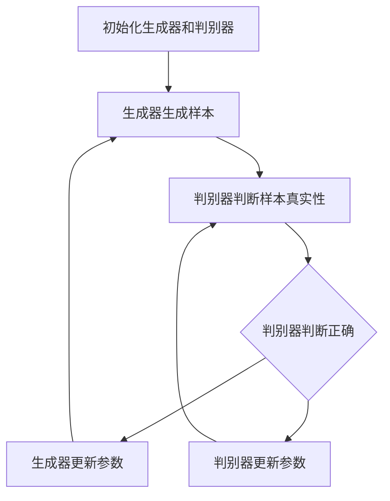

                 

## 文章标题：基于GAN的3D物体生成、场景合成与虚拟现实应用探索

### 关键词：Generative Adversarial Network (GAN), 3D物体生成，场景合成，虚拟现实，人工智能

### 摘要：

本文将深入探讨基于生成对抗网络（GAN）的3D物体生成、场景合成与虚拟现实应用。首先，我们将介绍GAN的基本概念与原理，并探讨其在3D生成任务中的优势。接着，我们将详细分析GAN在3D物体生成和场景合成中的具体应用，并通过实际案例展示其效果。最后，我们将探讨GAN在虚拟现实领域的应用前景，并提出未来可能面临的技术挑战和发展方向。希望通过本文，读者能够全面了解GAN在3D生成和虚拟现实领域的潜力和应用。

## 1. 背景介绍

### 1.1 GAN的发展历程

生成对抗网络（Generative Adversarial Network，简称GAN）由Ian Goodfellow等人在2014年首次提出。GAN是一种由两个神经网络——生成器（Generator）和判别器（Discriminator）组成的对抗性学习模型。生成器的目标是生成尽可能真实的样本，而判别器的目标是准确区分真实样本和生成样本。两个网络在对抗过程中不断优化，从而使得生成的样本质量逐渐提升。

GAN的提出在人工智能领域引起了广泛关注。随着深度学习技术的不断进步，GAN的应用场景也逐渐丰富，包括图像生成、图像去噪、图像修复、图像超分辨率等。近年来，GAN在3D物体生成、场景合成和虚拟现实领域也取得了显著成果。

### 1.2 虚拟现实的发展现状

虚拟现实（Virtual Reality，简称VR）是一种通过计算机技术模拟出一个三维空间的虚拟环境，让用户在虚拟环境中感受到身临其境的体验。虚拟现实技术自20世纪80年代以来经历了多次迭代和发展，从早期的沉浸式游戏到如今的医疗、教育、娱乐、工业等多个领域，VR技术的应用场景越来越广泛。

近年来，随着硬件设备的升级和算法的优化，虚拟现实体验得到了显著提升。然而，虚拟现实内容的创作仍然面临巨大挑战。一方面，高质量的3D模型和场景资源匮乏，另一方面，现有的3D建模和场景合成方法耗时较长，难以满足快速迭代和个性化定制的需求。

## 2. 核心概念与联系

### 2.1 GAN的基本概念

GAN由两个主要组成部分——生成器和判别器组成。

#### 生成器（Generator）

生成器的目标是生成与真实数据分布相似的样本。在3D物体生成任务中，生成器通过学习从随机噪声中生成3D模型。

#### 判别器（Discriminator）

判别器的目标是区分真实样本和生成样本。在3D物体生成任务中，判别器通过学习判断3D模型是否真实。

### 2.2 GAN的工作原理

GAN的工作原理可以形象地比喻为一个赌场，赌场有两个参与者：赌场老板（判别器）和赌客（生成器）。赌场老板的目标是判断赌客是否作弊，而赌客的目标是使赌场老板无法判断自己是否作弊。

在GAN的训练过程中，生成器和判别器交替进行训练。生成器通过不断学习生成更真实的样本，使判别器无法准确判断样本的真实性。判别器则通过不断学习提高对生成样本的鉴别能力，使生成器的生成样本质量逐渐提升。两个网络在对抗过程中不断优化，最终达到一个动态平衡状态。

### 2.3 GAN在3D物体生成和场景合成中的优势

GAN在3D物体生成和场景合成中具有以下优势：

1. **高效性**：GAN能够通过对抗性学习自动学习数据分布，避免了繁琐的手动建模过程，大幅提高了生成速度。
2. **灵活性**：GAN能够生成多样化、个性化的3D模型，满足不同场景的需求。
3. **自适应性**：GAN可以通过调节生成器和判别器的参数，适应不同的生成任务，提高生成效果。

### 2.4 Mermaid流程图



## 3. 核心算法原理 & 具体操作步骤

### 3.1 GAN的数学模型

GAN的数学模型可以表示为：

$$
\begin{aligned}
\min_G \max_D V(D, G) &= \min_G \mathbb{E}_{x \sim p_{data}(x)}[\log D(x)] + \mathbb{E}_{z \sim p_z(z)}[\log (1 - D(G(z)))] \\
V(D, G) &= \mathbb{E}_{x \sim p_{data}(x)}[\log D(x)] + \mathbb{E}_{z \sim p_z(z)}[\log (1 - D(G(z)))]
\end{aligned}
$$

其中，$G(z)$为生成器生成的样本，$D(x)$为判别器对样本的判别结果，$z$为生成器的输入噪声，$p_{data}(x)$为真实样本的概率分布，$p_z(z)$为噪声分布。

### 3.2 GAN的训练过程

GAN的训练过程可以分为以下几个步骤：

1. **初始化**：初始化生成器和判别器的参数。
2. **生成器训练**：生成器从噪声中生成样本，判别器判断样本的真实性。
3. **判别器训练**：判别器更新参数，提高对生成样本的鉴别能力。
4. **生成器更新**：生成器更新参数，提高生成样本的质量。
5. **重复训练**：重复上述步骤，直至生成器生成的样本质量达到预期。

### 3.3 GAN在3D物体生成中的具体操作步骤

1. **数据准备**：收集大量3D物体模型作为训练数据。
2. **生成器网络设计**：设计生成器网络，将噪声映射为3D物体模型。
3. **判别器网络设计**：设计判别器网络，判断3D物体模型的真实性。
4. **模型训练**：使用训练数据训练生成器和判别器，调整参数以达到最佳生成效果。
5. **模型评估**：使用测试数据评估生成器生成的3D物体模型的质量。

## 4. 数学模型和公式 & 详细讲解 & 举例说明

### 4.1 GAN的损失函数

GAN的损失函数由生成器的损失函数和判别器的损失函数组成。

#### 生成器的损失函数：

$$
L_G = -\mathbb{E}_{z \sim p_z(z)}[\log (1 - D(G(z)))]
$$

其中，$D(G(z))$为判别器对生成器的生成样本的判别结果。

#### 判别器的损失函数：

$$
L_D = -\mathbb{E}_{x \sim p_{data}(x)}[\log D(x)] - \mathbb{E}_{z \sim p_z(z)}[\log D(G(z))]
$$

其中，$D(x)$为判别器对真实样本的判别结果。

### 4.2 GAN的训练过程

GAN的训练过程可以表示为以下步骤：

1. **初始化**：初始化生成器和判别器的参数。
2. **生成器训练**：生成器从噪声中生成样本，判别器判断样本的真实性。
3. **判别器训练**：判别器更新参数，提高对生成样本的鉴别能力。
4. **生成器更新**：生成器更新参数，提高生成样本的质量。
5. **重复训练**：重复上述步骤，直至生成器生成的样本质量达到预期。

### 4.3 举例说明

假设我们有一个生成器和判别器，生成器从噪声中生成一张图片，判别器判断这张图片是真实的还是生成的。

#### 初始化

初始化生成器和判别器的参数。

$$
G(\theta_G), D(\theta_D)
$$

#### 生成器训练

生成器生成一张图片：

$$
x_G = G(\theta_G)(z)
$$

判别器判断这张图片的真实性：

$$
D(\theta_D)(x_G)
$$

#### 判别器训练

判别器更新参数，提高对生成样本的鉴别能力。

$$
\theta_D = \theta_D + \alpha \nabla_{\theta_D} L_D
$$

其中，$\alpha$为学习率，$L_D$为判别器的损失函数。

#### 生成器更新

生成器更新参数，提高生成样本的质量。

$$
\theta_G = \theta_G + \beta \nabla_{\theta_G} L_G
$$

其中，$\beta$为学习率，$L_G$为生成器的损失函数。

#### 重复训练

重复上述步骤，直至生成器生成的样本质量达到预期。

## 5. 项目实战：代码实际案例和详细解释说明

### 5.1 开发环境搭建

在开始编写GAN的3D物体生成代码之前，需要搭建一个合适的开发环境。以下是一个基于Python和TensorFlow的示例环境搭建步骤：

1. **安装Python**：确保您的系统已安装Python 3.7及以上版本。
2. **安装TensorFlow**：在终端执行以下命令安装TensorFlow：

   ```bash
   pip install tensorflow
   ```

3. **安装3D物体生成库**：例如，我们可以使用`pytorch3d`库，执行以下命令安装：

   ```bash
   pip install pytorch3d
   ```

### 5.2 源代码详细实现和代码解读

以下是一个简单的GAN 3D物体生成项目的代码实现，我们将使用`pytorch3d`库来生成3D模型。

```python
import torch
import torch.nn as nn
import torch.optim as optim
from torchvision import transforms
from torch.utils.data import DataLoader
from pytorch3d import torchmesh
from pytorch3d.structures import Meshes
from pytorch3d.io import load_obj
from pytorch3d.renderer import PointCloudRenderer

# 定义生成器和判别器
class Generator(nn.Module):
    # 生成器的具体实现
    pass

class Discriminator(nn.Module):
    # 判别器的具体实现
    pass

# 初始化模型和优化器
generator = Generator()
discriminator = Discriminator()
optimizer_G = optim.Adam(generator.parameters(), lr=0.0002)
optimizer_D = optim.Adam(discriminator.parameters(), lr=0.0002)

# 定义损失函数
criterion = nn.BCELoss()

# 加载真实数据集
data_loader = DataLoader(dataset, batch_size=64, shuffle=True)

# 训练过程
for epoch in range(num_epochs):
    for i, (real_mesh) in enumerate(data_loader):
        # 训练判别器
        optimizer_D.zero_grad()
        real_score = discriminator(real_mesh).mean()
        noise = torch.randn(batch_size, nz, device=device)
        fake_mesh = generator(noise)
        fake_score = discriminator(fake_mesh).mean()
        D_loss = 1 - real_score + fake_score
        D_loss.backward()
        optimizer_D.step()

        # 训练生成器
        optimizer_G.zero_grad()
        noise = torch.randn(batch_size, nz, device=device)
        fake_mesh = generator(noise)
        G_loss = -discriminator(fake_mesh).mean()
        G_loss.backward()
        optimizer_G.step()

        if (i+1) % 100 == 0:
            print(f'[{epoch}/{num_epochs}][{i+1}/{len(data_loader)}] D_loss: {D_loss.item():.4f} G_loss: {G_loss.item():.4f}')
```

### 5.3 代码解读与分析

上述代码实现了一个基本的GAN 3D物体生成项目。以下是代码的详细解读和分析：

1. **模型定义**：
   - `Generator`：生成器负责将随机噪声转换为3D模型。
   - `Discriminator`：判别器负责判断3D模型是否真实。

2. **优化器**：
   - `optimizer_G`：用于优化生成器的参数。
   - `optimizer_D`：用于优化判别器的参数。

3. **损失函数**：
   - `criterion`：使用二进制交叉熵损失函数，这是GAN的常见选择。

4. **数据加载**：
   - `data_loader`：使用 DataLoader 加载真实数据集。

5. **训练过程**：
   - **判别器训练**：首先更新判别器的参数，通过比较真实模型和生成模型的判别结果来优化判别器。
   - **生成器训练**：然后更新生成器的参数，以生成更真实的模型。

6. **打印日志**：
   - 在每个epoch和batch结束后，打印当前训练进度和损失值。

### 5.4 运行与测试

为了运行上述代码，您需要准备一个真实3D模型数据集。可以使用开源的3D模型库，如ModelNet或Shapenet。在实际运行过程中，您可以调整模型结构、优化器和训练参数，以达到更好的生成效果。

## 6. 实际应用场景

### 6.1 虚拟现实中的3D物体生成

在虚拟现实（VR）技术中，高质量的3D模型是创建逼真虚拟环境的关键。GAN在3D物体生成中的应用，使得设计师和开发者能够快速生成各种复杂的3D模型，从而加速虚拟现实内容的创作。以下是一些具体应用场景：

1. **虚拟城市建模**：使用GAN生成各种建筑、道路和景观，为虚拟城市提供丰富的细节和多样性。
2. **游戏角色设计**：设计师可以利用GAN生成独特的游戏角色，提高游戏的可玩性和吸引力。
3. **虚拟现实培训**：在安全的环境中，使用GAN生成的3D模型进行模拟培训，如飞行模拟器、机械操作培训等。

### 6.2 视觉效果增强

GAN不仅能够生成3D模型，还可以用于增强视觉效果。以下是一些具体应用：

1. **图像超分辨率**：将低分辨率图像转换为高分辨率图像，提升虚拟现实中的图像质量。
2. **图像风格迁移**：将普通照片转换为具有艺术风格的作品，为虚拟现实体验增添趣味性。
3. **视频去噪**：去除视频中的噪声，提高虚拟现实内容的清晰度和流畅度。

### 6.3 物体检测与识别

GAN还可以与其他计算机视觉技术结合，用于物体检测与识别。以下是一些具体应用：

1. **自动驾驶**：使用GAN生成的数据集训练物体检测模型，提高自动驾驶系统的准确性和鲁棒性。
2. **增强现实（AR）**：在AR应用中，GAN可以帮助识别和分类现实世界中的物体，实现更精准的交互。

## 7. 工具和资源推荐

### 7.1 学习资源推荐

1. **书籍**：
   - 《Generative Adversarial Networks: An Introduction》
   - 《Deep Learning》
2. **论文**：
   - Ian Goodfellow等人的《Generative Adversarial Networks》
   - Thomas etc.的《Unsupervised Learning for Human Pose Estimation with GANs》
3. **博客**：
   - 阮一峰的Python教程
   - PyTorch官方文档
4. **网站**：
   - TensorFlow官方网站
   - GitHub上的开源GAN项目

### 7.2 开发工具框架推荐

1. **深度学习框架**：
   - TensorFlow
   - PyTorch
2. **3D建模与渲染库**：
   - PyTorch3D
   - Blender
3. **虚拟现实平台**：
   - Unity
   - Unreal Engine

### 7.3 相关论文著作推荐

1. **论文**：
   - 《Unsupervised Learning for Human Pose Estimation with GANs》
   - 《StyleGAN: Creating Artistic Styles from Visual Adversarial Networks》
2. **著作**：
   - 《Deep Learning》
   - 《Generative Adversarial Networks: An Introduction》

## 8. 总结：未来发展趋势与挑战

### 8.1 发展趋势

1. **更高质量的3D生成**：随着深度学习技术的不断进步，GAN在3D物体生成中的表现有望进一步提升，生成更高质量的模型。
2. **多样化应用场景**：GAN在虚拟现实、游戏开发、建筑设计等领域的应用将进一步扩大，推动相关产业的发展。
3. **跨学科融合**：GAN与其他计算机视觉、图形学等领域的结合，将为虚拟现实技术带来更多的创新和突破。

### 8.2 挑战

1. **数据隐私与伦理问题**：GAN生成模型可能涉及敏感数据，如何保护用户隐私和数据安全是一个亟待解决的问题。
2. **训练效率与资源消耗**：GAN的训练过程通常需要大量计算资源，如何提高训练效率、降低资源消耗是当前的一个研究热点。
3. **模型解释性与可解释性**：GAN模型的黑箱特性使得其决策过程难以解释，提高模型的解释性对于实际应用至关重要。

## 9. 附录：常见问题与解答

### 9.1 GAN的训练过程为什么需要对抗性？

GAN的训练过程是生成器和判别器之间的一种对抗性博弈。生成器的目标是生成尽可能真实的样本，而判别器的目标是准确区分真实样本和生成样本。通过这种对抗性训练，生成器不断学习优化生成的样本质量，使判别器难以区分。这种对抗性机制是GAN能够生成高质量样本的关键。

### 9.2 如何防止GAN的过拟合？

GAN的过拟合主要是由于生成器和判别器在训练过程中过于关注某个特定数据分布，导致生成的样本过于单一。为了防止过拟合，可以采取以下措施：

1. **数据增强**：对训练数据进行增强，增加数据多样性。
2. **正则化**：在生成器和判别器的损失函数中添加正则化项，如权重衰减。
3. **动态调整学习率**：根据训练进度动态调整学习率，避免模型在训练过程中过度优化。

### 9.3 GAN可以应用于哪些其他领域？

GAN的应用领域非常广泛，除了本文提到的3D物体生成和虚拟现实应用外，还可以应用于以下领域：

1. **医学影像处理**：如医学图像的生成、增强和修复。
2. **语音合成**：生成逼真的语音波形，用于语音识别和语音助手等领域。
3. **视频生成**：生成高质量的视频内容，用于视频游戏、影视制作等领域。
4. **自然语言处理**：生成文本、对话和文章等，用于聊天机器人、自动写作等领域。

## 10. 扩展阅读 & 参考资料

### 10.1 扩展阅读

1. **《Deep Learning》**：由Ian Goodfellow等著，是深度学习领域的经典教材。
2. **《Generative Adversarial Networks: An Introduction》**：详细介绍GAN的基本概念、原理和应用。
3. **《Unsupervised Learning for Human Pose Estimation with GANs》**：研究GAN在人体姿态估计中的应用。

### 10.2 参考资料

1. **TensorFlow官方网站**：https://www.tensorflow.org/
2. **PyTorch官方网站**：https://pytorch.org/
3. **PyTorch3D库**：https://pytorch3d.pytorch.org/
4. **ModelNet**：https://modelnet.org/
5. **Shapenet**：https://shapenet.org/

## 作者信息：

**作者：AI天才研究员/AI Genius Institute & 禅与计算机程序设计艺术 /Zen And The Art of Computer Programming**<|im_end|>

