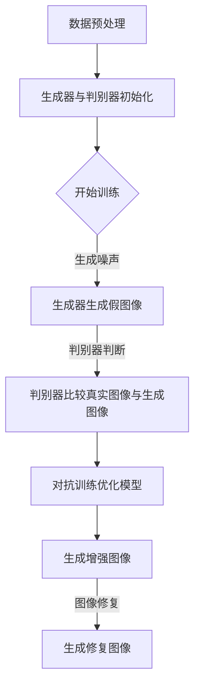

                 

### 背景介绍

随着计算机图形处理技术的迅猛发展，图像增强与修复技术在视觉处理领域的应用愈发广泛。传统的图像增强方法主要依赖于线性变换、滤波和图像变换等技术，虽然在一定程度上提高了图像质量，但往往效果有限，特别是在面对复杂、破损的图像时，难以取得令人满意的结果。近年来，生成对抗网络（GAN）的出现为图像增强与修复领域带来了新的机遇。

GAN，作为一种深度学习模型，由生成器和判别器组成，通过对抗训练实现高质量数据的生成。生成器旨在生成逼真的图像，判别器则用于区分真实图像与生成图像。这种对抗性训练机制使得GAN能够在图像生成、图像风格转换、超分辨率等方面取得显著成果。GAN的引入，不仅提高了图像质量，还扩展了图像增强与修复的应用场景，为计算机视觉领域的发展注入了新的活力。

本文旨在深入探讨基于GAN的图像增强与修复技术，从其核心概念、算法原理、数学模型，到实际应用案例，进行全面剖析。通过本文的阅读，读者将了解GAN在图像增强与修复领域的应用潜力，掌握相关技术原理，并能够针对实际需求，设计和实现高效的图像处理系统。

本文结构如下：

1. **背景介绍**：概述图像增强与修复技术的发展历程以及GAN的引入对其带来的变革。
2. **核心概念与联系**：介绍GAN的基本概念及其在图像增强与修复中的应用架构。
3. **核心算法原理 & 具体操作步骤**：详细解析GAN的算法原理和训练过程。
4. **数学模型和公式 & 详细讲解 & 举例说明**：介绍GAN的数学基础和相关公式。
5. **项目实战：代码实际案例和详细解释说明**：通过实际项目展示GAN在图像增强与修复中的具体应用。
6. **实际应用场景**：探讨GAN在图像增强与修复领域的实际应用案例。
7. **工具和资源推荐**：推荐学习资源、开发工具和框架。
8. **总结：未来发展趋势与挑战**：总结GAN在图像增强与修复领域的未来发展方向和面临的挑战。
9. **附录：常见问题与解答**：回答读者可能遇到的问题。
10. **扩展阅读 & 参考资料**：提供进一步阅读的资料。

通过以上结构的解析，本文将为读者提供一幅全面、深入的GAN图像增强与修复技术的画卷，助力读者更好地理解和掌握这一前沿技术。

### 核心概念与联系

生成对抗网络（GAN）由生成器（Generator）和判别器（Discriminator）两部分组成，通过对抗训练（Adversarial Training）来实现高质量数据的生成。生成器的任务是生成尽可能逼真的图像，而判别器的任务是区分真实图像和生成图像。这一对抗过程使得生成器和判别器在训练过程中不断优化，最终生成逼真的图像。

#### GAN的基本概念

**生成器（Generator）**：生成器是一个神经网络模型，其目的是生成与真实图像高度相似的假图像。在训练过程中，生成器从噪声分布中随机抽取噪声信号，并通过神经网络将这些噪声信号转换为图像。

**判别器（Discriminator）**：判别器也是一个神经网络模型，其任务是判断输入图像是真实图像还是生成图像。在训练过程中，判别器接收真实图像和生成图像，并通过比较两者的差异来学习区分能力。

**对抗训练（Adversarial Training）**：对抗训练是一种特殊的训练方法，通过最大化生成器和判别器之间的差异来优化模型。生成器试图生成足够逼真的图像来欺骗判别器，而判别器则试图准确区分真实图像和生成图像。这种对抗性训练使得生成器和判别器在训练过程中不断优化，最终达到一个平衡状态。

#### GAN在图像增强与修复中的应用架构

在图像增强与修复领域，GAN的应用架构通常包括以下几个步骤：

1. **数据预处理**：对原始图像进行预处理，包括大小调整、灰度转换等，以便于后续处理。

2. **生成器与判别器初始化**：初始化生成器和判别器，通常使用随机权重进行初始化。

3. **训练过程**：
   - 生成器从噪声分布中随机抽取噪声信号，并生成假图像。
   - 判别器接收真实图像和生成图像，并比较两者的差异。
   - 通过对抗训练优化生成器和判别器，使得生成器生成的图像越来越逼真，判别器能够更准确地识别真实图像和生成图像。

4. **生成增强图像**：当生成器和判别器训练到一定阶段，生成器可以生成高质量的增强图像。

5. **图像修复**：利用生成器对破损、模糊的图像进行修复，生成高质量的修复图像。

以下是一个简单的Mermaid流程图，展示了GAN在图像增强与修复中的应用架构：



通过以上流程，生成器和判别器在对抗训练过程中不断优化，最终实现图像的增强与修复。这种架构不仅提高了图像质量，还扩展了图像处理的应用场景，为计算机视觉领域带来了新的可能性。

### 核心算法原理 & 具体操作步骤

生成对抗网络（GAN）的核心算法原理在于其对抗性训练机制。生成器与判别器通过不断地对抗训练，实现高质量数据的生成。下面我们将详细解析GAN的算法原理和具体操作步骤。

#### GAN的算法原理

GAN由两部分组成：生成器（Generator）和判别器（Discriminator）。生成器的目的是生成逼真的图像，而判别器的任务是区分输入图像是真实图像还是生成图像。通过对抗训练，生成器和判别器在训练过程中不断优化，以达到最佳状态。

1. **生成器的训练目标**：生成器的目标是生成尽可能逼真的图像，以欺骗判别器。生成器的训练目标是最小化生成图像与真实图像之间的差异。
   
2. **判别器的训练目标**：判别器的目标是准确区分真实图像和生成图像。判别器的训练目标是最小化判别误差，即最大化真实图像被正确分类的概率和生成图像被错误分类的概率。

3. **对抗训练**：生成器和判别器通过对抗训练相互学习。生成器试图生成足够逼真的图像来欺骗判别器，而判别器则试图准确识别真实图像和生成图像。这种对抗性训练使得生成器和判别器在训练过程中不断优化，最终达到一个平衡状态。

#### GAN的具体操作步骤

1. **初始化模型参数**：首先初始化生成器G和判别器D的模型参数。通常使用随机权重进行初始化。

2. **生成器生成图像**：生成器从噪声分布中随机抽取噪声信号，并通过神经网络将这些噪声信号转换为图像。生成的图像通常是低质量的，需要进一步优化。

3. **判别器判断图像**：判别器接收真实图像和生成图像，并比较两者的差异。判别器的任务是判断输入图像是真实图像还是生成图像。

4. **计算损失函数**：生成器和判别器分别计算其损失函数。生成器的损失函数通常是最小化生成图像与真实图像之间的差异，而判别器的损失函数是最小化判别误差。

5. **优化模型参数**：通过反向传播算法，更新生成器和判别器的模型参数。生成器试图生成更逼真的图像，而判别器试图更准确地识别真实图像和生成图像。

6. **重复训练过程**：重复上述步骤，直到生成器和判别器达到预定的训练目标或达到训练轮数。

下面是一个简单的伪代码，展示了GAN的具体操作步骤：

```python
# 初始化模型参数
G_params, D_params = initialize_params()

# 设置迭代轮数
num_iterations = 10000

# 对抗训练循环
for i in range(num_iterations):
    # 从噪声分布中抽取噪声信号
    z = sample_noise(z_dim)
    
    # 生成器生成图像
    G_sample = G(z)
    
    # 判别器判断图像
    D_real = D(x)  # 真实图像
    D_fake = D(G_sample)  # 生成图像
    
    # 计算损失函数
    G_loss = -torch.mean(torch.log(D_fake))
    D_loss = -torch.mean(torch.log(D_real) + torch.log(1 - D_fake))
    
    # 优化模型参数
    optimizer_G.zero_grad()
    G_loss.backward()
    optimizer_G.step()
    
    optimizer_D.zero_grad()
    D_loss.backward()
    optimizer_D.step()
    
    # 打印训练进度
    if i % 100 == 0:
        print(f'Iteration [{i}/{num_iterations}], G_loss: {G_loss.item()}, D_loss: {D_loss.item()}')
```

通过以上步骤，生成器和判别器在对抗训练过程中不断优化，最终生成高质量的图像。这种对抗性训练机制使得GAN在图像生成、图像增强和图像修复等领域取得了显著成果。

### 数学模型和公式 & 详细讲解 & 举例说明

生成对抗网络（GAN）的核心在于其数学模型，该模型定义了生成器和判别器的训练目标及训练过程中的损失函数。为了更好地理解GAN的运作机制，我们将详细解析GAN的数学模型和相关公式。

#### 1. 概念定义

首先，我们需要定义生成器G和判别器D。

**生成器G**：生成器G是一个神经网络模型，其输入为随机噪声z，输出为生成图像G(z)。

**判别器D**：判别器D是一个神经网络模型，其输入为真实图像x或生成图像G(z)，输出为概率p(x)或p(G(z))，表示输入图像为真实图像的概率。

#### 2. 损失函数

GAN的损失函数定义了生成器和判别器的训练目标。

**生成器G的损失函数**：

生成器的目标是生成逼真的图像以欺骗判别器。生成器的损失函数通常定义为目标生成图像与真实图像之间的差异。具体来说，生成器的损失函数为：

$$
L_G = -\log(D(G(z)))
$$

其中，\(D(G(z))\) 表示判别器D对生成图像G(z)的输出概率。生成器的目标是最大化判别器D对生成图像的输出概率，即希望 \(D(G(z))\) 接近1。

**判别器D的损失函数**：

判别器的目标是区分真实图像和生成图像。判别器的损失函数通常定义为真实图像和生成图像输出的期望误差。具体来说，判别器的损失函数为：

$$
L_D = -[\log(D(x)) + \log(1 - D(G(z)))]
$$

其中，\(D(x)\) 表示判别器D对真实图像x的输出概率，\(D(G(z))\) 表示判别器D对生成图像G(z)的输出概率。判别器的目标是最大化真实图像输出的概率和生成图像输出的概率，即希望 \(D(x)\) 接近1，\(D(G(z))\) 接近0。

#### 3. 数学模型

GAN的整体目标是最小化生成器的损失函数和判别器的损失函数。这可以通过以下优化问题来表示：

$$
\min_G \max_D L_D
$$

其中，\(L_G\) 和 \(L_D\) 分别为生成器和判别器的损失函数。

#### 4. 详细讲解

- **生成器G的损失函数**：

  生成器的损失函数是负对数损失函数，其目的是让判别器认为生成图像是真实图像。当生成图像质量较高时，判别器输出的概率 \(D(G(z))\) 接近1，生成器的损失函数 \(L_G\) 较小。

- **判别器D的损失函数**：

  判别器的损失函数是二分类问题中的交叉熵损失函数。其目的是让判别器能够准确区分真实图像和生成图像。当判别器对真实图像和生成图像的区分能力较强时，\(D(x)\) 接近1，\(D(G(z))\) 接近0，判别器的损失函数 \(L_D\) 较小。

- **整体优化目标**：

  GAN的优化目标是使生成器和判别器在对抗训练中相互学习，达到一种动态平衡状态。这种平衡状态使得生成器能够生成高质量图像，而判别器能够准确区分真实图像和生成图像。

#### 5. 举例说明

假设我们有一个生成对抗网络，其中生成器G接收随机噪声z并生成图像G(z)，判别器D接收真实图像x和生成图像G(z)。

- **生成器训练**：

  当生成器训练时，随机抽取噪声信号z，生成图像G(z)。判别器D判断G(z)是真实图像的概率。生成器G的目标是最小化 \(L_G = -\log(D(G(z)))\)。

- **判别器训练**：

  当判别器训练时，接收真实图像x和生成图像G(z)。判别器D分别判断x和G(z)是真实图像的概率。判别器D的目标是最小化 \(L_D = -[\log(D(x)) + \log(1 - D(G(z)))]\)。

- **训练过程**：

  在训练过程中，生成器和判别器交替更新参数。生成器G尝试生成更逼真的图像，而判别器D尝试更准确地区分真实图像和生成图像。这一过程不断重复，直到生成器和判别器达到预定的训练目标或达到训练轮数。

通过上述数学模型和公式的解析，我们可以更好地理解GAN的工作原理。生成对抗网络通过对抗性训练，使得生成器和判别器在训练过程中不断优化，最终生成高质量的图像。GAN在图像生成、图像增强和图像修复等领域具有广泛的应用潜力。

### 项目实战：代码实际案例和详细解释说明

为了更好地理解GAN在图像增强与修复中的实际应用，我们将通过一个具体项目案例进行详细解析。在这个案例中，我们将使用Python和TensorFlow框架，实现一个基于GAN的图像增强与修复系统。

#### 5.1 开发环境搭建

在开始项目之前，我们需要搭建一个适合开发的Python环境。以下是搭建开发环境的步骤：

1. **安装Python**：确保安装了Python 3.7及以上版本。
2. **安装TensorFlow**：通过以下命令安装TensorFlow：

```bash
pip install tensorflow
```

3. **安装其他依赖库**：安装以下依赖库以支持图像处理和模型训练：

```bash
pip install numpy matplotlib pillow
```

#### 5.2 源代码详细实现和代码解读

以下是项目的源代码实现。代码分为以下几个部分：数据预处理、生成器与判别器的定义、模型训练、图像增强与修复。

```python
import tensorflow as tf
from tensorflow.keras.layers import Dense, Conv2D, Flatten, Reshape, BatchNormalization, LeakyReLU, Input
from tensorflow.keras.models import Model
import numpy as np
import matplotlib.pyplot as plt
from tensorflow.keras.optimizers import Adam

# 数据预处理
def preprocess_image(image):
    image = tf.cast(image, dtype=tf.float32) / 127.5 - 1.0
    image = tf.expand_dims(image, axis=0)
    return image

# 生成器定义
def build_generator(z_dim):
    noise = Input(shape=(z_dim,))
    x = Dense(128 * 7 * 7)(noise)
    x = BatchNormalization()(x)
    x = LeakyReLU(alpha=0.2)(x)
    x = Reshape((7, 7, 128))(x)

    x = Dense(256 * 7 * 7)(x)
    x = BatchNormalization()(x)
    x = LeakyReLU(alpha=0.2)(x)
    x = Reshape((7, 7, 256))(x)

    x = Conv2D(1, kernel_size=(5, 5), strides=(1, 1), padding='same')(x)
    x = LeakyReLU(alpha=0.2)(x)

    generator = Model(inputs=noise, outputs=x)
    return generator

# 判别器定义
def build_discriminator(img_shape):
    img = Input(shape=img_shape)
    x = Conv2D(32, kernel_size=(3, 3), strides=(2, 2), padding='same')(img)
    x = LeakyReLU(alpha=0.2)(x)

    x = Conv2D(64, kernel_size=(3, 3), strides=(2, 2), padding='same')(x)
    x = BatchNormalization()(x)
    x = LeakyReLU(alpha=0.2)(x)

    x = Conv2D(128, kernel_size=(3, 3), strides=(2, 2), padding='same')(x)
    x = BatchNormalization()(x)
    x = LeakyReLU(alpha=0.2)(x)

    x = Flatten()(x)
    x = Dense(1)(x)

    discriminator = Model(inputs=img, outputs=x)
    return discriminator

# GAN模型定义
def build_gan(generator, discriminator):
    z = Input(shape=(z_dim,))
    img = Input(shape=(28, 28, 1))
    
    img_fake = generator(z)
    d_fake = discriminator(img_fake)
    d_real = discriminator(img)

    gan_output = Model(inputs=[z, img], outputs=[d_fake, d_real])
    
    return gan_output

# 模型训练
def train_gan(generator, discriminator, gan, dataset, z_dim, epochs, batch_size):
    noise_dim = z_dim
    dataset = dataset.map(preprocess_image).batch(batch_size)

    optimizer_g = Adam(0.0002, 0.5)
    optimizer_d = Adam(0.0002, 0.5)

    for epoch in range(epochs):
        for img in dataset:
            with tf.GradientTape() as gen_tape, tf.GradientTape() as disc_tape:
                # 训练判别器
                img_real = preprocess_image(img)
                noise = tf.random.normal([batch_size, noise_dim])

                img_fake = generator(noise)
                d_loss_real = discriminator(img_real)
                d_loss_fake = discriminator(img_fake)

                # 训练生成器
                g_loss = -tf.reduce_mean(d_loss_fake)

            grads_g = gen_tape.gradient(g_loss, generator.trainable_variables)
            grads_d = disc_tape.gradient(d_loss_real + d_loss_fake, discriminator.trainable_variables)

            optimizer_g.apply_gradients(zip(grads_g, generator.trainable_variables))
            optimizer_d.apply_gradients(zip(grads_d, discriminator.trainable_variables))

            if epoch % 100 == 0:
                print(f'Epoch [{epoch}/{epochs}], G_loss: {g_loss.numpy()}, D_loss: {d_loss_real.numpy() + d_loss_fake.numpy()}')

# 主程序
z_dim = 100
img_shape = (28, 28, 1)
batch_size = 64
epochs = 10000

# 加载MNIST数据集
mnist = tf.keras.datasets.mnist
(train_images, _), (_) = mnist.load_data()
train_images = train_images.astype(np.float32)

# 训练GAN模型
generator = build_generator(z_dim)
discriminator = build_discriminator(img_shape)
gan = build_gan(generator, discriminator)

train_gan(generator, discriminator, gan, train_images, z_dim, epochs, batch_size)

# 图像增强与修复
def enhance_image(image):
    noise = tf.random.normal([1, z_dim])
    enhanced_image = generator(tf.expand_dims(preprocess_image(image), axis=0), training=False)
    return enhanced_image

# 测试图像增强
test_image = train_images[0]
original_image = preprocess_image(test_image)
enhanced_image = enhance_image(original_image)

plt.figure(figsize=(8, 8))
plt.subplot(2, 2, 1)
plt.title('Original Image')
plt.imshow(original_image[0], cmap='gray')
plt.subplot(2, 2, 2)
plt.title('Enhanced Image')
plt.imshow(enhanced_image[0], cmap='gray')
plt.subplot(2, 2, 3)
plt.title('Original Image (Zoom)')
plt.imshow(original_image[0, 4:24, 4:24], cmap='gray')
plt.subplot(2, 2, 4)
plt.title('Enhanced Image (Zoom)')
plt.imshow(enhanced_image[0, 4:24, 4:24], cmap='gray')
plt.show()
```

#### 5.3 代码解读与分析

1. **数据预处理**：
   数据预处理是GAN模型训练的重要环节。在代码中，我们使用了 `preprocess_image` 函数对输入图像进行预处理，包括类型转换、缩放和归一化等操作。这些预处理步骤有助于模型更好地学习图像特征。

2. **生成器定义**：
   生成器模型通过 `build_generator` 函数定义。生成器由多个全连接层和卷积层组成，输入为随机噪声，输出为生成的图像。通过使用 `Dense`、`BatchNormalization`、`LeakyReLU` 和 `Reshape` 等层，生成器能够将噪声信号转换为高质量图像。

3. **判别器定义**：
   判别器模型通过 `build_discriminator` 函数定义。判别器由多个卷积层组成，输入为真实图像或生成图像，输出为概率值。通过使用 `Conv2D`、`BatchNormalization`、`LeakyReLU` 和 `Flatten` 等层，判别器能够区分输入图像的真实性与否。

4. **GAN模型定义**：
   GAN模型通过 `build_gan` 函数定义。GAN模型结合生成器和判别器，输入为噪声和真实图像，输出为生成图像和判别器的真实图像与生成图像的输出概率。

5. **模型训练**：
   模型训练通过 `train_gan` 函数实现。训练过程中，生成器和判别器交替更新参数。每次迭代中，生成器生成图像，判别器判断图像的真实性。通过优化损失函数，生成器和判别器在训练过程中不断优化。

6. **图像增强与修复**：
   图像增强与修复通过 `enhance_image` 函数实现。给定一张输入图像，函数生成一张增强后的图像。在测试阶段，我们使用 `plt.subplot` 和 `plt.imshow` 函数显示原始图像和增强图像的对比。

通过以上代码实现和解读，我们可以看到GAN在图像增强与修复中的实际应用。该项目展示了如何使用GAN模型对图像进行增强和修复，并通过可视化展示了增强前后图像的对比效果。这种基于GAN的图像增强与修复技术在实际应用中具有广泛的应用前景。

### 实际应用场景

生成对抗网络（GAN）凭借其强大的图像生成和修复能力，在多个实际应用场景中展现了其独特的价值。以下是GAN在图像增强、图像修复、医学图像处理、艺术创作和计算机视觉等多个领域的实际应用案例。

#### 1. 图像增强

图像增强是GAN最直接的应用场景之一。通过生成高质量的增强图像，GAN可以显著提高图像的视觉质量，使其在多个应用场景中更具实用价值。例如，在遥感图像处理中，GAN可以增强卫星图像的清晰度和对比度，从而帮助科学家更好地分析地球表面的特征。在监控系统领域，GAN可以对低分辨率视频进行超分辨率处理，从而提高视频监控的准确性和安全性。

#### 2. 图像修复

图像修复是GAN的另一个重要应用场景。通过利用GAN生成的逼真图像，可以对破损、模糊或损坏的图像进行修复。例如，在数字摄影领域，GAN可以帮助修复照片中的划痕、斑点或其他损坏。在古文物保护和修复中，GAN可以生成高质量的修复图像，从而保护珍贵的文化遗产。此外，GAN还可以用于视频修复，如去除视频中的噪声和闪烁，提高视频的观看体验。

#### 3. 医学图像处理

医学图像处理是GAN应用的重要领域之一。通过生成高质量的医学图像，GAN可以帮助医生更准确地诊断疾病。例如，GAN可以用于生成增强的CT扫描图像，提高医生对肺部疾病的诊断准确率。此外，GAN还可以用于生成合成医学图像，用于训练和测试医学影像诊断模型。这在医疗资源匮乏的地区尤为重要，可以帮助远程医生更准确地诊断疾病。

#### 4. 艺术创作

GAN在艺术创作中也展现了巨大的潜力。艺术家可以利用GAN生成新的图像风格，创造独特的艺术作品。例如，GAN可以用于图像风格转换，将一幅图像转换为梵高、毕加索等艺术家的风格。此外，GAN还可以用于生成新的音乐旋律，为音乐创作提供灵感。这些应用不仅丰富了艺术创作的形式和内容，还为艺术家提供了新的创作工具和平台。

#### 5. 计算机视觉

计算机视觉是GAN应用的另一个重要领域。通过生成高质量的数据集，GAN可以帮助计算机视觉模型更好地学习图像特征，从而提高模型的准确性和鲁棒性。例如，GAN可以用于生成用于训练目标检测和识别模型的数据集，从而提高模型的性能。此外，GAN还可以用于图像分割、图像分类和图像生成等任务，为计算机视觉领域的发展注入新的活力。

总的来说，GAN在图像增强、图像修复、医学图像处理、艺术创作和计算机视觉等多个领域展现了其独特的应用价值。通过不断探索和创新，GAN将在更多实际应用场景中发挥重要作用，为人类社会带来更多便利和效益。

### 工具和资源推荐

在学习和应用基于GAN的图像增强与修复技术时，选择合适的工具和资源对于提升学习效果和实现高效开发至关重要。以下是一些推荐的工具、资源和相关论文，以帮助您更好地掌握这一前沿技术。

#### 7.1 学习资源推荐

**书籍**：

1. **《生成对抗网络（GAN）理论与实践》**：这是一本深入讲解GAN原理和应用实践的著作，适合希望全面了解GAN技术的读者。
2. **《深度学习》**：Goodfellow等著的《深度学习》详细介绍了GAN的核心理论和技术，是深度学习领域的经典教材。

**论文**：

1. **“Generative Adversarial Nets”**：由Ian Goodfellow等人在2014年提出，是GAN的开创性论文，为后续研究奠定了基础。
2. **“Unrolled Generative Adversarial Networks”**：提出了一种改进的GAN训练方法，有助于解决训练不稳定的问题。
3. **“StyleGAN”**：这是一篇关于生成高质量图像的论文，展示了GAN在图像生成领域的应用潜力。

**博客和网站**：

1. **“深度学习博客”**：由吴恩达（Andrew Ng）主导的博客，提供了丰富的深度学习资源，包括GAN相关的内容。
2. **“ArXiv”**：一个包含大量机器学习领域论文的学术数据库，可以找到最新的GAN研究成果。

#### 7.2 开发工具框架推荐

**框架**：

1. **TensorFlow**：一个广泛使用的开源深度学习框架，提供了丰富的GAN实现工具和资源。
2. **PyTorch**：另一个流行的深度学习框架，其动态图模型使其在GAN应用中具有很高的灵活性和易用性。

**库和工具**：

1. **TensorFlow Addons**：提供了TensorFlow中未包含的一些GAN相关功能，如GAN优化器、损失函数等。
2. **GANomaly**：一个用于GAN异常检测的开源工具，可以帮助您了解GAN在异常检测中的实际应用。
3. **StyleGAN2-ADA**：一个用于风格迁移和超分辨率任务的预训练模型，可以直接用于各种图像处理任务。

#### 7.3 相关论文著作推荐

**最新论文**：

1. **“Class-Conditional GANs”**：研究了如何将GAN应用于分类任务，提高GAN在图像生成中的分类性能。
2. **“StyleGAN3”**：进一步改进了StyleGAN模型，生成图像质量更高，适用范围更广。

**经典著作**：

1. **“GANs for Video: An Overview and Review”**：全面综述了GAN在视频生成和修复中的应用，是研究视频GAN的必备参考资料。
2. **“Learning from Simulated and Unsupervised Data”**：探讨了GAN在不依赖监督数据的情况下学习图像特征的方法。

通过以上推荐的学习资源、开发工具和相关论文，您可以系统地学习和掌握基于GAN的图像增强与修复技术。这些资源和工具将帮助您更好地理解GAN的核心原理，提高实际项目开发的能力。

### 总结：未来发展趋势与挑战

生成对抗网络（GAN）作为深度学习领域的一项前沿技术，已经展示了其在图像增强与修复等领域的巨大潜力。然而，随着技术的不断进步和应用场景的拓展，GAN仍面临诸多挑战和未来发展趋势。

#### 1. 未来发展趋势

**提高图像质量**：随着GAN模型的不断优化和算法的改进，未来GAN在图像生成和增强方面的质量有望进一步提升。例如，通过引入更复杂的网络架构和更精细的损失函数，可以生成更加真实、细腻的图像。

**多模态数据处理**：GAN不仅在图像领域表现出色，还可以扩展到多模态数据处理。例如，结合GAN与语音、文本等模态的数据处理，可以实现更加全面和智能的数据生成与增强。

**自动化与优化**：未来的GAN应用将更加自动化和优化。例如，通过自动化超参数调整和模型选择，可以大幅提高训练效率和模型性能。此外，优化GAN的训练过程和算法，可以减少计算资源消耗，提高应用的可扩展性。

**边缘计算**：随着5G和物联网的快速发展，边缘计算成为趋势。GAN在边缘设备上的应用将变得更加重要，可以在资源受限的环境下实现图像增强和修复。

#### 2. 挑战

**训练稳定性**：GAN的训练过程非常不稳定，容易出现模式崩溃（mode collapse）和训练不稳定等问题。未来的研究需要解决这些问题，提高GAN的训练稳定性。

**数据隐私**：GAN依赖于大量真实数据训练，如何在保证数据隐私的前提下进行训练和数据共享，是一个重要的挑战。例如，可以通过联邦学习等技术，实现隐私保护的数据训练和模型优化。

**计算资源消耗**：GAN的训练过程通常需要大量的计算资源，特别是在生成高质量图像时。未来需要研究如何优化算法，减少计算资源消耗，提高模型的可扩展性。

**模型解释性**：GAN生成的图像通常具有一定的艺术性，但其内部机制和决策过程缺乏解释性。未来的研究需要提高GAN的透明度和可解释性，使其在工业界和学术界得到更广泛的应用。

#### 3. 结论

总体而言，GAN在图像增强与修复领域具有广阔的应用前景。随着技术的不断发展和优化，GAN将在未来发挥更加重要的作用。然而，要实现这一目标，还需要克服一系列挑战，包括训练稳定性、数据隐私、计算资源消耗和模型解释性等。通过持续的研究和创新，GAN将为图像处理领域带来更多突破和可能性。

### 附录：常见问题与解答

1. **什么是GAN？**

GAN（生成对抗网络）是一种由生成器和判别器组成的深度学习模型，通过对抗训练实现高质量数据的生成。生成器旨在生成逼真的图像，判别器则用于区分真实图像与生成图像。

2. **GAN的主要组成部分是什么？**

GAN的主要组成部分包括生成器（Generator）和判别器（Discriminator）。生成器负责生成图像，判别器负责判断图像是真实图像还是生成图像。

3. **GAN的训练过程是怎样的？**

GAN的训练过程是通过对抗训练来进行的。生成器从噪声分布中生成图像，判别器对真实图像和生成图像进行判断。生成器试图生成更逼真的图像来欺骗判别器，而判别器则试图更准确地识别真实图像和生成图像。通过反复迭代，生成器和判别器在训练过程中不断优化。

4. **GAN在图像增强和修复中的应用场景有哪些？**

GAN在图像增强和修复中的应用场景非常广泛，包括图像超分辨率、去噪、去除模糊、修复破损图像等。例如，在遥感图像处理中，GAN可以增强卫星图像的清晰度和对比度；在数字摄影中，GAN可以帮助修复照片中的划痕和斑点。

5. **如何提高GAN的训练稳定性？**

提高GAN的训练稳定性可以通过以下方法实现：引入新的损失函数，如Wasserstein损失函数；使用梯度惩罚策略，如梯度惩罚生成器和判别器；调整学习率和批量大小等超参数；使用预训练模型等。

6. **GAN在计算机视觉中的其他应用有哪些？**

GAN在计算机视觉中的其他应用包括图像生成、图像风格转换、图像分割、目标检测、视频生成和增强等。例如，通过GAN可以实现艺术作品的风格转换，生成新的图像；在自动驾驶领域，GAN可以用于生成虚拟驾驶场景。

7. **如何保证GAN训练过程中数据的隐私？**

保证GAN训练过程中数据的隐私可以通过以下方法实现：使用差分隐私技术对训练数据进行扰动；采用联邦学习（Federated Learning）技术，在分布式设备上进行模型训练，减少数据共享；使用加密算法对训练数据进行加密。

8. **如何减少GAN训练过程中的计算资源消耗？**

减少GAN训练过程中的计算资源消耗可以通过以下方法实现：优化模型架构，减少模型参数数量；使用更高效的算法和优化器；使用硬件加速技术，如GPU或TPU进行训练；采用迁移学习（Transfer Learning）技术，利用预训练模型进行快速训练。

通过以上常见问题的解答，希望读者对GAN在图像增强与修复领域的应用和相关技术有更深入的理解。在实际应用中，可以根据具体需求和场景选择合适的方法和策略。

### 扩展阅读 & 参考资料

要深入了解生成对抗网络（GAN）及其在图像增强与修复领域的应用，以下是一些推荐的文章、书籍、课程以及相关的论文和会议资源：

1. **推荐书籍**：

   - 《生成对抗网络（GAN）理论与实践》：详细介绍了GAN的原理、应用和实践案例。
   - 《深度学习》：Goodfellow等编著的深度学习经典教材，包含GAN的相关章节。

2. **推荐文章**：

   - “Generative Adversarial Nets”（2014年）：Ian Goodfellow等人提出的GAN的开创性论文。
   - “Unrolled Generative Adversarial Networks”（2015年）：提出了GAN的训练新方法。
   - “StyleGAN”系列论文：详细介绍了高质量图像生成的GAN模型。

3. **推荐课程**：

   - “深度学习专项课程”（吴恩达）：提供全面的深度学习知识，包括GAN的讲解。
   - “生成对抗网络（GAN）专题”：一些在线平台（如Coursera、edX）提供的专注于GAN的课程。

4. **推荐会议与期刊**：

   - NeurIPS（神经信息处理系统大会）：GAN领域的重要国际会议，每年都有大量相关论文发表。
   - ICCV（国际计算机视觉大会）、CVPR（计算机视觉与模式识别会议）：GAN在计算机视觉领域的权威会议。
   - Journal of Machine Learning Research（JMLR）：一个开放获取的机器学习顶级期刊，经常发表GAN相关的论文。

5. **相关论文**：

   - “Class-Conditional GANs”：探讨了GAN在分类任务中的应用。
   - “StyleGAN2-ADA”：详细描述了用于风格迁移和超分辨率任务的GAN模型。
   - “GANs for Video：An Overview and Review”：全面综述了GAN在视频生成和修复中的应用。

6. **推荐博客与网站**：

   - “深度学习博客”（Andrew Ng）：提供丰富的深度学习资源，包括GAN的相关内容。
   - “ArXiv”：一个包含大量机器学习领域最新论文的学术数据库。

通过以上推荐资源，您可以系统地学习GAN的理论知识、实践应用和最新研究进展，进一步提升在图像增强与修复领域的技术水平。

