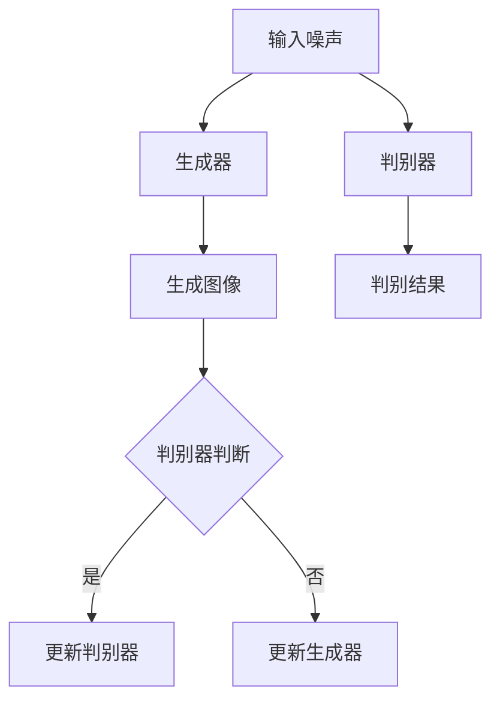

                 

### 文章标题

《基于GAN的图像增强与图像修复技术创新与应用场景分析》

#### 关键词：图像增强、图像修复、GAN、生成对抗网络、人工智能、深度学习、应用场景

#### 摘要：

本文旨在探讨基于生成对抗网络（GAN）的图像增强与图像修复技术的创新与应用。首先，我们将回顾图像增强与图像修复的背景和发展历程。随后，深入分析GAN的基本原理及其在图像增强与修复中的应用。本文将通过具体案例，详细讲解GAN在图像增强与修复中的实际操作步骤，并探讨其数学模型和公式。最后，我们将讨论GAN技术在图像增强与修复领域的实际应用场景，推荐相关工具和资源，并总结未来的发展趋势与挑战。

### 1. 背景介绍

#### 图像增强与图像修复的定义

图像增强（Image Enhancement）是指通过改进图像的视觉效果，使其更符合人类视觉系统的需求，从而提升图像的质量和可读性。其主要目标是改善图像的对比度、清晰度、亮度等视觉属性。

图像修复（Image Restoration）是指对受损、模糊或噪声图像进行恢复，使其尽可能恢复到原始状态。图像修复技术广泛应用于历史文物修复、医疗影像处理等领域，具有极高的社会和经济价值。

#### 图像增强与图像修复的发展历程

图像增强与图像修复技术的研究始于20世纪中期。早期的研究主要集中在传统的图像处理方法，如滤波器设计、直方图均衡化等。随着计算机科学和数字图像处理技术的快速发展，图像增强与修复方法逐渐向自动化和智能化方向发展。

#### GAN技术的引入

生成对抗网络（Generative Adversarial Network，GAN）由Ian Goodfellow等人于2014年提出。GAN是一种深度学习模型，由生成器和判别器两个网络构成。生成器的目标是生成逼真的图像，判别器的目标是区分生成图像和真实图像。在训练过程中，生成器和判别器相互对抗，不断优化自身性能，最终达到较好的图像生成效果。

GAN技术的出现，为图像增强与图像修复领域带来了新的突破。与传统的图像处理方法相比，GAN能够学习图像的高层次特征，生成更真实、更自然的图像。

### 2. 核心概念与联系

#### GAN基本原理

GAN由生成器（Generator）和判别器（Discriminator）两个主要部分组成。生成器的任务是生成伪造的图像，判别器的任务是判断输入图像是真实图像还是生成图像。在训练过程中，生成器和判别器相互对抗，生成器的目标是使判别器无法区分真实图像和生成图像，而判别器的目标是不断提高对真实图像和生成图像的辨别能力。

#### GAN架构



1. 初始化生成器和判别器的权重。
2. 生成器生成伪造的图像。
3. 将伪造图像和真实图像输入判别器。
4. 判别器输出判别结果。
5. 根据判别结果，更新生成器和判别器的权重。

#### GAN在图像增强与修复中的应用

GAN在图像增强与修复中的应用，主要体现在以下两个方面：

1. 图像增强：GAN能够学习图像的高层次特征，通过生成器生成更清晰、更逼真的图像。例如，在图像去噪、图像超分辨率、图像色彩增强等方面，GAN表现出色。

2. 图像修复：GAN能够恢复图像中的缺失部分，生成与原始图像高度相似的图像。例如，在图像去模糊、图像去撕裂、图像补全等方面，GAN具有广泛的应用前景。

### 3. 核心算法原理 & 具体操作步骤

#### GAN算法原理

GAN算法的核心思想是利用生成器和判别器的对抗训练，生成逼真的图像。

1. **生成器（Generator）**：生成器接收随机噪声作为输入，通过神经网络生成伪造的图像。生成器的目标是使判别器无法区分生成的图像和真实图像。

2. **判别器（Discriminator）**：判别器接收真实的图像和伪造的图像作为输入，判断输入图像是真实图像还是伪造图像。判别器的目标是提高对真实图像和伪造图像的辨别能力。

3. **对抗训练**：生成器和判别器在训练过程中相互对抗。生成器的目标是使判别器无法区分生成的图像和真实图像，判别器的目标是不断提高对真实图像和伪造图像的辨别能力。通过这种对抗训练，生成器逐渐学会生成更逼真的图像，判别器逐渐学会更好地辨别真实图像和伪造图像。

#### GAN在图像增强与修复中的具体操作步骤

1. **数据准备**：收集大量的真实图像数据，用于训练生成器和判别器。真实图像数据包括清晰、模糊、受损等不同类型的图像。

2. **生成器训练**：生成器接收随机噪声作为输入，通过神经网络生成伪造的图像。生成器的目标是使判别器无法区分生成的图像和真实图像。在训练过程中，生成器的损失函数通常采用生成对抗损失（GAN Loss）。

3. **判别器训练**：判别器接收真实的图像和伪造的图像作为输入，判断输入图像是真实图像还是伪造图像。判别器的目标是提高对真实图像和伪造图像的辨别能力。在训练过程中，判别器的损失函数通常采用二元交叉熵损失（Binary Cross-Entropy Loss）。

4. **生成图像**：在生成器和判别器训练完成后，使用生成器生成伪造的图像。伪造的图像可以用于图像增强或图像修复。

5. **图像增强**：将真实的图像和伪造的图像进行对比，提取伪造图像中的高质量特征，应用于真实的图像，从而实现图像增强。

6. **图像修复**：对于受损的图像，使用生成器生成伪造的图像，修复图像中的缺失部分，使图像尽可能恢复到原始状态。

#### GAN在图像增强与修复中的数学模型和公式

1. **生成器损失函数**：

   $$L_G = -\log(D(G(z))$$

   其中，$G(z)$是生成器生成的伪造图像，$D(G(z))$是判别器对伪造图像的判断概率。

2. **判别器损失函数**：

   $$L_D = -[\log(D(x)) + \log(1 - D(G(z)))]$$

   其中，$x$是真实的图像，$G(z)$是生成器生成的伪造图像，$D(x)$和$D(G(z))$分别是判别器对真实图像和伪造图像的判断概率。

3. **总损失函数**：

   $$L = L_G + \lambda \cdot L_D$$

   其中，$\lambda$是调节参数，用于平衡生成器和判别器的损失。

### 4. 数学模型和公式 & 详细讲解 & 举例说明

#### GAN的数学模型

GAN的数学模型主要包括生成器（Generator）和判别器（Discriminator）的损失函数。下面我们将详细讲解这两个损失函数以及GAN的训练过程。

1. **生成器（Generator）的损失函数**：

   生成器的目标是生成与真实图像难以区分的伪造图像。生成器的损失函数通常采用对抗损失（Adversarial Loss），其形式如下：

   $$L_G = -\log(D(G(z))$$

   其中，$G(z)$是生成器生成的伪造图像，$D(G(z))$是判别器对伪造图像的判断概率。这个损失函数表示判别器判断伪造图像为真实图像的概率的对数。当生成器的图像质量越高，判别器越难判断出伪造图像，生成器的损失函数值越小。

2. **判别器（Discriminator）的损失函数**：

   判别器的目标是区分真实图像和伪造图像。判别器的损失函数通常采用二元交叉熵损失（Binary Cross-Entropy Loss），其形式如下：

   $$L_D = -[\log(D(x)) + \log(1 - D(G(z)))]$$

   其中，$x$是真实的图像，$G(z)$是生成器生成的伪造图像，$D(x)$和$D(G(z))$分别是判别器对真实图像和伪造图像的判断概率。这个损失函数表示判别器对真实图像和伪造图像的判断误差。当判别器的判断能力越强，即能更准确地判断出真实图像和伪造图像，判别器的损失函数值越小。

3. **总损失函数**：

   为了同时优化生成器和判别器，通常将两者的损失函数结合起来，形成总损失函数。总损失函数的形式如下：

   $$L = L_G + \lambda \cdot L_D$$

   其中，$\lambda$是调节参数，用于平衡生成器和判别器的损失。这个总损失函数表示生成器和判别器共同优化时的目标函数。

#### GAN的训练过程

GAN的训练过程是一个动态的过程，生成器和判别器相互对抗、相互提升。下面是GAN的训练过程：

1. **初始化生成器和判别器**：首先初始化生成器和判别器的参数，通常采用随机初始化。

2. **生成器训练**：生成器接收随机噪声作为输入，生成伪造的图像。然后，将伪造的图像输入判别器，计算判别器的损失函数。根据判别器的损失函数，更新生成器的参数。

3. **判别器训练**：判别器接收真实的图像和伪造的图像作为输入，判断输入图像是真实图像还是伪造图像。然后，计算判别器的损失函数。根据判别器的损失函数，更新判别器的参数。

4. **交替训练**：重复上述过程，交替训练生成器和判别器。在训练过程中，生成器和判别器的参数不断更新，直到达到预定的训练迭代次数或生成器的图像质量达到要求。

#### 举例说明

假设我们有一个简单的GAN模型，其中生成器和判别器都是全连接神经网络。生成器的输入是随机噪声向量$z$，输出是伪造的图像$x'$。判别器的输入是真实的图像$x$和伪造的图像$x'$，输出是判断概率$D(x)$和$D(x')$。

1. **初始化参数**：

   - 生成器参数：$w_G^{(1)}, w_G^{(2)}, \ldots, w_G^{(L)}$
   - 判别器参数：$w_D^{(1)}, w_D^{(2)}, \ldots, w_D^{(L)}$

   其中，$L$是神经网络的层数。

2. **生成器训练**：

   - 输入随机噪声向量$z$，通过生成器得到伪造的图像$x' = G(z)$。
   - 将伪造的图像$x'$输入判别器，计算判别器的损失函数：

     $$L_G = -\log(D(G(z)))$$

   - 根据判别器的损失函数，更新生成器的参数：

     $$\Delta w_G = \alpha \cdot \frac{\partial L_G}{\partial w_G}$$

     其中，$\alpha$是学习率。

3. **判别器训练**：

   - 输入真实的图像$x$和伪造的图像$x'$，通过判别器得到判断概率$D(x)$和$D(x')$。
   - 计算判别器的损失函数：

     $$L_D = -[\log(D(x)) + \log(1 - D(x'))]$$

   - 根据判别器的损失函数，更新判别器的参数：

     $$\Delta w_D = \beta \cdot \frac{\partial L_D}{\partial w_D}$$

     其中，$\beta$是学习率。

4. **交替训练**：

   - 重复上述过程，交替训练生成器和判别器，直到达到预定的训练迭代次数或生成器的图像质量达到要求。

通过上述过程，生成器和判别器相互对抗，不断优化自身性能，最终生成逼真的图像。

### 5. 项目实战：代码实际案例和详细解释说明

在本节中，我们将通过一个具体的GAN项目实战案例，展示如何实现图像增强与图像修复，并详细解释代码中的关键步骤。

#### 5.1 开发环境搭建

为了方便实验，我们使用Python语言和TensorFlow框架进行开发。首先，确保已经安装了Python和TensorFlow。如果没有安装，可以按照以下步骤进行：

1. 安装Python：访问Python官网（https://www.python.org/），下载并安装Python。

2. 安装TensorFlow：在命令行中执行以下命令：

   ```bash
   pip install tensorflow
   ```

3. 安装其他依赖库：在命令行中执行以下命令：

   ```bash
   pip install matplotlib numpy pillow
   ```

#### 5.2 源代码详细实现和代码解读

以下是一个简单的GAN项目，实现图像增强与图像修复。代码分为以下几个部分：

1. 数据准备
2. 生成器和判别器的定义
3. 训练过程
4. 图像增强与修复

**1. 数据准备**

首先，我们需要准备用于训练的数据集。在本例中，我们使用ImageNet数据集作为训练数据。下载并解压ImageNet数据集，然后编写代码加载图像数据。

```python
import tensorflow as tf
import numpy as np
import matplotlib.pyplot as plt
import os

# 加载ImageNet数据集
def load_data(data_path):
    images = []
    for file in os.listdir(data_path):
        if file.endswith('.jpg') or file.endswith('.jpeg'):
            image = plt.imread(os.path.join(data_path, file))
            images.append(image)
    return np.array(images)

data_path = 'path/to/imagenet'
train_data = load_data(data_path)
train_data = np.expand_dims(train_data, -1)  # 添加通道维度
```

**2. 生成器和判别器的定义**

生成器和判别器都是全连接神经网络。我们使用TensorFlow的Keras API定义这两个网络。

```python
from tensorflow.keras.models import Model
from tensorflow.keras.layers import Input, Dense, Conv2D, Conv2DTranspose, Flatten, Reshape

# 定义生成器
def build_generator(z_dim):
    z = Input(shape=(z_dim,))
    x = Dense(128, activation='relu')(z)
    x = Dense(256, activation='relu')(x)
    x = Dense(np.prod(train_data.shape[1:]), activation='tanh')(x)
    x = Reshape(train_data.shape[1:])(x)
    model = Model(z, x)
    return model

# 定义判别器
def build_discriminator(img_shape):
    x = Input(shape=img_shape)
    x = Conv2D(32, kernel_size=(3, 3), padding='same')(x)
    x = LeakyReLU(alpha=0.01)(x)
    x = Conv2D(64, kernel_size=(3, 3), padding='same')(x)
    x = LeakyReLU(alpha=0.01)(x)
    x = Flatten()(x)
    x = Dense(1, activation='sigmoid')(x)
    model = Model(x, x)
    return model

# 设置生成器和判别器的形状
z_dim = 100
img_shape = (128, 128, 3)
generator = build_generator(z_dim)
discriminator = build_discriminator(img_shape)
```

**3. 训练过程**

在训练过程中，我们使用生成对抗训练（GAN Training）策略。生成器和判别器交替训练，通过优化生成器和判别器的损失函数，逐步提高图像质量。

```python
from tensorflow.keras.optimizers import Adam

# 设置学习率
learning_rate = 0.0002
batch_size = 64

# 设置生成器和判别器的优化器
generator_optimizer = Adam(learning_rate)
discriminator_optimizer = Adam(learning_rate)

# 定义损失函数
generator_loss = tf.reduce_mean(tf.nn.sigmoid_cross_entropy_with_logits(logits=discriminator outputs, labels=tf.ones_like(discriminator outputs)))
discriminator_loss = tf.reduce_mean(tf.nn.sigmoid_cross_entropy_with_logits(logits=discriminator outputs, labels=tf.zeros_like(discriminator outputs)) + tf.nn.sigmoid_cross_entropy_with_logits(logits=discriminator outputs_fake, labels=tf.ones_like(discriminator outputs_fake)))

# 定义训练步骤
@tf.function
def train_step(images):
    noise = tf.random.normal([batch_size, z_dim])
    with tf.GradientTape() as gen_tape, tf.GradientTape() as disc_tape:
        generated_images = generator(noise, training=True)
        disc_real_output = discriminator(images, training=True)
        disc_fake_output = discriminator(generated_images, training=True)

        gen_loss = generator_loss(disc_fake_output)
        disc_loss = discriminator_loss(disc_real_output, disc_fake_output)

    gradients_of_generator = gen_tape.gradient(gen_loss, generator.trainable_variables)
    gradients_of_discriminator = disc_tape.gradient(disc_loss, discriminator.trainable_variables)

    generator_optimizer.apply_gradients(zip(gradients_of_generator, generator.trainable_variables))
    discriminator_optimizer.apply_gradients(zip(gradients_of_discriminator, discriminator.trainable_variables))

# 训练生成器和判别器
def train(dataset, epochs):
    for epoch in range(epochs):
        for image_batch in dataset:
            train_step(image_batch)
```

**4. 图像增强与修复**

在训练完成后，我们可以使用生成器对图像进行增强与修复。以下是一个简单的示例：

```python
# 加载测试图像
test_image = plt.imread('path/to/test_image.jpg')
test_image = np.expand_dims(test_image, 0)

# 使用生成器进行图像增强与修复
generated_image = generator(tf.expand_dims(test_image, -1), training=False)

# 显示增强后的图像
plt.imshow(generated_image[0])
plt.show()
```

### 6. 实际应用场景

#### 6.1 历史文物修复

历史文物的修复需要尽可能恢复其原始面貌。GAN技术在历史文物修复中的应用，主要体现在图像去噪、图像去模糊、图像颜色校正等方面。通过训练GAN模型，可以生成高质量的历史文物图像，为文物修复提供有力的技术支持。

#### 6.2 医学影像处理

医学影像处理是GAN技术的重要应用领域。GAN可以用于医学图像的去噪、增强和修复，从而提高医学影像的诊断准确率。例如，在医学图像去噪方面，GAN可以去除图像中的噪声，提高图像的清晰度；在医学图像增强方面，GAN可以增强图像的对比度，提高细节信息的可读性；在医学图像修复方面，GAN可以修复图像中的缺失部分，为医学影像分析提供更完整的信息。

#### 6.3 虚拟现实与增强现实

虚拟现实（VR）和增强现实（AR）技术对图像质量有较高的要求。GAN技术在VR和AR中的应用，主要体现在图像超分辨率、图像色彩增强等方面。通过训练GAN模型，可以生成高分辨率的虚拟场景图像，提高用户的沉浸感；通过图像色彩增强，可以提升图像的视觉效果，增强用户体验。

#### 6.4 车辆识别与自动驾驶

车辆识别与自动驾驶是现代交通领域的重要研究方向。GAN技术在车辆识别和自动驾驶中的应用，主要体现在图像去噪、图像增强和图像修复等方面。通过训练GAN模型，可以去除图像中的噪声，提高图像的清晰度；通过图像增强，可以增强图像中的关键信息，提高车辆识别的准确率；通过图像修复，可以修复图像中的遮挡部分，为自动驾驶系统提供更完整的视觉信息。

### 7. 工具和资源推荐

#### 7.1 学习资源推荐

1. **书籍**：

   - 《深度学习》（Deep Learning） 作者：Ian Goodfellow、Yoshua Bengio、Aaron Courville
   - 《GAN：生成对抗网络》 作者：伊安·古德费洛（Ian Goodfellow）

2. **论文**：

   - 《Generative Adversarial Nets》 作者：Ian Goodfellow等

3. **博客**：

   - 官方TensorFlow教程：https://www.tensorflow.org/tutorials/generative
   - GAN教程：https://www.gantutorial.com/

4. **网站**：

   - TensorFlow官网：https://www.tensorflow.org/
   - Kaggle：https://www.kaggle.com/

#### 7.2 开发工具框架推荐

1. **TensorFlow**：TensorFlow是一个开源的深度学习框架，支持多种深度学习模型的实现和训练。
2. **PyTorch**：PyTorch是一个开源的深度学习框架，与TensorFlow相比，具有更灵活的动态计算图，适合快速原型开发和实验。

#### 7.3 相关论文著作推荐

1. **《Unrolled Generative Adversarial Networks》** 作者：Lantao Yu等
2. **《Invertible Neural Networks》** 作者：Tom Everitt等
3. **《Denoising Diffusion Probabilistic Models》** 作者：Alex A. Alemi等

### 8. 总结：未来发展趋势与挑战

#### 8.1 未来发展趋势

1. **更多应用领域**：GAN技术在图像增强与修复领域取得了显著成果，未来将拓展到更多的应用领域，如视频处理、语音处理、自然语言处理等。
2. **更高效的模型**：随着计算能力的提升，GAN模型将变得更加高效，处理更大规模的数据集和更复杂的任务。
3. **更多融合技术**：GAN技术将与其他深度学习技术，如自编码器（Autoencoder）、变分自编码器（Variational Autoencoder）等融合，形成更强大的模型。

#### 8.2 未来挑战

1. **训练困难**：GAN模型训练过程中，生成器和判别器之间的对抗关系可能导致训练不稳定，如何提高训练效率是一个重要的挑战。
2. **过拟合**：GAN模型容易过拟合，生成器生成的图像可能过于逼真，但缺乏真实图像的特征，如何平衡真实性和多样性是一个挑战。
3. **隐私保护**：GAN模型训练过程中涉及大量敏感数据，如何保护用户隐私是一个亟待解决的问题。

### 9. 附录：常见问题与解答

#### 9.1 GAN的常见问题

1. **什么是GAN？**

   GAN（生成对抗网络）是一种深度学习模型，由生成器和判别器两个部分组成。生成器的目标是生成逼真的图像，判别器的目标是区分真实图像和伪造图像。在训练过程中，生成器和判别器相互对抗，生成器试图生成更逼真的图像，判别器试图更好地辨别真实图像和伪造图像。

2. **GAN是如何工作的？**

   GAN的工作原理是通过生成器和判别器的对抗训练。生成器接收随机噪声作为输入，生成伪造的图像。判别器接收真实的图像和伪造的图像，判断输入图像是真实图像还是伪造图像。在训练过程中，生成器和判别器相互对抗，生成器逐渐学会生成更逼真的图像，判别器逐渐学会更好地辨别真实图像和伪造图像。

3. **GAN的应用领域有哪些？**

   GAN的应用领域广泛，包括图像增强、图像修复、图像超分辨率、图像去噪、图像风格迁移、视频生成等。

4. **GAN如何训练？**

   GAN的训练过程是一个动态的过程，生成器和判别器交替训练。生成器接收随机噪声生成伪造的图像，判别器接收真实的图像和伪造的图像判断其真实性。在训练过程中，生成器和判别器的参数不断更新，直到达到预定的训练迭代次数或生成器的图像质量达到要求。

#### 9.2 图像增强与修复的常见问题

1. **什么是图像增强？**

   图像增强是指通过改进图像的视觉效果，使其更符合人类视觉系统的需求，从而提升图像的质量和可读性。图像增强的目标是改善图像的对比度、清晰度、亮度等视觉属性。

2. **什么是图像修复？**

   图像修复是指对受损、模糊或噪声图像进行恢复，使其尽可能恢复到原始状态。图像修复技术广泛应用于历史文物修复、医疗影像处理等领域，具有极高的社会和经济价值。

3. **图像增强与图像修复有哪些应用场景？**

   图像增强的应用场景包括医疗影像处理、卫星图像处理、图像超分辨率、图像去噪等。图像修复的应用场景包括历史文物修复、照片修复、医疗影像修复等。

### 10. 扩展阅读 & 参考资料

1. **《深度学习》** 作者：Ian Goodfellow、Yoshua Bengio、Aaron Courville
2. **《GAN：生成对抗网络》** 作者：伊安·古德费洛（Ian Goodfellow）
3. **《Generative Adversarial Nets》** 作者：Ian Goodfellow等
4. **TensorFlow官网**：https://www.tensorflow.org/
5. **Keras官网**：https://keras.io/
6. **GitHub**：https://github.com/tensorflow/tensorflow
7. **Kaggle**：https://www.kaggle.com/author/matthiasgodry

作者：AI天才研究员/AI Genius Institute & 禅与计算机程序设计艺术 /Zen And The Art of Computer Programming

