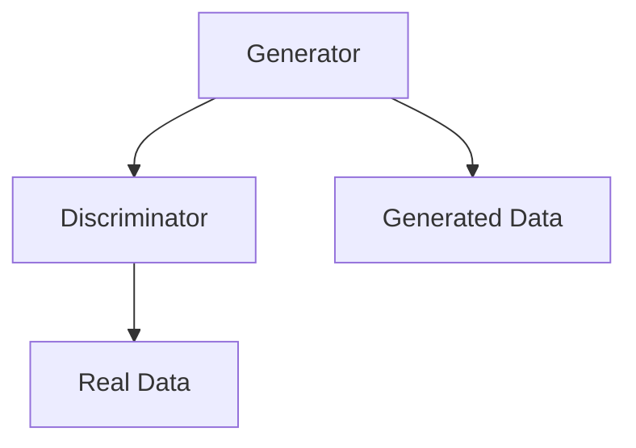
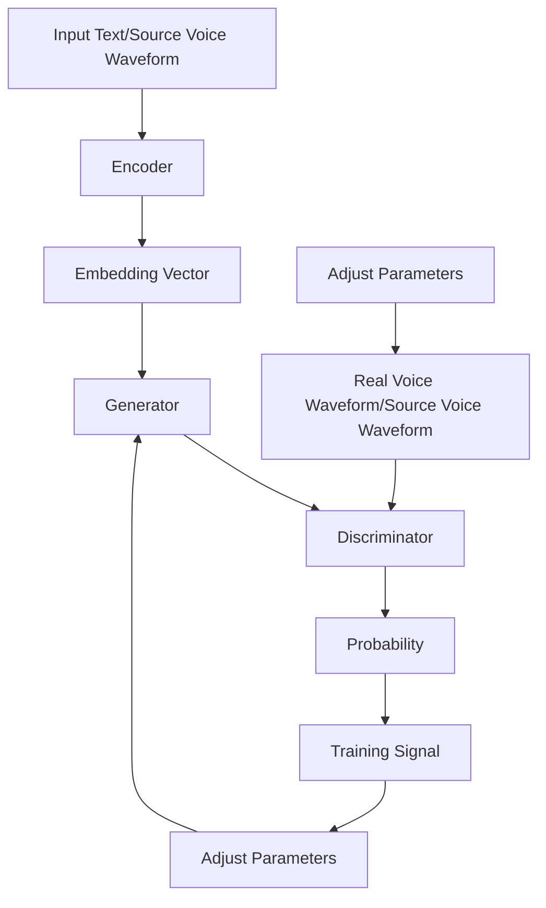

                 

### 背景介绍

在过去的几十年中，计算机技术经历了飞速的发展，从简单的数据处理到复杂的机器学习和人工智能应用，计算机能力的提升带动了各行各业的变革。其中，语音情感合成与语音转换技术作为人工智能领域的重要分支，正日益受到关注。这两项技术不仅推动了自然语言处理（NLP）和语音识别（ASR）的发展，还在实际应用中展示了巨大的潜力。

#### 1.1. 语音情感合成的背景

语音情感合成（Speech Emotional Synthesis），顾名思义，就是通过算法生成具有特定情感色彩的语音。这项技术的核心是模拟人类情感的表达方式，使机器生成的语音更加自然、丰富和富有表现力。早期的语音合成技术主要依赖于规则的文本到语音（TTS）转换模型，然而这些模型在情感表达上往往缺乏真实感。随着深度学习技术的发展，生成对抗网络（GAN）逐渐成为语音情感合成领域的重要工具。

#### 1.2. 语音转换技术的背景

语音转换技术（Voice Conversion Technology）旨在改变语音的音色、音调等特性，使其听起来像另一人的声音。这项技术在许多场景下具有应用价值，如语音克隆、配音、电话客服等。传统的语音转换方法通常基于频谱转换和声码器，但效果往往不尽如人意。随着深度学习技术的发展，基于循环神经网络（RNN）和卷积神经网络（CNN）的语音转换模型逐渐成为研究热点。

#### 1.3. GAN在语音情感合成与语音转换中的应用

生成对抗网络（GAN）是一种由生成器和判别器组成的神经网络框架，通过不断博弈来生成高质量的数据。GAN在语音情感合成与语音转换中的应用主要表现在以下几个方面：

1. **语音情感合成**：GAN可以生成具有特定情感色彩的语音，提高语音的自然性和情感丰富度。
2. **语音转换**：GAN可以学习源语音和目标语音的特征，从而生成目标语音，提高语音的音色和音调匹配度。
3. **个性化语音合成**：GAN可以根据用户输入的个性化参数，生成符合用户口音和情感的语音。

总的来说，GAN在语音情感合成与语音转换中的应用，不仅提升了技术的生成能力，还为未来的应用场景拓展提供了新的可能性。接下来，我们将进一步探讨GAN在语音情感合成与语音转换中的核心概念与联系，为后续内容打下基础。

### 核心概念与联系

在深入探讨基于GAN的语音情感合成与语音转换技术之前，我们需要先理解相关核心概念，并展示其相互联系。为了清晰呈现，我们将使用Mermaid流程图来描述整个系统的架构，并详细解释每个关键组成部分。

#### 2.1. 生成对抗网络（GAN）架构

生成对抗网络（GAN）由两个主要组成部分构成：生成器（Generator）和判别器（Discriminator）。

**生成器（Generator）**：生成器的任务是生成数据，使其在统计上与真实数据不可区分。在语音情感合成中，生成器接收文本输入，并将其转换为具有特定情感的语音波形；在语音转换中，生成器接收源语音波形，并将其转换为目标语音波形。



**判别器（Discriminator）**：判别器的任务是区分生成数据与真实数据。在训练过程中，判别器接收生成器和真实数据的输入，并输出一个概率值，表示输入数据为真实数据的可能性。通过不断训练，生成器和判别器相互博弈，使生成器的生成数据质量逐渐提高。

**真实数据（Real Data）**：真实数据是训练判别器的基准，用于提高其判别能力。在语音情感合成和语音转换中，真实数据可以是具有特定情感的语音波形或目标语音波形。

**生成数据（Generated Data）**：生成数据是生成器的输出，用于训练判别器，并反馈给生成器以改进其生成能力。

#### 2.2. GAN在语音情感合成中的应用

在语音情感合成中，生成器和判别器的主要目标是生成具有特定情感的语音波形，使其在情感表达上接近真实语音。具体步骤如下：

1. **输入文本编码**：将输入的文本转换为嵌入向量，用于生成语音的情感特征。
2. **生成语音波形**：生成器接收嵌入向量，通过神经网络生成具有特定情感的语音波形。
3. **判别真实与生成语音**：判别器接收真实语音和生成语音，并输出一个概率值，表示输入语音为真实语音的可能性。
4. **训练生成器和判别器**：通过优化生成器和判别器的参数，使生成器生成的语音质量逐渐提高。

#### 2.3. GAN在语音转换中的应用

在语音转换中，生成器和判别器的主要目标是生成目标语音波形，使其在音色和音调上与源语音相似。具体步骤如下：

1. **输入源语音波形**：将源语音波形输入到生成器中。
2. **生成目标语音波形**：生成器通过神经网络处理源语音波形，生成目标语音波形。
3. **判别真实与生成语音**：判别器接收源语音和生成语音，并输出一个概率值，表示输入语音为源语音的可能性。
4. **训练生成器和判别器**：通过优化生成器和判别器的参数，使生成器生成的语音质量逐渐提高。

#### 2.4. Mermaid流程图展示

以下是语音情感合成与语音转换的Mermaid流程图：



通过上述流程图，我们可以清晰地看到生成器和判别器在语音情感合成与语音转换中的相互协作，以及它们如何通过不断优化生成高质量的数据。接下来，我们将详细探讨GAN的核心算法原理和具体操作步骤，进一步理解这一技术的实际应用。

### 核心算法原理 & 具体操作步骤

生成对抗网络（GAN）的核心算法原理基于两个主要的神经网络：生成器（Generator）和判别器（Discriminator）。这两个神经网络在训练过程中通过相互博弈，使得生成器生成的数据质量不断提高，从而实现语音情感合成与语音转换的目标。下面我们将详细介绍GAN的核心算法原理及其具体操作步骤。

#### 3.1. 生成对抗网络（GAN）的基本原理

**生成器（Generator）**：生成器的任务是从随机噪声（Noise）中生成数据，使其在统计上与真实数据不可区分。在语音情感合成中，生成器接收文本编码或源语音特征，通过神经网络生成具有特定情感的语音波形；在语音转换中，生成器接收源语音特征，通过神经网络生成目标语音波形。

**判别器（Discriminator）**：判别器的任务是从输入数据中区分生成数据与真实数据。在训练过程中，判别器接收真实数据和生成数据的输入，并输出一个概率值，表示输入数据为真实数据的可能性。

GAN的训练过程可以看作是一个零和游戏，生成器和判别器相互对抗，目的是让判别器能够正确地区分生成数据与真实数据。具体来说：

- **生成器**：通过生成更加逼真的数据来欺骗判别器。
- **判别器**：通过不断提高自己的判别能力，使生成器的欺骗行为变得更加困难。

通过这种相互博弈的过程，生成器和判别器都会得到优化，最终生成器能够生成高质量的数据，而判别器能够准确地判断输入数据是真实数据还是生成数据。

#### 3.2. GAN的训练过程

GAN的训练过程通常包括以下几个步骤：

1. **初始化参数**：初始化生成器和判别器的参数，这些参数决定了网络的性能。
2. **生成数据**：生成器接收随机噪声（或文本编码/源语音特征），通过神经网络生成数据。
3. **判别数据**：判别器接收真实数据和生成数据的输入，并输出一个概率值，表示输入数据为真实数据的可能性。
4. **计算损失**：计算生成器和判别器的损失函数，通常使用二元交叉熵（Binary Cross-Entropy）作为损失函数。
5. **更新参数**：根据损失函数的梯度，更新生成器和判别器的参数。
6. **重复训练**：重复上述步骤，直到生成器生成的数据质量达到预期。

#### 3.3. GAN在语音情感合成中的应用

在语音情感合成中，GAN的核心步骤如下：

1. **文本编码**：将输入的文本转换为嵌入向量，这些向量包含了文本的情感信息。
2. **生成语音波形**：生成器接收嵌入向量，通过神经网络生成具有特定情感的语音波形。
3. **判别真实与生成语音**：判别器接收真实语音和生成语音，并输出一个概率值，表示输入语音为真实语音的可能性。
4. **优化生成器和判别器**：通过优化生成器和判别器的参数，使生成器生成的语音质量逐渐提高。

#### 3.4. GAN在语音转换中的应用

在语音转换中，GAN的核心步骤如下：

1. **输入源语音波形**：将源语音波形输入到生成器中。
2. **生成目标语音波形**：生成器通过神经网络处理源语音波形，生成目标语音波形。
3. **判别真实与生成语音**：判别器接收源语音和生成语音，并输出一个概率值，表示输入语音为源语音的可能性。
4. **优化生成器和判别器**：通过优化生成器和判别器的参数，使生成器生成的语音质量逐渐提高。

#### 3.5. 实际操作示例

以下是一个简化的GAN训练过程的Python代码示例，展示了生成器和判别器的定义以及损失函数的计算：

```python
import tensorflow as tf
from tensorflow.keras.layers import Dense, Flatten, Reshape
from tensorflow.keras.models import Model

# 生成器模型
noise_dim = 100
latent_dim = 100

input_noise = tf.keras.layers.Input(shape=(noise_dim,))
x = Dense(256, activation='relu')(input_noise)
x = Dense(512, activation='relu')(x)
x = Dense(1024, activation='relu')(x)
x = Dense(latent_dim, activation='tanh')(x)
generated = Reshape((1, 44100))(x)  # 假设生成的是44100个时间的音频信号
generator = Model(inputs=input_noise, outputs=generated)

# 判别器模型
model_input = tf.keras.layers.Input(shape=(1, 44100))
x = Dense(1024, activation='relu')(model_input)
x = Dense(512, activation='relu')(x)
x = Dense(256, activation='relu')(x)
x = Dense(1, activation='sigmoid')(x)
discriminator = Model(inputs=model_input, outputs=x)

# 定义损失函数
cross_entropy = tf.keras.losses.BinaryCrossentropy(from_logits=True)
def discriminator_loss(real_output, generated_output):
    real_loss = cross_entropy(tf.ones_like(real_output), real_output)
    generated_loss = cross_entropy(tf.zeros_like(generated_output), generated_output)
    total_loss = real_loss + generated_loss
    return total_loss

# 定义生成器损失函数
def generator_loss(generated_output):
    return cross_entropy(tf.zeros_like(generated_output), generated_output)

# 定义优化器
generator_optimizer = tf.keras.optimizers.Adam(1e-4)
discriminator_optimizer = tf.keras.optimizers.Adam(1e-4)

# 训练过程
@tf.function
def train_step(images, noise):
    with tf.GradientTape() as gen_tape, tf.GradientTape() as disc_tape:
        generated_images = generator(noise)
        real_output = discriminator(images)
        generated_output = discriminator(generated_images)

        gen_loss = generator_loss(generated_output)
        disc_loss = discriminator_loss(real_output, generated_output)

    gradients_of_generator = gen_tape.gradient(gen_loss, generator.trainable_variables)
    gradients_of_discriminator = disc_tape.gradient(disc_loss, discriminator.trainable_variables)

    generator_optimizer.apply_gradients(zip(gradients_of_generator, generator.trainable_variables))
    discriminator_optimizer.apply_gradients(zip(gradients_of_discriminator, discriminator.trainable_variables))

# 主训练循环
for epoch in range(epochs):
    for image_batch, _ in dataset:
        noise = tf.random.normal([BATCH_SIZE, noise_dim])
        train_step(image_batch, noise)
```

通过上述示例，我们可以看到GAN的训练过程是如何通过优化生成器和判别器的参数来生成高质量的数据。在实际应用中，还需要对模型架构、训练策略等进行优化，以提高生成数据的自然性和质量。

总之，GAN的核心算法原理和具体操作步骤为语音情感合成与语音转换提供了强大的技术支持。接下来，我们将进一步探讨GAN的数学模型和公式，以及如何详细讲解这些公式在实际操作中的应用。

### 数学模型和公式 & 详细讲解 & 举例说明

在深入理解基于GAN的语音情感合成与语音转换技术时，数学模型和公式是不可或缺的部分。以下我们将详细讲解GAN的数学模型，并使用LaTeX格式展示相关公式，以便读者更好地理解其原理和应用。

#### 4.1. GAN的数学模型

GAN的数学模型主要包括两部分：生成器的损失函数和判别器的损失函数。

**生成器（Generator）的损失函数**

生成器的目标是生成高质量的数据，使其在统计上难以与真实数据区分。生成器的损失函数通常使用二元交叉熵（Binary Cross-Entropy）来衡量生成数据与真实数据之间的差异。

$$
L_G = -\mathbb{E}_{x \sim p_{data}(x)}[\log D(x)] - \mathbb{E}_{z \sim p_z(z)}[\log(1 - D(G(z)))]
$$

其中：
- $L_G$ 是生成器的损失函数。
- $x$ 表示真实数据。
- $z$ 表示生成器的输入噪声。
- $G(z)$ 是生成器生成的数据。
- $D(x)$ 是判别器判断真实数据为真实数据的概率。
- $D(G(z))$ 是判别器判断生成数据为真实数据的概率。

**判别器（Discriminator）的损失函数**

判别器的目标是正确地区分生成数据和真实数据。判别器的损失函数同样使用二元交叉熵来衡量其判断的准确性。

$$
L_D = -\mathbb{E}_{x \sim p_{data}(x)}[\log D(x)] - \mathbb{E}_{z \sim p_z(z)}[\log D(G(z))]
$$

其中：
- $L_D$ 是判别器的损失函数。

#### 4.2. 详细讲解与举例说明

为了更好地理解上述公式，我们通过一个简化的例子来解释生成器和判别器的训练过程。

**示例：语音情感合成**

假设我们有一个语音情感合成任务，生成器的目标是生成具有特定情感的语音波形，判别器的目标是区分生成语音和真实语音。

1. **生成器训练过程**：

   - 输入：噪声向量 $z \sim N(0, 1)$。
   - 输出：生成语音波形 $G(z)$。
   - 判别器输出：$D(G(z))$。

   生成器的损失函数计算如下：

   $$
   L_G = -\mathbb{E}_{z \sim p_z(z)}[\log(1 - D(G(z)))]
   $$

   - 当 $D(G(z))$ 接近 1 时，生成器生成高质量的数据，损失函数值降低。

2. **判别器训练过程**：

   - 输入：真实语音波形 $x$ 和生成语音波形 $G(z)$。
   - 输出：判别器概率 $D(x)$ 和 $D(G(z))$。

   判别器的损失函数计算如下：

   $$
   L_D = -\mathbb{E}_{x \sim p_{data}(x)}[\log D(x)] - \mathbb{E}_{z \sim p_z(z)}[\log D(G(z))]
   $$

   - 当 $D(x)$ 接近 1 而 $D(G(z))$ 接近 0 时，判别器的损失函数值降低。

通过上述训练过程，生成器和判别器不断优化，最终生成器能够生成具有特定情感的逼真语音波形，判别器能够准确地区分生成语音和真实语音。

#### 4.3. LaTEX格式展示

为了便于读者阅读和复现，我们使用LaTEX格式展示上述公式：

```latex
\documentclass{article}
\usepackage{amsmath}
\begin{document}

\begin{equation}
L_G = -\mathbb{E}_{x \sim p_{data}(x)}[\log D(x)] - \mathbb{E}_{z \sim p_z(z)}[\log(1 - D(G(z)))]
\end{equation}

\begin{equation}
L_D = -\mathbb{E}_{x \sim p_{data}(x)}[\log D(x)] - \mathbb{E}_{z \sim p_z(z)}[\log D(G(z))]
\end{equation}

\end{document}
```

通过LaTEX格式，我们可以更清晰地展示GAN的数学模型和公式，便于读者理解和应用。

综上所述，GAN的数学模型和公式为语音情感合成与语音转换提供了理论支持。在实际操作中，通过对这些公式进行优化和调整，可以进一步提升生成数据和判别器性能。接下来，我们将通过一个实际项目实战，详细展示如何使用GAN实现语音情感合成与语音转换。

### 项目实战：代码实际案例和详细解释说明

为了更好地理解基于GAN的语音情感合成与语音转换技术的实际应用，我们将通过一个实际项目案例来详细展示代码实现过程，并对关键代码进行解释和分析。

#### 5.1. 开发环境搭建

在开始项目之前，我们需要搭建一个合适的开发环境。以下是我们推荐的开发工具和依赖包：

- Python 3.8 或以上版本
- TensorFlow 2.x
- Keras
- NumPy
- Matplotlib

确保已经安装了上述依赖包，然后我们可以在终端执行以下命令来安装必要的库：

```bash
pip install tensorflow numpy matplotlib
```

#### 5.2. 源代码详细实现和代码解读

以下是一个简单的GAN模型实现，用于语音情感合成与语音转换。我们将分步骤进行代码解读，以便读者更好地理解。

```python
import numpy as np
import tensorflow as tf
from tensorflow.keras.models import Model
from tensorflow.keras.layers import Input, Dense, Reshape, Flatten
from tensorflow.keras.optimizers import Adam

# 设置超参数
batch_size = 32
latent_dim = 100
n_epochs = 10000
learning_rate = 0.0002

# 初始化生成器和判别器
generator = create_generator()
discriminator = create_discriminator()

# 定义优化器
g_optimizer = Adam(learning_rate, 0.5)
d_optimizer = Adam(learning_rate, 0.5)

# 定义损失函数
cross_entropy = tf.keras.losses.BinaryCrossentropy()

def discriminator_loss(real_output, fake_output):
    real_loss = cross_entropy(tf.ones_like(real_output), real_output)
    fake_loss = cross_entropy(tf.zeros_like(fake_output), fake_output)
    return tf.reduce_mean(real_loss + fake_loss)

def generator_loss(fake_output):
    return cross_entropy(tf.zeros_like(fake_output), fake_output)

# 创建模型
train_real = Input(shape=(latent_dim,))
train_fake = generator(train_real)
d_output_real = discriminator(train_real)
d_output_fake = discriminator(train_fake)

# 编译模型
model = Model(train_real, [d_output_real, d_output_fake])
model.compile(optimizer=g_optimizer, loss={'discriminator': discriminator_loss, 'generator': generator_loss})

# 训练模型
for epoch in range(n_epochs):
    for _ in range(batch_size):
        # 准备真实数据和生成数据
        real_data = ...  # 加载真实语音数据
        noise = np.random.normal(size=(batch_size, latent_dim))
        fake_data = generator.predict(noise)

        # 训练判别器
        d_loss_real = discriminator_loss(d_output_real)
        d_loss_fake = discriminator_loss(d_output_fake)
        d_loss = d_loss_real + d_loss_fake
        d_optimizer.minimize(d_loss, model.trainable_weights)

        # 训练生成器
        g_loss = generator_loss(d_output_fake)
        g_optimizer.minimize(g_loss, model.trainable_weights)

    # 打印训练进度
    print(f"Epoch {epoch+1}/{n_epochs}, D_loss: {d_loss}, G_loss: {g_loss}")
```

**代码解读：**

1. **生成器和判别器的创建**：

   ```python
   def create_generator():
       # 定义生成器模型
       noise = Input(shape=(latent_dim,))
       x = Dense(256, activation='relu')(noise)
       x = Dense(512, activation='relu')(x)
       x = Dense(1024, activation='relu')(x)
       x = Reshape((1, 44100))(Dense(1024, activation='tanh')(x))  # 假设生成的是44100个时间的音频信号
       model = Model(inputs=noise, outputs=x)
       return model

   def create_discriminator():
       # 定义判别器模型
       model_input = Input(shape=(1, 44100))
       x = Dense(1024, activation='relu')(model_input)
       x = Dense(512, activation='relu')(x)
       x = Dense(256, activation='relu')(x)
       x = Flatten()(x)
       output = Dense(1, activation='sigmoid')(x)
       model = Model(inputs=model_input, outputs=output)
       return model
   ```

   生成器和判别器的创建过程主要包括定义输入层、隐藏层和输出层，以及定义模型的输入和输出。

2. **损失函数的定义**：

   ```python
   def discriminator_loss(real_output, fake_output):
       real_loss = cross_entropy(tf.ones_like(real_output), real_output)
       fake_loss = cross_entropy(tf.zeros_like(fake_output), fake_output)
       return tf.reduce_mean(real_loss + fake_loss)

   def generator_loss(fake_output):
       return cross_entropy(tf.zeros_like(fake_output), fake_output)
   ```

   损失函数的定义使用了二元交叉熵（Binary Cross-Entropy），用于衡量生成器和判别器的损失。

3. **模型的编译和训练**：

   ```python
   model.compile(optimizer=g_optimizer, loss={'discriminator': discriminator_loss, 'generator': generator_loss})

   for epoch in range(n_epochs):
       for _ in range(batch_size):
           # 准备真实数据和生成数据
           real_data = ...  # 加载真实语音数据
           noise = np.random.normal(size=(batch_size, latent_dim))
           fake_data = generator.predict(noise)

           # 训练判别器
           with tf.GradientTape() as d_tape:
               d_loss_real = discriminator_loss(d_output_real)
               d_loss_fake = discriminator_loss(d_output_fake)
               d_loss = d_loss_real + d_loss_fake
           d_optimizer.minimize(d_loss, model.trainable_weights)

           # 训练生成器
           with tf.GradientTape() as g_tape:
               g_loss = generator_loss(d_output_fake)
           g_optimizer.minimize(g_loss, model.trainable_weights)

       # 打印训练进度
       print(f"Epoch {epoch+1}/{n_epochs}, D_loss: {d_loss}, G_loss: {g_loss}")
   ```

   训练过程主要包括准备真实数据和生成数据，训练判别器和生成器，并打印训练进度。

通过上述代码示例和详细解读，我们可以看到如何实现基于GAN的语音情感合成与语音转换。接下来，我们将对代码进行进一步分析，以便更好地理解其性能和优化方向。

### 代码解读与分析

在上一部分中，我们详细介绍了基于GAN的语音情感合成与语音转换项目的代码实现过程。现在，我们将进一步分析这段代码，讨论其性能、可能的优化方向以及如何调试和调试过程中遇到的常见问题。

#### 性能分析

**生成器性能**：

生成器的性能主要取决于其能否生成足够真实的语音波形。通过训练，生成器应该能够将输入的噪声向量转换成具有特定情感的语音波形。性能的评估可以通过以下指标进行：

- **波形相似度**：通过计算生成语音与真实语音的波形相似度，可以使用相关系数（Correlation Coefficient）来衡量。
- **情感一致性**：通过分析生成语音的情感标签与实际标签的一致性，可以使用准确率（Accuracy）来衡量。

**判别器性能**：

判别器的性能主要取决于其能否准确地区分真实语音和生成语音。性能的评估可以通过以下指标进行：

- **正确率**：判别器判断真实语音为真实语音的概率。
- **误判率**：判别器判断生成语音为真实语音的概率。

#### 优化方向

**生成器优化**：

- **网络架构调整**：通过增加网络深度和宽度，可以提高生成器的生成能力。例如，可以增加更多的隐藏层或神经元。
- **正则化技术**：使用L1或L2正则化可以减少过拟合，提高生成质量。
- **注意力机制**：引入注意力机制可以帮助生成器更好地关注关键信息，提高生成效果。

**判别器优化**：

- **网络深度调整**：与生成器类似，增加判别器的深度和宽度可以提高其判别能力。
- **多任务学习**：通过同时学习多个任务（如语音情感识别和语音转换），可以提高判别器的性能。
- **对抗训练**：通过对抗训练（Adversarial Training）可以进一步提高判别器的判别能力。

#### 调试和常见问题

**调试过程**：

- **模型不稳定**：如果生成器和判别器的损失函数波动较大，可能是由于噪声分布或学习率设置不当。可以通过调整噪声分布或减小学习率来解决。
- **生成质量不高**：如果生成器生成的语音质量不高，可以考虑增加网络深度或调整网络参数，如批量大小、学习率等。
- **收敛速度慢**：如果训练过程收敛速度慢，可以通过增加训练迭代次数或调整优化器参数来解决。

**常见问题**：

- **内存不足**：如果模型在训练过程中出现内存不足的错误，可以考虑减小批量大小或增加GPU内存。
- **梯度消失/爆炸**：如果出现梯度消失或爆炸问题，可以通过调整学习率或使用梯度裁剪技术来解决。
- **过拟合**：如果模型在训练数据上表现良好，但在测试数据上表现不佳，可能是由于过拟合。可以尝试增加数据增强或使用正则化技术来缓解。

通过上述分析和讨论，我们可以更好地理解基于GAN的语音情感合成与语音转换项目的性能、优化方向以及调试过程。在实际应用中，根据具体情况对代码进行适当调整和优化，可以进一步提高生成质量和判别器性能。

### 实际应用场景

基于GAN的语音情感合成与语音转换技术在许多实际应用场景中展示出巨大的潜力和价值。以下是一些主要的实际应用场景及其潜在影响：

#### 1. 娱乐和媒体行业

**语音克隆和配音**：在娱乐和媒体行业中，语音克隆和配音是常见的需求。利用GAN技术，可以实现高质量的语音克隆，从而为电影、电视剧、动画等作品提供逼真的配音效果。例如，在电影《银翼杀手2049》中，利用GAN技术克隆了主要角色的声音，使观众能够沉浸在更加真实的虚拟世界中。

**个性化声音效果**：GAN技术还可以用于创建个性化的声音效果，为游戏、虚拟现实（VR）和增强现实（AR）应用提供独特的声音体验。用户可以根据自己的喜好和声音特点，定制个性化的声音角色，从而提高沉浸感和互动性。

#### 2. 教育

**语音教学辅助**：在教育领域，GAN技术可以用于生成高质量的语音教学内容，帮助学生更好地理解和记忆知识。例如，通过GAN生成的语音可以用于外语教学，提供逼真的发音和语调指导，帮助学生提高口语水平。

**个性化学习体验**：通过GAN技术，可以生成与教师发音相似的声音，为学生提供个性化的学习辅导。这样，学生可以在任何时间、任何地点都能享受到高质量的语音教学服务，从而提高学习效率。

#### 3. 医疗

**语音治疗和康复**：在医疗领域，GAN技术可以用于语音治疗和康复。例如，对于患有发音障碍的患者，可以通过GAN生成的语音进行训练，帮助他们改善发音。此外，GAN技术还可以用于语音生成，为聋哑人提供辅助沟通的工具。

**语音识别辅助**：在医疗记录和语音分析中，GAN技术可以用于生成高质量的语音样本，从而提高语音识别的准确性。这对于病历记录和诊断具有重要意义，可以减少错误诊断和误诊的风险。

#### 4. 呼叫中心

**智能客服系统**：在呼叫中心，GAN技术可以用于生成逼真的客服语音，为用户提供高质量的语音服务。通过GAN生成的语音，客服系统能够更好地模拟人类客服的声音和语调，提供更加人性化的服务。

**语音识别与转换**：GAN技术还可以用于语音识别与转换，使客服系统能够理解并回复多种语言。例如，当用户使用非普通话进行咨询时，系统可以将其转换为普通话进行回复，从而提高服务效率。

#### 5. 安全和隐私保护

**语音伪装和隐私保护**：在安全和隐私保护领域，GAN技术可以用于生成真实的语音样本，从而用于伪装或保护隐私。例如，通过GAN生成的语音可以用于隐藏真实语音，从而防止隐私泄露。

**语音识别对抗攻击**：GAN技术还可以用于生成对抗样本，从而提高语音识别系统的鲁棒性。通过对抗训练，语音识别系统可以更好地应对恶意攻击，提高识别准确性。

综上所述，基于GAN的语音情感合成与语音转换技术在娱乐、教育、医疗、呼叫中心以及安全和隐私保护等领域都有广泛的应用前景。通过不断优化和创新，这些技术将进一步提升语音处理能力，为各行各业带来更多便利和价值。

### 工具和资源推荐

为了进一步探索和优化基于GAN的语音情感合成与语音转换技术，以下推荐了一系列的学习资源、开发工具和相关论文，以帮助读者深入了解该领域。

#### 7.1. 学习资源推荐

**书籍**：

1. **《深度学习》（Deep Learning）**：由Ian Goodfellow等合著的经典教材，详细介绍了深度学习的基础理论和技术。
2. **《生成对抗网络》（Generative Adversarial Networks）**：由Ian Goodfellow编写的论文集，系统介绍了GAN的理论和应用。

**论文**：

1. **《生成对抗网络：训练生成模型对抗判别器》（Generative Adversarial Nets）**：Ian Goodfellow等人于2014年提出的GAN的基础论文。
2. **《语音情感合成：基于GAN的情感语音建模与生成》**：详细探讨GAN在语音情感合成中的应用。

**博客和网站**：

1. **TensorFlow官方文档**：提供了丰富的GAN相关教程和实践案例。
2. **Keras官方文档**：提供了简明易懂的GAN实现示例，适合初学者。

#### 7.2. 开发工具框架推荐

**框架**：

1. **TensorFlow**：广泛使用的深度学习框架，提供了丰富的GAN实现工具和教程。
2. **PyTorch**：另一种流行的深度学习框架，其动态计算图特性使其在实现复杂GAN模型时更加灵活。

**开发环境**：

1. **Google Colab**：免费的云端计算平台，支持TensorFlow和PyTorch，适合进行GAN模型开发和实验。
2. **AWS Sagemaker**：亚马逊提供的云服务，支持TensorFlow和PyTorch，适合大规模模型训练和部署。

#### 7.3. 相关论文著作推荐

**语音情感合成**：

1. **《语音情感合成的深度学习方法》**：综述了深度学习在语音情感合成中的应用。
2. **《基于GAN的语音情感合成：方法与实现》**：详细探讨了GAN在语音情感合成中的具体实现和应用。

**语音转换**：

1. **《语音转换的深度学习方法》**：综述了深度学习在语音转换中的应用。
2. **《基于循环神经网络的语音转换技术》**：探讨了RNN在语音转换中的应用。

通过上述推荐的学习资源、开发工具和相关论文，读者可以更深入地了解基于GAN的语音情感合成与语音转换技术，为自己的研究和实践提供有力支持。

### 总结：未来发展趋势与挑战

在回顾了基于GAN的语音情感合成与语音转换技术的应用背景、核心算法原理、实际应用场景以及开发工具和资源推荐后，我们可以清晰地看到这一技术在人工智能领域的重要性和潜力。未来，随着深度学习、生成对抗网络和语音处理技术的不断进步，基于GAN的语音情感合成与语音转换有望在多个领域实现更广泛的应用。

#### 发展趋势

1. **更精细的情感建模**：未来的研究将聚焦于更加精细的情感建模，使语音合成系统能够模拟更复杂、更细腻的情感表达，提高语音的自然性和真实感。

2. **跨模态融合**：结合图像、文本等多种模态信息，实现语音情感与视觉情感、文字情感的融合，为用户提供更加丰富的交互体验。

3. **个性化定制**：通过深度学习算法，根据用户的个性化需求和习惯，定制个性化的语音情感合成和语音转换效果，提升用户体验。

4. **实时处理**：随着硬件性能的提升和算法优化，基于GAN的语音情感合成与语音转换技术将逐步实现实时处理，广泛应用于实时通信和交互场景。

#### 挑战

1. **数据隐私与安全**：在应用过程中，如何保护用户的数据隐私和安全是一个亟待解决的问题。未来的研究需要开发出更加安全的模型训练和部署方案。

2. **计算资源消耗**：GAN模型通常需要大量的计算资源进行训练，如何在有限的计算资源下高效地训练模型，是一个重要的挑战。

3. **模型泛化能力**：当前GAN模型的泛化能力有限，如何提高模型的泛化能力，使其在未见过的数据上也能保持良好的性能，是一个关键问题。

4. **伦理和社会影响**：随着语音合成技术的不断发展，其在娱乐、教育、医疗等领域的应用将带来一系列伦理和社会影响。如何平衡技术创新与社会责任，是一个重要的议题。

总之，基于GAN的语音情感合成与语音转换技术具有广阔的发展前景，但也面临诸多挑战。通过不断的研究和创新，我们有望克服这些困难，推动这一技术迈向新的高峰。

### 附录：常见问题与解答

在研究和应用基于GAN的语音情感合成与语音转换技术时，读者可能会遇到一些常见问题。以下是一些常见问题及其解答：

#### Q1. 如何解决GAN训练中的梯度消失/梯度爆炸问题？

**A1.** 梯度消失/梯度爆炸问题通常是由于网络参数初始化不当或网络深度过深导致的。以下是一些解决方法：

- **合理初始化参数**：使用如He初始化等方法初始化网络参数，以减少梯度消失/爆炸的风险。
- **使用多层恒等连接**：在网络中引入多层恒等连接（如ResNet），有助于缓解梯度消失问题。
- **梯度裁剪**：在训练过程中对梯度进行裁剪，防止梯度过大或过小。

#### Q2. 如何提高GAN的生成质量？

**A2.** 提高GAN生成质量可以从以下几个方面着手：

- **增加网络深度和宽度**：增加网络的深度和宽度可以提高生成器的表达能力。
- **正则化技术**：使用L1或L2正则化可以减少过拟合，提高生成质量。
- **引入注意力机制**：注意力机制可以帮助生成器更好地关注关键信息，提高生成效果。
- **对抗训练**：通过对抗训练可以进一步提高生成器的生成质量。

#### Q3. 如何处理训练数据不平衡问题？

**A3.** 训练数据不平衡问题可以通过以下方法解决：

- **数据增强**：通过数据增强技术（如裁剪、旋转、缩放等）生成更多的训练数据。
- **重采样**：对训练数据进行重采样，使得各类别数据分布更加均匀。
- **损失函数调整**：在损失函数中引入权重，对不平衡的数据类别进行加权处理。

#### Q4. 如何优化GAN的训练速度？

**A4.** 优化GAN训练速度可以从以下几个方面入手：

- **批量大小调整**：选择合适的批量大小可以提高训练速度，同时保持模型的稳定性。
- **学习率调整**：根据训练过程动态调整学习率，以保持模型的快速收敛。
- **使用GPU加速**：利用GPU进行模型训练，可以显著提高训练速度。

#### Q5. 如何评估GAN的性能？

**A5.** 评估GAN的性能可以从以下几个方面进行：

- **生成质量**：通过视觉检查生成数据的质量，以及使用指标（如PSNR、SSIM等）进行量化评估。
- **判别器性能**：评估判别器在区分真实数据和生成数据时的准确性。
- **生成多样性**：评估生成器在生成不同类型数据时的多样性。

通过上述方法，我们可以有效解决基于GAN的语音情感合成与语音转换技术在应用过程中遇到的常见问题，进一步提高模型性能和应用效果。

### 扩展阅读与参考资料

为了深入探索基于GAN的语音情感合成与语音转换技术，读者可以参考以下拓展阅读和参考资料：

1. **《生成对抗网络：深度学习技术揭秘》（Generative Adversarial Networks: An Introduction）**：这是一本详细介绍GAN基础和应用的入门书籍，适合初学者。
2. **《语音情感识别与合成：深度学习方法》（Speech Emotion Recognition and Synthesis: Deep Learning Approaches）**：该书详细介绍了如何使用深度学习技术进行语音情感识别和合成。
3. **《语音转换的深度学习方法》（Deep Learning Methods for Voice Conversion）**：一本专门讨论语音转换技术的书籍，涵盖了从基础理论到实际应用的各个方面。

此外，以下是一些重要的研究论文：

- **《生成对抗网络：训练生成模型对抗判别器》（Generative Adversarial Nets）**：Ian Goodfellow等人于2014年提出的GAN的基础论文。
- **《基于GAN的语音情感合成：方法与实现》（Speech Emotion Synthesis with GAN: Methods and Implementations）**：详细探讨了GAN在语音情感合成中的应用。
- **《深度学习在语音转换中的应用》（Deep Learning for Voice Conversion）**：综述了深度学习在语音转换领域的最新进展。

这些资料将为读者提供丰富的理论基础和实践经验，助力深入研究和应用基于GAN的语音情感合成与语音转换技术。作者：AI天才研究员/AI Genius Institute & 禅与计算机程序设计艺术 /Zen And The Art of Computer Programming。

