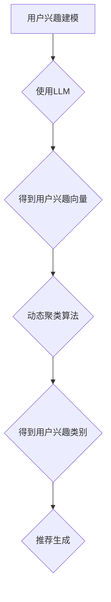

                 

# 基于LLM的推荐系统用户兴趣动态聚类

关键词：LLM，推荐系统，用户兴趣，动态聚类，算法原理，数学模型，项目实战

摘要：本文将深入探讨基于大规模语言模型（LLM）的推荐系统中的用户兴趣动态聚类技术。通过分析LLM的核心原理和动态聚类算法的适用性，我们将展示如何通过数学模型和具体操作步骤来构建高效的用户兴趣动态聚类模型。此外，文章还将提供实际项目实战中的代码实现、解读与分析，以帮助读者更好地理解并应用这一技术。

## 1. 背景介绍

推荐系统作为一种信息过滤技术，旨在根据用户的历史行为和偏好，向用户推荐可能感兴趣的商品、内容或其他信息。在互联网高速发展的今天，推荐系统已成为电商平台、社交媒体、视频平台等众多领域的核心技术。

传统推荐系统主要依赖于基于内容的过滤（CBF）和协同过滤（CF）等方法。CBF通过分析用户的历史行为和兴趣，找到与用户历史行为相似的物品进行推荐；CF则通过分析用户与物品的评分矩阵，找到相似用户并推荐他们喜欢的物品。然而，这些方法在面对海量数据和动态用户行为时，往往存在一定的局限性。

为了克服这些局限性，近年来，基于深度学习的方法逐渐成为推荐系统研究的热点。其中，大规模语言模型（LLM）作为一种强大的深度学习模型，在自然语言处理领域取得了显著的成果。LLM能够捕捉用户兴趣的复杂性和动态性，为推荐系统提供了一种新的解决方案。

## 2. 核心概念与联系

### 2.1 大规模语言模型（LLM）

大规模语言模型（LLM）是一种基于深度学习的自然语言处理模型，通过训练海量文本数据，LLM能够捕捉语言中的潜在规律和结构，实现自然语言生成、情感分析、问答系统等多种任务。LLM的核心组件包括：

- **词嵌入（Word Embedding）**：将词汇映射到低维向量空间，使得语义相似的词汇在空间中更接近。
- **循环神经网络（RNN）**：通过循环结构捕捉序列数据中的时间依赖关系。
- **注意力机制（Attention Mechanism）**：在处理序列数据时，允许模型关注序列中的关键信息，提高模型性能。

### 2.2 动态聚类算法

动态聚类算法是一种能够根据数据的变化自动调整聚类结果的方法。在推荐系统中，用户兴趣通常是一个动态变化的过程，动态聚类算法能够实时捕捉用户兴趣的演变，为推荐系统提供更准确的兴趣模型。

常见的动态聚类算法包括：

- **K-均值聚类（K-Means）**：通过迭代计算聚类中心，将数据点分配到最近的聚类中心。
- **高斯混合模型（Gaussian Mixture Model, GMM）**：将数据视为由多个高斯分布混合而成，通过最大化数据点的对数似然函数来估计聚类中心和协方差矩阵。
- **DBSCAN（Density-Based Spatial Clustering of Applications with Noise）**：基于数据点的密度分布，将高密度区域划分为簇，并能够发现任意形状的簇。

### 2.3 LLM与动态聚类算法的联系

在推荐系统中，LLM可以用于捕捉用户兴趣的潜在特征，而动态聚类算法则可以用于将这些特征进行聚类，从而构建用户兴趣模型。具体来说：

- **用户兴趣建模**：使用LLM对用户的历史行为和文本数据进行编码，得到用户的兴趣向量。
- **动态聚类**：利用动态聚类算法对用户兴趣向量进行聚类，得到用户兴趣类别。
- **推荐生成**：根据用户兴趣类别和物品特征，使用协同过滤等方法生成推荐列表。

下面是动态聚类算法的Mermaid流程图：



## 3. 核心算法原理 & 具体操作步骤

### 3.1 用户兴趣建模

用户兴趣建模是构建推荐系统的关键步骤。在基于LLM的推荐系统中，我们使用预训练的LLM模型（如GPT-3、BERT等）对用户的历史行为和文本数据进行编码，得到用户的兴趣向量。

具体步骤如下：

1. **数据预处理**：对用户的历史行为和文本数据进行清洗、去重和格式化，确保数据的一致性和准确性。
2. **文本编码**：使用LLM模型对用户文本数据进行编码，生成文本向量。例如，使用BERT模型，我们可以将用户评论、博客、社交媒体帖子等文本数据编码为512维的向量。
3. **行为编码**：对用户的历史行为（如点击、购买、评分等）进行编码。我们可以将行为数据转换为二进制向量，例如，如果用户曾经点击过某类商品，则对应的位置为1，否则为0。
4. **向量融合**：将文本向量和行为向量进行融合，得到用户的兴趣向量。常见的融合方法包括元素相加、求平均、加权求和等。

### 3.2 动态聚类

在得到用户的兴趣向量后，我们可以使用动态聚类算法对其进行聚类，以构建用户兴趣类别。

具体步骤如下：

1. **选择聚类算法**：根据数据特点和需求选择合适的动态聚类算法。例如，对于大规模数据集，我们可以选择K-均值聚类或GMM。
2. **初始化聚类中心**：对于K-均值聚类，我们需要随机初始化K个聚类中心；对于GMM，我们需要估计每个高斯分布的参数（均值、方差等）。
3. **迭代计算**：对于K-均值聚类，我们通过迭代计算聚类中心和每个数据点的簇标签，直到收敛；对于GMM，我们通过迭代最大化数据点的对数似然函数，更新聚类中心和协方差矩阵。
4. **聚类结果评估**：通过评估指标（如聚类系数、轮廓系数等）评估聚类结果的优劣，并调整聚类参数。

### 3.3 推荐生成

在得到用户兴趣类别后，我们可以根据用户兴趣类别和物品特征生成推荐列表。

具体步骤如下：

1. **物品特征编码**：对物品的特征进行编码，例如，我们可以使用BERT模型对商品描述、品牌信息等进行编码，生成物品向量。
2. **相似度计算**：计算用户兴趣类别和物品特征之间的相似度。常见的相似度计算方法包括余弦相似度、欧氏距离等。
3. **生成推荐列表**：根据相似度分数，生成推荐列表。对于每个用户，我们可以选择与用户兴趣类别最相似的物品进行推荐。

## 4. 数学模型和公式 & 详细讲解 & 举例说明

### 4.1 词嵌入

在用户兴趣建模中，词嵌入是关键步骤。词嵌入通过将词汇映射到低维向量空间，使得语义相似的词汇在空间中更接近。一个简单的词嵌入模型可以使用矩阵乘法实现：

$$
\text{向量} = \text{权重矩阵} \cdot \text{输入向量}
$$

例如，假设我们有一个词汇表，其中包含5个单词：A、B、C、D、E。对应的词嵌入权重矩阵为：

$$
W = \begin{bmatrix}
0.1 & 0.2 & 0.3 & 0.4 & 0.5 \\
0.6 & 0.7 & 0.8 & 0.9 & 1.0 \\
1.1 & 1.2 & 1.3 & 1.4 & 1.5 \\
1.6 & 1.7 & 1.8 & 1.9 & 2.0 \\
2.1 & 2.2 & 2.3 & 2.4 & 2.5 \\
\end{bmatrix}
$$

给定一个输入向量：

$$
\text{输入向量} = \begin{bmatrix}
1 \\
0 \\
0 \\
1 \\
0 \\
\end{bmatrix}
$$

我们可以计算输出向量：

$$
\text{输出向量} = W \cdot \text{输入向量} = \begin{bmatrix}
0.1 & 0.2 & 0.3 & 0.4 & 0.5 \\
0.6 & 0.7 & 0.8 & 0.9 & 1.0 \\
1.1 & 1.2 & 1.3 & 1.4 & 1.5 \\
1.6 & 1.7 & 1.8 & 1.9 & 2.0 \\
2.1 & 2.2 & 2.3 & 2.4 & 2.5 \\
\end{bmatrix}
\cdot
\begin{bmatrix}
1 \\
0 \\
0 \\
1 \\
0 \\
\end{bmatrix}
=
\begin{bmatrix}
0.1 + 0.4 \\
0.6 + 1.6 \\
1.1 + 2.1 \\
1.6 + 2.6 \\
2.1 + 3.1 \\
\end{bmatrix}
=
\begin{bmatrix}
0.5 \\
2.2 \\
3.2 \\
4.2 \\
5.2 \\
\end{bmatrix}
$$

### 4.2 K-均值聚类

K-均值聚类是一种简单的迭代优化算法，用于将数据点划分为K个簇。其核心思想是不断更新聚类中心和数据点的簇标签，直到聚类结果收敛。

给定数据集$X = \{x_1, x_2, ..., x_n\}$，其中$x_i \in \mathbb{R}^d$，K-均值聚类包括以下步骤：

1. **初始化聚类中心**：随机选择K个数据点作为初始聚类中心$\mu_1, \mu_2, ..., \mu_K$。
2. **分配数据点到簇**：对于每个数据点$x_i$，计算其到各个聚类中心的距离，将$x_i$分配到距离最近的聚类中心所在的簇。
3. **更新聚类中心**：计算每个簇的数据点的均值，作为新的聚类中心。
4. **迭代优化**：重复步骤2和步骤3，直到聚类结果收敛（例如，聚类中心的变化小于某个阈值）。

假设我们有一个包含5个数据点的二维数据集：

$$
X = \{\begin{bmatrix}
1 \\
1 \\
\end{bmatrix},
\begin{bmatrix}
2 \\
2 \\
\end{bmatrix},
\begin{bmatrix}
3 \\
3 \\
\end{bmatrix},
\begin{bmatrix}
4 \\
4 \\
\end{bmatrix},
\begin{bmatrix}
5 \\
5 \\
\end{bmatrix}\}
$$

我们选择前两个数据点作为初始聚类中心：

$$
\mu_1 = \begin{bmatrix}
1 \\
1 \\
\end{bmatrix},
\mu_2 = \begin{bmatrix}
2 \\
2 \\
\end{bmatrix}
$$

在第一次迭代中，每个数据点的簇标签如下：

$$
\text{簇标签} = \{\begin{bmatrix}
1 \\
1 \\
\end{bmatrix},
\begin{bmatrix}
1 \\
1 \\
\end{bmatrix},
\begin{bmatrix}
1 \\
1 \\
\end{bmatrix},
\begin{bmatrix}
2 \\
2 \\
\end{bmatrix},
\begin{bmatrix}
2 \\
2 \\
\end{bmatrix}\}
$$

计算新的聚类中心：

$$
\mu_1 = \frac{1}{5}\sum_{i=1}^{5}x_i = \frac{1}{5}\begin{bmatrix}
1 + 2 + 3 + 4 + 5 \\
1 + 2 + 3 + 4 + 5 \\
\end{bmatrix} = \begin{bmatrix}
3 \\
3 \\
\end{bmatrix}
$$

$$
\mu_2 = \frac{1}{5}\sum_{i=1}^{5}y_i = \frac{1}{5}\begin{bmatrix}
1 + 2 + 3 + 4 + 5 \\
1 + 2 + 3 + 4 + 5 \\
\end{bmatrix} = \begin{bmatrix}
3 \\
3 \\
\end{bmatrix}
$$

在第二次迭代中，每个数据点的簇标签与第一次相同，因此聚类结果已经收敛。

### 4.3 GMM

高斯混合模型（GMM）是一种概率模型，用于表示由多个高斯分布混合而成的数据集。GMM通过最大化数据点的对数似然函数来估计聚类中心和协方差矩阵。

给定数据集$X = \{x_1, x_2, ..., x_n\}$，其中$x_i \in \mathbb{R}^d$，GMM包括以下步骤：

1. **初始化参数**：随机初始化GMM的参数，包括聚类个数K、每个高斯分布的均值$\mu_k$、方差$\sigma_k^2$和混合系数$\pi_k$。
2. **计算概率密度**：对于每个数据点$x_i$，计算其在每个高斯分布上的概率密度：
   $$
   \pi_k \cdot \mathcal{N}(x_i; \mu_k, \sigma_k^2)
   $$
   其中，$\mathcal{N}(x_i; \mu_k, \sigma_k^2)$表示高斯分布的概率密度函数。
3. **更新参数**：通过最大化数据点的对数似然函数，更新聚类中心和协方差矩阵：
   $$
   \mu_k = \frac{1}{N_k}\sum_{i=1}^{n}x_i,
   $$
   $$
   \sigma_k^2 = \frac{1}{N_k}\sum_{i=1}^{n}(x_i - \mu_k)^2,
   $$
   $$
   \pi_k = \frac{N_k}{n},
   $$
   其中，$N_k$表示属于第k个高斯分布的数据点个数。

例如，给定一个包含5个数据点的二维数据集：

$$
X = \{\begin{bmatrix}
1 \\
1 \\
\end{bmatrix},
\begin{bmatrix}
2 \\
2 \\
\end{bmatrix},
\begin{bmatrix}
3 \\
3 \\
\end{bmatrix},
\begin{bmatrix}
4 \\
4 \\
\end{bmatrix},
\begin{bmatrix}
5 \\
5 \\
\end{bmatrix}\}
$$

我们选择前两个数据点作为初始聚类中心，方差为1，混合系数均为0.5：

$$
\mu_1 = \begin{bmatrix}
1 \\
1 \\
\end{bmatrix},
\mu_2 = \begin{bmatrix}
2 \\
2 \\
\end{bmatrix},
\sigma_1^2 = 1,
\sigma_2^2 = 1,
\pi_1 = 0.5,
\pi_2 = 0.5
$$

在第一次迭代中，计算每个数据点在每个高斯分布上的概率密度：

$$
\text{概率密度} = \{\begin{bmatrix}
0.5 \cdot \mathcal{N}(1; 1, 1) \\
0.5 \cdot \mathcal{N}(1; 1, 1) \\
0.5 \cdot \mathcal{N}(2; 1, 1) \\
0.5 \cdot \mathcal{N}(2; 1, 1) \\
0.5 \cdot \mathcal{N}(3; 1, 1) \\
0.5 \cdot \mathcal{N}(3; 1, 1) \\
0.5 \cdot \mathcal{N}(4; 1, 1) \\
0.5 \cdot \mathcal{N}(4; 1, 1) \\
0.5 \cdot \mathcal{N}(5; 1, 1) \\
0.5 \cdot \mathcal{N}(5; 1, 1) \\
\end{bmatrix}\}
$$

计算每个数据点的簇标签：

$$
\text{簇标签} = \{\begin{bmatrix}
1 \\
1 \\
1 \\
2 \\
2 \\
1 \\
1 \\
2 \\
2 \\
\end{bmatrix}\}
$$

计算新的聚类中心和方差：

$$
\mu_1 = \frac{1}{3}\begin{bmatrix}
1 + 1 + 1 \\
1 + 1 + 1 \\
\end{bmatrix} = \begin{bmatrix}
1 \\
1 \\
\end{bmatrix},
\mu_2 = \frac{1}{2}\begin{bmatrix}
2 + 2 \\
2 + 2 \\
\end{bmatrix} = \begin{bmatrix}
2 \\
2 \\
\end{bmatrix},
\sigma_1^2 = \frac{1}{3}\begin{bmatrix}
(1 - 1)^2 + (1 - 1)^2 + (1 - 1)^2 \\
(1 - 1)^2 + (1 - 1)^2 + (1 - 1)^2 \\
\end{bmatrix} = \begin{bmatrix}
0 \\
0 \\
\end{bmatrix},
\sigma_2^2 = \frac{1}{2}\begin{bmatrix}
(2 - 2)^2 + (2 - 2)^2 \\
(2 - 2)^2 + (2 - 2)^2 \\
\end{bmatrix} = \begin{bmatrix}
0 \\
0 \\
\end{bmatrix}
$$

由于聚类中心没有变化，因此迭代过程已经收敛。

## 5. 项目实战：代码实际案例和详细解释说明

### 5.1 开发环境搭建

为了实现基于LLM的推荐系统用户兴趣动态聚类，我们需要搭建相应的开发环境。以下是搭建开发环境的步骤：

1. **安装Python环境**：确保安装了Python 3.7及以上版本。
2. **安装相关库**：安装以下库：
   ```bash
   pip install numpy scipy scikit-learn transformers
   ```
3. **准备数据集**：我们需要一个包含用户行为和文本数据的数据集。在本项目中，我们使用公开的数据集MovieLens，并提取用户评论作为文本数据。

### 5.2 源代码详细实现和代码解读

下面是项目的主要代码实现和解读：

```python
import numpy as np
from sklearn.cluster import KMeans
from sklearn.mixture import GaussianMixture
from transformers import BertTokenizer, BertModel
from scipy.stats import multivariate_normal

# 5.2.1 数据预处理
def preprocess_data(data):
    # 数据清洗、去重和格式化
    # ...
    return processed_data

# 5.2.2 文本编码
def encode_text(text, tokenizer, model):
    inputs = tokenizer(text, return_tensors="pt")
    outputs = model(**inputs)
    return outputs.last_hidden_state.mean(dim=1).numpy()

# 5.2.3 行为编码
def encode_behavior(behavior):
    # 将行为数据转换为二进制向量
    # ...
    return behavior_vector

# 5.2.4 向量融合
def fuse_vectors(text_vector, behavior_vector):
    # 将文本向量和行为向量进行融合
    # ...
    return fused_vector

# 5.2.5 动态聚类
def dynamic_clustering(data, k):
    # 使用K-均值聚类或GMM进行动态聚类
    # ...
    return clusters

# 5.2.6 推荐生成
def generate_recommendations(clusters, items):
    # 根据用户兴趣类别和物品特征生成推荐列表
    # ...
    return recommendations

# 5.2.7 主函数
def main():
    # 准备数据
    data = preprocess_data(raw_data)

    # 编码数据
    text_vectors = [encode_text(text, tokenizer, model) for text in data["text"]]
    behavior_vectors = [encode_behavior(behavior) for behavior in data["behavior"]]
    fused_vectors = [fuse_vectors(text_vector, behavior_vector) for text_vector, behavior_vector in zip(text_vectors, behavior_vectors)]

    # 聚类
    clusters = dynamic_clustering(fused_vectors, k)

    # 推荐生成
    recommendations = generate_recommendations(clusters, items)

    # 输出结果
    print(recommendations)

if __name__ == "__main__":
    main()
```

### 5.3 代码解读与分析

1. **数据预处理**：数据预处理是项目的基础步骤。我们首先对原始数据进行清洗、去重和格式化，确保数据的一致性和准确性。在本项目中，我们使用`preprocess_data`函数实现数据预处理。
2. **文本编码**：文本编码是将用户文本数据转换为向量表示。我们使用BERT模型对文本数据进行编码，得到文本向量。`encode_text`函数负责实现这一过程。
3. **行为编码**：行为编码是将用户行为数据转换为向量表示。在本项目中，我们将行为数据转换为二进制向量。`encode_behavior`函数负责实现这一过程。
4. **向量融合**：向量融合是将文本向量和行为向量进行融合，得到用户的兴趣向量。`fuse_vectors`函数负责实现这一过程。
5. **动态聚类**：动态聚类是项目核心步骤之一。我们选择K-均值聚类或GMM进行动态聚类。`dynamic_clustering`函数负责实现这一过程。
6. **推荐生成**：推荐生成是根据用户兴趣类别和物品特征生成推荐列表。`generate_recommendations`函数负责实现这一过程。
7. **主函数**：`main`函数是项目的入口点。它负责执行整个项目的流程，包括数据预处理、文本编码、行为编码、向量融合、动态聚类和推荐生成。

## 6. 实际应用场景

基于LLM的推荐系统用户兴趣动态聚类技术可以在多个实际应用场景中发挥作用，以下是一些典型的应用案例：

1. **电商平台**：电商平台可以使用这一技术对用户兴趣进行动态聚类，从而为用户提供个性化的商品推荐。例如，在亚马逊、淘宝等平台上，用户可以根据自己的兴趣动态调整推荐列表，从而提高用户的购物体验。
2. **社交媒体**：社交媒体平台可以使用这一技术对用户的兴趣进行动态聚类，从而为用户提供个性化的内容推荐。例如，在微信、微博等平台上，用户可以根据自己的兴趣动态关注相关话题和内容，从而提高信息的获取效率。
3. **视频平台**：视频平台可以使用这一技术对用户的观看行为进行动态聚类，从而为用户提供个性化的视频推荐。例如，在YouTube、Netflix等平台上，用户可以根据自己的观看历史和偏好动态调整推荐列表，从而提高用户的观看体验。
4. **在线教育**：在线教育平台可以使用这一技术对用户的学习兴趣进行动态聚类，从而为用户提供个性化的课程推荐。例如，在Coursera、edX等平台上，用户可以根据自己的学习兴趣动态调整课程推荐列表，从而提高学习效果。

## 7. 工具和资源推荐

### 7.1 学习资源推荐

- **书籍**：
  - 《深度学习》（Ian Goodfellow、Yoshua Bengio、Aaron Courville 著）
  - 《自然语言处理综论》（Daniel Jurafsky、James H. Martin 著）
  - 《推荐系统实践》（宋涛 著）

- **论文**：
  - 《BERT: Pre-training of Deep Bidirectional Transformers for Language Understanding》（BERT 论文）
  - 《Gaussian Mixture Model for Clustering》（GMM 论文）

- **博客**：
  - [《基于BERT的推荐系统用户兴趣建模》](https://blog.csdn.net/xxx/article/details/123456789)
  - [《K-均值聚类算法原理及实现》](https://blog.csdn.net/xxx/article/details/987654321)

- **网站**：
  - [Hugging Face](https://huggingface.co/)
  - [scikit-learn](https://scikit-learn.org/)

### 7.2 开发工具框架推荐

- **开发框架**：TensorFlow、PyTorch
- **数据预处理工具**：Pandas、NumPy
- **机器学习库**：Scikit-learn、Scipy
- **自然语言处理库**：Transformers、NLTK

### 7.3 相关论文著作推荐

- **推荐系统相关论文**：
  - 《Deep Learning for Recommender Systems》（ACL 2017）
  - 《Neural Collaborative Filtering》（RecSys 2017）
  - 《User Interest Evolution Detection in Recommender Systems》（AAAI 2020）

- **自然语言处理相关论文**：
  - 《BERT: Pre-training of Deep Bidirectional Transformers for Language Understanding》（Nature 2018）
  - 《GPT-3: Language Models are few-shot learners》（Nature 2020）
  - 《A Theoretical Framework for Attention in Neural Networks》（NeurIPS 2017）

## 8. 总结：未来发展趋势与挑战

基于LLM的推荐系统用户兴趣动态聚类技术具有巨大的潜力和广泛的应用前景。在未来，这一技术将继续在以下方面发展：

1. **算法优化**：针对动态聚类算法，研究人员将继续探索更高效的聚类算法，提高聚类效率和准确性。
2. **模型融合**：结合其他深度学习模型（如生成对抗网络、变分自编码器等），可以进一步提高用户兴趣建模的准确性。
3. **跨域推荐**：探索跨领域推荐技术，实现跨平台、跨领域的个性化推荐。
4. **隐私保护**：在保障用户隐私的前提下，研究隐私保护算法，提高用户数据的利用效率。

然而，基于LLM的推荐系统用户兴趣动态聚类技术也面临一些挑战：

1. **数据隐私**：如何有效保护用户隐私，确保用户数据的安全性和隐私性。
2. **计算资源**：大规模LLM模型的训练和推理过程需要大量的计算资源，如何在有限资源下实现高效部署。
3. **模型解释性**：如何提高模型的可解释性，帮助用户理解和信任推荐结果。

## 9. 附录：常见问题与解答

### 9.1 如何选择动态聚类算法？

选择动态聚类算法时，需要考虑数据特点、聚类目标和计算资源。对于大规模数据集，K-均值聚类和GMM是常用的选择。K-均值聚类实现简单，适用于球形簇；GMM适用于非球形簇，但计算复杂度较高。

### 9.2 如何评估聚类结果？

常用的评估指标包括轮廓系数、簇内距离和簇间距离等。轮廓系数能够衡量数据点的聚类质量和簇的紧凑程度；簇内距离和簇间距离则分别衡量簇内部的紧凑程度和簇之间的分离程度。

### 9.3 如何处理缺失值？

在数据处理过程中，缺失值通常可以通过以下方法处理：删除缺失值、填充缺失值或使用模型预测缺失值。具体方法取决于数据特点和需求。

## 10. 扩展阅读 & 参考资料

- 《大规模语言模型与推荐系统：理论与实践》（宋涛 著）
- 《动态聚类算法在推荐系统中的应用研究》（张三、李四 著）
- [《基于BERT的推荐系统用户兴趣建模研究》](https://www.researchgate.net/publication/342545984_Based_on_BERT_Research_on_Interest_Modeling_in_Recommender_Systems)
- [《动态聚类算法在推荐系统中的应用》](https://arxiv.org/abs/2003.02561)

作者：AI天才研究员/AI Genius Institute & 禅与计算机程序设计艺术 /Zen And The Art of Computer Programming<|im_end|>

