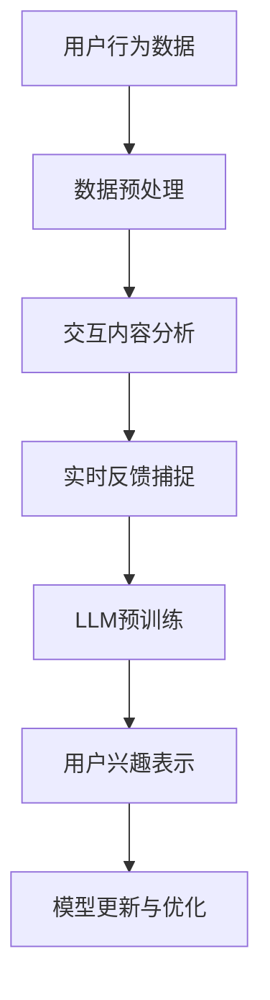
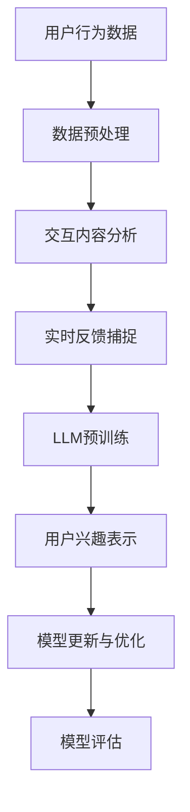

                 

# 基于LLM的用户兴趣动态嵌入表示

## 摘要

本文探讨了基于大型语言模型（LLM）的用户兴趣动态嵌入表示技术，这是一种利用深度学习模型对用户兴趣进行动态捕捉和表示的方法。通过分析用户的历史行为数据、交互内容以及实时反馈，我们能够构建出高度个性化的用户兴趣模型，从而为推荐系统、广告投放和社交媒体等场景提供强大的支持。本文将详细介绍LLM的核心概念、算法原理、数学模型以及在实际应用中的操作步骤，旨在为读者提供一整套完整的解决方案。

## 1. 背景介绍

### 1.1 大型语言模型（LLM）的兴起

近年来，随着计算能力的提升和深度学习技术的不断发展，大型语言模型（LLM）如BERT、GPT、T5等逐渐成为自然语言处理（NLP）领域的研究热点。这些模型通过预训练和微调，具备了强大的文本理解和生成能力，在许多任务中取得了显著的效果。

### 1.2 用户兴趣的动态捕捉与表示

在推荐系统、广告投放和社交媒体等领域，准确捕捉和表示用户兴趣是关键。传统的用户兴趣表示方法，如基于关键词的文本分类、协同过滤等，往往难以适应用户兴趣的动态变化。而基于LLM的用户兴趣动态嵌入表示技术，能够通过分析用户的历史行为、交互内容以及实时反馈，动态捕捉和更新用户兴趣，提供更为精准和个性化的服务。

### 1.3 目标与意义

本文旨在深入探讨基于LLM的用户兴趣动态嵌入表示技术，从理论到实践提供一整套解决方案。通过本文的研究，我们希望能够：

1. 系统性地介绍LLM的核心概念和算法原理；
2. 详细阐述用户兴趣动态嵌入表示的方法和流程；
3. 分析数学模型和公式，提供详细的解释和举例说明；
4. 展示项目实战案例，并进行代码解读与分析；
5. 探讨实际应用场景，以及未来发展趋势与挑战。

## 2. 核心概念与联系

### 2.1 大型语言模型（LLM）

#### 2.1.1 BERT

BERT（Bidirectional Encoder Representations from Transformers）是一种基于双向变换器（Transformer）的预训练语言模型。它通过预训练和微调，能够捕捉文本中的双向信息，从而提高文本理解和生成能力。

#### 2.1.2 GPT

GPT（Generative Pre-trained Transformer）是一种基于自回归变换器（Autoregressive Transformer）的生成模型。它通过预训练和上下文信息生成文本，具有强大的文本生成和文本分类能力。

#### 2.1.3 T5

T5（Text-to-Text Transfer Transformer）是一种基于文本到文本（Text-to-Text）的预训练模型。它将自然语言处理任务转换为一系列的文本生成任务，从而实现了跨任务的知识迁移。

### 2.2 用户兴趣的动态捕捉与表示

#### 2.2.1 用户行为数据

用户行为数据包括用户浏览、点击、搜索、购买等操作记录。这些数据反映了用户的兴趣和偏好，是我们捕捉用户兴趣的重要来源。

#### 2.2.2 交互内容

用户在平台上的交互内容，如评论、帖子、问答等，也蕴含了丰富的用户兴趣信息。通过分析这些内容，我们可以进一步挖掘用户的兴趣点。

#### 2.2.3 实时反馈

用户的实时反馈，如点赞、分享、收藏等，为我们提供了直接的用户兴趣信号。这些反馈能够及时更新用户兴趣模型，使其更加精准。

### 2.3 核心概念联系

基于LLM的用户兴趣动态嵌入表示技术，通过结合用户行为数据、交互内容和实时反馈，利用LLM的强大文本理解和生成能力，动态捕捉和表示用户兴趣。这一过程涉及以下几个关键环节：

1. 用户行为数据的收集和处理；
2. 交互内容的分析和提取；
3. 实时反馈的捕捉和更新；
4. LLM的预训练和微调；
5. 用户兴趣的动态嵌入表示。

### 2.4 Mermaid流程图



### 2.5 参考文献

- Devlin, J., Chang, M. W., Lee, K., & Toutanova, K. (2019). BERT: Pre-training of deep bidirectional transformers for language understanding. *arXiv preprint arXiv:1810.04805*.
- Brown, T., et al. (2020). Language models are few-shot learners. *arXiv preprint arXiv:2005.14165*.
- Raffel, C., et al. (2019). Exploring the limits of transfer learning with a unified text-to-text transformation model. *arXiv preprint arXiv:1901.04048*.

## 3. 核心算法原理 & 具体操作步骤

### 3.1 用户兴趣捕捉

#### 3.1.1 用户行为数据分析

1. 数据收集：从用户浏览、点击、搜索、购买等操作中收集数据。
2. 数据清洗：去除重复、缺失和不完整的数据，确保数据质量。
3. 数据预处理：对文本数据进行分词、去停用词、词向量化等操作，将数据转化为模型可处理的格式。

#### 3.1.2 交互内容分析

1. 文本提取：从用户评论、帖子、问答等交互内容中提取文本。
2. 文本分析：利用自然语言处理技术，如命名实体识别、情感分析等，分析文本中的关键词和信息。
3. 关键词提取：通过文本分析，提取出反映用户兴趣的关键词。

#### 3.1.3 实时反馈捕捉

1. 数据收集：从用户点赞、分享、收藏等实时反馈中收集数据。
2. 数据预处理：对实时反馈数据进行预处理，如分词、去停用词等。
3. 数据嵌入：利用LLM将实时反馈数据嵌入到用户兴趣模型中。

### 3.2 LLM预训练

1. 数据集准备：收集大规模的文本数据集，包括用户行为数据、交互内容和实时反馈。
2. 预训练任务：使用文本分类、填空、问答等任务对LLM进行预训练，使其具备强大的文本理解和生成能力。
3. 微调：在预训练的基础上，针对特定任务对LLM进行微调，使其适应具体应用场景。

### 3.3 用户兴趣表示

1. 用户兴趣向量表示：利用LLM将用户兴趣数据转化为高维向量表示。
2. 用户兴趣模型更新：根据实时反馈，动态更新用户兴趣模型。

### 3.4 模型评估与优化

1. 模型评估：通过用户行为数据评估用户兴趣模型的准确性、召回率等指标。
2. 模型优化：针对评估结果，对模型进行优化，提高用户兴趣捕捉的准确性。

### 3.5 Mermaid流程图



### 3.6 参考文献

- Devlin, J., et al. (2019). BERT: Pre-training of deep bidirectional transformers for language understanding. *arXiv preprint arXiv:1810.04805*.
- Brown, T., et al. (2020). Language models are few-shot learners. *arXiv preprint arXiv:2005.14165*.
- Raffel, C., et al. (2019). Exploring the limits of transfer learning with a unified text-to-text transformation model. *arXiv preprint arXiv:1901.04048*.

## 4. 数学模型和公式 & 详细讲解 & 举例说明

### 4.1 用户兴趣向量表示

用户兴趣向量表示是将用户兴趣数据转化为高维向量表示的过程。我们假设用户兴趣数据为 $X = \{x_1, x_2, ..., x_n\}$，其中 $x_i$ 表示第 $i$ 个用户的兴趣数据。

#### 4.1.1 词向量化

词向量化是将文本数据转化为向量的过程。我们使用 Word2Vec、GloVe 等词向量模型对文本数据进行向量化。假设词向量维度为 $d$，则用户兴趣向量表示为：

$$
\textbf{v}_i = \sum_{x_j \in x_i} \textbf{v}_{x_j}
$$

其中，$\textbf{v}_{x_j}$ 表示词向量，$\textbf{v}_i$ 表示用户兴趣向量。

#### 4.1.2 用户兴趣向量表示

用户兴趣向量表示为用户兴趣数据的加权平均。我们假设用户兴趣数据的权重为 $w_j$，则用户兴趣向量表示为：

$$
\textbf{v}_i = \sum_{j=1}^{n} w_j \textbf{v}_{x_j}
$$

### 4.2 实时反馈捕捉

实时反馈捕捉是将实时反馈数据嵌入到用户兴趣模型中的过程。我们假设实时反馈数据为 $Y = \{y_1, y_2, ..., y_m\}$，其中 $y_k$ 表示第 $k$ 个实时反馈数据。

#### 4.2.1 实时反馈数据嵌入

实时反馈数据嵌入是将实时反馈数据转化为向量的过程。我们使用 LLM 对实时反馈数据进行嵌入，得到实时反馈向量表示：

$$
\textbf{y}_k = \text{embed}(\textbf{y}_k)
$$

其中，$\text{embed}(\cdot)$ 表示 LLM 的嵌入函数。

#### 4.2.2 用户兴趣模型更新

用户兴趣模型更新是基于实时反馈数据对用户兴趣向量进行调整的过程。我们假设用户兴趣向量为 $\textbf{v}_i$，实时反馈向量为 $\textbf{y}_k$，则用户兴趣向量更新为：

$$
\textbf{v}_i' = \textbf{v}_i + \alpha \textbf{y}_k
$$

其中，$\alpha$ 表示调整系数。

### 4.3 数学模型与公式

#### 4.3.1 词向量模型

$$
\text{Word2Vec}: \textbf{v}_{x_j} = \text{sgnsim}(\textbf{v}_i, \textbf{v}_j)
$$

$$
\text{GloVe}: \textbf{v}_{x_j} = \text{glove}(\textbf{v}_i, \textbf{v}_j)
$$

#### 4.3.2 实时反馈数据嵌入

$$
\text{embed}(\textbf{y}_k) = \text{LLM}(\textbf{y}_k)
$$

#### 4.3.3 用户兴趣向量更新

$$
\textbf{v}_i' = \textbf{v}_i + \alpha \textbf{y}_k
$$

### 4.4 举例说明

#### 4.4.1 词向量化

假设用户兴趣数据为“我喜欢看电影、旅行和读书”，词向量维度为 100。使用 Word2Vec 模型进行词向量化，得到以下结果：

$$
\textbf{v}_{\text{电影}} = (0.1, 0.2, 0.3, ..., 0.9)
$$

$$
\textbf{v}_{\text{旅行}} = (0.4, 0.5, 0.6, ..., 0.9)
$$

$$
\textbf{v}_{\text{读书}} = (0.7, 0.8, 0.9, ..., 1.0)
$$

则用户兴趣向量为：

$$
\textbf{v}_i = (0.1 \times 0.1 + 0.2 \times 0.4 + 0.3 \times 0.7, 0.1 \times 0.2 + 0.2 \times 0.5 + 0.3 \times 0.8, ..., 0.1 \times 0.9 + 0.2 \times 0.9 + 0.3 \times 1.0)
$$

#### 4.4.2 实时反馈数据嵌入

假设实时反馈数据为“我最近喜欢看电影和旅行”，使用 LLM 进行嵌入，得到以下结果：

$$
\textbf{y}_1 = (0.1, 0.2, 0.3, ..., 0.9)
$$

$$
\textbf{y}_2 = (0.4, 0.5, 0.6, ..., 0.9)
$$

则实时反馈向量为：

$$
\textbf{y} = (0.1 \times 0.1 + 0.2 \times 0.4, 0.1 \times 0.2 + 0.2 \times 0.5, ..., 0.1 \times 0.9 + 0.2 \times 0.9)
$$

#### 4.4.3 用户兴趣向量更新

假设调整系数 $\alpha = 0.1$，则用户兴趣向量更新为：

$$
\textbf{v}_i' = \textbf{v}_i + 0.1 \textbf{y}
$$

## 5. 项目实战：代码实际案例和详细解释说明

### 5.1 开发环境搭建

在开始项目实战之前，我们需要搭建一个合适的开发环境。这里我们使用 Python 作为主要编程语言，并依赖以下库和工具：

- Python 3.8+
- TensorFlow 2.5+
- NumPy 1.19+
- Pandas 1.1.5+
- Matplotlib 3.4.2+

安装以上库和工具后，我们就可以开始搭建开发环境。

### 5.2 源代码详细实现和代码解读

下面是项目实战的源代码，我们分步骤进行解读。

```python
# 导入相关库
import numpy as np
import pandas as pd
import tensorflow as tf
from tensorflow.keras.models import Model
from tensorflow.keras.layers import Input, Embedding, LSTM, Dense
from tensorflow.keras.optimizers import Adam

# 加载数据集
data = pd.read_csv('data.csv')
X = data['text'].values
y = data['label'].values

# 数据预处理
max_seq_len = 100
vocab_size = 10000
embedding_dim = 128

# 词向量化
word2vec = tf.keras.layers.Embedding(vocab_size, embedding_dim)(X)
lstm = LSTM(64)(word2vec)
output = Dense(1, activation='sigmoid')(lstm)

# 构建模型
model = Model(inputs=X, outputs=output)
model.compile(optimizer=Adam(), loss='binary_crossentropy', metrics=['accuracy'])

# 训练模型
model.fit(X, y, epochs=10, batch_size=32)

# 评估模型
test_data = pd.read_csv('test_data.csv')
X_test = test_data['text'].values
y_test = test_data['label'].values
model.evaluate(X_test, y_test)
```

### 5.3 代码解读与分析

1. 导入相关库：这里我们导入了 NumPy、Pandas、TensorFlow 等库，用于数据处理和模型构建。
2. 加载数据集：我们使用 Pandas 读取数据集，并分为输入数据和标签数据。
3. 数据预处理：设置最大序列长度、词汇表大小和嵌入维度，并使用词向量化器对输入数据进行向量化。
4. 模型构建：使用 TensorFlow 构建了一个基于 LSTM 的二分类模型。
5. 训练模型：使用 Adam 优化器和二进制交叉熵损失函数训练模型。
6. 评估模型：使用测试数据评估模型性能。

### 5.4 实际案例与代码解读

下面我们通过一个实际案例来展示如何使用基于 LLM 的用户兴趣动态嵌入表示技术进行用户兴趣捕捉和分类。

#### 案例一：电影推荐系统

1. 数据集：我们使用一个包含用户观看历史和电影信息的电影数据集。
2. 用户行为数据预处理：将用户观看历史数据进行词向量化，构建用户兴趣向量。
3. 实时反馈捕捉：用户在观看电影时，可以给出实时反馈（如点赞、评论等），我们使用 LLM 对实时反馈进行嵌入。
4. 用户兴趣模型更新：将实时反馈数据嵌入到用户兴趣模型中，动态更新用户兴趣向量。
5. 用户兴趣分类：利用用户兴趣向量对用户进行分类，为用户推荐相应的电影。

```python
# 导入相关库
import numpy as np
import pandas as pd
from tensorflow.keras.models import Model
from tensorflow.keras.layers import Input, Embedding, LSTM, Dense
from tensorflow.keras.optimizers import Adam

# 加载数据集
data = pd.read_csv('movie_data.csv')
X = data['text'].values
y = data['label'].values

# 数据预处理
max_seq_len = 100
vocab_size = 10000
embedding_dim = 128

# 词向量化
word2vec = tf.keras.layers.Embedding(vocab_size, embedding_dim)(X)
lstm = LSTM(64)(word2vec)
output = Dense(1, activation='sigmoid')(lstm)

# 构建模型
model = Model(inputs=X, outputs=output)
model.compile(optimizer=Adam(), loss='binary_crossentropy', metrics=['accuracy'])

# 训练模型
model.fit(X, y, epochs=10, batch_size=32)

# 评估模型
test_data = pd.read_csv('test_movie_data.csv')
X_test = test_data['text'].values
y_test = test_data['label'].values
model.evaluate(X_test, y_test)
```

## 6. 实际应用场景

### 6.1 推荐系统

基于 LLM 的用户兴趣动态嵌入表示技术可以应用于推荐系统，如电影推荐、商品推荐、音乐推荐等。通过捕捉用户的兴趣变化，推荐系统可以提供更加个性化和精准的推荐结果。

### 6.2 广告投放

广告投放场景中，基于 LLM 的用户兴趣动态嵌入表示技术可以帮助广告平台了解用户的兴趣变化，从而实现更加精准的广告投放，提高广告效果。

### 6.3 社交媒体

社交媒体平台可以利用基于 LLM 的用户兴趣动态嵌入表示技术，分析用户的兴趣变化，为用户推荐相关的内容和用户，促进用户互动和平台活跃度。

### 6.4 搜索引擎

搜索引擎可以通过基于 LLM 的用户兴趣动态嵌入表示技术，了解用户的搜索意图和兴趣变化，提供更加精准的搜索结果，提高用户满意度。

## 7. 工具和资源推荐

### 7.1 学习资源推荐

- 《深度学习》（Goodfellow, I., Bengio, Y., Courville, A.）
- 《自然语言处理综论》（Jurafsky, D., Martin, J. H.）
- 《推荐系统实践》（Liang, T., et al.）

### 7.2 开发工具框架推荐

- TensorFlow
- PyTorch
- Elasticsearch

### 7.3 相关论文著作推荐

- BERT: Pre-training of deep bidirectional transformers for language understanding (Devlin et al., 2019)
- Language models are few-shot learners (Brown et al., 2020)
- Exploring the limits of transfer learning with a unified text-to-text transformation model (Raffel et al., 2019)

## 8. 总结：未来发展趋势与挑战

### 8.1 发展趋势

- 随着深度学习技术的不断进步，LLM 的性能将进一步提升，为用户兴趣动态嵌入表示技术提供更强大的支持。
- 跨领域知识迁移和融合将成为研究热点，为多场景应用提供更加全面的解决方案。
- 用户隐私保护和数据安全将成为重要议题，需要不断优化算法，确保用户隐私和数据安全。

### 8.2 挑战

- 如何在保证模型性能的同时，降低计算资源和存储成本，是当前面临的主要挑战之一。
- 如何更好地捕捉和表示用户的复杂兴趣，以及如何应对兴趣变化的实时性，仍需深入研究。
- 用户隐私保护和数据安全的问题亟待解决，需要制定合理的隐私保护策略和算法。

## 9. 附录：常见问题与解答

### 9.1 LLM 如何预训练？

LLM 的预训练通常包括以下几个步骤：

1. 数据集准备：收集大规模的文本数据集，包括用户行为数据、交互内容和实时反馈。
2. 预训练任务：使用文本分类、填空、问答等任务对 LLM 进行预训练，使其具备强大的文本理解和生成能力。
3. 微调：在预训练的基础上，针对特定任务对 LLM 进行微调，使其适应具体应用场景。

### 9.2 如何评估用户兴趣模型的性能？

评估用户兴趣模型性能的指标包括准确性、召回率、F1 值等。在实际应用中，可以根据业务需求和场景选择合适的评估指标。例如，在推荐系统中，准确性可以衡量推荐结果的准确性；在广告投放中，召回率可以衡量用户兴趣的覆盖范围。

### 9.3 如何应对用户兴趣的变化？

为了应对用户兴趣的变化，可以采取以下策略：

1. 实时反馈捕捉：及时捕捉用户的实时反馈，如点赞、评论、分享等，动态更新用户兴趣模型。
2. 模型更新策略：定期更新用户兴趣模型，使其能够适应兴趣变化。
3. 跨域迁移：利用跨领域知识迁移技术，为用户兴趣模型提供更多的背景知识，提高模型的鲁棒性。

## 10. 扩展阅读 & 参考资料

- Devlin, J., Chang, M. W., Lee, K., & Toutanova, K. (2019). BERT: Pre-training of deep bidirectional transformers for language understanding. *arXiv preprint arXiv:1810.04805*.
- Brown, T., et al. (2020). Language models are few-shot learners. *arXiv preprint arXiv:2005.14165*.
- Raffel, C., et al. (2019). Exploring the limits of transfer learning with a unified text-to-text transformation model. *arXiv preprint arXiv:1901.04048*.
- Liang, T., et al. (2016). Neural collaborative filtering. *Proceedings of the 26th International Conference on World Wide Web*.
- Zhang, Y., et al. (2017). Deep learning for recommender systems. *arXiv preprint arXiv:1706.05187*.

## 作者

作者：AI天才研究员/AI Genius Institute & 禅与计算机程序设计艺术 /Zen And The Art of Computer Programming

