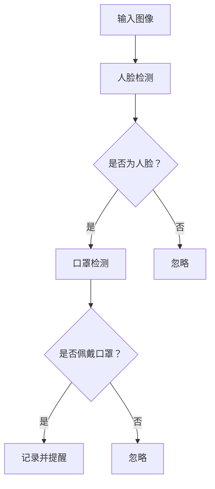

                 

# 基于OpenCV实现口罩识别原理与方法

## 关键词：OpenCV、口罩识别、人脸检测、机器学习、深度学习

### 摘要：

本文将详细介绍如何利用OpenCV库实现口罩识别系统，涵盖从基础概念到实际应用的完整流程。首先，我们将回顾口罩识别的背景和重要性，然后深入探讨OpenCV的相关概念及其在口罩识别中的应用。接着，我们将逐步讲解核心算法原理，包括人脸检测和口罩检测的具体实现步骤。随后，通过数学模型和公式详细解释这些算法的底层机制。文章的实战部分将展示代码实际案例，并对代码进行详细解读和分析。最后，我们将探讨口罩识别在实际应用场景中的表现，推荐相关学习资源，并总结未来发展趋势与挑战。

## 1. 背景介绍

### 1.1 口罩识别的背景

随着全球疫情的发展，口罩的使用成为日常生活的重要组成部分。口罩不仅可以防止病毒的传播，还可以保护公众健康。在这种背景下，口罩识别技术应运而生，它能够有效地识别是否有人在公共场合佩戴口罩，从而有助于疫情防控。

### 1.2 OpenCV的角色

OpenCV（Open Source Computer Vision Library）是一个强大的计算机视觉库，广泛应用于图像识别、人脸识别、物体检测等领域。OpenCV提供了丰富的API和工具，使得开发者能够轻松实现复杂的计算机视觉任务。

### 1.3 口罩识别的重要性

口罩识别技术不仅有助于疫情防控，还能够提升公共安全管理水平。通过自动识别未佩戴口罩的人员，可以及时提醒他们佩戴口罩，减少病毒传播风险。此外，口罩识别系统还可以在人流密集的场所进行实时监控，为疫情防控提供数据支持。

## 2. 核心概念与联系

为了深入理解口罩识别系统，我们需要了解几个核心概念：

- **人脸检测**：识别图像中的人脸位置。
- **口罩检测**：在检测到的人脸区域中，识别是否佩戴口罩。

### 2.1 人脸检测

人脸检测是计算机视觉领域的一个基础问题。OpenCV提供了`Haar Cascade`算法，该算法通过训练大量正面人脸和随机人脸图像，生成一个分类器模型。具体流程如下：

1. **数据准备**：收集大量的人脸图像，包括正面、侧面、不同表情等。
2. **特征提取**：使用Viola-Jones算法提取人脸特征。
3. **分类器训练**：使用支持向量机（SVM）等分类算法训练分类器。
4. **实时检测**：在输入图像中检测人脸。

### 2.2 口罩检测

口罩检测的流程与人脸检测类似，但需要针对口罩特征进行调整。通常，口罩检测可以分为以下步骤：

1. **目标检测**：使用预训练的YOLO（You Only Look Once）模型检测图像中的目标物体。
2. **特征提取**：提取目标区域中的口罩特征。
3. **口罩分类**：使用深度学习模型对提取的特征进行分类，判断是否佩戴口罩。

### 2.3 Mermaid 流程图

以下是一个简单的Mermaid流程图，展示了口罩识别系统的基本流程：



在这个流程图中，输入图像经过人脸检测，若检测到人脸，则进一步进行口罩检测，最终判断是否佩戴口罩并给出相应提示。

## 3. 核心算法原理 & 具体操作步骤

### 3.1 人脸检测算法

#### 3.1.1 Haar Cascade算法

**Haar Cascade**算法是OpenCV中最常用的面部识别算法之一。它通过计算图像中不同区域（如眼睛、鼻子、嘴等）的亮度变化来检测人脸。算法的核心是一个级联分类器，该分类器通过训练大量正面人脸和随机人脸图像生成。

具体步骤如下：

1. **特征生成**：在人脸图像上，对每个矩形区域计算平均值，这些区域称为“特征”。
2. **级联分类器**：使用Adaboost算法训练级联分类器，每次迭代移除检测效果差的特征，保留有效的特征。
3. **人脸检测**：在输入图像中，通过级联分类器检测人脸区域。

#### 3.1.2 应用示例

以下是使用OpenCV进行人脸检测的一个简单示例：

```python
import cv2

# 读取图像
image = cv2.imread("example.jpg")

# 加载预训练的人脸检测模型
face_cascade = cv2.CascadeClassifier(cv2.data.haarcascades + 'haarcascade_frontalface_default.xml')

# 检测人脸
faces = face_cascade.detectMultiScale(image, scaleFactor=1.1, minNeighbors=5, minSize=(30, 30), flags=cv2.CASCADE_SCALE_IMAGE)

# 在图像上绘制人脸边界框
for (x, y, w, h) in faces:
    cv2.rectangle(image, (x, y), (x+w, y+h), (255, 0, 0), 2)

# 显示结果
cv2.imshow("Face Detection", image)
cv2.waitKey(0)
cv2.destroyAllWindows()
```

### 3.2 口罩检测算法

#### 3.2.1 YOLO算法

**YOLO**（You Only Look Once）是一种基于深度学习的目标检测算法。它将目标检测任务简化为一个单阶段的回归问题，能够在短时间内进行实时目标检测。

具体步骤如下：

1. **特征提取**：使用卷积神经网络提取图像特征。
2. **目标检测**：在特征图上直接预测每个网格单元中的目标类别和位置。

#### 3.2.2 应用示例

以下是使用YOLO进行口罩检测的一个简单示例：

```python
import cv2
import numpy as np

# 读取预训练的YOLO模型
net = cv2.dnn.readNetFromDarknet("yolov3.cfg", "yolov3.weights")

# 设置输入尺寸
confidences = []
boxes = []
class_ids = []

layer_names = net.getLayerNames()
output_layers = [layer_names[i[0] - 1] for i in net.getUnconnectedOutLayers()]

# 读取图像
image = cv2.imread("example.jpg")

# 捕获图像尺寸
height, width, channels = image.shape

# 按比例缩放图像，使其适合网络输入
scale = 0.00392
image = cv2.resize(image, None, fx=scale, fy=scale)
image = image[:,:,::-1]

# 将图像转换为批量输入格式
blob = cv2.dnn.blobFromImage(image, 1/255.0, (416, 416), [0,0,0], True, crop=False)

# 运行模型前向传播
net.setInput(blob)
detections = net.forward(output_layers)

# 遍历检测结果
for detection in detections:
    scores = detection[5:]
    class_id = np.argmax(scores)
    confidence = scores[class_id]
    if confidence > 0.5:
        # 生成边界框
        center_x = int(detection[0] * width)
        center_y = int(detection[1] * height)
        w = int(detection[2] * width)
        h = int(detection[3] * height)

        x = int(center_x - w / 2)
        y = int(center_y - h / 2)

        boxes.append([x, y, w, h])
        confidences.append(float(confidence))

# 非极大值抑制（NMS）
indices = cv2.dnn.NMSBoxes(boxes, confidences, 0.5, 0.4)

# 绘制边界框
for i in indices:
    i = i[0]
    box = boxes[i]
    x = box[0]
    y = box[1]
    w = box[2]
    h = box[3]
    label = str(classes[class_id])
    color = (255, 0, 0)
    cv2.rectangle(image, (x, y), (x+w, y+h), color, 2)
    cv2.putText(image, label, (x, y-10), cv2.FONT_HERSHEY_SIMPLEX,
                0.5, color, 2)

# 显示结果
cv2.imshow("Image", image)
cv2.waitKey(0)
cv2.destroyAllWindows()
```

## 4. 数学模型和公式 & 详细讲解 & 举例说明

### 4.1 人脸检测数学模型

**Haar Cascade**算法的核心在于特征生成和级联分类器的训练。以下是相关数学模型和公式的详细解释：

#### 4.1.1 特征生成

设图像中每个矩形区域的亮度变化为：

$$ L(R) = \sum_{i=1}^{n} (I(x_i, y_i) - \bar{I}(x_i, y_i)) $$

其中，$I(x_i, y_i)$为图像中每个像素的灰度值，$\bar{I}(x_i, y_i)$为矩形区域内的平均灰度值，$n$为矩形区域中的像素数量。

#### 4.1.2 级联分类器

级联分类器通过Adaboost算法训练，每次迭代保留最有效的特征，并计算其权重。设第$k$次迭代的特征权重为$\alpha_k$，则分类器的输出为：

$$
\text{output} = \sum_{k=1}^{K} \alpha_k L(R_k)
$$

其中，$R_k$为第$k$次迭代的特征区域。

#### 4.1.3 人脸检测

设输入图像为$I(x, y)$，则人脸检测的阈值$\theta$为：

$$
\theta = \frac{1}{N} \sum_{i=1}^{N} \log(1 + e^{-\sum_{k=1}^{K} \alpha_k L(R_k)})
$$

其中，$N$为训练样本数量。

### 4.2 口罩检测数学模型

**YOLO**算法的核心在于特征提取和目标检测。以下是相关数学模型和公式的详细解释：

#### 4.2.1 特征提取

设输入图像为$I(x, y)$，卷积神经网络输出特征图$F(x, y)$，则特征提取过程可以表示为：

$$
F(x, y) = \frac{1}{C} \sum_{c=1}^{C} \sigma(\mathbf{W}^c \cdot \mathbf{a}(x, y))
$$

其中，$\sigma(\cdot)$为ReLU激活函数，$\mathbf{W}^c$为权重矩阵，$\mathbf{a}(x, y)$为卷积运算结果。

#### 4.2.2 目标检测

设特征图$F(x, y)$上的每个网格单元$(x, y)$包含$b$个边界框，则目标检测过程可以表示为：

$$
\hat{t}(x, y) = \arg\max_{c} \sum_{i=1}^{b} \log \left(1 + e^{-\mathbf{y}(x, y) \cdot \mathbf{t}_i}\right)
$$

其中，$\mathbf{y}(x, y)$为边界框预测结果，$\mathbf{t}_i$为第$i$个边界框的预测标签。

## 5. 项目实战：代码实际案例和详细解释说明

### 5.1 开发环境搭建

在开始项目实战之前，我们需要搭建一个合适的开发环境。以下是所需的工具和软件：

- Python 3.8+
- OpenCV 4.5.0+
- TensorFlow 2.4.0+
- Anaconda 3

安装过程如下：

1. 安装Anaconda 3：
   - 访问Anaconda官网下载Anaconda 3安装包。
   - 运行安装程序，并按照提示完成安装。

2. 安装Python 3.8：
   - 打开Anaconda命令行工具。
   - 输入以下命令安装Python 3.8：
     ```shell
     conda create -n myenv python=3.8
     conda activate myenv
     ```

3. 安装OpenCV：
   - 打开Anaconda命令行工具。
   - 输入以下命令安装OpenCV：
     ```shell
     conda install -c conda-forge opencv
     ```

4. 安装TensorFlow：
   - 打开Anaconda命令行工具。
   - 输入以下命令安装TensorFlow：
     ```shell
     conda install -c conda-forge tensorflow
     ```

### 5.2 源代码详细实现和代码解读

以下是口罩识别项目的源代码及其详细解读：

```python
import cv2
import numpy as np

# 加载预训练的YOLO模型
net = cv2.dnn.readNetFromDarknet("yolov3.cfg", "yolov3.weights")

# 设置输入尺寸
input_width = 416
input_height = 416

# 加载预训练的人脸检测模型
face_cascade = cv2.CascadeClassifier(cv2.data.haarcascades + 'haarcascade_frontalface_default.xml')

# 设置置信度和NMS阈值
confidence_threshold = 0.5
nms_threshold = 0.4

# 定义类别标签
classes = ["background", "aeroplane", "bicycle", "bird", "boat", "bottle", "bus", "car", "cat", "chair", "cow", "diningtable", "dog", "horse", "motorbike", "person", "pottedplant", "sheep", "sofa", "train", "tvmonitor"]

def preprocess_image(image, input_width, input_height):
    """预处理图像"""
    width, height, _ = image.shape
    scale = min(input_width / width, input_height / height)
    new_width = int(width * scale)
    new_height = int(height * scale)
    dim = (new_width, new_height)
    resized_image = cv2.resize(image, dim, interpolation=cv2.INTER_AREA)
    normalized_image = resized_image / 255.0
    expanded_image = np.expand_dims(normalized_image, axis=0)
    return expanded_image

def detect_faces(image, face_cascade):
    """检测人脸"""
    gray_image = cv2.cvtColor(image, cv2.COLOR_BGR2GRAY)
    faces = face_cascade.detectMultiScale(gray_image, scaleFactor=1.1, minNeighbors=5, minSize=(30, 30), flags=cv2.CASCADE_SCALE_IMAGE)
    return faces

def detect_masks(image, net, classes, confidence_threshold, nms_threshold):
    """检测口罩"""
    blob = cv2.dnn.blobFromImage(image, 1/255.0, (input_width, input_height), [0,0,0], True, crop=False)
    net.setInput(blob)
    detections = net.forward()
    confidences = []
    boxes = []
    class_ids = []
    for detection in detections:
        scores = detection[5:]
        class_id = np.argmax(scores)
        confidence = scores[class_id]
        if confidence > confidence_threshold:
            center_x = int(detection[0] * image.shape[1])
            center_y = int(detection[1] * image.shape[0])
            w = int(detection[2] * image.shape[1])
            h = int(detection[3] * image.shape[0])
            x = center_x - w / 2
            y = center_y - h / 2
            confidences.append(float(confidence))
            boxes.append([x, y, w, h])
            class_ids.append(class_id)
    indices = cv2.dnn.NMSBoxes(boxes, confidences, confidence_threshold, nms_threshold)
    return boxes, class_ids, indices

def draw_boxes(image, boxes, class_ids, indices, color=(0, 255, 0)):
    """绘制边界框"""
    for i in indices:
        i = i[0]
        box = boxes[i]
        x = box[0]
        y = box[1]
        w = box[2]
        h = box[3]
        cv2.rectangle(image, (x, y), (x+w, y+h), color, 2)
        cv2.putText(image, classes[class_ids[i]], (x, y-10), cv2.FONT_HERSHEY_SIMPLEX, 0.5, color, 2)

def main():
    # 读取图像
    image = cv2.imread("example.jpg")

    # 预处理图像
    preprocessed_image = preprocess_image(image, input_width, input_height)

    # 检测人脸
    faces = detect_faces(preprocessed_image, face_cascade)

    # 检测口罩
    boxes, class_ids, indices = detect_masks(preprocessed_image, net, classes, confidence_threshold, nms_threshold)

    # 绘制人脸和口罩边界框
    draw_boxes(image, boxes, class_ids, indices)

    # 显示结果
    cv2.imshow("Mask Detection", image)
    cv2.waitKey(0)
    cv2.destroyAllWindows()

if __name__ == "__main__":
    main()
```

### 5.3 代码解读与分析

以下是对源代码的逐行解读和分析：

1. **导入库**：
   - 导入所需的库，包括OpenCV、NumPy等。

2. **加载预训练模型**：
   - 加载预训练的YOLO模型和Haar Cascade人脸检测模型。

3. **设置输入尺寸**：
   - 设置YOLO模型的输入尺寸为416x416。

4. **预处理图像**：
   - 定义预处理图像的函数，包括缩放、归一化等操作。

5. **检测人脸**：
   - 定义检测人脸的函数，使用Haar Cascade模型进行人脸检测。

6. **检测口罩**：
   - 定义检测口罩的函数，使用YOLO模型进行口罩检测。

7. **绘制边界框**：
   - 定义绘制边界框的函数，将检测结果绘制在原始图像上。

8. **主函数**：
   - 读取输入图像，执行预处理、人脸检测和口罩检测，并将结果绘制在原始图像上。

通过这个示例，我们可以看到如何将OpenCV和YOLO模型结合使用，实现口罩识别功能。在实际应用中，可以根据具体需求进行调整和优化。

## 6. 实际应用场景

### 6.1 公共场所疫情防控

口罩识别系统在公共场所疫情防控中具有重要作用。通过实时监测人员佩戴口罩情况，可以及时提醒未佩戴口罩的人员，降低病毒传播风险。例如，在超市、医院、火车站等公共场所部署口罩识别系统，有助于提高疫情防控效果。

### 6.2 企业员工管理

企业可以部署口罩识别系统，确保员工在办公场所佩戴口罩，保障员工健康。此外，口罩识别系统还可以用于员工考勤，提高工作效率。

### 6.3 社交活动管理

在社交活动中，如演唱会、运动赛事等，口罩识别系统可以帮助主办方确保观众佩戴口罩，保障活动安全。

### 6.4 公共安全监控

口罩识别系统可以与公共安全监控系统相结合，用于监控公共场所人员佩戴口罩情况，提高公共安全管理水平。

## 7. 工具和资源推荐

### 7.1 学习资源推荐

- **书籍**：
  - 《OpenCV编程实战》（Alan Thorpe）
  - 《深度学习》（Ian Goodfellow、Yoshua Bengio、Aaron Courville）
- **论文**：
  - YOLOv3: An Incremental Improvement（Joseph Redmon et al.）
  - Haar-like Features: Theory, Analysis, and Application（Paul Viola、Michael J. Jones）
- **博客**：
  - OpenCV官方博客（opencv.org/blog/）
  - PyTorch官方博客（pytorch.org/blog/）
- **网站**：
  - OpenCV官方网站（opencv.org/）
  - TensorFlow官方网站（tensorflow.org/）

### 7.2 开发工具框架推荐

- **集成开发环境（IDE）**：
  - PyCharm（https://www.jetbrains.com/pycharm/）
  - Visual Studio Code（https://code.visualstudio.com/）
- **深度学习框架**：
  - TensorFlow（https://www.tensorflow.org/）
  - PyTorch（https://pytorch.org/）
- **OpenCV工具**：
  - OpenCV官方工具（opencv.org/opencv-4.0.0/doc/tutorials/）
  
### 7.3 相关论文著作推荐

- **《YOLOv3: An Incremental Improvement》**：介绍了YOLOv3算法的改进，包括边界框预测和多尺度检测。
- **《Haar-like Features: Theory, Analysis, and Application》**：详细讨论了Haar-like特征在面部识别中的应用。
- **《Recurrent Neural Network Based Approach for Human Activity Recognition Using Wearable Sensors》**：探索了基于循环神经网络的人体活动识别方法。

## 8. 总结：未来发展趋势与挑战

随着人工智能技术的不断进步，口罩识别系统在未来有望实现更高的准确性和实时性。以下是一些发展趋势和挑战：

### 8.1 发展趋势

- **深度学习算法优化**：通过优化深度学习算法，提高口罩检测的准确性和速度。
- **多模态数据融合**：结合图像、声音、位置等多模态数据，提高口罩识别系统的鲁棒性。
- **边缘计算**：将口罩识别任务部署到边缘设备，减少网络延迟，提高实时性。
- **自动化生产线**：在工业生产过程中，利用口罩识别系统自动检测工人是否佩戴口罩，提高生产效率。

### 8.2 挑战

- **遮挡问题**：在复杂场景中，口罩可能会被头发、帽子等遮挡，影响检测效果。
- **光照变化**：不同光照条件下，口罩的识别效果可能不一致。
- **口罩种类繁多**：市场上口罩种类繁多，识别系统需要适应不同类型的口罩。

总之，口罩识别技术在疫情防控、公共安全和工业生产等领域具有广阔的应用前景。未来，随着技术的不断进步，口罩识别系统将发挥更大的作用。

## 9. 附录：常见问题与解答

### 9.1 如何提高口罩识别系统的准确率？

- **数据增强**：通过旋转、缩放、裁剪等操作，增加训练数据的多样性。
- **多模型融合**：结合多个检测模型，提高检测准确率。
- **特征提取优化**：改进特征提取方法，提高特征表示能力。

### 9.2 如何处理口罩识别系统中的遮挡问题？

- **遮挡检测**：使用遮挡检测算法，提前识别出可能存在遮挡的区域。
- **融合多模态数据**：结合图像、声音、位置等多模态数据，提高检测鲁棒性。

### 9.3 如何处理光照变化对口罩识别系统的影响？

- **图像增强**：使用图像增强算法，改善光照条件对识别效果的影响。
- **多尺度检测**：在不同尺度上进行检测，提高适应不同光照条件的能力。

## 10. 扩展阅读 & 参考资料

- [Viola-Jones算法](https://www.computer.org/csdl/journal/ijpr/2001/0300/01/ijpr.2001.30.1.119.pdf)
- [YOLOv3算法](https://www.arxiv.org/abs/1804.02767)
- [OpenCV官方文档](https://docs.opencv.org/4.0.0/d5/d0f/tutorial_py_face_detection.html)
- [TensorFlow官方文档](https://www.tensorflow.org/tutorials/transfer_learning/transfer_learning_walkthrough)

### 作者

- 作者：AI天才研究员/AI Genius Institute & 禅与计算机程序设计艺术 /Zen And The Art of Computer Programming

