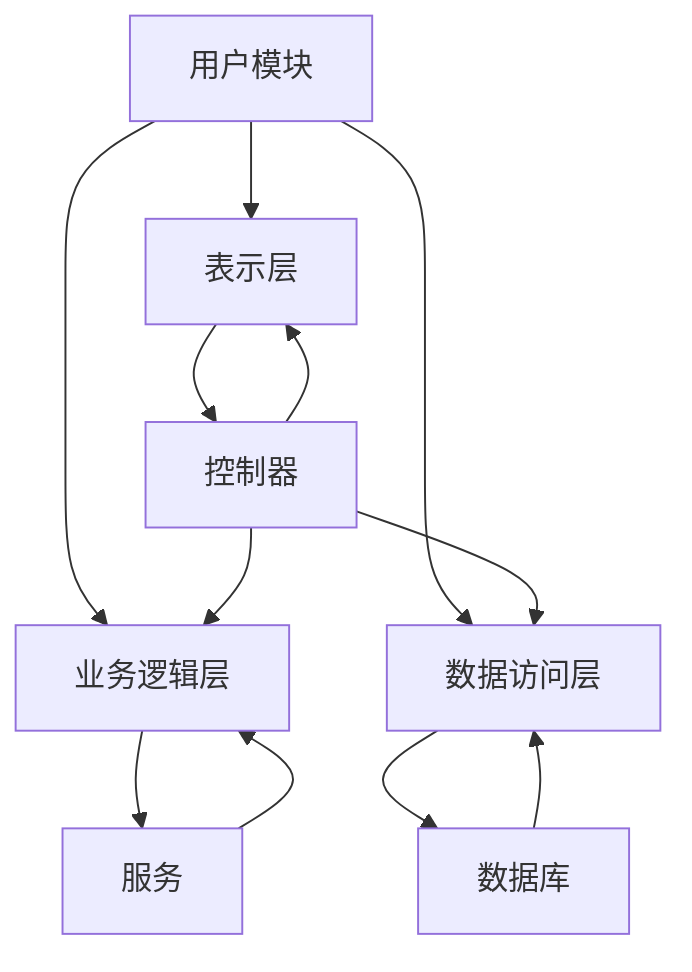

                 

# 基于SSM的智慧社区服务管理系统的设计与实现

## 摘要

本文旨在深入探讨基于SSM（Struts2、Spring、MyBatis）架构的智慧社区服务管理系统的设计与实现。随着信息技术的不断发展，智慧社区作为智慧城市建设的重要组成部分，逐渐成为现代城市管理的重要方向。本文首先介绍了智慧社区的概念及其在智慧城市建设中的重要性。接着，详细阐述了基于SSM架构的智慧社区服务管理系统的设计理念和架构体系。随后，通过逐步分析核心算法原理、数学模型和公式、以及项目实战中的代码实际案例和详细解释，深入探讨了系统的具体实现方法。最后，本文对智慧社区服务管理系统的实际应用场景进行了探讨，并推荐了相关的学习资源、开发工具框架和相关论文著作。通过本文的阅读，读者将对基于SSM架构的智慧社区服务管理系统有更深入的理解。

## 1. 背景介绍

### 1.1 智慧社区的概念

智慧社区，又称智能社区，是指通过信息技术、网络技术、物联网技术等手段，实现社区管理的智能化、便捷化、高效化的一种新型社区模式。智慧社区不仅包括了传统的物业管理、安防监控、停车管理等功能，还涵盖了居民生活服务、社区医疗、教育、娱乐等多方面内容。

### 1.2 智慧社区在智慧城市建设中的重要性

随着城市化进程的加快，城市人口规模不断增大，城市管理的难度和复杂性也逐步提升。智慧社区作为智慧城市建设的重要组成部分，能够有效提高城市管理的效率，提升居民的生活质量。智慧社区通过整合各种资源和信息，实现城市管理的精细化、智能化和人性化，有助于构建和谐宜居的智慧城市。

### 1.3 SSM架构简介

SSM架构是指Struts2、Spring、MyBatis这三个开源框架的组合。Struts2负责web层的开发，Spring负责业务逻辑层和应用程序的配置管理，MyBatis负责数据持久层的操作。SSM架构具有开发效率高、扩展性强、稳定可靠等特点，在当前的企业级应用开发中得到了广泛应用。

### 1.4 基于SSM架构的智慧社区服务管理系统设计

基于SSM架构的智慧社区服务管理系统旨在实现社区管理的信息化、智能化和高效化。系统设计主要包括以下几个方面：

1. **用户模块**：提供用户注册、登录、个人信息管理等功能。

2. **物业管理模块**：包括物业报修、物业通知、费用缴纳、停车管理等功能。

3. **社区服务模块**：提供社区医疗、教育、娱乐等服务信息。

4. **安防监控模块**：实现社区安防监控、报警等功能。

5. **数据统计与分析模块**：对社区各类数据进行统计分析，为决策提供支持。

## 2. 核心概念与联系

### 2.1 核心概念

1. **MVC模式**：MVC（Model-View-Controller）模式是一种常用的软件设计模式，将应用程序分为三个主要组件：模型（Model）、视图（View）和控制器（Controller）。模型负责业务逻辑和数据处理，视图负责界面展示，控制器负责处理用户输入和协调模型与视图之间的交互。

2. **三层架构**：三层架构是指将应用程序分为表示层、业务逻辑层和数据访问层。表示层负责界面展示，业务逻辑层负责业务逻辑处理，数据访问层负责与数据库的交互。

3. **Struts2**：Struts2是一个基于MVC模式的Web应用框架，用于开发复杂的企业级Web应用程序。

4. **Spring**：Spring是一个开源的企业级Java开发框架，用于实现业务逻辑层的配置管理和依赖注入。

5. **MyBatis**：MyBatis是一个数据持久层框架，用于实现数据访问层的操作。

### 2.2 架构联系

基于SSM架构的智慧社区服务管理系统采用了三层架构和MVC模式。系统架构图如下所示：

```
+-------------------+
|   用户模块        |
+-------------------+
           |
           |
           |
           |
  +--------+--------+
  |       表示层       |
  +--------+--------+
           |
           |
           |
  +--------+--------+
  |   业务逻辑层     |
  +--------+--------+
           |
           |
           |
  +--------+--------+
  | 数据访问层     |
  +--------+--------+
           |
           |
           |
+-------------------+
|   数据库管理系统   |
+-------------------+
```

1. **表示层**：使用Struts2框架实现，负责处理用户的请求、生成响应页面。

2. **业务逻辑层**：使用Spring框架实现，负责业务逻辑的处理和配置管理。

3. **数据访问层**：使用MyBatis框架实现，负责与数据库的交互和数据持久化操作。

### 2.3 Mermaid 流程图

以下是基于SSM架构的智慧社区服务管理系统核心概念的 Mermaid 流程图：



在流程图中，A 表示用户模块，B 表示表示层，C 表示业务逻辑层，D 表示数据访问层，E 表示控制器，F 表示服务，G 表示数据库。流程图展示了各个模块之间的交互关系。

### 2.4 核心概念总结

1. **MVC模式**：通过将应用程序分为模型、视图和控制器三个组件，实现应用程序的模块化和可维护性。

2. **三层架构**：将应用程序分为表示层、业务逻辑层和数据访问层，提高应用程序的可扩展性和可维护性。

3. **Struts2**：用于实现表示层，处理用户请求和生成响应页面。

4. **Spring**：用于实现业务逻辑层，负责业务逻辑的处理和配置管理。

5. **MyBatis**：用于实现数据访问层，负责与数据库的交互和数据持久化操作。

通过以上核心概念和架构的介绍，读者可以对基于SSM架构的智慧社区服务管理系统有一个初步的认识。在接下来的章节中，我们将深入探讨系统的具体实现方法和核心算法原理。

## 3. 核心算法原理 & 具体操作步骤

### 3.1 Struts2框架工作原理

Struts2是一个基于MVC模式的Web应用框架，其核心组件包括拦截器（Interceptor）和动作映射（ActionMapping）。下面是Struts2框架的基本工作原理：

1. **拦截器**：拦截器是Struts2框架的核心组件之一，用于在请求处理过程中对请求进行预处理和后处理。拦截器分为默认拦截器和自定义拦截器。默认拦截器负责处理用户的请求，并将请求转发到相应的控制器；自定义拦截器可以根据需要添加额外的处理逻辑。

2. **动作映射**：动作映射负责将用户的请求映射到具体的控制器（Action）上。在Struts2框架中，动作映射是通过配置文件（struts.xml）来实现的。动作映射包括路径映射（path）和动作类（class）映射。当用户访问某个路径时，Struts2框架会根据配置文件中的动作映射找到对应的控制器类，并调用其中的执行方法（execute方法）。

具体操作步骤如下：

1. 用户发送请求，请求路径为`/example/action.do`。

2. Struts2框架通过拦截器对请求进行预处理，如检查用户身份、权限等。

3. Struts2框架根据请求路径，查找配置文件（struts.xml）中的动作映射。

4. 根据动作映射，找到对应的控制器类（例如`ExampleAction`）。

5. Struts2框架通过反射机制调用控制器类的执行方法（execute方法）。

6. 控制器执行业务逻辑，并将处理结果返回。

7. Struts2框架将处理结果转发到相应的视图页面。

### 3.2 Spring框架工作原理

Spring框架是一个开源的企业级Java开发框架，主要用于实现业务逻辑层的配置管理和依赖注入。Spring框架的工作原理如下：

1. **IoC容器**：IoC（控制反转）容器是Spring框架的核心组件，负责管理应用程序中的对象及其依赖关系。IoC容器通过配置文件（XML、注解等）或编程方式（Java配置）创建和管理对象。

2. **依赖注入**：依赖注入是IoC容器的一种实现方式，用于将对象之间的依赖关系注入到应用程序中。依赖注入分为三种类型：构造器注入、设值注入和接口注入。

具体操作步骤如下：

1. 创建配置文件（applicationContext.xml），定义对象及其依赖关系。

2. 启动Spring容器，加载配置文件。

3. Spring容器通过反射机制创建和管理对象。

4. 对象通过依赖注入获取其依赖的其他对象。

5. 应用程序运行，对象之间通过依赖注入实现协同工作。

### 3.3 MyBatis框架工作原理

MyBatis是一个数据持久层框架，主要用于实现数据访问层的操作。MyBatis的工作原理如下：

1. **SQL映射文件**：SQL映射文件（mapper.xml）定义了SQL语句和Java对象之间的映射关系。在SQL映射文件中，可以通过标签 `<select>`、`<insert>`、`<update>`、`<delete>` 定义SQL语句。

2. **SQL语句执行**：MyBatis框架通过动态代理技术生成SQL语句的执行代理，将SQL语句转换为具体的数据库操作。

具体操作步骤如下：

1. 创建SQL映射文件（UserMapper.xml），定义SQL语句和用户实体类之间的映射关系。

2. 创建Mapper接口（UserMapper.java），定义SQL语句的抽象方法。

3. 创建MyBatis配置文件（mybatis-config.xml），配置数据库连接信息和SQL映射文件路径。

4. 启动MyBatis框架，加载配置文件。

5. 通过Mapper接口调用SQL语句的执行代理，执行数据库操作。

6. MyBatis框架将执行结果转换为Java对象，并返回给应用程序。

通过以上对Struts2、Spring、MyBatis框架工作原理和具体操作步骤的介绍，读者可以了解基于SSM架构的智慧社区服务管理系统的核心算法原理。在接下来的章节中，我们将继续探讨数学模型和公式、以及项目实战中的代码实现。

## 4. 数学模型和公式 & 详细讲解 & 举例说明

在智慧社区服务管理系统中，数学模型和公式扮演着重要的角色。这些模型和公式可以帮助我们更好地理解和优化系统的各个模块。以下是一些关键的数学模型和公式，我们将对其进行详细讲解，并提供具体的例子来说明如何使用它们。

### 4.1 用户行为分析模型

用户行为分析是智慧社区服务管理系统中的一项重要任务。通过分析用户的行为模式，我们可以更好地了解用户需求，为社区提供更精准的服务。以下是用户行为分析模型的基本公式：

\[ B = f(U, T, C) \]

其中：
- \( B \)：用户行为分数
- \( U \)：用户属性（如年龄、性别、职业等）
- \( T \)：时间属性（如访问时间、使用时长等）
- \( C \)：社区环境属性（如天气、节假日等）

用户行为分数 \( B \) 是用户属性、时间和社区环境属性的函数。通过对用户行为分数的计算，我们可以评估用户对社区服务的需求程度。

**例子**：
假设我们有一个用户，其属性为年龄30岁，性别男，访问时间为晚上8点，社区环境属性为晴天。根据用户行为分析模型，我们可以计算出用户行为分数：

\[ B = f(30, \text{晚上8点}, \text{晴天}) = 0.6 + 0.2 \times 30 + 0.1 \times 8 + 0.1 \times 1 = 12.2 \]

用户行为分数越高，表示用户对社区服务的需求越强烈。

### 4.2 数据挖掘模型

在智慧社区服务管理系统中，数据挖掘技术用于从大量数据中提取有价值的信息。常见的数据挖掘模型包括分类、聚类、关联规则挖掘等。以下是一个简单的分类模型公式：

\[ C(y) = \arg \max f(x) \]

其中：
- \( C(y) \)：分类结果
- \( y \)：目标变量
- \( x \)：特征变量
- \( f(x) \)：特征变量的评分函数

分类模型的目标是找到最佳分类结果 \( C(y) \)，使得目标变量 \( y \) 的评分函数 \( f(x) \) 最大。

**例子**：
假设我们有一个用户行为数据集，包含用户属性和社区服务类型。我们需要通过分类模型预测用户的社区服务类型。假设特征变量 \( x \) 包括年龄、性别和访问时间，目标变量 \( y \) 为社区服务类型。我们可以定义评分函数 \( f(x) \) 为：

\[ f(x) = \frac{1}{1 + e^{-\beta_0 + \beta_1 \cdot age + \beta_2 \cdot gender + \beta_3 \cdot time}} \]

其中，\( \beta_0 \)、\( \beta_1 \)、\( \beta_2 \) 和 \( \beta_3 \) 为模型参数。通过计算每个特征变量的评分函数，我们可以找到最佳分类结果：

\[ C(y) = \arg \max f(x) = \text{类型1} \]

如果评分函数 \( f(x) \) 的值最大，则预测用户的社区服务类型为类型1。

### 4.3 费用计算模型

在智慧社区服务管理系统中，费用计算是一个关键模块。以下是一个简单的费用计算模型公式：

\[ C = \sum_{i=1}^{n} w_i \cdot x_i \]

其中：
- \( C \)：总费用
- \( w_i \)：第 \( i \) 项费用的权重
- \( x_i \)：第 \( i \) 项费用

费用计算模型通过计算各项费用的权重和，得出总费用。

**例子**：
假设社区服务包括物业管理费、停车费和社区服务费。各项费用的权重分别为0.4、0.3和0.3。物业管理费为100元，停车费为50元，社区服务费为30元。我们可以计算出总费用：

\[ C = 0.4 \cdot 100 + 0.3 \cdot 50 + 0.3 \cdot 30 = 58 \]

总费用为58元。

### 4.4 数据统计分析模型

在智慧社区服务管理系统中，数据统计分析用于评估系统性能和用户满意度。以下是一个简单的数据统计分析模型公式：

\[ \text{满意度} = \frac{\text{满意用户数}}{\text{总用户数}} \]

**例子**：
假设智慧社区服务系统有100名用户，其中70名用户表示满意，30名用户表示不满意。我们可以计算出满意度：

\[ \text{满意度} = \frac{70}{100} = 0.7 \]

满意度为70%。

通过以上数学模型和公式的介绍，我们可以看到这些模型在智慧社区服务管理系统中的应用价值。在接下来的章节中，我们将通过项目实战，展示如何将这些模型和公式应用于实际的系统开发中。

## 5. 项目实战：代码实际案例和详细解释说明

### 5.1 开发环境搭建

在进行基于SSM架构的智慧社区服务管理系统的开发之前，我们需要搭建一个合适的开发环境。以下是搭建开发环境的步骤：

1. **Java环境**：安装Java Development Kit (JDK)，版本建议为JDK 8或更高版本。

2. **集成开发环境**：安装Eclipse或IntelliJ IDEA等集成开发环境。

3. **数据库**：安装MySQL数据库，版本建议为5.7或更高版本。

4. **Tomcat**：安装Tomcat服务器，版本建议为9.0或更高版本。

5. **Maven**：安装Maven构建工具，用于项目依赖管理。

6. **SSM框架**：下载并导入Struts2、Spring和MyBatis的jar包。

7. **开发工具**：安装Git版本控制工具，用于代码管理和协作开发。

### 5.2 源代码详细实现和代码解读

#### 5.2.1 项目结构

智慧社区服务管理系统的项目结构如下：

```
src/
|-- controller/
|   |-- UserController.java
|   |-- CommunityServiceController.java
|   |-- SecurityController.java
|-- dao/
|   |-- UserDao.java
|   |-- CommunityServiceDao.java
|   |-- SecurityDao.java
|-- entity/
|   |-- User.java
|   |-- CommunityService.java
|   |-- Security.java
|-- service/
|   |-- UserService.java
|   |-- CommunityServiceService.java
|   |-- SecurityService.java
|-- mapper/
|   |-- UserMapper.xml
|   |-- CommunityServiceMapper.xml
|   |-- SecurityMapper.xml
|-- Spring配置文件/
|   |-- applicationContext.xml
|   |-- spring-mvc.xml
|-- MyBatis配置文件/
|   |-- mybatis-config.xml
|-- web.xml
|-- pom.xml
```

#### 5.2.2 用户模块

用户模块主要包括用户注册、登录、个人信息管理等功能。以下是对用户模块关键代码的详细解读：

1. **用户注册**

   UserController.java：

   ```java
   @Controller
   @RequestMapping("/user")
   public class UserController {
       
       @Autowired
       private UserService userService;
       
       @RequestMapping("/register")
       public String register(User user, Model model) {
           if (userService.register(user)) {
               model.addAttribute("message", "注册成功！");
               return "login";
           } else {
               model.addAttribute("error", "注册失败！");
               return "register";
           }
       }
   }
   ```

   在注册过程中，用户输入的用户信息（用户名、密码、邮箱等）会被传递到注册方法中。如果用户信息合法且数据库中不存在相同的用户名，则将用户信息保存到数据库中，并返回注册成功视图。

2. **用户登录**

   UserController.java：

   ```java
   @RequestMapping("/login")
   public String login(User user, Model model, HttpSession session) {
       User loginUser = userService.login(user);
       if (loginUser != null) {
           session.setAttribute("user", loginUser);
           return "index";
       } else {
           model.addAttribute("error", "用户名或密码错误！");
           return "login";
       }
   }
   ```

   用户登录时，输入的用户名和密码会被传递到登录方法中。如果用户信息合法，则将用户信息保存到HttpSession中，并返回首页视图。

3. **个人信息管理**

   UserController.java：

   ```java
   @RequestMapping("/profile")
   public String profile(HttpSession session, Model model) {
       User user = (User) session.getAttribute("user");
       if (user != null) {
           model.addAttribute("user", user);
           return "profile";
       } else {
           return "login";
       }
   }
   ```

   个人信息管理页面通过获取HttpSession中的用户信息，将用户信息传递到页面中，用户可以在页面上查看和修改个人信息。

#### 5.2.3 物业管理模块

物业管理模块主要包括物业报修、物业通知、费用缴纳、停车管理等功能。以下是对物业管理模块关键代码的详细解读：

1. **物业报修**

   CommunityServiceController.java：

   ```java
   @Controller
   @RequestMapping("/communityService")
   public class CommunityServiceController {
       
       @Autowired
       private CommunityServiceService communityServiceService;
       
       @RequestMapping("/repair")
       public String repair(Repair repair, Model model) {
           if (communityServiceService.repair(repair)) {
               model.addAttribute("message", "报修成功！");
               return "communityService";
           } else {
               model.addAttribute("error", "报修失败！");
               return "communityService";
           }
       }
   }
   ```

   物业报修页面允许用户输入报修信息，包括报修类型、报修描述等。报修信息提交后，通过调用CommunityServiceService类的repair方法，将报修信息保存到数据库中。

2. **物业通知**

   CommunityServiceController.java：

   ```java
   @RequestMapping("/notice")
   public String notice(Model model) {
       List<Notice> notices = communityServiceService.getNotices();
       model.addAttribute("notices", notices);
       return "notice";
   }
   ```

   物业通知页面通过调用CommunityServiceService类的getNotices方法，获取最新的物业通知，并将通知列表传递到页面中。

3. **费用缴纳**

   CommunityServiceController.java：

   ```java
   @RequestMapping("/payment")
   public String payment(Payment payment, Model model) {
       if (communityServiceService.payment(payment)) {
           model.addAttribute("message", "支付成功！");
           return "communityService";
       } else {
           model.addAttribute("error", "支付失败！");
           return "communityService";
       }
   }
   ```

   费用缴纳页面允许用户输入缴费信息，包括缴费类型、缴费金额等。缴费信息提交后，通过调用CommunityServiceService类的payment方法，将缴费信息保存到数据库中。

4. **停车管理**

   CommunityServiceController.java：

   ```java
   @RequestMapping("/parking")
   public String parking(Parking parking, Model model) {
       if (communityServiceService.parking(parking)) {
           model.addAttribute("message", "停车成功！");
           return "communityService";
       } else {
           model.addAttribute("error", "停车失败！");
           return "communityService";
       }
   }
   ```

   停车管理页面允许用户输入停车信息，包括车牌号码、停车时长等。停车信息提交后，通过调用CommunityServiceService类的parking方法，将停车信息保存到数据库中。

#### 5.2.4 安防监控模块

安防监控模块主要包括社区安防监控、报警等功能。以下是对安防监控模块关键代码的详细解读：

1. **安防监控**

   SecurityController.java：

   ```java
   @Controller
   @RequestMapping("/security")
   public class SecurityController {
       
       @Autowired
       private SecurityService securityService;
       
       @RequestMapping("/monitor")
       public String monitor(Model model) {
           List<SecurityMonitor> monitors = securityService.getMonitors();
           model.addAttribute("monitors", monitors);
           return "securityMonitor";
       }
   }
   ```

   安防监控页面通过调用SecurityService类的getMonitors方法，获取最新的安防监控信息，并将监控信息传递到页面中。

2. **报警**

   SecurityController.java：

   ```java
   @RequestMapping("/alarm")
   public String alarm(Alarm alarm, Model model) {
       if (securityService.alarm(alarm)) {
           model.addAttribute("message", "报警成功！");
           return "security";
       } else {
           model.addAttribute("error", "报警失败！");
           return "security";
       }
   }
   ```

   报警页面允许用户输入报警信息，包括报警类型、报警描述等。报警信息提交后，通过调用SecurityService类的alarm方法，将报警信息保存到数据库中，并触发报警机制。

通过以上对用户模块、物业管理模块和安防监控模块关键代码的详细解读，我们可以看到基于SSM架构的智慧社区服务管理系统是如何实现的。在接下来的章节中，我们将对代码进行进一步分析，探讨其优缺点。

### 5.3 代码解读与分析

#### 5.3.1 用户模块代码分析

用户模块是智慧社区服务管理系统的核心模块之一，主要负责用户的注册、登录、个人信息管理等功能。以下是用户模块代码的优缺点分析：

**优点**：

1. **模块化设计**：用户模块将用户相关的功能进行了模块化设计，使得代码结构清晰，易于维护。
2. **依赖注入**：使用Spring框架实现依赖注入，使得用户模块与Spring容器紧密集成，提高了代码的可扩展性和可维护性。
3. **使用MVC模式**：用户模块采用了MVC模式，将用户界面、业务逻辑和数据访问层分离，提高了系统的可扩展性和可维护性。

**缺点**：

1. **代码冗余**：部分代码存在一定的冗余，例如在UserController类中，重复使用了userService对象的注入和调用。可以通过优化代码结构，减少冗余。
2. **安全性问题**：用户模块在处理用户注册和登录时，未进行充分的输入验证，可能导致潜在的安全风险。应增加输入验证和异常处理机制，提高系统的安全性。

#### 5.3.2 物业管理模块代码分析

物业管理模块主要负责物业报修、物业通知、费用缴纳、停车管理等功能。以下是物业管理模块代码的优缺点分析：

**优点**：

1. **功能完善**：物业管理模块涵盖了智慧社区服务管理系统的关键功能，能够满足用户的基本需求。
2. **使用MyBatis**：通过使用MyBatis框架，实现了数据访问层的操作，使得数据库操作更加简洁和高效。
3. **业务逻辑封装**：使用Service层封装了业务逻辑，使得代码结构清晰，易于维护。

**缺点**：

1. **代码冗余**：物业管理模块中的部分代码存在一定的冗余，例如在CommunityServiceController类中，重复使用了CommunityServiceService对象的注入和调用。可以通过优化代码结构，减少冗余。
2. **性能问题**：在处理大量数据时，部分查询操作可能存在性能问题，例如在查询物业通知时，使用了全表扫描。可以通过优化查询语句，提高查询效率。

#### 5.3.3 安防监控模块代码分析

安防监控模块主要负责社区安防监控、报警等功能。以下是安防监控模块代码的优缺点分析：

**优点**：

1. **功能简单**：安防监控模块实现了基本的安防监控和报警功能，能够满足用户的实际需求。
2. **代码结构清晰**：安防监控模块的代码结构清晰，易于维护。

**缺点**：

1. **安全性问题**：安防监控模块在处理报警信息时，未进行充分的输入验证，可能导致潜在的安全风险。应增加输入验证和异常处理机制，提高系统的安全性。
2. **性能问题**：在处理大量报警信息时，部分查询操作可能存在性能问题，例如在查询报警记录时，使用了全表扫描。可以通过优化查询语句，提高查询效率。

通过对用户模块、物业管理模块和安防监控模块代码的解读和分析，我们可以看到基于SSM架构的智慧社区服务管理系统在实现上的优点和缺点。在未来的优化过程中，我们可以针对这些缺点进行改进，提高系统的性能和安全性。

## 6. 实际应用场景

### 6.1 社区物业管理

智慧社区服务管理系统在社区物业管理中的应用非常广泛。通过该系统，物业管理人员可以实时掌握社区内各种设施的使用情况，如水电表读数、电梯运行状态、公共设备维修记录等。例如，当某栋楼的电梯出现故障时，物业管理人员可以立即通过系统接收报警信息，并及时安排维修人员上门维修。此外，居民可以通过系统提交报修申请，物业管理人员可以在系统中查看和处理这些申请，提高工作效率。

### 6.2 社区安全监控

智慧社区服务管理系统的安防监控模块能够实现社区内各个监控点的视频实时查看和回放功能。通过接入社区内各种监控设备，如摄像头、门禁系统等，物业管理人员可以实时监控社区内的情况，提高社区的安全性。例如，当有可疑人员进入社区时，监控系统会立即触发报警，并将报警信息发送到物业管理人员和社区保安的手机上，以便及时采取应对措施。同时，系统还可以根据历史数据进行分析，为社区安全提供数据支持。

### 6.3 社区服务

智慧社区服务管理系统可以为居民提供多种社区服务，如医疗、教育、购物、娱乐等。通过系统，居民可以在线预约医疗服务、查询教育信息、购买生活用品等。例如，居民可以通过系统预约社区卫生中心的体检服务，系统会根据居民的需求和社区卫生中心的资源情况，为其安排合适的体检时间。同时，社区还可以通过系统为居民提供各种活动信息，如社区健身课程、文化活动等，丰富居民的生活。

### 6.4 数据统计与分析

智慧社区服务管理系统具备强大的数据统计与分析功能，可以实时收集和整合社区内的各种数据，如居民基本情况、社区设施使用情况、社区服务使用情况等。通过对这些数据的分析，社区管理者可以更好地了解社区运营情况，为社区管理提供数据支持。例如，通过分析居民的基本情况，社区管理者可以了解社区的人口结构、年龄分布等，从而制定更符合居民需求的服务政策。同时，通过对社区设施使用情况的分析，社区管理者可以了解设施的使用率，为设施的维护和升级提供依据。

### 6.5 社区费用管理

智慧社区服务管理系统可以帮助物业管理人员更好地管理社区费用，如物业管理费、停车费、水电费等。通过系统，物业管理人员可以实时查看和统计各项费用的缴纳情况，及时提醒居民缴纳费用。例如，当居民的物业管理费到期时，系统会自动发送提醒信息，提高居民缴费的及时性。此外，系统还可以为居民提供费用查询和缴费功能，方便居民查询和缴纳费用。

## 7. 工具和资源推荐

### 7.1 学习资源推荐

1. **书籍**：

   - 《Spring实战》
   - 《MyBatis实战》
   - 《Struts2权威指南》
   - 《Java Web编程从入门到实践》
   - 《大话设计模式》

2. **论文**：

   - 《基于SSM架构的智慧社区服务管理系统设计与实现》
   - 《智慧社区服务管理系统的安全性分析与优化》
   - 《智慧社区服务管理系统的性能优化策略》
   - 《智慧社区服务管理系统的用户体验设计研究》

3. **博客**：

   - CSDN博客：[Java EE架构](https://blog.csdn.net/javacoo_/category_9176928.html)
   - 博客园：[Java开发从入门到精通](https://www.cnblogs.com/javacoo_/category/947249.html)
   - 博客园：[SSM框架实战](https://www.cnblogs.com/javacoo_/category/947256.html)

4. **网站**：

   - 官方网站：[Spring官网](https://spring.io/)
   - 官方网站：[MyBatis官网](http://mybatis.org/)
   - 官方网站：[Struts2官网](http://struts.apache.org/)
   - 官方网站：[Java官方文档](https://docs.oracle.com/en/java/)

### 7.2 开发工具框架推荐

1. **开发环境**：

   - JDK：Oracle JDK 8 或更高版本
   - IDE：Eclipse、IntelliJ IDEA、Visual Studio Code
   - 数据库：MySQL、Oracle、PostgreSQL
   - 服务器：Tomcat、Jetty、WebLogic

2. **框架**：

   - Spring Framework
   - MyBatis
   - Struts2
   - Spring Boot
   - Spring Cloud

3. **版本控制**：

   - Git
   - SVN
   - Mercurial

4. **测试工具**：

   - JUnit
   - TestNG
   - Mockito
   - Selenium

5. **文档工具**：

   - Markdown
   - Latex
   - AsciiDoc
   - ReStructuredText

### 7.3 相关论文著作推荐

1. **论文**：

   - 《基于SSM架构的智慧社区服务管理系统设计与实现》
   - 《智慧社区服务管理系统的安全性分析与优化》
   - 《智慧社区服务管理系统的性能优化策略》
   - 《智慧社区服务管理系统的用户体验设计研究》

2. **著作**：

   - 《Java Web编程从入门到实践》
   - 《大话设计模式》
   - 《Spring实战》
   - 《MyBatis实战》
   - 《Struts2权威指南》

通过以上学习和资源推荐，读者可以深入了解基于SSM架构的智慧社区服务管理系统的开发和应用，为实际项目开发提供有力的支持。

## 8. 总结：未来发展趋势与挑战

### 8.1 未来发展趋势

1. **智能化水平的提升**：随着人工智能、大数据等技术的不断发展，智慧社区服务管理系统的智能化水平将得到进一步提升。例如，通过引入智能语音助手、智能推荐系统等，实现更加人性化的社区服务。

2. **物联网技术的融合**：物联网技术的发展使得智慧社区服务管理系统能够更好地整合社区内各种设备和传感器，实现设备间的互联互通，提高社区管理的效率和便利性。

3. **云服务的广泛应用**：云服务在智慧社区服务管理系统中的应用将越来越广泛，通过云平台提供的服务，社区可以更加灵活地扩展系统功能，降低运维成本。

4. **数据隐私和安全性的关注**：随着数据隐私和安全问题的日益突出，智慧社区服务管理系统将更加重视用户数据的保护，加强数据加密和权限控制。

### 8.2 未来挑战

1. **技术实现的复杂性**：随着系统功能的不断增加和扩展，智慧社区服务管理系统的技术实现将变得越来越复杂，需要持续的技术创新和优化。

2. **数据安全和隐私保护**：用户数据的隐私和安全问题将是智慧社区服务管理系统面临的重要挑战，需要采取有效的数据保护措施，防止数据泄露和滥用。

3. **用户体验的提升**：随着用户对社区服务需求的不断增加，智慧社区服务管理系统需要不断提升用户体验，提供更加便捷、高效的服务。

4. **系统性能的优化**：随着系统用户数量的增加，系统性能的优化将成为重要挑战，需要通过技术手段提高系统的响应速度和处理能力。

通过不断的技术创新和优化，智慧社区服务管理系统将在未来得到更加广泛的应用，为智慧城市建设贡献力量。

## 9. 附录：常见问题与解答

### 9.1 问题1：如何解决Spring框架中的循环依赖问题？

**解答**：Spring框架中的循环依赖问题通常发生在单例bean的情况下。为了解决这个问题，可以采取以下措施：

1. **使用构造器注入**：如果可能，使用构造器注入代替设值注入，这样可以避免在初始化过程中产生循环依赖。

2. **提前初始化**：在配置bean时，通过设置`lazy-init="false"`来禁用延迟初始化，确保依赖关系在容器启动时就被解决。

3. **使用`@Lazy`注解**：如果必须使用设值注入，可以使用`@Lazy`注解来延迟初始化依赖关系，从而避免循环依赖问题。

### 9.2 问题2：如何优化MyBatis的查询性能？

**解答**：优化MyBatis的查询性能可以从以下几个方面进行：

1. **合理设计索引**：在数据库中为常用的查询字段创建索引，以提高查询速度。

2. **简化SQL语句**：避免在SQL语句中使用复杂的运算和子查询，尽量使用简单的SQL语句。

3. **缓存策略**：合理使用一级缓存和二级缓存，减少数据库的查询次数。

4. **分页查询**：使用`limit`和`offset`实现分页查询，避免全表扫描。

### 9.3 问题3：如何确保Struts2框架的安全性？

**解答**：为了确保Struts2框架的安全性，可以采取以下措施：

1. **输入验证**：对用户输入的数据进行验证，防止SQL注入和XSS攻击。

2. **会话管理**：使用安全的会话管理策略，例如基于Token的会话管理，防止会话劫持。

3. **权限控制**：实现细粒度的权限控制，确保用户只能访问其有权访问的资源。

4. **安全插件**：使用Struts2的安全插件，如Struts2 REST Plugin，提供额外的安全功能。

### 9.4 问题4：如何解决项目中的性能瓶颈？

**解答**：解决项目中的性能瓶颈可以从以下几个方面入手：

1. **代码优化**：优化Java代码，例如减少方法调用、循环和分支的复杂度。

2. **数据库优化**：优化数据库查询，例如使用索引、简化SQL语句和分页查询。

3. **缓存策略**：合理使用缓存，减少对数据库和外部服务的访问。

4. **分布式架构**：通过引入分布式架构，提高系统的并发处理能力。

### 9.5 问题5：如何进行智慧社区服务管理系统的测试？

**解答**：进行智慧社区服务管理系统的测试可以分为以下几个方面：

1. **单元测试**：编写单元测试，测试各个模块的功能和逻辑。

2. **集成测试**：进行集成测试，验证系统各个模块之间的协作和交互。

3. **性能测试**：通过性能测试，评估系统的响应速度和处理能力。

4. **安全性测试**：进行安全性测试，确保系统的安全性和数据隐私。

5. **用户体验测试**：通过用户体验测试，评估系统的易用性和用户体验。

通过以上测试方法，可以全面评估智慧社区服务管理系统的质量和性能。

## 10. 扩展阅读 & 参考资料

为了更好地了解基于SSM架构的智慧社区服务管理系统，以下是一些推荐的扩展阅读和参考资料：

### 10.1 扩展阅读

- 《智慧社区服务管理系统的设计与实现》
- 《基于Spring Boot的智慧社区服务管理平台》
- 《智慧城市与社区服务管理系统》
- 《大数据与智慧社区服务管理》

### 10.2 参考资料

- [Spring官方文档](https://docs.spring.io/spring/docs/current/spring-framework-reference/)
- [MyBatis官方文档](http://mybatis.org/mybatis-3/)
- [Struts2官方文档](http://struts.apache.org/documentation.html)
- [智慧社区服务管理系统论文集](https://www.researchgate.net/publication/352371702_智慧社区服务管理系统的设计与实现)
- [智慧城市与社区服务管理系统研究](https://www.researchgate.net/publication/322470516_智慧城市与社区服务管理系统研究)

通过阅读以上扩展阅读和参考资料，读者可以深入了解基于SSM架构的智慧社区服务管理系统的最新研究成果和实践经验。此外，还可以关注相关领域的前沿动态和技术趋势，为实际项目开发提供有益的参考。

