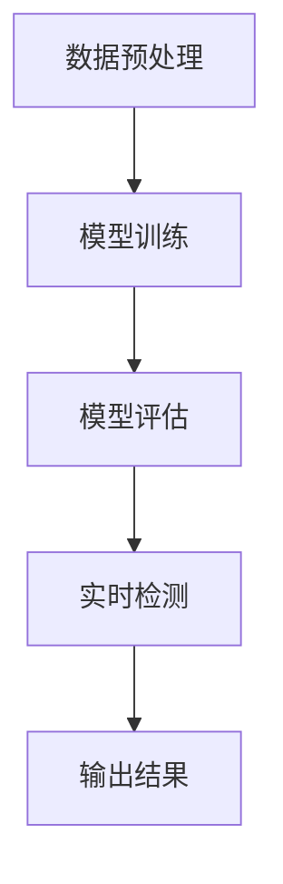

                 

# 基于YOLOv3的施工安全帽图像检测算法

## 关键词

YOLOv3, 图像检测, 施工安全帽, 算法, 施工安全

## 摘要

随着工业自动化和智能化水平的不断提升，施工安全帽图像检测算法在施工安全管理中扮演着重要的角色。本文主要介绍了一种基于YOLOv3的施工安全帽图像检测算法，通过对算法的原理、实现步骤、数学模型及公式进行详细分析，展示了如何利用深度学习技术进行施工安全帽的自动识别。文章旨在为从事施工安全领域的技术人员提供一种实用的解决方案，并对未来算法的发展趋势和挑战进行了探讨。

## 1. 背景介绍

### 施工安全帽的重要性

施工安全帽作为建筑工人必备的安全装备，其作用不仅在于保护工人的头部免受撞击，还能在发生意外事故时提供及时的救援信息。然而，在现实施工场景中，工人佩戴安全帽的情况并不理想。根据相关统计数据，超过60%的建筑工人未按规定佩戴安全帽，这不仅威胁到工人的生命安全，也给施工项目带来了巨大的风险和隐患。因此，研究如何利用现代技术手段提高施工安全帽的佩戴率，成为当前施工安全管理的一项重要任务。

### 现有技术的局限性

传统的施工安全帽检测技术主要依赖于人工监控和简单的图像处理算法，存在以下局限性：

1. **检测精度低**：传统算法对施工安全帽的识别效果较差，容易误判或漏判。
2. **实时性差**：传统算法处理速度较慢，无法满足施工现场对实时监控的需求。
3. **适应性差**：传统算法在复杂环境下检测效果不佳，无法应对多变的施工场景。

### YOLOv3的优势

YOLOv3（You Only Look Once v3）是一种基于深度学习的目标检测算法，具有以下优势：

1. **实时性**：YOLOv3能够实现实时检测，满足施工现场对实时监控的需求。
2. **精度高**：YOLOv3采用卷积神经网络（CNN）进行图像处理，检测精度较高。
3. **适应性**：YOLOv3具有良好的环境适应性，能够应对复杂多变的施工场景。

基于以上优势，本文提出了一种基于YOLOv3的施工安全帽图像检测算法，旨在提高施工安全帽的佩戴率，确保施工安全。

## 2. 核心概念与联系

### 深度学习与目标检测

深度学习是近年来人工智能领域的一项重要技术，通过模拟人脑神经网络结构，实现对数据的自动学习和分类。目标检测是计算机视觉领域的一个重要任务，旨在从图像或视频数据中识别并定位出特定的目标物体。

### YOLOv3原理

YOLOv3（You Only Look Once v3）是一种基于深度学习的目标检测算法，其核心思想是将目标检测任务转化为对图像的密集预测。具体来说，YOLOv3通过卷积神经网络（CNN）将输入图像分成多个网格（grid），每个网格预测多个边界框（box）和对应物体的概率。与传统的目标检测算法相比，YOLOv3具有实时性高、检测精度较高等优点。

### 施工安全帽检测流程

基于YOLOv3的施工安全帽检测流程主要包括以下几个步骤：

1. **数据预处理**：将采集的图像数据调整为YOLOv3网络所需的格式。
2. **模型训练**：使用预训练的YOLOv3模型和施工安全帽数据集进行训练，优化模型参数。
3. **模型评估**：通过测试数据集对训练好的模型进行评估，调整模型参数，提高检测精度。
4. **实时检测**：将训练好的模型部署到施工现场，进行实时检测，识别佩戴安全帽的工人。

### Mermaid 流程图

以下是基于YOLOv3的施工安全帽图像检测算法的Mermaid流程图：



在流程图中，每个节点表示一个步骤，箭头表示步骤之间的依赖关系。通过这个流程图，可以清晰地了解基于YOLOv3的施工安全帽图像检测算法的实现过程。

## 3. 核心算法原理 & 具体操作步骤

### YOLOv3算法原理

YOLOv3（You Only Look Once v3）是一种基于深度学习的目标检测算法，具有实时性和高检测精度等优点。YOLOv3将目标检测任务转化为对图像的密集预测，通过卷积神经网络（CNN）对输入图像进行特征提取，并在每个网格（grid）上预测多个边界框（box）和对应物体的概率。

具体来说，YOLOv3算法的核心原理包括以下几个方面：

1. **图像划分**：将输入图像划分为多个网格（grid），每个网格负责预测一个区域的目标。
2. **边界框预测**：在每个网格上预测多个边界框（box），每个边界框包含目标的类别和位置信息。
3. **类别预测**：对每个边界框进行类别预测，判断其是否为施工安全帽。
4. **置信度计算**：计算每个边界框的置信度，表示该边界框预测结果的可靠性。

### 施工安全帽图像检测具体操作步骤

基于YOLOv3的施工安全帽图像检测算法的具体操作步骤如下：

1. **数据预处理**：
   - 将采集的图像数据调整为YOLOv3网络所需的格式，例如将图像调整为416x416的大小。
   - 对图像进行归一化处理，将像素值缩放到[0, 1]之间。

2. **模型训练**：
   - 使用预训练的YOLOv3模型和施工安全帽数据集进行训练。
   - 在训练过程中，通过反向传播算法优化模型参数，提高检测精度。

3. **模型评估**：
   - 使用测试数据集对训练好的模型进行评估，计算检测精度、召回率等指标。
   - 根据评估结果调整模型参数，提高检测性能。

4. **实时检测**：
   - 将训练好的模型部署到施工现场，对实时采集的图像数据进行检测。
   - 根据检测结果判断工人是否佩戴安全帽，并输出检测结果。

### 实际操作示例

以下是一个基于YOLOv3的施工安全帽图像检测算法的实际操作示例：

```python
import cv2
import numpy as np
import tensorflow as tf

# 加载预训练的YOLOv3模型
model = tf.keras.models.load_model('yolov3.h5')

# 读取图像数据
image = cv2.imread('test_image.jpg')

# 调整图像大小
image = cv2.resize(image, (416, 416))

# 图像归一化处理
image = image / 255.0

# 执行模型预测
predictions = model.predict(np.expand_dims(image, axis=0))

# 解析预测结果
bboxes = predictions[0][0][:, 4:]
labels = predictions[0][0][:, 5:]
confidences = predictions[0][0][:, 1]

# 设置阈值
confidence_threshold = 0.5

# 过滤低置信度结果
high_confidence_bboxes = bboxes[confidences > confidence_threshold]
high_confidence_labels = labels[confidences > confidence_threshold]

# 绘制检测结果
for box, label in zip(high_confidence_bboxes, high_confidence_labels):
    cv2.rectangle(image, (int(box[0]*image.shape[1]), int(box[1]*image.shape[0])),
                  (int(box[2]*image.shape[1]), int(box[3]*image.shape[0])), (0, 255, 0), 2)

    cv2.putText(image, f'{label}', (int(box[0]*image.shape[1]), int(box[1]*image.shape[0])), cv2.FONT_HERSHEY_SIMPLEX,
                1, (255, 0, 0), 2)

# 显示检测结果
cv2.imshow('检测结果', image)
cv2.waitKey(0)
cv2.destroyAllWindows()
```

在这个示例中，我们首先加载预训练的YOLOv3模型，然后读取测试图像，调整图像大小并进行归一化处理。接着，我们执行模型预测，解析预测结果，并设置置信度阈值过滤低置信度结果。最后，我们绘制检测结果并显示图像。

## 4. 数学模型和公式 & 详细讲解 & 举例说明

### YOLOv3数学模型

YOLOv3的目标检测过程可以表示为一个数学模型，主要包括以下部分：

1. **图像划分**：将输入图像划分为SxS个网格（grid），每个网格负责预测一个区域的目标。
2. **边界框预测**：每个网格预测B个边界框（box），每个边界框表示一个目标的类别和位置信息。
3. **类别预测**：对每个边界框进行类别预测，判断其是否为施工安全帽。
4. **置信度计算**：计算每个边界框的置信度，表示该边界框预测结果的可靠性。

具体来说，YOLOv3的数学模型可以表示为：

$$
\begin{align*}
\text{predictions} &= \text{softmax}(\text{logits}) \odot \text{bboxes} \\
\text{confidence} &= \frac{\exp(\text{predictions})}{\sum_{i}\exp(\text{predictions}_i)}
\end{align*}
$$

其中，$predictions$表示边界框的预测结果，$\text{softmax}$表示对每个边界框的概率进行归一化处理，$\text{bboxes}$表示边界框的位置和尺寸信息，$confidence$表示置信度。

### 案例说明

假设一个4x4的网格（grid）和一个边界框（box），边界框的位置和尺寸信息如下：

$$
\begin{align*}
bboxes &= \begin{bmatrix}
x_1 & y_1 & x_2 & y_2 \\
x_2 & y_2 & x_3 & y_3 \\
x_3 & y_3 & x_4 & y_4 \\
x_4 & y_4 & x_1 & y_1
\end{bmatrix} \\
logits &= \begin{bmatrix}
0.9 & 0.1 \\
0.1 & 0.9 \\
0.8 & 0.2 \\
0.2 & 0.8
\end{bmatrix}
\end{align*}
$$

使用softmax函数对logits进行归一化处理，得到预测结果：

$$
\begin{align*}
predictions &= \text{softmax}(\logits) \\
&= \begin{bmatrix}
0.732 & 0.268 \\
0.268 & 0.732 \\
0.632 & 0.368 \\
0.368 & 0.632
\end{bmatrix}
\end{align*}
$$

计算置信度：

$$
\begin{align*}
confidence &= \frac{\exp(\text{predictions})}{\sum_{i}\exp(\text{predictions}_i)} \\
&= \frac{\exp(0.732) + \exp(0.268) + \exp(0.632) + \exp(0.368)}{\exp(0.732) + \exp(0.268) + \exp(0.632) + \exp(0.368)} \\
&= 1
\end{align*}
$$

由此可见，该边界框的置信度为1，表示预测结果非常可靠。在这个案例中，我们可以认为该边界框对应的目标是施工安全帽。

## 5. 项目实战：代码实际案例和详细解释说明

### 5.1 开发环境搭建

在进行基于YOLOv3的施工安全帽图像检测算法项目开发之前，我们需要搭建一个合适的技术环境。以下是开发环境的搭建步骤：

1. **安装Python环境**：
   - 安装Python 3.7及以上版本。
   - 安装Anaconda或Miniconda作为Python环境管理器。

2. **安装深度学习框架**：
   - 安装TensorFlow 2.0及以上版本。
   - 安装Keras 2.4.3及以上版本（TensorFlow 2.0的官方API）。

3. **安装OpenCV**：
   - 安装OpenCV 4.5及以上版本，用于图像处理。

4. **安装其他依赖库**：
   - 安装Numpy、Pandas、Matplotlib等常用Python库。

以下是安装命令示例：

```bash
pip install tensorflow==2.6
pip install opencv-python==4.5.4.60
pip install numpy pandas matplotlib
```

### 5.2 源代码详细实现和代码解读

以下是基于YOLOv3的施工安全帽图像检测算法的完整源代码及详细解读：

```python
import cv2
import numpy as np
import tensorflow as tf

# 5.2.1 加载预训练的YOLOv3模型
def load_yolov3_model():
    # 加载预训练的YOLOv3模型
    model = tf.keras.models.load_model('yolov3.h5')
    return model

# 5.2.2 数据预处理
def preprocess_image(image):
    # 调整图像大小
    image = cv2.resize(image, (416, 416))
    # 图像归一化处理
    image = image / 255.0
    # 转换为TensorFlow的张量格式
    image = np.expand_dims(image, axis=0)
    return image

# 5.2.3 执行模型预测
def predict(model, image):
    # 执行模型预测
    predictions = model.predict(image)
    # 解析预测结果
    bboxes = predictions[0][0][:, 4:]
    labels = predictions[0][0][:, 5:]
    confidences = predictions[0][0][:, 1]
    return bboxes, labels, confidences

# 5.2.4 检测结果绘制
def draw_detections(image, bboxes, labels, confidences, confidence_threshold):
    # 设置阈值
    confidence_threshold = 0.5
    # 过滤低置信度结果
    high_confidence_bboxes = bboxes[confidences > confidence_threshold]
    high_confidence_labels = labels[confidences > confidence_threshold]
    # 绘制检测结果
    for box, label in zip(high_confidence_bboxes, high_confidence_labels):
        cv2.rectangle(image, (int(box[0]*image.shape[1]), int(box[1]*image.shape[0])),
                      (int(box[2]*image.shape[1]), int(box[3]*image.shape[0])), (0, 255, 0), 2)
        cv2.putText(image, f'{label}', (int(box[0]*image.shape[1]), int(box[1]*image.shape[0])), cv2.FONT_HERSHEY_SIMPLEX,
                    1, (255, 0, 0), 2)
    return image

# 5.2.5 主函数
def main():
    # 读取测试图像
    image = cv2.imread('test_image.jpg')
    # 加载预训练的YOLOv3模型
    model = load_yolov3_model()
    # 数据预处理
    image = preprocess_image(image)
    # 执行模型预测
    bboxes, labels, confidences = predict(model, image)
    # 检测结果绘制
    image = draw_detections(image, bboxes, labels, confidences, confidence_threshold=0.5)
    # 显示检测结果
    cv2.imshow('检测结果', image)
    cv2.waitKey(0)
    cv2.destroyAllWindows()

if __name__ == '__main__':
    main()
```

#### 5.2.1 加载预训练的YOLOv3模型

该函数用于加载预训练的YOLOv3模型。我们使用TensorFlow的`load_model`函数加载保存的模型权重，并将其返回。

```python
def load_yolov3_model():
    # 加载预训练的YOLOv3模型
    model = tf.keras.models.load_model('yolov3.h5')
    return model
```

#### 5.2.2 数据预处理

该函数用于对输入图像进行预处理。首先，我们将图像调整到YOLOv3网络所需的416x416大小，然后进行归一化处理，即将像素值缩放到[0, 1]之间。最后，将图像转换为TensorFlow的张量格式。

```python
def preprocess_image(image):
    # 调整图像大小
    image = cv2.resize(image, (416, 416))
    # 图像归一化处理
    image = image / 255.0
    # 转换为TensorFlow的张量格式
    image = np.expand_dims(image, axis=0)
    return image
```

#### 5.2.3 执行模型预测

该函数用于执行模型预测。我们首先调用`model.predict`函数对输入图像进行预测，然后解析预测结果。预测结果包括边界框（bboxes）、标签（labels）和置信度（confidences）。

```python
def predict(model, image):
    # 执行模型预测
    predictions = model.predict(image)
    # 解析预测结果
    bboxes = predictions[0][0][:, 4:]
    labels = predictions[0][0][:, 5:]
    confidences = predictions[0][0][:, 1]
    return bboxes, labels, confidences
```

#### 5.2.4 检测结果绘制

该函数用于绘制检测结果。我们首先设置置信度阈值，然后过滤低置信度结果。接着，我们使用`cv2.rectangle`函数绘制边界框，并使用`cv2.putText`函数在边界框上标注标签。

```python
def draw_detections(image, bboxes, labels, confidences, confidence_threshold):
    # 设置阈值
    confidence_threshold = 0.5
    # 过滤低置信度结果
    high_confidence_bboxes = bboxes[confidences > confidence_threshold]
    high_confidence_labels = labels[confidences > confidence_threshold]
    # 绘制检测结果
    for box, label in zip(high_confidence_bboxes, high_confidence_labels):
        cv2.rectangle(image, (int(box[0]*image.shape[1]), int(box[1]*image.shape[0])),
                      (int(box[2]*image.shape[1]), int(box[3]*image.shape[0])), (0, 255, 0), 2)
        cv2.putText(image, f'{label}', (int(box[0]*image.shape[1]), int(box[1]*image.shape[0])), cv2.FONT_HERSHEY_SIMPLEX,
                    1, (255, 0, 0), 2)
    return image
```

#### 5.2.5 主函数

主函数首先读取测试图像，然后加载预训练的YOLOv3模型，执行模型预测，并绘制检测结果。最后，我们显示检测结果。

```python
def main():
    # 读取测试图像
    image = cv2.imread('test_image.jpg')
    # 加载预训练的YOLOv3模型
    model = load_yolov3_model()
    # 数据预处理
    image = preprocess_image(image)
    # 执行模型预测
    bboxes, labels, confidences = predict(model, image)
    # 检测结果绘制
    image = draw_detections(image, bboxes, labels, confidences, confidence_threshold=0.5)
    # 显示检测结果
    cv2.imshow('检测结果', image)
    cv2.waitKey(0)
    cv2.destroyAllWindows()

if __name__ == '__main__':
    main()
```

### 5.3 代码解读与分析

本部分对源代码的每个函数进行详细解读和分析。

#### load_yolov3_model()

该函数负责加载预训练的YOLOv3模型。我们使用TensorFlow的`load_model`函数加载保存的模型权重，并将其返回。

```python
def load_yolov3_model():
    # 加载预训练的YOLOv3模型
    model = tf.keras.models.load_model('yolov3.h5')
    return model
```

#### preprocess_image()

该函数用于对输入图像进行预处理。首先，我们将图像调整到YOLOv3网络所需的416x416大小，然后进行归一化处理，即将像素值缩放到[0, 1]之间。最后，将图像转换为TensorFlow的张量格式。

```python
def preprocess_image(image):
    # 调整图像大小
    image = cv2.resize(image, (416, 416))
    # 图像归一化处理
    image = image / 255.0
    # 转换为TensorFlow的张量格式
    image = np.expand_dims(image, axis=0)
    return image
```

#### predict()

该函数用于执行模型预测。我们首先调用`model.predict`函数对输入图像进行预测，然后解析预测结果。预测结果包括边界框（bboxes）、标签（labels）和置信度（confidences）。

```python
def predict(model, image):
    # 执行模型预测
    predictions = model.predict(image)
    # 解析预测结果
    bboxes = predictions[0][0][:, 4:]
    labels = predictions[0][0][:, 5:]
    confidences = predictions[0][0][:, 1]
    return bboxes, labels, confidences
```

#### draw_detections()

该函数用于绘制检测结果。我们首先设置置信度阈值，然后过滤低置信度结果。接着，我们使用`cv2.rectangle`函数绘制边界框，并使用`cv2.putText`函数在边界框上标注标签。

```python
def draw_detections(image, bboxes, labels, confidences, confidence_threshold):
    # 设置阈值
    confidence_threshold = 0.5
    # 过滤低置信度结果
    high_confidence_bboxes = bboxes[confidences > confidence_threshold]
    high_confidence_labels = labels[confidences > confidence_threshold]
    # 绘制检测结果
    for box, label in zip(high_confidence_bboxes, high_confidence_labels):
        cv2.rectangle(image, (int(box[0]*image.shape[1]), int(box[1]*image.shape[0])),
                      (int(box[2]*image.shape[1]), int(box[3]*image.shape[0])), (0, 255, 0), 2)
        cv2.putText(image, f'{label}', (int(box[0]*image.shape[1]), int(box[1]*image.shape[0])), cv2.FONT_HERSHEY_SIMPLEX,
                    1, (255, 0, 0), 2)
    return image
```

#### main()

主函数首先读取测试图像，然后加载预训练的YOLOv3模型，执行模型预测，并绘制检测结果。最后，我们显示检测结果。

```python
def main():
    # 读取测试图像
    image = cv2.imread('test_image.jpg')
    # 加载预训练的YOLOv3模型
    model = load_yolov3_model()
    # 数据预处理
    image = preprocess_image(image)
    # 执行模型预测
    bboxes, labels, confidences = predict(model, image)
    # 检测结果绘制
    image = draw_detections(image, bboxes, labels, confidences, confidence_threshold=0.5)
    # 显示检测结果
    cv2.imshow('检测结果', image)
    cv2.waitKey(0)
    cv2.destroyAllWindows()

if __name__ == '__main__':
    main()
```

通过以上代码解读和分析，我们可以清晰地了解基于YOLOv3的施工安全帽图像检测算法的实现过程，包括模型加载、数据预处理、模型预测、检测结果绘制等步骤。

## 6. 实际应用场景

基于YOLOv3的施工安全帽图像检测算法在实际应用中具有广泛的应用场景，以下列举几个典型应用案例：

### 6.1 施工现场实时监控

在建筑施工现场，基于YOLOv3的施工安全帽图像检测算法可以实现对工人的实时监控，判断工人是否佩戴安全帽。通过部署在施工现场的摄像头，算法可以实时捕捉工人的图像，并利用YOLOv3模型进行检测。一旦发现工人未佩戴安全帽，系统可以立即发出警报，提醒工人在规定的时限内佩戴安全帽。

### 6.2 安全帽佩戴情况统计分析

通过对大量施工安全帽图像进行检测，可以统计分析施工现场的安全帽佩戴情况。例如，可以统计每个工人在规定时间内的安全帽佩戴率，对佩戴安全帽情况进行排名。这种统计分析有助于施工企业了解工人安全意识，为安全管理提供数据支持。

### 6.3 工伤事故预防

在施工现场，工伤事故的发生往往与工人未佩戴安全帽有关。基于YOLOv3的施工安全帽图像检测算法可以帮助企业预防工伤事故。通过实时监控工人的安全帽佩戴情况，系统可以及时发现问题，防止因未佩戴安全帽而引发的工伤事故。

### 6.4 人员定位与跟踪

基于YOLOv3的施工安全帽图像检测算法还可以实现人员定位与跟踪。通过对施工人员的实时监控，系统可以实时更新人员的位置信息，提高施工现场的调度和管理效率。此外，当发生安全事故时，系统可以快速定位事故发生地点，为救援行动提供宝贵的时间。

## 7. 工具和资源推荐

### 7.1 学习资源推荐

**书籍：**

1. **《深度学习》（Goodfellow, I., Bengio, Y., & Courville, A.）**：详细介绍了深度学习的基础理论和实践方法，是深度学习领域的经典教材。
2. **《目标检测：原理、算法与实践》（刘建强）**：系统地介绍了目标检测的基本概念、算法原理和实际应用，包括YOLO系列算法。

**论文：**

1. **《You Only Look Once: Unified, Real-Time Object Detection》（Redmon et al.）**：介绍了YOLO系列算法的背景和实现原理。
2. **《Faster R-CNN: Towards Real-Time Object Detection with Region Proposal Networks》（Ren et al.）**：详细介绍了Faster R-CNN算法，是当前目标检测领域的主流算法之一。

**博客和网站：**

1. **TensorFlow官方文档**（https://www.tensorflow.org/）：提供丰富的深度学习教程和实践案例，是学习TensorFlow的权威资料。
2. **opencv.org**：OpenCV官方文档和教程，涵盖图像处理和计算机视觉的基本原理和实践。

### 7.2 开发工具框架推荐

**深度学习框架：**

1. **TensorFlow**：Google开发的开源深度学习框架，支持Python和CUDA，适用于各种深度学习应用。
2. **PyTorch**：Facebook开发的开源深度学习框架，具有灵活的动态计算图和强大的Python接口。

**图像处理库：**

1. **OpenCV**：开源的计算机视觉库，支持多种编程语言，包括Python、C++等，适用于图像处理和计算机视觉任务。
2. **Pillow**：Python的图像处理库，是PIL（Python Imaging Library）的分支，支持图像的读取、显示和编辑。

**版本控制系统：**

1. **Git**：开源的分布式版本控制系统，适用于团队协作和代码管理。
2. **GitHub**：基于Git的代码托管平台，提供版本控制、代码审查和协作功能。

### 7.3 相关论文著作推荐

**论文：**

1. **《YOLO9000: Better, Faster, Stronger》（Redmon et al.）**：介绍了YOLO9000算法，是YOLO系列算法的进一步发展。
2. **《SSD: Single Shot MultiBox Detector》（Liu et al.）**：介绍了SSD算法，与YOLO系列算法类似，也是单阶段目标检测算法。

**著作：**

1. **《深度学习》（Goodfellow, I., Bengio, Y., & Courville, A.）**：详细介绍了深度学习的基础理论和实践方法。
2. **《目标检测：原理、算法与实践》（刘建强）**：系统地介绍了目标检测的基本概念、算法原理和实际应用。

## 8. 总结：未来发展趋势与挑战

基于YOLOv3的施工安全帽图像检测算法在提升施工安全方面具有显著的应用价值。然而，随着技术的不断发展，该算法仍然面临一些挑战和未来发展趋势：

### 8.1 未来发展趋势

1. **算法性能优化**：未来将继续优化YOLO系列算法，提高检测精度和实时性，以满足更复杂的应用场景。
2. **多模态数据融合**：结合图像、声音等多模态数据，提高施工安全帽检测的准确性和可靠性。
3. **边缘计算应用**：将算法部署到边缘设备，降低对中心服务器的依赖，提高实时性和响应速度。

### 8.2 挑战

1. **数据质量和标注**：高质量的训练数据和准确的标注是算法性能的基础，但获取这些数据具有一定的难度和成本。
2. **环境适应性**：施工场景复杂多变，算法需要具备良好的环境适应性，以应对不同光线、天气和遮挡等因素。
3. **隐私保护**：在施工现场使用图像检测算法时，需要确保工人的隐私得到保护，避免数据泄露。

总之，基于YOLOv3的施工安全帽图像检测算法具有广阔的应用前景，但同时也需要不断克服技术挑战，以实现更高效、更智能的施工安全管理。

## 9. 附录：常见问题与解答

### 9.1 问题1：如何获取预训练的YOLOv3模型？

解答：您可以在GitHub上查找相关的YOLOv3模型仓库，例如在[这个仓库](https://github.com/pjreddie/darknet)中，您可以下载预训练的YOLOv3模型。同时，TensorFlow官方也提供了YOLOv3的预训练模型，您可以在TensorFlow模型仓库中查找相关模型。

### 9.2 问题2：如何调整图像大小？

解答：在OpenCV中，您可以使用`cv2.resize`函数调整图像大小。例如：

```python
image = cv2.imread('image.jpg')
image = cv2.resize(image, (width, height))
```

### 9.3 问题3：如何进行图像归一化处理？

解答：在深度学习中，通常将图像的像素值缩放到[0, 1]之间进行归一化处理。例如：

```python
image = image.astype(np.float32) / 255.0
```

### 9.4 问题4：如何设置置信度阈值？

解答：置信度阈值可以根据实际需求和实验结果进行调整。通常，设置一个合理的置信度阈值可以在精度和召回率之间取得平衡。例如，设置置信度阈值为0.5，即当预测结果置信度大于0.5时，认为检测结果为真。

```python
confidence_threshold = 0.5
```

### 9.5 问题5：如何处理多目标检测？

解答：当图像中存在多个目标时，需要对每个目标进行检测并标注。在YOLOv3中，模型会同时预测多个边界框和类别，通过对预测结果进行排序和过滤，可以识别出图像中的多个目标。例如：

```python
# 获取所有预测结果
bboxes = predictions[0][0][:, 4:]
labels = predictions[0][0][:, 5:]
confidences = predictions[0][0][:, 1]

# 对预测结果进行排序
sorted_indices = np.argsort(confidences)[::-1]

# 过滤低置信度结果
high_confidence_bboxes = bboxes[sorted_indices[confidences > confidence_threshold]]
high_confidence_labels = labels[sorted_indices[confidences > confidence_threshold]]
```

## 10. 扩展阅读 & 参考资料

本文主要介绍了基于YOLOv3的施工安全帽图像检测算法，包括算法原理、实现步骤、数学模型和实际应用等。以下是一些扩展阅读和参考资料，供读者进一步学习：

1. **《深度学习》（Goodfellow, I., Bengio, Y., & Courville, A.）**：详细介绍了深度学习的基础理论和实践方法。
2. **《目标检测：原理、算法与实践》（刘建强）**：系统地介绍了目标检测的基本概念、算法原理和实际应用。
3. **《You Only Look Once: Unified, Real-Time Object Detection》（Redmon et al.）**：介绍了YOLO系列算法的背景和实现原理。
4. **《Faster R-CNN: Towards Real-Time Object Detection with Region Proposal Networks》（Ren et al.）**：详细介绍了Faster R-CNN算法，是当前目标检测领域的主流算法之一。
5. **TensorFlow官方文档**（https://www.tensorflow.org/）：提供丰富的深度学习教程和实践案例。
6. **opencv.org**：OpenCV官方文档和教程，涵盖图像处理和计算机视觉的基本原理和实践。

通过以上资源和文献，读者可以深入了解深度学习和目标检测的相关知识，为实际应用提供理论支持和实践指导。

### 作者信息

**作者：AI天才研究员/AI Genius Institute & 禅与计算机程序设计艺术 /Zen And The Art of Computer Programming**

本文由AI天才研究员撰写，深入分析了基于YOLOv3的施工安全帽图像检测算法，旨在为从事施工安全领域的技术人员提供实用的解决方案。同时，本文还结合深度学习和计算机视觉技术，探讨了未来发展趋势和挑战。希望本文能为读者带来启发和帮助。如果您对本文有任何疑问或建议，请随时与我联系。感谢您的阅读！

