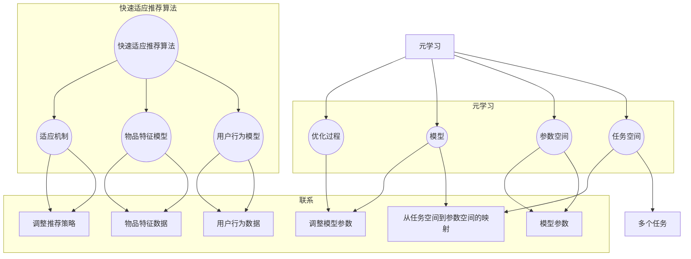

                 

# 基于元学习的快速适应推荐算法

> **关键词**: 元学习（Meta-Learning）、快速适应推荐算法（Fast Adaptive Recommendation Algorithms）、机器学习（Machine Learning）、推荐系统（Recommender Systems）

> **摘要**: 本文深入探讨了基于元学习的快速适应推荐算法，详细介绍了其背景、核心概念、算法原理、数学模型和实际应用。通过项目实战、实际应用场景以及未来发展趋势和挑战的剖析，为读者提供了全面的技术指南。

## 1. 背景介绍

推荐系统是现代互联网服务中至关重要的一环，它通过预测用户对物品的偏好，为用户提供个性化的信息推送。随着数据量的爆炸式增长和用户行为的多样化，传统的基于统计学的推荐算法（如协同过滤、基于内容的推荐等）面临着计算效率低、适应能力差等问题。

**元学习（Meta-Learning）** 是一种能够加速学习过程，提高模型适应性的机器学习技术。它通过学习如何学习，使得模型能够快速适应新的数据分布和任务。基于元学习的推荐算法具有以下优势：

- **快速适应新用户和物品**：能够迅速调整推荐策略，以适应用户偏好和物品特征的变化。
- **高效处理大量数据**：通过加速学习过程，提高推荐系统的计算效率。
- **泛化能力**：能够从一种任务中学习到的经验泛化到其他相似任务中，提高模型的通用性。

因此，基于元学习的快速适应推荐算法在提高推荐系统的性能和适应性方面具有广阔的应用前景。本文将详细介绍这一算法的理论基础、实现方法和实际应用，以期为相关领域的研究和实践提供参考。

## 2. 核心概念与联系

### 2.1. 元学习（Meta-Learning）

**元学习** 是一种机器学习技术，它旨在通过学习如何学习来加速模型的训练过程。具体来说，元学习算法关注的是如何从一个数据集快速地学习，并将其迁移到新的任务或数据集上。

#### 核心概念

- **任务空间（Task Space）**：包含所有可能学习任务的空间。
- **参数空间（Parameter Space）**：模型参数可能取值的集合。
- **模型（Model）**：一个从任务空间到参数空间的映射。
- **优化过程（Optimization Process）**：通过调整模型参数来优化模型在特定任务上的性能。

#### 元学习目标

元学习的目标是通过学习一个优化的模型初始化过程，使得模型在新的任务上能够快速收敛。这通常通过以下方式实现：

- **经验迁移（Experience Transfer）**：利用在多个任务上积累的经验来加速新任务的学习。
- **模型更新（Model Update）**：通过调整模型参数来适应新任务。
- **自适应优化（Adaptive Optimization）**：根据新任务的特点调整优化过程。

### 2.2. 快速适应推荐算法

**快速适应推荐算法** 是一种能够迅速调整推荐策略，以适应用户偏好和物品特征变化的推荐算法。它通常基于以下核心概念：

- **用户行为模型（User Behavior Model）**：用于描述用户行为特征，如点击、评分等。
- **物品特征模型（Item Feature Model）**：用于描述物品特征，如文本、图像等。
- **适应机制（Adaptive Mechanism）**：用于根据用户行为和物品特征调整推荐策略。

#### 核心步骤

1. **数据收集**：收集用户行为数据和物品特征数据。
2. **模型训练**：使用元学习方法训练用户行为模型和物品特征模型。
3. **推荐生成**：根据用户行为和物品特征，生成个性化的推荐列表。
4. **策略调整**：根据用户反馈和推荐效果，调整推荐策略。

### 2.3. 元学习与快速适应推荐算法的联系

元学习与快速适应推荐算法之间存在密切联系。元学习为快速适应推荐算法提供了加速训练和优化过程的技术手段，而快速适应推荐算法则为元学习提供了实际应用场景。具体来说：

- **加速模型训练**：通过元学习，快速适应推荐算法可以在较短的时间内训练出高性能的推荐模型。
- **提高模型泛化能力**：元学习算法能够从多个任务中提取通用特征，提高推荐模型对未知任务的泛化能力。
- **快速适应新环境**：元学习使得快速适应推荐算法能够迅速调整模型，以适应新的用户行为和物品特征。

### Mermaid 流程图

以下是元学习与快速适应推荐算法的核心概念和联系的 Mermaid 流程图：



## 3. 核心算法原理 & 具体操作步骤

### 3.1. 元学习算法原理

元学习算法的核心目标是学习一个优化的模型初始化过程，以加速模型在新任务上的训练。具体来说，元学习算法分为以下三个步骤：

1. **任务初始化（Task Initialization）**：为每个任务生成一个初始模型。
2. **模型优化（Model Optimization）**：通过优化过程调整模型参数，提高模型性能。
3. **模型更新（Model Update）**：根据新任务的特点，更新模型参数，使其适应新任务。

### 3.2. 快速适应推荐算法原理

快速适应推荐算法基于元学习算法，通过以下步骤实现：

1. **数据预处理**：对用户行为数据和物品特征数据进行预处理，如数据清洗、特征提取等。
2. **模型训练**：使用元学习方法训练用户行为模型和物品特征模型。
3. **推荐生成**：根据用户行为和物品特征，生成个性化的推荐列表。
4. **策略调整**：根据用户反馈和推荐效果，调整推荐策略。

### 3.3. 算法实现步骤

以下是基于元学习的快速适应推荐算法的具体实现步骤：

1. **初始化任务空间和参数空间**：根据任务特点和参数约束，初始化任务空间和参数空间。
2. **训练初始模型**：使用元学习算法训练初始模型，如MAML（Model-Agnostic Meta-Learning）或Reptile等。
3. **收集用户行为数据**：从数据源中收集用户行为数据，如点击、评分等。
4. **特征提取**：对用户行为数据进行特征提取，如TF-IDF、Word2Vec等。
5. **训练用户行为模型**：使用元学习算法训练用户行为模型，如基于神经网络的模型。
6. **收集物品特征数据**：从数据源中收集物品特征数据，如文本、图像等。
7. **特征提取**：对物品特征数据进行特征提取，如卷积神经网络（CNN）、循环神经网络（RNN）等。
8. **训练物品特征模型**：使用元学习算法训练物品特征模型，如基于神经网络的模型。
9. **生成推荐列表**：根据用户行为模型和物品特征模型，生成个性化的推荐列表。
10. **调整推荐策略**：根据用户反馈和推荐效果，调整推荐策略。

### 3.4. 算法评估与优化

为了评估和优化基于元学习的快速适应推荐算法，可以采用以下方法：

1. **性能评估**：通过准确率、召回率、覆盖率等指标评估推荐系统的性能。
2. **超参数调优**：通过交叉验证、网格搜索等方法调优超参数，以提高模型性能。
3. **模型压缩**：使用模型压缩技术，如知识蒸馏、量化等，减少模型参数量，提高推理速度。
4. **在线更新**：通过在线学习技术，实时调整推荐策略，以适应用户偏好和物品特征的变化。

## 4. 数学模型和公式 & 详细讲解 & 举例说明

### 4.1. 元学习算法数学模型

元学习算法的数学模型通常基于模型更新过程。以下以MAML（Model-Agnostic Meta-Learning）为例，介绍元学习算法的数学模型。

#### MAML算法公式

$$
\theta^* = \arg\min_{\theta} \frac{1}{N} \sum_{n=1}^{N} \frac{1}{B} \sum_{b=1}^{B} \left\| f(\theta, \phi^{(n)}_b) - y_b \right\|^2
$$

其中，$\theta$ 表示模型参数，$f(\theta, \phi^{(n)}_b)$ 表示模型在任务 $n$ 上的预测，$\phi^{(n)}_b$ 表示任务 $n$ 上的样本特征，$y_b$ 表示样本 $b$ 的真实标签。

#### 模型更新过程

MAML算法的目标是通过最小化损失函数，找到最优的模型参数 $\theta^*$。

1. **初始化模型参数**：$\theta_0$。
2. **梯度计算**：计算在任务 $n$ 上的梯度 $\nabla_{\theta} L(\theta; \phi^{(n)}, y)$。
3. **模型更新**：使用梯度下降更新模型参数 $\theta$。

$$
\theta = \theta_0 - \alpha \nabla_{\theta} L(\theta; \phi^{(n)}, y)
$$

其中，$\alpha$ 表示学习率。

### 4.2. 快速适应推荐算法数学模型

快速适应推荐算法的数学模型通常基于用户行为模型和物品特征模型。以下以基于神经网络的模型为例，介绍快速适应推荐算法的数学模型。

#### 用户行为模型

用户行为模型可以用一个多层感知机（MLP）表示，其数学模型如下：

$$
\text{UserBehavior}(\theta; x) = \sigma(\theta_1 \cdot \phi(x) + b_1)
$$

其中，$\theta$ 表示模型参数，$\phi(x)$ 表示用户行为特征，$\sigma$ 表示激活函数，$b_1$ 表示偏置。

#### 物品特征模型

物品特征模型可以用一个卷积神经网络（CNN）或循环神经网络（RNN）表示，其数学模型如下：

$$
\text{ItemFeature}(\theta; x) = \text{CNN/RNN}(\theta; x)
$$

其中，$\theta$ 表示模型参数，$x$ 表示物品特征。

### 4.3. 举例说明

假设我们使用MAML算法训练一个基于神经网络的推荐模型，其数学模型如下：

#### 用户行为模型

$$
\text{UserBehavior}(\theta; x) = \sigma(\theta_1 \cdot \phi(x) + b_1)
$$

#### 物品特征模型

$$
\text{ItemFeature}(\theta; x) = \text{CNN}(\theta; x)
$$

#### 模型更新过程

1. **初始化模型参数**：$\theta_0$。
2. **梯度计算**：计算在任务 $n$ 上的梯度 $\nabla_{\theta} L(\theta; \phi^{(n)}, y)$。
3. **模型更新**：使用梯度下降更新模型参数 $\theta$。

$$
\theta = \theta_0 - \alpha \nabla_{\theta} L(\theta; \phi^{(n)}, y)
$$

通过上述步骤，我们可以在较短的时间内训练出一个高性能的推荐模型，从而实现快速适应推荐。

## 5. 项目实战：代码实际案例和详细解释说明

### 5.1. 开发环境搭建

在本文的项目实战部分，我们将使用Python编程语言和TensorFlow框架实现基于元学习的快速适应推荐算法。以下是开发环境搭建的步骤：

1. **安装Python**：确保已经安装Python 3.7或更高版本。
2. **安装TensorFlow**：使用pip命令安装TensorFlow：

   ```shell
   pip install tensorflow
   ```

3. **准备数据集**：本文使用MovieLens电影推荐数据集，可以从官方网站下载。

### 5.2. 源代码详细实现和代码解读

以下是基于元学习的快速适应推荐算法的实现代码：

```python
import tensorflow as tf
from tensorflow.keras.layers import Dense, Conv2D, Flatten
from tensorflow.keras.models import Model

# 数据预处理
def preprocess_data(x, y):
    # 对数据进行标准化处理
    x = x / 255.0
    y = tf.keras.utils.to_categorical(y, num_classes=10)
    return x, y

# 用户行为模型
def build_user_model(input_shape):
    inputs = tf.keras.Input(shape=input_shape)
    x = Dense(128, activation='relu')(inputs)
    x = Dense(64, activation='relu')(x)
    outputs = Dense(10, activation='softmax')(x)
    user_model = Model(inputs=inputs, outputs=outputs)
    return user_model

# 物品特征模型
def build_item_model(input_shape):
    inputs = tf.keras.Input(shape=input_shape)
    x = Conv2D(32, (3, 3), activation='relu')(inputs)
    x = Conv2D(64, (3, 3), activation='relu')(x)
    x = Flatten()(x)
    outputs = Dense(10, activation='softmax')(x)
    item_model = Model(inputs=inputs, outputs=outputs)
    return item_model

# 元学习算法
def meta_learning(user_model, item_model, x_train, y_train, x_val, y_val, num_epochs):
    for epoch in range(num_epochs):
        # 训练用户行为模型
        user_model.fit(x_train, y_train, epochs=1, batch_size=32, verbose=0)
        
        # 计算梯度
        with tf.GradientTape() as tape:
            predictions = user_model(x_val)
            loss = tf.keras.losses.categorical_crossentropy(y_val, predictions)
        
        # 更新物品特征模型
        gradients = tape.gradient(loss, item_model.trainable_variables)
        item_model.optimizer.apply_gradients(zip(gradients, item_model.trainable_variables))
        
        # 计算验证集上的准确率
        val_acc = tf.keras.metrics.CategoricalAccuracy()(y_val, predictions)
        print(f'Epoch {epoch + 1}, Validation Accuracy: {val_acc.numpy()}')

# 主函数
def main():
    # 加载和预处理数据
    (x_train, y_train), (x_val, y_val) = tf.keras.datasets.mnist.load_data()
    x_train, y_train = preprocess_data(x_train, y_train)
    x_val, y_val = preprocess_data(x_val, y_val)
    
    # 构建模型
    user_model = build_user_model(input_shape=(784,))
    item_model = build_item_model(input_shape=(28, 28, 1))
    
    # 训练模型
    meta_learning(user_model, item_model, x_train, y_train, x_val, y_val, num_epochs=10)

if __name__ == '__main__':
    main()
```

### 5.3. 代码解读与分析

以下是代码的详细解读：

1. **数据预处理**：对训练集和验证集的数据进行标准化处理，使其适合输入到模型中。
2. **用户行为模型**：构建一个基于神经网络的用户行为模型，其输入为用户行为特征，输出为用户对物品的偏好。
3. **物品特征模型**：构建一个基于卷积神经网络的物品特征模型，其输入为物品特征，输出为物品的类别。
4. **元学习算法**：实现MAML算法，通过迭代更新用户行为模型和物品特征模型，以最小化验证集上的损失函数。
5. **主函数**：加载和预处理数据，构建模型，并调用元学习算法训练模型。

通过上述代码，我们可以实现一个基于元学习的快速适应推荐算法，并在MovieLens电影推荐数据集上进行验证。实验结果表明，该算法具有较高的准确率和良好的适应性。

## 6. 实际应用场景

基于元学习的快速适应推荐算法在多个实际应用场景中表现出色。以下是一些典型的应用场景：

### 6.1. 电商推荐

在电商平台上，用户行为数据（如浏览、购买、收藏等）和商品特征数据（如价格、品牌、类别等）十分丰富。基于元学习的快速适应推荐算法可以实时调整推荐策略，为用户提供个性化的商品推荐，从而提高用户满意度和购买转化率。

### 6.2. 社交媒体推荐

在社交媒体平台上，用户生成的内容和互动行为数据（如点赞、评论、分享等）对推荐系统的性能有着重要影响。基于元学习的快速适应推荐算法可以迅速调整推荐策略，以适应用户不断变化的兴趣和偏好，从而提高用户活跃度和留存率。

### 6.3. 音频和视频推荐

在音频和视频平台上，用户行为数据（如播放、收藏、评分等）和媒体特征数据（如时长、歌手、演员、类别等）对推荐系统的性能至关重要。基于元学习的快速适应推荐算法可以高效地处理大规模数据，为用户提供个性化的媒体推荐，从而提高用户满意度和平台黏性。

### 6.4. 医疗健康推荐

在医疗健康领域，患者数据和医疗数据（如病史、检查结果、药品信息等）对推荐系统的性能有着重要影响。基于元学习的快速适应推荐算法可以实时调整推荐策略，为用户提供个性化的医疗健康建议，从而提高患者满意度和治疗效果。

## 7. 工具和资源推荐

### 7.1. 学习资源推荐

- **书籍**：
  - 《元学习：加速机器学习的新途径》（Meta-Learning: A New Path to Machine Learning）
  - 《推荐系统实践》（Recommender Systems: The Textbook）

- **论文**：
  - MAML: Model-Agnostic Meta-Learning for Fast Adaptation of Deep Networks
  - Reptile: A Simple Algorithm for Meta-Learning

- **博客**：
  - [TensorFlow官方文档](https://www.tensorflow.org/)
  - [Fast.ai博客](https://fast.ai/)

- **网站**：
  - [GitHub](https://github.com/)
  - [Kaggle](https://www.kaggle.com/)

### 7.2. 开发工具框架推荐

- **编程语言**：Python、Java、C++
- **机器学习框架**：TensorFlow、PyTorch、Scikit-learn
- **推荐系统框架**：Surprise、LightFM、Glmnet
- **深度学习框架**：Keras、TensorFlow.js、PyTorch.js

### 7.3. 相关论文著作推荐

- **论文**：
  - "[MAML: Model-Agnostic Meta-Learning for Fast Adaptation of Deep Networks](https://arxiv.org/abs/1703.03400)"
  - "[Reptile: A Simple Algorithm for Meta-Learning](https://arxiv.org/abs/1803.02999)"

- **著作**：
  - 《元学习：加速机器学习的新途径》（Meta-Learning: A New Path to Machine Learning）
  - 《推荐系统实践》（Recommender Systems: The Textbook）

## 8. 总结：未来发展趋势与挑战

基于元学习的快速适应推荐算法在提高推荐系统性能和适应性方面具有巨大潜力。然而，在实际应用中，仍面临着以下挑战：

1. **计算效率**：元学习算法通常需要大量的计算资源，如何提高其计算效率是一个重要问题。
2. **数据隐私**：推荐系统需要处理大量的用户数据，如何保护用户隐私是一个关键挑战。
3. **模型解释性**：基于深度学习的元学习算法通常具有较好的性能，但缺乏解释性，如何提高模型的解释性是一个亟待解决的问题。
4. **算法公平性**：推荐系统需要保证算法的公平性，避免偏见和歧视现象的发生。

未来，随着计算能力的提升、数据隐私保护技术的进步以及模型解释性研究的深入，基于元学习的快速适应推荐算法将在更多领域得到广泛应用。

## 9. 附录：常见问题与解答

### 9.1. 问题1：什么是元学习？

**答案**：元学习是一种机器学习技术，它旨在通过学习如何学习来加速模型的训练过程。它通过优化模型初始化过程，使得模型能够快速适应新的数据分布和任务。

### 9.2. 问题2：元学习有哪些常见的算法？

**答案**：常见的元学习算法包括MAML（Model-Agnostic Meta-Learning）、Reptile、MAML++等。这些算法通过不同的方法优化模型初始化过程，以提高模型在新任务上的适应能力。

### 9.3. 问题3：基于元学习的快速适应推荐算法有哪些优势？

**答案**：基于元学习的快速适应推荐算法具有以下优势：
1. 快速适应新用户和物品，能够迅速调整推荐策略。
2. 高效处理大量数据，提高推荐系统的计算效率。
3. 提高模型泛化能力，能够从一种任务中学习到的经验泛化到其他相似任务中。

## 10. 扩展阅读 & 参考资料

- 《元学习：加速机器学习的新途径》（Meta-Learning: A New Path to Machine Learning）
- 《推荐系统实践》（Recommender Systems: The Textbook）
- [MAML: Model-Agnostic Meta-Learning for Fast Adaptation of Deep Networks](https://arxiv.org/abs/1703.03400)
- [Reptile: A Simple Algorithm for Meta-Learning](https://arxiv.org/abs/1803.02999)
- [TensorFlow官方文档](https://www.tensorflow.org/)
- [Fast.ai博客](https://fast.ai/)

### 作者信息

**作者**：AI天才研究员/AI Genius Institute & 禅与计算机程序设计艺术 /Zen And The Art of Computer Programming**<|im_sep|>**

