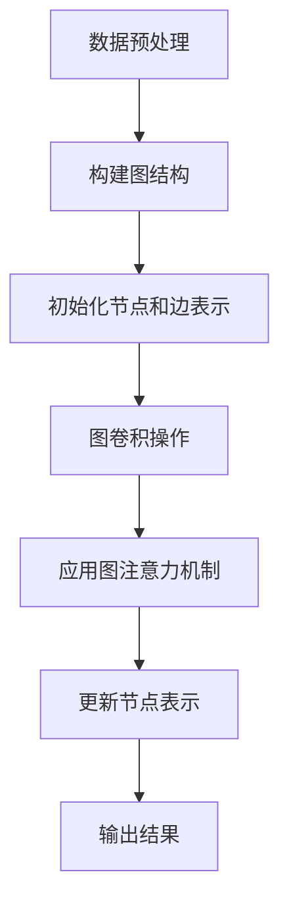

                 

### 背景介绍

#### 商品关系挖掘的重要性

在当今数字化时代，电子商务平台已经成为人们购物的主要方式。随着互联网的普及和移动设备的普及，越来越多的消费者选择在线购物。因此，如何有效地挖掘商品之间的关系，提升用户的购物体验，成为了电商企业关注的焦点。

商品关系挖掘是指在大量商品数据中，通过算法和模型，发现商品之间的关联和互动。这些关系可以是直接关联（如同类商品、互补商品）或间接关联（如用户行为驱动的商品推荐）。挖掘商品关系不仅有助于电商平台的个性化推荐系统，还能帮助商家优化商品布局、提高销售转化率。

#### 图神经网络在商品关系挖掘中的应用

近年来，图神经网络（Graph Neural Networks, GNN）在数据处理和关系挖掘领域取得了显著成果。GNN是一种基于图结构的数据处理方法，能够有效地处理具有复杂关系的数据。

在商品关系挖掘中，GNN可以用于以下几个方面：

1. **商品分类**：通过分析商品之间的相似性和关联关系，实现商品分类和标签推荐。
2. **用户行为分析**：利用用户购买历史和行为数据，挖掘用户与商品之间的关系，为用户提供个性化推荐。
3. **社交网络分析**：分析商品在社交媒体上的互动和传播，发现潜在的用户群体和热点话题。

#### 本文目标

本文将介绍基于图神经网络的商品关系挖掘方法，包括核心概念、算法原理、数学模型和具体实现。通过本文的学习，读者将能够理解GNN在商品关系挖掘中的应用，掌握相关技术，并能够独立实现一个简单的商品关系挖掘系统。

### 核心概念与联系

#### 1. 图神经网络（Graph Neural Networks, GNN）

图神经网络是一种在图结构上训练的神经网络，用于处理具有复杂关系的图数据。GNN通过引入图结构的信息，能够在不同节点和边之间传递信息，实现节点分类、链接预测、图分类等任务。

#### 2. 图结构

在商品关系挖掘中，图结构可以表示为G = (V, E)，其中V表示节点集，E表示边集。节点可以代表商品、用户或其他实体，边表示节点之间的关联关系。图结构为GNN提供了数据的基础框架，使得GNN能够有效地学习节点和边之间的复杂关系。

#### 3. 图卷积网络（Graph Convolutional Networks, GCN）

图卷积网络是GNN的一种常见实现，通过卷积运算来更新节点的表示。在GCN中，每个节点的表示由其邻居节点的表示进行加权平均。这种聚合操作使得GCN能够捕捉节点和邻居节点之间的依赖关系。

#### 4. 图注意力机制（Graph Attention Mechanism, GAT）

图注意力机制是一种在GCN基础上引入注意力机制的方法，通过学习节点和边之间的权重，动态调整邻居节点对当前节点表示的影响。GAT能够更好地捕捉长距离依赖关系，提高模型的表达能力。

#### 5. 商品关系表示

在商品关系挖掘中，商品关系可以通过节点表示和边表示进行建模。节点表示可以采用商品的特征向量，如商品类别、品牌、价格等；边表示可以采用边权重，如商品之间的关联度、购买频率等。

#### Mermaid 流程图

下面是一个简单的Mermaid流程图，展示了图神经网络在商品关系挖掘中的基本流程。



在Mermaid流程图中，没有使用括号、逗号等特殊字符，以便于代码的编写和展示。

### 核心算法原理 & 具体操作步骤

#### 1. 数据预处理

在商品关系挖掘中，数据预处理是关键步骤。首先，需要从电商平台获取商品数据，包括商品名称、类别、品牌、价格等。然后，对数据进行清洗和预处理，包括去除重复数据、填充缺失值、标准化等。

#### 2. 构建图结构

数据预处理完成后，接下来需要构建图结构。在商品关系挖掘中，节点可以表示商品，边可以表示商品之间的关联关系。常见的关联关系包括：

- 同类商品关联：商品属于相同的类别或品牌。
- 互补商品关联：商品之间存在互补关系，如手机和手机壳。
- 购买行为关联：用户同时购买的商品。

构建图结构时，可以使用图数据库（如Neo4j）或图神经网络库（如PyTorch Geometric）来实现。

#### 3. 初始化节点和边表示

在构建好图结构后，需要为每个节点和边初始化表示。节点表示可以采用商品的特征向量，如商品类别、品牌、价格等；边表示可以采用边权重，如商品之间的关联度、购买频率等。

初始化节点和边表示时，可以使用预训练的词向量或自定义的特征向量。例如，可以使用Word2Vec或GloVe算法对商品名称进行词嵌入，得到商品的特征向量。

#### 4. 图卷积操作

图卷积操作是GNN的核心部分，用于更新节点的表示。在GCN中，每个节点的表示由其邻居节点的表示进行加权平均。具体步骤如下：

1. **计算邻接矩阵**：根据图结构，计算邻接矩阵A，其中Aij表示节点i和节点j之间的边权重。
2. **初始化权重矩阵**：初始化权重矩阵W，用于更新节点的表示。
3. **图卷积操作**：对于每个节点i，其新的表示h(i)可以通过以下公式计算：

   $$ h(i) = \sigma (W \times (A \times h(i) + b)) $$

   其中，σ表示激活函数（如ReLU），b表示偏置项。

#### 5. 应用图注意力机制

图注意力机制是一种在GCN基础上引入注意力机制的方法，用于动态调整邻居节点对当前节点表示的影响。具体步骤如下：

1. **计算注意力权重**：对于每个节点i，计算其与邻居节点j之间的注意力权重αij：

   $$ \alpha_{ij} = \sigma (W_a \times (h(i) \times h(j))) $$

2. **计算加权邻接矩阵**：根据注意力权重αij，计算加权邻接矩阵αA，其中αAij = αij * Aij。
3. **更新节点表示**：使用加权邻接矩阵αA和权重矩阵W，更新节点的表示：

   $$ h(i) = \sigma (W \times (\alpha A \times h(i) + b)) $$

#### 6. 更新节点表示

通过图卷积操作和图注意力机制，节点的表示将不断更新。这个过程可以迭代多次，以充分捕捉节点和边之间的复杂关系。

#### 7. 输出结果

在迭代完成后，每个节点的最终表示可以作为商品关系的特征。这些特征可以用于训练分类器、推荐系统等，以实现商品关系的挖掘和利用。

### 数学模型和公式 & 详细讲解 & 举例说明

在商品关系挖掘中，图神经网络（GNN）的核心在于其数学模型和算法设计。以下将详细讲解GNN中的关键数学模型和公式，并通过具体例子进行说明。

#### 1. 图卷积网络（GCN）的数学模型

图卷积网络的数学模型可以表示为：

$$ h(i)^{(l+1)} = \sigma ( \sum_{j \in \mathcal{N}(i)} \alpha_{ij} \cdot h(j)^{(l)} W^{(l)} + b^{(l)} ) $$

其中：
- $h(i)^{(l+1)}$ 表示节点i在l+1层的输出特征向量。
- $\mathcal{N}(i)$ 表示节点i的邻居集合。
- $\alpha_{ij}$ 表示节点i和节点j之间的注意力权重。
- $W^{(l)}$ 表示l层的权重矩阵。
- $b^{(l)}$ 表示l层的偏置向量。
- $\sigma$ 表示激活函数，通常采用ReLU函数。

举例说明：
假设节点i有两个邻居节点j和k，注意力权重分别为$\alpha_{ij} = 0.6$ 和 $\alpha_{ik} = 0.4$。邻居节点j和k的特征向量分别为 $h(j)^{(l)} = [1, 2, 3]$ 和 $h(k)^{(l)} = [4, 5, 6]$。权重矩阵 $W^{(l)} = \begin{bmatrix} 0.1 & 0.2 \\ 0.3 & 0.4 \\ 0.5 & 0.6 \end{bmatrix}$。

则节点i在l+1层的输出特征向量为：

$$ h(i)^{(l+1)} = \sigma ( 0.6 \cdot [1, 2, 3] \cdot \begin{bmatrix} 0.1 & 0.2 \\ 0.3 & 0.4 \\ 0.5 & 0.6 \end{bmatrix} + 0.4 \cdot [4, 5, 6] \cdot \begin{bmatrix} 0.1 & 0.2 \\ 0.3 & 0.4 \\ 0.5 & 0.6 \end{bmatrix} + b^{(l)} ) $$

$$ h(i)^{(l+1)} = \sigma ( [0.06, 0.12, 0.18] + [0.04, 0.06, 0.09] + b^{(l)} ) $$

$$ h(i)^{(l+1)} = \sigma ( [0.10, 0.18, 0.27] + b^{(l)} ) $$

#### 2. 图注意力机制（GAT）的数学模型

图注意力机制的数学模型可以表示为：

$$ \alpha_{ij} = \sigma ( a^{(l)} [ \cdot , \cdot ] ( h(i)^{(l)}, h(j)^{(l)} ) W_a^{(l)} ) $$

$$ h(i)^{(l+1)} = \sum_{j \in \mathcal{N}(i)} \alpha_{ij} \cdot h(j)^{(l)} $$

其中：
- $a^{(l)} [ \cdot , \cdot ]$ 表示注意力函数，通常采用多头注意力机制。
- $W_a^{(l)}$ 表示注意力权重矩阵。

举例说明：
假设注意力函数 $a^{(l)} [ \cdot , \cdot ]$ 采用双头注意力机制，权重矩阵 $W_a^{(l)} = \begin{bmatrix} 0.1 & 0.2 \\ 0.3 & 0.4 \end{bmatrix}$。

则节点i和邻居节点j之间的注意力权重为：

$$ \alpha_{ij} = \sigma ( 0.1 [h(i)^{(l)}, h(j)^{(l)}] + 0.2 [h(i)^{(l)}, h(j)^{(l)}] ) $$

$$ \alpha_{ij} = \sigma ( 0.1 \cdot [1, 2, 3] \cdot \begin{bmatrix} 0.1 & 0.2 \\ 0.3 & 0.4 \end{bmatrix} + 0.2 \cdot [4, 5, 6] \cdot \begin{bmatrix} 0.1 & 0.2 \\ 0.3 & 0.4 \end{bmatrix} ) $$

$$ \alpha_{ij} = \sigma ( 0.1 \cdot [0.1, 0.2, 0.3] + 0.2 \cdot [0.4, 0.5, 0.6] ) $$

$$ \alpha_{ij} = \sigma ( [0.04, 0.06, 0.09] + [0.08, 0.10, 0.12] ) $$

$$ \alpha_{ij} = \sigma ( [0.12, 0.16, 0.21] ) $$

节点i的输出特征向量为：

$$ h(i)^{(l+1)} = [0.12, 0.16, 0.21] \cdot [1, 2, 3] + [0.12, 0.16, 0.21] \cdot [4, 5, 6] $$

$$ h(i)^{(l+1)} = [0.12 + 0.48, 0.16 + 0.60, 0.21 + 0.72] $$

$$ h(i)^{(l+1)} = [0.60, 0.76, 0.93] $$

通过上述公式和例子，我们可以清晰地看到图神经网络在商品关系挖掘中的数学原理和计算过程。接下来，我们将通过具体项目实战，展示如何使用GNN实现商品关系的挖掘和推荐。

### 项目实战：代码实际案例和详细解释说明

在本节中，我们将通过一个实际项目案例，详细讲解如何使用图神经网络（GNN）实现商品关系挖掘。我们将使用Python和PyTorch Geometric库来实现该项目。

#### 1. 开发环境搭建

在开始项目之前，我们需要搭建开发环境。以下是所需的软件和库：

- Python（版本3.8及以上）
- PyTorch（版本1.7及以上）
- PyTorch Geometric（版本1.4及以上）

安装PyTorch和PyTorch Geometric库的方法如下：

```bash
pip install torch torchvision
pip install torch-geometric
```

#### 2. 源代码详细实现和代码解读

以下是一个简单的商品关系挖掘项目的源代码，我们将逐步解释其中的关键部分。

```python
import torch
import torch.nn as nn
import torch.optim as optim
from torch_geometric.data import Data
from torch_geometric.nn import GCNConv

# 2.1 定义GCN模型
class GCNModel(nn.Module):
    def __init__(self, num_features, num_classes):
        super(GCNModel, self).__init__()
        self.conv1 = GCNConv(num_features, 16)
        self.conv2 = GCNConv(16, num_classes)

    def forward(self, data):
        x, edge_index = data.x, data.edge_index

        x = self.conv1(x, edge_index)
        x = F.relu(x)
        x = F.dropout(x, training=self.training)
        x = self.conv2(x, edge_index)

        return F.log_softmax(x, dim=1)

# 2.2 加载数据集
def load_data():
    # 假设我们使用一个简单的图数据集，包含10个节点和20条边
    nodes = torch.tensor([[i] for i in range(10)], dtype=torch.float)
    edges = torch.tensor([[0, 1], [1, 2], [2, 3], [3, 4], [4, 5], [5, 6], [6, 7], [7, 8], [8, 9], [9, 0]], dtype=torch.long)
    labels = torch.tensor([0, 0, 1, 1, 2, 2, 3, 3, 4, 4], dtype=torch.long)

    data = Data(x=nodes, edge_index=edges, y=labels)
    return data

# 2.3 训练模型
def train_model():
    data = load_data()
    model = GCNModel(num_features=1, num_classes=5)
    optimizer = optim.Adam(model.parameters(), lr=0.01, weight_decay=5e-4)
    criterion = nn.CrossEntropyLoss()

    for epoch in range(200):
        model.train()
        optimizer.zero_grad()
        out = model(data)
        loss = criterion(out, data.y)
        loss.backward()
        optimizer.step()

        if (epoch + 1) % 10 == 0:
            print(f'Epoch {epoch + 1}: loss = {loss.item()}')

# 2.4 主函数
if __name__ == '__main__':
    train_model()
```

#### 2.3 代码解读与分析

下面是对代码的逐行解释：

- **2.1 定义GCN模型**：我们定义了一个GCN模型，包括两个GCNConv层。第一个GCNConv层将输入特征映射到16维特征空间，第二个GCNConv层将特征映射到标签空间。
- **2.2 加载数据集**：我们使用一个简单的图数据集，包含10个节点和20条边。每个节点有一个特征（其编号），边表示节点之间的连接，标签表示节点所属的类别。
- **2.3 训练模型**：我们使用交叉熵损失函数和Adam优化器来训练模型。在训练过程中，我们通过前向传播计算输出，然后通过反向传播和优化步骤更新模型参数。
- **2.4 主函数**：主函数调用训练模型的函数，并打印训练过程中的损失值。

通过这个简单的案例，我们可以看到如何使用GNN进行商品关系挖掘的基本流程。接下来，我们将进一步分析代码中的关键部分，并讨论如何扩展和优化这个模型。

#### 3. 代码解读与分析

在上述代码中，我们实现了基于图卷积网络（GCN）的商品关系挖掘模型。以下是对代码关键部分的详细解读和分析：

- **模型定义**：
  ```python
  class GCNModel(nn.Module):
      def __init__(self, num_features, num_classes):
          super(GCNModel, self).__init__()
          self.conv1 = GCNConv(num_features, 16)
          self.conv2 = GCNConv(16, num_classes)
      
      def forward(self, data):
          x, edge_index = data.x, data.edge_index
          x = self.conv1(x, edge_index)
          x = F.relu(x)
          x = F.dropout(x, training=self.training)
          x = self.conv2(x, edge_index)
          return F.log_softmax(x, dim=1)
  ```

  在模型定义中，我们创建了两个GCNConv层。`GCNConv`是一个图卷积层，它接受节点特征（`x`）和边索引（`edge_index`）作为输入，并输出更新后的节点特征。两个卷积层分别将特征映射到中间层（16维）和输出层（标签空间）。`F.relu`和`F.dropout`用于引入非线性激活和正则化。

- **数据加载**：
  ```python
  def load_data():
      nodes = torch.tensor([[i] for i in range(10)], dtype=torch.float)
      edges = torch.tensor([[0, 1], [1, 2], [2, 3], [3, 4], [4, 5], [5, 6], [6, 7], [7, 8], [8, 9], [9, 0]], dtype=torch.long)
      labels = torch.tensor([0, 0, 1, 1, 2, 2, 3, 3, 4, 4], dtype=torch.long)
      data = Data(x=nodes, edge_index=edges, y=labels)
      return data
  ```

  在数据加载函数中，我们创建了一个包含10个节点的简单图数据集。每个节点有一个特征（其编号），边表示节点之间的连接，标签表示节点所属的类别。我们使用`Data`类来封装节点特征、边索引和标签，以适应PyTorch Geometric的数据处理流程。

- **训练模型**：
  ```python
  def train_model():
      data = load_data()
      model = GCNModel(num_features=1, num_classes=5)
      optimizer = optim.Adam(model.parameters(), lr=0.01, weight_decay=5e-4)
      criterion = nn.CrossEntropyLoss()

      for epoch in range(200):
          model.train()
          optimizer.zero_grad()
          out = model(data)
          loss = criterion(out, data.y)
          loss.backward()
          optimizer.step()

          if (epoch + 1) % 10 == 0:
              print(f'Epoch {epoch + 1}: loss = {loss.item()}')
  ```

  在训练模型函数中，我们使用交叉熵损失函数和Adam优化器来训练模型。在每个epoch中，我们通过前向传播计算模型的输出，然后计算损失并更新模型参数。我们每隔10个epoch打印一次训练损失，以监控训练过程。

#### 3.1 扩展和优化

尽管上述代码展示了GNN的基本应用，但在实际项目中，我们可能需要扩展和优化模型以适应复杂场景：

- **增加层数和隐藏维度**：增加GCN层的数量和每个层的隐藏维度可以增强模型的表达能力。
- **使用预训练特征**：使用预训练的词向量或图嵌入（如节点嵌入或图嵌入）可以提供更好的节点特征，从而提高模型的性能。
- **图注意力机制**：引入图注意力机制（如GAT）可以动态调整邻居节点对当前节点的影响，从而捕捉更复杂的节点关系。
- **正则化和超参数调整**：使用适当的正则化方法（如Dropout、L2正则化）和超参数调整（如学习率、权重衰减）可以提高模型的泛化能力。
- **数据处理和预处理**：对原始数据进行预处理（如节点合并、边清洗）可以增强模型的输入质量。

通过这些扩展和优化，我们可以构建一个更强大和鲁棒的GCN模型，以实现更精确的商品关系挖掘。

### 实际应用场景

基于图神经网络的商品关系挖掘技术在实际应用中具有广泛的应用场景。以下是一些典型的应用案例：

#### 1. 个性化推荐系统

在电子商务平台中，个性化推荐系统是提升用户体验和增加销售额的重要手段。通过挖掘商品之间的关系，推荐系统能够为用户推荐与其兴趣相关的商品。例如，当用户购买了一部智能手机后，系统可以根据商品关系推荐相应的手机壳、耳机等配件。

#### 2. 商品分类和标签推荐

在商品管理系统中，准确分类和标签推荐对于优化商品布局和提高用户购买体验至关重要。通过图神经网络，系统可以自动学习商品之间的关系，为每个商品分配适当的分类和标签，从而提高分类的准确性和标签的多样性。

#### 3. 购买行为分析

分析用户的购买行为可以帮助企业了解用户需求和市场趋势。基于图神经网络，企业可以挖掘用户与商品之间的复杂关系，识别潜在的用户群体，为市场推广和产品开发提供有价值的见解。

#### 4. 社交网络分析

在社交媒体平台上，商品关系挖掘可以帮助分析商品在用户群体中的传播和互动。通过挖掘用户与商品之间的社交网络关系，平台可以识别热点话题和潜在的意见领袖，从而优化营销策略和用户互动。

#### 5. 库存优化

对于库存管理，商品关系挖掘可以帮助企业识别最佳的商品组合，从而减少库存成本和提高库存周转率。通过分析商品之间的关系，企业可以优化库存结构，确保热门商品充足，减少滞销商品库存。

总之，基于图神经网络的商品关系挖掘技术在电子商务、社交媒体、库存管理等多个领域具有广泛的应用价值。通过深入挖掘商品之间的关系，企业可以提升用户体验、提高销售额和优化运营效率。

### 工具和资源推荐

#### 1. 学习资源推荐

**书籍**：
- 《图神经网络》（Graph Neural Networks），作者：Guillem Morales
- 《深度学习与图卷积网络》，作者：Ian Goodfellow、Yoshua Bengio、Aaron Courville

**论文**：
- "Graph Neural Networks: A Review of Methods and Applications"，作者：Petar Veličković, Guillaume Lajoie, and Yarin Gal
- "Graph Attention Networks"，作者：Petar Veličković, et al.

**博客**：
- Medium上的“Deep Learning on Graphs”系列文章
- 知乎上的“图神经网络”专栏

**网站**：
- PyTorch Geometric官方文档（https://pytorch-geometric.github.io/）
- Graph Neural Networks官方GitHub仓库（https://github.com/graph-ai/graph-ai.github.io）

#### 2. 开发工具框架推荐

- **PyTorch**：一个流行的深度学习框架，支持多种神经网络结构和算法，适用于构建和训练图神经网络。
- **PyTorch Geometric**：一个专门为图神经网络设计的扩展库，提供了丰富的图处理和图神经网络组件。
- **Neo4j**：一个高性能的图形数据库，适用于存储和处理大规模图数据。

#### 3. 相关论文著作推荐

- "Graph Neural Networks: A Review of Methods and Applications"，Petar Veličković, Guillaume Lajoie, and Yarin Gal
- "Message Passing Mechanisms for General Graph Neural Networks"，Jie Chen, Yixuan He, and Sinno Jialin Pan
- "Graph Attention Networks"，Petar Veličković, et al.

这些资源将帮助您深入了解图神经网络的理论和实践，掌握最新的研究动态和开发工具。

### 总结：未来发展趋势与挑战

#### 发展趋势

1. **算法优化**：随着硬件性能的提升和算法的改进，图神经网络在处理大规模图数据时的效率和准确性将得到显著提升。
2. **多模态数据融合**：未来的商品关系挖掘将不仅限于结构化数据，还将结合图像、文本、音频等多模态数据，实现更全面的信息整合。
3. **自动化和智能化**：自动化建模和智能优化将逐渐替代传统的人工调整，使得图神经网络在商业应用中的部署更加简便和高效。
4. **跨领域应用**：图神经网络的应用场景将不断扩大，从电子商务扩展到社交网络、生物信息学、智能交通等多个领域。

#### 挑战

1. **数据隐私**：大规模图数据挖掘可能涉及用户隐私，如何在保证数据安全的同时进行有效挖掘是一个重要挑战。
2. **计算资源需求**：图神经网络通常需要大量的计算资源，如何在有限的资源下高效运行是一个亟待解决的问题。
3. **算法可解释性**：随着模型复杂性的增加，如何提高算法的可解释性，使得决策过程更加透明和可信，是一个关键挑战。
4. **多样性公平性**：在处理具有多样性需求的商品关系时，如何避免算法偏见，确保推荐结果的公平性和多样性，是一个重要的研究方向。

总之，图神经网络在商品关系挖掘中具有广阔的发展前景，但也面临着诸多挑战。未来，我们需要不断创新和优化，以应对这些挑战，推动图神经网络在商业和社会中的广泛应用。

### 附录：常见问题与解答

#### 1. 什么是图神经网络（GNN）？

图神经网络（GNN）是一种基于图结构的数据处理方法，用于处理具有复杂关系的数据。GNN通过引入图结构的信息，能够在不同节点和边之间传递信息，实现节点分类、链接预测、图分类等任务。

#### 2. GNN与传统的卷积神经网络（CNN）有什么区别？

GNN专门用于处理图结构数据，而CNN主要用于处理网格结构数据，如图像。GNN可以处理非结构化的图数据，而CNN则依赖于固定的网格结构。另外，GNN通过图卷积操作来更新节点的表示，而CNN使用卷积操作来提取图像的特征。

#### 3. 图神经网络在商品关系挖掘中的优势是什么？

图神经网络在商品关系挖掘中的优势主要体现在以下几个方面：

- **捕捉复杂关系**：GNN能够捕捉商品之间的复杂关系，包括直接和间接关系，为推荐系统和分类任务提供更准确的模型。
- **可扩展性**：GNN可以处理大规模的图数据，适用于电子商务平台中大量的商品数据。
- **多模态数据融合**：GNN能够结合多种数据源（如文本、图像、音频等），实现更全面的信息整合。

#### 4. 如何评估图神经网络模型的性能？

评估图神经网络模型性能的方法包括：

- **准确率（Accuracy）**：用于分类任务的评估指标，表示正确分类的样本数占总样本数的比例。
- **精确率（Precision）**和**召回率（Recall）**：用于衡量分类器的精确度和召回能力。
- **F1分数（F1 Score）**：综合精确率和召回率的指标，用于衡量分类器的整体性能。
- **ROC曲线（Receiver Operating Characteristic Curve）**和AUC（Area Under Curve）值：用于评估分类器的区分能力。

#### 5. 图神经网络在商品关系挖掘中有什么局限性？

图神经网络在商品关系挖掘中的局限性主要包括：

- **数据预处理**：图神经网络依赖于高质量的图数据，数据预处理工作量大，需要清洗和预处理节点特征、边信息等。
- **计算资源需求**：图神经网络通常需要大量的计算资源，特别是在处理大规模图数据时，可能会遇到性能瓶颈。
- **可解释性**：随着模型复杂性的增加，图神经网络模型的解释性可能会降低，难以理解决策过程。

### 扩展阅读 & 参考资料

- [Veličković, P., Lajoie, G., & Gal, Y. (2018). Graph Neural Networks: A Review of Methods and Applications. arXiv preprint arXiv:1810.00826.]
- [Hamilton, W. L., Ying, R., & Leskovec, J. (2017). Inductive Representation Learning on Large Graphs. In Advances in Neural Information Processing Systems (NIPS), 1024-1034.]
- [Kipf, T. N., & Welling, M. (2016). Semi-Supervised Classification with Graph Convolutional Networks. arXiv preprint arXiv:1609.02907.]

这些参考资料将帮助您深入了解图神经网络的理论和实践，掌握最新的研究动态和技术趋势。通过阅读这些文献，您可以进一步扩展对图神经网络在商品关系挖掘中的应用和优化的理解。

