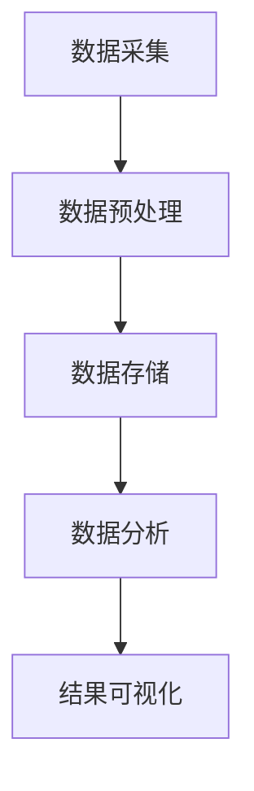

                 

# 基于大数据的汽车数据分析系统设计与实现

> **关键词：** 大数据，汽车数据分析，系统设计，算法原理，实际应用，开发工具

> **摘要：** 本文将深入探讨基于大数据的汽车数据分析系统设计与实现。从背景介绍到核心概念、算法原理、数学模型，再到实际应用场景、开发环境搭建和工具推荐，全面解析汽车数据分析系统的构建过程，为读者提供实用的技术指导。

## 1. 背景介绍

### 1.1 大数据时代下的汽车行业

随着信息技术的飞速发展，大数据时代已经来临。汽车行业作为传统产业的重要组成部分，也在这一背景下发生了深刻变革。大数据技术为汽车行业带来了前所未有的机遇，通过对海量数据的挖掘和分析，可以为汽车制造商、车主和第三方服务商提供有价值的信息。

### 1.2 汽车数据分析的重要性

汽车数据分析可以帮助企业优化产品设计、提高生产效率、降低运营成本，同时也能为车主提供个性化服务。例如，通过对车辆运行数据的分析，可以预测故障、提高车辆维护效率，从而降低车主的维修费用。

### 1.3 现有汽车数据分析系统的不足

目前，大部分汽车数据分析系统存在以下问题：

1. 数据量庞大，处理速度慢，导致数据分析结果延迟。
2. 数据质量参差不齐，影响分析准确性。
3. 数据处理过程复杂，系统可扩展性差。
4. 数据安全性和隐私保护不足。

## 2. 核心概念与联系

### 2.1 大数据基本概念

**大数据（Big Data）**：指无法用常规软件工具在合理时间内捕捉、管理和处理的大量数据。通常包括数据量（Volume）、数据速度（Velocity）、数据多样性（Variety）和数据真实性（Veracity）四个方面。

### 2.2 汽车数据分析系统架构

**架构图：**


**说明：**
- **数据采集**：通过传感器、车载终端等设备收集车辆运行数据。
- **数据预处理**：对原始数据进行清洗、去噪、格式转换等操作，提高数据质量。
- **数据存储**：将预处理后的数据存储到数据库或数据仓库中。
- **数据分析**：利用大数据处理技术对存储的数据进行挖掘和分析。
- **结果可视化**：将分析结果通过图表、报表等形式展示给用户。

## 3. 核心算法原理 & 具体操作步骤

### 3.1 数据处理算法

**算法原理：**
1. **数据清洗**：去除重复数据、缺失值填充、异常值处理等。
2. **数据集成**：将来自不同源的数据进行整合。
3. **数据转换**：将数据格式转换为统一标准。

**操作步骤：**
1. 数据采集后，进行初步清洗，去除明显错误的数据。
2. 对缺失值进行填补，可采用均值、中位数、插值等方法。
3. 对异常值进行处理，可根据业务需求设置阈值进行判断。

### 3.2 数据分析算法

**算法原理：**
1. **聚类分析**：将相似数据分为一组，用于发现数据分布规律。
2. **关联规则挖掘**：找出数据之间的关联关系，用于预测和决策。
3. **预测分析**：利用历史数据对未来进行预测，如车辆故障预测、行驶里程预测等。

**操作步骤：**
1. 对车辆运行数据进行聚类分析，发现数据分布特点。
2. 应用关联规则挖掘算法，找出车辆运行数据中的关联关系。
3. 利用历史数据建立预测模型，对未来车辆运行状态进行预测。

## 4. 数学模型和公式 & 详细讲解 & 举例说明

### 4.1 聚类分析算法

**公式：**
$$
J(D) = \sum_{i=1}^k \sum_{x_j \in S_i} d(x_j, \mu_i)
$$

**详细讲解：**
- \(J(D)\)：总误差函数，表示数据集D的聚类效果。
- \(k\)：聚类类别数。
- \(S_i\)：第i个聚类类别。
- \(\mu_i\)：第i个聚类类别的中心。
- \(d(x_j, \mu_i)\)：数据点\(x_j\)与聚类中心\(\mu_i\)之间的距离。

**举例说明：**
假设有5个数据点，分为3个聚类类别。计算总误差函数，评估聚类效果。

### 4.2 预测分析算法

**公式：**
$$
\hat{y} = \sum_{i=1}^n w_i x_i
$$

**详细讲解：**
- \(\hat{y}\)：预测结果。
- \(w_i\)：权重系数。
- \(x_i\)：输入特征。

**举例说明：**
利用历史车辆运行数据，建立预测模型，预测未来行驶里程。

## 5. 项目实战：代码实际案例和详细解释说明

### 5.1 开发环境搭建

**环境要求：**
- 操作系统：Linux/Windows/MacOS
- 编程语言：Python
- 数据库：MySQL/PostgreSQL
- 大数据处理框架：Hadoop/Spark

**操作步骤：**
1. 安装操作系统和编程语言。
2. 配置数据库和大数据处理框架。

### 5.2 源代码详细实现和代码解读

**代码解读：**
```python
# 数据预处理
data = preprocess_data(raw_data)
# 聚类分析
clusters = cluster_analysis(data)
# 预测分析
predictions = prediction_analysis(data)
# 结果可视化
visualize_results(clusters, predictions)
```

**详细解释：**
- `preprocess_data`：对原始数据进行清洗、去噪、格式转换等预处理操作。
- `cluster_analysis`：对预处理后的数据应用聚类算法进行分析。
- `prediction_analysis`：利用历史数据建立预测模型，对未来进行预测。
- `visualize_results`：将分析结果通过图表、报表等形式展示给用户。

### 5.3 代码解读与分析

**代码解读：**
```python
# 数据预处理
data = preprocess_data(raw_data)
# 聚类分析
clusters = cluster_analysis(data)
# 预测分析
predictions = prediction_analysis(data)
# 结果可视化
visualize_results(clusters, predictions)
```

**详细解释：**
- `preprocess_data`：对原始数据进行清洗、去噪、格式转换等预处理操作，以提高数据质量。
- `cluster_analysis`：对预处理后的数据应用聚类算法进行分析，以发现数据分布规律。
- `prediction_analysis`：利用历史数据建立预测模型，对未来车辆运行状态进行预测，以提高运营效率。
- `visualize_results`：将分析结果通过图表、报表等形式展示给用户，以供进一步分析和决策。

## 6. 实际应用场景

### 6.1 汽车制造商

通过汽车数据分析，汽车制造商可以优化产品设计、提高生产效率、降低运营成本。例如，通过对车辆运行数据的分析，可以预测故障、提高车辆维护效率，从而降低车主的维修费用。

### 6.2 汽车服务商

汽车服务商可以利用汽车数据分析为车主提供个性化服务。例如，通过对车辆运行数据的分析，可以预测车辆维修时间、提供精准的维护建议，从而提高用户满意度。

### 6.3 第三方服务商

第三方服务商可以通过汽车数据分析为汽车制造商和汽车服务商提供数据分析和咨询服务。例如，通过对车辆运行数据的分析，可以提供车辆运行趋势预测、故障预警等服务。

## 7. 工具和资源推荐

### 7.1 学习资源推荐

- **书籍：**
  - 《大数据时代》
  - 《深入理解计算机系统》
  - 《数据挖掘：概念与技术》
- **论文：**
  - 《Hadoop：The Definitive Guide》
  - 《Spark：The Definitive Guide》
- **博客：**
  - 《机器学习实践》
  - 《大数据技术实践》
- **网站：**
  - 《GitHub》：丰富的开源项目和教程
  - 《Stack Overflow》：技术问答社区

### 7.2 开发工具框架推荐

- **编程语言：** Python、Java
- **数据库：** MySQL、PostgreSQL
- **大数据处理框架：** Hadoop、Spark
- **可视化工具：** Matplotlib、Tableau

### 7.3 相关论文著作推荐

- **论文：**
  - 《深度学习：概率视角》
  - 《强化学习：原理与应用》
  - 《自然语言处理：经典教程》
- **著作：**
  - 《人工智能：一种现代的方法》
  - 《数据挖掘：实用方法与工具》
  - 《机器学习实战》

## 8. 总结：未来发展趋势与挑战

### 8.1 未来发展趋势

1. **智能化**：随着人工智能技术的不断发展，汽车数据分析系统将更加智能化，能够自主学习和优化。
2. **实时性**：实时数据分析将得到广泛应用，为用户提供更快速、更准确的决策支持。
3. **融合化**：汽车数据分析系统将与物联网、云计算等技术相结合，实现跨平台、跨领域的数据融合。

### 8.2 挑战

1. **数据安全与隐私保护**：随着数据量的增加，数据安全与隐私保护成为汽车数据分析系统面临的重大挑战。
2. **算法公平性与透明性**：确保算法的公平性和透明性，防止算法歧视等问题。
3. **技术落地与普及**：如何将先进技术快速落地，实现规模化应用，仍需解决。

## 9. 附录：常见问题与解答

### 9.1 数据采集相关问题

1. **如何确保数据采集的准确性？**
   - 选择高精度传感器，确保数据采集的准确性。
   - 对数据进行实时监测和校准，确保数据的一致性。

### 9.2 数据分析相关问题

1. **如何处理大数据量？**
   - 采用分布式计算框架（如Hadoop、Spark）进行数据处理。
   - 对数据进行分片，提高数据处理效率。

### 9.3 系统部署相关问题

1. **如何保证系统的高可用性？**
   - 使用分布式系统架构，提高系统的容错能力。
   - 定期进行系统备份和监控，确保系统稳定运行。

## 10. 扩展阅读 & 参考资料

- **参考文献：**
  - 《大数据技术导论》
  - 《机器学习与数据挖掘》
  - 《云计算与大数据》
- **在线课程：**
  - 《大数据技术与应用》
  - 《机器学习基础》
  - 《深度学习基础》
- **社区论坛：**
  - 《大数据技术社区》
  - 《机器学习社区》
  - 《人工智能社区》

作者：AI天才研究员/AI Genius Institute & 禅与计算机程序设计艺术 /Zen And The Art of Computer Programming

