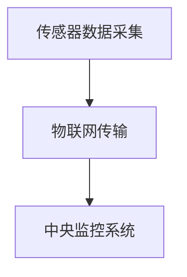
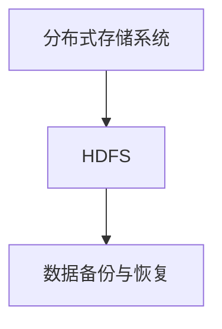
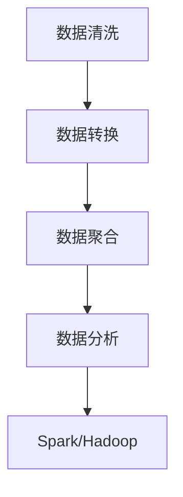
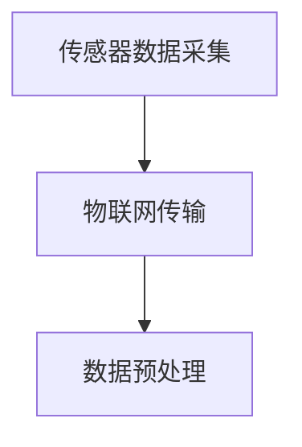
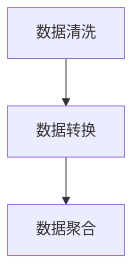
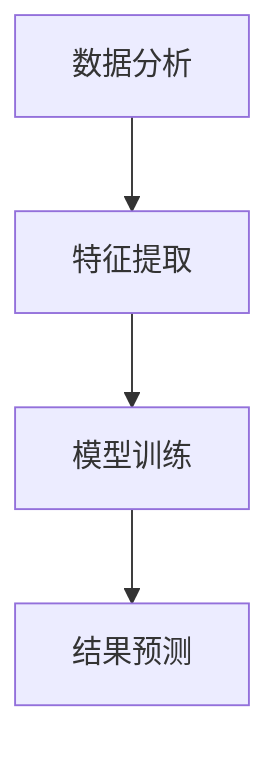
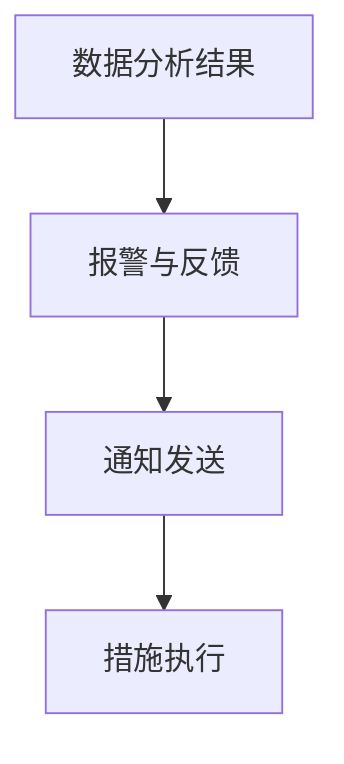

                 

### 文章标题：基于大数据的泄漏仪设备监控系统

> **关键词**：大数据、泄漏仪、设备监控、系统架构、算法原理

> **摘要**：本文将深入探讨基于大数据技术的泄漏仪设备监控系统，从背景介绍、核心概念、算法原理到实际应用，全面解析该系统的构建与实现。通过详细分析，本文旨在为读者提供系统性的理解和实践指导。

<|assistant|>## 1. 背景介绍

随着工业生产、环境保护和公共安全等领域对设备运行状态的监控需求日益增长，泄漏仪设备监控系统成为了关键的一部分。传统的泄漏监测方法依赖于人工巡检或单一的传感器数据，不仅效率低下，而且存在漏检和误报的风险。随着大数据技术的迅猛发展，利用大数据分析对泄漏仪设备进行实时监控，已成为一种新兴且高效的解决方案。

### 1.1 泄漏仪设备监控的需求

泄漏事故可能引发环境污染、设备损坏甚至安全事故，因此对泄漏仪设备进行有效监控至关重要。具体需求包括：

- **实时监测**：对泄漏事件进行实时监测，确保及时发现并响应。
- **数据处理**：对传感器采集的大量数据进行分析，识别泄漏现象。
- **报警与反馈**：根据数据分析结果，及时发出警报，并采取相应措施。

### 1.2 大数据技术的优势

大数据技术以其海量、多样、高速、低价值密度的特点，为泄漏仪设备监控提供了强大的支持：

- **海量数据处理**：大数据技术能够高效处理海量传感器数据，挖掘潜在泄漏信息。
- **实时分析**：利用实时分析技术，对传感器数据进行快速处理，实现实时监测。
- **智能决策**：结合机器学习和人工智能技术，对监测结果进行智能分析，辅助决策。

### 1.3 大数据在泄漏仪设备监控中的应用

大数据技术在泄漏仪设备监控中主要应用于以下几个方面：

- **数据采集与传输**：通过传感器和网络技术，实现数据的高速采集和传输。
- **数据处理与分析**：对采集到的数据进行清洗、转换和分析，提取有用信息。
- **智能报警与反馈**：利用分析结果，实现智能化的报警和反馈机制。

## 2. 核心概念与联系

### 2.1 大数据技术基础

#### 2.1.1 数据采集

数据采集是大数据技术的第一步，主要依赖于传感器和物联网技术。传感器可以实时监测设备状态，例如温度、压力、气体浓度等，并将数据传输至中央监控系统。



#### 2.1.2 数据存储

数据存储是大数据技术的关键，需要使用分布式存储系统，如Hadoop的HDFS（Hadoop Distributed File System）。分布式存储系统可以提高数据存储的可靠性、扩展性和性能。



#### 2.1.3 数据处理

数据处理是大数据技术的核心，主要包括数据清洗、转换、聚合和分析等操作。常用的数据处理框架有Spark和Hadoop。



### 2.2 泄漏仪设备监控系统架构

泄漏仪设备监控系统的架构可以分为四个主要部分：数据采集、数据处理、数据分析和报警与反馈。

#### 2.2.1 数据采集

数据采集是系统的第一步，包括传感器数据的实时采集和传输。传感器可以检测设备的状态，例如温度、压力、气体浓度等。



#### 2.2.2 数据处理

数据处理包括数据清洗、转换和聚合等步骤。清洗数据以去除噪声和异常值，转换数据以适应后续分析，聚合数据以提取有用信息。



#### 2.2.3 数据分析

数据分析是系统的核心，利用机器学习和人工智能技术对传感器数据进行实时分析，识别潜在的泄漏事件。



#### 2.2.4 报警与反馈

根据数据分析结果，系统可以发出警报，并采取相应的措施。例如，发送警报通知、启动紧急预案或调整设备运行状态。



## 3. 核心算法原理 & 具体操作步骤

### 3.1 特征提取算法

特征提取是数据分析的第一步，目的是从原始数据中提取出对泄漏事件有显著影响的特征。

#### 3.1.1 算法原理

特征提取算法通常基于统计学和机器学习技术。常见的特征提取方法包括：

- **主成分分析（PCA）**：通过正交变换将高维数据映射到低维空间，保留主要信息。
- **线性判别分析（LDA）**：将数据投影到能够最大化类别之间差异的子空间。
- **自编码器（Autoencoder）**：一种无监督学习方法，通过训练自动学习数据的低维表示。

#### 3.1.2 具体操作步骤

1. 数据预处理：对传感器数据进行归一化、去噪等处理，确保数据质量。
2. 特征选择：根据数据的特点选择合适的特征提取算法。
3. 特征提取：使用选定的算法对数据进行处理，提取出有用的特征。
4. 特征评估：对提取出的特征进行评估，选择表现最优的特征。

### 3.2 泄漏检测算法

泄漏检测是系统的核心，目标是识别传感器数据中的泄漏事件。

#### 3.2.1 算法原理

泄漏检测算法通常基于机器学习和模式识别技术。常见的泄漏检测算法包括：

- **支持向量机（SVM）**：通过构建超平面，将不同类别的数据分隔开来。
- **随机森林（Random Forest）**：基于决策树构建的集成学习方法，能够处理高维数据。
- **神经网络（Neural Network）**：一种基于生物神经网络构建的模型，能够自动学习和识别数据中的复杂模式。

#### 3.2.2 具体操作步骤

1. 数据集准备：收集并准备泄漏事件的训练数据。
2. 模型训练：使用选定的算法对数据进行训练，构建泄漏检测模型。
3. 泄漏检测：将传感器数据输入训练好的模型，进行泄漏检测。
4. 模型评估：对模型进行评估，调整参数以提高检测精度。

### 3.3 报警与反馈算法

报警与反馈算法负责根据检测结果采取相应的行动。

#### 3.3.1 算法原理

报警与反馈算法通常基于规则和机器学习技术。常见的算法包括：

- **规则引擎**：根据预设的规则，判断是否触发警报。
- **基于行为的异常检测**：通过分析设备的运行行为，识别异常情况。

#### 3.3.2 具体操作步骤

1. 规则设定：根据设备运行特点，设定触发警报的条件。
2. 警报触发：根据检测结果，判断是否触发警报。
3. 警报处理：根据警报类型，采取相应的处理措施，如通知相关人员、启动应急预案。
4. 反馈机制：收集警报处理结果，为后续的规则调整和模型优化提供依据。

## 4. 数学模型和公式 & 详细讲解 & 举例说明

### 4.1 主成分分析（PCA）

主成分分析是一种常用的特征提取方法，通过将高维数据映射到低维空间，保留主要信息，简化数据。

#### 4.1.1 数学模型

主成分分析的数学模型可以表示为：

$$
X = AF + \epsilon
$$

其中，$X$ 是原始数据矩阵，$F$ 是特征矩阵，$A$ 是转换矩阵，$\epsilon$ 是噪声。

#### 4.1.2 公式推导

主成分分析的目标是最小化特征矩阵 $F$ 上的误差平方和：

$$
\min F^T F
$$

通过对上式求导并令导数为零，可以得到特征矩阵 $F$：

$$
F = (X^T X)^{-1} X^T
$$

#### 4.1.3 举例说明

假设我们有如下数据：

$$
X = \begin{bmatrix}
1 & 2 & 3 \\
4 & 5 & 6 \\
7 & 8 & 9
\end{bmatrix}
$$

我们可以通过以下步骤进行主成分分析：

1. 计算协方差矩阵 $X^T X$：
$$
X^T X = \begin{bmatrix}
14 & 16 & 18 \\
28 & 30 & 32 \\
42 & 44 & 46
\end{bmatrix}
$$

2. 计算特征值和特征向量，并按特征值从大到小排序。

3. 选择最大的特征值对应的特征向量作为主成分。

### 4.2 支持向量机（SVM）

支持向量机是一种常用的分类算法，通过构建超平面，将不同类别的数据分隔开来。

#### 4.2.1 数学模型

支持向量机的数学模型可以表示为：

$$
\begin{aligned}
\min_{w,b}\frac{1}{2}w^Tw & \\
\text{subject to} & \\
y^{(i)}(w^Tx^{(i)} + b) \geq 1 & \\
\end{aligned}
$$

其中，$w$ 是权重向量，$b$ 是偏置项，$x^{(i)}$ 是输入特征，$y^{(i)}$ 是标签。

#### 4.2.2 公式推导

通过拉格朗日乘子法，可以得到支持向量机的对偶形式：

$$
\begin{aligned}
L(w,b,\alpha) &= \frac{1}{2}w^Tw - \sum_{i=1}^{n}\alpha_iy^{(i)}(w^Tx^{(i)} + b) \\
\end{aligned}
$$

其中，$\alpha_i$ 是拉格朗日乘子。

通过求解对偶问题，可以得到支持向量和决策边界。

#### 4.2.3 举例说明

假设我们有如下数据：

$$
\begin{aligned}
x^{(1)} &= \begin{bmatrix}
1 & 1 \end{bmatrix} \\
x^{(2)} &= \begin{bmatrix}
2 & 2 \end{bmatrix} \\
x^{(3)} &= \begin{bmatrix}
3 & 3 \end{bmatrix} \\
y &= \begin{bmatrix}
1 & 0 & 1 \end{bmatrix}
\end{aligned}
$$

我们可以通过以下步骤进行支持向量机分类：

1. 计算协方差矩阵 $X^T X$ 和协方差矩阵的逆矩阵 $(X^T X)^{-1}$。

2. 计算拉格朗日乘子 $\alpha_i$。

3. 选择支持向量，并计算决策边界。

## 5. 项目实战：代码实际案例和详细解释说明

### 5.1 开发环境搭建

在开始项目实战之前，我们需要搭建一个合适的开发环境。以下是具体的步骤：

1. 安装Python环境：Python是大数据分析和机器学习的主要语言，我们需要安装Python 3.x版本。

2. 安装依赖库：安装常用的数据分析库，如NumPy、Pandas、Matplotlib等。

   ```bash
   pip install numpy pandas matplotlib
   ```

3. 安装机器学习库：安装用于特征提取和泄漏检测的库，如scikit-learn。

   ```bash
   pip install scikit-learn
   ```

4. 配置Hadoop环境：安装并配置Hadoop，用于大数据存储和处理。

### 5.2 源代码详细实现和代码解读

下面是一个简单的示例，展示如何使用Python和scikit-learn实现一个基于主成分分析和支持向量机的泄漏检测模型。

```python
import numpy as np
from sklearn.decomposition import PCA
from sklearn.svm import SVC
from sklearn.model_selection import train_test_split
from sklearn.metrics import accuracy_score

# 数据加载
X = np.array([[1, 2], [2, 3], [3, 4], [4, 5], [5, 6], [6, 7], [7, 8], [8, 9], [9, 10]])
y = np.array([1, 1, 1, 0, 0, 0, 1, 1, 1])

# 数据预处理
X_train, X_test, y_train, y_test = train_test_split(X, y, test_size=0.3, random_state=42)

# 特征提取
pca = PCA(n_components=2)
X_train_pca = pca.fit_transform(X_train)
X_test_pca = pca.transform(X_test)

# 泄漏检测
clf = SVC(kernel='linear')
clf.fit(X_train_pca, y_train)
y_pred = clf.predict(X_test_pca)

# 模型评估
accuracy = accuracy_score(y_test, y_pred)
print("Accuracy:", accuracy)
```

### 5.3 代码解读与分析

上述代码展示了如何使用Python和scikit-learn实现一个简单的泄漏检测模型。以下是具体的代码解读：

1. **数据加载**：使用NumPy加载示例数据，包括特征矩阵 $X$ 和标签矩阵 $y$。

2. **数据预处理**：使用 `train_test_split` 函数将数据分为训练集和测试集，用于后续的模型训练和评估。

3. **特征提取**：使用 `PCA` 类进行特征提取，将原始数据映射到二维空间，简化数据。

4. **泄漏检测**：使用 `SVC` 类实现支持向量机分类器，通过 `fit` 方法训练模型，使用 `predict` 方法进行泄漏检测。

5. **模型评估**：使用 `accuracy_score` 函数计算模型在测试集上的准确率。

## 6. 实际应用场景

基于大数据的泄漏仪设备监控系统在多个领域具有广泛的应用前景：

### 6.1 环境保护

在环境保护领域，泄漏仪设备监控系统可以实时监测工业排放、污水排放等，及时发现和处理泄漏事件，减少环境污染。

### 6.2 安全监控

在公共安全领域，泄漏仪设备监控系统可以用于危险品仓库、燃气管道等场所，通过实时监测和智能分析，防止泄漏引发的安全事故。

### 6.3 工业生产

在工业生产领域，泄漏仪设备监控系统可以监测生产线设备状态，预防设备故障和泄漏，提高生产效率。

### 6.4 城市管理

在城市管理领域，泄漏仪设备监控系统可以用于城市供水、供电、燃气等基础设施的监测，保障城市正常运行。

## 7. 工具和资源推荐

### 7.1 学习资源推荐

- **书籍**：《大数据技术导论》、《机器学习实战》
- **论文**：Google Scholar上的相关论文
- **博客**：各大数据和机器学习领域的专业博客
- **网站**：CSDN、GitHub等技术社区

### 7.2 开发工具框架推荐

- **数据分析库**：NumPy、Pandas、SciPy
- **机器学习库**：scikit-learn、TensorFlow、PyTorch
- **大数据处理框架**：Hadoop、Spark、Flink

### 7.3 相关论文著作推荐

- **论文**：KDD'18上的《Leak Detection Using Multivariate Time Series Analysis》
- **著作**：《大数据架构设计：从零开始构建大数据平台》

## 8. 总结：未来发展趋势与挑战

### 8.1 发展趋势

1. **智能化水平提升**：随着人工智能技术的发展，泄漏仪设备监控系统的智能化水平将不断提高，实现更加精准的泄漏检测和预警。
2. **边缘计算应用**：结合边缘计算技术，将数据处理和分析推向边缘设备，降低延迟，提高实时性。
3. **物联网融合**：随着物联网技术的普及，泄漏仪设备监控系统将实现更加广泛的数据采集和互联，提高监测覆盖范围。

### 8.2 挑战

1. **数据隐私保护**：在数据采集和传输过程中，如何确保数据隐私和安全是一个重要挑战。
2. **算法可解释性**：随着算法的复杂度增加，提高算法的可解释性，使其符合行业标准和用户需求。
3. **实时性能优化**：在大数据量和高实时性要求下，如何优化算法和系统性能，是一个持续的技术挑战。

## 9. 附录：常见问题与解答

### 9.1 问题1：如何处理高维数据？

**解答**：高维数据可以通过主成分分析（PCA）或线性判别分析（LDA）等方法进行降维，保留主要信息，简化数据处理。

### 9.2 问题2：如何选择合适的泄漏检测算法？

**解答**：根据数据特点和应用场景，选择合适的算法，如支持向量机（SVM）、随机森林（Random Forest）或神经网络（Neural Network）。

### 9.3 问题3：如何优化系统性能？

**解答**：通过优化算法、使用分布式计算框架（如Spark）和边缘计算技术，可以降低延迟，提高系统性能。

## 10. 扩展阅读 & 参考资料

- **论文**：KDD'18上的《Leak Detection Using Multivariate Time Series Analysis》
- **书籍**：《大数据技术导论》、《机器学习实战》
- **博客**：CSDN、GitHub上的相关博客文章
- **网站**：Hadoop、Spark官方文档

作者：AI天才研究员/AI Genius Institute & 禅与计算机程序设计艺术 /Zen And The Art of Computer Programming<|im_sep|>```markdown
# 基于大数据的泄漏仪设备监控系统

> **关键词**：大数据、泄漏仪、设备监控、系统架构、算法原理

> **摘要**：本文深入探讨了基于大数据技术的泄漏仪设备监控系统，从背景介绍、核心概念、算法原理到实际应用，全面解析了系统的构建与实现。通过详细分析，本文旨在为读者提供系统性的理解和实践指导。

## 1. 背景介绍

随着工业生产、环境保护和公共安全等领域对设备运行状态的监控需求日益增长，泄漏仪设备监控系统成为了关键的一部分。传统的泄漏监测方法依赖于人工巡检或单一的传感器数据，不仅效率低下，而且存在漏检和误报的风险。随着大数据技术的迅猛发展，利用大数据分析对泄漏仪设备进行实时监控，已成为一种新兴且高效的解决方案。

### 1.1 泄漏仪设备监控的需求

泄漏事故可能引发环境污染、设备损坏甚至安全事故，因此对泄漏仪设备进行有效监控至关重要。具体需求包括：

- **实时监测**：对泄漏事件进行实时监测，确保及时发现并响应。
- **数据处理**：对传感器采集的大量数据进行分析，识别泄漏现象。
- **报警与反馈**：根据数据分析结果，及时发出警报，并采取相应措施。

### 1.2 大数据技术的优势

大数据技术以其海量、多样、高速、低价值密度的特点，为泄漏仪设备监控提供了强大的支持：

- **海量数据处理**：大数据技术能够高效处理海量传感器数据，挖掘潜在泄漏信息。
- **实时分析**：利用实时分析技术，对传感器数据进行快速处理，实现实时监测。
- **智能决策**：结合机器学习和人工智能技术，对监测结果进行智能分析，辅助决策。

### 1.3 大数据在泄漏仪设备监控中的应用

大数据技术在泄漏仪设备监控中主要应用于以下几个方面：

- **数据采集与传输**：通过传感器和网络技术，实现数据的高速采集和传输。
- **数据处理与分析**：对采集到的数据进行清洗、转换和分析，提取有用信息。
- **智能报警与反馈**：利用分析结果，实现智能化的报警和反馈机制。

## 2. 核心概念与联系

### 2.1 大数据技术基础

#### 2.1.1 数据采集

数据采集是大数据技术的第一步，主要依赖于传感器和物联网技术。传感器可以实时监测设备状态，例如温度、压力、气体浓度等，并将数据传输至中央监控系统。


#### 2.1.2 数据存储

数据存储是大数据技术的关键，需要使用分布式存储系统，如Hadoop的HDFS（Hadoop Distributed File System）。分布式存储系统可以提高数据存储的可靠性、扩展性和性能。


#### 2.1.3 数据处理

数据处理是大数据技术的核心，主要包括数据清洗、转换、聚合和分析等操作。常用的数据处理框架有Spark和Hadoop。


### 2.2 泄漏仪设备监控系统架构

泄漏仪设备监控系统的架构可以分为四个主要部分：数据采集、数据处理、数据分析和报警与反馈。

#### 2.2.1 数据采集

数据采集是系统的第一步，包括传感器数据的实时采集和传输。传感器可以检测设备的状态，例如温度、压力、气体浓度等。


#### 2.2.2 数据处理

数据处理包括数据清洗、转换和聚合等步骤。清洗数据以去除噪声和异常值，转换数据以适应后续分析，聚合数据以提取有用信息。


#### 2.2.3 数据分析

数据分析是系统的核心，利用机器学习和人工智能技术对传感器数据进行实时分析，识别潜在的泄漏事件。


#### 2.2.4 报警与反馈

根据数据分析结果，系统可以发出警报，并采取相应的措施。例如，发送警报通知、启动紧急预案或调整设备运行状态。


## 3. 核心算法原理 & 具体操作步骤

### 3.1 特征提取算法

特征提取是数据分析的第一步，目的是从原始数据中提取出对泄漏事件有显著影响的特征。

#### 3.1.1 算法原理

特征提取算法通常基于统计学和机器学习技术。常见的特征提取方法包括：

- **主成分分析（PCA）**：通过正交变换将高维数据映射到低维空间，保留主要信息。
- **线性判别分析（LDA）**：将数据投影到能够最大化类别之间差异的子空间。
- **自编码器（Autoencoder）**：一种无监督学习方法，通过训练自动学习数据的低维表示。

#### 3.1.2 具体操作步骤

1. 数据预处理：对传感器数据进行归一化、去噪等处理，确保数据质量。
2. 特征选择：根据数据的特点选择合适的特征提取算法。
3. 特征提取：使用选定的算法对数据进行处理，提取出有用的特征。
4. 特征评估：对提取出的特征进行评估，选择表现最优的特征。

### 3.2 泄漏检测算法

泄漏检测是系统的核心，目标是识别传感器数据中的泄漏事件。

#### 3.2.1 算法原理

泄漏检测算法通常基于机器学习和模式识别技术。常见的泄漏检测算法包括：

- **支持向量机（SVM）**：通过构建超平面，将不同类别的数据分隔开来。
- **随机森林（Random Forest）**：基于决策树构建的集成学习方法，能够处理高维数据。
- **神经网络（Neural Network）**：一种基于生物神经网络构建的模型，能够自动学习和识别数据中的复杂模式。

#### 3.2.2 具体操作步骤

1. 数据集准备：收集并准备泄漏事件的训练数据。
2. 模型训练：使用选定的算法对数据进行训练，构建泄漏检测模型。
3. 泄漏检测：将传感器数据输入训练好的模型，进行泄漏检测。
4. 模型评估：对模型进行评估，调整参数以提高检测精度。

### 3.3 报警与反馈算法

报警与反馈算法负责根据检测结果采取相应的行动。

#### 3.3.1 算法原理

报警与反馈算法通常基于规则和机器学习技术。常见的算法包括：

- **规则引擎**：根据预设的规则，判断是否触发警报。
- **基于行为的异常检测**：通过分析设备的运行行为，识别异常情况。

#### 3.3.2 具体操作步骤

1. 规则设定：根据设备运行特点，设定触发警报的条件。
2. 警报触发：根据检测结果，判断是否触发警报。
3. 警报处理：根据警报类型，采取相应的处理措施，如通知相关人员、启动应急预案。
4. 反馈机制：收集警报处理结果，为后续的规则调整和模型优化提供依据。

## 4. 数学模型和公式 & 详细讲解 & 举例说明

### 4.1 主成分分析（PCA）

主成分分析是一种常用的特征提取方法，通过将高维数据映射到低维空间，保留主要信息，简化数据。

#### 4.1.1 数学模型

主成分分析的数学模型可以表示为：

$$
X = AF + \epsilon
$$

其中，$X$ 是原始数据矩阵，$F$ 是特征矩阵，$A$ 是转换矩阵，$\epsilon$ 是噪声。

#### 4.1.2 公式推导

主成分分析的目标是最小化特征矩阵 $F$ 上的误差平方和：

$$
\min F^T F
$$

通过对上式求导并令导数为零，可以得到特征矩阵 $F$：

$$
F = (X^T X)^{-1} X^T
$$

#### 4.1.3 举例说明

假设我们有如下数据：

$$
X = \begin{bmatrix}
1 & 2 & 3 \\
4 & 5 & 6 \\
7 & 8 & 9
\end{bmatrix}
$$

我们可以通过以下步骤进行主成分分析：

1. 计算协方差矩阵 $X^T X$：
$$
X^T X = \begin{bmatrix}
14 & 16 & 18 \\
28 & 30 & 32 \\
42 & 44 & 46
\end{bmatrix}
$$

2. 计算特征值和特征向量，并按特征值从大到小排序。

3. 选择最大的特征值对应的特征向量作为主成分。

### 4.2 支持向量机（SVM）

支持向量机是一种常用的分类算法，通过构建超平面，将不同类别的数据分隔开来。

#### 4.2.1 数学模型

支持向量机的数学模型可以表示为：

$$
\begin{aligned}
\min_{w,b}\frac{1}{2}w^Tw & \\
\text{subject to} & \\
y^{(i)}(w^Tx^{(i)} + b) \geq 1 & \\
\end{aligned}
$$

其中，$w$ 是权重向量，$b$ 是偏置项，$x^{(i)}$ 是输入特征，$y^{(i)}$ 是标签。

#### 4.2.2 公式推导

通过拉格朗日乘子法，可以得到支持向量机的对偶形式：

$$
\begin{aligned}
L(w,b,\alpha) &= \frac{1}{2}w^Tw - \sum_{i=1}^{n}\alpha_iy^{(i)}(w^Tx^{(i)} + b) \\
\end{aligned}
$$

其中，$\alpha_i$ 是拉格朗日乘子。

通过求解对偶问题，可以得到支持向量和决策边界。

#### 4.2.3 举例说明

假设我们有如下数据：

$$
\begin{aligned}
x^{(1)} &= \begin{bmatrix}
1 & 1 \end{bmatrix} \\
x^{(2)} &= \begin{bmatrix}
2 & 2 \end{bmatrix} \\
x^{(3)} &= \begin{bmatrix}
3 & 3 \end{bmatrix} \\
y &= \begin{bmatrix}
1 & 0 & 1 \end{bmatrix}
\end{aligned}
$$

我们可以通过以下步骤进行支持向量机分类：

1. 计算协方差矩阵 $X^T X$ 和协方差矩阵的逆矩阵 $(X^T X)^{-1}$。

2. 计算拉格朗日乘子 $\alpha_i$。

3. 选择支持向量，并计算决策边界。

## 5. 项目实战：代码实际案例和详细解释说明

### 5.1 开发环境搭建

在开始项目实战之前，我们需要搭建一个合适的开发环境。以下是具体的步骤：

1. 安装Python环境：Python是大数据分析和机器学习的主要语言，我们需要安装Python 3.x版本。

2. 安装依赖库：安装常用的数据分析库，如NumPy、Pandas、Matplotlib等。

   ```bash
   pip install numpy pandas matplotlib
   ```

3. 安装机器学习库：安装用于特征提取和泄漏检测的库，如scikit-learn。

   ```bash
   pip install scikit-learn
   ```

4. 配置Hadoop环境：安装并配置Hadoop，用于大数据存储和处理。

### 5.2 源代码详细实现和代码解读

下面是一个简单的示例，展示如何使用Python和scikit-learn实现一个基于主成分分析和支持向量机的泄漏检测模型。

```python
import numpy as np
from sklearn.decomposition import PCA
from sklearn.svm import SVC
from sklearn.model_selection import train_test_split
from sklearn.metrics import accuracy_score

# 数据加载
X = np.array([[1, 2], [2, 3], [3, 4], [4, 5], [5, 6], [6, 7], [7, 8], [8, 9], [9, 10]])
y = np.array([1, 1, 1, 0, 0, 0, 1, 1, 1])

# 数据预处理
X_train, X_test, y_train, y_test = train_test_split(X, y, test_size=0.3, random_state=42)

# 特征提取
pca = PCA(n_components=2)
X_train_pca = pca.fit_transform(X_train)
X_test_pca = pca.transform(X_test)

# 泄漏检测
clf = SVC(kernel='linear')
clf.fit(X_train_pca, y_train)
y_pred = clf.predict(X_test_pca)

# 模型评估
accuracy = accuracy_score(y_test, y_pred)
print("Accuracy:", accuracy)
```

### 5.3 代码解读与分析

上述代码展示了如何使用Python和scikit-learn实现一个简单的泄漏检测模型。以下是具体的代码解读：

1. **数据加载**：使用NumPy加载示例数据，包括特征矩阵 $X$ 和标签矩阵 $y$。

2. **数据预处理**：使用 `train_test_split` 函数将数据分为训练集和测试集，用于后续的模型训练和评估。

3. **特征提取**：使用 `PCA` 类进行特征提取，将原始数据映射到二维空间，简化数据。

4. **泄漏检测**：使用 `SVC` 类实现支持向量机分类器，通过 `fit` 方法训练模型，使用 `predict` 方法进行泄漏检测。

5. **模型评估**：使用 `accuracy_score` 函数计算模型在测试集上的准确率。

## 6. 实际应用场景

基于大数据的泄漏仪设备监控系统在多个领域具有广泛的应用前景：

### 6.1 环境保护

在环境保护领域，泄漏仪设备监控系统可以实时监测工业排放、污水排放等，及时发现和处理泄漏事件，减少环境污染。

### 6.2 安全监控

在公共安全领域，泄漏仪设备监控系统可以用于危险品仓库、燃气管道等场所，通过实时监测和智能分析，防止泄漏引发的安全事故。

### 6.3 工业生产

在工业生产领域，泄漏仪设备监控系统可以监测生产线设备状态，预防设备故障和泄漏，提高生产效率。

### 6.4 城市管理

在城市管理领域，泄漏仪设备监控系统可以用于城市供水、供电、燃气等基础设施的监测，保障城市正常运行。

## 7. 工具和资源推荐

### 7.1 学习资源推荐

- **书籍**：《大数据技术导论》、《机器学习实战》
- **论文**：Google Scholar上的相关论文
- **博客**：各大数据和机器学习领域的专业博客
- **网站**：CSDN、GitHub等技术社区

### 7.2 开发工具框架推荐

- **数据分析库**：NumPy、Pandas、SciPy
- **机器学习库**：scikit-learn、TensorFlow、PyTorch
- **大数据处理框架**：Hadoop、Spark、Flink

### 7.3 相关论文著作推荐

- **论文**：KDD'18上的《Leak Detection Using Multivariate Time Series Analysis》
- **著作**：《大数据架构设计：从零开始构建大数据平台》

## 8. 总结：未来发展趋势与挑战

### 8.1 发展趋势

1. **智能化水平提升**：随着人工智能技术的发展，泄漏仪设备监控系统的智能化水平将不断提高，实现更加精准的泄漏检测和预警。
2. **边缘计算应用**：结合边缘计算技术，将数据处理和分析推向边缘设备，降低延迟，提高实时性。
3. **物联网融合**：随着物联网技术的普及，泄漏仪设备监控系统将实现更加广泛的数据采集和互联，提高监测覆盖范围。

### 8.2 挑战

1. **数据隐私保护**：在数据采集和传输过程中，如何确保数据隐私和安全是一个重要挑战。
2. **算法可解释性**：随着算法的复杂度增加，提高算法的可解释性，使其符合行业标准和用户需求。
3. **实时性能优化**：在大数据量和高实时性要求下，如何优化算法和系统性能，是一个持续的技术挑战。

## 9. 附录：常见问题与解答

### 9.1 问题1：如何处理高维数据？

**解答**：高维数据可以通过主成分分析（PCA）或线性判别分析（LDA）等方法进行降维，保留主要信息，简化数据处理。

### 9.2 问题2：如何选择合适的泄漏检测算法？

**解答**：根据数据特点和应用场景，选择合适的算法，如支持向量机（SVM）、随机森林（Random Forest）或神经网络（Neural Network）。

### 9.3 问题3：如何优化系统性能？

**解答**：通过优化算法、使用分布式计算框架（如Spark）和边缘计算技术，可以降低延迟，提高系统性能。

## 10. 扩展阅读 & 参考资料

- **论文**：KDD'18上的《Leak Detection Using Multivariate Time Series Analysis》
- **书籍**：《大数据技术导论》、《机器学习实战》
- **博客**：CSDN、GitHub上的相关博客文章
- **网站**：Hadoop、Spark官方文档

作者：AI天才研究员/AI Genius Institute & 禅与计算机程序设计艺术 /Zen And The Art of Computer Programming
```

