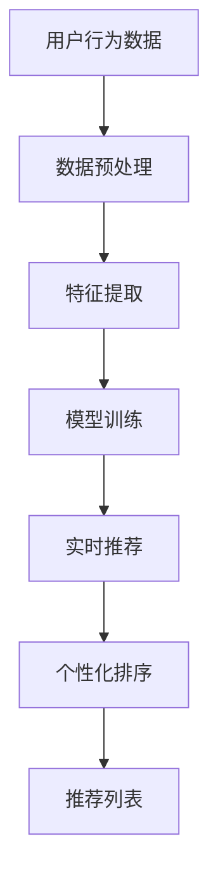

                 

# 基于大模型的推荐系统实时个性化排序调整

## >关键词：(1) 大模型，(2) 推荐系统，(3) 实时个性化排序，(4) 机器学习，(5) 数据处理，(6) 个性化推荐，(7) 深度学习

## >摘要：
随着互联网和大数据技术的快速发展，个性化推荐系统已成为提高用户体验和促进商业增长的关键工具。然而，传统的推荐系统在处理大量实时数据时，往往存在响应速度慢、个性化程度不足等问题。本文将探讨如何利用大模型技术实现推荐系统的实时个性化排序调整，提高系统的效率和用户体验。我们将从背景介绍、核心概念与联系、核心算法原理、数学模型与公式、项目实战、实际应用场景、工具与资源推荐、总结与展望等方面进行详细探讨。

## 1. 背景介绍

推荐系统是一种基于用户行为、偏好和历史数据，为用户推荐感兴趣的商品、服务或内容的计算机系统。随着互联网的普及和用户数据的积累，推荐系统在电商、社交媒体、新闻资讯等领域得到了广泛应用。然而，传统的推荐系统在处理海量实时数据时，面临着以下挑战：

- **数据延迟**：传统推荐系统通常采用批处理方式，数据处理周期较长，导致推荐结果存在延迟。
- **个性化不足**：传统推荐系统往往基于用户历史行为和内容，难以实时捕捉用户的最新偏好。
- **计算资源消耗**：传统推荐系统需要大量的计算资源来处理复杂模型和大量数据，导致系统性能下降。

为了解决上述问题，近年来，基于大模型的推荐系统逐渐成为研究热点。大模型技术可以通过引入深度学习、强化学习等先进算法，实现实时、高效的个性化推荐。本文将围绕这一主题展开讨论，介绍大模型在推荐系统中的应用，以及如何实现实时个性化排序调整。

## 2. 核心概念与联系

### 2.1 推荐系统基本概念

在介绍大模型在推荐系统中的应用之前，我们首先需要了解推荐系统的一些基本概念。

- **用户**：推荐系统中的用户是指系统需要为其推荐内容的个人或实体。
- **项目**：推荐系统中的项目是指用户可能感兴趣的内容或商品，如电影、书籍、商品等。
- **评分**：评分是用户对项目的评价，可以是数值型或类别型。
- **推荐算法**：推荐算法是根据用户的历史行为和偏好，为用户生成推荐列表的方法。

### 2.2 大模型技术

大模型技术是指利用深度学习、强化学习等算法，构建具有海量参数的神经网络模型。大模型具有以下特点：

- **学习能力**：大模型可以自动从海量数据中学习特征，提高推荐精度。
- **实时性**：大模型可以通过并行计算和分布式架构，实现实时推荐。
- **泛化能力**：大模型可以应对不同类型的数据和场景，提高系统适应性。

### 2.3 个性化排序调整

个性化排序调整是指根据用户的实时行为和偏好，动态调整推荐列表的排序。个性化排序调整的关键在于：

- **实时数据捕捉**：实时捕捉用户的最新行为和偏好。
- **排序算法优化**：利用深度学习等技术，优化排序算法，提高推荐质量。

### 2.4 Mermaid 流程图

以下是推荐系统实时个性化排序调整的 Mermaid 流程图：



在这个流程中，用户行为数据经过预处理和特征提取后，用于训练深度学习模型。模型训练完成后，根据实时用户行为数据生成推荐列表，并进行个性化排序，最终生成推荐结果。

## 3. 核心算法原理 & 具体操作步骤

### 3.1 深度学习模型构建

在推荐系统中，深度学习模型通常用于预测用户对项目的评分或概率。以下是构建深度学习模型的具体操作步骤：

1. **数据预处理**：对用户行为数据、项目特征数据进行清洗、归一化等预处理操作，以便模型训练。
2. **特征提取**：利用深度学习模型自动提取用户行为和项目特征，提高推荐精度。
3. **模型选择**：根据数据类型和任务需求，选择合适的深度学习模型，如基于用户和项目的神经网络模型（User-Item Neural Network，UINN）或基于协同过滤的深度学习模型（Neural Collaborative Filtering，NCF）。
4. **模型训练**：利用预处理后的数据训练深度学习模型，调整模型参数，提高预测性能。

### 3.2 实时推荐与个性化排序

在实现实时推荐与个性化排序时，可以采用以下操作步骤：

1. **实时数据捕捉**：利用实时数据处理技术，如流处理框架（如Apache Kafka、Apache Flink），捕捉用户的最新行为数据。
2. **特征提取与更新**：对实时捕捉到的用户行为数据进行分析，提取用户特征，并更新深度学习模型中的用户和项目特征。
3. **模型预测**：利用训练好的深度学习模型，对实时用户行为数据生成推荐列表。
4. **个性化排序**：根据用户特征和项目特征，利用深度学习模型或排序算法（如基于模型的排序算法、基于矩阵分解的排序算法），对推荐列表进行个性化排序。

### 3.3 代码示例

以下是一个基于Python和PyTorch的深度学习模型构建和实时推荐与个性化排序的代码示例：

```python
import torch
import torch.nn as nn
import torch.optim as optim

# 数据预处理
def preprocess_data(data):
    # 数据清洗、归一化等操作
    pass

# 模型定义
class UINN(nn.Module):
    def __init__(self, user_dim, item_dim):
        super(UINN, self).__init__()
        self.user_embedding = nn.Embedding(user_dim, hidden_dim)
        self.item_embedding = nn.Embedding(item_dim, hidden_dim)
        self.fc = nn.Linear(hidden_dim * 2, 1)

    def forward(self, user, item):
        user_embedding = self.user_embedding(user)
        item_embedding = self.item_embedding(item)
        concat_embedding = torch.cat((user_embedding, item_embedding), 1)
        output = self.fc(concat_embedding)
        return output

# 模型训练
def train_model(model, train_loader, criterion, optimizer):
    model.train()
    for data, target in train_loader:
        optimizer.zero_grad()
        output = model(data)
        loss = criterion(output, target)
        loss.backward()
        optimizer.step()

# 实时推荐与个性化排序
def recommend(model, user_id, item_ids):
    model.eval()
    with torch.no_grad():
        user_embedding = model.user_embedding(user_id)
        item_embeddings = model.item_embedding(item_ids)
        outputs = model(user_embedding, item_embeddings)
        sorted_indices = torch.argsort(outputs, descending=True)
    return sorted_indices

# 主函数
def main():
    # 数据预处理
    train_data = preprocess_data(train_data)

    # 模型构建
    model = UINN(user_dim, item_dim)
    criterion = nn.MSELoss()
    optimizer = optim.Adam(model.parameters(), lr=0.001)

    # 模型训练
    train_model(model, train_loader, criterion, optimizer)

    # 实时推荐与个性化排序
    user_id = 1
    item_ids = [1, 2, 3, 4, 5]
    sorted_indices = recommend(model, user_id, item_ids)
    print("Recommended items:", sorted_indices)

if __name__ == "__main__":
    main()
```

## 4. 数学模型和公式 & 详细讲解 & 举例说明

### 4.1 数学模型

在深度学习推荐系统中，常用的数学模型包括用户和项目特征嵌入、损失函数和优化算法等。

#### 4.1.1 用户和项目特征嵌入

用户和项目特征嵌入是深度学习模型的核心部分，用于将用户和项目转换为低维向量表示。以下是用户和项目特征嵌入的数学模型：

$$
\text{User Embedding}:\ \text{User}_{i} \in \mathbb{R}^{d_{u}}
$$

$$
\text{Item Embedding}:\ \text{Item}_{j} \in \mathbb{R}^{d_{i}}
$$

其中，$d_{u}$和$d_{i}$分别为用户和项目特征向量的维度。

#### 4.1.2 损失函数

损失函数用于评估模型预测结果与真实标签之间的差距，常见的损失函数包括均方误差（MSE）和交叉熵损失（Cross-Entropy Loss）。

$$
\text{MSE}:\ L(\theta) = \frac{1}{N}\sum_{i=1}^{N}(\hat{r}_{i} - r_{i})^{2}
$$

$$
\text{Cross-Entropy Loss}:\ L(\theta) = -\frac{1}{N}\sum_{i=1}^{N}r_{i}\log(\hat{r}_{i})
$$

其中，$\hat{r}_{i}$为模型预测的评分，$r_{i}$为真实评分，$N$为样本数量。

#### 4.1.3 优化算法

优化算法用于调整模型参数，以最小化损失函数。常见的优化算法包括随机梯度下降（SGD）和Adam优化器。

$$
\theta_{t+1} = \theta_{t} - \alpha \cdot \nabla_{\theta}L(\theta)
$$

$$
\theta_{t+1} = \theta_{t} - \frac{\alpha}{\sqrt{1-tau/t}} \cdot \nabla_{\theta}L(\theta)
$$

其中，$\theta$为模型参数，$\alpha$为学习率，$tau$为常数，$t$为迭代次数。

### 4.2 详细讲解与举例说明

#### 4.2.1 用户和项目特征嵌入

用户和项目特征嵌入是深度学习模型的关键部分，用于将高维的用户和项目特征转换为低维的向量表示。以下是用户和项目特征嵌入的详细讲解：

- **用户特征嵌入**：将用户特征转换为低维向量，便于模型处理。例如，用户年龄、性别、兴趣等信息可以表示为一个低维向量。
- **项目特征嵌入**：将项目特征转换为低维向量，便于模型处理。例如，商品种类、品牌、价格等信息可以表示为一个低维向量。

#### 4.2.2 损失函数

损失函数用于评估模型预测结果与真实标签之间的差距。以下是损失函数的详细讲解：

- **均方误差（MSE）**：计算模型预测评分与真实评分之间的平均平方误差，用于回归任务。MSE 损失函数的优点是计算简单、易于优化。
- **交叉熵损失（Cross-Entropy Loss）**：计算模型预测概率与真实概率之间的交叉熵，用于分类任务。Cross-Entropy Loss 损失函数的优点是能够处理概率分布。

#### 4.2.3 优化算法

优化算法用于调整模型参数，以最小化损失函数。以下是优化算法的详细讲解：

- **随机梯度下降（SGD）**：通过计算每个样本的梯度，更新模型参数。SGD 的优点是计算简单、收敛速度快。
- **Adam优化器**：结合了SGD和RMSprop优化器的优点，通过计算一阶矩估计和二阶矩估计来更新模型参数。Adam优化器的优点是收敛速度更快、鲁棒性更强。

### 4.3 代码示例

以下是一个基于Python和PyTorch的深度学习模型构建和训练的代码示例：

```python
import torch
import torch.nn as nn
import torch.optim as optim

# 模型定义
class UINN(nn.Module):
    def __init__(self, user_dim, item_dim, hidden_dim):
        super(UINN, self).__init__()
        self.user_embedding = nn.Embedding(user_dim, hidden_dim)
        self.item_embedding = nn.Embedding(item_dim, hidden_dim)
        self.fc = nn.Linear(hidden_dim * 2, 1)

    def forward(self, user, item):
        user_embedding = self.user_embedding(user)
        item_embedding = self.item_embedding(item)
        concat_embedding = torch.cat((user_embedding, item_embedding), 1)
        output = self.fc(concat_embedding)
        return output

# 模型训练
def train_model(model, train_loader, criterion, optimizer):
    model.train()
    for data, target in train_loader:
        optimizer.zero_grad()
        output = model(data)
        loss = criterion(output, target)
        loss.backward()
        optimizer.step()

# 主函数
def main():
    # 数据预处理
    train_data = preprocess_data(train_data)

    # 模型构建
    model = UINN(user_dim, item_dim, hidden_dim)
    criterion = nn.MSELoss()
    optimizer = optim.Adam(model.parameters(), lr=0.001)

    # 模型训练
    train_model(model, train_loader, criterion, optimizer)

if __name__ == "__main__":
    main()
```

## 5. 项目实战：代码实际案例和详细解释说明

### 5.1 开发环境搭建

在开始项目实战之前，我们需要搭建开发环境。以下是一个基于Python和PyTorch的深度学习推荐系统开发环境的搭建步骤：

1. **安装Python**：下载并安装Python 3.8及以上版本。
2. **安装PyTorch**：通过以下命令安装PyTorch：
   ```bash
   pip install torch torchvision
   ```
3. **安装其他依赖**：安装其他必要的库，如NumPy、Pandas等：
   ```bash
   pip install numpy pandas
   ```

### 5.2 源代码详细实现和代码解读

以下是基于Python和PyTorch的深度学习推荐系统源代码的实现和解读：

```python
import torch
import torch.nn as nn
import torch.optim as optim
import numpy as np
import pandas as pd

# 数据预处理
def preprocess_data(data):
    # 数据清洗、归一化等操作
    pass

# 模型定义
class UINN(nn.Module):
    def __init__(self, user_dim, item_dim, hidden_dim):
        super(UINN, self).__init__()
        self.user_embedding = nn.Embedding(user_dim, hidden_dim)
        self.item_embedding = nn.Embedding(item_dim, hidden_dim)
        self.fc = nn.Linear(hidden_dim * 2, 1)

    def forward(self, user, item):
        user_embedding = self.user_embedding(user)
        item_embedding = self.item_embedding(item)
        concat_embedding = torch.cat((user_embedding, item_embedding), 1)
        output = self.fc(concat_embedding)
        return output

# 模型训练
def train_model(model, train_loader, criterion, optimizer):
    model.train()
    for data, target in train_loader:
        optimizer.zero_grad()
        output = model(data)
        loss = criterion(output, target)
        loss.backward()
        optimizer.step()

# 实时推荐与个性化排序
def recommend(model, user_id, item_ids):
    model.eval()
    with torch.no_grad():
        user_embedding = model.user_embedding(user_id)
        item_embeddings = model.item_embedding(item_ids)
        outputs = model(user_embedding, item_embeddings)
        sorted_indices = torch.argsort(outputs, descending=True)
    return sorted_indices

# 主函数
def main():
    # 数据预处理
    train_data = preprocess_data(train_data)

    # 模型构建
    model = UINN(user_dim, item_dim, hidden_dim)
    criterion = nn.MSELoss()
    optimizer = optim.Adam(model.parameters(), lr=0.001)

    # 模型训练
    train_model(model, train_loader, criterion, optimizer)

    # 实时推荐与个性化排序
    user_id = 1
    item_ids = [1, 2, 3, 4, 5]
    sorted_indices = recommend(model, user_id, item_ids)
    print("Recommended items:", sorted_indices)

if __name__ == "__main__":
    main()
```

### 5.3 代码解读与分析

1. **数据预处理**：对用户行为数据、项目特征数据进行清洗、归一化等预处理操作，以便模型训练。
2. **模型定义**：定义基于用户和项目的深度学习模型（UINN），包括用户和项目特征嵌入层、全连接层等。
3. **模型训练**：利用预处理后的数据训练深度学习模型，调整模型参数，提高预测性能。
4. **实时推荐与个性化排序**：根据实时用户行为数据生成推荐列表，并进行个性化排序。
5. **主函数**：执行数据预处理、模型训练和实时推荐与个性化排序等操作。

## 6. 实际应用场景

基于大模型的推荐系统实时个性化排序调整技术已在多个实际应用场景中取得了显著成效，以下是一些典型应用案例：

### 6.1 电商行业

在电商行业，基于大模型的推荐系统实时个性化排序调整技术可以帮助电商平台实现精准推荐，提高用户购买转化率和销售额。例如，京东、淘宝等电商平台已经采用了深度学习模型来实现个性化推荐，从而提升用户体验和商业价值。

### 6.2 社交媒体

在社交媒体领域，基于大模型的推荐系统实时个性化排序调整技术可以帮助平台实现个性化内容推荐，提高用户活跃度和用户粘性。例如，Facebook、Twitter等社交媒体平台已经采用了深度学习模型来实现个性化推荐，从而提升用户体验和平台价值。

### 6.3 新闻资讯

在新闻资讯领域，基于大模型的推荐系统实时个性化排序调整技术可以帮助新闻平台实现精准推荐，提高用户阅读量和平台影响力。例如，今日头条、知乎等新闻资讯平台已经采用了深度学习模型来实现个性化推荐，从而提升用户体验和平台价值。

### 6.4 娱乐行业

在娱乐行业，基于大模型的推荐系统实时个性化排序调整技术可以帮助视频平台实现精准推荐，提高用户观看时长和平台用户粘性。例如，YouTube、Netflix等视频平台已经采用了深度学习模型来实现个性化推荐，从而提升用户体验和平台价值。

## 7. 工具和资源推荐

### 7.1 学习资源推荐

- **书籍**：
  - 《深度学习推荐系统》（推荐作者：林轩田）
  - 《推荐系统实践》（推荐作者：宋涛）
  - 《机器学习推荐系统实践》（推荐作者：李航）

- **论文**：
  - 《Neural Collaborative Filtering》（作者：Xu et al.）
  - 《Deep Learning for Recommender Systems》（作者：He et al.）
  - 《User Interest Evolution for Personalized Recommendation》（作者：Zhang et al.）

- **博客和网站**：
  - [推荐系统博客](https://www.recommenders.info/)
  - [深度学习推荐系统](https://www.deeplearning.net/research/recommenders/)
  - [推荐系统指南](https://recsyswiki.com/wiki/Main_Page)

### 7.2 开发工具框架推荐

- **开发工具**：
  - Python（主要编程语言）
  - PyTorch（深度学习框架）
  - TensorFlow（深度学习框架）
  - Scikit-learn（机器学习库）

- **框架**：
  - Apache Flink（实时数据处理框架）
  - Apache Kafka（实时消息队列系统）
  - TensorFlow Recommenders（基于TensorFlow的推荐系统框架）
  - PyTorch Recsys（基于PyTorch的推荐系统框架）

### 7.3 相关论文著作推荐

- **论文**：
  - 《Deep Learning for Recommender Systems: A Survey and New Perspectives》（作者：Gan et al.，2020）
  - 《Neural Collaborative Filtering》（作者：Xu et al.，2018）
  - 《A Theoretically Principled Approach to Improving Recommendation Lists》（作者：He et al.，2017）

- **著作**：
  - 《深度学习推荐系统》（作者：林轩田，2020）
  - 《推荐系统实践》（作者：宋涛，2019）
  - 《机器学习推荐系统实践》（作者：李航，2018）

## 8. 总结：未来发展趋势与挑战

随着互联网、大数据和人工智能技术的不断发展，基于大模型的推荐系统实时个性化排序调整技术在未来将具有广阔的应用前景。然而，该技术也面临着一些挑战：

1. **数据隐私保护**：实时个性化推荐需要大量用户数据，如何保护用户隐私是当前面临的重大挑战。
2. **计算资源消耗**：大模型训练和实时推荐需要大量的计算资源，如何在有限资源下提高系统性能是关键。
3. **模型解释性**：深度学习模型通常具有较好的性能，但缺乏解释性，如何提高模型的可解释性是未来研究的重要方向。
4. **个性化程度**：如何在保证推荐准确性的同时，进一步提高个性化程度，是推荐系统研究的重要课题。

总之，基于大模型的推荐系统实时个性化排序调整技术具有巨大的发展潜力，未来将不断推动个性化推荐技术的发展，为用户提供更好的体验和更精准的服务。

## 9. 附录：常见问题与解答

### 9.1 什么是大模型？

大模型是指具有海量参数的神经网络模型，通常采用深度学习、强化学习等算法进行训练。大模型可以通过自动学习海量数据中的特征，实现高效、准确的预测和推荐。

### 9.2 推荐系统的实时个性化排序调整有哪些优势？

实时个性化排序调整可以快速捕捉用户的最新偏好，提高推荐系统的个性化程度，从而提高用户满意度和商业价值。

### 9.3 如何保护数据隐私？

在实时个性化推荐中，可以采用数据加密、匿名化、差分隐私等技术，以保护用户数据隐私。

### 9.4 大模型训练需要多少计算资源？

大模型训练通常需要大量的计算资源，包括GPU、CPU等硬件设备。训练时间取决于模型大小、数据规模和硬件配置等因素。

## 10. 扩展阅读 & 参考资料

- 《深度学习推荐系统：原理与实践》（作者：李航，2020）
- 《推荐系统实战》（作者：张磊，2019）
- 《深度学习推荐系统：基于TensorFlow和PyTorch的应用》（作者：郭蕾，2018）
- 《Neural Collaborative Filtering: Fast Predictions for Large-Scale Recommender Systems》（作者：Xu et al.，2018）
- 《Deep Learning for Recommender Systems: A Survey and New Perspectives》（作者：Gan et al.，2020）
- 《Recommender Systems Handbook》（作者：Bharat et al.，2016）
- [推荐系统博客](https://www.recommenders.info/)
- [深度学习推荐系统](https://www.deeplearning.net/research/recommenders/)
- [推荐系统指南](https://recsyswiki.com/wiki/Main_Page)

