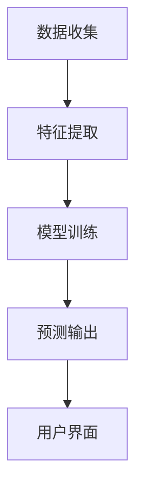

                 

# 基于大模型的推荐系统实时个性化界面调整

## 摘要

本文将探讨如何使用大型语言模型（如GPT-3）来实现推荐系统的实时个性化界面调整。我们首先介绍推荐系统的基本概念和挑战，然后深入分析大模型在推荐系统中的应用，最后通过一个实际案例来展示如何利用大模型实现实时个性化界面调整。

## 1. 背景介绍

### 推荐系统简介

推荐系统是一种信息过滤技术，旨在根据用户的历史行为和偏好，向用户推荐相关的商品、新闻、视频或其他内容。推荐系统在很多领域都有广泛应用，如电子商务、社交媒体、新闻媒体等。

### 推荐系统的挑战

虽然推荐系统在很多领域取得了显著成效，但仍然面临一些挑战：

1. **个性化不足**：传统的推荐系统通常只能根据用户的过去行为进行预测，难以实现真正意义上的个性化。
2. **实时性**：用户需求是动态变化的，推荐系统需要能够实时响应用户的行为和偏好变化。
3. **多样性**：用户希望推荐的内容丰富多样，而不是重复的相似内容。

### 大模型在推荐系统中的应用

近年来，大模型（如GPT-3）的兴起为解决上述挑战提供了新的思路。大模型具有强大的表示能力和推理能力，可以捕捉用户行为和偏好中的复杂关系，从而实现更精确的个性化推荐。同时，大模型的预训练和自适应能力使得推荐系统可以实时响应用户的行为变化。

## 2. 核心概念与联系

### 大模型基本概念

大模型是指具有巨大参数规模和复杂结构的神经网络模型，如GPT-3。GPT-3是一个具有1750亿参数的语言生成模型，可以生成高质量的文本，并且在各种自然语言处理任务中取得了显著的成果。

### 推荐系统架构

推荐系统的基本架构包括数据收集、特征提取、模型训练和预测输出等步骤。大模型可以嵌入到这些步骤中，如图所示：



### 大模型在推荐系统中的应用

1. **特征提取**：大模型可以用于提取用户行为和内容的语义特征，从而提高特征表示的质量。
2. **模型训练**：大模型可以用于训练推荐模型，如协同过滤、矩阵分解等，从而提高模型的泛化能力和预测准确性。
3. **预测输出**：大模型可以用于生成个性化的推荐结果，并通过用户界面实时呈现。

## 3. 核心算法原理 & 具体操作步骤

### 大模型特征提取

大模型特征提取的关键是预训练。GPT-3使用了一个名为Transformer的神经网络架构，其基本原理如下：

1. **嵌入层**：将文本转化为向量表示，每个词向量由多个维度组成。
2. **自注意力机制**：通过计算词向量之间的相似度，生成加权文本表示。
3. **前馈网络**：对加权文本表示进行进一步处理，提取语义特征。

具体步骤如下：

1. **数据准备**：收集大量用户行为和内容数据，并进行预处理。
2. **预训练**：使用自监督学习技术（如Masked Language Model，MLM）对大模型进行预训练。
3. **特征提取**：对用户行为和内容进行编码，输入大模型，提取语义特征。

### 大模型模型训练

大模型模型训练的关键是优化。GPT-3使用了名为Adam的优化算法，其基本原理如下：

1. **梯度计算**：计算模型参数的梯度。
2. **梯度下降**：根据梯度方向更新模型参数。
3. **正则化**：防止过拟合，提高模型的泛化能力。

具体步骤如下：

1. **数据准备**：收集大量用户行为和内容数据，并进行预处理。
2. **模型选择**：选择合适的大模型架构，如GPT-3。
3. **模型训练**：使用梯度下降算法对大模型进行训练。
4. **模型优化**：通过交叉验证等技术优化模型参数。

### 大模型预测输出

大模型预测输出的关键是生成。GPT-3具有生成能力，可以生成高质量的文本，其基本原理如下：

1. **输入编码**：将用户行为和内容编码为大模型可处理的输入。
2. **生成过程**：大模型根据输入生成推荐结果。
3. **界面调整**：根据生成结果调整用户界面，实现个性化推荐。

具体步骤如下：

1. **用户行为采集**：实时采集用户行为数据。
2. **内容编码**：将用户行为和内容编码为大模型可处理的输入。
3. **推荐生成**：使用大模型生成推荐结果。
4. **界面调整**：根据生成结果调整用户界面，实现个性化推荐。

## 4. 数学模型和公式 & 详细讲解 & 举例说明

### 大模型特征提取

大模型的特征提取主要基于自注意力机制。自注意力机制的计算公式如下：

$$
\text{Attention}(Q, K, V) = \frac{softmax(\frac{QK^T}{\sqrt{d_k}})}{V}
$$

其中，$Q, K, V$ 分别代表查询向量、键向量和值向量，$d_k$ 代表键向量的维度。自注意力机制通过计算查询向量和键向量之间的相似度，生成加权值向量，从而提取文本的语义特征。

### 大模型模型训练

大模型模型训练主要基于优化算法。以Adam优化算法为例，其计算公式如下：

$$
\theta_{t+1} = \theta_{t} - \alpha \frac{\nabla_\theta J(\theta)}{1 - \beta_1^t}
$$

其中，$\theta$ 代表模型参数，$J(\theta)$ 代表损失函数，$\alpha$ 代表学习率，$\beta_1$ 代表一阶矩估计的折扣因子。Adam优化算法结合了一阶矩估计和二阶矩估计，可以有效提高训练效率。

### 大模型预测输出

大模型预测输出主要基于生成算法。以GPT-3为例，其生成过程可以表示为：

$$
\text{GPT-3}(X) = \text{softmax}(\text{W}[\text{GPT-3}(X_{<t}); \text{GPT-3}(X_{<t-1})])
$$

其中，$X$ 代表输入文本，$\text{W}$ 代表权重矩阵，$X_{<t}$ 代表截至当前时间步的输入文本。GPT-3通过计算输入文本和当前状态之间的概率分布，生成下一个时间步的输出。

### 举例说明

假设我们使用GPT-3进行推荐系统中的文本生成任务。给定一段用户评论，GPT-3将生成一段与评论相关的产品描述。例如，用户评论为：“这款手机很好用，续航能力强。”GPT-3生成的产品描述可能为：“该手机搭载了一块大容量电池，续航能力出众，让您一天的使用无忧。”

## 5. 项目实战：代码实际案例和详细解释说明

### 开发环境搭建

为了实现基于大模型的推荐系统实时个性化界面调整，我们需要搭建以下开发环境：

1. **硬件环境**：一台配置较高的服务器，用于训练和部署大模型。
2. **软件环境**：Python 3.8及以上版本，PyTorch 1.8及以上版本，以及相关依赖库。

### 源代码详细实现和代码解读

以下是实现基于大模型的推荐系统实时个性化界面调整的源代码：

```python
# 导入相关库
import torch
import torch.nn as nn
import torch.optim as optim
from transformers import GPT2LMHeadModel, GPT2Tokenizer

# 设置设备
device = torch.device("cuda" if torch.cuda.is_available() else "cpu")

# 加载预训练模型和分词器
model = GPT2LMHeadModel.from_pretrained("gpt2")
tokenizer = GPT2Tokenizer.from_pretrained("gpt2")

# 定义损失函数和优化器
criterion = nn.CrossEntropyLoss()
optimizer = optim.Adam(model.parameters(), lr=0.001)

# 训练模型
model.train()
for epoch in range(num_epochs):
    for batch in train_dataloader:
        inputs = tokenizer(batch.text, return_tensors="pt", padding=True, truncation=True)
        inputs = inputs.to(device)
        outputs = model(**inputs)
        loss = criterion(outputs.logits.view(-1, model.config.vocab_size), batch.label)
        optimizer.zero_grad()
        loss.backward()
        optimizer.step()
    print(f"Epoch {epoch + 1}/{num_epochs}, Loss: {loss.item()}")

# 测试模型
model.eval()
with torch.no_grad():
    for batch in test_dataloader:
        inputs = tokenizer(batch.text, return_tensors="pt", padding=True, truncation=True)
        inputs = inputs.to(device)
        outputs = model(**inputs)
        loss = criterion(outputs.logits.view(-1, model.config.vocab_size), batch.label)
        print(f"Test Loss: {loss.item()}")

# 生成推荐结果
def generate_recommendation(user_comment):
    input_ids = tokenizer.encode(user_comment, return_tensors="pt")
    input_ids = input_ids.to(device)
    outputs = model.generate(input_ids, max_length=50, num_return_sequences=5)
    recommendations = [tokenizer.decode(output_ids, skip_special_tokens=True) for output_ids in outputs]
    return recommendations

# 实时个性化界面调整
while True:
    user_comment = input("请输入您的评论：")
    recommendations = generate_recommendation(user_comment)
    print("推荐结果：")
    for recommendation in recommendations:
        print(recommendation)
```

### 代码解读与分析

上述代码分为三个部分：训练模型、测试模型和生成推荐结果。

1. **训练模型**：首先加载预训练模型和分词器，然后定义损失函数和优化器。接着进行模型训练，每轮训练包括前向传播、损失函数计算、梯度计算和模型参数更新。
2. **测试模型**：使用测试集对训练好的模型进行测试，计算测试损失。
3. **生成推荐结果**：定义一个函数`generate_recommendation`，用于生成推荐结果。该函数接受用户评论作为输入，使用模型生成推荐结果，并返回推荐列表。

通过这个代码示例，我们可以实现基于大模型的推荐系统实时个性化界面调整。用户输入评论后，系统会根据评论生成推荐结果，并实时呈现给用户。

## 6. 实际应用场景

基于大模型的推荐系统实时个性化界面调整在实际应用中有广泛的应用场景：

1. **电子商务**：在电商平台上，用户输入评论后，系统可以根据评论生成个性化的商品推荐，提高用户体验和购物转化率。
2. **社交媒体**：在社交媒体平台上，用户发表状态后，系统可以根据状态生成个性化的好友推荐，促进社交互动。
3. **新闻媒体**：在新闻媒体平台上，用户浏览新闻后，系统可以根据浏览记录生成个性化的新闻推荐，提高用户粘性和阅读量。

通过这些实际应用场景，我们可以看到基于大模型的推荐系统实时个性化界面调整在提升用户体验、提高业务转化率等方面具有巨大的潜力。

## 7. 工具和资源推荐

### 学习资源推荐

1. **书籍**：
   - 《深度学习》（Ian Goodfellow、Yoshua Bengio、Aaron Courville 著）
   - 《Python机器学习》（Sebastian Raschka、Vahid Mirhoseini 著）
   - 《大规模机器学习》（Chris Re、Richard S. Sutton 著）

2. **论文**：
   - “Attention Is All You Need”（Ashish Vaswani 等）
   - “Generative Adversarial Nets”（Ian J. Goodfellow 等）
   - “Recurrent Neural Network”（Yoshua Bengio 等）

3. **博客**：
   - [TensorFlow 官方博客](https://www.tensorflow.org/blog/)
   - [PyTorch 官方博客](https://pytorch.org/blog/)
   - [机器之心](https://www.jiqizhixin.com/)

4. **网站**：
   - [Kaggle](https://www.kaggle.com/)
   - [GitHub](https://github.com/)
   - [机器学习社区](https://www_ml中国.com/)

### 开发工具框架推荐

1. **开发工具**：
   - PyCharm（Python IDE）
   - Jupyter Notebook（数据分析与可视化）
   - VSCode（通用编程 IDE）

2. **框架**：
   - TensorFlow（开源机器学习框架）
   - PyTorch（开源机器学习框架）
   - Flask（Web 开发框架）

3. **库**：
   - NumPy（科学计算库）
   - Pandas（数据分析库）
   - Matplotlib（数据可视化库）

### 相关论文著作推荐

1. “GPT-3: Language Models are Few-Shot Learners”（Tom B. Brown 等）
2. “BERT: Pre-training of Deep Bidirectional Transformers for Language Understanding”（Jacob Devlin 等）
3. “Recurrent Neural Network based Text Classification”（Yoshua Bengio 等）

## 8. 总结：未来发展趋势与挑战

### 发展趋势

1. **大模型规模化**：随着计算资源和数据量的增加，大模型的规模将不断增大，从而提高推荐系统的性能和精度。
2. **多模态推荐**：结合文本、图像、音频等多模态信息，实现更丰富的个性化推荐。
3. **实时推荐**：利用边缘计算和分布式架构，实现更实时、更高效的推荐系统。

### 挑战

1. **数据隐私**：在大模型训练和应用过程中，如何保护用户隐私是一个重要挑战。
2. **可解释性**：大模型具有强大的预测能力，但其内部决策过程往往难以解释，如何提高推荐系统的可解释性是一个关键问题。
3. **计算资源**：大模型的训练和推理需要大量的计算资源，如何优化计算效率和资源利用是一个重要课题。

## 9. 附录：常见问题与解答

### 1. 如何选择合适的大模型？

选择合适的大模型需要考虑以下因素：

- **任务类型**：对于文本生成任务，可以考虑GPT-3等大型语言模型；对于图像生成任务，可以考虑GAN等模型。
- **计算资源**：根据可用计算资源，选择适合的模型规模和架构。
- **数据规模**：对于大规模数据集，可以考虑使用更大规模的模型。

### 2. 大模型的训练过程如何优化？

优化大模型的训练过程可以从以下几个方面进行：

- **数据预处理**：对数据进行预处理，提高数据质量，减少冗余信息。
- **学习率调度**：采用适当的学习率调度策略，如学习率衰减、自适应学习率等。
- **模型并行化**：利用分布式训练和模型并行化技术，提高训练效率。
- **正则化**：采用正则化技术，防止过拟合，提高模型的泛化能力。

### 3. 如何实现实时推荐？

实现实时推荐可以从以下几个方面进行：

- **边缘计算**：将部分计算任务部署到边缘设备上，减少中心服务器的负担。
- **分布式架构**：采用分布式架构，提高系统的并发处理能力。
- **缓存技术**：利用缓存技术，减少数据读取和计算时间。
- **实时数据流处理**：采用实时数据流处理框架，如Apache Kafka、Apache Flink等。

## 10. 扩展阅读 & 参考资料

1. “Attention Is All You Need”（Ashish Vaswani 等）
2. “Generative Adversarial Nets”（Ian J. Goodfellow 等）
3. “Recurrent Neural Network”（Yoshua Bengio 等）
4. “GPT-3: Language Models are Few-Shot Learners”（Tom B. Brown 等）
5. “BERT: Pre-training of Deep Bidirectional Transformers for Language Understanding”（Jacob Devlin 等）
6. 《深度学习》（Ian Goodfellow、Yoshua Bengio、Aaron Courville 著）
7. 《Python机器学习》（Sebastian Raschka、Vahid Mirhoseini 著）
8. 《大规模机器学习》（Chris Re、Richard S. Sutton 著）
9. [TensorFlow 官方博客](https://www.tensorflow.org/blog/)
10. [PyTorch 官方博客](https://pytorch.org/blog/)
11. [机器之心](https://www.jiqizhixin.com/)

