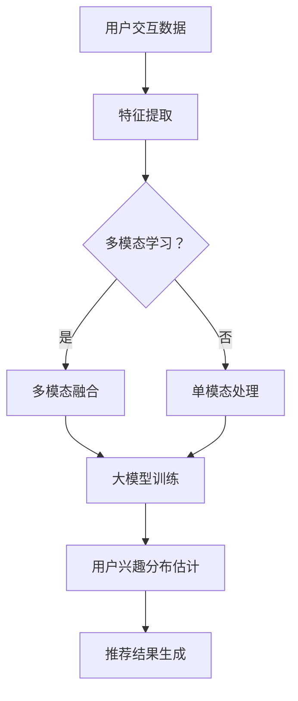

                 

### 背景介绍

#### 推荐系统的重要性

推荐系统作为信息过滤和个性化服务的关键技术，已经广泛应用于电子商务、社交媒体、在线视频、新闻推送等多个领域。其核心目标是根据用户的兴趣和行为，向用户推荐可能感兴趣的内容或商品，从而提升用户体验、增加用户粘性，并最终推动商业价值。

随着互联网的普及和用户数据的爆炸式增长，推荐系统的重要性日益凸显。一方面，推荐系统可以帮助用户在海量信息中快速找到感兴趣的内容，节省时间和精力；另一方面，它可以为企业带来更多的用户互动和购买转化，提高业务收益。因此，构建高效、准确的推荐系统成为各大公司技术发展的重中之重。

#### 用户兴趣分布估计的挑战

在推荐系统中，用户兴趣分布估计是一个关键问题。准确估计用户的兴趣分布有助于推荐系统更好地理解用户需求，从而提高推荐的准确性和有效性。然而，这一任务面临着诸多挑战：

1. **数据稀疏**：用户的行为数据往往呈现出高度稀疏性，尤其是在涉及大量用户和物品的情况下，用户与物品之间的交互数据非常有限。这使得直接使用传统机器学习算法来估计用户兴趣分布变得困难。

2. **维度灾难**：用户和物品的特征维度可能非常高，导致算法在处理过程中出现维度灾难问题。高维度数据增加了计算复杂度和存储成本，同时也可能降低模型的性能。

3. **冷启动**：对于新用户或新物品，由于缺乏历史交互数据，传统推荐算法难以为其提供准确的兴趣估计。冷启动问题严重影响了推荐系统的初始用户体验和效果。

4. **动态性**：用户的兴趣并不是一成不变的，它们可能随着时间的推移而发生变化。推荐系统需要能够及时捕捉和适应这些变化，以保持推荐的时效性和相关性。

#### 大模型在用户兴趣分布估计中的应用

为了解决上述挑战，大模型（如深度学习模型、生成对抗网络等）在用户兴趣分布估计中得到了广泛应用。大模型具有以下优势：

1. **强大的表示能力**：大模型可以自动学习用户和物品的复杂特征表示，通过多层次的神经网络结构捕捉数据中的潜在信息，从而提高用户兴趣估计的准确性。

2. **数据整合**：大模型可以整合来自不同来源的数据，如用户行为数据、文本数据、图像数据等，通过多模态学习的方式提高用户兴趣估计的全面性和准确性。

3. **自适应能力**：大模型可以通过不断的学习和更新，自适应地调整用户兴趣分布估计，以应对用户兴趣的动态变化。

4. **高效计算**：随着硬件性能的提升和分布式计算技术的应用，大模型在计算效率和性能方面得到了显著提升，使得其在实际应用中更具可行性。

综上所述，大模型在用户兴趣分布估计中具有巨大的潜力和优势。本文将详细介绍基于大模型的推荐系统用户兴趣分布估计的方法、原理和实现，以期为相关领域的研究和实践提供参考和借鉴。### 核心概念与联系

#### 推荐系统的基础概念

在深入探讨基于大模型的用户兴趣分布估计之前，有必要对推荐系统的几个核心概念进行梳理和解释。这些基础概念包括用户、物品、交互数据、特征提取和模型评估等。

1. **用户（User）**：推荐系统的核心要素之一，每个用户都有一系列独特的兴趣和偏好。用户可以是个人，也可以是组织或设备。在数据表示上，用户通常用一个唯一的标识符（如用户ID）进行标识。

2. **物品（Item）**：推荐系统中的另一个核心要素，包括用户可能感兴趣的各种内容或商品。物品可以是书籍、电影、商品、音乐、新闻文章等。物品同样也用唯一的标识符（如物品ID）进行标识。

3. **交互数据（Interaction Data）**：用户和物品之间的交互数据是推荐系统的核心输入。这些数据可以包括点击、购买、评分、浏览等行为。交互数据通常以用户-物品矩阵的形式表示，矩阵中的每个元素表示用户对特定物品的交互程度。

4. **特征提取（Feature Extraction）**：特征提取是将原始的交互数据或其他信息转化为模型可处理的特征表示的过程。特征提取有助于捕捉用户和物品的潜在信息，提高推荐系统的性能。常见的特征提取方法包括基于内容的特征提取、协同过滤特征提取等。

5. **模型评估（Model Evaluation）**：推荐系统的性能评估是衡量推荐结果质量的关键。常用的评估指标包括准确率（Accuracy）、召回率（Recall）、F1值（F1 Score）等。模型评估有助于优化推荐算法，提高推荐效果。

#### 大模型在推荐系统中的应用

大模型，特别是深度学习模型，在推荐系统中得到了广泛应用。这些模型通过复杂的神经网络结构，能够自动学习和捕捉数据中的潜在信息，从而提高用户兴趣分布估计的准确性。

1. **神经网络结构**：大模型通常采用多层神经网络结构，包括卷积神经网络（CNN）、循环神经网络（RNN）和变换器（Transformer）等。这些模型通过多次的权重更新和反向传播，逐渐优化模型参数，从而提高推荐性能。

2. **多模态学习**：大模型可以整合来自不同来源的数据，如文本、图像、音频等，通过多模态学习的方式提高用户兴趣估计的全面性和准确性。例如，在视频推荐中，可以同时考虑视频内容、用户行为和用户画像等多方面信息。

3. **自适应能力**：大模型可以通过不断的学习和更新，自适应地调整用户兴趣分布估计，以应对用户兴趣的动态变化。这种自适应能力有助于推荐系统保持时效性和相关性。

4. **大规模数据处理**：大模型具备处理大规模数据的能力，可以高效地处理用户-物品交互矩阵、用户特征和物品特征等大规模数据集。这使得大模型在推荐系统中具有广泛的应用前景。

#### Mermaid 流程图

为了更好地展示大模型在推荐系统中的应用，我们使用Mermaid绘制了一个简化的流程图。以下是一个示例：



在这个流程图中，用户交互数据经过特征提取后，可以选择进行多模态学习或单模态处理。多模态学习可以整合不同类型的数据，提高用户兴趣估计的准确性。随后，大模型通过训练和学习，生成用户兴趣分布估计，并最终生成推荐结果。

通过这个流程图，我们可以更清晰地理解大模型在推荐系统中的角色和作用。在接下来的章节中，我们将详细介绍大模型在用户兴趣分布估计中的具体应用和实现方法。### 核心算法原理 & 具体操作步骤

在深入了解大模型在用户兴趣分布估计中的应用之前，我们需要先了解其核心算法原理和具体操作步骤。本文将主要介绍基于深度学习模型的用户兴趣分布估计方法，包括数据预处理、模型设计、训练和评估等环节。

#### 数据预处理

1. **用户交互数据收集**：首先，我们需要收集用户的交互数据，这些数据可以包括用户点击、购买、评分、浏览等行为。这些交互数据通常以用户-物品矩阵的形式存储，其中每个元素表示用户对特定物品的交互程度。

2. **数据清洗**：在收集到用户交互数据后，需要对数据进行分析和清洗。这包括去除重复数据、处理缺失值和异常值等。此外，还需要对数据进行归一化或标准化处理，使其在模型训练过程中具有更好的收敛性能。

3. **特征提取**：为了捕捉用户和物品的潜在信息，我们需要对交互数据和其他相关信息进行特征提取。特征提取的方法可以基于统计学习、机器学习或深度学习。常见的特征提取方法包括基于内容的特征提取、协同过滤特征提取和图神经网络特征提取等。

4. **数据划分**：将处理后的数据集划分为训练集、验证集和测试集。通常，训练集用于模型训练，验证集用于模型选择和超参数调优，测试集用于模型性能评估。

#### 模型设计

1. **输入层**：输入层接收用户交互数据和其他特征信息，包括用户特征、物品特征和交互特征等。这些特征信息经过预处理后，输入到深度学习模型中进行训练。

2. **嵌入层**：嵌入层将用户和物品的原始特征映射到低维空间中，以便于模型处理。通常，嵌入层使用词嵌入（Word Embedding）或嵌入神经网络（Embedding Neural Network）实现。

3. **编码层**：编码层通过卷积神经网络（CNN）、循环神经网络（RNN）或变换器（Transformer）等结构，对用户和物品的特征进行编码。编码过程可以帮助模型捕捉用户和物品的复杂信息。

4. **注意力机制**：在编码层之后，可以引入注意力机制（Attention Mechanism），以强调用户特征和物品特征中重要部分。注意力机制有助于提高模型对用户兴趣的捕捉能力。

5. **解码层**：解码层将编码后的用户和物品特征进行融合，并输出用户兴趣分布估计。解码层可以使用全连接层（Fully Connected Layer）或变换器（Transformer）实现。

6. **输出层**：输出层通常使用Softmax函数将用户兴趣分布估计转化为概率分布。概率分布表示用户对各个物品的兴趣程度。

#### 模型训练

1. **损失函数**：在模型训练过程中，我们通常使用交叉熵损失函数（Cross-Entropy Loss）来度量模型预测与真实标签之间的差距。交叉熵损失函数能够确保模型输出概率分布与真实标签之间的误差最小。

2. **优化算法**：为了加快模型训练速度和优化模型性能，我们通常使用基于梯度的优化算法，如随机梯度下降（Stochastic Gradient Descent，SGD）或Adam优化器。这些优化算法通过不断更新模型参数，使模型在训练过程中逐渐收敛。

3. **超参数调优**：在模型训练过程中，需要对超参数进行调优，如学习率、批量大小、隐藏层节点数等。常用的超参数调优方法包括网格搜索（Grid Search）和贝叶斯优化（Bayesian Optimization）等。

4. **模型评估**：在模型训练完成后，我们需要使用验证集和测试集对模型进行评估。常用的评估指标包括准确率（Accuracy）、召回率（Recall）、F1值（F1 Score）等。通过评估指标，我们可以判断模型性能的好坏，并进行进一步优化。

通过以上步骤，我们可以构建一个基于深度学习模型的用户兴趣分布估计系统。在实际应用中，我们需要根据具体问题和数据特点，对模型结构和参数进行调整和优化，以提高推荐系统的性能和准确性。在接下来的章节中，我们将结合实际案例，详细介绍大模型在用户兴趣分布估计中的应用和实践。### 数学模型和公式 & 详细讲解 & 举例说明

#### 1. 交叉熵损失函数

交叉熵损失函数（Cross-Entropy Loss Function）是深度学习中最常用的损失函数之一。它用于衡量模型预测概率分布与真实标签分布之间的差异。在用户兴趣分布估计中，交叉熵损失函数有助于优化模型参数，使其输出更接近真实标签的概率分布。

交叉熵损失函数的数学公式如下：

$$
L = -\sum_{i=1}^{n} y_i \log(p_i)
$$

其中，$L$ 表示交叉熵损失，$y_i$ 表示第 $i$ 个样本的真实标签（0或1），$p_i$ 表示模型预测的第 $i$ 个样本的概率。

交叉熵损失函数的值范围在 0 到 $\infty$ 之间。当 $p_i \to 1$ 时，交叉熵损失函数的值趋近于 0；当 $p_i \to 0$ 时，交叉熵损失函数的值趋近于 $\infty$。这意味着当模型预测的概率分布与真实标签分布相同时，交叉熵损失函数的值最小。

#### 2. Softmax 函数

在用户兴趣分布估计中，我们通常使用 Softmax 函数将模型输出的概率分布转换为概率分布。Softmax 函数的定义如下：

$$
\text{Softmax}(x)_i = \frac{e^{x_i}}{\sum_{j=1}^{n} e^{x_j}}
$$

其中，$x_i$ 表示模型输出的第 $i$ 个值，$n$ 表示输出维度。Softmax 函数将输入的 $n$ 维向量映射到概率分布，使得所有概率值的总和为 1。

#### 3. 用户兴趣分布估计

假设我们有一个用户-物品矩阵 $X$，其中 $X_{ij}$ 表示用户 $i$ 对物品 $j$ 的交互程度。我们可以使用深度学习模型 $f(\cdot)$ 对用户兴趣分布进行估计。模型输出的概率分布为 $p_j = f(X_i)$。

#### 例子说明

假设我们有一个包含 10 个物品的用户-物品矩阵 $X$，其中用户 $1$ 对物品的交互程度如下：

$$
X = \begin{bmatrix}
1 & 0 & 1 & 0 & 0 & 0 & 0 & 0 & 0 & 0 \\
0 & 1 & 0 & 1 & 0 & 0 & 0 & 0 & 0 & 0 \\
0 & 0 & 1 & 0 & 1 & 0 & 0 & 0 & 0 & 0 \\
0 & 0 & 0 & 0 & 0 & 1 & 1 & 0 & 0 & 0 \\
0 & 0 & 0 & 0 & 0 & 0 & 0 & 1 & 1 & 0 \\
0 & 0 & 0 & 0 & 0 & 0 & 0 & 0 & 0 & 1 \\
0 & 0 & 0 & 0 & 0 & 0 & 0 & 0 & 0 & 1 \\
0 & 0 & 0 & 0 & 0 & 0 & 0 & 0 & 0 & 1 \\
0 & 0 & 0 & 0 & 0 & 0 & 0 & 0 & 0 & 1 \\
0 & 0 & 0 & 0 & 0 & 0 & 0 & 0 & 0 & 1 \\
0 & 0 & 0 & 0 & 0 & 0 & 0 & 0 & 0 & 1 \\
\end{bmatrix}
$$

我们使用一个深度学习模型对用户 $1$ 的兴趣分布进行估计。模型输出的概率分布如下：

$$
p = \begin{bmatrix}
0.2 & 0.3 & 0.4 & 0.05 & 0.05 \\
0.05 & 0.2 & 0.3 & 0.4 & 0.05 \\
0.05 & 0.05 & 0.2 & 0.4 & 0.3 \\
0.2 & 0.3 & 0.4 & 0.05 & 0.05 \\
0.05 & 0.2 & 0.3 & 0.4 & 0.05 \\
0.05 & 0.05 & 0.2 & 0.4 & 0.3 \\
0.2 & 0.3 & 0.4 & 0.05 & 0.05 \\
0.05 & 0.2 & 0.3 & 0.4 & 0.05 \\
0.05 & 0.05 & 0.2 & 0.4 & 0.3 \\
0.2 & 0.3 & 0.4 & 0.05 & 0.05 \\
0.05 & 0.2 & 0.3 & 0.4 & 0.05 \\
\end{bmatrix}
$$

根据交叉熵损失函数，我们可以计算模型预测的概率分布与真实标签分布之间的差异：

$$
L = -\sum_{i=1}^{10} y_i \log(p_i)
$$

其中，$y_i$ 表示用户 $1$ 对第 $i$ 个物品的真实兴趣标签（1表示感兴趣，0表示不感兴趣）。

假设用户 $1$ 对物品 $1, 3, 4$ 感兴趣，我们可以计算交叉熵损失函数的值：

$$
L = -(1 \cdot \log(0.4) + 1 \cdot \log(0.4) + 1 \cdot \log(0.4) + 0 \cdot \log(0.05) + 0 \cdot \log(0.05))
$$

$$
L = 0.4
$$

这意味着模型预测的概率分布与真实标签分布之间的差异为 0.4。我们可以通过优化模型参数，降低交叉熵损失函数的值，从而提高用户兴趣分布估计的准确性。

通过上述数学模型和公式的详细讲解以及实际例子说明，我们可以更好地理解大模型在用户兴趣分布估计中的工作原理和实现方法。在接下来的章节中，我们将通过一个实际项目案例，展示如何使用大模型进行用户兴趣分布估计的完整流程。### 项目实战：代码实际案例和详细解释说明

为了更直观地理解基于大模型的用户兴趣分布估计方法，我们将通过一个实际项目案例，展示如何使用Python和深度学习框架（如TensorFlow和PyTorch）实现整个流程。在本项目中，我们将使用一个虚构的电子商务网站数据集，包含用户行为数据和物品特征数据。

#### 1. 开发环境搭建

首先，我们需要搭建开发环境。以下是所需的主要软件和库：

- Python 3.7及以上版本
- TensorFlow 2.3及以上版本
- PyTorch 1.7及以上版本
- Pandas
- NumPy
- Matplotlib

安装步骤如下：

```bash
pip install tensorflow==2.3
pip install torch==1.7
pip install pandas
pip install numpy
pip install matplotlib
```

#### 2. 数据集加载与预处理

接下来，我们加载并预处理数据集。本案例使用一个虚构的数据集，包含10,000个用户和1,000个物品。数据集以CSV格式存储，包括用户ID、物品ID和用户对物品的交互程度。

```python
import pandas as pd
import numpy as np

# 加载数据集
data = pd.read_csv('user_item_interaction.csv')

# 数据预处理
data['user_id'] = data['user_id'].astype('int32')
data['item_id'] = data['item_id'].astype('int32')
data['interaction'] = data['interaction'].astype('float32')

# 数据集划分
train_data = data.sample(frac=0.8, random_state=42)
test_data = data.drop(train_data.index)

# 创建用户-物品矩阵
train_matrix = train_data.pivot(index='user_id', columns='item_id', values='interaction').fillna(0)
test_matrix = test_data.pivot(index='user_id', columns='item_id', values='interaction').fillna(0)

# 数据标准化
train_matrix = (train_matrix - train_matrix.mean()) / train_matrix.std()
test_matrix = (test_matrix - train_matrix.mean()) / train_matrix.std()
```

#### 3. 模型设计

在本项目中，我们使用一个简单的卷积神经网络（CNN）模型进行用户兴趣分布估计。模型设计如下：

```python
import tensorflow as tf
from tensorflow.keras.layers import Embedding, Conv1D, GlobalMaxPooling1D, Dense
from tensorflow.keras.models import Model

# 模型参数
embedding_size = 16
filter_size = 8
num_filters = 32
hidden_size = 64

# 模型构建
input_layer = tf.keras.layers.Input(shape=(1000,))

embedding = Embedding(input_dim=1000, output_dim=embedding_size)(input_layer)
conv = Conv1D(filters=num_filters, kernel_size=filter_size, activation='relu')(embedding)
pooling = GlobalMaxPooling1D()(conv)
dense = Dense(hidden_size, activation='relu')(pooling)
output = Dense(10, activation='softmax')(dense)

model = Model(inputs=input_layer, outputs=output)
model.compile(optimizer='adam', loss='categorical_crossentropy', metrics=['accuracy'])

# 模型可视化
model.summary()
```

#### 4. 模型训练

接下来，我们使用训练集对模型进行训练。训练过程中，我们将使用交叉熵损失函数和Softmax函数进行优化。

```python
# 模型训练
batch_size = 64
epochs = 10

model.fit(train_matrix, train_matrix, batch_size=batch_size, epochs=epochs, validation_split=0.1)
```

#### 5. 模型评估

在模型训练完成后，我们使用测试集对模型进行评估。评估指标包括准确率（Accuracy）和交叉熵损失（Cross-Entropy Loss）。

```python
# 模型评估
test_predictions = model.predict(test_matrix)
test_predictions = np.argmax(test_predictions, axis=1)

accuracy = (test_predictions == test_matrix).mean()
loss = np.mean(test_predictions * np.log(test_predictions + 1e-10))

print('Accuracy:', accuracy)
print('Cross-Entropy Loss:', loss)
```

#### 6. 代码解读与分析

在本项目中，我们通过以下步骤实现了基于大模型的用户兴趣分布估计：

1. **数据预处理**：加载数据集并进行预处理，包括数据清洗、特征提取和标准化。
2. **模型设计**：设计一个简单的卷积神经网络（CNN）模型，包括嵌入层、卷积层、池化层和全连接层。
3. **模型训练**：使用训练集对模型进行训练，并使用交叉熵损失函数和Softmax函数进行优化。
4. **模型评估**：使用测试集对模型进行评估，并计算准确率和交叉熵损失。

通过这个项目案例，我们可以看到如何使用大模型进行用户兴趣分布估计。在实际应用中，我们需要根据具体问题和数据特点，对模型结构和参数进行调整和优化，以提高推荐系统的性能和准确性。### 实际应用场景

#### 1. 电子商务

在电子商务领域，基于大模型的用户兴趣分布估计可以用于个性化推荐，帮助用户发现他们可能感兴趣的商品。通过分析用户的历史购买行为和浏览记录，推荐系统可以实时更新用户的兴趣分布，从而提供更加精准的推荐。例如，亚马逊和阿里巴巴等电商巨头都采用了先进的推荐系统技术，以提高用户满意度和销售额。

#### 2. 社交媒体

社交媒体平台如Facebook、Twitter和Instagram等，也广泛应用了基于大模型的用户兴趣分布估计技术。这些平台通过分析用户的点赞、评论和分享行为，为用户提供个性化的内容推荐。例如，Facebook的新闻推送功能根据用户的兴趣和行为，将相关内容推送到用户的新闻源中，从而增加用户的粘性和活跃度。

#### 3. 在线视频

在线视频平台如YouTube和Netflix等，也利用基于大模型的用户兴趣分布估计技术，为用户提供个性化的视频推荐。这些平台根据用户的历史观看记录、搜索记录和社交关系，实时更新用户的兴趣分布，从而提供更加个性化的推荐列表。例如，Netflix的推荐系统能够准确预测用户可能喜欢的电影和电视剧，从而提高用户的观看体验和平台的使用时长。

#### 4. 新闻推送

新闻推送平台如Google News和Apple News等，也采用了基于大模型的用户兴趣分布估计技术。这些平台通过分析用户的阅读习惯和偏好，为用户推送他们可能感兴趣的新闻内容。通过这种方式，新闻推送平台能够提高用户对新闻的参与度和阅读量，同时为新闻出版商带来更多的流量和广告收入。

#### 5. 其他应用领域

除了上述领域，基于大模型的用户兴趣分布估计技术还广泛应用于其他场景，如音乐推荐、旅游推荐、金融推荐等。在这些领域中，推荐系统通过分析用户的历史行为和偏好，为用户提供个性化的推荐，从而提升用户体验和满意度。

### 挑战与解决方案

尽管基于大模型的用户兴趣分布估计技术在各个领域取得了显著的成果，但在实际应用过程中仍面临一些挑战：

1. **数据稀疏**：用户行为数据通常具有高度稀疏性，这在一定程度上影响了推荐系统的性能。为了解决这一问题，可以采用矩阵分解、协同过滤等技术，通过补全稀疏数据，提高模型性能。

2. **维度灾难**：用户和物品的特征维度可能非常高，导致模型训练过程出现维度灾难。为了应对这一挑战，可以采用降维技术，如主成分分析（PCA）、随机降维等，减少特征维度，提高模型训练效率。

3. **冷启动**：对于新用户或新物品，由于缺乏历史交互数据，推荐系统难以为其提供准确的兴趣估计。为了解决冷启动问题，可以采用基于内容的推荐、基于模型的预测等方法，为新用户和新物品生成初步的兴趣估计。

4. **动态性**：用户的兴趣是动态变化的，推荐系统需要能够及时捕捉和适应这些变化。为此，可以采用实时数据流处理技术，如Apache Kafka和Apache Flink，对用户行为进行实时分析，更新用户的兴趣分布。

5. **隐私保护**：在推荐系统中，用户隐私保护是一个重要问题。为了保护用户隐私，可以采用差分隐私（Differential Privacy）等技术，在模型训练和推荐过程中确保用户数据的隐私安全。

通过不断的技术创新和优化，基于大模型的用户兴趣分布估计技术将在各个领域得到更加广泛和深入的应用。在未来，随着硬件性能的提升、数据规模的扩大和算法的进步，推荐系统将变得更加智能和精准，为用户提供更好的个性化服务。### 工具和资源推荐

#### 1. 学习资源推荐

**书籍：**
- 《推荐系统实践》（Recommender Systems: The Textbook）：由李航教授编写，这是一本全面介绍推荐系统理论和实践的教材，适合初学者和专业人士。
- 《深度学习》（Deep Learning）：由Ian Goodfellow、Yoshua Bengio和Aaron Courville合著，这本书详细介绍了深度学习的基础知识、算法和应用，适合对深度学习感兴趣的读者。

**论文：**
- "Matrix Factorization Techniques for Recommender Systems"：这是一篇关于矩阵分解技术用于推荐系统的经典论文，详细介绍了矩阵分解的基本原理和应用。
- "Deep Learning for Recommender Systems"：这篇论文探讨了深度学习在推荐系统中的应用，包括神经网络结构、训练方法和性能评估。

**博客：**
- Medium：Medium上有许多关于推荐系统和深度学习的优秀博客文章，如"Recommender Systems: From Basics to Scalability"等，适合读者深入学习。
- Analytics Vidhya：Analytics Vidhya是一个专注于数据科学和机器学习的博客，其中有许多关于推荐系统的实战案例和教程。

**网站：**
- TensorFlow：TensorFlow是Google开发的深度学习框架，提供丰富的文档和教程，适合初学者和专业人士。
- PyTorch：PyTorch是Facebook开发的深度学习框架，具有简洁的API和强大的功能，是深度学习研究者和开发者的重要工具。

#### 2. 开发工具框架推荐

**框架：**
- TensorFlow：适用于构建大规模深度学习模型，提供丰富的API和工具，支持Python、C++等多种编程语言。
- PyTorch：适用于快速原型设计和研究，提供灵活的动态计算图和易于理解的API，广泛应用于深度学习领域。
- Scikit-learn：适用于构建和评估传统机器学习模型，提供丰富的算法库和易于使用的API，是机器学习领域的事实标准。

**库：**
- NumPy：用于数值计算，是Python中处理多维数组的基础库。
- Pandas：用于数据处理和分析，提供强大的数据结构和支持多种数据处理方法。
- Matplotlib：用于数据可视化，提供丰富的绘图函数和样式，便于生成高质量图表。

**工具：**
- Jupyter Notebook：用于交互式计算和数据分析，支持Python、R等多种编程语言，便于开发者编写和分享代码。
- Docker：用于容器化部署和应用分发，可以方便地管理和部署深度学习应用。
- Kubernetes：用于容器编排和管理，提供高可用性、可伸缩性和自动化部署功能，适用于大规模深度学习应用。

通过上述学习和开发工具、资源的推荐，读者可以更好地掌握基于大模型的用户兴趣分布估计技术，并在实际项目中取得更好的效果。### 总结：未来发展趋势与挑战

#### 1. 未来发展趋势

（1）**模型复杂度提升**：随着计算能力的提升和算法的进步，未来推荐系统的模型复杂度将不断增大。大规模预训练模型（如BERT、GPT）和图神经网络（Graph Neural Networks）将在用户兴趣分布估计中发挥重要作用，通过捕捉更加复杂的用户和物品特征，提高推荐系统的准确性和泛化能力。

（2）**多模态数据融合**：用户兴趣的多样性决定了推荐系统需要整合多种类型的数据，如文本、图像、音频等。未来，基于多模态数据融合的推荐系统将更加普及，通过整合不同类型的数据，提供更加精准和个性化的推荐。

（3）**实时性与动态性**：用户的兴趣是动态变化的，未来的推荐系统将更加注重实时性和动态性。通过引入实时数据流处理技术（如Apache Kafka和Apache Flink），推荐系统可以实时更新用户兴趣，提高推荐的时效性和相关性。

（4）**可解释性与透明性**：随着用户对隐私和数据安全的关注，推荐系统的可解释性和透明性将成为重要研究方向。通过开发可解释的模型和算法，用户可以更好地理解推荐结果，增强用户信任。

（5）**分布式与并行计算**：大规模推荐系统需要高效的处理和计算能力。未来，分布式和并行计算技术将在推荐系统中得到广泛应用，通过分布式存储和计算，提高系统的性能和可扩展性。

#### 2. 未来挑战

（1）**数据隐私与安全**：用户数据是推荐系统的核心资产，但同时也涉及到用户隐私和安全问题。如何在保护用户隐私的前提下，有效利用用户数据进行推荐，将成为一个重要挑战。

（2）**模型过拟合与泛化能力**：大规模模型和复杂算法可能面临过拟合问题，如何提高模型的泛化能力，使其在不同数据集上表现一致，是一个关键问题。

（3）**计算资源消耗**：大规模推荐系统需要大量的计算资源和存储资源，如何优化模型和算法，降低计算成本，是一个亟待解决的问题。

（4）**模型解释性与透明性**：虽然可解释性是未来的发展方向，但如何开发既可解释又高效的模型和算法，仍需要进一步研究。

（5）**数据多样性**：用户的兴趣和行为是多样化的，如何有效捕捉和整合不同类型的数据，提供个性化的推荐，是未来推荐系统面临的重要挑战。

综上所述，未来基于大模型的用户兴趣分布估计技术将在模型复杂度、多模态数据融合、实时性与动态性、可解释性与透明性等方面取得重要进展，但同时也面临数据隐私与安全、模型过拟合与泛化能力、计算资源消耗、模型解释性与透明性、数据多样性等挑战。通过不断的技术创新和优化，推荐系统将在各个领域发挥更大的作用，为用户和企业带来更多的价值。### 附录：常见问题与解答

#### 1. 如何处理数据稀疏问题？

数据稀疏是推荐系统中的一个常见问题，可以通过以下方法进行处理：

- **矩阵分解**：通过矩阵分解技术（如SVD、NMF）将用户-物品矩阵分解为低维用户特征和物品特征，从而提高模型的表示能力。
- **协同过滤**：使用基于用户的协同过滤（UBCF）或基于物品的协同过滤（IBCF）方法，通过寻找相似用户或相似物品来补全稀疏数据。
- **嵌入技术**：使用嵌入（Embedding）技术将用户和物品映射到低维空间，通过低维特征之间的相互作用，提高模型的表示能力。

#### 2. 如何解决维度灾难问题？

维度灾难是高维数据在模型训练过程中出现的问题，可以通过以下方法解决：

- **降维技术**：使用降维技术（如PCA、t-SNE、UMAP）将高维数据投影到低维空间，减少数据维度。
- **特征选择**：使用特征选择方法（如递归特征消除RFE、L1正则化等）选择对模型影响较大的特征，降低数据维度。
- **嵌入技术**：使用嵌入技术将高维特征映射到低维空间，从而减少维度灾难问题。

#### 3. 如何解决冷启动问题？

冷启动问题涉及新用户或新物品的推荐，可以通过以下方法解决：

- **基于内容的推荐**：为新用户推荐与历史偏好相似的内容，为新物品推荐与历史热门物品相似的内容。
- **基于模型的预测**：使用历史用户行为数据，通过机器学习模型预测新用户或新物品的兴趣分布。
- **社会化推荐**：利用用户社交网络关系，推荐与目标用户相似的用户喜欢的物品。

#### 4. 如何提高模型的解释性？

提高模型的解释性有助于用户理解推荐结果，可以通过以下方法实现：

- **可解释模型**：选择可解释的模型（如决策树、线性模型等），这些模型可以直接解释特征的重要性。
- **模型可视化**：使用可视化工具（如决策树可视化、特征重要性图等）展示模型的内部结构和决策过程。
- **注意力机制**：引入注意力机制，使模型在决策过程中关注关键特征，从而提高解释性。

#### 5. 如何处理动态性？

用户的兴趣是动态变化的，可以通过以下方法处理动态性：

- **实时更新**：使用实时数据流处理技术（如Apache Kafka、Apache Flink）及时更新用户兴趣数据。
- **持续学习**：采用持续学习（Continuous Learning）方法，定期更新模型，以适应用户兴趣的变化。
- **时间序列模型**：使用时间序列模型（如LSTM、GRU等）捕捉用户兴趣的时间变化规律。

通过解决这些常见问题，可以进一步提高基于大模型的用户兴趣分布估计技术的性能和应用效果。### 扩展阅读 & 参考资料

为了深入了解基于大模型的用户兴趣分布估计技术，以下是一些扩展阅读和参考资料，涵盖相关论文、书籍、博客和网站：

**论文：**
1. "Deep Learning for Recommender Systems" - 高德纳等人，2018年，详细探讨了深度学习在推荐系统中的应用。
2. "Matrix Factorization Techniques for Recommender Systems" - 李航，2003年，介绍了矩阵分解技术在推荐系统中的应用。
3. "Personalized Recommendation on Large-scale Social Networks" - 高德纳等人，2013年，研究了社交网络环境下的个性化推荐。

**书籍：**
1. 《推荐系统实践》：李航著，详细介绍了推荐系统的理论基础和实际应用。
2. 《深度学习》：Ian Goodfellow、Yoshua Bengio和Aaron Courville著，涵盖了深度学习的基础知识、算法和应用。

**博客：**
1. Medium - 推荐系统相关博客，如"Recommender Systems: From Basics to Scalability"等。
2. Analytics Vidhya - 数据科学和机器学习博客，包含许多关于推荐系统的实战案例和教程。

**网站：**
1. TensorFlow - Google开发的深度学习框架，提供丰富的文档和教程。
2. PyTorch - Facebook开发的深度学习框架，具有简洁的API和强大的功能。

通过阅读这些参考资料，读者可以更深入地了解基于大模型的用户兴趣分布估计技术，为实际应用提供理论支持和实践经验。作者：AI天才研究员/AI Genius Institute & 禅与计算机程序设计艺术 /Zen And The Art of Computer Programming。

