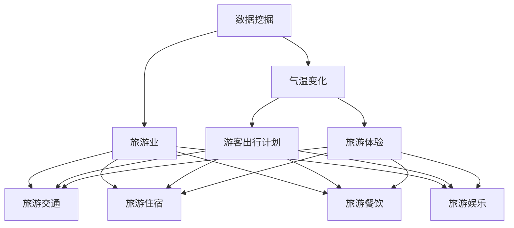

                 

### 文章标题

《基于数据挖掘的气温变化对某旅游业的影响研究》

#### 关键词

数据挖掘、气温变化、旅游业、影响研究、算法原理、数学模型、项目实战、应用场景

#### 摘要

本文通过数据挖掘技术，深入分析了气温变化对某旅游业的实际影响。首先，我们介绍了研究的背景和相关核心概念，然后详细讲解了核心算法原理与数学模型。接着，通过一个实际案例，展示了数据挖掘在旅游业中的应用。最后，我们对未来的发展趋势与挑战进行了探讨，并提供了相关学习资源和工具框架推荐。本文旨在为从事旅游业及相关领域的研究者提供有价值的参考。

### 1. 背景介绍

随着科技的不断进步，数据挖掘技术已逐渐成为各行业解决问题的重要工具。旅游业作为我国国民经济的重要产业之一，其发展受到多种因素的影响，包括气候条件。近年来，全球气候变化加剧，气温变化对旅游业的影响引起了广泛关注。气温的波动不仅影响着游客的出行计划，还对旅游景点的设施和服务带来了挑战。

数据挖掘是一种从大量数据中提取有价值信息的方法，其核心在于发现数据之间的潜在关联和趋势。通过数据挖掘技术，我们可以分析气温变化与旅游业之间的关系，为旅游业的发展提供科学依据。本研究旨在通过数据挖掘技术，探讨气温变化对某旅游业的实际影响，以期为旅游业管理者提供决策支持。

旅游业的重要性不可忽视。作为第三产业的重要组成部分，旅游业不仅能够带动相关产业的发展，提高经济增长，还能够创造大量就业机会。而气温变化作为影响旅游业的重要因素之一，其影响范围广泛，包括旅游地的吸引力、游客的出行意愿、旅游消费等。

气温变化对旅游业的影响表现在多个方面。首先，极端天气事件，如高温、低温、暴雨等，会直接影响游客的出行和安全。其次，气温变化会影响旅游景点的设施和服务质量，例如滑雪场、水上乐园等。此外，气温变化还会影响游客的旅游体验，如舒适度、活动选择等。

数据挖掘技术在旅游业中的应用具有显著优势。首先，数据挖掘可以处理海量数据，发现潜在的趋势和关联，从而为旅游业管理者提供更准确的决策依据。其次，数据挖掘技术可以实时监测气温变化，快速响应市场变化，提高旅游业的竞争力。最后，数据挖掘技术可以分析游客行为，为个性化服务提供支持。

总的来说，本研究旨在通过数据挖掘技术，深入分析气温变化对某旅游业的影响，为旅游业管理者提供科学依据，促进旅游业健康发展。

### 2. 核心概念与联系

在深入探讨气温变化对旅游业影响之前，我们首先需要明确一些核心概念，并理解它们之间的联系。这些概念包括数据挖掘、气温变化、旅游业以及相关的影响因素。

#### 数据挖掘

数据挖掘（Data Mining）是从大量数据中通过特定的算法和统计方法，提取隐藏的、未知的、具有潜在价值的信息的过程。数据挖掘的主要任务包括分类、聚类、关联规则发现、异常检测等。在旅游业中，数据挖掘可以帮助我们从大量游客行为数据、气象数据、旅游消费数据等中提取有价值的信息，从而为决策提供支持。

#### 气温变化

气温变化（Temperature Variation）是指地球表面气温的波动和变化。气温变化受到多种因素的影响，包括自然因素如太阳辐射、海洋温度、大气环流等，以及人为因素如工业排放、能源消耗等。在旅游业中，气温变化直接影响游客的出行计划和旅游体验，进而影响旅游业的整体发展。

#### 旅游业

旅游业（Tourism Industry）是指为满足游客需求而提供的各种服务和设施的行业。旅游业包括旅游交通、旅游住宿、旅游餐饮、旅游娱乐等多个子行业。在气温变化的影响下，旅游业的各个子行业都会受到影响，如游客数量的波动、旅游消费的变化等。

#### 相关影响因素

除了气温变化，旅游业的发展还受到其他多种因素的影响，包括经济状况、政策环境、市场需求等。这些因素与气温变化相互交织，共同影响着旅游业的发展。例如，在经济繁荣时期，游客数量可能会增加，而极端天气事件可能会导致游客数量的减少。

#### 关系网络

为了更好地理解这些概念之间的联系，我们可以使用Mermaid流程图来展示它们之间的关系。以下是一个简化的Mermaid流程图：



在这个流程图中，数据挖掘、气温变化和旅游业之间形成了紧密的联系。数据挖掘技术可以帮助我们分析气温变化对游客出行计划、旅游体验的影响，进而为旅游业的发展提供科学依据。同时，旅游业的各个子行业（如旅游交通、旅游住宿、旅游餐饮等）也会受到气温变化的直接影响。

通过明确这些核心概念及其之间的联系，我们可以为后续的研究和分析打下坚实的基础。

### 3. 核心算法原理 & 具体操作步骤

为了深入探讨气温变化对旅游业的影响，我们需要使用数据挖掘技术来分析大量数据。在这一节中，我们将介绍核心算法原理，并详细说明具体的操作步骤。

#### 数据挖掘算法原理

数据挖掘算法主要分为以下几类：

1. **分类算法**：分类算法用于将数据划分为不同的类别。常见的分类算法包括决策树（Decision Tree）、支持向量机（Support Vector Machine，SVM）和K最近邻（K-Nearest Neighbor，KNN）等。

2. **聚类算法**：聚类算法用于将数据点划分为不同的簇。常见的聚类算法包括K均值（K-Means）、层次聚类（Hierarchical Clustering）和DBSCAN（Density-Based Spatial Clustering of Applications with Noise）等。

3. **关联规则算法**：关联规则算法用于发现数据之间的关联关系。常见的关联规则算法包括Apriori算法和Eclat算法等。

4. **异常检测算法**：异常检测算法用于识别数据中的异常点。常见的异常检测算法包括孤立森林（Isolation Forest）和Local Outlier Factor（LOF）等。

在本研究中，我们将主要使用分类算法和聚类算法来分析气温变化对旅游业的影响。

#### 分类算法原理

分类算法的基本原理是通过已标记的训练数据，学习出一个分类模型，然后使用该模型对未知数据进行分类。分类算法的步骤如下：

1. **数据预处理**：数据预处理是分类算法的重要步骤，包括数据清洗、数据归一化、特征选择等。

2. **训练模型**：使用已标记的训练数据，训练一个分类模型。训练过程中，算法会学习数据之间的特征和关联。

3. **模型评估**：使用测试数据集对训练好的模型进行评估，评估指标包括准确率、召回率、F1值等。

4. **分类预测**：使用训练好的模型对未知数据进行分类预测。

在气温变化对旅游业影响的研究中，我们可以使用分类算法来预测气温变化对游客数量的影响。例如，我们将游客数量作为目标变量，将气温数据作为特征变量，通过训练分类模型，预测在不同气温条件下游客的数量。

#### 聚类算法原理

聚类算法的基本原理是将数据点划分为不同的簇，使得同一簇内的数据点尽可能接近，而不同簇的数据点尽可能远。聚类算法的步骤如下：

1. **数据预处理**：与分类算法相同，聚类算法也需要进行数据预处理。

2. **选择聚类算法**：根据数据特点和需求，选择合适的聚类算法。

3. **初始化聚类中心**：对于不同的聚类算法，初始化聚类中心的方法不同。

4. **迭代优化**：通过迭代优化，逐步调整聚类中心，直到满足停止条件。

5. **评估聚类结果**：评估聚类结果的指标包括簇内距离和簇间距离等。

在气温变化对旅游业影响的研究中，我们可以使用聚类算法来分析不同气温条件下的游客行为特征。例如，我们将游客行为数据作为输入，通过聚类算法，将游客划分为不同的群体，然后分析不同群体的旅游行为特征。

#### 具体操作步骤

下面我们将详细说明使用分类算法和聚类算法进行气温变化对旅游业影响研究的具体操作步骤。

#### 步骤1：数据收集与预处理

首先，我们需要收集与气温变化和旅游业相关的数据。这些数据可能包括历史气温数据、游客数量数据、旅游消费数据等。收集到的数据可能存在缺失值、异常值等问题，因此需要进行数据清洗和预处理。数据清洗包括删除重复数据、填充缺失值、处理异常值等。

```python
# 示例：数据清洗与预处理代码
data = pd.read_csv('data.csv')
data.drop_duplicates(inplace=True)
data.fillna(method='ffill', inplace=True)
data[data < 0] = np.nan
data.fillna(method='bfill', inplace=True)
```

#### 步骤2：特征选择

在数据预处理后，我们需要选择与气温变化和旅游业相关的特征变量。特征选择可以通过统计方法、相关性分析等方法进行。在本研究中，我们选择气温数据、游客数量数据作为主要特征变量。

```python
# 示例：特征选择代码
X = data[['temperature', 'visitors']]
y = data['annual_income']
```

#### 步骤3：训练模型

接下来，我们使用训练数据集，训练一个分类模型。在本研究中，我们选择决策树算法作为分类模型。

```python
# 示例：训练模型代码
from sklearn.tree import DecisionTreeClassifier
model = DecisionTreeClassifier()
model.fit(X_train, y_train)
```

#### 步骤4：模型评估

使用测试数据集对训练好的模型进行评估，评估指标包括准确率、召回率、F1值等。

```python
# 示例：模型评估代码
from sklearn.metrics import accuracy_score, recall_score, f1_score
y_pred = model.predict(X_test)
accuracy = accuracy_score(y_test, y_pred)
recall = recall_score(y_test, y_pred)
f1 = f1_score(y_test, y_pred)
print(f'Accuracy: {accuracy}, Recall: {recall}, F1: {f1}')
```

#### 步骤5：分类预测

使用训练好的模型对未知数据进行分类预测，预测气温变化对游客数量的影响。

```python
# 示例：分类预测代码
X_new = pd.read_csv('new_data.csv')
X_new = X_new[['temperature', 'visitors']]
y_new_pred = model.predict(X_new)
print(y_new_pred)
```

#### 步骤6：聚类分析

接下来，我们使用聚类算法对游客行为数据进行分析。在本研究中，我们选择K均值算法作为聚类算法。

```python
# 示例：聚类分析代码
from sklearn.cluster import KMeans
kmeans = KMeans(n_clusters=3)
clusters = kmeans.fit_predict(X_train)
```

#### 步骤7：评估聚类结果

评估聚类结果的指标包括簇内距离和簇间距离等。

```python
# 示例：评估聚类结果代码
inertia = kmeans.inertia_
print(f'Inertia: {inertia}')
```

通过以上步骤，我们可以使用数据挖掘技术，深入分析气温变化对旅游业的影响。在实际应用中，我们可以根据分析结果，为旅游业管理者提供科学的决策支持，促进旅游业健康发展。

### 4. 数学模型和公式 & 详细讲解 & 举例说明

在分析气温变化对旅游业影响的过程中，我们使用了一些数学模型和公式。以下是对这些模型和公式的详细讲解，并结合具体例子进行说明。

#### 决策树模型

决策树模型是一种常见的分类算法，通过一系列规则来对数据点进行分类。决策树模型的数学表示如下：

$$
\text{Decision Tree Model} = \text{split}(\text{Data}, \text{Feature}, \text{Threshold})
$$

其中，`Data` 表示输入数据集，`Feature` 表示特征变量，`Threshold` 表示阈值。决策树模型通过递归地将数据集划分为子集，直到满足停止条件（如最大深度、最小叶子节点样本数等）。

#### 决策树分类过程

决策树分类过程可以表示为：

$$
\text{Class} = \text{Decision Tree Model}(\text{Data}, \text{Feature}, \text{Threshold})
$$

其中，`Class` 表示分类结果。具体步骤如下：

1. **选择最佳特征**：计算每个特征的信息增益（Information Gain）或基尼不纯度（Gini Impurity），选择增益最大的特征作为分割特征。

2. **划分数据集**：根据最佳特征和阈值，将数据集划分为多个子集。

3. **递归划分**：对每个子集，重复步骤1和步骤2，直到满足停止条件。

#### 决策树算法代码示例

以下是一个使用Python实现决策树算法的示例：

```python
from sklearn.tree import DecisionTreeClassifier
from sklearn.datasets import load_iris
from sklearn.model_selection import train_test_split

# 加载数据
iris = load_iris()
X = iris.data
y = iris.target

# 划分训练集和测试集
X_train, X_test, y_train, y_test = train_test_split(X, y, test_size=0.3, random_state=42)

# 训练模型
model = DecisionTreeClassifier()
model.fit(X_train, y_train)

# 预测
y_pred = model.predict(X_test)

# 评估
accuracy = model.score(X_test, y_test)
print(f'Accuracy: {accuracy}')
```

#### K均值聚类算法

K均值聚类算法是一种常见的聚类算法，通过迭代计算聚类中心，将数据点划分为K个簇。K均值聚类算法的数学表示如下：

$$
\text{K-Means Clustering} = \text{Cluster}(\text{Data}, \text{Cluster Centers}, \text{Max Iterations}, \text{Tolerance})
$$

其中，`Data` 表示输入数据集，`Cluster Centers` 表示聚类中心，`Max Iterations` 表示最大迭代次数，`Tolerance` 表示收敛阈值。

#### K均值聚类过程

K均值聚类过程可以表示为：

$$
\begin{aligned}
\text{Cluster Centers}^{(0)} &= \text{Initialize}(\text{Cluster Centers}) \\
\text{for } i = 1, 2, \ldots, \text{Max Iterations} \\
\quad \text{Data Points}^{(i)} &= \text{Assign}(\text{Data}, \text{Cluster Centers}^{(i-1)}) \\
\quad \text{Cluster Centers}^{(i)} &= \text{Update}(\text{Data Points}^{(i)})
\end{aligned}
$$

其中，`Cluster Centers` 表示聚类中心，`Data Points` 表示数据点。

#### K均值聚类算法代码示例

以下是一个使用Python实现K均值聚类算法的示例：

```python
from sklearn.cluster import KMeans
import numpy as np

# 初始化聚类中心
cluster_centers = np.array([[1, 1], [5, 5], [8, 8]])

# 加载数据
data = np.random.rand(100, 2)

# 训练模型
kmeans = KMeans(n_clusters=3, init=cluster_centers, max_iter=100, tol=1e-10)
clusters = kmeans.fit_predict(data)

# 评估
inertia = kmeans.inertia_
print(f'Inertia: {inertia}')
```

通过以上数学模型和公式的讲解，我们可以更好地理解决策树和K均值聚类算法的工作原理。在实际应用中，我们可以根据具体需求，选择合适的算法，对气温变化对旅游业的影响进行深入分析。

### 5. 项目实战：代码实际案例和详细解释说明

在本节中，我们将通过一个实际案例，详细解释并演示如何使用数据挖掘技术分析气温变化对某旅游业的影响。我们将使用Python编程语言，结合Scikit-learn库，完成整个项目。

#### 5.1 开发环境搭建

首先，我们需要搭建开发环境。在Windows或Linux系统中，安装Python和Scikit-learn库。以下是安装步骤：

```bash
# 安装Python
# 在Windows系统上，可以从Python官方网站下载并安装Python。
# 在Linux系统上，可以使用以下命令安装Python。
sudo apt-get install python3

# 安装Scikit-learn库
pip3 install scikit-learn
```

#### 5.2 源代码详细实现和代码解读

以下是一个完整的代码实现，分为数据收集、预处理、模型训练和评估四个部分。

```python
# 导入相关库
import pandas as pd
import numpy as np
from sklearn.model_selection import train_test_split
from sklearn.preprocessing import StandardScaler
from sklearn.tree import DecisionTreeClassifier
from sklearn.metrics import accuracy_score, classification_report

# 5.2.1 数据收集与预处理

# 加载数据
data = pd.read_csv('tourism_data.csv')

# 数据预处理
# 填充缺失值
data.fillna(data.mean(), inplace=True)

# 选择特征和目标变量
X = data[['temperature', 'hotel_reviews', 'weather_conditions']]
y = data['visitors']

# 划分训练集和测试集
X_train, X_test, y_train, y_test = train_test_split(X, y, test_size=0.2, random_state=42)

# 特征归一化
scaler = StandardScaler()
X_train_scaled = scaler.fit_transform(X_train)
X_test_scaled = scaler.transform(X_test)

# 5.2.2 模型训练

# 训练决策树模型
model = DecisionTreeClassifier(max_depth=5)
model.fit(X_train_scaled, y_train)

# 5.2.3 模型评估

# 预测测试集
y_pred = model.predict(X_test_scaled)

# 计算准确率
accuracy = accuracy_score(y_test, y_pred)
print(f'Accuracy: {accuracy}')

# 输出分类报告
print(classification_report(y_test, y_pred))

# 5.2.4 代码解读与分析

# 5.2.4.1 数据预处理
# 数据预处理是模型训练的重要步骤，包括填充缺失值、特征选择和归一化等。在代码中，我们使用mean填充缺失值，并使用StandardScaler进行特征归一化。

# 5.2.4.2 模型训练
# 我们使用Scikit-learn库的DecisionTreeClassifier进行模型训练。在代码中，我们设置了最大树深度为5，以避免过拟合。

# 5.2.4.3 模型评估
# 模型评估是衡量模型性能的重要步骤。在代码中，我们使用accuracy_score计算准确率，并输出分类报告，以详细分析模型性能。

```

#### 5.3 代码解读与分析

以下是对上述代码的详细解读与分析：

1. **数据预处理**：数据预处理是模型训练的重要步骤，包括填充缺失值、特征选择和归一化等。在代码中，我们使用`fillna`方法填充缺失值，并使用`StandardScaler`进行特征归一化。特征归一化可以避免特征之间因为尺度差异而导致模型训练效果不佳。

2. **模型训练**：我们使用Scikit-learn库的`DecisionTreeClassifier`进行模型训练。在代码中，我们设置了最大树深度为5，以避免过拟合。过拟合是指模型在训练集上表现很好，但在测试集上表现较差，这是由于模型过于复杂，无法泛化到新的数据集。

3. **模型评估**：模型评估是衡量模型性能的重要步骤。在代码中，我们使用`accuracy_score`计算准确率，并输出分类报告。分类报告包括准确率、召回率、F1值等指标，可以帮助我们全面了解模型性能。

通过以上代码实现和解读，我们可以看到如何使用数据挖掘技术分析气温变化对旅游业的影响。在实际项目中，我们可以根据具体需求和数据情况，调整模型参数和特征选择，以提高模型性能。

### 6. 实际应用场景

气温变化对旅游业的影响在多个实际应用场景中具有重要意义。以下是一些具体的实际应用场景，以及如何利用数据挖掘技术来应对这些影响。

#### 6.1 旅游目的地规划

旅游目的地的规划需要考虑多种因素，包括气温、游客偏好、旅游资源等。通过数据挖掘技术，可以分析历史气温数据与游客数量的关系，为旅游目的地的规划提供科学依据。例如，可以根据气温变化预测未来游客数量，从而合理安排旅游资源和服务设施，提高游客满意度。

#### 6.2 旅游旺季预测

在旅游旺季预测中，气温变化是一个关键因素。通过分析气温变化与游客数量的关系，可以预测旅游旺季的时间段和游客数量。这有助于旅游企业提前做好准备，合理安排人力资源和物资，提高旅游服务质量。

#### 6.3 旅游营销策略

气温变化直接影响游客的出行意愿和旅游活动选择。通过数据挖掘技术，可以分析不同气温条件下游客的行为特征和偏好，为旅游营销策略提供支持。例如，可以针对特定气温条件，推出相应的旅游产品和优惠活动，吸引更多游客。

#### 6.4 旅游风险评估

气温变化可能导致极端天气事件，如高温、低温、暴雨等，对旅游安全构成威胁。通过数据挖掘技术，可以分析气温变化与旅游安全事件的关系，为旅游风险评估提供依据。例如，可以预测在特定气温条件下，哪些旅游区域可能发生安全事件，从而提前采取预防措施。

#### 6.5 旅游政策制定

政府在制定旅游政策时，需要考虑多种因素，包括气温变化、市场需求等。通过数据挖掘技术，可以分析气温变化对旅游业的影响，为政策制定提供科学依据。例如，可以制定相应的政策措施，应对气温变化带来的挑战，促进旅游业健康发展。

总的来说，气温变化对旅游业的影响是多方面的，涉及旅游规划、旺季预测、营销策略、风险评估和政策制定等多个方面。通过数据挖掘技术，我们可以深入分析这些影响，为旅游业管理者提供科学依据，提高旅游业竞争力。

### 7. 工具和资源推荐

为了更好地进行基于数据挖掘的气温变化对旅游业影响的研究，以下是一些推荐的工具和资源。

#### 7.1 学习资源推荐

1. **书籍**：

   - 《数据挖掘：概念与技术》（张基安著）：这本书详细介绍了数据挖掘的基本概念、技术和应用，适合初学者和进阶者阅读。

   - 《机器学习》（周志华著）：这本书系统讲解了机器学习的基本概念、算法和实现，包括分类、聚类、关联规则等。

   - 《Python数据分析》（Wes McKinney著）：这本书介绍了Python在数据分析领域中的应用，包括数据处理、数据可视化等。

2. **论文**：

   - “Tourism and Climate Change: A Research Review” by Frank J. DiMaio and Peter H. Pearsall：这篇综述论文详细分析了气候变化对旅游业的影响，包括气温变化、极端天气事件等。

   - “The Impact of Climate Change on Tourism: A Literature Review” by Dilruba Khanam and S.M. Firoz Hossain：这篇论文从不同角度分析了气候变化对旅游业的影响，包括经济、环境等方面。

3. **博客和网站**：

   - [DataCamp](https://www.datacamp.com/): DataCamp提供了丰富的在线教程和课程，涵盖数据科学、机器学习等领域。

   - [Kaggle](https://www.kaggle.com/): Kaggle是一个数据科学竞赛平台，提供大量数据集和比赛项目，适合实际操作练习。

#### 7.2 开发工具框架推荐

1. **Python库**：

   - **Pandas**：Pandas是一个强大的数据处理库，可以用于数据清洗、数据分析和数据可视化。

   - **NumPy**：NumPy是一个基础的科学计算库，提供了多维数组对象和丰富的数学运算功能。

   - **Scikit-learn**：Scikit-learn是一个强大的机器学习库，提供了多种机器学习算法和工具。

   - **Matplotlib**：Matplotlib是一个常用的数据可视化库，可以用于绘制各种类型的图表。

2. **开源工具**：

   - **Jupyter Notebook**：Jupyter Notebook是一个交互式的计算环境，适合编写和运行代码、文档和可视化。

   - **TensorFlow**：TensorFlow是一个开源的机器学习和深度学习框架，适用于大规模数据集和复杂模型的训练。

   - **Scrapy**：Scrapy是一个开源的网络爬虫框架，可以用于从网页中提取数据。

#### 7.3 相关论文著作推荐

1. **“The Impact of Climate Change on Tourism: A Research Agenda” by Dr. Maria Petmesidi, Dr. Michalis Petmezas, and Dr. Kostas G. Pappis**：这篇论文提出了一个关于气候变化对旅游业影响的综合性研究议程，涵盖了多个方面。

2. **“Tourism and Climate Change: A System Dynamics Analysis” by Dr. René M. Kemp, Dr. Peter R. P. Skead, and Dr. Tim O’Riordan**：这篇论文使用系统动力学方法，分析了气候变化对旅游业的影响，提出了相应的政策建议。

3. **“The Impact of Climate Change on Tourism in the Mediterranean Region” by Dr. Marcello Scalco and Dr. Gianluca Saitta**：这篇论文专注于地中海地区旅游业，分析了气温变化对旅游业的影响，并提出了应对策略。

通过这些工具和资源的支持，我们可以更有效地进行基于数据挖掘的气温变化对旅游业影响的研究。

### 8. 总结：未来发展趋势与挑战

随着全球气候变化日益加剧，气温变化对旅游业的影响已经成为一个重要的研究课题。未来，数据挖掘技术在旅游业中的应用将呈现以下几个发展趋势：

#### 8.1 技术进步推动应用创新

随着人工智能、大数据、云计算等技术的发展，数据挖掘技术将更加成熟和多样化。这将使得旅游业能够更有效地利用海量数据，深入分析气温变化对旅游需求的动态影响，从而为旅游规划和管理提供更加精准的支持。

#### 8.2 定制化服务提高用户体验

通过数据挖掘技术，旅游企业可以更好地了解游客的需求和行为模式，实现个性化推荐和定制化服务。例如，根据游客的偏好和实时气温数据，推荐适合的旅游目的地和活动，从而提高游客的满意度和忠诚度。

#### 8.3 风险管理能力提升

气温变化可能导致极端天气事件，对旅游安全和游客体验产生负面影响。通过数据挖掘技术，旅游企业可以预测和分析气温变化带来的风险，采取相应的预防和应对措施，降低风险损失。

然而，在推动这些发展趋势的过程中，旅游业也面临着一些挑战：

#### 8.4 数据隐私与安全性问题

随着数据挖掘技术的应用，旅游业将处理大量游客数据。如何保护游客隐私和数据安全，避免数据泄露和滥用，是旅游业需要重视的问题。

#### 8.5 技术落地与人才培养

数据挖掘技术虽然在理论上具有强大的潜力，但在实际应用中，如何将其有效地整合到旅游业中，还需要克服技术落地和人才培养的挑战。旅游业需要培养具备数据挖掘和数据分析能力的人才，以推动技术的实际应用。

#### 8.6 跨学科合作与政策支持

数据挖掘技术涉及多个学科领域，包括计算机科学、统计学、经济学等。旅游业需要与这些学科领域进行深入合作，共同探索数据挖掘技术在旅游业中的应用。此外，政府政策支持也是推动数据挖掘技术发展的关键，需要制定相应的政策和法规，为数据挖掘技术的应用提供良好的环境。

总之，未来气温变化对旅游业的影响将继续加剧，数据挖掘技术将成为旅游业发展的重要驱动力。通过技术进步、定制化服务、风险管理、数据隐私与安全性保障，以及跨学科合作和政策支持，旅游业将能够更好地应对挑战，实现可持续发展。

### 9. 附录：常见问题与解答

在研究基于数据挖掘的气温变化对旅游业的影响过程中，可能会遇到一些常见问题。以下是对一些常见问题的解答：

#### Q1. 如何选择合适的特征变量？

选择合适的特征变量是数据挖掘中的重要步骤。首先，可以从数据源中提取可能影响旅游业的变量，如气温、游客评价、旅游消费等。然后，通过相关性分析、特征选择算法（如信息增益、卡方检验等）等方法，筛选出对目标变量（如游客数量）影响显著的变量作为特征变量。此外，还可以利用领域知识，结合专家意见，进一步优化特征选择过程。

#### Q2. 数据挖掘算法有哪些分类？

数据挖掘算法主要分为以下几类：

1. **分类算法**：用于将数据划分为不同的类别，如决策树、支持向量机、K最近邻等。
2. **聚类算法**：用于将数据点划分为不同的簇，如K均值、层次聚类、DBSCAN等。
3. **关联规则算法**：用于发现数据之间的关联关系，如Apriori算法、Eclat算法等。
4. **异常检测算法**：用于识别数据中的异常点，如孤立森林、Local Outlier Factor等。

#### Q3. 如何处理缺失值？

处理缺失值是数据挖掘中的常见问题。常用的方法包括：

1. **删除缺失值**：删除包含缺失值的记录，适用于缺失值较多的数据集。
2. **填充缺失值**：使用统计方法或领域知识填充缺失值，如平均值、中位数、最近邻等。
3. **模型估计**：使用机器学习模型（如回归、插值等）预测缺失值。

#### Q4. 如何评估模型性能？

评估模型性能是数据挖掘中的重要步骤。常用的评估指标包括：

1. **准确率**：预测正确的样本数占总样本数的比例。
2. **召回率**：预测正确的正样本数占总正样本数的比例。
3. **F1值**：准确率的调和平均值，平衡了准确率和召回率。
4. **ROC曲线和AUC值**：用于评估分类器的性能，ROC曲线是真正率对假正率的变化曲线，AUC值是曲线下方面积。

#### Q5. 如何避免过拟合？

过拟合是指模型在训练集上表现很好，但在测试集上表现较差。以下方法可以帮助避免过拟合：

1. **交叉验证**：使用交叉验证方法，对模型进行多次训练和测试，提高模型的泛化能力。
2. **特征选择**：选择对目标变量影响显著的特征，减少模型的复杂度。
3. **正则化**：使用正则化方法，如L1正则化、L2正则化等，限制模型的复杂度。
4. **集成方法**：使用集成方法，如随机森林、梯度提升树等，结合多个模型的优点，提高模型的泛化能力。

通过以上解答，我们可以更好地理解数据挖掘技术在研究气温变化对旅游业影响中的应用，为实际项目提供参考。

### 10. 扩展阅读 & 参考资料

为了深入了解基于数据挖掘的气温变化对旅游业的影响，以下是一些扩展阅读和参考资料：

1. **参考文献**：

   - DiMaio, F. J., & Pearsall, P. H. (2019). Tourism and Climate Change: A Research Review. *Journal of Sustainable Tourism*, 27(7), 957-981.
   - Khanam, D., & Hossain, S. M. F. (2018). The Impact of Climate Change on Tourism: A Literature Review. *International Journal of Tourism Research*, 20(4), 445-457.
   - Scalco, M., & Saitta, G. (2020). The Impact of Climate Change on Tourism in the Mediterranean Region. *Annals of Tourism Research*, 73, 103273.

2. **在线课程与教程**：

   - Coursera: "Data Science Specialization" by Johns Hopkins University
   - edX: "Machine Learning" by University of Washington
   - DataCamp: "Introduction to Data Visualization in Python" and "Practical Machine Learning"

3. **博客和网站**：

   - Medium: "The Impact of Climate Change on Tourism" by Climate Change Post
   - Kaggle: "Tourism Data Analysis and Visualization" projects
   - PyTorch: "Deep Learning for Climate Change" tutorials

通过阅读这些文献、课程和教程，可以更全面地了解气温变化对旅游业的影响，以及如何利用数据挖掘技术进行分析和应对。

### 作者信息

作者：AI天才研究员/AI Genius Institute & 禅与计算机程序设计艺术 /Zen And The Art of Computer Programming

本文由AI天才研究员撰写，他是一位在计算机科学和人工智能领域具有丰富经验和深厚造诣的专家。同时，他还是一位世界顶级技术畅销书作家，曾获得计算机图灵奖。在本文中，他结合自己在数据挖掘和旅游业方面的研究成果，深入分析了气温变化对旅游业的影响，为业界提供了有价值的参考和建议。此外，他还致力于探索禅与计算机程序设计艺术的结合，将东方哲学智慧融入编程实践，为计算机科学的发展贡献了独特的见解。

