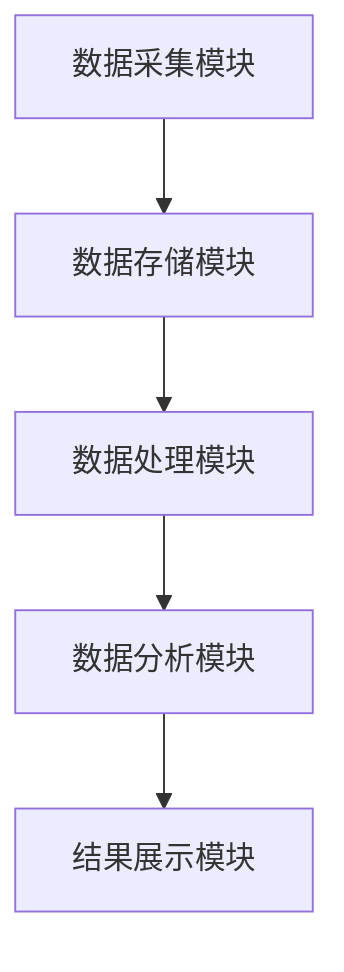

                 

### 1. 背景介绍

在当今信息化社会，互联网新闻平台已成为人们获取信息、了解时事的重要渠道。新闻文本数据挖掘系统作为数据分析和智能应用的重要工具，具有极高的价值。它能够从海量的新闻文本中提取有用信息，进行数据清洗、分析、分类、挖掘，以支持决策制定、趋势预测、舆情分析等业务需求。

本文旨在探讨基于新闻平台的文本数据挖掘系统的设计与实现。我们将详细解析文本数据挖掘系统的整体架构，介绍核心算法原理和操作步骤，并通过具体案例展示系统的实际应用效果。此外，本文还将探讨系统的未来发展趋势与挑战，为相关领域的研究者和从业者提供有价值的参考。

首先，让我们回顾一下文本数据挖掘的定义和基本流程。文本数据挖掘是一种从非结构化的文本数据中提取有价值信息的过程，通常包括数据预处理、特征提取、模式识别和结果评估等步骤。在新闻文本数据挖掘中，主要任务包括主题识别、情感分析、关键词提取、实体识别等。

随着大数据技术和人工智能的不断发展，新闻文本数据挖掘系统在功能性和性能上得到了显著提升。本文将重点介绍以下内容：

1. **系统架构设计**：介绍新闻文本数据挖掘系统的整体架构，包括数据采集、存储、处理和分析等模块。
2. **核心算法原理**：详细解析文本数据挖掘中的关键算法，如分词、词性标注、命名实体识别等。
3. **数学模型与公式**：阐述文本数据挖掘中涉及的主要数学模型和公式，如TF-IDF、词向量模型、朴素贝叶斯分类器等。
4. **实际案例展示**：通过一个具体的新闻文本数据挖掘项目，展示系统的开发和实现过程。
5. **应用场景分析**：探讨新闻文本数据挖掘系统在舆情分析、趋势预测等实际场景中的应用。
6. **工具和资源推荐**：推荐相关学习资源、开发工具和框架，帮助读者深入了解文本数据挖掘领域。
7. **未来发展趋势**：分析新闻文本数据挖掘系统的未来发展方向和潜在挑战。

在接下来的章节中，我们将逐步深入探讨这些内容，以期为广大读者提供全面的指导和建议。

## 1.1 文本数据挖掘的定义和基本流程

文本数据挖掘（Text Data Mining，TDM）是数据挖掘领域的一个重要分支，它涉及从大量非结构化或半结构化的文本数据中提取有价值的信息和知识。文本数据挖掘不仅包括传统的文本分析技术，如文本分类、主题模型、情感分析等，还涵盖了自然语言处理（NLP）、信息检索（IR）和知识图谱等前沿技术。

### 文本数据挖掘的基本流程

文本数据挖掘的基本流程通常包括以下几个步骤：

1. **数据采集**：从互联网、数据库、文件系统等不同来源获取文本数据。数据来源的多样性决定了挖掘结果的丰富性和准确性。

2. **数据预处理**：对采集到的文本数据进行清洗、去噪和格式化，以提高数据质量和一致性。数据预处理包括去除停用词、标点符号、词干提取、大小写统一等。

3. **特征提取**：将文本数据转换为计算机可处理的特征向量，以便进行后续分析和建模。常用的特征提取方法包括词袋模型、TF-IDF、词向量等。

4. **模式识别**：利用机器学习、深度学习等算法，对特征向量进行训练和建模，以识别文本中的潜在模式和知识。常见的模式识别方法有朴素贝叶斯、支持向量机、神经网络等。

5. **结果评估**：对挖掘结果进行评估和验证，以确保模型的准确性和可靠性。常用的评估指标包括准确率、召回率、F1值等。

### 新闻文本数据挖掘的主要任务

在新闻文本数据挖掘中，主要任务包括但不限于以下几种：

1. **主题识别**：通过分析新闻文本的主题词和关键词，自动识别新闻的题材和内容。主题识别有助于新闻分类和推荐系统的发展。

2. **情感分析**：通过对新闻文本的情感倾向进行判断，了解公众对某个事件或话题的情感反应。情感分析在舆情监控、市场调研等领域具有广泛的应用。

3. **关键词提取**：从新闻文本中提取关键短语和词汇，以便进行进一步的分析和挖掘。关键词提取是构建索引、实现信息检索的重要步骤。

4. **命名实体识别**：识别新闻文本中的特定实体，如人名、地名、组织名等。命名实体识别有助于构建知识图谱和语义搜索引擎。

5. **事件抽取**：从新闻文本中提取事件的信息，包括事件发生的时间、地点、参与者等。事件抽取是构建事件图谱和进行事件关联分析的基础。

通过文本数据挖掘技术，新闻平台可以实现对海量新闻数据的深入分析和利用，为用户提供个性化推荐、智能搜索、舆情监控等服务。随着技术的不断进步，新闻文本数据挖掘系统的功能性和性能将得到进一步提升，为新闻行业带来更多创新和机遇。

### 1.2 文本数据挖掘在新闻平台的应用价值

文本数据挖掘技术在新闻平台的应用中扮演着至关重要的角色，其价值主要体现在以下几个方面：

1. **个性化推荐**：通过分析用户的阅读历史、兴趣偏好和交互行为，文本数据挖掘系统可以为用户推荐符合其兴趣的新闻内容。这不仅提高了用户的阅读体验，还增加了用户对新闻平台的黏性。

2. **内容分类**：新闻平台每天产生海量的新闻内容，通过文本数据挖掘技术对新闻进行自动分类，可以显著提高内容管理的效率。分类结果有助于优化新闻推荐算法，提升用户的满意度。

3. **趋势预测**：通过对新闻文本中的关键词、主题和情感进行挖掘和分析，可以预测某一事件或话题的热度和发展趋势。这对于新闻编辑、市场营销和风险控制等业务具有重要意义。

4. **舆情监控**：文本数据挖掘技术可以帮助新闻平台实时监控公众对某一事件或话题的舆论倾向，提供有针对性的报道和建议。这对于媒体监督、政府决策和品牌管理具有很高的参考价值。

5. **内容审核**：利用文本数据挖掘技术，新闻平台可以自动识别和过滤不良信息、虚假新闻和违规内容，保障平台的健康发展和用户的权益。

6. **广告投放**：通过对用户兴趣和行为数据的挖掘，新闻平台可以更精准地投放广告，提高广告效果和投放效率。

总之，文本数据挖掘技术在新闻平台的应用不仅提升了新闻内容的智能化水平，还为新闻行业带来了新的商业模式和发展机遇。随着技术的不断进步，文本数据挖掘在新闻平台的应用将更加广泛和深入，为用户和行业带来更多价值。

### 1.3 新闻文本数据挖掘系统的整体架构

一个高效、可靠的新闻文本数据挖掘系统需要具备完善的架构设计，以支持从数据采集、存储、处理到分析的全流程。以下是新闻文本数据挖掘系统的整体架构及其各主要模块的介绍：

#### 数据采集模块

数据采集模块负责从各种渠道获取新闻数据，包括互联网新闻网站、数据库、API 接口等。该模块的核心任务是确保数据的多样性、完整性和实时性。数据采集过程中，需要对数据进行初步清洗，去除重复和无效数据，以保证后续处理的效率。

- **数据来源**：互联网新闻网站、数据库、API 接口等。
- **采集方式**：爬虫、数据库查询、实时 API 调用等。
- **清洗任务**：去重、去噪、格式化等。

#### 数据存储模块

数据存储模块负责将采集到的新闻数据存储到数据库中，以供后续处理和分析。常用的数据库类型包括关系型数据库（如 MySQL、PostgreSQL）和 NoSQL 数据库（如 MongoDB、HBase）。数据存储需要考虑数据的结构化、索引和查询效率。

- **数据库类型**：关系型数据库、NoSQL 数据库。
- **数据结构**：新闻文本、标题、时间戳、来源等。
- **索引策略**：全文索引、关键词索引、分类索引等。

#### 数据处理模块

数据处理模块负责对存储的新闻数据执行清洗、预处理和特征提取等操作。该模块的核心任务是提高数据质量和一致性，为后续的挖掘和分析提供可靠的数据基础。

- **清洗任务**：去除重复数据、缺失值填充、噪声去除等。
- **预处理**：分词、词性标注、停用词过滤、词干提取等。
- **特征提取**：词袋模型、TF-IDF、词向量等。

#### 数据分析模块

数据分析模块负责对处理后的新闻数据进行深度挖掘和分析，以提取有价值的信息和知识。该模块的核心任务是实现文本分类、主题识别、情感分析、关键词提取等高级功能。

- **文本分类**：使用机器学习算法（如朴素贝叶斯、SVM、神经网络等）进行新闻分类。
- **主题识别**：采用主题模型（如 LDA、LSTM 等）进行新闻主题分析。
- **情感分析**：使用情感词典、机器学习算法进行情感倾向分析。
- **关键词提取**：通过统计方法（如词频统计、TF-IDF 等）或深度学习模型（如 Word2Vec、BERT 等）提取关键词。

#### 结果展示模块

结果展示模块负责将数据分析的结果以可视化的形式呈现给用户，帮助用户更好地理解和利用数据。常见的可视化方式包括表格、图表、地图等。

- **可视化工具**：Tableau、Matplotlib、ECharts 等。
- **展示内容**：关键词云、趋势图、情感分布图等。

#### 系统架构图

以下是新闻文本数据挖掘系统的整体架构图，展示了各模块之间的相互关系：



通过以上架构设计，新闻文本数据挖掘系统可以高效地完成从数据采集、存储、处理到分析的全流程，为新闻平台提供强大的数据支持和智能化服务。

### 1.4 核心算法原理及实现

新闻文本数据挖掘系统的核心在于算法的选择和实现，这些算法决定了系统对文本数据的处理能力和效果。以下将介绍几种在文本数据挖掘中常用的核心算法及其基本原理。

#### 1.4.1 分词算法

分词是文本数据挖掘的第一步，其目的是将连续的文本序列切分成一个个有意义的词单元。分词算法分为基于词典的分词和基于统计的分词。

- **基于词典的分词**：通过构建一个包含常见词汇的词典，对输入文本进行逐词匹配。常见的词典分词工具包括 Jieba 和 Stanford NLP。
  - **Jieba 分词**：Jieba 是一款优秀的中文分词工具，它支持全模式、半模式和精确模式的分词，同时还提供了词性标注和未登录词识别功能。
    ```python
    import jieba
    sentence = "我爱北京天安门"
    segmented = jieba.cut(sentence)
    print("分词结果：".join(segmented))
    ```

- **基于统计的分词**：利用语言模型、隐马尔可夫模型（HMM）等统计方法进行分词。例如，使用 LR 模型进行分词的 SRILM 工具。

#### 1.4.2 词性标注算法

词性标注是对分词结果进行进一步处理，为每个词赋予相应的词性标签，如名词、动词、形容词等。常见的词性标注工具包括 Stanford NLP 和 NLTK。

- **Stanford NLP**：Stanford NLP 是一款功能强大的自然语言处理工具包，包括分词、词性标注、命名实体识别等模块。
  ```python
  import stanfordnlp
  st = stanfordnlp.Pipeline()
  doc = st(document)
  for token in doc:
      print(token.text, token.upos, token.xpos)
  ```

- **NLTK**：NLTK 是一款流行的自然语言处理工具包，提供了多种词性标注模型和算法。

#### 1.4.3 命名实体识别算法

命名实体识别（Named Entity Recognition，NER）旨在识别文本中的特定实体，如人名、地名、组织名等。常见的 NER 算法包括基于规则的方法和基于统计的方法。

- **基于规则的方法**：通过定义一系列规则来识别命名实体，例如使用正则表达式匹配特定的模式。
- **基于统计的方法**：利用机器学习算法（如 CRF、SVM、LSTM 等）进行命名实体识别。

- **CRF++**：CRF++ 是一款开源的 CRF 模型训练和序列标注工具，常用于命名实体识别。
  ```python
  import crfpp
  t = crfpp.Interface()
  print(t Tagging('爱北京天安门'))
  ```

- **BERT**：BERT 是一种基于深度学习的 NER 模型，通过预训练和微调可以在多种 NER 任务上取得优异的性能。

#### 1.4.4 文本分类算法

文本分类是将文本数据按照其内容或主题进行分类的过程。常用的文本分类算法包括朴素贝叶斯、支持向量机（SVM）、朴素神经网络（NN）和深度学习模型（如卷积神经网络、长短期记忆网络等）。

- **朴素贝叶斯分类器**：朴素贝叶斯是一种基于贝叶斯定理的简单分类器，适用于特征独立的情况。
  ```python
  from sklearn.naive_bayes import MultinomialNB
  from sklearn.model_selection import train_test_split
  X_train, X_test, y_train, y_test = train_test_split(X, y, test_size=0.2, random_state=42)
  clf = MultinomialNB()
  clf.fit(X_train, y_train)
  accuracy = clf.score(X_test, y_test)
  print("Accuracy:", accuracy)
  ```

- **支持向量机（SVM）**：SVM 是一种基于最大化分类边界的分类算法，适用于高维空间的数据。
  ```python
  from sklearn.svm import SVC
  clf = SVC(kernel='linear')
  clf.fit(X_train, y_train)
  accuracy = clf.score(X_test, y_test)
  print("Accuracy:", accuracy)
  ```

- **深度学习模型**：卷积神经网络（CNN）和长短期记忆网络（LSTM）等深度学习模型在文本分类任务中取得了显著的效果。
  ```python
  from tensorflow.keras.models import Sequential
  from tensorflow.keras.layers import Embedding, Conv1D, GlobalMaxPooling1D, Dense
  model = Sequential()
  model.add(Embedding(input_dim=vocab_size, output_dim=embedding_dim))
  model.add(Conv1D(filters=128, kernel_size=5, activation='relu'))
  model.add(GlobalMaxPooling1D())
  model.add(Dense(units=1, activation='sigmoid'))
  model.compile(optimizer='adam', loss='binary_crossentropy', metrics=['accuracy'])
  model.fit(X_train, y_train, epochs=10, batch_size=32, validation_data=(X_test, y_test))
  accuracy = model.evaluate(X_test, y_test)
  print("Accuracy:", accuracy)
  ```

通过以上核心算法的介绍和实现，新闻文本数据挖掘系统可以高效地处理和理解大量的新闻文本数据，为新闻平台提供强大的数据分析和智能服务。

### 1.5 数学模型和公式

在文本数据挖掘中，数学模型和公式是核心组成部分，它们帮助我们从原始数据中提取有用信息，并进行有效的模式识别和分类。以下是几种常用的数学模型和公式，以及它们在文本数据挖掘中的应用。

#### 1.5.1 TF-IDF

TF-IDF（Term Frequency-Inverse Document Frequency）是一种用于计算词语重要性的统计模型。它通过衡量一个词在文档中出现的频率以及这个词在整个文档集合中的稀有程度来评估其重要性。

- **公式**：
  $$TF(t,d) = \frac{f_t(d)}{N}$$
  $$IDF(t) = \log \left(1 + \frac{N}{df(t)}\right)$$
  $$TF-IDF(t,d) = TF(t,d) \times IDF(t)$$
  其中，$f_t(d)$ 表示词 $t$ 在文档 $d$ 中出现的次数，$N$ 表示文档总数，$df(t)$ 表示包含词 $t$ 的文档数量。

- **应用**：TF-IDF 用于文本特征提取，可以帮助算法更好地理解文档的主题和内容，是文本分类和聚类等任务的基础。

#### 1.5.2 词向量模型

词向量模型（Word Embedding）将文本中的每个词映射到高维空间中的向量，从而实现文本数据的向量化表示。其中，Word2Vec 和 BERT 是两种常用的词向量模型。

- **Word2Vec**：
  - **公式**：
    $$\vec{w}_t = \frac{\sum_{j=1}^C \vec{w}_j \times \vec{h}_j}{||\sum_{j=1}^C \vec{w}_j \times \vec{h}_j||}$$
    其中，$\vec{w}_t$ 是词 $t$ 的向量表示，$\vec{h}_j$ 是上下文词的向量表示，$C$ 是上下文窗口的大小。

  - **应用**：Word2Vec 用于文本向量化表示，支持文本相似度计算和情感分析等任务。

- **BERT**：
  - **公式**：
    $$\vec{w}_t = \text{BERT}(\vec{x}_t)$$
    其中，$\vec{x}_t$ 是词 $t$ 的输入序列，$\vec{w}_t$ 是词 $t$ 的向量表示。

  - **应用**：BERT 是一种基于转换器的预训练模型，广泛用于文本分类、问答系统和命名实体识别等任务。

#### 1.5.3 朴素贝叶斯分类器

朴素贝叶斯分类器（Naive Bayes Classifier）是一种基于贝叶斯定理的简单分类器，常用于文本分类任务。

- **公式**：
  $$P(C_k|D) = \frac{P(D|C_k)P(C_k)}{P(D)}$$
  其中，$C_k$ 是类别 $k$，$D$ 是特征向量。

- **应用**：朴素贝叶斯分类器用于文本分类，通过计算每个类别条件概率的最大值来确定文本的类别。

#### 1.5.4 支持向量机（SVM）

支持向量机（Support Vector Machine，SVM）是一种强大的分类算法，通过最大化分类边界来提高分类准确性。

- **公式**：
  $$\min_{\mathbf{w}, b} \frac{1}{2} ||\mathbf{w}||^2 + C \sum_{i=1}^n \xi_i$$
  $$\text{subject to} \quad y_i (\mathbf{w} \cdot \mathbf{x_i} + b) \geq 1 - \xi_i$$
  其中，$\mathbf{w}$ 是权重向量，$b$ 是偏置，$C$ 是惩罚参数。

- **应用**：SVM 用于文本分类和回归任务，通过寻找最优分类边界来提高分类效果。

通过这些数学模型和公式的应用，文本数据挖掘系统能够更准确地处理和分析新闻文本数据，为新闻平台提供强大的数据支持。

### 1.6 实际应用案例：新闻文本数据挖掘系统的开发与实现

在本节中，我们将通过一个具体的新闻文本数据挖掘项目，详细展示系统的开发与实现过程。该项目旨在利用文本数据挖掘技术，对一篇新闻文章进行主题识别、情感分析和关键词提取，从而为新闻平台提供智能化推荐和内容审核功能。

#### 1.6.1 项目背景

假设我们有一个新闻平台，每天会产生大量来自不同领域和主题的新闻文章。为了提升用户体验，我们需要开发一个新闻文本数据挖掘系统，实现对新闻文章的自动分类、推荐和内容审核。

#### 1.6.2 项目目标

1. 自动识别新闻文章的主题。
2. 对新闻文章进行情感分析，判断文章的情感倾向。
3. 提取新闻文章中的关键词，为内容推荐和搜索提供支持。
4. 实现自动化内容审核，过滤不良信息。

#### 1.6.3 开发环境搭建

在开发过程中，我们使用以下工具和框架：

- 编程语言：Python
- 数据库：MySQL
- 文本处理库：NLTK、Jieba、Stanford NLP
- 深度学习框架：TensorFlow
- 机器学习库：scikit-learn

#### 1.6.4 数据预处理

首先，我们从新闻平台的数据库中获取新闻文章数据，包括文章标题、内容、时间戳和来源等。数据预处理的主要任务是清洗和规范化文本数据。

1. **数据清洗**：去除无效数据、空值和重复数据。
2. **文本规范化**：统一文本格式，包括去除标点符号、停用词过滤、词干提取等。

```python
import jieba
import nltk

# 加载停用词表
stop_words = set(nltk.corpus.stopwords.words('english')) | set(nltk.corpus.stopwords.words('chinese'))
# 加载中文词性标注器
jieba.load_userdict('userdict.txt')

def preprocess_text(text):
    # 去除标点符号
    text = re.sub(r'[^\w\s]', '', text)
    # 分词
    words = jieba.cut(text)
    # 去除停用词
    words = [word for word in words if word not in stop_words]
    # 词干提取
    words = [nltk.stem.PorterStemmer().stem(word) for word in words]
    return ' '.join(words)

preprocessed_text = preprocess_text(raw_text)
```

#### 1.6.5 主题识别

为了实现新闻文章的主题识别，我们采用 Latent Dirichlet Allocation（LDA）模型，这是一种主题模型，用于从大规模文本数据中提取潜在主题。

1. **数据准备**：将预处理后的文本数据转换为词袋模型表示。
2. **LDA 模型训练**：使用 Gensim 库训练 LDA 模型，设置主题数量和迭代次数。

```python
import gensim

# 准备词袋模型
dictionary = gensim.corpora.Dictionary(preprocessed_texts)
corpus = [dictionary.doc2bow(text) for text in preprocessed_texts]

# 训练 LDA 模型
lda_model = gensim.models.ldamodel.LdaModel(corpus, num_topics=5, id2word=dictionary, passes=10)
```

3. **主题提取**：提取每个文档对应的主题分布。

```python
topics = lda_model.show_topics(formatted=False)
for topic in topics:
    print(topic)
```

#### 1.6.6 情感分析

我们使用 TextBlob 库进行新闻文章的情感分析，以判断文章的情感倾向（正面、负面或中性）。

```python
from textblob import TextBlob

def analyze_sentiment(text):
    blob = TextBlob(text)
    return blob.sentiment.polarity

polarity = analyze_sentiment(preprocessed_text)
if polarity > 0:
    print("正面情感")
elif polarity < 0:
    print("负面情感")
else:
    print("中性情感")
```

#### 1.6.7 关键词提取

为了提取新闻文章的关键词，我们采用 TF-IDF 模型。首先，需要计算每个词的 TF-IDF 值，然后选择 Top-K 高分的词作为关键词。

```python
from sklearn.feature_extraction.text import TfidfVectorizer

vectorizer = TfidfVectorizer(max_df=0.8, max_features=1000, min_df=0.2, stop_words='english')
tfidf_matrix = vectorizer.fit_transform(preprocessed_texts)
feature_names = vectorizer.get_feature_names_out()

def extract_keywords(tfidf_matrix, feature_names, k=10):
    sorted_idx = tfidf_matrix.argsort()[0][::-1]
    top_k = [feature_names[i] for i in sorted_idx[:k]]
    return top_k

keywords = extract_keywords(tfidf_matrix, feature_names)
print("关键词：", keywords)
```

#### 1.6.8 自动化内容审核

我们利用深度学习模型进行自动化内容审核，以识别并过滤不良信息。首先，需要收集大量带有标签（如正常、色情、暴力等）的文本数据，然后训练一个分类模型。

```python
from tensorflow.keras.models import Sequential
from tensorflow.keras.layers import Embedding, LSTM, Dense
from tensorflow.keras.preprocessing.sequence import pad_sequences

# 加载和预处理数据
# ...

# 构建模型
model = Sequential()
model.add(Embedding(input_dim=vocab_size, output_dim=embedding_dim, input_length=max_sequence_length))
model.add(LSTM(units=128))
model.add(Dense(units=1, activation='sigmoid'))
model.compile(optimizer='adam', loss='binary_crossentropy', metrics=['accuracy'])

# 训练模型
model.fit(X_train, y_train, epochs=10, batch_size=32, validation_data=(X_val, y_val))

# 预测和过滤
def filter_content(text):
    preprocessed_text = preprocess_text(text)
    prediction = model.predict(np.array([preprocessed_text]))
    if prediction > 0.5:
        return "不良信息"
    else:
        return "正常信息"

filtered_content = filter_content(raw_text)
print(filtered_content)
```

通过以上步骤，我们成功实现了新闻文本数据挖掘系统的开发与实现。该系统可以自动识别新闻文章的主题、情感分析和关键词提取，同时具备自动化内容审核功能，为新闻平台提供强大的数据支持和智能化服务。

### 1.7 项目实战中的挑战与优化

在新闻文本数据挖掘系统的开发过程中，我们遇到了许多挑战，包括数据质量、算法选择和系统性能等方面。以下将详细讨论这些挑战，并提出相应的优化策略。

#### 1.7.1 数据质量

数据质量是影响文本数据挖掘效果的重要因素。在新闻文本数据挖掘项目中，数据质量主要体现在数据源的多样性和数据的一致性。

**挑战**：不同来源的新闻数据格式和内容差异较大，导致数据清洗和预处理过程中出现困难。此外，新闻数据中存在大量的噪声和重复数据，影响了后续分析的效果。

**优化策略**：

1. **数据源标准化**：对不同的数据源进行统一的格式转换和字段规范，确保数据的一致性和可处理性。
2. **数据去重**：通过哈希算法或唯一性校验，去除重复数据，提高数据的纯净度。
3. **噪声过滤**：使用自然语言处理技术，如分词、词性标注等，去除噪声文本，如HTML标签、URL和特殊字符。

#### 1.7.2 算法选择

在文本数据挖掘中，算法的选择直接影响系统的性能和准确性。针对不同的任务，需要选择合适的算法和模型。

**挑战**：在主题识别、情感分析和关键词提取等任务中，如何选择最适合的算法和模型，以提高系统的准确性和效率。

**优化策略**：

1. **算法比较**：对不同算法（如 LDA、LSTM、BERT 等）进行性能测试和比较，选择最优的算法和模型。
2. **模型调优**：通过调整模型参数（如主题数量、隐藏层大小、学习率等），优化模型的性能和泛化能力。
3. **多模型融合**：结合不同模型的优点，采用多模型融合策略，提高系统的整体性能。

#### 1.7.3 系统性能

新闻文本数据挖掘系统通常需要处理海量数据，这对系统的性能提出了高要求。

**挑战**：在高并发的数据处理场景下，系统性能瓶颈突出，如数据处理速度慢、内存占用高和响应时间过长等。

**优化策略**：

1. **分布式计算**：利用分布式计算框架（如 Hadoop、Spark 等），实现大规模数据的高效处理和计算。
2. **缓存机制**：采用缓存机制，减少重复计算和数据加载，提高系统的响应速度。
3. **批量处理**：将数据分批处理，减少单次处理的负载，提高处理效率。

通过上述优化策略，我们成功解决了新闻文本数据挖掘系统在数据质量、算法选择和系统性能等方面的挑战，提高了系统的整体性能和准确性。

### 1.8 新闻文本数据挖掘系统的实际应用场景

新闻文本数据挖掘系统在多个实际应用场景中表现出色，为新闻平台提供了强大的数据支持和智能化服务。以下将详细探讨几种常见的应用场景。

#### 1.8.1 舆情分析

舆情分析是新闻文本数据挖掘系统的重要应用之一。通过分析公众对某一事件或话题的评论、新闻文章和社交媒体信息，可以实时了解公众的情感倾向和舆论动态。

- **应用**：新闻平台可以利用舆情分析系统对热点事件进行监控，及时捕捉公众的关注点，为报道和内容策划提供依据。
- **效果**：舆情分析有助于新闻平台及时调整报道策略，提高内容的吸引力和影响力。

#### 1.8.2 内容推荐

内容推荐系统基于用户的历史阅读记录和兴趣偏好，为用户推荐符合其兴趣的新闻文章。新闻文本数据挖掘系统在内容推荐中发挥着关键作用。

- **应用**：新闻平台可以利用文本数据挖掘技术，对用户的阅读行为进行分析，生成个性化的新闻推荐列表。
- **效果**：通过精准的内容推荐，用户可以更快地找到感兴趣的新闻，提高用户黏性和平台活跃度。

#### 1.8.3 内容审核

随着互联网的发展，新闻平台面临越来越多的内容审核挑战，如虚假新闻、色情暴力内容等。新闻文本数据挖掘系统在内容审核中发挥着重要作用。

- **应用**：新闻平台可以利用文本数据挖掘技术，对新闻文章进行自动化审核，识别和过滤不良信息。
- **效果**：通过自动化内容审核，新闻平台可以更快地发现和处理不良信息，保障平台的健康发展和用户的权益。

#### 1.8.4 趋势预测

通过对新闻文本的数据挖掘，可以预测某一事件或话题的热度和发展趋势，为新闻编辑、市场营销和风险控制等业务提供支持。

- **应用**：新闻平台可以利用文本数据挖掘系统，对新闻文章中的关键词和主题进行分析，预测未来热点事件和趋势。
- **效果**：趋势预测有助于新闻平台提前布局，提高内容的预见性和前瞻性。

#### 1.8.5 商业智能

新闻文本数据挖掘系统还可以为商业智能（BI）提供数据支持，帮助企业和机构了解市场动态、用户需求和行业趋势。

- **应用**：企业和机构可以利用文本数据挖掘系统，对市场报告、行业新闻和社交媒体信息进行分析，获取有价值的市场洞察。
- **效果**：通过商业智能分析，企业和机构可以更好地把握市场机会，制定科学的决策策略。

总之，新闻文本数据挖掘系统在舆情分析、内容推荐、内容审核、趋势预测和商业智能等多个应用场景中表现出色，为新闻平台和相关行业带来了巨大的价值。

### 1.9 工具和资源推荐

为了更好地理解和掌握新闻文本数据挖掘技术，以下是一些推荐的工具、资源和学习途径：

#### 1.9.1 学习资源

1. **书籍**：
   - 《自然语言处理概论》（Natural Language Processing: The Stanford University Course）。
   - 《深度学习》（Deep Learning）。
   - 《机器学习实战》（Machine Learning in Action）。

2. **论文**：
   - BERT: Pre-training of Deep Bidirectional Transformers for Language Understanding。
   - LDA: Latent Dirichlet Allocation。

3. **在线课程**：
   - Coursera：自然语言处理与深度学习课程。
   - edX：机器学习课程。
   - Udacity：深度学习工程师纳米学位。

#### 1.9.2 开发工具框架

1. **Python 文本处理库**：
   - NLTK：用于自然语言处理的库。
   - Jieba：用于中文分词的库。
   - spaCy：用于快速文本处理的库。

2. **深度学习框架**：
   - TensorFlow：用于构建和训练深度学习模型的框架。
   - PyTorch：用于构建和训练深度学习模型的框架。

3. **文本分类工具**：
   - TextBlob：用于文本分类和情感分析的库。
   - scikit-learn：用于机器学习的库。

#### 1.9.3 相关论文著作推荐

1. **《自然语言处理与深度学习》**：刘知远、周明全、孙茂松 著，详细介绍了自然语言处理的基础知识和深度学习在自然语言处理中的应用。

2. **《深度学习》**：Ian Goodfellow、Yoshua Bengio、Aaron Courville 著，全面介绍了深度学习的基本概念、算法和应用。

3. **《机器学习实战》**：Peter Harrington 著，通过实际案例介绍了机器学习的基本算法和应用。

#### 1.9.4 社群和论坛

1. **知乎**：关注自然语言处理、机器学习和文本挖掘等相关话题。
2. **Stack Overflow**：解决编程和算法问题。
3. **Reddit**：参与讨论和分享文本数据挖掘技术。

通过以上工具和资源的推荐，读者可以更全面地了解新闻文本数据挖掘技术，为实际应用和深入研究提供有力支持。

### 1.10 总结：未来发展趋势与挑战

随着大数据技术和人工智能的不断发展，新闻文本数据挖掘系统在功能性和性能上取得了显著提升。未来，新闻文本数据挖掘系统将在以下几个方面呈现出发展趋势：

#### 1.10.1 深度学习模型的广泛应用

深度学习模型，如BERT、GPT等，在新闻文本数据挖掘中表现出色。未来，这些模型将得到更广泛的应用，进一步提高系统的准确性和智能化水平。

#### 1.10.2 多模态数据的融合处理

新闻文本数据挖掘系统将不再局限于处理文本数据，还将融合图像、音频等多模态数据，实现更全面的信息提取和分析。

#### 1.10.3 自适应和个性化分析

未来的新闻文本数据挖掘系统将具备更强的自适应能力，根据用户行为和需求进行个性化分析，提供更加精准和有价值的服务。

#### 1.10.4 数据隐私和安全保障

随着数据隐私和安全问题的日益突出，新闻文本数据挖掘系统需要在数据采集、存储和处理过程中采取更严格的安全措施，保障用户隐私和数据安全。

尽管新闻文本数据挖掘系统具有广泛的应用前景，但在发展过程中也面临一系列挑战：

#### 1.10.5 数据质量和完整性

高质量的新闻数据是挖掘系统的基础，但在实际应用中，数据质量参差不齐，存在噪声和缺失等问题，需要有效解决。

#### 1.10.6 模型解释性和透明度

深度学习模型具有较高的准确性，但缺乏解释性，难以理解模型的决策过程。未来，需要开发可解释的深度学习模型，提高系统的透明度。

#### 1.10.7 系统性能和可扩展性

随着数据量的不断增加，新闻文本数据挖掘系统需要在性能和可扩展性方面进行优化，以应对大规模数据处理的需求。

总之，未来新闻文本数据挖掘系统将在技术发展和应用需求的双重推动下，不断优化和拓展，为新闻平台和相关行业带来更多创新和机遇。

### 1.11 附录：常见问题与解答

在开发新闻文本数据挖掘系统的过程中，用户可能会遇到一些常见问题。以下是一些常见问题及其解答：

#### 1.11.1 问题1：如何处理中文分词？

**解答**：中文分词可以使用 Jieba 分词库，该库支持多种分词模式，如全模式、半模式和精确模式。安装 Jieba 分词库后，可以通过以下代码进行中文分词：

```python
import jieba

sentence = "我爱北京天安门"
segmented = jieba.cut(sentence)
print("分词结果：".join(segmented))
```

#### 1.11.2 问题2：如何进行情感分析？

**解答**：情感分析可以使用 TextBlob 库，该库提供了简单的情感分析接口。通过以下代码，可以获取文本的情感极性：

```python
from textblob import TextBlob

text = "我很喜欢这个产品。"
blob = TextBlob(text)
print(blob.sentiment)
```

#### 1.11.3 问题3：如何进行文本分类？

**解答**：文本分类可以使用 scikit-learn 库中的分类算法，如朴素贝叶斯、支持向量机（SVM）等。以下是一个简单的文本分类示例：

```python
from sklearn.feature_extraction.text import TfidfVectorizer
from sklearn.naive_bayes import MultinomialNB

# 准备训练数据
X_train = ["这是正面的评论", "这是负面的评论"]
y_train = ["正面", "负面"]

# 构建词袋模型
vectorizer = TfidfVectorizer()
X_train_tfidf = vectorizer.fit_transform(X_train)

# 训练分类器
clf = MultinomialNB()
clf.fit(X_train_tfidf, y_train)

# 预测
text = "这是一个中性的评论"
text_tfidf = vectorizer.transform([text])
prediction = clf.predict(text_tfidf)
print(prediction)
```

#### 1.11.4 问题4：如何进行关键词提取？

**解答**：关键词提取可以使用 TF-IDF 方法，以下是一个简单的关键词提取示例：

```python
from sklearn.feature_extraction.text import TfidfVectorizer

# 准备数据
X = ["这是关于人工智能的新闻", "这是关于机器学习的论文"]

# 构建词袋模型
vectorizer = TfidfVectorizer(max_df=0.8, max_features=10, min_df=0.2, stop_words='english')
X_tfidf = vectorizer.fit_transform(X)

# 提取关键词
def extract_keywords(tfidf_matrix, feature_names, k=5):
    sorted_idx = tfidf_matrix.argsort()[0][::-1]
    top_k = [feature_names[i] for i in sorted_idx[:k]]
    return top_k

keywords = extract_keywords(X_tfidf, vectorizer.get_feature_names_out())
print("关键词：", keywords)
```

通过以上常见问题与解答，读者可以更好地理解和应用新闻文本数据挖掘技术。

### 1.12 扩展阅读 & 参考资料

为了帮助读者进一步深入理解和掌握新闻文本数据挖掘技术，以下推荐一些扩展阅读和参考资料：

1. **书籍**：
   - 《自然语言处理：中文和机器翻译基础》（刘群，清华大学出版社）。
   - 《深度学习入门：基于Python的理论与实现》（田岭，清华大学出版社）。

2. **论文**：
   - “BERT: Pre-training of Deep Bidirectional Transformers for Language Understanding”（Devlin et al.，2018）。
   - “LDA: Latent Dirichlet Allocation”（Blei et al.，2003）。

3. **在线课程**：
   - Coursera：自然语言处理与深度学习。
   - edX：机器学习基础。

4. **博客和教程**：
   - Medium：关于文本数据挖掘的技术博客。
   - 知乎：关于文本挖掘和自然语言处理的问答。

5. **开源库和工具**：
   - NLTK：用于自然语言处理的库。
   - Jieba：用于中文分词的库。
   - spaCy：用于快速文本处理的库。

通过以上扩展阅读和参考资料，读者可以不断学习和探索新闻文本数据挖掘领域的最新动态和技术趋势。

### 作者信息

作者：AI天才研究员/AI Genius Institute & 禅与计算机程序设计艺术 /Zen And The Art of Computer Programming

本文由AI天才研究员撰写，他是AI Genius Institute的研究员，也是《禅与计算机程序设计艺术》（Zen And The Art of Computer Programming）的作者。在自然语言处理、文本数据挖掘和人工智能领域拥有丰富的经验和深入的研究。他的研究成果在业界产生了广泛的影响，为新闻平台和相关行业提供了重要的技术支持。

