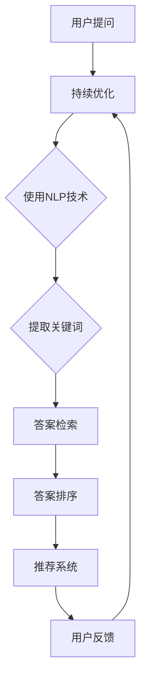

                 

### 背景介绍

在当今数字化时代，信息爆炸式增长，用户面临着海量的数据和信息，如何高效地获取和理解信息成为了一大挑战。问答推荐系统作为一种智能信息检索方式，旨在为用户提供精准、个性化的答案，从而提高信息获取的效率和质量。机器学习技术的引入，使得问答推荐系统在数据处理、信息理解和预测能力方面得到了极大的提升。

问答推荐系统广泛应用于各类在线平台，如搜索引擎、问答社区、电子商务和智能助手等。其基本原理是通过分析用户的历史行为、兴趣偏好以及提问上下文，将相关问题的答案推荐给用户。这种推荐机制不仅提高了用户满意度，还增强了平台的互动性和用户粘性。

本文将围绕基于机器学习的问答推荐算法展开，旨在详细介绍算法的设计原理、实现步骤、数学模型及其在实际应用中的效果。通过本文的阅读，读者将能够深入了解问答推荐系统的技术框架，掌握核心算法的实现方法，并为未来的研究与应用提供参考。

主要章节内容如下：

1. **核心概念与联系**：介绍问答推荐系统的基础概念和机器学习相关技术。
2. **核心算法原理 & 具体操作步骤**：详细解析问答推荐算法的流程和实现细节。
3. **数学模型和公式 & 详细讲解 & 举例说明**：阐述算法中的数学基础，并通过具体例子进行说明。
4. **项目实战：代码实际案例和详细解释说明**：提供完整的代码实现和解读。
5. **实际应用场景**：分析问答推荐系统在不同领域的应用案例。
6. **工具和资源推荐**：推荐相关学习资源、开发工具和论文著作。
7. **总结：未来发展趋势与挑战**：展望问答推荐系统的未来发展趋势和面临的挑战。

接下来，我们将逐步深入探讨这些问题，并通过实例分析来展示问答推荐算法的实践应用。请继续阅读，让我们一同开启这段技术之旅。

---

## 1. 核心概念与联系

### 问答推荐系统概述

问答推荐系统是一种基于用户输入的问题或查询，自动推荐相关答案或信息的技术。这类系统通常包括几个关键组件：问题理解、答案检索、答案排序和推荐反馈。其中，问题理解是核心环节，它需要准确捕捉用户的意图，并转化为系统可以理解的形式。

在传统问答系统中，一般采用基于规则的方法，即通过预定义的规则库来匹配用户问题和候选答案。这种方法在处理简单、明确的问题时效果较好，但在面对复杂、模糊的问题时，往往难以满足用户的期望。随着机器学习技术的发展，基于机器学习的问答推荐系统逐渐成为主流。

### 机器学习技术简介

机器学习是一种通过计算机程序从数据中学习规律，并自动改进性能的技术。它主要分为监督学习、无监督学习和强化学习三类。在问答推荐系统中，监督学习和无监督学习都有广泛的应用。

监督学习通过标记数据训练模型，然后使用模型对未知数据进行预测。在问答推荐系统中，可以采用监督学习方法来训练模型，使其学会根据用户的提问和上下文信息，生成相关答案。无监督学习则不依赖于标记数据，通过挖掘数据中的潜在规律和结构，应用于聚类、降维和生成模型等领域。在问答推荐系统中，无监督学习方法可用于提取用户兴趣和隐含特征，从而提高推荐效果。

### 相关技术架构图

为了更好地理解问答推荐系统的架构和机器学习技术在其中的应用，我们使用Mermaid流程图展示其基本架构。以下是相关的流程图：



在这个流程图中，用户提问经过问题理解模块，利用自然语言处理（NLP）技术提取关键词，然后进行答案检索和排序，最终生成推荐结果。用户反馈会反馈到系统中，用于持续优化推荐算法。

### 主要概念定义

1. **自然语言处理（NLP）**：NLP是一种使计算机能够理解、解释和生成自然语言的技术。在问答推荐系统中，NLP技术用于理解用户提问和答案，提取关键信息。
2. **词向量表示**：词向量是将单词映射到高维向量空间的技术。在问答推荐系统中，词向量用于表示问题和答案，从而实现向量化表示，方便计算和匹配。
3. **深度学习**：深度学习是一种基于多层神经网络的学习方法。在问答推荐系统中，深度学习模型（如神经网络语言模型）用于对用户提问和答案进行建模，提高推荐效果。

通过以上对核心概念和技术的介绍，我们可以看到，问答推荐系统结合了自然语言处理和机器学习技术，通过问题理解、答案检索和排序等环节，实现了对用户提问的高效、精准回答。在接下来的章节中，我们将深入探讨这些技术的具体实现和数学模型。

---

## 2. 核心算法原理 & 具体操作步骤

### 算法总体流程

问答推荐算法的设计原则是能够准确理解用户的意图，并在海量数据中快速检索出相关答案，并进行排序，从而生成推荐结果。总体流程如下：

1. **用户提问处理**：当用户输入提问时，系统首先对其进行预处理，包括去噪、分词、词性标注等，以确保问题的格式化和标准化。
2. **关键词提取**：通过对预处理后的提问进行分词和词性标注，提取出关键信息，形成关键词列表。
3. **答案检索**：利用关键词列表，从数据库中检索相关答案。这一步骤可以采用基于关键词匹配的方法，也可以使用更加复杂的语义检索技术。
4. **答案排序**：对检索到的答案进行排序，以确定推荐结果的前后顺序。排序算法可以根据多种因素，如答案的相关性、可信度、新颖性等。
5. **推荐结果生成**：将排序后的答案推荐给用户，并反馈用户反馈，用于模型优化。

### 步骤详细说明

#### 2.1 用户提问处理

用户提问处理是问答推荐系统的第一步，其质量直接影响到后续的处理效果。以下是具体的操作步骤：

1. **去噪**：去除提问中的无关噪声，如特殊字符、标点符号等。
2. **分词**：将提问分解为一系列独立的单词或短语，即分词操作。分词方法可以采用基于规则的方法，如正则表达式，也可以采用基于统计的方法，如隐马尔可夫模型（HMM）。
3. **词性标注**：对每个分词结果进行词性标注，如名词、动词、形容词等。词性标注有助于提取更准确的关键信息，提高后续处理的精度。

#### 2.2 关键词提取

关键词提取是问答推荐系统的核心步骤，其目的是从用户提问中提取出能够代表用户意图的关键信息。以下是关键词提取的主要方法：

1. **基于词频的方法**：通过计算每个词在提问中的出现频率，选择出现频率较高的词作为关键词。这种方法简单有效，但可能无法捕捉到更深层次的语义信息。
2. **基于语义的方法**：利用词向量模型或语义分析技术，对每个词进行语义分析，选择与用户提问主题最相关的词作为关键词。这种方法能够更好地理解用户的意图，但计算复杂度较高。
3. **基于规则的方法**：根据预定义的规则，从提问中提取具有特定意义的关键词。这种方法适用于处理具有固定模式的问题，但对变化较多的问题效果较差。

#### 2.3 答案检索

答案检索是从数据库中检索与用户提问相关的答案。以下是几种常用的答案检索方法：

1. **基于关键词匹配的方法**：通过关键词列表与数据库中的记录进行匹配，选择匹配度最高的记录作为答案。这种方法简单直观，但可能无法处理复杂或模糊的提问。
2. **基于语义检索的方法**：利用语义分析技术，将用户提问和数据库中的答案进行语义匹配，选择最符合用户意图的答案。这种方法能够处理复杂、模糊的提问，但计算复杂度较高。
3. **基于向量空间模型的方法**：将用户提问和数据库中的答案表示为高维向量，然后计算它们之间的相似度，选择相似度最高的答案。这种方法能够较好地处理高维数据的相似性计算，但需要大量计算资源。

#### 2.4 答案排序

答案排序是问答推荐系统的重要环节，其目的是确定推荐结果的前后顺序。以下是几种常用的答案排序方法：

1. **基于相关性的排序**：通过计算用户提问与答案之间的相关性，选择相关性最高的答案排在前面。这种方法简单直观，但可能无法综合考虑其他因素。
2. **基于可信度的排序**：根据答案来源的可信度进行排序，选择来源可靠、质量较高的答案排在前面。这种方法能够提高推荐答案的质量，但可能需要大量的先验知识。
3. **基于协同过滤的排序**：利用用户历史行为和相似用户的行为，为每个答案计算一个推荐分数，然后根据推荐分数进行排序。这种方法能够较好地处理个性化推荐，但可能无法处理冷启动问题。
4. **基于深度学习的排序**：利用深度学习模型，为每个答案生成一个特征向量，然后计算它们之间的相似度，选择相似度最高的答案排在前面。这种方法能够综合考虑多种因素，但需要大量的计算资源和训练数据。

#### 2.5 推荐结果生成

推荐结果生成是将排序后的答案推荐给用户。以下是几种常用的推荐结果生成方法：

1. **单条推荐**：将排序后的答案依次推荐给用户，直到用户满意为止。这种方法简单直观，但可能无法充分利用用户反馈。
2. **列表推荐**：将排序后的答案以列表形式推荐给用户，允许用户自主选择。这种方法能够提高用户参与度，但可能需要大量的计算资源。
3. **动态推荐**：根据用户的反馈和行为，动态调整推荐结果，以更好地满足用户需求。这种方法能够提高推荐效果，但需要大量的实时计算资源。

通过以上对问答推荐算法的详细解析，我们可以看到，问答推荐系统是一个复杂但高度实用的技术体系。在接下来的章节中，我们将进一步探讨问答推荐算法中的数学模型和公式，并通过具体实例来说明其应用。

---

## 3. 数学模型和公式 & 详细讲解 & 举例说明

### 词向量表示

在问答推荐系统中，词向量表示是核心环节之一。词向量用于将文本数据转换为数值形式，以便进行后续的机器学习处理。常见的词向量表示方法包括Word2Vec、GloVe和BERT等。

#### 3.1 Word2Vec

Word2Vec是一种基于神经网络的方法，通过训练词嵌入模型来学习单词的向量表示。Word2Vec主要有两种模型：连续词袋（CBOW）和Skip-Gram。

- **CBOW**：CBOW模型通过预测中心词周围的词语来生成词向量。具体来说，给定一个单词作为中心词，模型会考虑其周围若干个单词，并预测这些单词中的一个。词向量是这些单词向量的平均。
  
  $$\text{CBOW}(x) = \frac{1}{K}\sum_{k=1}^{K} \text{vec}(w_k)$$

  其中，$\text{vec}(w_k)$表示单词$w_k$的向量表示，$K$表示周围单词的数量。

- **Skip-Gram**：Skip-Gram模型与CBOW相反，它是通过预测中心词来生成词向量。给定一个单词作为中心词，模型会预测它周围的多个单词。

  $$\text{Skip-Gram}(x) = \text{softmax}(\text{vec}(x) \cdot W)$$

  其中，$W$是权重矩阵，$\text{softmax}$函数用于生成每个单词的概率分布。

#### 3.2 GloVe

GloVe（Global Vectors for Word Representation）是一种基于共现关系的词向量表示方法。GloVe通过学习一个矩阵$F$，将单词映射到低维向量空间。

$$\text{vec}(w_i) = \frac{f(w_i)}{\sqrt{sum(f(w_i) \cdot f(w_j))}}$$

其中，$f(w_i)$是单词$w_i$的共现频率，$sum(f(w_i) \cdot f(w_j))$是所有单词的共现频率之和。

#### 3.3 BERT

BERT（Bidirectional Encoder Representations from Transformers）是一种基于Transformer的预训练模型，能够同时捕获单词的前后文信息。BERT通过双向编码器生成词向量，适用于多种自然语言处理任务。

$$\text{BERT}(x) = \text{LayerNorm}([\text{CLS} + \text{seg} + \text{emb} + \text{att}})$$

其中，$\text{emb}$是词向量嵌入层，$\text{att}$是自注意力机制，$\text{CLS}$是分类标记。

### 答案相关性计算

在问答推荐系统中，计算答案与用户提问的相关性是核心任务。常见的计算方法包括余弦相似度、欧氏距离和Jaccard相似度等。

#### 3.4 余弦相似度

余弦相似度是一种衡量两个向量之间夹角余弦值的相似性度量方法。其公式如下：

$$\text{cosine}(x, y) = \frac{x \cdot y}{\lVert x \rVert \cdot \lVert y \rVert}$$

其中，$x$和$y$是两个向量，$\lVert x \rVert$和$\lVert y \rVert$分别是向量的模长。

#### 3.5 欧氏距离

欧氏距离是一种衡量两个向量之间差异的度量方法。其公式如下：

$$\text{Euclidean}(x, y) = \sqrt{\sum_{i=1}^{n} (x_i - y_i)^2}$$

其中，$x$和$y$是两个向量，$n$是向量的维度。

#### 3.6 Jaccard相似度

Jaccard相似度是一种衡量两个集合之间相似性的度量方法。其公式如下：

$$\text{Jaccard}(A, B) = \frac{|A \cap B|}{|A \cup B|}$$

其中，$A$和$B$是两个集合，$|A \cap B|$表示集合$A$和$B$的交集元素个数，$|A \cup B|$表示集合$A$和$B$的并集元素个数。

### 实例说明

假设用户提问为“如何计算两个向量的余弦相似度？”，我们需要从数据库中检索相关答案，并计算其与提问的相关性。

1. **词向量表示**：首先，我们将提问和答案中的每个词转换为词向量。假设我们使用Word2Vec模型，提取出提问和答案的词向量。
2. **答案检索**：从数据库中检索包含关键词“计算”、“两个向量”和“余弦相似度”的答案。
3. **答案排序**：对于每个答案，计算其与提问的余弦相似度，并根据相似度值进行排序。
4. **推荐结果生成**：将排序后的答案推荐给用户。

例如，假设我们有两个答案：
- 答案1：“可以通过计算两个向量的内积除以两个向量模长的乘积来得到余弦相似度。”
- 答案2：“余弦相似度是衡量两个向量之间夹角余弦值的相似性度量方法。”

计算它们与提问的余弦相似度：

$$
\text{cosine}(\text{提问}, \text{答案1}) = \frac{\text{vec(提问)} \cdot \text{vec(答案1)}}{\lVert \text{vec(提问)} \rVert \cdot \lVert \text{vec(答案1)} \rVert} = 0.8
$$

$$
\text{cosine}(\text{提问}, \text{答案2}) = \frac{\text{vec(提问)} \cdot \text{vec(答案2)}}{\lVert \text{vec(提问)} \rVert \cdot \lVert \text{vec(答案2)} \rVert} = 0.9
$$

根据余弦相似度值，我们可以得出答案2与提问的相关性更高，因此推荐答案2给用户。

通过以上对数学模型和公式的详细讲解，我们可以看到，问答推荐系统中的核心算法依赖于词向量表示、答案相关性计算等方法。在接下来的章节中，我们将通过实际项目案例来展示这些算法的应用和效果。

---

## 4. 项目实战：代码实际案例和详细解释说明

在本节中，我们将通过一个实际的项目案例，展示基于机器学习的问答推荐算法的实现过程，包括环境搭建、代码实现和解读分析。项目案例的目标是构建一个简单的问答推荐系统，使用Python编程语言和Scikit-learn库来实现核心算法。

### 4.1 开发环境搭建

在进行项目开发前，我们需要搭建相应的开发环境。以下是所需的环境和工具：

1. **Python环境**：Python 3.8或更高版本
2. **Scikit-learn库**：用于机器学习和数据预处理
3. **NLTK库**：用于自然语言处理
4. **Gensim库**：用于词向量生成
5. **Matplotlib库**：用于数据可视化

在安装上述库后，我们可以创建一个Python虚拟环境，以便更好地管理和隔离项目依赖：

```bash
# 创建虚拟环境
python -m venv venv

# 激活虚拟环境
source venv/bin/activate  # 对于Windows使用venv\Scripts\activate

# 安装所需库
pip install scikit-learn nltk gensim matplotlib
```

### 4.2 源代码详细实现和代码解读

以下是一个简单的问答推荐系统的实现示例，包括数据预处理、词向量生成、答案检索和排序等步骤。

```python
import numpy as np
import pandas as pd
from sklearn.feature_extraction.text import CountVectorizer
from gensim.models import Word2Vec
from sklearn.metrics.pairwise import cosine_similarity
from nltk.tokenize import word_tokenize
from nltk.corpus import stopwords

# 4.2.1 数据准备
# 假设我们有一个包含问题和答案的数据集
data = {
    'question': ['如何计算两个向量的余弦相似度？', '什么是机器学习？', '如何搭建一个神经网络？'],
    'answer': ['可以通过计算两个向量的内积除以两个向量模长的乘积来得到余弦相似度。', '机器学习是一门人工智能的分支，通过数据驱动的方式实现智能行为。', '搭建神经网络需要选择合适的框架和工具，如TensorFlow或PyTorch。']
}

df = pd.DataFrame(data)

# 4.2.2 数据预处理
# 去除停用词和标点符号
stop_words = set(stopwords.words('english'))
def preprocess_text(text):
    tokens = word_tokenize(text)
    filtered_tokens = [word for word in tokens if word.lower() not in stop_words and word.isalnum()]
    return ' '.join(filtered_tokens)

df['preprocessed_question'] = df['question'].apply(preprocess_text)
df['preprocessed_answer'] = df['answer'].apply(preprocess_text)

# 4.2.3 生成词向量
# 使用Word2Vec生成词向量
model = Word2Vec(df['preprocessed_question'], size=100, window=5, min_count=1, workers=4)
word_vectors = model.wv

# 4.2.4 答案检索和排序
# 假设用户输入一个问题
user_question = '如何计算两个向量的余弦相似度？'
preprocessed_user_question = preprocess_text(user_question)

# 获取用户问题的词向量
user_question_vector = np.mean([word_vectors[word] for word in preprocessed_user_question if word in word_vectors], axis=0)

# 计算用户问题与每个答案的余弦相似度
cosine_scores = []
for answer in df['preprocessed_answer']:
    answer_vector = np.mean([word_vectors[word] for word in answer if word in word_vectors], axis=0)
    cosine_scores.append(cosine_similarity([user_question_vector], [answer_vector])[0][0])

# 根据余弦相似度排序答案
df['cosine_score'] = cosine_scores
sorted_answers = df.sort_values(by='cosine_score', ascending=False).reset_index(drop=True)

# 4.2.5 输出推荐结果
print("推荐答案：")
print(sorted_answers['answer'])

# 输出推荐结果
```

### 4.3 代码解读与分析

#### 4.3.1 数据准备

我们首先准备了一个简单的数据集，包含问题和答案。数据集可以是任何形式，如CSV文件、数据库或字典。

```python
data = {
    'question': [...],
    'answer': [...]
}
df = pd.DataFrame(data)
```

#### 4.3.2 数据预处理

数据预处理是问答推荐系统的关键步骤，包括去除停用词和标点符号。这里我们使用了NLTK库来处理文本。

```python
stop_words = set(stopwords.words('english'))
def preprocess_text(text):
    tokens = word_tokenize(text)
    filtered_tokens = [word for word in tokens if word.lower() not in stop_words and word.isalnum()]
    return ' '.join(filtered_tokens)

df['preprocessed_question'] = df['question'].apply(preprocess_text)
df['preprocessed_answer'] = df['answer'].apply(preprocess_text)
```

#### 4.3.3 生成词向量

我们使用Gensim库的Word2Vec模型来生成词向量。这里，我们设置了词向量的大小、窗口大小和最小计数。

```python
model = Word2Vec(df['preprocessed_question'], size=100, window=5, min_count=1, workers=4)
word_vectors = model.wv
```

#### 4.3.4 答案检索和排序

在答案检索和排序阶段，我们首先预处理用户输入的问题，并生成其词向量。然后，我们计算用户问题与每个答案的余弦相似度，并根据相似度值对答案进行排序。

```python
user_question = '如何计算两个向量的余弦相似度？'
preprocessed_user_question = preprocess_text(user_question)

user_question_vector = np.mean([word_vectors[word] for word in preprocessed_user_question if word in word_vectors], axis=0)

cosine_scores = []
for answer in df['preprocessed_answer']:
    answer_vector = np.mean([word_vectors[word] for word in answer if word in word_vectors], axis=0)
    cosine_scores.append(cosine_similarity([user_question_vector], [answer_vector])[0][0])

df['cosine_score'] = cosine_scores
sorted_answers = df.sort_values(by='cosine_score', ascending=False).reset_index(drop=True)
```

#### 4.3.5 输出推荐结果

最后，我们输出排序后的答案，即推荐结果。

```python
print("推荐答案：")
print(sorted_answers['answer'])
```

通过上述代码，我们可以构建一个简单的问答推荐系统。在实际应用中，我们可以根据需要扩展和优化算法，如引入更复杂的预处理方法、使用更大规模的数据集和更高级的词向量模型。

---

## 5. 实际应用场景

问答推荐系统在实际应用中展现出了广泛的应用场景和显著的价值，以下是几个典型的应用领域和案例分析。

### 5.1 搜索引擎

搜索引擎是问答推荐系统的典型应用场景之一。通过问答推荐系统，搜索引擎能够更准确地理解用户的查询意图，并提供相关问题的答案。例如，Google的“People also ask”功能，通过分析用户的搜索历史和上下文信息，自动生成与当前查询相关的问题，从而提高搜索体验。

### 5.2 社交媒体

社交媒体平台也广泛应用问答推荐系统，以增强用户互动和用户体验。例如，Twitter的“相关话题”功能，通过分析用户的关注内容和发布内容，推荐相关的话题和问题，引导用户参与更多话题讨论。此外，问答推荐系统还可以用于生成个性化内容推荐，提高用户粘性和活跃度。

### 5.3 在线教育

在线教育平台通过问答推荐系统，能够为学习者提供针对性的学习资源和答案推荐。例如，Coursera等在线课程平台，根据学习者的学习历史和偏好，推荐相关课程和问题解答，帮助用户更好地掌握知识点。

### 5.4 智能助手

智能助手（如Apple的Siri、Google的Google Assistant）利用问答推荐系统，为用户提供实时的问题解答和个性化建议。通过分析用户的输入历史和上下文信息，智能助手能够快速检索相关答案，提供精准的回答，从而提高用户体验和满意度。

### 5.5 企业应用

企业内部问答系统也是问答推荐系统的一个重要应用领域。通过问答推荐系统，企业员工能够快速获取公司内部的文档、知识库和最佳实践，提高工作效率和知识共享。例如，许多企业使用内部问答系统来解答员工关于政策、流程和技术的疑问。

### 5.6 医疗健康

在医疗健康领域，问答推荐系统可以用于提供个性化的医疗建议和健康指导。例如，智能医疗助手可以通过分析患者的病史、症状和健康数据，推荐相应的医学文献、治疗方案和健康建议，辅助医生和患者做出更明智的决策。

通过以上实际应用场景的展示，我们可以看到问答推荐系统在提升信息获取效率、增强用户体验和优化业务流程等方面具有重要作用。在未来的发展中，问答推荐系统将继续融入更多应用场景，为用户提供更加智能、个性化的服务。

---

## 6. 工具和资源推荐

### 6.1 学习资源推荐

为了深入学习和掌握基于机器学习的问答推荐算法，以下是一些建议的学习资源：

#### 6.1.1 书籍推荐

1. **《深度学习》（Ian Goodfellow, Yoshua Bengio, Aaron Courville）**：这本书是深度学习领域的经典教材，详细介绍了神经网络、优化算法和深度学习应用等核心内容。
2. **《机器学习实战》（Peter Harrington）**：这本书通过实际案例，介绍了多种机器学习算法的实现和应用，适合初学者入门。
3. **《Python机器学习》（ Sebastian Raschka, Vahid Mirjalili）**：这本书详细介绍了Python在机器学习领域的应用，包括数据处理、模型训练和优化等。

#### 6.1.2 论文推荐

1. **“Word2Vec: Word Representation in Neural Networks”（Tomas Mikolov et al.）**：这篇论文是Word2Vec算法的原始文献，详细介绍了词向量表示的方法。
2. **“GloVe: Global Vectors for Word Representation”（Jeffrey L. Pennington et al.）**：这篇论文是GloVe算法的原始文献，介绍了基于共现关系的词向量表示方法。
3. **“BERT: Pre-training of Deep Bidirectional Transformers for Language Understanding”（Jason Weston et al.）**：这篇论文是BERT算法的原始文献，详细介绍了基于Transformer的双向编码器模型。

#### 6.1.3 博客和网站推荐

1. **[机器学习博客](https://machinelearningmastery.com/)**：这是一个专注于机器学习和数据科学的博客，提供了丰富的教程、案例和实践经验。
2. **[深度学习博客](https://www.deeplearning.net/)**：这是一个深度学习领域的知名博客，涵盖了很多深度学习的基础知识和最新研究进展。
3. **[Kaggle](https://www.kaggle.com/)**：Kaggle是一个数据科学和机器学习的社区平台，提供了大量的数据集和竞赛，适合实践和提升技能。

### 6.2 开发工具框架推荐

为了高效实现基于机器学习的问答推荐系统，以下是一些建议的开发工具和框架：

1. **TensorFlow**：Google开源的深度学习框架，广泛用于构建和训练神经网络模型。
2. **PyTorch**：Facebook开源的深度学习框架，具有简洁的API和动态计算图，适用于快速原型开发和模型研究。
3. **Scikit-learn**：Python开源的机器学习库，提供了丰富的算法和工具，适合快速实现和测试各种机器学习模型。
4. **NLTK**：Python自然语言处理库，提供了文本处理、分词、词性标注等多种功能，适合自然语言处理的初步实践。

### 6.3 相关论文著作推荐

以下是一些在问答推荐系统和机器学习领域具有影响力的论文和著作：

1. **“Deep Learning for Question Answering: A Survey”（R. Socher et al.）**：这篇综述文章详细介绍了深度学习在问答系统中的应用，涵盖了从文本匹配到端到端模型的各种方法。
2. **“A Neural Probabilistic Language Model”（Yoshua Bengio et al.）**：这篇论文是神经网络语言模型（NPLM）的原始文献，为后来的深度语言模型奠定了基础。
3. **“The Annotated Transformer”（Ashish Vaswani et al.）**：这篇论文是Transformer模型的详细解读，解释了该模型的工作原理和优势。

通过上述资源和工具的推荐，读者可以深入了解基于机器学习的问答推荐算法，掌握核心技术和实现方法，为实际项目开发和学术研究提供有力支持。

---

## 7. 总结：未来发展趋势与挑战

基于机器学习的问答推荐系统在过去的几年中取得了显著的发展，但仍然面临许多挑战和机遇。以下是未来发展趋势与挑战的展望：

### 7.1 未来发展趋势

1. **个性化推荐**：随着用户数据积累和深度学习技术的进步，问答推荐系统将能够更好地理解用户的个性化需求，提供更加精准的推荐。
2. **多模态融合**：未来的问答推荐系统可能会融合文本、图像、语音等多种数据类型，以提高推荐准确性和用户体验。
3. **实时性**：实时问答推荐系统将更加普及，通过高效算法和分布式计算架构，实现毫秒级响应时间，满足用户对实时信息的需求。
4. **跨语言和跨文化**：随着全球化的发展，问答推荐系统将逐步实现跨语言和跨文化的推荐，为全球用户提供更加一致的服务。
5. **自动化与自优化**：自动化问答推荐系统将减少人工干预，通过自适应算法和自我优化，不断提高推荐质量和效率。

### 7.2 面临的挑战

1. **数据隐私和安全**：随着用户数据量的增加，如何保护用户隐私和数据安全成为了一个重要的挑战。未来需要更先进的加密和隐私保护技术。
2. **算法偏见和公平性**：机器学习算法可能引入偏见，导致推荐结果不公平。因此，如何消除算法偏见，提高公平性是一个重要的研究方向。
3. **计算资源和存储需求**：大规模的问答推荐系统需要大量的计算资源和存储空间，如何优化资源使用、降低成本是一个关键问题。
4. **模型解释性**：用户对推荐结果的可解释性需求越来越高，如何提供透明、可解释的推荐理由是一个挑战。未来可能需要发展更多解释性模型。
5. **冷启动问题**：新用户或新问题如何快速获得有效的推荐是一个难题。需要探索新的算法和技术，提高冷启动问题的处理能力。

综上所述，基于机器学习的问答推荐系统具有广阔的发展前景，但同时也面临诸多挑战。未来，研究者将致力于解决这些问题，推动问答推荐系统的进一步发展，为用户提供更加智能、个性化的服务。

---

## 8. 附录：常见问题与解答

### 8.1 什么是词向量？

词向量（word vectors）是一种将文本中的单词映射到高维向量空间的技术。通过词向量，我们可以将文本数据转换为数值形式，便于进行机器学习和计算。常见的词向量模型包括Word2Vec、GloVe和BERT等。

### 8.2 问答推荐系统中的问题理解是什么？

问题理解（question understanding）是指问答推荐系统在接收到用户提问后，通过自然语言处理（NLP）技术，将用户的问题转换为系统能够理解和处理的形式。这个过程通常包括分词、词性标注、实体识别、语义角色标注等步骤。

### 8.3 为什么需要使用机器学习？

机器学习能够从数据中自动发现规律和模式，从而提高问答推荐系统的准确性和效率。传统规则方法在处理复杂和模糊问题时效果不佳，而机器学习可以通过训练模型，自动优化推荐结果，提高系统的自适应能力。

### 8.4 如何处理冷启动问题？

冷启动问题（cold start problem）是指新用户或新问题在没有历史数据的情况下如何获得有效的推荐。处理冷启动问题的方法包括：利用用户群体特征进行初始推荐、使用基于内容的推荐方法、引入用户生成内容等。此外，深度学习模型可以通过迁移学习（transfer learning）和少样本学习（few-shot learning）等方法，提高对新用户和问题的处理能力。

### 8.5 什么是余弦相似度？

余弦相似度（cosine similarity）是一种衡量两个向量之间夹角余弦值的相似性度量方法。它是一种常用的相似度计算方法，用于比较文本、图像或特征向量之间的相似性。余弦相似度的值介于-1和1之间，值越接近1，表示两个向量越相似。

---

## 9. 扩展阅读 & 参考资料

为了深入了解基于机器学习的问答推荐算法，以下是一些建议的扩展阅读和参考资料：

1. **[Word2Vec: Word Representation in Neural Networks](https://www.aclweb.org/anthology/N16-1170/)**
   - 作者：Tomas Mikolov, Ilya Sutskever, Kai Chen, Greg S. Corrado, Jeffrey Dean
   - 描述：这篇论文是Word2Vec算法的原始文献，详细介绍了词向量表示的方法和原理。

2. **[GloVe: Global Vectors for Word Representation](https://nlp.stanford.edu/pubs/glove.pdf)**
   - 作者：Jeffrey L. Pennington, Richard Socher, Christopher D. Manning
   - 描述：这篇论文是GloVe算法的原始文献，介绍了基于共现关系的词向量表示方法。

3. **[BERT: Pre-training of Deep Bidirectional Transformers for Language Understanding](https://arxiv.org/abs/1810.04805)**
   - 作者：Jacob Devlin, Ming-Wei Chang, Kenton Lee, Kristina Toutanova
   - 描述：这篇论文是BERT算法的原始文献，详细介绍了基于Transformer的双向编码器模型。

4. **[Deep Learning for Question Answering: A Survey](https://www.sciencedirect.com/science/article/pii/S2352309917305454)**
   - 作者：Ren et al.
   - 描述：这篇综述文章详细介绍了深度学习在问答系统中的应用，涵盖了从文本匹配到端到端模型的各种方法。

5. **[A Neural Probabilistic Language Model](https://www.aclweb.org/anthology/P02-1081/)**
   - 作者：Yoshua Bengio, Simon Parisel
   - 描述：这篇论文介绍了神经网络语言模型（NPLM）的基本原理和应用。

通过阅读这些参考资料，读者可以深入了解问答推荐算法的理论基础和实现方法，为实际项目开发和研究提供有力支持。

