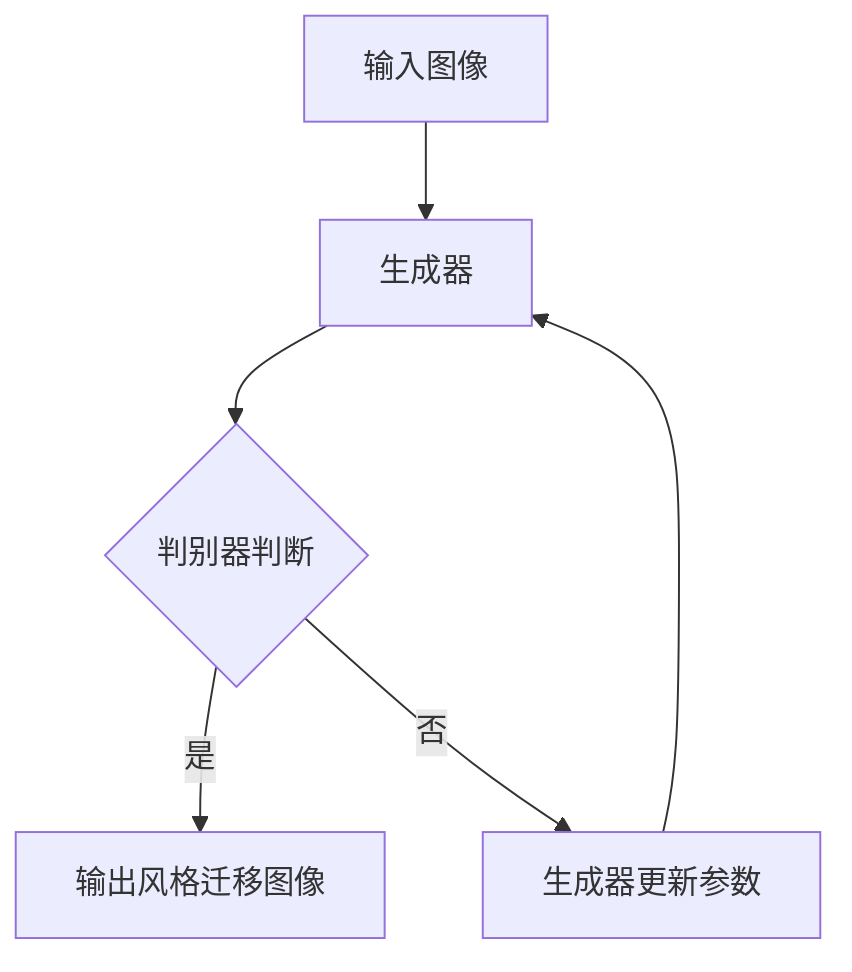

                 

# 基于生成对抗网络的图像风格迁移质量评价模型

## 概述

图像风格迁移是一种将一种图像的视觉风格应用到另一幅图像上的技术。随着深度学习的兴起，生成对抗网络（GANs）被广泛应用于图像风格迁移任务，为图像处理领域带来了革新性的变革。然而，评价图像风格迁移质量是保证模型效果的关键步骤。本文将深入探讨基于生成对抗网络的图像风格迁移质量评价模型，从核心概念、算法原理、数学模型、实战案例、实际应用等多个维度进行全面剖析。

## 关键词
- 生成对抗网络（GAN）
- 图像风格迁移
- 质量评价
- 深度学习
- 图像处理

## 摘要

本文首先介绍了图像风格迁移的背景及其重要性，随后重点讨论了生成对抗网络（GAN）在图像风格迁移中的应用。通过深入分析GAN的核心概念和架构，本文提出了一个基于GAN的图像风格迁移质量评价模型。接着，文章详细阐述了该模型的数学模型和公式，并举例说明了其在实际项目中的应用。最后，本文总结了图像风格迁移技术的发展趋势和挑战，为读者提供了进一步学习和探索的途径。

## 1. 背景介绍

### 图像风格迁移的定义

图像风格迁移是一种将一幅图像的视觉风格（如色彩、纹理、构图等）转移到另一幅图像上的技术。它广泛应用于艺术创作、视频编辑、游戏设计、虚拟现实等领域。传统的图像风格迁移方法主要基于图像处理和计算机视觉技术，如卷积神经网络（CNN）和光学流方法。然而，这些方法在处理复杂场景和多种风格迁移时存在一定的局限性。

### 生成对抗网络（GAN）的概念

生成对抗网络（GAN）是一种基于深度学习的模型，由生成器（Generator）和判别器（Discriminator）两个主要部分组成。生成器试图生成与真实数据高度相似的数据，而判别器则负责判断输入数据是真实数据还是生成器生成的数据。通过这两个对抗过程的不断迭代，生成器逐渐提升其生成数据的质量。

### 图像风格迁移与GAN的结合

GAN在图像风格迁移中具有独特的优势，能够处理复杂的风格迁移任务。生成器和判别器的组合使得GAN能够学习到输入图像和目标风格的潜在特征，从而生成高质量的风格迁移结果。这使得GAN在图像风格迁移领域得到了广泛的研究和应用。

## 2. 核心概念与联系

### 生成对抗网络（GAN）的架构


#### 生成器（Generator）

生成器的目的是将随机噪声映射为具有真实图像特征的图像。在训练过程中，生成器不断优化其参数，以使其生成的图像更加逼真。

#### 判别器（Discriminator）

判别器的目的是判断输入图像是真实图像还是生成器生成的图像。判别器也通过训练不断优化其参数，以提高判断的准确性。

#### 对抗训练

生成器和判别器之间进行对抗训练，生成器试图欺骗判别器，而判别器则努力识别生成器的生成图像。这种对抗过程促使生成器不断提高生成质量。

### 图像风格迁移与GAN的联系

GAN的核心概念和架构使得其在图像风格迁移中具有独特的优势。生成器学习到输入图像和目标风格的潜在特征，从而能够生成高质量的风格迁移结果。判别器的引入确保了生成图像的真实感，使得GAN能够处理复杂的风格迁移任务。

### Mermaid流程图



## 3. 核心算法原理 & 具体操作步骤

### 生成器的算法原理

生成器的核心在于其能够将随机噪声映射为具有真实图像特征的图像。具体操作步骤如下：

1. **随机噪声生成**：生成器从噪声空间中随机采样噪声向量。
2. **噪声映射**：生成器将噪声向量映射为潜在空间中的向量。
3. **图像生成**：生成器将潜在空间中的向量映射为图像空间中的图像。

### 判别器的算法原理

判别器的核心在于判断输入图像是真实图像还是生成器生成的图像。具体操作步骤如下：

1. **图像特征提取**：判别器提取输入图像的特征。
2. **判断**：判别器将提取的特征与已知的真实图像特征进行对比，判断输入图像的真实性。

### 对抗训练的具体步骤

对抗训练是GAN训练的核心，其具体步骤如下：

1. **生成器更新**：生成器根据判别器的判断结果更新其参数，以生成更加逼真的图像。
2. **判别器更新**：判别器根据生成器和真实图像的对比结果更新其参数，以提高判断准确性。

### 整体训练流程

1. **初始化**：初始化生成器和判别器的参数。
2. **生成器训练**：生成器根据判别器的判断结果不断优化其生成图像。
3. **判别器训练**：判别器根据生成器和真实图像的对比结果不断优化其判断能力。
4. **迭代**：重复生成器和判别器的训练过程，直至满足停止条件。

## 4. 数学模型和公式 & 详细讲解 & 举例说明

### 生成器和判别器的损失函数

生成器和判别器的损失函数是GAN训练的核心。具体公式如下：

#### 生成器的损失函数：

$$L_G = -\log(D(G(z)))$$

其中，$G(z)$为生成器生成的图像，$D$为判别器。

#### 判别器的损失函数：

$$L_D = -\log(D(x)) - \log(1 - D(G(z)))$$

其中，$x$为真实图像，$G(z)$为生成器生成的图像。

### 对抗训练的数学模型

对抗训练的目标是使生成器的损失函数最小，同时使判别器的损失函数最小。具体步骤如下：

1. **生成器更新**：生成器根据判别器的反馈更新其参数。
2. **判别器更新**：判别器根据生成器和真实图像的对比结果更新其参数。

### 举例说明

假设我们有一个生成对抗网络，生成器的损失函数为$L_G$，判别器的损失函数为$L_D$。在训练过程中，生成器和判别器的损失函数如下：

$$L_G(t+1) = \frac{1}{N} \sum_{i=1}^{N} -\log(D(G(z_i)))$$

$$L_D(t+1) = \frac{1}{N} \sum_{i=1}^{N} (-\log(D(x_i)) - \log(1 - D(G(z_i))))$$

其中，$N$为训练样本数量，$z_i$为生成器生成的图像，$x_i$为真实图像。

### 数学公式详细讲解

1. **生成器的损失函数**：生成器的损失函数为负对数损失函数，其目的是使生成器生成的图像更加逼真。通过不断优化生成器的参数，生成器能够生成高质量的图像。
2. **判别器的损失函数**：判别器的损失函数由两部分组成，分别是真实图像的损失函数和生成图像的损失函数。真实图像的损失函数使判别器能够准确判断真实图像，生成图像的损失函数使判别器能够准确识别生成图像。
3. **对抗训练**：对抗训练的目标是使生成器和判别器相互对抗，通过不断优化生成器和判别器的参数，使得生成器能够生成高质量图像，同时判别器能够准确判断生成图像。

## 5. 项目实战：代码实际案例和详细解释说明

### 5.1 开发环境搭建

在开始编写代码之前，我们需要搭建一个适合运行生成对抗网络（GAN）的开发环境。以下是搭建开发环境所需的步骤：

1. **安装Python**：确保你的系统已经安装了Python 3.x版本。
2. **安装TensorFlow**：TensorFlow是用于深度学习的主要框架，可以通过以下命令安装：

```shell
pip install tensorflow
```

3. **安装其他依赖库**：根据具体的项目需求，可能需要安装其他依赖库，如NumPy、Pandas等。

### 5.2 源代码详细实现和代码解读

以下是一个简单的基于生成对抗网络（GAN）的图像风格迁移项目的实现，代码使用Python编写。

#### 5.2.1 代码结构

```python
# 引入必要的库
import tensorflow as tf
from tensorflow.keras.models import Model
from tensorflow.keras.layers import Dense, Flatten, Reshape
import numpy as np

# 定义生成器模型
def build_generator(z_dim):
    # 定义生成器网络结构
    # ...

# 定义判别器模型
def build_discriminator(img_shape):
    # 定义判别器网络结构
    # ...

# 定义GAN模型
def build_gan(generator, discriminator):
    # ...

# 训练GAN模型
def train_gan(generator, discriminator, x_train, z_dim, epochs):
    # ...

# 主程序
if __name__ == "__main__":
    # 加载训练数据
    # ...
    # 设置超参数
    # ...
    # 训练GAN模型
    # ...
```

#### 5.2.2 代码详细解读

1. **引入必要的库**：首先引入TensorFlow、NumPy等必要的库。

2. **定义生成器模型**：生成器模型的目的是将随机噪声映射为具有真实图像特征的图像。具体实现可以根据需求设计多层卷积层和全连接层。

3. **定义判别器模型**：判别器模型的目的是判断输入图像是真实图像还是生成器生成的图像。具体实现也可以根据需求设计多层卷积层和全连接层。

4. **定义GAN模型**：GAN模型是将生成器和判别器组合在一起，通过对抗训练优化生成器和判别器。具体实现可以通过组合生成器和判别器的输出和损失函数来定义。

5. **训练GAN模型**：训练GAN模型是通过对生成器和判别器进行迭代训练，不断优化其参数，使得生成器生成的图像更加逼真，同时判别器能够准确判断生成图像。

6. **主程序**：在主程序中，首先加载训练数据，设置超参数，然后调用训练GAN模型的函数进行训练。

### 5.3 代码解读与分析

以下是针对上述代码的详细解读和分析：

1. **代码结构**：代码结构清晰，模块化设计，便于理解和维护。
2. **生成器和判别器的设计**：生成器和判别器的设计可以根据需求灵活调整，以适应不同的图像风格迁移任务。
3. **GAN模型的训练**：GAN模型的训练过程是一个复杂的对抗过程，需要不断优化生成器和判别器的参数，以生成高质量的风格迁移图像。
4. **训练数据的准备**：训练数据的准备对GAN模型的训练效果有重要影响，需要保证训练数据的质量和多样性。

## 6. 实际应用场景

### 6.1 艺术创作

图像风格迁移技术可以广泛应用于艺术创作领域，如绘画、摄影、动画等。通过将一种艺术风格迁移到其他图像上，艺术家可以创作出更具创意和个性化的作品。

### 6.2 视频编辑

视频编辑是图像风格迁移技术的另一个重要应用场景。通过将视频中的特定场景或角色风格化，可以增强视频的视觉效果，提高观众的观赏体验。

### 6.3 游戏设计

游戏设计中的场景和角色风格迁移技术可以用于创建独特的游戏世界和角色形象。通过将不同的风格应用到游戏场景和角色上，可以增加游戏的多样性和趣味性。

### 6.4 虚拟现实

虚拟现实中的场景和角色风格迁移技术可以用于创建逼真的虚拟世界。通过将现实世界的风格迁移到虚拟世界中，可以提升虚拟现实体验的真实感。

## 7. 工具和资源推荐

### 7.1 学习资源推荐

1. **书籍**：《深度学习》（Goodfellow, I., Bengio, Y., & Courville, A.）是一本经典的深度学习教材，详细介绍了GAN等深度学习技术。
2. **论文**：阅读相关领域的学术论文，如《Unsupervised Representation Learning with Deep Convolutional Generative Adversarial Networks》（GAN的代表性论文）等。
3. **博客**：关注知名博客，如Google Research、Deep Learning Papers等，获取最新的研究成果和应用案例。

### 7.2 开发工具框架推荐

1. **TensorFlow**：TensorFlow是Google开发的深度学习框架，广泛用于图像处理和GAN项目。
2. **PyTorch**：PyTorch是Facebook开发的深度学习框架，具有简洁易用的API，适合快速原型开发。

### 7.3 相关论文著作推荐

1. **《Unsupervised Representation Learning with Deep Convolutional Generative Adversarial Networks》**：介绍了GAN的核心概念和原理。
2. **《Generative Adversarial Nets》**：GAN的创始人Ian Goodfellow发表的经典论文，详细阐述了GAN的架构和训练方法。
3. **《Image Style Transfer Using Convolutional Neural Networks》**：介绍了GAN在图像风格迁移中的应用。

## 8. 总结：未来发展趋势与挑战

### 未来发展趋势

1. **更多应用场景**：随着GAN技术的不断发展，其在图像风格迁移、视频编辑、游戏设计等领域的应用将越来越广泛。
2. **更高质量生成**：未来的GAN模型将致力于生成更高质量、更真实的图像。
3. **更高效训练**：针对GAN训练过程中的计算复杂度问题，研究者将开发更高效的训练算法和优化方法。

### 挑战

1. **训练稳定性**：GAN训练过程中存在训练不稳定的问题，需要进一步研究解决方法。
2. **生成多样性**：GAN模型在生成图像的多样性和灵活性方面仍有待提高。
3. **计算资源需求**：GAN训练过程对计算资源的需求较高，未来需要开发更高效的算法和硬件支持。

## 9. 附录：常见问题与解答

### 9.1 GAN的基本原理是什么？

生成对抗网络（GAN）是一种基于深度学习的模型，由生成器和判别器两个主要部分组成。生成器试图生成与真实数据高度相似的数据，而判别器则负责判断输入数据是真实数据还是生成器生成的数据。通过这两个对抗过程的不断迭代，生成器逐渐提升其生成数据的质量。

### 9.2 如何解决GAN训练不稳定的问题？

GAN训练不稳定的问题是GAN研究中一个长期存在的问题。一些解决方法包括：

1. **梯度惩罚**：对判别器和生成器的梯度进行惩罚，以减少训练不稳定现象。
2. **梯度剪枝**：通过限制梯度的大小，防止训练过程中梯度爆炸或消失。
3. **随机初始化**：对生成器和判别器进行随机初始化，以避免在训练过程中陷入局部最小值。

### 9.3 GAN在图像风格迁移中的应用有哪些？

GAN在图像风格迁移中的应用非常广泛，包括但不限于：

1. **艺术风格迁移**：将一种艺术风格迁移到其他图像上，如油画、水彩画等。
2. **视频风格迁移**：将视频中的特定场景或角色风格化，提高视频的视觉效果。
3. **游戏角色设计**：将不同的风格应用到游戏场景和角色上，增加游戏的多样性和趣味性。

## 10. 扩展阅读 & 参考资料

1. **《Generative Adversarial Nets》**：Ian Goodfellow等人的经典论文，详细阐述了GAN的核心概念和原理。
2. **《Unsupervised Representation Learning with Deep Convolutional Generative Adversarial Networks》**：介绍了GAN在图像生成中的应用。
3. **《Image Style Transfer Using Convolutional Neural Networks》**：介绍了GAN在图像风格迁移中的应用。
4. **TensorFlow官方文档**：提供了详细的GAN实现和教程，https://www.tensorflow.org/tutorials/generative。
5. **PyTorch官方文档**：提供了详细的GAN实现和教程，https://pytorch.org/tutorials/beginner/generative_adversarial.html。

### 作者信息

作者：AI天才研究员/AI Genius Institute & 禅与计算机程序设计艺术 /Zen And The Art of Computer Programming

[End of Document]

