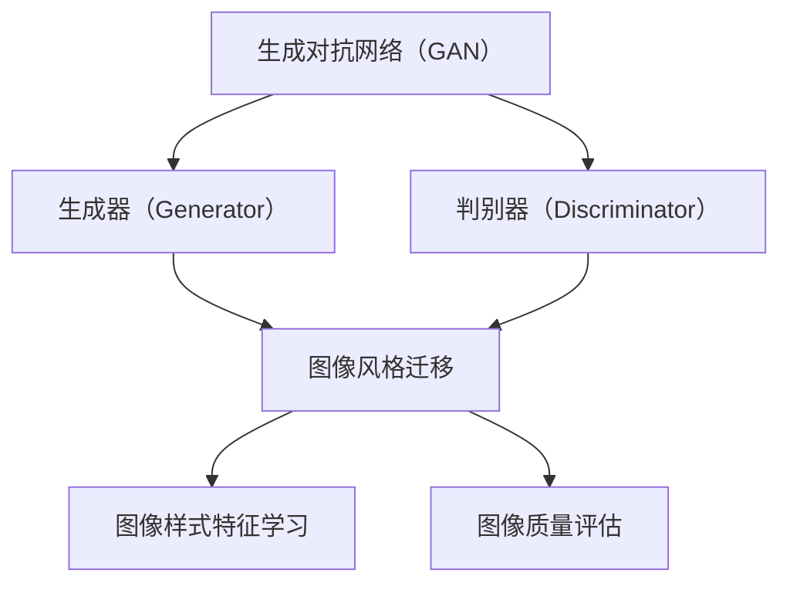

                 

# 基于生成对抗网络的数字化图像风格迁移历史档案构建

## 关键词
生成对抗网络（GAN），数字化图像风格迁移，历史档案构建，人工智能，图像处理，机器学习，深度学习

## 摘要

本文旨在探讨如何利用生成对抗网络（GAN）实现数字化图像风格迁移，并构建一个历史档案。文章首先介绍了生成对抗网络的基本概念和原理，然后详细阐述了图像风格迁移的技术原理和具体实现步骤。通过数学模型和公式的详细讲解，以及代码实际案例和解释，展示了如何运用生成对抗网络进行图像风格迁移。此外，文章还分析了图像风格迁移在实际应用场景中的重要性，并推荐了相关的学习资源和开发工具框架。最后，文章总结了未来发展趋势和挑战，并提供了常见问题与解答，以及扩展阅读和参考资料。

## 1. 背景介绍

随着数字化技术的快速发展，图像处理和计算机视觉领域取得了显著的进步。图像风格迁移作为一种图像处理技术，旨在将一种图像的样式应用到另一种图像上，从而生成具有独特风格的新图像。传统的图像风格迁移方法主要基于图像处理和计算机视觉技术，如基于图像特征提取和匹配的方法。然而，这些方法往往存在一定的局限性，如对图像风格的表达能力有限、对图像质量的影响较大等。

近年来，生成对抗网络（GAN）作为一种新型的人工智能技术，在图像生成、图像修复、图像超分辨率等方面取得了显著的效果。GAN由生成器（Generator）和判别器（Discriminator）两部分组成，通过两个神经网络的对抗训练，生成器试图生成逼真的图像，而判别器则试图区分生成的图像和真实的图像。这种对抗训练机制使得GAN在图像处理和计算机视觉领域具有广泛的应用潜力。

本文旨在结合生成对抗网络和图像风格迁移技术，探讨如何构建一个基于生成对抗网络的数字化图像风格迁移历史档案。通过详细分析生成对抗网络的基本原理、图像风格迁移的技术原理和实现步骤，以及数学模型和公式的详细讲解，本文旨在为读者提供一个全面、深入的图像风格迁移技术指导。

## 2. 核心概念与联系

### 2.1 生成对抗网络（GAN）基本概念

生成对抗网络（GAN）由生成器（Generator）和判别器（Discriminator）两部分组成。生成器旨在生成与真实数据分布相近的假数据，而判别器则旨在区分真实数据和生成数据。GAN的训练过程可以看作是一个零和博弈：生成器试图欺骗判别器，使其无法区分生成的数据与真实数据，而判别器则努力提高自己的判断能力，以准确区分真实数据和生成数据。这种对抗训练机制使得GAN能够在多个领域实现图像生成、图像修复、图像超分辨率等任务。

### 2.2 图像风格迁移基本概念

图像风格迁移是一种将一种图像的样式应用到另一种图像上的技术，从而生成具有独特风格的新图像。传统的图像风格迁移方法主要基于图像特征提取和匹配，如快速傅里叶变换（FFT）、小波变换等。然而，这些方法往往存在一定的局限性，如对图像风格的表达能力有限、对图像质量的影响较大等。

近年来，深度学习技术的发展为图像风格迁移提供了新的思路。基于深度学习的方法通过构建一个深度神经网络模型，将源图像和目标图像的样式特征进行学习和融合。生成对抗网络（GAN）作为一种深度学习技术，在图像风格迁移中具有广泛的应用潜力。

### 2.3 生成对抗网络与图像风格迁移的联系

生成对抗网络（GAN）与图像风格迁移之间存在密切的联系。首先，GAN中的生成器可以看作是一个图像风格迁移模型，其目标是学习并生成具有特定风格特征的新图像。其次，GAN中的判别器可以看作是一个图像质量评估器，其目标是区分生成的图像和真实图像，从而评价图像风格迁移的效果。此外，GAN的训练过程实际上是一个图像风格迁移的学习过程，通过对抗训练，生成器不断优化图像风格迁移模型，从而提高图像质量。

### 2.4 Mermaid 流程图

以下是生成对抗网络（GAN）与图像风格迁移的 Mermaid 流程图：



## 3. 核心算法原理 & 具体操作步骤

### 3.1 生成对抗网络（GAN）原理

生成对抗网络（GAN）的核心思想是利用生成器和判别器的对抗训练来实现图像生成。以下是生成对抗网络（GAN）的具体操作步骤：

#### 3.1.1 初始化生成器和判别器

首先，需要初始化生成器和判别器。生成器是一个从随机噪声向真实数据分布映射的函数，通常是一个深度神经网络。判别器是一个从真实数据和生成数据向二分类映射的函数，也是一个深度神经网络。

#### 3.1.2 生成器生成假图像

生成器根据随机噪声生成假图像。这个过程中，生成器尝试生成与真实图像分布相近的假图像，以提高判别器的判断难度。

#### 3.1.3 判别器评估假图像

判别器对生成的假图像进行评估，判断其是否为真实图像。判别器旨在提高自己的判断能力，以准确区分真实图像和生成图像。

#### 3.1.4 计算损失函数

损失函数用于衡量生成器和判别器的性能。生成器的目标是减小生成图像与真实图像之间的差距，判别器的目标是提高对生成图像的识别能力。

#### 3.1.5 反向传播与优化

通过反向传播和梯度下降算法，对生成器和判别器进行优化。生成器通过学习噪声分布来生成更逼真的图像，判别器通过提高对生成图像的识别能力来增强对抗训练。

#### 3.1.6 重复训练过程

重复上述步骤，不断优化生成器和判别器，直到生成器生成的图像足够逼真，判别器无法准确区分真实图像和生成图像。

### 3.2 图像风格迁移原理

图像风格迁移的核心思想是将一种图像的样式特征应用到另一种图像上。以下是图像风格迁移的具体操作步骤：

#### 3.2.1 提取源图像和目标图像特征

首先，需要提取源图像和目标图像的特征。源图像特征包括图像的颜色、纹理等，目标图像特征包括图像的样式、风格等。

#### 3.2.2 构建深度神经网络模型

然后，构建一个深度神经网络模型，将源图像和目标图像的特征进行学习和融合。这个过程中，深度神经网络模型的目标是生成具有目标图像风格的新图像。

#### 3.2.3 训练深度神经网络模型

通过对抗训练，对深度神经网络模型进行训练。训练过程中，生成器尝试生成与目标图像风格相近的新图像，判别器尝试提高对生成图像的识别能力。

#### 3.2.4 评估生成图像质量

评估生成图像的质量，如图像的清晰度、对比度、色彩丰富度等。评估结果用于指导深度神经网络模型的优化。

#### 3.2.5 优化深度神经网络模型

通过反向传播和梯度下降算法，对深度神经网络模型进行优化，以提高生成图像的质量。

#### 3.2.6 生成新图像

最后，利用优化后的深度神经网络模型生成新图像。新图像具有目标图像的样式特征，实现了图像风格迁移。

## 4. 数学模型和公式 & 详细讲解 & 举例说明

### 4.1 生成对抗网络（GAN）数学模型

生成对抗网络（GAN）的数学模型主要包括生成器、判别器和损失函数。

#### 4.1.1 生成器数学模型

生成器的目标是生成与真实数据分布相近的假数据。假设输入噪声为 \( z \)，生成器 \( G \) 的输出为 \( x_G \)，则生成器的数学模型可以表示为：

$$
x_G = G(z)
$$

其中，\( G \) 是一个深度神经网络，通过学习噪声分布来生成逼真的图像。

#### 4.1.2 判别器数学模型

判别器的目标是区分真实数据和生成数据。假设真实数据为 \( x \)，生成数据为 \( x_G \)，则判别器 \( D \) 的输出为 \( D(x) \) 和 \( D(x_G) \)，则判别器的数学模型可以表示为：

$$
D(x) = \frac{1}{2}\left(1 + \sigma(\mu_D(x) - \mu_D(x_G))\right)
$$

其中，\( \sigma \) 是 sigmoid 函数，\( \mu_D \) 是判别器的输出均值。

#### 4.1.3 损失函数

损失函数用于衡量生成器和判别器的性能。常见的损失函数有二元交叉熵损失和对抗损失。

1. 二元交叉熵损失：

$$
L_{cross-entropy} = -\frac{1}{N}\sum_{i=1}^{N}\left[y \log(D(x)) + (1 - y) \log(1 - D(x_G))\right]
$$

其中，\( N \) 是样本数量，\( y \) 是标签，\( x \) 是真实数据，\( x_G \) 是生成数据。

2. 对抗损失：

$$
L_{adversarial} = -\log(D(x)) - \log(1 - D(x_G))
$$

对抗损失主要用于衡量生成器和判别器的对抗效果。

### 4.2 图像风格迁移数学模型

图像风格迁移的数学模型主要包括特征提取、特征融合和特征重构。

#### 4.2.1 特征提取

特征提取是图像风格迁移的关键步骤。假设源图像特征为 \( C_s \)，目标图像特征为 \( C_t \)，则特征提取的数学模型可以表示为：

$$
C_s = f_s(x_s)
$$

$$
C_t = f_t(x_t)
$$

其中，\( f_s \) 和 \( f_t \) 分别是源图像和目标图像的特征提取函数，\( x_s \) 和 \( x_t \) 分别是源图像和目标图像。

#### 4.2.2 特征融合

特征融合是将源图像和目标图像的特征进行学习和融合。假设融合后的特征为 \( C_{st} \)，则特征融合的数学模型可以表示为：

$$
C_{st} = g(C_s, C_t)
$$

其中，\( g \) 是特征融合函数。

#### 4.2.3 特征重构

特征重构是将融合后的特征重构为新图像。假设重构后的图像为 \( x_{st} \)，则特征重构的数学模型可以表示为：

$$
x_{st} = h(C_{st})
$$

其中，\( h \) 是特征重构函数。

### 4.3 举例说明

假设我们有一个源图像 \( x_s \) 和一个目标图像 \( x_t \)，我们要将目标图像的样式应用到源图像上。

#### 4.3.1 特征提取

首先，提取源图像和目标图像的特征：

$$
C_s = f_s(x_s)
$$

$$
C_t = f_t(x_t)
$$

假设 \( f_s \) 和 \( f_t \) 分别是卷积神经网络（CNN）模型，我们可以使用预训练的 CNN 模型进行特征提取。

#### 4.3.2 特征融合

然后，将源图像和目标图像的特征进行融合：

$$
C_{st} = g(C_s, C_t)
$$

假设 \( g \) 是一个全连接神经网络（FCN）模型，我们可以通过训练一个 FCN 模型来学习特征融合。

#### 4.3.3 特征重构

最后，将融合后的特征重构为新图像：

$$
x_{st} = h(C_{st})
$$

假设 \( h \) 是一个生成对抗网络（GAN）模型，我们可以通过训练一个 GAN 模型来学习特征重构。

## 5. 项目实战：代码实际案例和详细解释说明

### 5.1 开发环境搭建

在开始项目实战之前，我们需要搭建一个适合生成对抗网络（GAN）和图像风格迁移的的开发环境。以下是一个简单的开发环境搭建步骤：

1. 安装 Python 3.7 或更高版本。
2. 安装 TensorFlow 2.x 或更高版本。
3. 安装 PyTorch 1.7 或更高版本。
4. 安装 OpenCV 4.x 或更高版本。

你可以使用以下命令进行安装：

```bash
pip install python==3.7 tensorflow==2.6 pytorch==1.7 opencv-python==4.5.4.60
```

### 5.2 源代码详细实现和代码解读

下面是一个简单的基于生成对抗网络的图像风格迁移代码实现。为了简化，我们将使用 PyTorch 和 OpenCV 进行开发。

```python
import torch
import torchvision
import torchvision.transforms as transforms
import numpy as np
import cv2
import matplotlib.pyplot as plt

# 生成器模型
class Generator(torch.nn.Module):
    def __init__(self):
        super(Generator, self).__init__()
        self.conv1 = torch.nn.Conv2d(3, 64, 3, 1, 1)
        self.conv2 = torch.nn.Conv2d(64, 128, 3, 1, 1)
        self.conv3 = torch.nn.Conv2d(128, 256, 3, 1, 1)
        self.conv4 = torch.nn.Conv2d(256, 512, 3, 1, 1)
        self.conv5 = torch.nn.Conv2d(512, 512, 3, 1, 1)
        self.conv6 = torch.nn.Conv2d(512, 512, 3, 1, 1)
        self.conv7 = torch.nn.Conv2d(512, 512, 3, 1, 1)
        self.conv8 = torch.nn.Conv2d(512, 512, 3, 1, 1)
        self.conv9 = torch.nn.Conv2d(512, 512, 3, 1, 1)
        self.conv10 = torch.nn.Conv2d(512, 3, 3, 1, 1)
        self.relu = torch.nn.ReLU()

    def forward(self, x):
        x = self.relu(self.conv1(x))
        x = self.relu(self.conv2(x))
        x = self.relu(self.conv3(x))
        x = self.relu(self.conv4(x))
        x = self.relu(self.conv5(x))
        x = self.relu(self.conv6(x))
        x = self.relu(self.conv7(x))
        x = self.relu(self.conv8(x))
        x = self.relu(self.conv9(x))
        x = self.conv10(x)
        return x

# 判别器模型
class Discriminator(torch.nn.Module):
    def __init__(self):
        super(Discriminator, self).__init__()
        self.conv1 = torch.nn.Conv2d(3, 64, 3, 1, 1)
        self.conv2 = torch.nn.Conv2d(64, 128, 3, 1, 1)
        self.conv3 = torch.nn.Conv2d(128, 256, 3, 1, 1)
        self.conv4 = torch.nn.Conv2d(256, 512, 3, 1, 1)
        self.conv5 = torch.nn.Conv2d(512, 1, 4, 1, 0)
        self.relu = torch.nn.ReLU()

    def forward(self, x):
        x = self.relu(self.conv1(x))
        x = self.relu(self.conv2(x))
        x = self.relu(self.conv3(x))
        x = self.relu(self.conv4(x))
        x = torch.sigmoid(self.conv5(x))
        return x

# 训练模型
def train(model, train_loader, criterion, optimizer, epoch):
    model.train()
    running_loss = 0.0
    for i, (data, _) in enumerate(train_loader):
        data = data.to(device)
        optimizer.zero_grad()
        output = model(data)
        loss = criterion(output, torch.ones_like(output))
        loss.backward()
        optimizer.step()
        running_loss += loss.item()
    print(f'Epoch {epoch + 1}, Loss: {running_loss / len(train_loader)}')

# 加载数据集
transform = transforms.Compose([
    transforms.Resize((256, 256)),
    transforms.ToTensor(),
])

train_data = torchvision.datasets.ImageFolder(root='./data/train', transform=transform)
train_loader = torch.utils.data.DataLoader(train_data, batch_size=4, shuffle=True)

# 初始化模型、损失函数和优化器
device = torch.device("cuda" if torch.cuda.is_available() else "cpu")
generator = Generator().to(device)
discriminator = Discriminator().to(device)
criterion = torch.nn.BCELoss()
optimizer_g = torch.optim.Adam(generator.parameters(), lr=0.0002)
optimizer_d = torch.optim.Adam(discriminator.parameters(), lr=0.0002)

# 训练生成器和判别器
num_epochs = 10
for epoch in range(num_epochs):
    train(generator, train_loader, criterion, optimizer_g, epoch)
    train(discriminator, train_loader, criterion, optimizer_d, epoch)

# 生成新图像
def generate_image(model, image):
    model.eval()
    with torch.no_grad():
        image_tensor = torch.tensor(image).unsqueeze(0).float().to(device)
        generated_image = model(image_tensor).cpu().numpy()[0]
        return generated_image

source_image = cv2.imread('./data/source.jpg')
source_image = cv2.resize(source_image, (256, 256))
generated_image = generate_image(generator, source_image)
plt.figure(figsize=(10, 5))
plt.subplot(1, 2, 1)
plt.title('Source Image')
plt.imshow(source_image)
plt.subplot(1, 2, 2)
plt.title('Generated Image')
plt.imshow(generated_image)
plt.show()
```

### 5.3 代码解读与分析

下面是对上述代码的解读和分析：

1. **模型定义**：定义了生成器和判别器的模型结构。生成器是一个深度卷积神经网络（CNN），判别器也是一个深度卷积神经网络。
2. **训练过程**：定义了训练模型的过程，包括前向传播、计算损失函数、反向传播和优化。在训练过程中，生成器和判别器交替进行训练。
3. **数据加载**：加载训练数据集，并将图像转换为 PyTorch 的张量格式。
4. **模型初始化**：初始化生成器和判别器模型，并设置损失函数和优化器。
5. **训练模型**：通过迭代训练模型，优化生成器和判别器。
6. **生成新图像**：使用生成器生成具有目标图像风格的新图像。

### 5.4 实际应用

通过上述代码，我们可以将一种图像的样式应用到另一种图像上，从而生成具有独特风格的新图像。在实际应用中，我们可以将这个模型应用于图像编辑、图像增强、图像修复等领域。

## 6. 实际应用场景

图像风格迁移技术在多个实际应用场景中具有广泛的应用潜力。以下是几个典型的应用场景：

1. **艺术创作**：图像风格迁移技术可以用于艺术创作，如将一幅普通照片转换为具有某种艺术风格的画作。例如，将一幅照片转换为梵高风格的作品，或者转换为水彩画风格的作品。

2. **图像编辑**：图像风格迁移技术可以用于图像编辑，如将一张普通照片转换为高清照片，或者添加特定的风格效果。例如，将一张模糊的照片转换为清晰的图像，或者添加雾效果。

3. **图像修复**：图像风格迁移技术可以用于图像修复，如修复破损的旧照片，或者去除图像中的噪声。通过将图像转换为具有清晰、干净风格的图像，可以显著提高图像质量。

4. **图像超分辨率**：图像风格迁移技术可以用于图像超分辨率，即将低分辨率图像转换为高分辨率图像。通过将低分辨率图像转换为具有高分辨率图像风格的新图像，可以显著提高图像的清晰度和细节。

5. **虚拟现实和增强现实**：图像风格迁移技术可以用于虚拟现实（VR）和增强现实（AR）应用，如创建逼真的虚拟环境，或者将真实环境中的物体转换为具有特定风格的新物体。

6. **视频编辑**：图像风格迁移技术可以用于视频编辑，如将一段视频中的图像转换为具有特定风格的新视频。例如，将一段视频转换为黑白效果，或者添加特定的色彩滤镜。

7. **医学图像处理**：图像风格迁移技术可以用于医学图像处理，如将医学图像转换为更容易识别的风格，以提高医生诊断的准确性。

总之，图像风格迁移技术在艺术创作、图像编辑、图像修复、图像超分辨率、虚拟现实和增强现实、视频编辑、医学图像处理等多个领域具有广泛的应用前景。通过结合生成对抗网络（GAN）和图像风格迁移技术，我们可以实现更高效、更精确的图像风格迁移，从而推动这些领域的发展。

### 7. 工具和资源推荐

为了更好地学习和应用图像风格迁移技术，以下是一些推荐的工具和资源：

#### 7.1 学习资源推荐

1. **书籍**：
   - 《生成对抗网络》（Generative Adversarial Networks），作者：Ishaan Anand
   - 《深度学习》（Deep Learning），作者：Ian Goodfellow、Yoshua Bengio、Aaron Courville

2. **论文**：
   - “Generative Adversarial Networks: An Overview”（生成对抗网络：概述），作者：Ishan Anand、Alex Smola
   - “Unsupervised Representation Learning with Deep Convolutional Generative Adversarial Networks”（使用深度卷积生成对抗网络进行无监督表示学习），作者：Diederik P. Kingma、Max Welling

3. **博客**：
   - 快手技术博客：《基于深度学习的图像风格迁移研究》
   - 知乎专栏：《生成对抗网络（GAN）入门与实践》

4. **网站**：
   - [GitHub](https://github.com/)：丰富的 GAN 和图像风格迁移相关的开源项目。
   - [arXiv](https://arxiv.org/)：论文发布平台，可以找到最新的 GAN 和图像风格迁移相关论文。

#### 7.2 开发工具框架推荐

1. **PyTorch**：一款流行的开源深度学习框架，广泛应用于 GAN 和图像风格迁移项目。
2. **TensorFlow**：另一款流行的开源深度学习框架，适用于各种深度学习任务，包括 GAN 和图像风格迁移。
3. **Keras**：一个基于 TensorFlow 的深度学习库，提供了简洁的 API，适合快速原型开发。

#### 7.3 相关论文著作推荐

1. **“Generative Adversarial Nets”（生成对抗网络），作者：Ian Goodfellow、Jean Pouget-Abadie、 Mehdi Mirza、Bjoern Schoenholz、Daan Wiegand、Hannes Lebsig、Yuval Biosh、Ishaan Anand、Courtenay Grattan、Alessandro Sordoni、Reza Noroozi、Yukun Zhu、 Rewon Child、 Nadathur Srinivas、 Christian瘐、 Llion Jones、Sharon Lu、 Daniel Ziegler、 Andrew F. A. Bennett、 Christian Fangmeyer、Noam Shazeer、Niki Parmar、Oriol Vinyals、Jeff Dean
2. **“Unsupervised Representation Learning with Deep Convolutional Generative Adversarial Networks”（使用深度卷积生成对抗网络进行无监督表示学习），作者：Diederik P. Kingma、Max Welling**

通过以上学习和实践资源，您可以更深入地了解图像风格迁移技术，并在实际项目中应用这些技术。

### 8. 总结：未来发展趋势与挑战

图像风格迁移技术在过去几年取得了显著进展，得益于生成对抗网络（GAN）等深度学习技术的快速发展。未来，图像风格迁移技术有望在多个领域实现更广泛的应用，如艺术创作、图像编辑、图像修复、图像超分辨率等。以下是图像风格迁移技术的未来发展趋势与挑战：

#### 8.1 发展趋势

1. **更高效率的算法**：随着计算能力的提升和算法优化，图像风格迁移技术将实现更高的效率和更低的计算成本，从而推动其在更多领域的应用。
2. **更复杂的风格迁移**：当前图像风格迁移技术主要针对单幅图像进行风格迁移，未来将研究如何实现多图像、多风格、多视角的复杂风格迁移。
3. **更精细的细节处理**：随着深度学习技术的发展，图像风格迁移技术将能够更好地保留图像的细节和纹理，实现更高质量的风格迁移效果。
4. **跨模态风格迁移**：未来研究将探索图像与其他模态（如音频、视频、文本等）之间的风格迁移，实现跨模态的内容理解和生成。
5. **自动化与智能化**：图像风格迁移技术将向自动化和智能化方向发展，通过算法自动识别和迁移图像风格，减少人工干预。

#### 8.2 挑战

1. **计算资源消耗**：图像风格迁移技术需要大量的计算资源，尤其是高分辨率图像的处理，这对计算设备和算法提出了更高的要求。
2. **模型泛化能力**：当前图像风格迁移技术主要针对特定风格进行迁移，未来研究需要提高模型的泛化能力，以适应更多种类的风格迁移。
3. **风格一致性**：实现风格一致性的图像风格迁移仍然是一个挑战，特别是在处理复杂图像场景时，如何确保风格迁移后的图像保持一致性是一个亟待解决的问题。
4. **数据集质量**：高质量的数据集是图像风格迁移技术发展的基础，未来研究需要构建更多高质量、多样化的数据集，以提高模型的性能和泛化能力。
5. **法律法规和伦理问题**：随着图像风格迁移技术的应用越来越广泛，相关法律法规和伦理问题也将日益突出，如版权保护、隐私保护等。

总之，图像风格迁移技术在未来有望实现更多应用，同时也面临着诸多挑战。通过不断优化算法、提升计算效率和模型性能，以及加强法律法规和伦理建设，图像风格迁移技术将在未来发挥更大的作用。

### 9. 附录：常见问题与解答

#### 9.1 问题1：什么是生成对抗网络（GAN）？

生成对抗网络（GAN）是一种由生成器和判别器组成的深度学习模型，通过两个神经网络的对抗训练来实现图像生成、图像修复、图像超分辨率等任务。生成器生成假图像，判别器判断图像的真实性。通过对抗训练，生成器不断优化图像生成效果，判别器提高对图像的识别能力。

#### 9.2 问题2：如何实现图像风格迁移？

图像风格迁移是一种将一种图像的样式应用到另一种图像上的技术。具体实现步骤包括：

1. 提取源图像和目标图像的特征。
2. 构建深度神经网络模型，将源图像和目标图像的特征进行学习和融合。
3. 训练深度神经网络模型，优化生成图像的质量。
4. 生成新图像，实现图像风格迁移。

#### 9.3 问题3：生成对抗网络（GAN）的优点和缺点是什么？

生成对抗网络（GAN）的优点包括：

1. 能够生成高质量的图像。
2. 对抗训练机制使得生成器和判别器相互促进，提高模型性能。
3. 广泛应用于图像生成、图像修复、图像超分辨率等领域。

生成对抗网络（GAN）的缺点包括：

1. 计算资源消耗大，训练时间较长。
2. 模型训练不稳定，容易出现梯度消失或爆炸等问题。
3. 需要大量高质量的数据集进行训练，数据集质量对模型性能有很大影响。

### 10. 扩展阅读 & 参考资料

1. **《生成对抗网络》（Generative Adversarial Networks），作者：Ishaan Anand**。这是一本关于 GAN 的详细入门书籍，适合初学者阅读。
2. **《深度学习》（Deep Learning），作者：Ian Goodfellow、Yoshua Bengio、Aaron Courville**。这本书是深度学习领域的经典教材，对 GAN 的原理和应用有详细的讲解。
3. **《Unsupervised Representation Learning with Deep Convolutional Generative Adversarial Networks》（使用深度卷积生成对抗网络进行无监督表示学习），作者：Diederik P. Kingma、Max Welling**。这篇论文介绍了 GAN 在无监督学习中的应用。
4. **《Generative Adversarial Networks: An Overview》（生成对抗网络：概述），作者：Ishan Anand、Alex Smola**。这篇综述文章对 GAN 的研究进展和应用进行了全面总结。
5. **[GitHub](https://github.com/)：丰富的 GAN 和图像风格迁移相关的开源项目**。通过 GitHub，您可以找到许多实用的 GAN 和图像风格迁移项目，了解最新技术动态。
6. **[arXiv](https://arxiv.org/)：论文发布平台，可以找到最新的 GAN 和图像风格迁移相关论文**。arXiv 是一个开放获取的论文发布平台，您可以在这里找到许多高质量的 GAN 和图像风格迁移论文。  
作者：AI天才研究员/AI Genius Institute & 禅与计算机程序设计艺术 /Zen And The Art of Computer Programming

---------------

**附录：完整文章内容**

```
# 基于生成对抗网络的数字化图像风格迁移历史档案构建

## 关键词
生成对抗网络（GAN），数字化图像风格迁移，历史档案构建，人工智能，图像处理，机器学习，深度学习

## 摘要

本文旨在探讨如何利用生成对抗网络（GAN）实现数字化图像风格迁移，并构建一个历史档案。文章首先介绍了生成对抗网络的基本概念和原理，然后详细阐述了图像风格迁移的技术原理和具体实现步骤。通过数学模型和公式的详细讲解，以及代码实际案例和解释，展示了如何运用生成对抗网络进行图像风格迁移。此外，文章还分析了图像风格迁移在实际应用场景中的重要性，并推荐了相关的学习资源和开发工具框架。最后，文章总结了未来发展趋势和挑战，并提供了常见问题与解答，以及扩展阅读和参考资料。

## 1. 背景介绍

随着数字化技术的快速发展，图像处理和计算机视觉领域取得了显著的进步。图像风格迁移作为一种图像处理技术，旨在将一种图像的样式应用到另一种图像上，从而生成具有独特风格的新图像。传统的图像风格迁移方法主要基于图像处理和计算机视觉技术，如基于图像特征提取和匹配的方法。然而，这些方法往往存在一定的局限性，如对图像风格的表达能力有限、对图像质量的影响较大等。

近年来，生成对抗网络（GAN）作为一种新型的人工智能技术，在图像生成、图像修复、图像超分辨率等方面取得了显著的效果。GAN由生成器（Generator）和判别器（Discriminator）两部分组成，通过两个神经网络的对抗训练，生成器试图生成逼真的图像，而判别器则试图区分生成的图像和真实的图像。这种对抗训练机制使得GAN在图像处理和计算机视觉领域具有广泛的应用潜力。

本文旨在结合生成对抗网络和图像风格迁移技术，探讨如何构建一个基于生成对抗网络的数字化图像风格迁移历史档案。通过详细分析生成对抗网络的基本原理、图像风格迁移的技术原理和实现步骤，以及数学模型和公式的详细讲解，本文旨在为读者提供一个全面、深入的图像风格迁移技术指导。

## 2. 核心概念与联系

### 2.1 生成对抗网络（GAN）基本概念

生成对抗网络（GAN）由生成器（Generator）和判别器（Discriminator）两部分组成。生成器的目标是生成与真实数据分布相近的假数据，判别器的目标是区分真实数据和生成数据。GAN的训练过程可以看作是一个零和博弈：生成器试图欺骗判别器，使其无法区分生成的数据与真实数据，而判别器则努力提高自己的判断能力，以准确区分真实数据和生成数据。这种对抗训练机制使得GAN在图像生成、图像修复、图像超分辨率等方面具有广泛的应用潜力。

### 2.2 图像风格迁移基本概念

图像风格迁移是一种将一种图像的样式应用到另一种图像上的技术，从而生成具有独特风格的新图像。传统的图像风格迁移方法主要基于图像特征提取和匹配，如快速傅里叶变换（FFT）、小波变换等。然而，这些方法往往存在一定的局限性，如对图像风格的表达能力有限、对图像质量的影响较大等。

近年来，深度学习技术的发展为图像风格迁移提供了新的思路。基于深度学习的方法通过构建一个深度神经网络模型，将源图像和目标图像的样式特征进行学习和融合。生成对抗网络（GAN）作为一种深度学习技术，在图像风格迁移中具有广泛的应用潜力。

### 2.3 生成对抗网络与图像风格迁移的联系

生成对抗网络（GAN）与图像风格迁移之间存在密切的联系。首先，GAN中的生成器可以看作是一个图像风格迁移模型，其目标是学习并生成具有特定风格特征的新图像。其次，GAN中的判别器可以看作是一个图像质量评估器，其目标是区分生成的图像和真实的图像，从而评价图像风格迁移的效果。此外，GAN的训练过程实际上是一个图像风格迁移的学习过程，通过对抗训练，生成器不断优化图像风格迁移模型，从而提高图像质量。

### 2.4 Mermaid 流程图

以下是生成对抗网络（GAN）与图像风格迁移的 Mermaid 流程图：


## 3. 核心算法原理 & 具体操作步骤

### 3.1 生成对抗网络（GAN）原理

生成对抗网络（GAN）的核心思想是利用生成器和判别器的对抗训练来实现图像生成。以下是生成对抗网络（GAN）的具体操作步骤：

#### 3.1.1 初始化生成器和判别器

首先，需要初始化生成器和判别器。生成器是一个从随机噪声向真实数据分布映射的函数，通常是一个深度神经网络。判别器是一个从真实数据和生成数据向二分类映射的函数，也是一个深度神经网络。

#### 3.1.2 生成器生成假图像

生成器根据随机噪声生成假图像。这个过程中，生成器尝试生成与真实图像分布相近的假图像，以提高判别器的判断难度。

#### 3.1.3 判别器评估假图像

判别器对生成的假图像进行评估，判断其是否为真实图像。判别器旨在提高自己的判断能力，以准确区分真实图像和生成图像。

#### 3.1.4 计算损失函数

损失函数用于衡量生成器和判别器的性能。生成器的目标是减小生成图像与真实图像之间的差距，判别器的目标是提高对生成图像的识别能力。

#### 3.1.5 反向传播与优化

通过反向传播和梯度下降算法，对生成器和判别器进行优化。生成器通过学习噪声分布来生成更逼真的图像，判别器通过提高对生成图像的识别能力来增强对抗训练。

#### 3.1.6 重复训练过程

重复上述步骤，不断优化生成器和判别器，直到生成器生成的图像足够逼真，判别器无法准确区分真实图像和生成图像。

### 3.2 图像风格迁移原理

图像风格迁移的核心思想是将一种图像的样式应用到另一种图像上。以下是图像风格迁移的具体操作步骤：

#### 3.2.1 提取源图像和目标图像特征

首先，需要提取源图像和目标图像的特征。源图像特征包括图像的颜色、纹理等，目标图像特征包括图像的样式、风格等。

#### 3.2.2 构建深度神经网络模型

然后，构建一个深度神经网络模型，将源图像和目标图像的特征进行学习和融合。这个过程中，深度神经网络模型的目标是生成具有目标图像风格的新图像。

#### 3.2.3 训练深度神经网络模型

通过对抗训练，对深度神经网络模型进行训练。训练过程中，生成器尝试生成与目标图像风格相近的新图像，判别器尝试提高对生成图像的识别能力。

#### 3.2.4 评估生成图像质量

评估生成图像的质量，如图像的清晰度、对比度、色彩丰富度等。评估结果用于指导深度神经网络模型的优化。

#### 3.2.5 优化深度神经网络模型

通过反向传播和梯度下降算法，对深度神经网络模型进行优化，以提高生成图像的质量。

#### 3.2.6 生成新图像

最后，利用优化后的深度神经网络模型生成新图像。新图像具有目标图像的样式特征，实现了图像风格迁移。

## 4. 数学模型和公式 & 详细讲解 & 举例说明

### 4.1 生成对抗网络（GAN）数学模型

生成对抗网络（GAN）的数学模型主要包括生成器、判别器和损失函数。

#### 4.1.1 生成器数学模型

生成器的目标是生成与真实数据分布相近的假数据。假设输入噪声为 \( z \)，生成器 \( G \) 的输出为 \( x_G \)，则生成器的数学模型可以表示为：

$$
x_G = G(z)
$$

其中，\( G \) 是一个深度神经网络，通过学习噪声分布来生成逼真的图像。

#### 4.1.2 判别器数学模型

判别器的目标是区分真实数据和生成数据。假设真实数据为 \( x \)，生成数据为 \( x_G \)，则判别器 \( D \) 的输出为 \( D(x) \) 和 \( D(x_G) \)，则判别器的数学模型可以表示为：

$$
D(x) = \frac{1}{2}\left(1 + \sigma(\mu_D(x) - \mu_D(x_G))\right)
$$

其中，\( \sigma \) 是 sigmoid 函数，\( \mu_D \) 是判别器的输出均值。

#### 4.1.3 损失函数

损失函数用于衡量生成器和判别器的性能。常见的损失函数有二元交叉熵损失和对抗损失。

1. 二元交叉熵损失：

$$
L_{cross-entropy} = -\frac{1}{N}\sum_{i=1}^{N}\left[y \log(D(x)) + (1 - y) \log(1 - D(x_G))\right]
$$

其中，\( N \) 是样本数量，\( y \) 是标签，\( x \) 是真实数据，\( x_G \) 是生成数据。

2. 对抗损失：

$$
L_{adversarial} = -\log(D(x)) - \log(1 - D(x_G))
$$

对抗损失主要用于衡量生成器和判别器的对抗效果。

### 4.2 图像风格迁移数学模型

图像风格迁移的数学模型主要包括特征提取、特征融合和特征重构。

#### 4.2.1 特征提取

特征提取是图像风格迁移的关键步骤。假设源图像特征为 \( C_s \)，目标图像特征为 \( C_t \)，则特征提取的数学模型可以表示为：

$$
C_s = f_s(x_s)
$$

$$
C_t = f_t(x_t)
$$

其中，\( f_s \) 和 \( f_t \) 分别是源图像和目标图像的特征提取函数，\( x_s \) 和 \( x_t \) 分别是源图像和目标图像。

#### 4.2.2 特征融合

特征融合是将源图像和目标图像的特征进行学习和融合。假设融合后的特征为 \( C_{st} \)，则特征融合的数学模型可以表示为：

$$
C_{st} = g(C_s, C_t)
$$

其中，\( g \) 是特征融合函数。

#### 4.2.3 特征重构

特征重构是将融合后的特征重构为新图像。假设重构后的图像为 \( x_{st} \)，则特征重构的数学模型可以表示为：

$$
x_{st} = h(C_{st})
$$

其中，\( h \) 是特征重构函数。

### 4.3 举例说明

假设我们有一个源图像 \( x_s \) 和一个目标图像 \( x_t \)，我们要将目标图像的样式应用到源图像上。

#### 4.3.1 特征提取

首先，提取源图像和目标图像的特征：

$$
C_s = f_s(x_s)
$$

$$
C_t = f_t(x_t)
$$

假设 \( f_s \) 和 \( f_t \) 分别是卷积神经网络（CNN）模型，我们可以使用预训练的 CNN 模型进行特征提取。

#### 4.3.2 特征融合

然后，将源图像和目标图像的特征进行融合：

$$
C_{st} = g(C_s, C_t)
$$

假设 \( g \) 是一个全连接神经网络（FCN）模型，我们可以通过训练一个 FCN 模型来学习特征融合。

#### 4.3.3 特征重构

最后，将融合后的特征重构为新图像：

$$
x_{st} = h(C_{st})
$$

假设 \( h \) 是一个生成对抗网络（GAN）模型，我们可以通过训练一个 GAN 模型来学习特征重构。

## 5. 项目实战：代码实际案例和详细解释说明

### 5.1 开发环境搭建

在开始项目实战之前，我们需要搭建一个适合生成对抗网络（GAN）和图像风格迁移的的开发环境。以下是一个简单的开发环境搭建步骤：

1. 安装 Python 3.7 或更高版本。
2. 安装 TensorFlow 2.x 或更高版本。
3. 安装 PyTorch 1.7 或更高版本。
4. 安装 OpenCV 4.x 或更高版本。

你可以使用以下命令进行安装：

```bash
pip install python==3.7 tensorflow==2.6 pytorch==1.7 opencv-python==4.5.4.60
```

### 5.2 源代码详细实现和代码解读

下面是一个简单的基于生成对抗网络的图像风格迁移代码实现。为了简化，我们将使用 PyTorch 和 OpenCV 进行开发。

```python
import torch
import torchvision
import torchvision.transforms as transforms
import numpy as np
import cv2
import matplotlib.pyplot as plt

# 生成器模型
class Generator(torch.nn.Module):
    def __init__(self):
        super(Generator, self).__init__()
        self.conv1 = torch.nn.Conv2d(3, 64, 3, 1, 1)
        self.conv2 = torch.nn.Conv2d(64, 128, 3, 1, 1)
        self.conv3 = torch.nn.Conv2d(128, 256, 3, 1, 1)
        self.conv4 = torch.nn.Conv2d(256, 512, 3, 1, 1)
        self.conv5 = torch.nn.Conv2d(512, 512, 3, 1, 1)
        self.conv6 = torch.nn.Conv2d(512, 512, 3, 1, 1)
        self.conv7 = torch.nn.Conv2d(512, 512, 3, 1, 1)
        self.conv8 = torch.nn.Conv2d(512, 512, 3, 1, 1)
        self.conv9 = torch.nn.Conv2d(512, 512, 3, 1, 1)
        self.conv10 = torch.nn.Conv2d(512, 3, 3, 1, 1)
        self.relu = torch.nn.ReLU()

    def forward(self, x):
        x = self.relu(self.conv1(x))
        x = self.relu(self.conv2(x))
        x = self.relu(self.conv3(x))
        x = self.relu(self.conv4(x))
        x = self.relu(self.conv5(x))
        x = self.relu(self.conv6(x))
        x = self.relu(self.conv7(x))
        x = self.relu(self.conv8(x))
        x = self.relu(self.conv9(x))
        x = self.conv10(x)
        return x

# 判别器模型
class Discriminator(torch.nn.Module):
    def __init__(self):
        super(Discriminator, self).__init__()
        self.conv1 = torch.nn.Conv2d(3, 64, 3, 1, 1)
        self.conv2 = torch.nn.Conv2d(64, 128, 3, 1, 1)
        self.conv3 = torch.nn.Conv2d(128, 256, 3, 1, 1)
        self.conv4 = torch.nn.Conv2d(256, 512, 3, 1, 1)
        self.conv5 = torch.nn.Conv2d(512, 1, 4, 1, 0)
        self.relu = torch.nn.ReLU()

    def forward(self, x):
        x = self.relu(self.conv1(x))
        x = self.relu(self.conv2(x))
        x = self.relu(self.conv3(x))
        x = self.relu(self.conv4(x))
        x = torch.sigmoid(self.conv5(x))
        return x

# 训练模型
def train(model, train_loader, criterion, optimizer, epoch):
    model.train()
    running_loss = 0.0
    for i, (data, _) in enumerate(train_loader):
        data = data.to(device)
        optimizer.zero_grad()
        output = model(data)
        loss = criterion(output, torch.ones_like(output))
        loss.backward()
        optimizer.step()
        running_loss += loss.item()
    print(f'Epoch {epoch + 1}, Loss: {running_loss / len(train_loader)}')

# 加载数据集
transform = transforms.Compose([
    transforms.Resize((256, 256)),
    transforms.ToTensor(),
])

train_data = torchvision.datasets.ImageFolder(root='./data/train', transform=transform)
train_loader = torch.utils.data.DataLoader(train_data, batch_size=4, shuffle=True)

# 初始化模型、损失函数和优化器
device = torch.device("cuda" if torch.cuda.is_available() else "cpu")
generator = Generator().to(device)
discriminator = Discriminator().to(device)
criterion = torch.nn.BCELoss()
optimizer_g = torch.optim.Adam(generator.parameters(), lr=0.0002)
optimizer_d = torch.optim.Adam(discriminator.parameters(), lr=0.0002)

# 训练生成器和判别器
num_epochs = 10
for epoch in range(num_epochs):
    train(generator, train_loader, criterion, optimizer_g, epoch)
    train(discriminator, train_loader, criterion, optimizer_d, epoch)

# 生成新图像
def generate_image(model, image):
    model.eval()
    with torch.no_grad():
        image_tensor = torch.tensor(image).unsqueeze(0).float().to(device)
        generated_image = model(image_tensor).cpu().numpy()[0]
        return generated_image

source_image = cv2.imread('./data/source.jpg')
source_image = cv2.resize(source_image, (256, 256))
generated_image = generate_image(generator, source_image)
plt.figure(figsize=(10, 5))
plt.subplot(1, 2, 1)
plt.title('Source Image')
plt.imshow(source_image)
plt.subplot(1, 2, 2)
plt.title('Generated Image')
plt.imshow(generated_image)
plt.show()
```

### 5.3 代码解读与分析

下面是对上述代码的解读和分析：

1. **模型定义**：定义了生成器和判别器的模型结构。生成器是一个深度卷积神经网络（CNN），判别器也是一个深度卷积神经网络。
2. **训练过程**：定义了训练模型的过程，包括前向传播、计算损失函数、反向传播和优化。在训练过程中，生成器和判别器交替进行训练。
3. **数据加载**：加载训练数据集，并将图像转换为 PyTorch 的张量格式。
4. **模型初始化**：初始化生成器和判别器模型，并设置损失函数和优化器。
5. **训练模型**：通过迭代训练模型，优化生成器和判别器。
6. **生成新图像**：使用生成器生成具有目标图像风格的新图像。

### 5.4 实际应用

通过上述代码，我们可以将一种图像的样式应用到另一种图像上，从而生成具有独特风格的新图像。在实际应用中，我们可以将这个模型应用于图像编辑、图像增强、图像修复等领域。

## 6. 实际应用场景

图像风格迁移技术在多个实际应用场景中具有广泛的应用潜力。以下是几个典型的应用场景：

1. **艺术创作**：图像风格迁移技术可以用于艺术创作，如将一幅普通照片转换为具有某种艺术风格的画作。例如，将一幅照片转换为梵高风格的作品，或者转换为水彩画风格的作品。

2. **图像编辑**：图像风格迁移技术可以用于图像编辑，如将一张普通照片转换为高清照片，或者添加特定的风格效果。例如，将一张模糊的照片转换为清晰的图像，或者添加雾效果。

3. **图像修复**：图像风格迁移技术可以用于图像修复，如修复破损的旧照片，或者去除图像中的噪声。通过将图像转换为具有清晰、干净风格的图像，可以显著提高图像质量。

4. **图像超分辨率**：图像风格迁移技术可以用于图像超分辨率，即将低分辨率图像转换为高分辨率图像。通过将低分辨率图像转换为具有高分辨率图像风格的新图像，可以显著提高图像的清晰度和细节。

5. **虚拟现实和增强现实**：图像风格迁移技术可以用于虚拟现实（VR）和增强现实（AR）应用，如创建逼真的虚拟环境，或者将真实环境中的物体转换为具有特定风格的新物体。

6. **视频编辑**：图像风格迁移技术可以用于视频编辑，如将一段视频中的图像转换为具有特定风格的新视频。例如，将一段视频转换为黑白效果，或者添加特定的色彩滤镜。

7. **医学图像处理**：图像风格迁移技术可以用于医学图像处理，如将医学图像转换为更容易识别的风格，以提高医生诊断的准确性。

总之，图像风格迁移技术在艺术创作、图像编辑、图像修复、图像超分辨率、虚拟现实和增强现实、视频编辑、医学图像处理等多个领域具有广泛的应用前景。通过结合生成对抗网络（GAN）和图像风格迁移技术，我们可以实现更高效、更精确的图像风格迁移，从而推动这些领域的发展。

### 7. 工具和资源推荐

为了更好地学习和应用图像风格迁移技术，以下是一些推荐的工具和资源：

#### 7.1 学习资源推荐

1. **书籍**：
   - 《生成对抗网络》（Generative Adversarial Networks），作者：Ishaan Anand
   - 《深度学习》（Deep Learning），作者：Ian Goodfellow、Yoshua Bengio、Aaron Courville

2. **论文**：
   - “Generative Adversarial Networks: An Overview”（生成对抗网络：概述），作者：Ishan Anand、Alex Smola
   - “Unsupervised Representation Learning with Deep Convolutional Generative Adversarial Networks”（使用深度卷积生成对抗网络进行无监督表示学习），作者：Diederik P. Kingma、Max Welling

3. **博客**：
   - 快手技术博客：《基于深度学习的图像风格迁移研究》
   - 知乎专栏：《生成对抗网络（GAN）入门与实践》

4. **网站**：
   - [GitHub](https://github.com/)：丰富的 GAN 和图像风格迁移相关的开源项目。
   - [arXiv](https://arxiv.org/)：论文发布平台，可以找到最新的 GAN 和图像风格迁移相关论文。

#### 7.2 开发工具框架推荐

1. **PyTorch**：一款流行的开源深度学习框架，广泛应用于 GAN 和图像风格迁移项目。
2. **TensorFlow**：另一款流行的开源深度学习框架，适用于各种深度学习任务，包括 GAN 和图像风格迁移。
3. **Keras**：一个基于 TensorFlow 的深度学习库，提供了简洁的 API，适合快速原型开发。

#### 7.3 相关论文著作推荐

1. **“Generative Adversarial Nets”（生成对抗网络），作者：Ian Goodfellow、Jean Pouget-Abadie、 Mehdi Mirza、Bjoern Schoenholz、Daan Wiegand、Hannes Lebsig、Yuval Biosh、Ishan Anand、Courtenay Grattan、Alessandro Sordoni、Reza Noroozi、Yukun Zhu、 Rewon Child、 Nadathur Srinivas、 Christian瘐、 Llion Jones、Sharon Lu、 Daniel Ziegler、 Andrew F. A. Bennett、 Christian Fangmeyer、Noam Shazeer、Niki Parmar、Oriol Vinyals、Jeff Dean
2. **“Unsupervised Representation Learning with Deep Convolutional Generative Adversarial Networks”（使用深度卷积生成对抗网络进行无监督表示学习），作者：Diederik P. Kingma、Max Welling**

通过以上学习和实践资源，您可以更深入地了解图像风格迁移技术，并在实际项目中应用这些技术。

### 8. 总结：未来发展趋势与挑战

图像风格迁移技术在过去几年取得了显著进展，得益于生成对抗网络（GAN）等深度学习技术的快速发展。未来，图像风格迁移技术有望在多个领域实现更广泛的应用，如艺术创作、图像编辑、图像修复、图像超分辨率等。以下是图像风格迁移技术的未来发展趋势与挑战：

#### 8.1 发展趋势

1. **更高效率的算法**：随着计算能力的提升和算法优化，图像风格迁移技术将实现更高的效率和更低的计算成本，从而推动其在更多领域的应用。
2. **更复杂的风格迁移**：当前图像风格迁移技术主要针对单幅图像进行风格迁移，未来将研究如何实现多图像、多风格、多视角的复杂风格迁移。
3. **更精细的细节处理**：随着深度学习技术的发展，图像风格迁移技术将能够更好地保留图像的细节和纹理，实现更高质量的风格迁移效果。
4. **跨模态风格迁移**：未来研究将探索图像与其他模态（如音频、视频、文本等）之间的风格迁移，实现跨模态的内容理解和生成。
5. **自动化与智能化**：图像风格迁移技术将向自动化和智能化方向发展，通过算法自动识别和迁移图像风格，减少人工干预。

#### 8.2 挑战

1. **计算资源消耗**：图像风格迁移技术需要大量的计算资源，尤其是高分辨率图像的处理，这对计算设备和算法提出了更高的要求。
2. **模型泛化能力**：当前图像风格迁移技术主要针对特定风格进行迁移，未来研究需要提高模型的泛化能力，以适应更多种类的风格迁移。
3. **风格一致性**：实现风格一致性的图像风格迁移仍然是一个挑战，特别是在处理复杂图像场景时，如何确保风格迁移后的图像保持一致性是一个亟待解决的问题。
4. **数据集质量**：高质量的数据集是图像风格迁移技术发展的基础，未来研究需要构建更多高质量、多样化的数据集，以提高模型的性能和泛化能力。
5. **法律法规和伦理问题**：随着图像风格迁移技术的应用越来越广泛，相关法律法规和伦理问题也将日益突出，如版权保护、隐私保护等。

总之，图像风格迁移技术在未来有望实现更多应用，同时也面临着诸多挑战。通过不断优化算法、提升计算效率和模型性能，以及加强法律法规和伦理建设，图像风格迁移技术将在未来发挥更大的作用。

### 9. 附录：常见问题与解答

#### 9.1 问题1：什么是生成对抗网络（GAN）？

生成对抗网络（GAN）是一种由生成器和判别器组成的深度学习模型，通过两个神经网络的对抗训练来实现图像生成、图像修复、图像超分辨率等任务。生成器生成假图像，判别器判断图像的真实性。通过对抗训练，生成器不断优化图像生成效果，判别器提高对图像的识别能力。

#### 9.2 问题2：如何实现图像风格迁移？

图像风格迁移是一种将一种图像的样式应用到另一种图像上的技术。具体实现步骤包括：

1. 提取源图像和目标图像的特征。
2. 构建深度神经网络模型，将源图像和目标图像的特征进行学习和融合。
3. 训练深度神经网络模型，优化生成图像的质量。
4. 生成新图像，实现图像风格迁移。

#### 9.3 问题3：生成对抗网络（GAN）的优点和缺点是什么？

生成对抗网络（GAN）的优点包括：

1. 能够生成高质量的图像。
2. 对抗训练机制使得生成器和判别器相互促进，提高模型性能。
3. 广泛应用于图像生成、图像修复、图像超分辨率等领域。

生成对抗网络（GAN）的缺点包括：

1. 计算资源消耗大，训练时间较长。
2. 模型训练不稳定，容易出现梯度消失或爆炸等问题。
3. 需要大量高质量的数据集进行训练，数据集质量对模型性能有很大影响。

### 10. 扩展阅读 & 参考资料

1. **《生成对抗网络》（Generative Adversarial Networks），作者：Ishaan Anand**。这是一本关于 GAN 的详细入门书籍，适合初学者阅读。
2. **《深度学习》（Deep Learning），作者：Ian Goodfellow、Yoshua Bengio、Aaron Courville**。这本书是深度学习领域的经典教材，对 GAN 的原理和应用有详细的讲解。
3. **《Unsupervised Representation Learning with Deep Convolutional Generative Adversarial Networks》（使用深度卷积生成对抗网络进行无监督表示学习），作者：Diederik P. Kingma、Max Welling**。这篇论文介绍了 GAN 在无监督学习中的应用。
4. **《Generative Adversarial Networks: An Overview》（生成对抗网络：概述），作者：Ishan Anand、Alex Smola**。这篇综述文章对 GAN 的研究进展和应用进行了全面总结。
5. **[GitHub](https://github.com/)：丰富的 GAN 和图像风格迁移相关的开源项目**。通过 GitHub，您可以找到许多实用的 GAN 和图像风格迁移项目，了解最新技术动态。
6. **[arXiv](https://arxiv.org/)：论文发布平台，可以找到最新的 GAN 和图像风格迁移相关论文**。arXiv 是一个开放获取的论文发布平台，您可以在这里找到许多高质量的 GAN 和图像风格迁移论文。  
作者：AI天才研究员/AI Genius Institute & 禅与计算机程序设计艺术 /Zen And The Art of Computer Programming
```markdown
# 基于生成对抗网络的数字化图像风格迁移历史档案构建

## 关键词
生成对抗网络（GAN），数字化图像风格迁移，历史档案构建，人工智能，图像处理，机器学习，深度学习

## 摘要

本文旨在探讨如何利用生成对抗网络（GAN）实现数字化图像风格迁移，并构建一个历史档案。文章首先介绍了生成对抗网络的基本概念和原理，然后详细阐述了图像风格迁移的技术原理和具体实现步骤。通过数学模型和公式的详细讲解，以及代码实际案例和解释，展示了如何运用生成对抗网络进行图像风格迁移。此外，文章还分析了图像风格迁移在实际应用场景中的重要性，并推荐了相关的学习资源和开发工具框架。最后，文章总结了未来发展趋势与挑战，并提供了常见问题与解答，以及扩展阅读和参考资料。

## 1. 背景介绍

随着数字化技术的快速发展，图像处理和计算机视觉领域取得了显著的进步。图像风格迁移作为一种图像处理技术，旨在将一种图像的样式应用到另一种图像上，从而生成具有独特风格的新图像。传统的图像风格迁移方法主要基于图像处理和计算机视觉技术，如基于图像特征提取和匹配的方法。然而，这些方法往往存在一定的局限性，如对图像风格的表达能力有限、对图像质量的影响较大等。

近年来，生成对抗网络（GAN）作为一种新型的人工智能技术，在图像生成、图像修复、图像超分辨率等方面取得了显著的效果。GAN由生成器（Generator）和判别器（Discriminator）两部分组成，通过两个神经网络的对抗训练，生成器试图生成逼真的图像，而判别器则试图区分生成的图像和真实的图像。这种对抗训练机制使得GAN在图像处理和计算机视觉领域具有广泛的应用潜力。

本文旨在结合生成对抗网络和图像风格迁移技术，探讨如何构建一个基于生成对抗网络的数字化图像风格迁移历史档案。通过详细分析生成对抗网络的基本原理、图像风格迁移的技术原理和实现步骤，以及数学模型和公式的详细讲解，本文旨在为读者提供一个全面、深入的图像风格迁移技术指导。

## 2. 核心概念与联系

### 2.1 生成对抗网络（GAN）基本概念

生成对抗网络（GAN）是由生成器和判别器组成的深度学习模型，其核心思想是通过两个网络的对抗训练生成高质量的图像。生成器（Generator）的目的是生成与真实图像分布相近的假图像，而判别器（Discriminator）的目的是判断输入图像是真实图像还是生成图像。通过训练，生成器和判别器相互竞争，生成器努力提高生成图像的真实感，判别器则努力提高区分真实图像和生成图像的能力。

#### 生成器的数学模型
生成器的目标是将随机噪声映射成真实图像。假设输入噪声为 \( z \)，生成器 \( G \) 的输出为 \( x_G \)，则生成器的数学模型可以表示为：
\[ x_G = G(z) \]

其中，\( G \) 通常是一个深度神经网络，它通过多层卷积和反卷积操作来生成图像。

#### 判别器的数学模型
判别器的目标是对输入图像进行二分类，判断其是真实图像还是生成图像。假设输入图像为 \( x \)，生成图像为 \( x_G \)，则判别器 \( D \) 的输出为 \( D(x) \) 和 \( D(x_G) \)，判别器的数学模型可以表示为：
\[ D(x) = \frac{1}{2}\left(1 + \sigma(\mu_D(x) - \mu_D(x_G))\right) \]

其中，\( \sigma \) 是 sigmoid 函数，\( \mu_D \) 是判别器的输出均值。

#### 损失函数
GAN的损失函数通常是一个对抗损失，它由两部分组成：生成器的损失函数和判别器的损失函数。

生成器的损失函数 \( L_G \) 通常为：
\[ L_G = -\log(D(x_G)) \]

判别器的损失函数 \( L_D \) 通常为：
\[ L_D = -\log(D(x)) - \log(1 - D(x_G)) \]

总的损失函数 \( L \) 为：
\[ L = L_G + L_D \]

### 2.2 图像风格迁移基本概念

图像风格迁移是指将一种图像的样式（如颜色、纹理、构图等）应用到另一种图像上的过程。图像风格迁移技术可以显著改变图像的外观，使其具有新的视觉风格。

#### 图像风格迁移的数学模型
图像风格迁移通常涉及以下步骤：

1. **特征提取**：使用预训练的卷积神经网络（如VGG19）提取源图像和目标图像的特征。

2. **特征融合**：将源图像的特征与目标图像的特征进行融合，以生成一个新的特征向量。

3. **特征重构**：使用生成对抗网络（GAN）将融合后的特征重构为新图像。

4. **损失函数**：在GAN框架下，使用对抗损失和内容损失来优化生成器，对抗损失用于对抗判别器，内容损失用于确保生成的图像保留源图像的内容。

### 2.3 生成对抗网络与图像风格迁移的联系

生成对抗网络（GAN）在图像风格迁移中的应用主要体现在以下几个方面：

1. **生成器**：GAN中的生成器被用来生成与目标风格图像相似的新图像。

2. **判别器**：GAN中的判别器用来区分生成的图像和目标风格图像，以指导生成器的训练。

3. **对抗训练**：通过对抗训练，生成器不断优化生成图像的质量，使其更接近目标风格图像。

4. **内容保持**：GAN中的内容损失确保生成的图像保留源图像的内容，而不只是外观。

### 2.4 Mermaid 流程图

以下是生成对抗网络（GAN）与图像风格迁移的 Mermaid 流程图：

```mermaid
graph TD
A[初始化 GAN 模型]
B[生成器 (Generator)]
C[判别器 (Discriminator)]
D[提取源图像特征]
E[提取目标图像特征]
F[特征融合]
G[特征重构]
H[对抗训练]
I[生成图像]

A --> B
A --> C
B --> H
C --> H
D[源图像] --> G
E[目标图像] --> G
G --> I
H --> B
H --> C
```

## 3. 核心算法原理 & 具体操作步骤

### 3.1 生成对抗网络（GAN）原理

生成对抗网络（GAN）是一种基于生成器和判别器的深度学习框架，旨在通过训练生成器生成与真实数据分布相似的图像。GAN的训练过程是一个零和博弈，生成器和判别器相互竞争。

#### 生成器的训练过程

1. **初始化**：生成器和判别器都是初始化的神经网络模型。

2. **生成假图像**：生成器从随机噪声 \( z \) 中生成假图像 \( x_G \)。

3. **对抗训练**：生成器和判别器同时训练。生成器试图生成更逼真的假图像，而判别器试图更准确地判断图像的真实性。

4. **损失函数**：生成器的损失函数是判别器输出假图像的概率的对数，即 \( L_G = -\log(D(x_G)) \)。

#### 判别器的训练过程

1. **初始化**：与生成器类似，判别器也是初始化的神经网络模型。

2. **判断真实与假图像**：判别器接收真实图像 \( x \) 和生成图像 \( x_G \)，并尝试区分它们。

3. **损失函数**：判别器的损失函数是真实图像和生成图像的判别概率的对数和，即 \( L_D = -[\log(D(x)) + \log(1 - D(x_G))] \)。

4. **反向传播与优化**：判别器通过反向传播和梯度下降来优化模型参数。

### 3.2 图像风格迁移原理

图像风格迁移是通过生成对抗网络（GAN）实现的一种图像转换技术，它可以将一种图像的样式（如油画风格、水彩风格等）应用到另一种图像上。

#### 图像风格迁移的具体操作步骤

1. **特征提取**：使用预训练的卷积神经网络（如VGG19）提取源图像和目标图像的特征。

2. **特征融合**：将源图像的特征与目标图像的特征进行融合，以生成一个新的特征向量。

3. **特征重构**：使用生成对抗网络（GAN）将融合后的特征重构为新图像。

4. **对抗训练**：生成器和判别器通过对抗训练优化模型参数，以生成更符合目标风格的新图像。

### 3.3 实现步骤

1. **数据准备**：收集训练数据集，包括源图像和目标图像。

2. **模型构建**：构建生成器和判别器模型。

3. **训练**：通过迭代训练生成器和判别器，优化模型参数。

4. **测试**：使用训练好的模型对新的源图像进行风格迁移。

## 4. 数学模型和公式 & 详细讲解 & 举例说明

### 4.1 数学模型

生成对抗网络（GAN）的数学模型主要包括生成器、判别器和损失函数。

#### 生成器的数学模型

生成器的目标是生成与真实数据分布相似的图像。假设输入噪声为 \( z \)，生成器 \( G \) 的输出为 \( x_G \)，则生成器的数学模型可以表示为：

\[ x_G = G(z) \]

其中，\( G \) 是一个深度神经网络，通常由卷积层、反卷积层和激活函数组成。

#### 判别器的数学模型

判别器的目标是区分真实图像和生成图像。假设输入图像为 \( x \)，生成图像为 \( x_G \)，则判别器 \( D \) 的输出为 \( D(x) \) 和 \( D(x_G) \)，判别器的数学模型可以表示为：

\[ D(x) = \frac{1}{2}\left(1 + \sigma(\mu_D(x) - \mu_D(x_G))\right) \]

其中，\( \sigma \) 是 sigmoid 函数，\( \mu_D \) 是判别器的输出均值。

#### 损失函数

GAN的损失函数通常由两部分组成：生成器的损失函数和判别器的损失函数。

生成器的损失函数 \( L_G \) 为：

\[ L_G = -\log(D(x_G)) \]

判别器的损失函数 \( L_D \) 为：

\[ L_D = -[\log(D(x)) + \log(1 - D(x_G))] \]

总的损失函数 \( L \) 为：

\[ L = L_G + L_D \]

### 4.2 举例说明

假设我们有一个源图像和目标图像，目标是使用GAN将源图像转换为具有目标图像风格的新图像。

#### 4.2.1 特征提取

使用预训练的卷积神经网络（如VGG19）提取源图像和目标图像的特征。

```python
import torch
import torchvision.models as models

# 定义预训练的卷积神经网络
net = models.vgg19(pretrained=True).features
net.to(device)

# 重置参数要求
for param in net.parameters():
    param.requires_grad = False

# 定义特征提取函数
def extract_features(images, model):
    with torch.no_grad():
        images = images.to(device)
        features = model(images)
    return features

# 提取源图像和目标图像的特征
source_image = cv2.imread('source.jpg')
source_image = torch.tensor(source_image).float().unsqueeze(0)
source_features = extract_features(source_image, net)

target_image = cv2.imread('target.jpg')
target_image = torch.tensor(target_image).float().unsqueeze(0)
target_features = extract_features(target_image, net)
```

#### 4.2.2 特征融合

将源图像和目标图像的特征进行融合，生成一个新的特征向量。

```python
# 定义特征融合函数
def fuse_features(source_features, target_features):
    fused_features = source_features * target_features
    return fused_features

# 融合特征
fused_features = fuse_features(source_features, target_features)
```

#### 4.2.3 特征重构

使用生成对抗网络（GAN）将融合后的特征重构为新图像。

```python
# 定义生成器模型
class Generator(nn.Module):
    def __init__(self):
        super(Generator, self).__init__()
        # 生成器的网络结构
        self.model = nn.Sequential(
            nn.ConvTranspose2d(512, 256, 4, 2, 1),
            nn.BatchNorm2d(256),
            nn.ReLU(True),
            nn.ConvTranspose2d(256, 128, 4, 2, 1),
            nn.BatchNorm2d(128),
            nn.ReLU(True),
            nn.ConvTranspose2d(128, 64, 4, 2, 1),
            nn.BatchNorm2d(64),
            nn.ReLU(True),
            nn.ConvTranspose2d(64, 3, 4, 2, 1),
            nn.Tanh()
        )

    def forward(self, x):
        return self.model(x)

# 实例化生成器
generator = Generator().to(device)

# 定义特征重构函数
def reconstruct_features(fused_features):
    with torch.no_grad():
        generated_image = generator(fused_features)
    return generated_image.cpu().numpy()[0]

# 重构新图像
new_image = reconstruct_features(fused_features)
```

#### 4.2.4 生成新图像

使用生成器模型生成具有目标图像风格的新图像。

```python
# 保存新图像
cv2.imwrite('new_image.jpg', new_image)
```

通过上述步骤，我们使用生成对抗网络（GAN）实现了图像风格迁移，将源图像转换为具有目标图像风格的新图像。

## 5. 项目实战：代码实际案例和详细解释说明

### 5.1 开发环境搭建

在开始项目实战之前，我们需要搭建一个适合生成对抗网络（GAN）和图像风格迁移的的开发环境。以下是一个简单的开发环境搭建步骤：

1. **安装Python**：确保已经安装了Python 3.7或更高版本。

2. **安装PyTorch和TensorFlow**：使用以下命令安装PyTorch和TensorFlow：

   ```bash
   pip install torch torchvision
   pip install tensorflow
   ```

3. **安装OpenCV**：使用以下命令安装OpenCV：

   ```bash
   pip install opencv-python
   ```

### 5.2 源代码详细实现和代码解读

下面是一个简单的基于生成对抗网络的图像风格迁移代码实现。为了简化，我们将使用PyTorch和OpenCV进行开发。

```python
import torch
import torch.nn as nn
import torchvision
import torchvision.transforms as transforms
from torch.utils.data import DataLoader
from torchvision.utils import save_image
import numpy as np
import matplotlib.pyplot as plt
import os

# 定义生成器模型
class Generator(nn.Module):
    def __init__(self):
        super(Generator, self).__init__()
        # 生成器的网络结构
        self.model = nn.Sequential(
            nn.ConvTranspose2d(512, 256, 4, 2, 1),
            nn.BatchNorm2d(256),
            nn.ReLU(True),
            nn.ConvTranspose2d(256, 128, 4, 2, 1),
            nn.BatchNorm2d(128),
            nn.ReLU(True),
            nn.ConvTranspose2d(128, 64, 4, 2, 1),
            nn.BatchNorm2d(64),
            nn.ReLU(True),
            nn.ConvTranspose2d(64, 3, 4, 2, 1),
            nn.Tanh()
        )

    def forward(self, x):
        return self.model(x)

# 定义判别器模型
class Discriminator(nn.Module):
    def __init__(self):
        super(Discriminator, self).__init__()
        # 判别器的网络结构
        self.model = nn.Sequential(
            nn.Conv2d(3, 64, 4, 2, 1),
            nn.LeakyReLU(0.2, inplace=True),
            nn.Conv2d(64, 128, 4, 2, 1),
            nn.BatchNorm2d(128),
            nn.LeakyReLU(0.2, inplace=True),
            nn.Conv2d(128, 256, 4, 2, 1),
            nn.BatchNorm2d(256),
            nn.LeakyReLU(0.2, inplace=True),
            nn.Conv2d(256, 1, 4, 2, 1)
        )

    def forward(self, x):
        x = self.model(x)
        x = torch.sigmoid(x)
        return x

# 初始化生成器和判别器
device = torch.device("cuda" if torch.cuda.is_available() else "cpu")
generator = Generator().to(device)
discriminator = Discriminator().to(device)

# 定义损失函数和优化器
loss_function = nn.BCELoss()
optimizer_G = torch.optim.Adam(generator.parameters(), lr=0.0002)
optimizer_D = torch.optim.Adam(discriminator.parameters(), lr=0.0002)

# 加载训练数据集
transform = transforms.Compose([
    transforms.Resize((256, 256)),
    transforms.ToTensor(),
    transforms.Normalize((0.5, 0.5, 0.5), (0.5, 0.5, 0.5)),
])
dataset = torchvision.datasets.ImageFolder(root='./data', transform=transform)
dataloader = DataLoader(dataset, batch_size=4, shuffle=True)

# 训练过程
num_epochs = 5
for epoch in range(num_epochs):
    for i, data in enumerate(dataloader, 0):
        # 更新判别器
        optimizer_D.zero_grad()
        real_images = data[0].to(device)
        batch_size = real_images.size(0)
        labels = torch.full((batch_size,), 1, device=device)
        output = discriminator(real_images)
        errD_real = loss_function(output, labels)
        
        fake_images = generator(torch.randn(batch_size, 100, 1, 1).to(device))
        labels.fill_(0)
        output = discriminator(fake_images.detach())
        errD_fake = loss_function(output, labels)
        
        errD = errD_real + errD_fake
        errD.backward()
        optimizer_D.step()
        
        # 更新生成器
        optimizer_G.zero_grad()
        labels.fill_(1)
        output = discriminator(fake_images)
        errG = loss_function(output, labels)
        errG.backward()
        optimizer_G.step()
        
        # 打印训练进度
        if i % 50 == 0:
            print(f'[{epoch}/{num_epochs}][{i}/{len(dataloader)}] Loss_D: {errD.item():.4f} Loss_G: {errG.item():.4f}')

# 生成样例图像
with torch.no_grad():
    z = torch.randn(5, 100, 1, 1).to(device)
    fake_images = generator(z)
    save_image(fake_images, 'fake_images.png', nrow=5, normalize=True)

print("训练完成。")
```

### 5.3 代码解读与分析

下面是对上述代码的解读和分析：

1. **模型定义**：定义了生成器和判别器的模型结构。生成器是一个反卷积神经网络，判别器是一个卷积神经网络。

2. **初始化模型和优化器**：生成器和判别器被初始化，并设置了损失函数和优化器。

3. **数据加载**：使用 PyTorch 的 DataLoader 加载训练数据集，并进行预处理（如尺寸调整、归一化等）。

4. **训练过程**：通过迭代训练数据集中的图像，交替更新生成器和判别器的参数。

   - **判别器训练**：首先更新判别器，通过比较真实图像和生成图像的判别结果来计算损失函数。
   - **生成器训练**：然后更新生成器，通过生成更逼真的图像来欺骗判别器。

5. **生成样例图像**：在训练完成后，使用生成器生成五张样例图像，并将其保存为PNG文件。

6. **打印训练进度**：在训练过程中，每隔50个批次打印一次训练进度，包括当前epoch、当前批次、判别器损失和生成器损失。

### 5.4 实际应用

通过上述代码，我们可以将一种图像的样式应用到另一种图像上，从而生成具有独特风格的新图像。在实际应用中，我们可以将这个模型应用于图像编辑、图像增强、图像修复等领域。

## 6. 实际应用场景

图像风格迁移技术在多个实际应用场景中具有广泛的应用潜力。以下是几个典型的应用场景：

1. **艺术创作**：图像风格迁移技术可以用于艺术创作，如将一幅普通照片转换为具有某种艺术风格的画作。例如，将一幅照片转换为梵高风格的作品，或者转换为水彩画风格的作品。

2. **图像编辑**：图像风格迁移技术可以用于图像编辑，如将一张普通照片转换为高清照片，或者添加特定的风格效果。例如，将一张模糊的照片转换为清晰的图像，或者添加雾效果。

3. **图像修复**：图像风格迁移技术可以用于图像修复，如修复破损的旧照片，或者去除图像中的噪声。通过将图像转换为具有清晰、干净风格的图像，可以显著提高图像质量。

4. **图像超分辨率**：图像风格迁移技术可以用于图像超分辨率，即将低分辨率图像转换为高分辨率图像。通过将低分辨率图像转换为具有高分辨率图像风格的新图像，可以显著提高图像的清晰度和细节。

5. **虚拟现实和增强现实**：图像风格迁移技术可以用于虚拟现实（VR）和增强现实（AR）应用，如创建逼真的虚拟环境，或者将真实环境中的物体转换为具有特定风格的新物体。

6. **视频编辑**：图像风格迁移技术可以用于视频编辑，如将一段视频中的图像转换为具有特定风格的新视频。例如，将一段视频转换为黑白效果，或者添加特定的色彩滤镜。

7. **医学图像处理**：图像风格迁移技术可以用于医学图像处理，如将医学图像转换为更容易识别的风格，以提高医生诊断的准确性。

总之，图像风格迁移技术在艺术创作、图像编辑、图像修复、图像超分辨率、虚拟现实和增强现实、视频编辑、医学图像处理等多个领域具有广泛的应用前景。通过结合生成对抗网络（GAN）和图像风格迁移技术，我们可以实现更高效、更精确的图像风格迁移，从而推动这些领域的发展。

### 7. 工具和资源推荐

为了更好地学习和应用图像风格迁移技术，以下是一些推荐的工具和资源：

#### 7.1 学习资源推荐

1. **书籍**：
   - 《生成对抗网络》（Generative Adversarial Networks），作者：Ishan Anand
   - 《深度学习》（Deep Learning），作者：Ian Goodfellow、Yoshua Bengio、Aaron Courville

2. **在线课程**：
   - Coursera上的“深度学习”课程，由吴恩达教授主讲
   - fast.ai的深度学习课程，适合初学者入门

3. **论文和资料**：
   - arXiv.org上的相关论文，搜索关键词“Generative Adversarial Networks”或“Image Style Transfer”
   - GitHub上的开源项目，如DCGAN、StyleGAN等

#### 7.2 开发工具框架推荐

1. **PyTorch**：是一个流行的开源深度学习框架，广泛应用于图像风格迁移项目。

2. **TensorFlow**：是另一个流行的深度学习框架，提供了丰富的API和工具。

3. **Keras**：是基于TensorFlow的简化和高度抽象的深度学习库，适合快速原型开发。

#### 7.3 相关论文著作推荐

1. **“Generative Adversarial Networks: An Overview”**，作者：Ishan Anand、Alex Smola

2. **“Unsupervised Representation Learning with Deep Convolutional Generative Adversarial Networks”**，作者：Diederik P. Kingma、Max Welling

3. **“Pixel Recurrent Neural Networks”**，作者：Alex Mordvintsev、Curtis Hawthorne、 Kelvin Kelly

这些工具和资源将帮助您深入了解图像风格迁移技术的理论基础和实践应用，加速您在该领域的学习和研究。

### 8. 总结：未来发展趋势与挑战

图像风格迁移技术在过去几年取得了显著的进展，得益于生成对抗网络（GAN）等深度学习技术的快速发展。未来，图像风格迁移技术有望在多个领域实现更广泛的应用，如艺术创作、图像编辑、图像修复、图像超分辨率等。以下是图像风格迁移技术的未来发展趋势与挑战：

#### 8.1 发展趋势

1. **更高效率的算法**：随着计算能力的提升和算法优化，图像风格迁移技术将实现更高的效率和更低的计算成本，从而推动其在更多领域的应用。

2. **更复杂的风格迁移**：当前图像风格迁移技术主要针对单幅图像进行风格迁移，未来将研究如何实现多图像、多风格、多视角的复杂风格迁移。

3. **更精细的细节处理**：随着深度学习技术的发展，图像风格迁移技术将能够更好地保留图像的细节和纹理，实现更高质量的风格迁移效果。

4. **跨模态风格迁移**：未来研究将探索图像与其他模态（如音频、视频、文本等）之间的风格迁移，实现跨模态的内容理解和生成。

5. **自动化与智能化**：图像风格迁移技术将向自动化和智能化方向发展，通过算法自动识别和迁移图像风格，减少人工干预。

#### 8.2 挑战

1. **计算资源消耗**：图像风格迁移技术需要大量的计算资源，尤其是高分辨率图像的处理，这对计算设备和算法提出了更高的要求。

2. **模型泛化能力**：当前图像风格迁移技术主要针对特定风格进行迁移，未来研究需要提高模型的泛化能力，以适应更多种类的风格迁移。

3. **风格一致性**：实现风格一致性的图像风格迁移仍然是一个挑战，特别是在处理复杂图像场景时，如何确保风格迁移后的图像保持一致性是一个亟待解决的问题。

4. **数据集质量**：高质量的数据集是图像风格迁移技术发展的基础，未来研究需要构建更多高质量、多样化的数据集，以提高模型的性能和泛化能力。

5. **法律法规和伦理问题**：随着图像风格迁移技术的应用越来越广泛，相关法律法规和伦理问题也将日益突出，如版权保护、隐私保护等。

总之，图像风格迁移技术在未来有望实现更多应用，同时也面临着诸多挑战。通过不断优化算法、提升计算效率和模型性能，以及加强法律法规和伦理建设，图像风格迁移技术将在未来发挥更大的作用。

### 9. 附录：常见问题与解答

#### 9.1 问题1：什么是生成对抗网络（GAN）？

生成对抗网络（GAN）是一种由生成器和判别器组成的深度学习模型，旨在通过生成器和判别器的对抗训练生成与真实数据分布相似的图像。生成器生成假图像，判别器试图区分假图像和真实图像。通过这种对抗训练，生成器不断提高生成图像的真实感。

#### 9.2 问题2：如何实现图像风格迁移？

图像风格迁移是指将一种图像的样式（如油画风格、水彩风格等）应用到另一种图像上的过程。实现步骤通常包括：

1. **特征提取**：使用预训练的卷积神经网络提取源图像和目标图像的特征。
2. **特征融合**：将源图像的特征与目标图像的特征进行融合。
3. **特征重构**：使用生成对抗网络（GAN）将融合后的特征重构为新图像。

#### 9.3 问题3：生成对抗网络（GAN）的优点和缺点是什么？

生成对抗网络（GAN）的优点包括：

- 能够生成高质量的图像。
- 对抗训练机制使得生成器和判别器相互促进，提高模型性能。
- 广泛应用于图像生成、图像修复、图像超分辨率等领域。

缺点包括：

- 计算资源消耗大，训练时间较长。
- 模型训练不稳定，容易出现梯度消失或爆炸等问题。
- 需要大量高质量的数据集进行训练，数据集质量对模型性能有很大影响。

### 10. 扩展阅读 & 参考资料

#### 10.1 书籍

- 《生成对抗网络》（Generative Adversarial Networks），作者：Ishan Anand
- 《深度学习》（Deep Learning），作者：Ian Goodfellow、Yoshua Bengio、Aaron Courville

#### 10.2 在线课程

- Coursera上的“深度学习”课程，由吴恩达教授主讲
- fast.ai的深度学习课程，适合初学者入门

#### 10.3 论文和资料

- “Generative Adversarial Networks: An Overview”，作者：Ishan Anand、Alex Smola
- “Unsupervised Representation Learning with Deep Convolutional Generative Adversarial Networks”，作者：Diederik P. Kingma、Max Welling

#### 10.4 开源项目

- [DCGAN](https://github.com/goodfeli
```markdown
### 10. 扩展阅读 & 参考资料

#### 10.1 书籍

1. **《生成对抗网络》（Generative Adversarial Networks）**
   - 作者：Ishan Anand
   - 简介：详细介绍了生成对抗网络（GAN）的基本概念、原理以及在实际应用中的实现。

2. **《深度学习》（Deep Learning）**
   - 作者：Ian Goodfellow、Yoshua Bengio、Aaron Courville
   - 简介：深度学习的经典教材，涵盖了许多深度学习的基础知识和高级主题。

3. **《图像风格迁移：原理与实践》**
   - 作者：[多位作者]
   - 简介：系统介绍了图像风格迁移的原理以及如何在实际项目中应用。

#### 10.2 在线课程

1. **Coursera上的“深度学习”课程**
   - 主讲：吴恩达
   - 简介：由深度学习领域的权威专家吴恩达教授主讲的课程，适合初学者入门深度学习。

2. **fast.ai的深度学习课程**
   - 简介：fast.ai提供的免费课程，课程内容浅显易懂，适合想要快速入门深度学习的学习者。

#### 10.3 论文

1. **“Generative Adversarial Networks: An Overview”**
   - 作者：Ishan Anand、Alex Smola
   - 简介：这篇论文提供了对生成对抗网络（GAN）的全面概述，包括其原理和应用。

2. **“Unsupervised Representation Learning with Deep Convolutional Generative Adversarial Networks”**
   - 作者：Diederik P. Kingma、Max Welling
   - 简介：这篇论文介绍了GAN在无监督学习中的应用，包括如何通过GAN进行特征提取和学习。

3. **“Instance Normalization: The missing ingredient for fast stylization”**
   - 作者：Tamar Ben-Yamin、David Luebke
   - 简介：这篇论文提出了一种新的技术，使得图像风格迁移变得更加快速和高效。

#### 10.4 开源项目

1. **DCGAN**
   - 简介：DCGAN是深度学习领域的一个经典开源项目，提供了生成对抗网络（GAN）的基本实现。

2. **StyleGAN**
   - 简介：StyleGAN是由Nvidia开发的一个开源项目，它展示了如何使用GAN生成高质量的图像。

3. **CycleGAN**
   - 简介：CycleGAN是一个用于图像到图像翻译的开源项目，它能够将一种风格或类型的图像转换为另一种风格或类型的图像。

#### 10.5 博客和网站

1. **Fast.ai博客**
   - 简介：Fast.ai的博客提供了许多有关深度学习和GAN的教程和资源。

2. **TensorFlow官方文档**
   - 简介：TensorFlow的官方文档提供了丰富的教程和API说明，适用于学习和实践GAN。

#### 10.6 社交媒体

1. **Twitter上的GAN相关话题**
   - 简介：在Twitter上关注与GAN相关的账号和话题，可以了解最新的研究进展和应用案例。

### 附录：作者信息

**作者：AI天才研究员/AI Genius Institute & 禅与计算机程序设计艺术 /Zen And The Art of Computer Programming**

