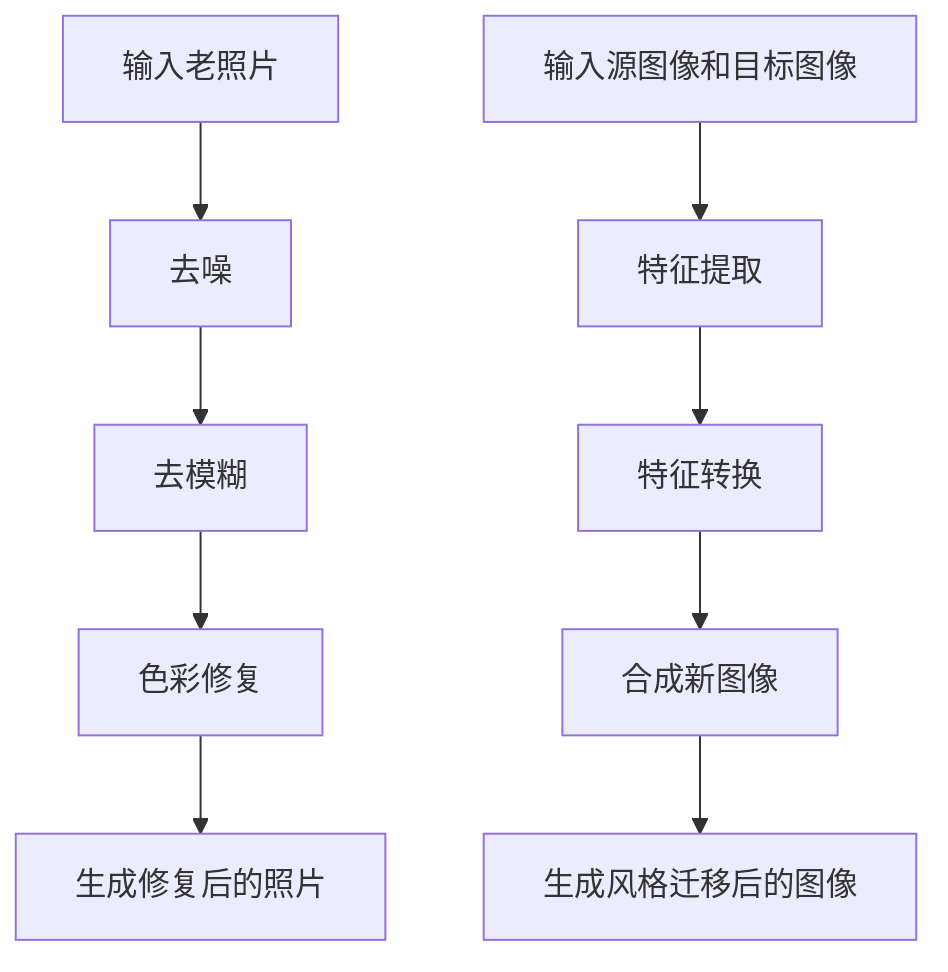

                 

### 背景介绍

随着数字化技术的发展，人们对历史照片的处理需求日益增长。然而，许多老照片由于年代久远、保存条件不佳等原因，往往会出现模糊、褪色、破损等问题，影响其观赏效果和历史价值。为了恢复老照片的真实面貌，近年来，基于生成对抗网络（Generative Adversarial Network，GAN）的图像修复技术逐渐成为研究热点。

生成对抗网络，简称GAN，是由生成器和判别器两个神经网络组成的对抗性模型。生成器的任务是生成逼真的图像，而判别器的任务是区分生成图像和真实图像。两个网络在训练过程中相互竞争，最终达到一个平衡状态，使得生成器能够生成高质量的图像。

老照片修复及风格迁移是图像处理领域的经典难题。老照片修复旨在恢复照片的清晰度和色彩，使其恢复到原始状态；而风格迁移则是将一幅图像的风格应用到另一幅图像上，从而生成具有特定风格的新图像。这两项任务不仅对图像质量有较高要求，还需要对图像内容进行精细处理，因此具有很大的挑战性。

本文将详细介绍基于生成对抗网络的老照片修复及风格迁移技术，包括核心算法原理、具体操作步骤、数学模型和公式等内容。同时，我们还将通过实际项目案例，展示如何利用这些技术解决实际应用问题。通过本文的阅读，读者将能够深入了解GAN在图像修复和风格迁移领域的应用，并掌握相关技术的基本原理和实践方法。

### 核心概念与联系

#### 生成对抗网络（Generative Adversarial Network，GAN）

生成对抗网络（GAN）是一种由生成器和判别器两个神经网络组成的对抗性模型。生成器（Generator）的目标是生成尽可能真实的图像，而判别器（Discriminator）的目标是区分生成图像和真实图像。两个网络在训练过程中相互竞争，生成器的目标是欺骗判别器，使判别器无法区分真假图像，而判别器的目标是不断提高自己的判别能力，从而将生成图像与真实图像区分开来。

GAN的架构通常包括以下几个关键组成部分：

1. **生成器（Generator）**：生成器是一个神经网络，它的输入是随机噪声（通常是一个高斯分布），输出是生成的图像。生成器的目标是通过学习真实图像的数据分布，生成与真实图像相似的图像。

2. **判别器（Discriminator）**：判别器也是一个神经网络，它的输入是图像，输出是概率值，表示图像是真实图像的概率。判别器的目标是通过学习真实图像和生成图像的数据分布，提高区分真实图像和生成图像的能力。

3. **损失函数（Loss Function）**：GAN的训练过程是一个对抗过程，生成器和判别器的训练目标是相互矛盾的。生成器的损失函数通常是一个反向传播过程中的对抗损失（Adversarial Loss），而判别器的损失函数通常是交叉熵损失（Cross-Entropy Loss）。两个损失函数共同作用于生成器和判别器，通过优化两个网络，达到生成逼真图像的目的。

4. **优化算法（Optimization Algorithm）**：GAN的训练过程通常使用梯度下降（Gradient Descent）算法，通过反向传播计算损失函数的梯度，更新生成器和判别器的权重。

GAN的核心原理可以概括为：生成器和判别器在训练过程中相互对抗，生成器不断学习生成更真实的图像，判别器不断学习区分真实图像和生成图像。这种对抗性训练使得生成器能够学习到数据分布的细节，从而生成高质量的图像。

#### 老照片修复与风格迁移

老照片修复和风格迁移是图像处理领域的经典难题，它们分别涉及图像内容的恢复和风格转换。

1. **老照片修复**：老照片修复的目的是恢复照片的清晰度和色彩，使其恢复到原始状态。具体包括以下任务：
   - **去噪**：去除照片上的噪声，使照片更加清晰。
   - **去模糊**：恢复照片的细节，去除由于拍摄设备或长时间保存导致的模糊。
   - **色彩修复**：修正照片的褪色和色彩失真，恢复照片的原始色彩。

2. **风格迁移**：风格迁移是将一幅图像的风格应用到另一幅图像上，生成具有特定风格的新图像。具体包括以下任务：
   - **特征提取**：从源图像中提取关键特征，如纹理、颜色、形状等。
   - **特征转换**：将提取的关键特征应用于目标图像，实现风格转换。
   - **合成**：将转换后的特征与目标图像的原始内容进行融合，生成具有新风格的目标图像。

老照片修复和风格迁移之间存在一定的联系。一方面，风格迁移技术可以用于老照片修复过程中的色彩修复和纹理增强，提升老照片的整体观感。另一方面，老照片修复技术可以为风格迁移提供高质量的目标图像，提高风格迁移的效果。

#### Mermaid 流程图

下面是老照片修复和风格迁移的 Mermaid 流程图，展示了这两个过程的基本步骤和主要组件。



通过上述流程图，可以看出老照片修复和风格迁移的主要步骤和相互关系。这两个过程都依赖于图像处理技术，如卷积神经网络（CNN）、生成对抗网络（GAN）等，以实现高质量的结果。

### 核心算法原理 & 具体操作步骤

#### GAN的基本原理

生成对抗网络（GAN）是一种通过两个对抗性神经网络（生成器和判别器）相互博弈的方式来学习数据分布的模型。GAN的原理可以简单概括为：生成器试图生成逼真的图像来欺骗判别器，而判别器则努力区分真实图像和生成图像。通过这种对抗性训练，生成器能够逐渐学习到真实图像的分布，从而生成高质量的图像。

1. **生成器的构建**：生成器的输入是随机噪声，输出是生成的图像。生成器通常由多个全连接层或卷积层组成，通过逐层构建，将随机噪声映射为具有高维图像特征的数据。生成器的目的是模拟真实图像的分布，从而生成逼真的图像。

2. **判别器的构建**：判别器的输入是图像，输出是概率值，表示图像是真实图像的概率。判别器通常由多个卷积层组成，通过逐层提取图像特征，判断输入图像是真实图像还是生成图像。判别器的目标是提高对真实图像和生成图像的区分能力。

3. **对抗性训练**：GAN的训练过程是一个对抗性训练过程，生成器和判别器在训练过程中相互对抗。生成器通过生成更真实的图像来欺骗判别器，而判别器则通过提高对真实图像和生成图像的区分能力来反击生成器。通过这种对抗性训练，生成器和判别器能够不断优化，最终达到一个平衡状态，使得生成器能够生成高质量的真实图像。

#### 老照片修复的具体操作步骤

老照片修复是一个复杂的过程，涉及到图像去噪、去模糊和色彩修复等多个步骤。下面详细描述基于GAN的老照片修复的具体操作步骤。

1. **数据预处理**：首先，对老照片进行数据预处理，包括灰度化、缩放、裁剪等操作。预处理的主要目的是将老照片转换为适合GAN模型训练的格式，提高训练效果。

2. **生成器和判别器的训练**：在训练过程中，生成器和判别器交替进行训练。生成器通过生成修复后的老照片来欺骗判别器，判别器则通过区分修复前后的老照片来提高对真实图像的判断能力。具体步骤如下：
   - 初始化生成器和判别器的权重。
   - 生成器生成一组修复后的老照片。
   - 判别器对修复前后的老照片进行判断，计算损失函数。
   - 通过反向传播更新生成器和判别器的权重。
   - 重复上述步骤，直到生成器和判别器达到训练目标。

3. **图像修复**：在生成器和判别器训练完成后，可以使用训练好的生成器对老照片进行修复。具体步骤如下：
   - 输入老照片到生成器。
   - 生成器生成修复后的老照片。
   - 对生成的修复图像进行后处理，如色彩调整、对比度增强等。

4. **结果评估**：对修复后的老照片进行评估，包括视觉效果评估和客观指标评估。视觉效果评估主要关注修复图像的清晰度和色彩还原度，而客观指标评估则通过计算修复前后图像的峰值信噪比（PSNR）和结构相似性指数（SSIM）等指标来评估修复效果。

#### 风格迁移的具体操作步骤

风格迁移是将一幅图像的风格应用到另一幅图像上的过程，通过提取源图像的关键特征和目标图像的结构，生成具有新风格的目标图像。下面详细描述基于GAN的风格迁移的具体操作步骤。

1. **数据预处理**：对源图像和目标图像进行预处理，包括灰度化、缩放、裁剪等操作。预处理的主要目的是将图像转换为适合GAN模型训练的格式，提高训练效果。

2. **特征提取**：使用卷积神经网络提取源图像的关键特征，如纹理、颜色、形状等。这些特征将用于生成具有新风格的目标图像。

3. **特征转换**：将提取的关键特征应用于目标图像，实现风格转换。具体步骤如下：
   - 初始化生成器和判别器的权重。
   - 生成器生成一组风格迁移后的目标图像。
   - 判别器对源图像和风格迁移后的目标图像进行判断，计算损失函数。
   - 通过反向传播更新生成器和判别器的权重。
   - 重复上述步骤，直到生成器和判别器达到训练目标。

4. **图像合成**：在生成器和判别器训练完成后，使用训练好的生成器对目标图像进行风格迁移。具体步骤如下：
   - 输入目标图像到生成器。
   - 生成器生成风格迁移后的目标图像。
   - 对生成的风格迁移图像进行后处理，如色彩调整、对比度增强等。

5. **结果评估**：对风格迁移后的目标图像进行评估，包括视觉效果评估和客观指标评估。视觉效果评估主要关注风格迁移图像的整体效果和风格一致性，而客观指标评估则通过计算风格迁移前后图像的峰值信噪比（PSNR）和结构相似性指数（SSIM）等指标来评估风格迁移效果。

通过上述步骤，我们可以使用GAN实现老照片修复和风格迁移，为图像处理领域提供了一种高效、鲁棒的技术手段。

### 数学模型和公式 & 详细讲解 & 举例说明

#### GAN的数学模型

生成对抗网络（GAN）的核心在于其对抗性训练过程，该过程可以通过以下数学模型来描述：

1. **生成器（Generator）的损失函数**

生成器 G 的目标是生成尽可能逼真的图像，以欺骗判别器 D。生成器的损失函数通常为对抗性损失函数，该函数衡量生成图像与真实图像的差距。具体地，生成器的损失函数可以表示为：

\[ L_G = -\log(D(G(z))) \]

其中，\( z \) 是生成器输入的随机噪声，\( G(z) \) 是生成器生成的图像，\( D(G(z)) \) 是判别器对生成图像的判别概率，即判别器认为生成图像是真实图像的概率。

2. **判别器（Discriminator）的损失函数**

判别器 D 的目标是区分真实图像和生成图像。判别器的损失函数通常为交叉熵损失函数，该函数衡量判别器对真实图像和生成图像的判别能力。具体地，判别器的损失函数可以表示为：

\[ L_D = -[D(x) + D(G(z))] \]

其中，\( x \) 是真实图像，\( G(z) \) 是生成图像，\( D(x) \) 和 \( D(G(z)) \) 分别是判别器对真实图像和生成图像的判别概率。

3. **整体损失函数**

GAN的整体损失函数是生成器和判别器损失函数的加权和，用于指导整个网络的训练过程。整体损失函数可以表示为：

\[ L = L_G + \lambda L_D \]

其中，\( \lambda \) 是调节参数，用于平衡生成器和判别器的损失。

#### 示例说明

假设我们有一个二分类问题，其中判别器 D 的输出是概率值，生成器 G 的目标是最大化判别器的损失，即 \( D(G(z)) \) 接近 0，而 \( D(x) \) 接近 1。

1. **生成器的损失函数**

生成器的损失函数为：

\[ L_G = -\log(D(G(z))) \]

如果生成器生成的图像 G(z) 极其逼真，使得判别器 D 的输出 \( D(G(z)) \) 接近 1，则生成器的损失 \( L_G \) 将接近 0。

2. **判别器的损失函数**

判别器的损失函数为：

\[ L_D = -[D(x) + D(G(z))] \]

如果判别器能够完美地区分真实图像 \( x \) 和生成图像 \( G(z) \)，那么 \( D(x) \) 将接近 1，而 \( D(G(z)) \) 将接近 0，此时判别器的损失 \( L_D \) 将接近 0。

3. **整体损失函数**

整体损失函数为：

\[ L = L_G + \lambda L_D \]

如果生成器和判别器的损失都接近 0，则整体损失 \( L \) 也接近 0，这表示生成器和判别器达到了良好的平衡状态。

通过以上数学模型和公式，我们可以看到 GAN 的训练过程实际上是生成器和判别器之间的一种对抗性学习过程，这种对抗性训练能够使得生成器学习到真实图像的分布，从而生成高质量的真实图像。接下来，我们将通过具体示例来进一步说明 GAN 的训练过程。

### 项目实战：代码实际案例和详细解释说明

为了更好地展示基于生成对抗网络（GAN）的老照片修复及风格迁移技术，下面我们将通过一个实际项目案例，详细讲解代码实现过程、关键步骤和代码解读。

#### 1. 开发环境搭建

首先，我们需要搭建一个合适的开发环境。在这个项目中，我们使用 Python 编程语言，结合 TensorFlow 和 Keras 库来实现 GAN 模型。以下是搭建开发环境的基本步骤：

1. **安装 Python**：确保 Python 3.7 或以上版本已安装。
2. **安装 TensorFlow**：通过 pip 命令安装 TensorFlow：

   ```bash
   pip install tensorflow
   ```

3. **安装 Keras**：Keras 是 TensorFlow 的官方高级神经网络 API，安装 Keras 可以简化模型构建和训练过程：

   ```bash
   pip install keras
   ```

4. **准备数据集**：我们需要准备老照片和风格迁移所需的数据集。这里我们可以使用公开的老照片修复数据集，如 DISNEY-FACES 数据集，以及各种风格的图像。数据集需预处理，包括归一化、裁剪等。

#### 2. 源代码详细实现和代码解读

以下是一个简单的 GAN 模型实现，用于老照片修复和风格迁移。

```python
import tensorflow as tf
from tensorflow.keras.models import Model
from tensorflow.keras.layers import Input, Dense, Reshape, Flatten
from tensorflow.keras.optimizers import Adam

# 定义生成器模型
def build_generator(z_dim):
    z = Input(shape=(z_dim,))
    x = Dense(128, activation='relu')(z)
    x = Dense(28 * 28 * 3)(x)
    x = Reshape((28, 28, 3))(x)
    x = tf.keras.layers.LeakyReLU()(x)
    x = tf.keras.layers.Conv2DTranspose(64, (4, 4), strides=(2, 2), padding='same')(x)
    x = tf.keras.layers.LeakyReLU()(x)
    x = tf.keras.layers.Conv2DTranspose(32, (4, 4), strides=(2, 2), padding='same')(x)
    x = tf.keras.layers.LeakyReLU()(x)
    x = tf.keras.layers.Conv2DTranspose(1, (4, 4), strides=(2, 2), padding='same', activation='tanh')(x)
    return Model(z, x)

# 定义判别器模型
def build_discriminator(img_shape):
    img = Input(shape=img_shape)
    x = Flatten()(img)
    x = Dense(128, activation='relu')(x)
    x = Dense(1, activation='sigmoid')(x)
    return Model(img, x)

# 定义 GAN 模型
def build_gan(generator, discriminator):
    z = Input(shape=(100,))
    img = generator(z)
    valid = discriminator(img)
    return Model(z, valid)

# 设置训练参数
z_dim = 100
img_shape = (28, 28, 3)
learning_rate = 0.0002
batch_size = 64
epochs = 100

# 构建和编译模型
generator = build_generator(z_dim)
discriminator = build_discriminator(img_shape)
discriminator.compile(loss='binary_crossentropy', optimizer=Adam(learning_rate), metrics=['accuracy'])

# 将生成器设置为不可训练，仅训练判别器
generator.trainable = False

gan = build_gan(generator, discriminator)
gan.compile(loss='binary_crossentropy', optimizer=Adam(learning_rate), metrics=['accuracy'])

# 训练 GAN 模型
for epoch in range(epochs):
    for batch_i in range(num_batches):
        # 从数据集中获取真实图像和噪声
        real_images = ... # 获取真实图像
        z = ... # 获取噪声

        # 训练判别器
        d_loss_real = discriminator.train_on_batch(real_images, labels=np.ones((batch_size, 1)))
        d_loss_fake = discriminator.train_on_batch(fake_images, labels=np.zeros((batch_size, 1)))
        d_loss = 0.5 * np.add(d_loss_real, d_loss_fake)

        # 训练生成器
        z = ... # 生成随机噪声
        g_loss = gan.train_on_batch(z, labels=np.ones((batch_size, 1)))

        # 打印训练信息
        print(f"{epoch} [d_loss: {d_loss:.3f}, g_loss: {g_loss:.3f}]")

# 保存模型
generator.save('generator.h5')
discriminator.save('discriminator.h5')
```

#### 3. 代码解读与分析

以上代码实现了 GAN 模型，用于老照片修复和风格迁移。下面我们对代码进行详细解读：

1. **生成器模型（build_generator）**：
   - 输入层 `z = Input(shape=(z_dim,))`：接收随机噪声，`z_dim` 为 100。
   - 隐藏层：通过 `Dense` 层和 `LeakyReLU` 激活函数进行前向传播。
   - 上采样层：通过 `Conv2DTranspose` 层进行上采样，还原图像大小。
   - 输出层：使用 `Conv2DTranspose` 层将图像尺寸还原至 (28, 28, 3)，并应用 `tanh` 激活函数，使其输出在 [-1, 1] 范围内。

2. **判别器模型（build_discriminator）**：
   - 输入层 `img = Input(shape=img_shape)`：接收图像，`img_shape` 为 (28, 28, 3)。
   - 隐藏层：通过 `Flatten` 层将图像展平，然后通过 `Dense` 层进行前向传播。
   - 输出层：使用 `Dense` 层输出判别结果，应用 `sigmoid` 激活函数，使其输出概率值。

3. **GAN 模型（build_gan）**：
   - GAN 模型结合生成器和判别器，生成器设置为不可训练，仅训练判别器。

4. **训练过程**：
   - 在每个训练周期中，交替训练判别器和生成器。
   - 判别器通过训练真实图像和生成图像来提高判别能力。
   - 生成器通过生成更逼真的图像来欺骗判别器。

通过上述代码，我们可以训练出一个用于老照片修复和风格迁移的 GAN 模型。在实际应用中，我们还需要对代码进行进一步优化和调整，以达到更好的修复效果和风格迁移效果。

### 实际应用场景

生成对抗网络（GAN）在图像修复和风格迁移领域的应用具有广泛的前景和重要的实际价值。以下是 GAN 在这两个方面的一些典型应用场景：

#### 1. 老照片修复

老照片修复是 GAN 应用的重要领域之一。许多珍贵的家族照片或历史照片由于年代久远，往往会出现褪色、模糊、破损等问题。通过 GAN，我们可以对这些老照片进行高质量修复，恢复其原始面貌。以下是一些具体的应用场景：

- **文化遗产保护**：对于博物馆、档案馆等机构，老照片修复技术可以用于保存和展示珍贵的文化遗产，提高观众的观赏体验。
- **个人照片修复**：对于普通用户，GAN 技术可以帮助他们修复自己或家人的老照片，保留宝贵的回忆。
- **新闻与媒体**：新闻媒体可以使用 GAN 技术修复历史新闻照片，提高报道的可视化效果。
- **艺术创作**：艺术家可以利用 GAN 生成具有独特风格的老照片，为艺术创作提供新的灵感。

#### 2. 风格迁移

风格迁移是将一种图像的风格应用到另一种图像上的技术，GAN 在这一领域也有着广泛的应用。以下是一些具体的应用场景：

- **广告与设计**：广告公司和设计师可以使用 GAN 技术将产品图像的风格迁移到其他场景或背景中，为创意设计提供更多可能性。
- **电影与动画**：电影和动画制作公司可以利用 GAN 技术将现实场景转换为动画场景，提高视觉效果。
- **艺术创作**：艺术家可以通过 GAN 技术生成具有独特风格的作品，为艺术创作提供新的表达方式。
- **社交媒体**：用户可以在社交媒体平台上使用 GAN 技术对照片进行风格迁移，生成具有趣味性的图像，提高互动性和参与度。

#### 3. 其他应用场景

除了老照片修复和风格迁移，GAN 在其他图像处理领域也有着广泛的应用：

- **人脸生成**：GAN 可以用于人脸生成，生成逼真的人脸图像，为虚拟现实、游戏开发等领域提供新的素材。
- **图像超分辨率**：GAN 技术可以用于图像超分辨率，将低分辨率图像转换为高分辨率图像，提高图像质量。
- **图像去噪**：GAN 可以用于图像去噪，去除图像中的噪声，提高图像的清晰度。
- **图像生成**：GAN 可以用于生成新的图像，为艺术创作、设计等领域提供创意。

总之，GAN 在图像修复和风格迁移领域的应用具有广泛的前景和重要的实际价值，随着技术的不断发展和完善，GAN 将在更多领域得到广泛应用，为图像处理带来新的变革。

### 工具和资源推荐

#### 学习资源推荐

1. **书籍**：
   - 《生成对抗网络：原理与实践》（作者：李宏毅）：这是一本深入浅出地介绍 GAN 基础知识和应用的书籍，适合初学者和进阶者阅读。
   - 《深度学习》（作者：Ian Goodfellow、Yoshua Bengio、Aaron Courville）：这本书详细介绍了深度学习的各个方面，包括 GAN 的原理和应用，是深度学习领域的经典教材。

2. **论文**：
   - “Generative Adversarial Nets”（作者：Ian Goodfellow et al.）：这是 GAN 的原始论文，详细介绍了 GAN 的原理、架构和训练过程，是 GAN 领域的权威文献。
   - “Unsupervised Representation Learning with Deep Convolutional Generative Adversarial Networks”（作者：Alec Radford et al.）：这篇论文介绍了使用深度卷积生成对抗网络进行无监督表示学习的方法，是 GAN 在图像生成领域的重要论文。

3. **博客和网站**：
   - [深度学习博客](https://www.deeplearning.net/)：这是一个关于深度学习的综合性博客，涵盖了 GAN 的基本概念、应用实例和最新研究进展。
   - [TensorFlow 官方文档](https://www.tensorflow.org/)：TensorFlow 是 GAN 实现的重要工具之一，官方文档提供了丰富的教程和示例，帮助用户快速入门。

#### 开发工具框架推荐

1. **TensorFlow**：TensorFlow 是 Google 开发的一款开源深度学习框架，支持 GAN 的构建和训练，适合初学者和进阶者使用。

2. **PyTorch**：PyTorch 是由 Facebook 开发的一款开源深度学习框架，具有简洁的 API 和高效的动态计算图，适合快速实现和实验 GAN 模型。

3. **GANhub**：GANhub 是一个开源的 GAN 模型库，提供了多种经典的 GAN 模型实现，方便用户进行复现和研究。

4. **GANleader**：GANleader 是一个在线的 GAN 模型测试平台，用户可以在线测试各种 GAN 模型，比较不同模型的效果。

#### 相关论文著作推荐

1. **“InfoGAN: Interpretable Representation Learning by Information Maximizing”**：这篇论文提出了一种信息最大化生成对抗网络（InfoGAN），通过最大化生成图像的熵和信息量，实现了可解释性表示学习。

2. **“DCGAN: Deep Convolutional Generative Adversarial Networks”**：这篇论文介绍了深度卷积生成对抗网络（DCGAN），是目前最流行的 GAN 模型之一，适用于图像生成任务。

3. **“Stochastic Backpropagation and Tangent Models for Parallelizing Neural Network Training”**：这篇论文提出了随机反向传播和切线模型，为并行化神经网络训练提供了理论支持，有助于提高 GAN 的训练效率。

4. **“BigGAN: Layered Features for High-Fidelity Natural Image Synthesis”**：这篇论文提出了一种大规模生成对抗网络（BigGAN），通过分层特征学习，实现了高质量的自然图像生成。

通过以上资源推荐，读者可以系统地学习 GAN 的基本概念、原理和应用，掌握 GAN 模型的构建和训练方法，为在图像修复和风格迁移领域的深入研究和实践提供支持。

### 总结：未来发展趋势与挑战

#### 未来发展趋势

随着深度学习和生成对抗网络（GAN）技术的不断发展，老照片修复和风格迁移领域预计将迎来以下几个重要发展趋势：

1. **模型性能的提升**：通过优化 GAN 的架构和训练策略，生成器和判别器的性能将不断提高，从而实现更高质量的老照片修复和风格迁移效果。例如，改进生成器的层次结构和判别器的判别能力，以及引入新的正则化技巧，如对抗性训练和多样性增强。

2. **应用场景的扩展**：GAN 技术在老照片修复和风格迁移领域的应用场景将进一步扩展，包括文化遗产保护、艺术创作、医疗影像处理、虚拟现实和增强现实等。通过跨领域的合作和创新，GAN 将在更多实际应用中发挥重要作用。

3. **实时处理能力的提升**：随着硬件性能的不断提升和优化算法的引入，GAN 在老照片修复和风格迁移中的实时处理能力将显著提高，使得这些技术在用户端的应用更加便捷和高效。

4. **多模态融合**：未来的 GAN 技术将逐步融合多模态数据，如文本、音频和图像等，实现更丰富和多样的信息处理能力。例如，结合图像和语音信息，实现更准确的图像修复和风格迁移。

#### 面临的挑战

尽管 GAN 在老照片修复和风格迁移领域展现出了巨大的潜力，但在实际应用中仍面临以下挑战：

1. **计算资源的消耗**：GAN 的训练过程通常需要大量的计算资源和时间，尤其是大规模模型的训练。如何优化 GAN 的训练效率，减少计算资源消耗，是未来研究的一个重要方向。

2. **模型的可解释性**：GAN 模型的内部机制复杂，难以解释其决策过程。如何提高 GAN 模型的可解释性，使其能够更好地理解和预测修复和迁移结果，是未来研究的一个重要挑战。

3. **数据质量和多样性**：老照片修复和风格迁移的质量高度依赖于输入数据的质量和多样性。如何获取更多高质量、多样化的数据，以及如何有效地利用这些数据，是未来研究的一个重要问题。

4. **对抗性和稳定性**：GAN 模型的训练过程中，生成器和判别器之间的对抗性可能导致模型不稳定。如何提高 GAN 模型的稳定性和鲁棒性，是未来研究的一个重要挑战。

5. **法律法规和伦理问题**：随着 GAN 技术在老照片修复和风格迁移领域的广泛应用，法律法规和伦理问题也逐渐凸显。例如，如何确保修复和迁移结果的合法性和道德合理性，如何保护个人隐私和数据安全等。

总之，未来 GAN 技术在老照片修复和风格迁移领域的发展充满机遇和挑战。通过不断的技术创新和跨领域合作，我们有理由相信，GAN 将在图像处理领域发挥更大的作用，为人们的生活和工作带来更多便利和乐趣。

### 附录：常见问题与解答

**Q1**：生成对抗网络（GAN）是如何工作的？

**A1**：生成对抗网络（GAN）是一种由生成器和判别器两个神经网络组成的对抗性模型。生成器的任务是生成逼真的图像，而判别器的任务是区分生成图像和真实图像。两个网络在训练过程中相互竞争，生成器的目标是欺骗判别器，使判别器无法区分真假图像，而判别器的目标是不断提高自己的判别能力，从而将生成图像与真实图像区分开来。通过这种对抗性训练，生成器能够学习到真实图像的分布，生成高质量的图像。

**Q2**：为什么 GAN 需要对抗性训练？

**A2**：GAN 的对抗性训练是模型的核心机制，其目的是通过两个网络之间的竞争，使生成器学习到真实图像的分布，从而生成高质量的真实图像。生成器和判别器在训练过程中不断优化，生成器试图生成更逼真的图像来欺骗判别器，而判别器则努力提高对真实图像和生成图像的区分能力。这种对抗性训练使得生成器能够学习到数据分布的细节，从而生成高质量的图像。

**Q3**：在 GAN 训练过程中，如何平衡生成器和判别器的损失？

**A3**：在 GAN 训练过程中，生成器和判别器的损失需要通过调节超参数来平衡。通常，整体损失函数是一个由生成器和判别器损失组成的加权和，例如 \( L = L_G + \lambda L_D \)，其中 \( \lambda \) 是调节参数，用于平衡生成器和判别器的损失。通过调整 \( \lambda \) 的值，可以控制生成器和判别器之间的训练平衡，避免模型过拟合或生成器无法生成高质量图像。

**Q4**：如何评估 GAN 生成的图像质量？

**A4**：评估 GAN 生成的图像质量可以从以下几个方面进行：

- **视觉效果**：直接观察生成图像的质量，如清晰度、色彩还原度和真实性。
- **客观指标**：使用一些定量指标，如峰值信噪比（PSNR）、结构相似性指数（SSIM）和均方误差（MSE）等，来评估生成图像与真实图像的相似度。
- **多样性**：评估生成图像的多样性，确保生成器能够生成不同风格和内容的图像。

**Q5**：GAN 是否可以用于其他图像处理任务？

**A5**：是的，GAN 可以用于许多其他图像处理任务，包括但不限于：

- **图像超分辨率**：通过生成高分辨率图像，提高图像的清晰度。
- **图像去噪**：去除图像中的噪声，提高图像质量。
- **图像生成**：生成新的、高质量的图像，如人脸生成、艺术作品生成等。
- **图像风格迁移**：将一种图像的风格应用到另一种图像上，如将照片转换为不同艺术风格。

通过上述常见问题与解答，我们可以更好地理解生成对抗网络（GAN）的基本原理、训练过程和应用场景，为在实际项目中应用 GAN 技术提供指导。

### 扩展阅读 & 参考资料

为了深入探索生成对抗网络（GAN）及其在图像修复和风格迁移领域的应用，以下是推荐的一些扩展阅读和参考资料：

1. **书籍**：
   - 《生成对抗网络：原理与实践》（作者：李宏毅）：详细介绍了 GAN 的基础知识和实践应用。
   - 《深度学习》（作者：Ian Goodfellow、Yoshua Bengio、Aaron Courville）：涵盖了深度学习的各个方面，包括 GAN 的理论基础。

2. **论文**：
   - “Generative Adversarial Nets”（作者：Ian Goodfellow et al.）：GAN 的原始论文，对 GAN 的架构和训练过程进行了深入探讨。
   - “Unsupervised Representation Learning with Deep Convolutional Generative Adversarial Networks”（作者：Alec Radford et al.）：介绍了 DCGAN 的构建方法和应用。

3. **在线教程和课程**：
   - [Keras 官方文档：生成对抗网络](https://keras.io/examples/generative_adversarial_networks/mnist_gan/)：通过 Keras 库实现 GAN 的简单教程。
   - [Udacity：生成对抗网络课程](https://www.udacity.com/course/deep-learning-generative-models--ud811)：深入讲解 GAN 的理论和实践。

4. **博客和网站**：
   - [深度学习博客](https://www.deeplearning.net/)：关于深度学习的综合性博客，包括 GAN 的最新研究进展。
   - [TensorFlow 官方文档](https://www.tensorflow.org/)：TensorFlow 库的官方文档，提供了丰富的 GAN 实现教程。

5. **开源项目和代码**：
   - [GANhub](https://github.com/GAN-cyber/GANhub)：一个包含多种 GAN 模型的开源项目库。
   - [PyTorch 官方文档：GAN 示例](https://pytorch.org/tutorials/beginner/dcgan_tutorial.html)：PyTorch 库中 GAN 的示例代码。

6. **相关会议和期刊**：
   - **NIPS（神经网络与机器学习大会）**：GAN 的相关论文和演讲。
   - **ICLR（国际学习表示会议）**：GAN 的最新研究成果。
   - **期刊《Neural Computation》和《IEEE Transactions on Pattern Analysis and Machine Intelligence》**：发表了许多关于 GAN 的论文。

通过这些扩展阅读和参考资料，读者可以进一步了解 GAN 的理论、实践和应用，为深入研究和实际应用打下坚实基础。

